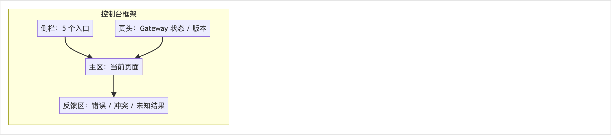
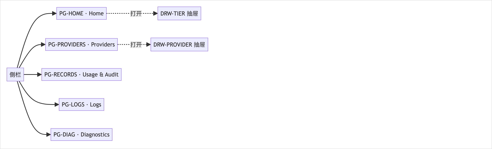
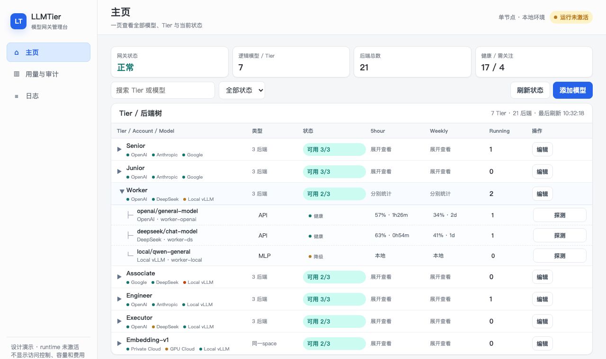
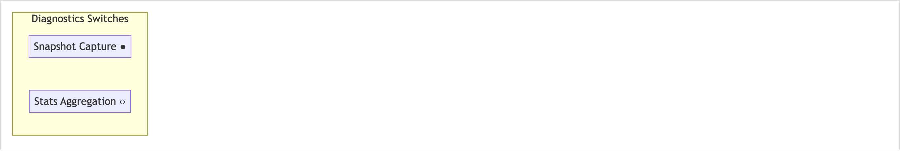

<!-- STD_DOCUMENT_COVER_BEGIN -->
# LLMTier M002 Web UI 模块设计

> STD 使用入口：[项目采用说明与标准导航](../../../README.md#std-entry)

| 文档字段 | 值 |
|---|---|
| Document ID | `web-ui` |
| Document Version | `0.1.0-draft.1` |
| Status | `Draft` |
| Project | `LLMTier` |
| Authority | `LLMTier` |
| Document Owner | LLMTier |
| Authors | llmtier |
| Created Date | `2026-09-23` |
| Last Modified Date | `2026-09-23` |
| Template ID | `design.definition` |
| Template Version | `2.3.0` |
| Template Conformance | `tailored` |
| Tailoring Reference | `std-tailoring` |
| Migration Map Reference | none |
| Repository | `corezilla/LLMTier` |
| Canonical Path | `docs/40_module_design/web-ui-design.md` |
| Supersedes | none |
<!-- STD_DOCUMENT_COVER_END -->

## 1. 单元摘要：为什么存在

| 项目 | 内容 |
|---|---|
| 模块编号 / 正式英文名称 | **M002** / Web UI |
| 直属父对象编号 / 名称 | LLMTier 软件系统（本项目无子系统）|
| 父设计 Document ID / 登记位置 | `llmtier-system-design` / 系统设计 §3.2（唯一登记表）|
| 上级系统 / 父单元 | LLMTier 软件系统 |
| 解决的问题 | 为 operator 提供图形化控制台，把管理面（配置、用量、审计、日志、诊断）从命令行解放出来，降低运维误操作 |
| 提供的能力 | 五个英文短页（Home / Providers / Usage & Audit / Logs / Diagnostics）+ Tier 成员编辑抽屉 + 诊断 4 tabs + 全局调试开关；同源调用 `/v1` |
| 主要使用者 | Operator（浏览器）|
| 不负责 | 不直读 SQLite/settings/Secret；不承载推理；不实现账号库或访问控制；不提供容量/恢复/费用/调用方页面；不新增认证路径 |

## 2. 需求、功能与验收条件

每个功能用固定字段列出（调用方 / 输入 / 行为 / 输出 / 错误 / 验收）。来源：系统设计 §4.3 Page ID 与机制 §14.4。

### 2.1 F-UI-HOME · 主页（PG-HOME）
- **调用方**：Operator
- **输入**：打开 Home
- **行为**：读 `/healthz`·`/readyz` + registry + `/v1/runtime` + `/v1/usage`，渲染 Tier 两层树
- **输出**：两层树（Tier → 后端）+ 页头全局状态
- **错误**：401 跳登录 / 403 无权限 / 503 stale
- **验收**：Tier 状态取自 `/readyz.models[].availability`；成员状态独立（不互相覆盖）

### 2.2 F-UI-TIER-EDIT · 等级成员编辑（DRW-TIER）
- **调用方**：Operator
- **输入**：Tier 抽屉操作
- **行为**：GET item 存 ETag → POST Deployment / PATCH service-level（带 `If-Match`）
- **输出**：配置落库 + 新 ETag
- **错误**：409 引用 / 412 stale
- **验收**：保存成功 ≠ probe/health 成功；两步失败不谎称原子

### 2.3 F-UI-PAUSE · 后端暂停/恢复
- **调用方**：Operator
- **输入**：后端行 Pause / Resume
- **行为**：用 Deployment partial PATCH 切 `enabled` + `If-Match`
- **输出**：状态变更
- **错误**：412
- **验收**：Pause 不取消已开始请求；`running>0` 前须确认

### 2.4 F-UI-PROVIDERS · 供应商管理（PG-PROVIDERS）
- **调用方**：Operator
- **输入**：Providers 页操作
- **行为**：列 provider + Secret 是否配置 + 账号用量 + `running/max`
- **输出**：Provider 表
- **错误**：409 引用
- **验收**：Calls/Tokens 只聚合最高 Usage 版本；未知不填 0

### 2.5 F-UI-PROBE · 显式探测
- **调用方**：Operator
- **输入**：点“探测”
- **行为**：二次确认后 POST 探活（`confirm_external_call=true`）
- **输出**：探测结果
- **错误**：—
- **验收**：未确认不触网；未知结果不自动重复

### 2.6 F-UI-RECORDS · 用量与审计（PG-RECORDS）
- **调用方**：Operator
- **输入**：页签切换 / 翻页
- **行为**：GET `/v1/usage`、`/v1/audit`（一次只显示一张表）
- **输出**：表
- **错误**：503 显示“存储不可用”，不显示空表
- **验收**：同 request 只显示最高版本；Unknown ≠ 0；不显示 Cost

### 2.7 F-UI-LOGS · 运行日志（PG-LOGS）
- **调用方**：Operator
- **输入**：时间/级别/模块/request_id 过滤
- **行为**：GET `/v1/logs`
- **输出**：脱敏日志表
- **错误**：503 显式化
- **验收**：只显示已脱敏字段；不渲染 HTML

### 2.8 F-UI-DIAG · 诊断（PG-DIAG）
- **调用方**：Operator
- **输入**：4 tabs 切换 / 注入编辑
- **行为**：读 `/v1/diagnostics*`、`/v1/trace/{id}`；`PATCH` 注入配置
- **输出**：快照/统计/注入/trace 视图
- **错误**：—
- **验收**：开关关闭时对应 tab 显示 Disabled

### 2.9 F-UI-DIAG-SWITCH · 全局调试开关
- **调用方**：Operator
- **输入**：顶部 toggle
- **行为**：`PATCH /v1/diagnostics`
- **输出**：开关状态
- **错误**：—
- **验收**：状态反映 `GET /v1/diagnostics` 返回值

### 2.10 F-UI-STATES · 通用交互状态
- **调用方**：Operator
- **输入**：任意交互
- **行为**：Loading / Empty / 401 / 403 / 409 / 412 / 429 / 503 的统一呈现
- **输出**：界面反馈
- **错误**：—
- **验收**：见 §7 通用状态规则

## 3. UI、CLI 或设备操作面

Web UI 是纯浏览器控制台，无 CLI；布局基线由可切换静态 Demo 在 1280×760 视口生成（不是已接线截图）。

**页面清单（Page ID 来自系统设计 §4.3，稳定；页面不是软件模块）**

共 **5 个页面 + 2 个抽屉**。每页的目的、DOM 容器、JS 与 CSS 划分如下（HTML 只放壳与容器，交互与渲染在 `app.js`，样式在 `styles.css`）：

#### PG-HOME · Home
- **目的（用户任务）**：查看等级与后端状态、编辑等级成员
- **操作**：查看 Tier 树、编辑成员、Pause/Resume、探测（二次确认）
- **输入**：无
- **正常结果**：两层树 + 页头状态
- **Empty/Error**：Loading 骨架；空 Tier 显示 no members 且可 Edit
- **HTML 容器**：`#home`（`#tree`、`#stamp`）
- **JS（装载 / 渲染 / mutation）**：`loadHome`、`renderTree`、`toggleDeployment`、`probeDeployment`、`openTierEditor`、`renderTierMembers`、`saveMember`、`removeMember`、`addMember`、`reloadAddMemberModels`
- **CSS 区块**：`.page #home`、`.tree`、`.tiername`、`.backend`

#### PG-PROVIDERS · Providers
- **目的（用户任务）**：管理 cloud/local provider、账号用量
- **操作**：Add/Edit/Delete Provider、刷新账号用量
- **输入**：表单
- **正常结果**：Provider 表 + 编辑
- **Empty/Error**：Secret 只写不回显；编辑空白=保持
- **HTML 容器**：`#providers`（`#provider-tree`、`#provider-error`）
- **JS**：`loadProviders`、`renderProviders`、`openProviderEditor`、`saveProvider`、`deleteProvider`、`refreshProviderUsage`、`fetchProviderModels`
- **CSS 区块**：`#providers`、`.toolbar`、`.card`

#### PG-RECORDS · Usage & Audit
- **目的（用户任务）**：查 token 用量与管理审计
- **操作**：页签切 Token 用量 / 管理审计、翻页
- **输入**：时间窗 / cursor
- **正常结果**：单表
- **Empty/Error**：503 显示“存储不可用”，不显示空表
- **HTML 容器**：`#records`（子页签 `#usage-body`、`#audit-body`）
- **JS**：`loadUsage`、`loadAudit`
- **CSS 区块**：`#records`、`.tabs`、`.sub`、`.tablewrap`

#### PG-LOGS · Logs
- **目的（用户任务）**：查脱敏运行日志
- **操作**：过滤查看脱敏日志
- **输入**：时间 / 级别 / 模块 / request_id
- **正常结果**：日志表
- **Empty/Error**：503 显式化；“无日志”不伪装
- **HTML 容器**：`#logs`（`#log-body`、`#log-level`、`#log-module`）
- **JS**：`loadLogs`
- **CSS 区块**：`#logs`、`.tabs`、`.sub`

#### PG-DIAG · Diagnostics
- **目的（用户任务）**：观测查询、调试开关、注入配置
- **操作**：4 tabs（Snapshots/Stats/Injection/Trace）+ 全局开关
- **输入**：筛选 / 开关
- **正常结果**：快照 / 统计 / 注入 / trace
- **Empty/Error**：开关关闭 → tab 显示 Disabled
- **HTML 容器**：`#diag`（4 tabs：Snapshots / Stats / Injection / Trace）
- **JS**：`loadStats`、`loadTrace`、注入读写
- **CSS 区块**：`#diag`、`.tabs`

抽屉（`DRW-*`，属其宿主页面）：

#### DRW-TIER · 等级成员编辑（属 PG-HOME）
- **目的**：Tier 成员增/删/改
- **HTML 容器**：`#tier-mask`（`#tier-members`、`#add-member-form`）
- **JS**：`openTierEditor`、`renderTierMembers`、`saveMember`、`removeMember`、`addMember`

#### DRW-PROVIDER · 供应商新增/编辑（属 PG-PROVIDERS）
- **目的**：Provider 新增/编辑（Secret 只写不回显）
- **HTML 容器**：`#provider-mask`（`#provider-form`）
- **JS**：`openProviderEditor`、`saveProvider`

**HTML / CSS / JS 文件划分**：

| 文件 | 划分（放什么 / 不放什么）|
|---|---|
| `index.html` | 只放**结构壳**：侧栏导航（5 项）、页头全局状态、5 个 `<section class="page">` 与其容器 id、2 个抽屉的 `<form>`/字段、`<datalist>`。**不放**业务逻辑、不放内联数据 |
| `styles.css` | 分区：①基础与变量（`:root` 颜色、`html/body`）②框架（`.shell`/`aside`/`.brand`/`nav`/`header`/`.status-chip`）③页面（`.page`/`.active`）④组件（`.card`/`.toolbar`/`.tabs`/`.sub`/`.tablewrap`/`.pill`/`.icon-button`）⑤树（`.tiername`/`.backend`/`.metric`）⑥抽屉（`.mask`/`.drawer`）。**不**在 HTML 内联样式 |
| `app.js` | 分区：①`api()` 客户端 ②hash 路由与页面切换 ③各页 `load*`/`render*` ④mutation（`save*`/`toggle*`/`probe*`）⑤状态映射（`backendState`/`tierState`/`statusMarkup`）⑥交互状态 I9。**不**直读 DB/Secret、不落 localStorage |
| `icons.svg` | 单线图标 sprite：`<symbol id="icon-…">`，`<use href="/ui/icons.svg#icon-…">` 引用 |

**实现映射（当前 `index.html`）**：侧栏 4 项（Home / Providers / Stats / Logs），其中 Logs 含 3 个子页签（Token Usage / Audit Log / Runtime Logs）。与系统设计 §4.3 的 `PG-RECORDS`/`PG-DIAG` 尚未一一对应 → 登记 `OPEN-UI-2`（见 §15）。

**共享框架与导航**



[可编辑 SVG 源](../assets/diagrams/diagram-webui-frame.svg)

图 M002-U0 · 共享框架：窄侧栏 + 页头 + 主卡片 + 反馈条；每页共用。



[可编辑 SVG 源](../assets/diagrams/diagram-webui-nav.svg)

图 M002-U1 · 导航结构：Home / Providers / Usage / Logs / Diagnostics 五页项稳定。

**页面布局总览（Page ID 稳定）**


[可编辑 SVG 源](../assets/diagrams/webui-page-layouts.svg)

图 M002-U2 · 五页布局总览：仅表达布局分区，颜色/字体/像素交实现。

**各页视图（Demo 在 1280×760 视口生成，布局与信息层级基线；非已接线截图）**


图 M002-U3 · Home（Tier 树 + 抽屉）


图 M002-U4 · Tier 成员编辑抽屉


图 M002-U5 · 用量与审计



[可编辑 SVG 源](../assets/diagrams/diagram-webui-diag-switches.svg)

图 M002-U6 · 诊断全局开关（Snapshot Capture / Stats Aggregation）

可切换静态 Demo：`docs/assets/webui-demo/index.html`；其余截图 `docs/assets/webui/{records-audit,logs}.png`。

**图标系统（§3 专用）**：只使用项目内单线 SVG `webui/icons.svg`，不从 CDN 加载、不用 emoji；颜色只是补充，语义由 `title`/`aria-label`/非颜色文字承载。核心状态语义：

| 图标 | 语义 | 图标 | 语义 |
|---|---|---|---|
| `circle-dot` | Idle（健康且无活动请求，非暂停）| `circle-pause` | Paused（暂停单 Deployment）|
| `activity` | Running（≥1 活动请求）| `gauge` | Exhausted（无可用并发槽）|
| `scan-search` | Probing | `triangle-alert` | Attention（需检查）|
| `cloud-off` | Unreachable | `circle-off` | Disabled（上级禁用）|
| `circle-help` | Unknown | `package-open` | Empty（Tier 无成员）|
| `circle-check` | Ready | | |

## 4. 外部边界与依赖

#### 依赖 1 · M001 HTTP API
- **本单元调用或消费**：同源调用全部管理面 `/v1` 与 `/healthz`、`/readyz`
- **本单元提供**：浏览器页面（同源）
- **契约**：见 OpenAPI（机器 authority）
- **timeout/失败影响**：401/403/409/412/429/503 按 §7 呈现

#### 依赖 2 · M004 Management
- **本单元调用或消费**：provider / deployment / level、审计、日志、用量查询接口
- **本单元提供**：—
- **契约**：内部 / HTTP
- **timeout/失败影响**：数据边界——后端行不虚构单模型用量

#### 依赖 3 · M005 Observability
- **本单元调用或消费**：诊断接口
- **本单元提供**：—
- **契约**：HTTP
- **timeout/失败影响**：fail-open；诊断不可用不阻塞其他页

#### 依赖 4 · operator SSO 代理（外部）
- **本单元调用或消费**：同源 TLS 反向代理注入 Admin bearer
- **本单元提供**：会话 cookie
- **契约**：`Secure; HttpOnly; SameSite=Strict`
- **timeout/失败影响**：401 跳外部登录；403 留在当前页

#### 依赖 5 · M003 Inference
- **本单元调用或消费**：—（不直连）
- **本单元提供**：—
- **契约**：—
- **timeout/失败影响**：仅经 M001

**边界**：Web UI 不读 SQLite/settings/Secret，不新增登录 endpoint/用户 Schema/第二认证路径；development 无认证代理时保持 disabled。

## 5. 内部结构与实现位置

### 5.1 内部组成

本模块是**浏览器端单页应用
 + 静态资源**，由 `M001` 的静态服务交付；无服务端逻辑。


[可编辑 SVG 源](../assets/diagrams/diagram-m002-web-ui-structure.svg)

图 M002-S1 · M002 内部结构：框架（I1）与 API 客户端（I2）为公共层，五个页面组件（I3–I7）、图标库（I8）与交互状态（I9）在其内；对 `M001 HTTP API` 只有同源调用（虚线），无服务端逻辑。

#### I1 · Frame & Nav
- **处理与协作**：窄侧栏 + 页头 + 主卡片；<960px 折叠为顶部菜单
- **输入/输出**：路由 → 框架
- **文件/symbol**：`webui/index.html`、`webui/app.js`

#### I2 · API Client
- **处理与协作**：同源 `fetch` 封装——ETag/If-Match、错误码→UI 状态、cursor 翻页
- **输入/输出**：调用 → JSON
- **文件/symbol**：`webui/app.js`

#### I3 · Page: Home
- **处理与协作**：Tier 树渲染、Tier 抽屉、Pause/Resume、探测确认
- **输入/输出**：数据 → 树/抽屉
- **文件/symbol**：`webui/app.js`（Home）

#### I4 · Page: Providers
- **处理与协作**：Provider CRUD + 账号用量刷新
- **输入/输出**：表单 → 表
- **文件/symbol**：`webui/app.js`（Providers）

#### I5 · Page: Usage & Audit
- **处理与协作**：页签 + 两表 + 冻结分页
- **输入/输出**：查询 → 表
- **文件/symbol**：`webui/app.js`

#### I6 · Page: Logs
- **处理与协作**：过滤 + 脱敏表
- **输入/输出**：查询 → 表
- **文件/symbol**：`webui/app.js`

#### I7 · Page: Diagnostics
- **处理与协作**：4 tabs + 全局开关
- **输入/输出**：查询/开关 → 视图
- **文件/symbol**：`webui/app.js`（Diagnostics）

#### I8 · Icon Set
- **处理与协作**：单线 SVG 图标（状态/操作）
- **输入/输出**：名称 → 图形
- **文件/symbol**：`webui/icons.svg`

#### I9 · Interaction States
- **处理与协作**：Loading / Empty / 401 / 403 / 409 / 412 / 429 / 503 统一处理
- **输入/输出**：状态 → UI
- **文件/symbol**：`webui/app.js`

图 A1（系统设计 §3.1）中 M002 的框即本模块边界；组件全在浏览器内，服务端仅静态交付。主流程见 §7。

### 5.2 内部调用过程（页面加载到渲染，文件 → 文件）

```text
index.html（页面壳：容器 id + 装配 styles.css / icons.svg / app.js）
 └─ app.js 初始化（hash 路由 = 页面）
      ├─ loadRegistry() / loadHome() / loadProviders()               # 各页数据装载
      │    └─ api(path, opts)        # app.js：fetch(path,{credentials:'same-origin'})
      │         └─ 失败按状态分派 → I9（401/403/409/412/429/503）
      ├─ renderTree() / renderProviders() / renderTierMembers() / loadUsage() / loadLogs() / loadStats() / loadTrace()
      │    └─ backendState() / tierState() / statusMarkup()          # 状态→图标
      └─ 用户操作 → toggleDeployment() / probeDeployment() / saveProvider() / saveMember() / removeMember() / refreshProviderUsage()
           └─ api(path,{method:'PATCH'|'POST'|'DELETE', headers:{'If-Match':etag}, body})
```

### 5.3 文件间接口契约（实现级）

每条接口给出所在文件、符号、签名与作用。

#### IF-1 `webui/index.html` · 页面壳 + 容器 `id`
- **签名**：—
- **作用**：装配 `styles.css`/`icons.svg`/`app.js`；提供各页容器

#### IF-2 `webui/app.js` · `api`
- **签名**：`(path, {method='GET', body, headers={}}) -> Promise<object>`
- **作用**：同源 `fetch` 封装（`credentials:'same-origin'`）；非 2xx 抛错交 I9

#### IF-3 `webui/app.js` · `loadRegistry` / `loadHome` / `loadProviders` / `loadUsage` / `loadLogs` / `loadStats` / `loadTrace`
- **签名**：`() -> Promise<void>`
- **作用**：各页数据装载

#### IF-4 `webui/app.js` · `renderTree` / `renderProviders` / `renderTierMembers`
- **签名**：`() -> void`
- **作用**：渲染（生成 HTML 字符串注入容器）

#### IF-5 `webui/app.js` · `backendState` / `tierState` / `statusMarkup`
- **签名**：`(…) -> string/obj`
- **作用**：状态→图标/文本

#### IF-6 `webui/app.js` · `toggleDeployment` / `probeDeployment` / `saveProvider` / `saveMember` / `removeMember` / `refreshProviderUsage`
- **签名**：`(el|event) -> Promise<void>`
- **作用**：mutation（带 `If-Match`）

#### IF-7 `webui/icons.svg` · `<symbol id="…">`
- **签名**：—
- **作用**：图标 sprite；`<use href="#…">` 引用

#### IF-8 `webui/styles.css` · 类选择器
- **签名**：—
- **作用**：布局与状态样式

### 5.4 依赖方向

`index.html` →
 `app.js`/`styles.css`/`icons.svg`；`app.js` 只经 `api()` 调 `M001`（同源 HTTP），**不直读**任何服务端文件/DB/Secret。

## 6. 数据模型、状态与 ownership

#### 页面视图状态
- **所有者 / 访问方式**：I3–I7 各自持有（内存）
- **出生与结束**：页面进入 / 刷新
- **成功 / 失败后的归属**：不持久化；刷新重建

#### 表单草稿
- **所有者 / 访问方式**：对应页面内存
- **出生与结束**：编辑开始 → 保存 / 放弃
- **成功 / 失败后的归属**：412 时保留草稿供复制后重载

#### ETag
- **所有者 / 访问方式**：I2 从 GET item 暂存
- **出生与结束**：编辑事务内
- **成功 / 失败后的归属**：变更后失效；不跨页复用

#### cursor
- **所有者 / 访问方式**：I2
- **出生与结束**：翻页内
- **成功 / 失败后的归属**：URL query（审计页）保留，可刷新恢复

#### 会话 cookie
- **所有者 / 访问方式**：**SSO 代理**（非本模块）
- **出生与结束**：代理签发 / 撤销
- **成功 / 失败后的归属**：本模块只携带，不解析、不存 token

**数据结构（前端内存对象 / 消费的响应形状）**：

#### `state`
- **产生位置**：`app.js`
- **字段（形状）**：`{registry, providers[], deployments[], usage, runtime}`
- **说明**：页面内存缓存；不持久化

#### 装载对象
- **产生位置**：`loadRegistry/loadHome/...`
- **字段（形状）**：各接口响应（字段由 OpenAPI 决定）
- **说明**：「Read」列见 §9

#### ETag
- **产生位置**：`api` / 编辑流程
- **字段（形状）**：`string`（`"<id>.v<n>"`）
- **说明**：编辑事务内暂存，`If-Match` 提交

#### 错误状态
- **产生位置**：I9
- **字段（形状）**：`{status:int, code?:string}`
- **说明**：401/403/409/412/429/503 → UI 呈现

本模块**无自有持久状态**、不写库、不落 localStorage/sessionStorage（bearer/Secret 均不入 JS）。

## 7. 主流程与数据流


[可编辑 SVG 源](../assets/diagrams/diagram-m002-web-ui-flow.svg)

图 M002-P1 · M002 内部流程：页面加载（P-UI-LOAD）与编辑保存（P-UI-EDIT）在浏览器端贯通，认证/可用性/保存三类判定及其 401/403/503/412/409 分支全部展开。

**内部流程正文**：operator 打开页面后，**I1 Frame/Nav** 先渲染框架，**I2 API Client** 通过同源 SSO 代理发起 GET。认证判定失败（401）→ 清 UI 会话并跳外部登录；通过后按数据可用性分岔——403 显示无权限且不猜存在性，503 保留旧画面并标记 stale，200 交 **I3–I7** 渲染（Tier 树 / 表 / 页签 / tabs）。进入编辑时 I2 先 GET item 存 ETag，**I3/I4** 做字段级校验，再由 I2 以 `PATCH + If-Match` 提交：412 → 提示 stale 并保留用户输入，409 → 显示引用冲突且禁强删，200 → 交 **I9** 更新视图（保存成功 ≠ health/probe 成功）。

#### P-UI-LOAD · 页面加载
- **触发/适用条件**：进入任意页面
- **图与正文位置**：本段 / 图 M002-P1；§3 布局图
- **正常出口**：I3–I7 渲染数据
- **异常出口**：401 跳登录；403 无权限；503 stale

#### P-UI-EDIT · 编辑保存
- **触发/适用条件**：Tier / Provider 编辑
- **图与正文位置**：本段 / 图 M002-P1
- **正常出口**：PATCH 成功 + 新 ETag
- **异常出口**：412 stale；409 引用；未知先 GET

#### P-UI-PAUSE · 暂停/恢复
- **触发/适用条件**：后端行 Pause / Resume
- **图与正文位置**：§3 Home
- **正常出口**：`enabled` 切换
- **异常出口**：412；`running>0` 前确认

#### P-UI-PROBE · 探测
- **触发/适用条件**：点“探测”
- **图与正文位置**：§3 Home
- **正常出口**：二次确认后 POST
- **异常出口**：未知结果不自动重复

#### P-UI-DIAG · 诊断
- **触发/适用条件**：诊断开关 / 注入
- **图与正文位置**：§3 Diagnostics
- **正常出口**：PATCH 生效
- **异常出口**：关闭 → Disabled

**P-UI-EDIT 步骤**（执行组件 / 数据形态 / 状态变化）：

#### 步骤 1 · 打开编辑
- **输入**：打开编辑
- **执行组件**：I2
- **处理/规则**：GET item，存 ETag
- **输出/交给谁**：表单初值 + ETag → I3/I4

#### 步骤 2 · 用户修改
- **输入**：用户修改
- **执行组件**：I3/I4
- **处理/规则**：字段级校验（英文错误就近）
- **输出/交给谁**：草稿（内存）

#### 步骤 3 · 保存
- **输入**：保存
- **执行组件**：I2
- **处理/规则**：PATCH + `If-Match`
- **输出/交给谁**：200 + 新 ETag → I9

#### 步骤 4 · 冲突
- **输入**：冲突
- **执行组件**：I2/I9
- **处理/规则**：412 → 提示“他人已修改”，保留输入供重载
- **输出/交给谁**：不自动覆盖

#### 步骤 5 · 引用
- **输入**：引用
- **执行组件**：I2/I9
- **处理/规则**：409 → 显示引用摘要，禁强删
- **输出/交给谁**：不级联

**通用交互状态（I9）**：Loading 用局部骨架、不清空上次数据；Empty 说明“无数据≠加载失败”；401 清会话跳登录、不回显 token；403 不猜存在性；409 显示引用冲突；412 允许复制草稿后重载；429/503 显示 `Retry-After`（若有）且不无限重试；结果未知先 GET 核对，不盲目重发 mutation。

## 8. 关键算法与业务规则

- **Tier 状态 vs 成员状态（不互相覆盖）**：Tier 行直接取 `/readyz.models[].availability`（available→Ready / degraded→Attention / unavailable→Unreachable），**不从成员聚合**；成员行独立取 Deployment health/runtime（健康且 `running=0`→Idle，仅 `running>0`→Running，`enabled=false`→Paused）。
- **未知不填零**：token 事实为 Unknown 时显示“未知”；后端行因子模型用量缺失显示 `—` 并说明数据边界。
- **用量版本**：同 `request_id` 只显示最高 `record_version`，版本更新替换原行、不累计。
- **ETag 流**：编辑前 GET 存 ETag → PATCH 带 `If-Match`；412 提示 stale。
- **Pause 边界**：Pause 阻止新请求进入该 Deployment，**不取消已开始请求**；`running>0` 时须先确认。
- **探测付费确认**：探测可能产生费用，须二次确认（`confirm_external_call=true`）。
- **保存/health/probe 三态分离**：保存成功只说明配置落库，不等于 probe 成功或健康恢复。

## 9. 接口与机器契约

Web UI **不拥有机器契约**；它消费 M001 暴露的端点，字段 authority 是 `interfaces/openapi/llmtier.openapi.json`。

**页面 → API 映射**

#### PG-HOME · Home
- **Read**：providers / deployments / service-levels、`/healthz`、`/readyz`、`/v1/runtime`、`/v1/usage`、deployment health + ETag
- **Mutation**：Tier 抽屉 POST Deployment、PATCH Deployment、PATCH service-level（+`If-Match`）；Pause/Resume 用 Deployment PATCH 切 `enabled`；不创建 Provider

#### PG-PROVIDERS · Providers
- **Read**：provider / deployment、`/v1/runtime`、provider usage snapshot + ETag
- **Mutation**：Provider POST/PATCH/DELETE（+`If-Match`）；显式 POST usage refresh；引用由 409 保护

#### PG-RECORDS · Usage & Audit
- **Read**：`/v1/usage`、`/v1/audit`
- **Mutation**：无

#### PG-LOGS · Logs
- **Read**：`/v1/logs`
- **Mutation**：无

#### PG-DIAG · Diagnostics
- **Read**：`GET /v1/diagnostics`、`/v1/diagnostics/snapshots`、`/v1/diagnostics/stats`、`/v1/deployments/{id}/diagnostics`、`/v1/trace/{request_id}`
- **Mutation**：`PATCH /v1/diagnostics`、`PATCH /v1/deployments/{id}/diagnostics`

## 10. 并发、失败与恢复

#### 10.1 并发编辑
- **并发/失败点**：双 operator
- **检测**：412
- **行为**：提示 stale，保留输入
- **幂等/重试**：重新 GET 后重试
- **最终状态**：不自动覆盖

#### 10.2 删除被引用资源
- **并发/失败点**：Provider / Deployment 被引用
- **检测**：409
- **行为**：显示引用摘要，禁强删
- **幂等/重试**：先解绑
- **最终状态**：资源保留

#### 10.3 存储不可用
- **并发/失败点**：Usage / Logs 查询
- **检测**：503
- **行为**：显示“不可用”，不显示空表
- **幂等/重试**：稍后重试
- **最终状态**：旧画面 + stale 标记

#### 10.4 会话过期
- **并发/失败点**：任意调用
- **检测**：401
- **行为**：清 UI 会话，跳外部登录
- **幂等/重试**：重新登录
- **最终状态**：—

#### 10.5 无权限
- **并发/失败点**：管理面
- **检测**：403
- **行为**：留在当前页显示权限不足
- **幂等/重试**：—
- **最终状态**：—

#### 10.6 结果未知
- **并发/失败点**：mutation 网络中断
- **检测**：超时 / 无响应
- **行为**：**先 GET 核对**，不盲目重发
- **幂等/重试**：核对后再决定
- **最终状态**：以服务端事实为准

## 11. 安全、权限与可观测性

- **不实现访问控制**：production 由同源 TLS 反代完成 operator SSO/MFA；浏览器只持有代理签发的 `Secure; HttpOnly; SameSite=Strict` 短期会话 cookie；代理在服务端换取/注入 Admin bearer，**bearer 不进入 JS/URL/localStorage/sessionStorage**。
- **CSRF**：所有 mutation 校验同源 `Origin` 和代理 CSRF token。
- **Secret 不回显**：编辑时空白=保持已有 Secret；物理凭据不展示。
- **脱敏可见性**：Logs 只显示服务端已脱敏字段；禁止 prompt/输出/reasoning/vector/Authorization/Secret 进入 API 或渲染（不渲染 HTML）。
- **401 vs 403**：401 跳外部登录；403 留在当前页，不猜资源存在性。
- **可观测**：本模块自身不产生服务端观测；其调用携带 `X-Request-ID`（由 M001 生成）。

## 12. 容量、性能与运行限制

#### 服务端成本
- **目标/限制**：仅静态交付（`Cache-Control: no-store`）
- **口径与负载**：单 operator
- **证据等级**：Specified
- **超限行为**：无

#### 视口
- **目标/限制**：1280×760 基线；<960px 侧栏折叠
- **口径与负载**：—
- **证据等级**：Specified
- **超限行为**：表格横向滚动

#### 分页
- **目标/限制**：cursor-based；Diagnostics 快照 50/页
- **口径与负载**：—
- **证据等级**：Specified
- **超限行为**：显示 next_cursor

#### 图标 / 字体
- **目标/限制**：项目内单线 SVG；无 CDN / emoji
- **口径与负载**：—
- **证据等级**：Specified
- **超限行为**：—

#### 页面长度
- **目标/限制**：五页各自短页；不拼成长页
- **口径与负载**：—
- **证据等级**：Specified
- **超限行为**：页签 / 抽屉分载

## 13. 实现步骤与文件清单

### 13.1 文件分解（设计 → 代码文件）

#### 13.1.1 `src/llmtier_v03/webui/index.html`
- **职责（本模块内）**：页面壳 + 五页容器 `id`；装配 `styles.css`/`icons.svg`/`app.js`
- **关键 symbol**：容器 `id`（`#usage-body`、`#log-body`、`#audit-body` 等）
- **实现状态**：Implemented

#### 13.1.2 `src/llmtier_v03/webui/app.js`
- **职责（本模块内）**：hash 路由、数据装载、渲染、mutation、交互状态
- **关键 symbol**：`api`、`loadRegistry/loadHome/loadProviders/loadUsage/loadLogs/loadStats`、`renderTree/renderProviders/renderTierMembers`、`toggleDeployment/probeDeployment/saveProvider/saveMember/refreshProviderUsage`
- **实现状态**：Implemented

#### 13.1.3 `src/llmtier_v03/webui/styles.css`
- **职责（本模块内）**：布局（窄侧栏 + 页头 + 主卡片）与状态样式
- **关键 symbol**：类选择器
- **实现状态**：Implemented

#### 13.1.4 `src/llmtier_v03/webui/icons.svg`
- **职责（本模块内）**：单线图标 sprite（状态/操作）
- **关键 symbol**：`<symbol id>`
- **实现状态**：Implemented

### 13.2 实现步骤

#### 13.2.1 框架与导航
- **新增/修改文件**：`src/llmtier_v03/webui/index.html`
- **关键 symbol**：Frame / Nav
- **前置依赖**：M001 静态服务
- **完成条件**：五页可达

#### 13.2.2 API 客户端
- **新增/修改文件**：`src/llmtier_v03/webui/app.js`
- **关键 symbol**：`api`、ETag
- **前置依赖**：M001 端点
- **完成条件**：错误码 → 状态

#### 13.2.3 Home
- **新增/修改文件**：`webui/app.js`
- **关键 symbol**：Tier 树、抽屉、Pause/Resume
- **前置依赖**：`/readyz`、registry
- **完成条件**：状态语义正确

#### 13.2.4 Providers
- **新增/修改文件**：`webui/app.js`
- **关键 symbol**：Provider 表单、用量刷新
- **前置依赖**：provider 端点
- **完成条件**：Secret 不回显

#### 13.2.5 Usage & Audit
- **新增/修改文件**：`webui/app.js`
- **关键 symbol**：两表 + cursor
- **前置依赖**：`/v1/usage`、`/v1/audit`
- **完成条件**：Unknown ≠ 0

#### 13.2.6 Logs
- **新增/修改文件**：`webui/app.js`
- **关键 symbol**：过滤 + 脱敏表
- **前置依赖**：`/v1/logs`
- **完成条件**：503 显式化

#### 13.2.7 Diagnostics
- **新增/修改文件**：`webui/app.js`
- **关键 symbol**：4 tabs + 开关
- **前置依赖**：M005 端点
- **完成条件**：关闭 → Disabled

#### 13.2.8 图标库
- **新增/修改文件**：`webui/icons.svg`
- **关键 symbol**：状态/操作图标
- **前置依赖**：—
- **完成条件**：无 CDN / emoji

## 14. 测试与验收

#### 14.1 F-UI-HOME · 主页
- **Test**：WebUI 用例
- **正常/边界/失败场景**：Tier/成员状态、`readyz` 映射
- **Oracle**：状态语义表
- **Evidence**：系统测试报告
- **状态**：Implemented

#### 14.2 F-UI-TIER-EDIT · 等级成员编辑
- **Test**：Admin / 系统用例
- **正常/边界/失败场景**：412 stale、409 引用
- **Oracle**：错误呈现
- **Evidence**：系统测试
- **状态**：Implemented

#### 14.3 F-UI-PAUSE · 后端暂停/恢复
- **Test**：系统用例
- **正常/边界/失败场景**：`running>0` 确认边界
- **Oracle**：Pause 不取消在途
- **Evidence**：系统测试
- **状态**：Implemented

#### 14.4 F-UI-PROVIDERS · 供应商管理
- **Test**：系统用例
- **正常/边界/失败场景**：Secret 只写不回显
- **Oracle**：表单行为
- **Evidence**：系统测试
- **状态**：Implemented

#### 14.5 F-UI-RECORDS · 用量与审计
- **Test**：契约 / 系统用例
- **正常/边界/失败场景**：Unknown ≠ 0、版本替换
- **Oracle**：账本语义
- **Evidence**：系统测试
- **状态**：Implemented

#### 14.6 F-UI-LOGS · 运行日志
- **Test**：系统用例
- **正常/边界/失败场景**：503 显式化、脱敏
- **Oracle**：日志规范
- **Evidence**：系统测试
- **状态**：Implemented

#### 14.7 F-UI-DIAG · 诊断
- **Test**：系统用例
- **正常/边界/失败场景**：开关关闭 → Disabled
- **Oracle**：开关语义
- **Evidence**：系统测试
- **状态**：Implemented

## 15. 风险、未决问题与引用

**ISD 采用模式**：

#### ISD 采用模式 · 兼作
- **对象ID**：M002
- **实现规格 Document ID**：—
- **metadata 覆盖映射入口**：—
- **不需要时的理由/决定引用**：静态资源 + 单脚本，实现细节在本设计内

#### OPEN-UI-1 · §5 内部结构图
- **问题**：§5 内部结构图已出（图 M002-S1）
- **阻塞影响**：—
- **Owner**：LLMTier
- **截止/Gate**：本轮 review
- **决定或状态**：已闭环

#### OPEN-UI-2 · 页面划分与上游不一致
- **问题**：当前 `index.html` 侧栏 4 项（Home/Providers/Stats/Logs，Logs 含子页签），与系统设计 §4.3 的 `PG-RECORDS`/`PG-DIAG` 未一一对应
- **阻塞影响**：页面划分与上游不一致
- **Owner**：LLMTier
- **截止/Gate**：与上游对齐时
- **决定或状态**：未决（按上游 Page ID 收敛）

#### R-UI-1 · 子模型用量缺失
- **问题**：Usage 只存逻辑 Tier，无最终 Deployment，子模型用量缺失
- **阻塞影响**：后端行显示 `—` 并说明数据边界
- **Owner**：LLMTier
- **截止/Gate**：—
- **决定或状态**：已接受

引用：系统设计 §3.2/§4.3；机制 M-CONFIG/M-OBS §14.4；`interfaces/openapi/llmtier.openapi.json`；`docs/assets/webui*`；`tests/system/api_test_v03/`（含 WebUI 行为用例）。

## 附录 A. 机制承接表

本表是**承接侧**：逐行承接各机制 §14.4 对 M002 的要求（要求侧见机制文档）。列名与机制 §14.4 对齐，改用段落式。

#### A.1 `llmtier-config-lifecycle-mechanism` / R-CFG-05 · 配置生命周期
- **来源 Capability / Step / Constraint / 接口成员**：CAP-CFG-CRUD、Step 6
- **本模块必须负责的行为与保证**：管理控制台——操作 management 面
- **本模块提供 / 消费的接口**：消费 `/v1/providers`、`/v1/deployments`、`/v1/service-levels`
- **本文落实位置**：§3、§9
- **代码文件 / symbol**：`webui/app.js`
- **允许自行决定的范围**：呈现实现
- **本地验证 / 组合验证交接**：组合

#### A.2 `llmtier-observability-mechanism` / R-OBS-05 · 可观测性
- **来源 Capability / Step / Constraint / 接口成员**：CAP-OBS-3、Step 6
- **本模块必须负责的行为与保证**：`/ui/diagnostics` 4 tabs + 全局开关；不直读库
- **本模块提供 / 消费的接口**：消费 `/v1/diagnostics*`、`/v1/trace`
- **本文落实位置**：§3、§9
- **代码文件 / symbol**：`webui/app.js`
- **允许自行决定的范围**：呈现实现
- **本地验证 / 组合验证交接**：组合
