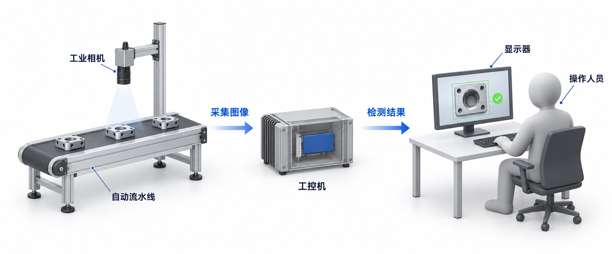
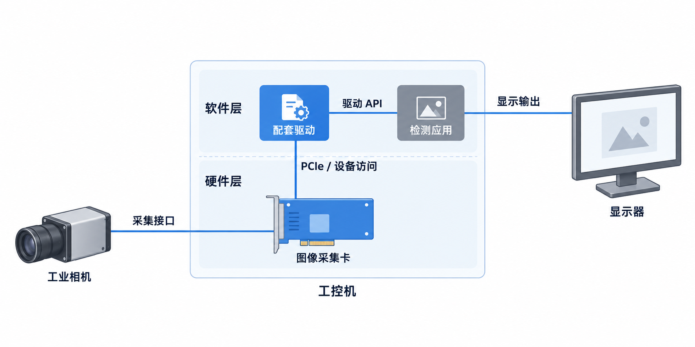
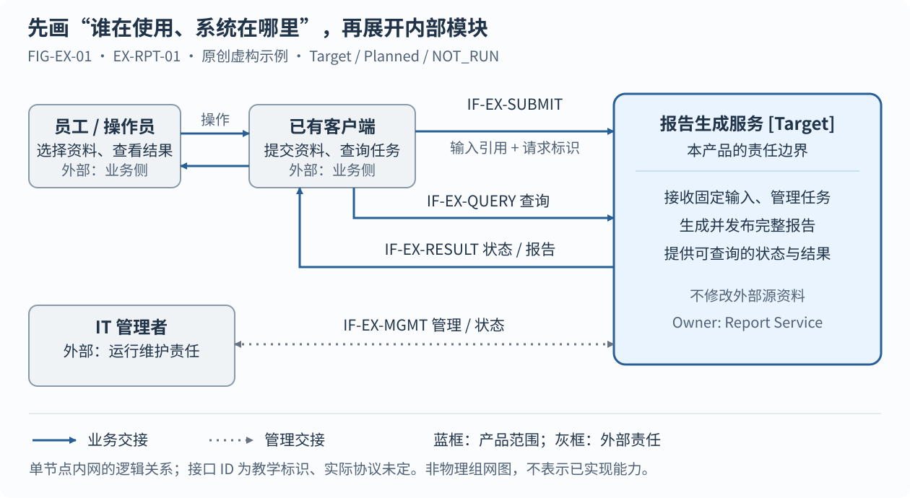

# 系统设计 AI Agent 编写指南：从产品场景到可评审、可承接的完整设计

版本：0.3.1-draft.9 · 日期：2026-09-10 · 状态：编写方法草案，待完整写作任务验证

迁入说明：源于 HIFM 的 v0.3 编写指南，本版移入 STD 统一维护 AI 写作执行方法。保留原有工作步骤和教学方法；项目专属复盘、任务安排及保密参考统计留在原项目，不随通用指南分发。本文版本独立于 STD 发布版本和模板版本。

阅读分工：[模板选择规则](template-selection.md)决定使用什么模板；[设计文档编写规范](design-writing-guide.md)规定共同质量要求；[系统设计写作与评审指南](architecture-design-authoring-guide.md)解释内容深度；本文说明 AI 如何把这些要求转成计划、设计、成文和检查。正文承载结构仍以项目已采用的模板为准。

本指南的直接读者是 **AI Agent**。目标是让 Agent 在获得本指南、适用的 STD 模板和项目事实来源后，知道怎样建立计划、调查输入、作出有依据的设计、分步写正文、绘制并检查插图、保持长任务一致性，最终交出可独立阅读且能够指导、约束下游设计的系统设计文档。人类作者和评审者可用它检查 Agent 的工作，但它不是面向人类的泛泛写作建议，也不是一次性生成全文的提示词。

本指南提供 STD 的 AI 写作执行方法，不自行改变模板要求，不批准新的产品能力，也不替代项目需求和工程证据。文中的“应”“不得”用于约束写作质量；教学示例不是任何项目的产品设计决定。指南与模板足以说明“怎样开展工作”，不能凭空提供缺失的客户需求、工程参数或批准决定。

## Agent 开始工作时先确认什么

先完整阅读本指南、选定模板及其编写建议，再按第 3、4 章建立输入底稿和实际工作计划。模板中每节的“目的、必须写清楚、编写规范、示例、完成条件”都是设计任务的输入：把它们转成待回答的问题、要产出的设计结果和检查方法，不能把建议改写成正文后便算完成。正文写在帮助块之外；折叠帮助后仍应是一份完整设计。

本版方法来源始于 STD commit `327d2ddaf977f39e6def35dea9a005c21ebb1f15`；本次同步了工作区
待发布系统模板 `6.4.0` 的短封面、章节布局、场景／架构样板、软件分层、自研 FPGA 程序及板卡布局和逐组件职责说明。这些改进不属于上述历史 commit。下表为本版对应关系：

| 方法来源 | 本版核对版本 | 在写作中的用途 |
|---|---|---|
| `design.system` / `architecture-design.md` | 6.4.0（待发布） | 短封面、产品场景、系统/软件/FPGA/板卡图与职责、重要过程及约束分配 |
| `design.definition` | 1.1.0 | 通用子系统/模块直接承接上级约束 |
| `design.hardware`、`design.fpga` | 各 1.1.0 | 专项设计直接承接约束，区分本地与系统组合验证 |
| `design.system-mechanism` | 1.2.0 | 跨单元协作、约束承接、未知结果及安全恢复 |

当前 README 将这些模板改进列为尚待统一发布；已发布标准版本仍为 `0.1.0-draft.26`。这里记录的是**编写方法来源和工作稿映射**，不是宣布使用本指南的项目已升级模板锁或批准产品设计。执行实际写作任务时，应核实项目已采用版本与任务授权，不主动查询最新版本；有差异就记录适用关系，不擅自修改 `std.lock`、模板元数据或项目采用状态。本文的“STD §…”按上表版本映射；“本指南第…章”指本文。

## 1. 目标：第一次完整交稿就能读懂，不是一次生成全部文字

一份合格的系统设计，应当让没有参加前期讨论的读者先理解产品为什么存在，再理解它如何工作、为什么这样设计，以及在什么条件下能够交付。读者不应靠作者口头补充、猜缩写或反复打开下级文档，才能拼出系统全貌。

“一次写出好文档”指第一次提交给读者的**完整稿**就具备这条解释链，而不是要求一次提示、一次输出或一天内完成。作者可以分多轮调研、分段写作、画图、推演和自审。反复劳动应尽量发生在作者侧，不能每次都把明显缺失的产品背景交给读者指出。

模板提供承载位置，编写指南提供展开方法，项目资料提供真实设计输入，评审提供质量判断。四者不能互相替代。没有客户范围、部署约束或关键方案决定时，任何模板都不能保证写出完整可信的设计；这时应记录具体缺口和影响，而不是用合理想象补齐事实。

全文应建立下面的因果关系：

> 客户与任务 → 当前问题与使用环境 → 产品边界与目标 → 功能和总体方案 → 生命周期及正常/异常过程 → 有依据的设计决定 → 下游约束与设计自由度 → 本地及系统组合验证 → 交付条件。

这条关系决定写作顺序，但不要求最终目录与写作顺序完全相同。

## 2. 从失败写法提炼通用教训

### 2.1 比较解释能力，不比较篇幅配额

评估一份设计是否有效，应看读者能否理解客户、任务、环境、处理原理、边界和取舍，不以字数、页数、图数或表格数量替代内容判断。文字很多但解释链不完整，仍可能无法指导设计；图多也不证明连线和职责正确。

使用参考资料时，先确认其可使用和可分发范围。保密参考的正文、截图、技术参数、结构统计和其他受限信息不得进入通用指南；本指南不依赖读者取得任何保密文档。可复用的是写作方法，不是未经授权的资料内容。

### 2.2 常见问题及写作上的修正

**把研发角色当成产品用户。** 平台、硬件或验证团队可以帮助分配研发责任，却不一定是购买和使用产品的人。先描述真实客户环境，再区分购买者、运维者和终端使用者；研发 Owner 放到职责章节。

**用计算结构代替应用环境。** 只画处理器、加速器和存储，读者仍不知道业务应用如何接入、设备放在哪里、谁维护、需要什么外部设施。先画产品外部的上下文，再画内部结构；客户现场图、逻辑功能图和芯片连接图回答不同问题。

**功能名多，使用过程少。** 能列出调度、缓存和隔离机制，不代表已经说明它们何时被一次用户任务需要。先写完整使用过程，再逐段解释背后的处理，不给每个机制补一段宣传性价值介绍便算完成。

**把过程步骤误认为原理解释。** 流程图和步骤中的“校验、冻结、合并”仍需要交代检查什么、为什么在此时检查、失败影响谁、状态何时生效。“旧版本仍可用”必须说明旧版本是否覆盖当前请求所需的完整业务状态，不能仅因版本已提交就允许复用。

**用表格压缩需要展开的判断。** 若场景只有角色表，可靠性只有故障名与处置短语，读者就无法推演一次使用或故障。关键因果写成连续正文，表格用于比较和汇总；简单事实也不必为减少表数硬写成长段。

**各章分别成文，职责却发生漂移。** 同一对象在总图、职责表和数据流程中归属不一致，不能通过逐节填满发现。维护统一职责底稿，用同一代表请求贯穿图、过程和模块；具体归属回到项目依据核对，不凭文风修正事实。

**约束具体，设计动机不具体。** 状态、字段和证据要求很详细，不等于已经说明客户为何愿意接受新增设备、网络和运维负担。系统设计要同时解释收益、代价、不适用条件和证据范围。

**把维护写成告警口号，把测试写成分类。** 维护设计应定义诊断信息的产生、读取影响、复位前保存、维护范围和恢复判据；测试设计应定义控制输入、捕获中间结果和稳定复现故障所需的产品能力。本指南第 10、11 章分别展开，不用未来手册或测试脚本替代设计。

### 2.3 学习解释能力，不照搬外形

固定场景产品可以围绕已确认的用户与现场写作；多场景产品则必须分别解释任务与环境，避免一个“典型部署”掩盖不兼容前提。共用内部机制可以集中说明，把篇幅留给实际差异，不必无限扩写。

对标时应问：读者是否容易理解系统、沿输入推演结果、理解关键取舍？不要只比较标题、字数和图数。参考也可能有缺口，不能因其可读性好就照搬未验证结论或省略项。

## 3. 开写前：把“知道的”和“猜的”分开

### 3.1 准备足够支撑写作的输入

先收集产品需求、使用场景或客户说明、现有产品/方案材料、关键设计决定、接口定义、部署约束和已有验证结论。PPT 可以帮助发现价值主张及讲述顺序，但其中的简化框图和宣传数字仍需回到工程依据核查。源码有某个入口，也不等于该功能已在客户环境交付。

不用先穷尽整个仓库。优先找到能回答以下问题的资料，再针对缺口查阅下级来源：

- **用户与任务：** 谁付费或批准采购，谁运行维护，谁实际使用？想完成什么任务？
- **当前问题：** 现在如何完成任务，瓶颈在哪里，造成什么具体损失？没有本产品是否也能解决？
- **运行现场：** 系统安装在哪里，上下游是谁，已有设备和软件是什么，网络/电源/散热/权限/维护条件如何？
- **产品边界：** 交付什么，不交付什么；已有平台负责什么，本产品新增什么？
- **服务范围：** 处理什么输入，负载如何变化，返回什么，什么算成功，哪些情况不支持？
- **方案约束：** 已确定哪些决定，哪些实现可复用，哪些依赖仍未关闭？

如果“谁使用”仍然不明确，先讨论产品定义，不应靠多写技术章节弥补。如果缺少的是某项精确阈值，可以先写清度量和影响、列为待确认，并继续不依赖该值的内容。

### 3.2 建立轻量事实底稿

底稿不一定成为正文，但要随分步写作保留。对每项会影响架构的事实，记录主张、来源及版本、适用范围、状态、影响章节和责任角色。资料冲突时保留冲突，不把两个配置里的有利结论拼成一个不存在的产品。

区分四种常见输入：已确认的产品决定、可核查的现状、用于分析的设计假设、作者提出但尚未批准的方案。若用户明确提出“小企业和云模型服务商”等客户类别，确认的是需要讲清的范围，并不自动批准某个销售优先级、价格、负载数值或具体 SKU。

未知项写成可处理的问题，例如：“小企业主场景是否要求完全断网运行？这影响模型/软件更新、许可校验与远程维护；由 Product Owner 在部署方案定稿前决定。”不要只留“环境 TBD”，也不要把能用明确假设开展的写作全部停住。

## 4. 分步写作：每步完成一个解释任务

### 4.1 八个工作步骤与交付物

下表可以作为一份系统设计的工作计划。每步允许多轮完成，但应形成能独立审阅的小包，而不是几十个未展开的小标题。

| 步骤 | 主要动作 | 最小交付物 | 继续下一步前的检查 |
|---|---|---|---|
| S0 输入准备 | 核对模板建议、产品范围、资料与假设；建立可续写计划 | 方法/项目基线、章节适用性、事实底稿、资料缺口及工作包计划 | 未把推测当事实；关键冲突已记录；计划有依赖、产物与完成检查 |
| S1 场景成文 | 分客户写当前任务、痛点、使用过程和现场 | 每类主客户的完整场景正文及应用环境草图 | 不懂内部技术的读者能说明给谁用、怎么用、为什么用、在哪里用 |
| S2 设计输入 | 从场景导出产品边界、目标和功能 | 边界说明、目标口径、场景到功能的对应关系 | 关键功能有来由；外部平台能力没有算成本产品能力 |
| S3 总体方案 | 分解职责、部署和主要数据路径，解释取舍并开始约束分配 | 总体图、典型部署图、职责说明、维护/测试边界草图及约束分配初稿 | 每条关键连线有语义和负责方；关键行为可控制/观察；各单元知道不能改变什么 |
| S4 重要过程 | 展开启动、配置、数据处理、停止/重启、异常恢复和适用的模式切换 | 过程索引、图、步骤、原理及数据变化；一条维护链、一条故障注入链和过程交叉推演 | 可手工推演；完成/可见/持久没有混用；过程交叠时结果可判定，不越过隔离边界 |
| S5 工程落地 | 展开软硬件、安全、容量、性能、可维护性与可测试性 | 各适用技术章；维护能力与测试点定义及缺口 | 给出产品内部需要实现的支撑机制、代价和限制，不只写操作计划或测试用例 |
| S6 承接与验证 | 检查下游分配及组合关系，用场景验证价值、用故障验证保证 | 约束承接检查、验收矩阵、证据范围、无循环的实现计划；维护与测试支撑验证 | 本地保证能接成系统保证；待承接/待实现/未运行分开；未用局部 PASS 关闭系统目标 |
| S7 编辑交付 | 回写概览、去重、逐图检查、全链自审 | 可自包含阅读的完整稿及剩余问题 | 通过第 13 节硬性检查，而非只通过格式工具 |

### 4.2 写作顺序与模板顺序不同

先写场景，再写架构。系统概览可以很早写一份粗稿，用来暴露理解缺口；完整设计形成后必须回写，因为它概括的是最终方案而不是最初猜测。文档说明、术语表、索引和修订记录可以最后整理，不能在这些部分消耗主要写作精力。

与本版对应的 STD 系统模板关系为：S1/S2 主要形成 §2/§4；S3 形成 §5 及部署内容，开始 §5.2 的约束分配；S4 形成 §6.1～§6.7，并联动 §10/§11/§12；S5 完成适用的 §7～§13、§15/§16，并回写分配；S6 完成 §14/§17/§18、复核 §5.2；S7 回写 §1/§3 及文末记录并核查全篇。采用其他锁定版本时以实际章节为准，不复制本表替代章节适用性判断。

Markdown 展示顺序另行保持简短：八项必要封面字段之后，只用 §1.1、§1.2 说明目的/读者与范围，
随即进入 §2 产品应用与设计目标、§3 系统概览。其余控制字段、修订和长目录放附录 A；参考、
裁剪、基线和假设放附录 B；统一编写检查放附录 C。输入仍在 S0 核查，不能因放在文末便推迟判断，
也不能把影响产品选择的限制和首次术语解释藏在附录里。

可维护性和可测试性虽然在最终文档中靠后，相关设计必须从 S3 就开始。测试入口、快照缓冲、复位隔离、维护空间和诊断通路会反过来影响结构、资源及接口；不能等架构定完再让测试或运维团队自行解决。S6 负责把这些支撑能力与验收连接起来，不是到此时才首次考虑它们。

### 4.3 每一阶段都用“内容包”交付

一个内容包包含：本步要回答的问题、实际正文、与正文配套的图或表、支撑资料、未决项，以及本步自审发现和处理情况。没有图的简单部分不必硬画；需要图的部分不能只留下“此处放图”。图未完成时明确该内容包仍未完成。

阶段通过不是每次都要求用户批准。作者可以按既定事实和规则自审后继续；遇到会改变产品范围、主要客户或关键业务政策的决定，再请用户或相应 Owner 确认。不要用写作过程代替授权，也不要把正常编辑判断扩大成反复询问。

### 4.4 长任务怎样衔接，避免后半篇走样

每个工作段结束，把续写信息写入计划或项目既有的工作记录：方法/项目来源基线，已完成段落及路径，统一术语/职责，事实和假设的变化，Constraint/Process/FIG 标识及关联位置，尚未闭合问题，最近检查结果，以及下一步和通过条件。不能只把它们留在聊天或 Agent 的临时上下文里。下一轮先读记录、关联正文和当前文件差异，不从零生成另一套系统概念，也不以旧记录覆盖用户刚修改的内容。

修改任何核心决定时，同时列出受影响的场景、功能、图、流程、指标和验证项。例如改变采样责任、缓存归属或产品部署形态，不能只改职责表而不改时序图。保持一个工作稿和可追踪的修订，不为每次续写复制一套竞争正文。

若时间或上下文不足，尽量停在一个内容包边界；不得不在中途交接时，准确记录写到哪里、哪些结论和图尚未检查。允许“本次只完成两类应用场景”；不允许把若干占位段落包装成“系统设计已经完成”。完成一个工作包后，在任务授权和输入允许的范围内继续下一个；计划表和阶段汇报不能代替实际写作，也不默认创建后台任务。

### 4.5 尚未想清楚的章节，先做预设计，再提炼正文

遇到可维护性、可测试性、容量、升级等章节暂时写不实，不要先填原则性段落。先拉出“本章有哪些事情必须设计”的清单，形成一份简短预设计：要解决的问题、固定输入和约束、可行选项、推荐方法、正常及失败推演、设计上的解决办法、代价和待决项。只有一个可行选项时，解释哪些约束排除了其他方法，不凑虚假备选。目的在于把方案想通，不要求此时写完操作手册或全部接口字段。

以可测试性为例，清单应包含测试方法、测试环境、数据种类与构造、环境搭建、并行策略、控制/观测/判定、清理和失败处理。若只能写“支持并行测试”，继续在预设计中回答并行对象是否共享设备、目录、端口或模型状态，冲突怎样避免，哪些必须串行。问题要形成具体设计选择，不能停留在提醒作者“注意冲突”。

预设计必须给下一项能缩小问题的动作：需要补什么输入、做什么分析/原型/测量、比较什么结果、满足什么条件才能选择方案，不满足时退回哪项决定。例如内存是否足够，先固定最大输入、并存对象、公共开销和分配额度，再估算或测量同一峰值；不能随手填一个平均值后写“Owner 确认”。该分析可以在假设下继续，但依赖未定输入的容量保证仍未关闭。写作任务不自动授权搭建环境或实施实验；先设计方法，执行按任务权限另行判断。

预设计评审或自审后，把获得依据且符合决定权限的方案、原理、限制、失败行为和验证方法写回系统正文，并把需要下游遵守的部分写入 STD §5.2。重要选择依项目 ADR/批准规则处理，自审不能替代批准。一张必要的关系图或配置表，加上能说明原理和取舍的几段正文，通常就能表达重点。关键前提未定的部分保留影响、可继续范围和待决项；具体安装命令、测试 Case、数据生成脚本和运行证据由下级承接，不全部复制到系统设计。

简单问题可在本节草稿内完成预设计；复杂问题用既有 `evaluation.technical-analysis` 模板，放项目规定的分析/评估目录，并标识 Proposed 和未决项，不新增一种模板或独立规范。结论被系统设计采用后标明采用位置，分析保留理由，正式设计维护采用的要求，避免两份相互竞争的结论。项目专属预设计留在该项目的评估目录，按任务授权引用；本指南不要求访问其他项目示例。

### 4.6 Agent 怎样建立可执行的写作计划

S0 必须把上表实例化，不能只抄一遍 S0～S7。先逐节读模板帮助，把适用节列成“设计问题—输入来源—正文/图件—下游使用者—完成检查”，再按依赖合成工作包。依据系统交付责任选择章节适用性；不适用给事实理由，不能因为资料不足就填 N/A，也不能为填模板增加产品不需要的在线配置、UI 或硬件机制。

模板是设计范围和最低要求，不是信息上限。项目确实需要、模板未展开的内容，可以在合适章节增加子节、图、推导或代表场景，并纳入检查；不要硬塞进不相干的表格，也不替换模板必需的系统问题。扩充文档解释深度不等于授权扩充产品能力或修改 STD 模板本身。

每个工作包至少记录 ID、要解决的问题、输入及前置决定、产物路径/章节/图号、检查方法、状态、缺口和下一步。状态可用未开始、进行中、设计待决、待检查、已完成；这是作者的执行记录，**不是** Document Status、Owner 批准或产品能力状态。已有项目工具能表达这些信息就复用，不先开发一套工作流平台。

一张具体的计划卡可以这样写；以下是写法示例，不代表任何项目输入已确认：

> **WP-S1-01：两类客户的使用与部署。** 问题：小企业与云模型服务商各由谁使用，怎样接入，解决什么现有困难，设施由谁提供？输入：用户明确的客户类别、经核查的产品说明、部署限制；缺少工作负载时只作标识清楚的场景假设。产物：STD §2.1～§2.3 的连续正文，FIG-APP-01/02 两张必要的上下文图。检查：分别沿一次用户任务复述给谁用、怎么用、解决什么问题、在哪里运行；图中每个外部依赖有责任方，不把研发 Owner 当客户。完成后由 WP-S2-01 提取边界和目标；客户优先级未定不妨碍描述两类场景，但不能据此宣布优先交付某一类。

不要给所有章节平均分配工作量。维护、测试、容量或恢复机制不清晰时，把预设计排在相关正文和下游分配之前；事实足够的独立章节可以继续。最后单列跨章节一致性、图件渲染检查和完整稿审阅的工作包，不能假设各章写完就自然形成好文档。

**区分两份计划。** 本节是 Agent 为产出文档而制定的写作计划；STD §17 是产品由设计走向实现和验证的工程计划。前者的“写完接口说明”不能冒充后者的“接口已实现并通过测试”。工程计划应先评审接口语义、错误行为、Schema/向量，再允许两端并行实现；各自契约测试通过后进入集成，再以端到端证据关闭系统目标。不得要求尚未实现的两端先通过实现测试才能开始开发。

### 4.7 Agent 怎样完成一个工作包，而不是生成一段看似合理的文字

每轮按以下闭环推进：

1. **读取：** 读本包输入、模板帮助、关联正文及实际差异，核实资料的版本、作用域和权限；不把检索摘要当作唯一工程依据。
2. **设计：** 列出需要决定的问题；依据事实比较可行选择，沿代表正常输入和失败推演，识别边界、资源及未决项。无法讲清时先做预设计。
3. **成文：** 先写原理与取舍，再用图表解释关系；按本指南第 6.6 节记录需要传给下游的约束、自由度和验证责任。
4. **检查：** 折叠模板帮助，尝试从正文走完操作；换一个边界或失败条件，看正文能否确定结果。检查图、数值、来源、跨章职责及可承接性，修正后才把包标为已完成。
5. **保存并继续：** 保存正文、图源、检查记录和续写状态；说明未决事项会影响哪些工作，再进入已具备条件的下一包。

如果使用协作 Agent，须符合当前任务允许的协作方式；把同一来源基线、术语、责任边界和明确工作包交给它，避免多人同时改同一规范正文。主 Agent 对交叉过程、公共预算和全文质量负责；分工完成不等于整体通过。没有获准或可用的协作方式时，单 Agent 按包串行完成即可。

若用户在写作中修改要求，先更新输入与影响范围，再修订受影响的正文、图和下游约束；不默默重写不相关内容。Agent 应报告实际完成范围与关键未决项，不能用“已全面优化”代替可核查结果。

## 5. 先写产品应用，不要先写芯片和模块

### 5.1 每类主客户写一段完整故事

一段场景应从客户的工作开始：他在哪里、用什么现有工具、遇到什么具体问题；接着叙述一次任务如何触发，数据从哪里来，怎样使用本产品，结果交给谁；最后说明负载变化和失败时会怎样。先有故事，再用表总结差异。

“给企业使用，提升效率”不够具体。“给工程师使用”也没有说明工程师是在买产品、维护平台，还是使用业务应用。购买者关注投入和可交付范围，运维者关注接入、诊断和恢复，终端用户关注自己的任务是否完成；同一个人可兼任，但责任不能省略。

主场景至少覆盖一次常见任务、一种对设计有影响的负载边界和一种代表故障。不要机械罗列所有异常，也不要只写产品最有利的高命中或低负载情况。首个客户场景没有讲透之前，不应扩大到十几个泛泛的行业。

### 5.2 环境要写到能排除错误部署

应用环境包含业务环境、运行资源、连接关系、设施条件和运行管理。写“内网部署”不能代替认证、访问权限、升级途径和服务不可用时的处理；写“云端部署”不能代替租户边界、节点资源、故障域和运维方式。

对硬件产品说明安装位置、主机或机柜条件、外部网络、供电散热、维护空间及不包含的设施。对软件系统说明运行在哪类节点、依赖哪些平台服务、谁提供存储和身份、数据如何跨边界。只保留会影响系统设计的条件，具体安装命令放到安装手册。

不同客户若需要不同组网，应分别解释为什么多了某个组件、路径如何变化、容量和故障影响如何变化。共用的实现集中写一次，差异明确标注；不能把最小部署和最大部署的资源、价格或性能混到一张表里。

### 5.3 推理产品场景开篇的正反例

较弱的写法是：“某推理产品面向长上下文推理，提供分层存储、智能调度、高并发和高可靠能力。”替换产品名后，这句话仍适用于许多系统，没有解释客户如何使用，也没有暴露设计约束。

下面是按两类假设客户构造的**表达示范**，其中工作负载和部署前提为待确认的设计场景，不代表真实客户调研或已批准交付：

> 一家小企业希望让员工通过现有内部应用使用代码或知识助手。员工与业务应用交互，不直接操作 DPU。应用负责登录、资料权限和问题组织，模型服务接收已经授权的输入并返回生成结果。若现有 GPU 无法在所需模型、上下文和同时使用人数下提供服务，企业需要比较增加 GPU、采用外部 API 与引入该推理产品的交付效果和总成本。
>
> 在这一设计场景下，该推理产品拟作为模型执行环境的组成部分，而不是替代知识库或业务应用。首次处理长输入与持续会话的后续请求具有不同等待成本，因此需要分别说明冷请求、可复用前缀和同时到达请求的处理。员工人数不等于同时活跃会话数，更不等于同时进行 Prefill 的请求数。产品配置与验收要绑定这些负载条件，不能只写“支持多人”。
>
> 部署位置取决于具体设备的主机、网络、供电和散热要求；企业规模小不意味着设备适合放在办公桌上。若目标配置需要机柜级设施，应说明企业自有设备间或托管机房如何提供这些条件。最终可交付能力及成本仍需由对应配置验证，不能把容量估算当成服务承诺。

云模型服务商应另写完整场景：API 客户通过服务商入口访问模型，服务商负责鉴权、配额、路由和服务运营；该推理产品位于某个明确的模型执行资源组中。随后展开突发冷请求、长会话、多租户、维护和故障。不能只把上面的小企业故事中的“员工”改成“租户”，因为调度、隔离、计费和可用性边界已经不同。

### 5.4 从故事推导要求，不能从技术名词反填价值

例如，若客户同时存在新长请求和持续会话，就需要明确两类请求如何竞争资源、可接受的等待和拒绝是什么，而不是先决定某个复杂调度算法。若需要资料隔离，就必须说清身份从哪里来、在哪个边界执行访问控制、复用状态能否跨用户；“已有缓存”不能推出“允许跨租户共享”。

每个重要功能至少回答：哪个场景需要它，没有它会怎样，它能改善什么结果，代价是什么，如何验证。无法找到场景依据的能力，可能是研发辅助能力、未来扩展或过度设计，应明确归类而不是默认纳入产品主线。

注意区分**客户应用场景**和**系统工作模式**。小企业、云模型服务商是不同客户环境；仅校验、正常服务、维护或降级运行才可能是工作模式。Agent 应先讲清客户任务，再说明该任务何时使用哪种模式及模式切换条件，不能用一张状态表替代客户场景，也不为每类客户虚构一套模式。

## 6. 正文怎么展开：让读者能推演，不是能背名词

### 6.1 关键设计节的段落结构

可按以下顺序起草，但不要把每项各填一句当作完成：

1. 先交代处理对象、使用条件和要解决的问题。
2. 沿代表输入说明正常处理：谁接收，依据什么判断，产生什么变化，交给谁。
3. 解释为什么采用这种分工或机制，而不是一个可行备选。
4. 说明代价、资源占用、适用限制和失效前提。
5. 推演一个代表异常，说明用户结果和状态/资源的后果。
6. 说明形成了什么设计决定、需要谁遵守、下游可以自行选择什么，以及怎样验证，现有证据覆盖到哪里。

简单功能可能两段就足够。复杂功能如果涉及并发、数据转换或多个故障域，通常还需要图、步骤和代表数据。篇幅由读者是否能推演决定，不由“每节至少三百字”决定。

### 6.2 不让动词代替工作原理

写“校验”，继续说明校验对象、依据、先后次序和失败处理。写“缓存”，说明缓存内容、键和范围、有效性、占用、释放以及不命中路径。写“调度”，说明竞争者、约束、决定者和饥饿/过载结果。写“同步”，说明等待谁、等待到什么状态、超时后谁仍可写入。

写“合并”要解释集合完整性、顺序和重复/缺失结果；写“自动恢复”要解释检测、隔离、恢复输入、重新开放条件及无法恢复时的结果。“由相关模块处理”“按策略回退”只有在该模块、策略及适用条件已明确时才有意义。

### 6.3 同一件事在不同章节分别解释什么

功能章解释外部保证；流程章解释时间顺序和交接；模块章解释局部原理与职责；数据章解释对象在不同阶段如何变化；接口章解释跨边界语义；验证章解释如何证明。不是把同一段流程复制六次。

引用下级文件时，保留读懂当前系统所需的语义：谁消费、何时生效、什么失败会影响主路径。完整字段、寄存器位表、内部算法和命令参数全集仍由唯一的下级定义维护。系统设计必须确定主要操作的能力类别、发起位置、入口、对象、权限、执行顺序、生效点和结果判据；不能把这些设计决定也推给操作手册。需要解释关键字段时，从固定来源提取小范围摘要并标明用途，不另造可独立修改的完整规范。

跨单元机制拆到 `design.system-mechanism` 后，系统正文仍保留端到端原理、阶段图、系统约束和代表失败，机制文档维护详细状态转换、参与方协议及恢复细节。通过同一 Process/Step/Constraint ID 和固定文档基线互相核对。系统阶段图不是重复维护整份状态机；“唯一 authority”也不等于系统只剩链接。

### 6.4 用代表数据检验抽象说明

对主要数据对象选一个不含敏感内容的小例子，标出输入形态、身份及版本、变换后的形态、最终消费位置。解释为什么某字段保留、改变或丢弃，并区分逻辑结构与实际字节布局。

有多个 owner、rank、节点或副本时，一定指出示例属于谁，不能把逻辑总量当作每个设备的物理占用。一个“容量 64”的数值缺少单位和范围，不能参与推导。写性能或容量时分别说明目标、估算、仿真、实测及资源余量，不以理论极限代替可交付上限。

### 6.5 把系统生命周期写成可推演的重要过程

Agent 在 S4 先建立过程清单，再展开正文。STD 第 6 章不只是正常请求的数据流，至少按实际系统检查以下范围；不适用的特殊硬件步骤说明原因，不删除启动或初始配置本身。

| STD 位置 | 要产出的设计结果 | 容易暴露空泛内容的追问 |
|---|---|---|
| §6.1 过程索引与工作模式 | 过程、场景、触发者、入口、唯一正文及模式的对应关系 | 索引指向实际过程了吗，还是只有一组标题？ |
| §6.2 启动 | 依赖顺序、初始化/自检、就绪边界、失败停留状态及可开放入口 | 管理可用但业务未就绪时，请求得到什么？两次启动如何避免重复有效执行？ |
| §6.3 配置加载与生效 | 配置来源、校验、保存、生效点、版本绑定及部分失败处置 | 已保存未生效时使用哪个版本？重启后恢复哪份？ |
| §6.4 数据平面 | 代表输入到实际消费的完整协作、等待、数据变换及边界 | 接收、完成、可见、持久、资源可释放是否是同一事件？ |
| §6.5 停止/重启 | 停止准入、在途处置、资源安全条件、重启检查 | 队列空了但旧 DMA 未结束，能否回收资源？ |
| §6.6 异常恢复 | 检测、影响范围、结果核实、隔离、安全恢复或阻塞出口 | 失联者仍可能写入吗？谁能证明恢复可开始？ |
| §6.7 模式切换 | 允许转换、发起者、进入/退出条件、在途及失败处置 | 切到维护模式时，已接收请求由谁结束？ |

每个重要过程给出适用场景、流程/时序图、阶段步骤和解释其原理的正文。写明从哪里发起、在哪执行、影响谁、等待什么、何时算成功；配置仅在启动时加载的产品就解释这一限制，不从模板推导在线热更。升级等已有完整专节的过程从 §6.1 索引到唯一正文，不复制两套流程。

逐个过程自审后，再做交叉推演：配置发布碰到停流、恢复碰到新请求、升级碰到旧持久化数据，系统究竟按哪个版本和权限处理？内存中的旧配置不再被请求引用，不代表重启、回退或审计所需的持久版本可以删除。并发启动时“先查不存在，再启动”也不等于排他成立。无法给出结果就回到预设计，而不是补一句“协调处理”。

### 6.6 把设计结论变成下游可承接的输入

每写完一个适用节，Agent 要检查五个问题：**决定了什么，依据是什么，下游必须遵守什么，可以自行设计什么，怎样检查承接结果？** 答案应能定位到正文的方案、推导、分配和验证；不是在每节末尾机械添加五句套话。没有下游约束分配的节，说明其结果由谁使用及边界即可。

把各章已推导的约束汇入 STD §5.2，不在那里重新创造未经推导的数字。复用项目现有 Requirement/Decision/Constraint ID；确无标识时在文档内建立稳定 ID，不另建一套机器登记系统。每项记录：

- **固定来源与状态：** 来源 Document ID、版本或提交、章节及约束 ID，拟议/已批准状态；同名 ID 用来源文档区分。
- **条件与分配：** 适用场景、模式、拓扑、负载/并发、单位及计量边界；每个承接单元得到什么预算或行为义务。
- **自由度与落实：** 哪些算法、结构或器件选择可以自行决定，哪些外部语义、上限、隔离和失败行为不可改变；落实到哪个真实单元和下级设计。
- **验证与反馈：** 本地如何证明，系统怎样组合检查，责任和证据是什么；不满足时向谁反馈具体差距，影响哪些章、接口及测试。

下游按领域选择一个合适模板承接，不把系统目录复制到每个模块，也不为了手续增加重复文件：

| 设计对象 | 承接位置 | 必须写出的结果 |
|---|---|---|
| 系统总体 `design.system` | §5.2；§14.6 回收验证 | 分配、自由度、组合关系及系统验证责任 |
| 跨单元机制 `design.system-mechanism` | §3.1；§14 验证 | 各方保证与前提能接起来，详细协作不改变系统政策 |
| 通用单元 `design.definition` | §1.1；其验收章节 | 继承值、本地落实/再分配、限制及证据 |
| 板卡 `design.hardware` | §1.1、§7/§10、§12 | 约束落到电源/器件/PCB/测试预留；本地与整机验证分开 |
| FPGA `design.fpga` | §1.1、§7/§9、§12 | 约束落到 RTL/缓存/CDC/流控/预算；本地与系统验证分开 |

尚未存在的下级文档或代码位置明确为计划，不伪造已创建、已签收或已验证。分配及检查方法已有充分依据时，可以先完成这一部分设计；若关键输入、机制或分配本身还没决定，不能改叫“只待测试”。下游不满足时应返回差距和可选方案，由原决定责任方裁决，不能私自提高预算、跳过校验或修改期望来取得 PASS。

承接检查要双向走一遍：从系统约束找到下级落实，再从一个下级超限/失败反查系统影响与裁决者。实现和实测尚未开始，不妨碍现在设计这条链，但不能因此宣称整条链已经验证。

## 7. 如何画图：先确定问题，再决定工具

### 7.1 建图清单，而不是图片配额

每张图先写一句“看完这张图，读者应能回答什么”。答不出这句话，先不要画。图清单记录图号、问题、适用场景/基线、所在章节、对象及边界、需要解释的关系、来源和完成状态。

| 读者的问题 | 优先图型 | 不应混入的内容 |
|---|---|---|
| 谁使用，系统放在谁之间？ | 应用上下文图 | 全部内部模块、寄存器和缓存字段 |
| 实际安装在哪里，如何连接？ | 部署/组网图 | 把逻辑调用画成物理网线 |
| 系统有哪些责任单元？ | 总体功能框图 | 未注明的产品形态和不同版本混搭 |
| 软件分几层，每层有哪些模块？ | 分层组成图，左侧层名、右侧纯文字模块 | 模块图标、调用连线和执行时序 |
| 一次任务怎样前进、在哪里等待？ | 流程图或时序图 | 没有顺序语义的装饰箭头 |
| 并发后哪些状态可以复用或释放？ | 状态图、资源生命周期图 | 将用户收到响应等同于所有资源已回收 |
| 数据怎样转换、属于谁？ | 数据布局/变换图 | 把逻辑示意伪装为精确字节规范 |
| 故障影响到哪，如何恢复？ | 故障域图或异常时序 | 只在正常图旁加“自动恢复”四字 |
| 电源、时钟、复位或散热如何约束运行？ | 启动时序、域关系图、结构示意 | 没有来源的器件能力和未确认尺寸 |

可以合并简单关系，但一张图应有一个主要视角。例如推理产品的小企业应用环境、服务商应用环境、总体职责和设备组网应先区分；内部共用的工作过程可在后文复用。

### 7.2 一张图的七步制作法

**第一步，写图的说明任务。** 例如“解释用户、业务应用、模型服务与推理产品的边界”，不是“画一张科技感架构图”。

**第二步，列对象和关系。** 给每个对象一个与正文一致的名称，说明它是角色、进程、硬件、存储还是外部服务。先列出实际交接内容，再画线；没有语义的线应删除。

**第三步，选层级与构图。** 上下文图把本系统作为一个整体；模块图再展开内部。部署图用物理边界，职责图用逻辑边界。不要让矩形含义随意变化，也不要让同名对象一会儿代表软件、一会儿代表板卡。

**第四步，先表达主要关系。** 分层组成图先排列层次与模块，左侧写层名，用包含关系表达归属，不画图标或连接线。交互图才先画最重要路径，将业务主方向保持为左到右或上到下，再补返回、控制和异常关系。模块多时分组或拆图，不靠缩小字体塞入更多方框。

**第五步，补充语义。** 组成图解释分层依据和职责归属；交互图的连线上标明数据、命令、信号或结果，跨责任边界标协议或可追溯的接口 ID。标出 Owner、外部依赖和信任边界。真实协议尚未决定时写“逻辑交接，协议待定”，不能随手填入常见协议。

**第六步，标明图的适用条件。** 区分 Current、Target、Transitional，并注明版本/配置/拓扑。未来对象、数据线和控制线使用不同的编码维度，不让虚线同时表示“未来”和“控制”；不能只靠颜色表达重要区别。

**第七步，渲染并按阅读尺寸验图。** 在实际 Markdown、Pages 或交付页面中打开，检查文字、裁切和布局。组成图检查层次、包含关系及同层模块；交互图另检查箭头，并沿一个正常输入和一个失败输入走图。语法通过但图看不清，仍未完成。

### 7.3 工具选择与资产维护

Mermaid 适合职责框图、流程、时序和状态，便于与正文一起修改。精细部署、结构、数据布局及复杂排版可用可编辑 SVG、绘图工具或原生文档形状；需要强调实物、安装位置和空间关系时再使用照片或说明性插画。

工程图不能把生成式图片中的线、端口和文字当作技术依据。概念图可以帮助记忆产品，但不能代替带方向、接口及边界的工程图；保密来源不得发送给外部绘图或图像生成服务。资产应使用原创、已授权或允许使用的来源。

保留可编辑源，不只保留截图。图号和文件名稳定，图注与正文引用同步更新。在 STD 目录中，共用文档小型图件可放 `docs/assets/`，临时渲染和运行产物放项目规定的数据位置，不随意新建并列资产目录。

### 7.4 图前、图中、图后各做什么

模板 §2.3、§5.1 直接展示同一虚构产品的应用场景与系统架构图文样板，§5.2 逐组件说明职责。先打开实际图片，再读
图注和说明，不仅读取 alt 文本或图源。下面引用相同资产，完整说明以模板为准；这两种表达
不能代替其他部署方式、时序或状态图的样板。

*EX-SCENE-01，原创虚构逻辑场景，Target / Planned / NOT_RUN；箭头不是物理走线，布局不表示实际距离。见[图源与生成说明](assets/system-design-authoring/README.md)。*

*EX-ARCH-01，原创虚构教学样例，非项目设计；Target / Planned / NOT_RUN。*

对照两图：应用场景图画出流水线、相机、工作台和坐在显示器前的使用者，让读者先理解
系统为什么在这里、帮助谁完成什么工作；系统架构图再解释主要组成、软硬件层次及连接。
架构图后按相同名称逐一说明每个组件解决什么问题、接收和交付什么、与谁协作及不负责什么。
不要只读一张总图或职责索引就宣称设计可读；§5.2 的六个组件段落演示如何直接解释职责。
系统总图只画到采集卡、驱动和应用，不展开缓存、DMA 等子系统内部模块。图中只用短名称，
原理说明留在正文；详细数据流与控制过程另图表达。设备插图可以增强辨识度，但宜浅色、
轻量，避免金属质感、强阴影和悬浮效果喧宾夺主。重点检查连线端点及短标签是否明确，不用
外形推导端口、尺寸或已实现能力。正式项目须换成真实组成和连接，不能继承虚构工程决定。

应用场景图可以是逻辑示意，不要求还原真实现场。用简化产线或业务环境、示意人形、设备或
服务及信息箭头，就能解释谁使用系统、输入从哪里来、结果交给谁；不需要真人、真实厂房或
精确摆位。本例采用统一灰蓝三维插画，人形无写实细节；布局和连线不作为安装或布线依据。
纯软件场景同样可用角色、客户端和服务表达，不为套用图片虚构实体设备。不要叠加内部软件
层或板卡分解图。场景图与架构图不是互相替代，也不是同一图换一种外观；场景、架构、逐组件
职责应沿同一组对象形成连续说明。

继续展开内部时，模板 §8.1 的 EX-SW-01 给出同一案例的[软件架构 SVG](../templates/diagrams/software-layered-architecture.svg)：
只展开检测应用与驱动的主要模块，不重复画产线和物理设备。应用层、驱动层仅在左侧标名，
面板内不重复标题；模块只写名称，不用图标和连接线。层底色较浅、模块色块较深，配合边界与对齐表达
包含关系；层名、模块名和分组仍须在无颜色时可辨。调用关系和数据流另图表达。
底部系统定制层为条件式样板，只有项目实际定制或改造系统时才保留，并以具体系统名称和
改造职责替换“定制操作系统（按需）”。普通操作系统不在组成图中展开，只记录运行环境；
确有项目负责的 Boot/BSP 等软件则按职责命名，不用含义不明的“设备接口”混合软件与硬件。
这份 SVG 同时是可复用样式模板：复制到项目资产目录后修改层和模块，样式统一在图内维护，
不需要再生成位图或新增绘图工具链。[编辑说明](../templates/diagrams/README.md)给出布局约定；
增加模块或改名后检查换行与边界，不能假定 SVG 自动排版。
逻辑模块分组不能自动作为进程、线程或服务划分；图后解释职责，再确定实际执行、状态和部署
边界。不以软件图代替 FPGA 程序或板卡设计。

模板 §7.1 的 EX-HW-01 展示[自研板卡顶层布局](../templates/diagrams/board-top-layout.svg)，
§9.1 的 EX-FPGA-01 展示[自研 FPGA 程序架构](../templates/diagrams/fpga-program-architecture.svg)。
二者使用同一虚构教学变体：板卡图把 FPGA 当作器件，程序图展开其运行的自研逻辑，而不是
LUT、DSP 等芯片资源。板卡相对位置和细线只说明功能区域与主要接口，不是实际 PCB 放置或
走线；正式设计需说明布局依据。程序图的主箭头只表示主要数据方向，控制、存储、握手及
时钟复位不可因图中省略而从正文消失。帧队列与外部 DDR 不是同一个对象，正式设计须补全
存储访问及其与队列的关系。图后按相同名称解释职责，不靠图形本身宣称实现或验证完成。

产品开篇按“标题 → 图片 → 简短图注 → 连续说明”展开，再补作者提示。下述“图前问题”由
标题或此前场景承担，不再加一段密集背景挡在产品图前；内部机制章可按解释需要先提出问题。
`new-design` 不复制明确标记的教学图文到项目空稿：作者应在项目自己的资产目录制作正式图片，
不能把 STD 样例或相邻仓库图片当作交付物。

图前告诉读者为什么现在需要看这张图；图中表达对象与关系；图注给适用范围、状态、责任、符号和来源；图后沿代表路径解释关键机制、等待、选择理由和限制。图后的说明不能只是把方框名称顺序念一遍。

图注可以这样组织：“FIG-X，某场景下的目标部署；基线 B，单资源组；用户与平台为外部责任，本产品边界见框；实线为数据，点线为管理控制；端口对应 IF-A/IF-B。示意不代表物理尺寸，相关能力尚待目标环境验证。”字段按图的性质取用，不在每个方框中堆放整段元数据。

### 7.5 逐图检查的具体动作

按实际页面宽度检查标签，不以放大到能看清作为通过；检查长中文换行、字体缺失、箭头被文本遮挡和边缘裁切。检查黑白打印或色觉差异下是否仍能区别状态。长时序图跨页时按阶段拆分，保留共同参与者和交接编号。

进行两次走查：先只看图与图注，复述边界和主路径；再对照正文与接口摘要，核对方向、责任和状态。设备连接、内存位置、数据量、协议和产品形态尤其要逐项核对。图片可加载、脚本退出成功和目录中存在文件，都不能代替这些检查。

### 7.6 时序图和状态图怎样避免“画了却没解释”

时序图的参与者应是实际发生交接的责任单元，纵向表示时间推进。先确定一次操作的起点和用户可见终点，再补中间处理；并行只在设计确实允许重叠时画，不为了表现性能而随意并列。请求、应答、数据传输和通知分别标明含义。消息接收、计算结束、结果可见和资源释放若是不同事件，必须分开画出。

每个等待点追问三件事：在等哪个条件，超时后谁还能继续产生结果，迟到结果会写到哪里。异常路径不要塞进正常图所有分支；选择会改变正确性或用户结果的重要异常单独画，并用同一阶段编号与正常图对应。正文解释为什么这个时刻是完成边界，而非只写“步骤 5：完成”。

状态图画的是一个明确对象的生命周期，例如请求、设备或缓存页；不能在同一状态机里混合设备启动和单请求完成，却没有说明层级关系。每次转移注明触发、前提和必要副作用，说明谁有权转移、失败是否留在原状态、相关资源何时释放。用状态表补充图中放不下的规则，避免把几十条条件缩成无法阅读的小字。

### 7.7 硬件与数据图的特别要求

硬件功能图说明器件或板间分工，物理结构图说明安装与空间，电源/复位图说明启动和依赖。不同图中相同器件保持同一名称，接口注明方向和实际适用的通道数、速率或来源；未确认的连接能力明确待验证。框图不能证明信号完整性、时序收敛或散热通过。

数据图先画阶段前后的逻辑对象，突出身份、版本、范围和 owner 的变化；若需要精确布局，再引用或提取机器定义中的字段范围、长度、顺序和对齐。箭头上说明是复制、切片、转换、聚合还是仅传递引用。特别标明变换前后是否仍代表同一业务对象，以及消费完成前哪份数据不能释放。

### 7.8 Agent 的绘图执行流程

不要等正文全部写完再批量插入装饰图。每个内容包先形成图的说明任务，再与正文一起迭代：

1. **建图卡。** 记录 FIG ID、要回答的问题、来源基线、Current/Target 状态、对象和连线语义、对应 Process/Step/Constraint、图源及展示文件位置。对象职责未定时先做设计，不让绘图工具替你决定拓扑。
2. **选表达与工具。** 精确架构、连接、状态和时序优先用可编辑 SVG、Mermaid 或项目已有绘图方式；少量精确映射用表更清楚就不画。场景插画可以使用获准的图像工具，但不能把其自动生成的连线、端口或文字当工程事实。按所用工具的适用技能和权限操作，不假设某插件一定存在。
3. **先核语义再排版。** 从图卡核对每个对象、箭头、数据位置和责任；与正文的同一代表输入逐步对照。单独画正常、异常或物理视图，需要对应时复用同一名称与阶段编号，不把所有信息塞在一张图。
4. **渲染并看实际结果。** 在目标阅读器或等效导出结果中按正文宽度检查标签、换行、箭头、字体和裁切。工具返回成功只说明生成成功；Agent 必须实际查看渲染结果。工具或环境不具备时记录未检查项，不将源码块计为已完成插图。
5. **修正并落文。** 改源文件后重新渲染核对；在正文插入真实可用的引用，补图前问题、图注范围和图后原理。图源与展示文件放 STD/项目规定的资源位置，不新增随意命名的顶层图目录。
6. **同步维护。** 变更 Owner、部署、流程或预算时按图卡找到受影响图，重新检查；交付时保留可编辑源和可阅读形式。不需要把每次生成的废稿全部放进正式资料。

保密资料只按其授权在本地处理，不交给外部绘图服务、不嵌入提示词，也不作为待发布图的参考附件。没有必要从参考文档取图；用本项目已确认的事实生成原创结构图即可。插图内容的正确性由 Agent 核查，不因工具擅长绘画而免检。

## 8. 贯穿教学示例：怎样把一句功能写成设计

以下“团队报告生成服务”是独立虚构的教学算例 `EX-RPT-01`，所有设计均为 Target / Planned / NOT_RUN。不来自保密参考，不代表任何项目将增加此产品或这些机制。它只演示表达深度，不是覆盖安全、部署和实现细节的完整设计。

### 8.1 较弱写法

> 系统面向企业用户，支持报告生成、异步调度和结果管理。由接口模块、任务模块和存储模块组成。采用可靠机制保障结果一致，异常自动恢复，详见下级设计。

这段话没有说明用户拿什么输入、为什么等待、如何知道结果正确，也无法判断“可靠”是哪些故障下的保证。即使补上三个方框仍没有解决问题。

### 8.2 先写场景与环境

一个小团队定期把业务系统导出的资料转换成统一报告，部门负责人需要审核报告，操作员负责提交资料，IT 人员维护运行服务。原先每个人在各自电脑生成文件，容易混用输入版本，也难以判断别人是否已完成同一任务。拟建服务接收固定的一组输入，生成与该输入版本绑定的报告，使操作员能够查询状态，审核者只读取已完成的结果。

本示例假定员工通过内网客户端使用一台受管服务节点；业务系统仍负责源资料的正确性，客户端仍负责文件选择。本服务负责输入检查、任务执行和结果发布，不负责修改源资料。输入权限、允许文件种类与容量、运行时限及保留周期还需产品负责人确认；因此当前不能宣称支持任意输入或任意规模团队。

由于生成可能比一次交互等待更长，客户端需要区分“已接收任务”和“报告已完成”。服务也必须允许用户查询状态，而不是在超时后要求用户盲目重复提交。这个外部需求引出了任务身份和状态管理，而不是作者先喜欢异步架构再寻找理由。

FIG-EX-01 为原创逻辑上下文图，基线 `EX-RPT-01`，Target / Planned / NOT_RUN；示例单节点内网环境。员工和客户端由业务侧负责，管理入口由 IT 负责，蓝色边界由 Report Service Owner 负责。实线为业务交接，点线为管理交接，`IF-EX-*` 只是本例的逻辑接口标识，实际协议未定义。所有蓝色对象为目标对象，状态由文字标注，不用连线虚实表示成熟度。

图中的系统入口接收输入引用与请求身份，而不是让员工直接写入结果空间。客户端获得任务身份后通过同一服务查询结果，管理者通过独立逻辑入口查看状态和维护服务。图没有展开内部执行模块，因为本节要解释产品处于什么位置；内部怎样生成报告应在后续流程与模块中说明。

### 8.3 再写处理原理、取舍和边界

拟议规则是：客户端为一次逻辑提交保留稳定请求标识；接收服务把该标识、输入摘要和任务关联。相同标识及相同输入再次到达时，返回同一任务；相同标识携带不同输入时拒绝，避免把两个不同报告混为一项工作。客户端必须保留标识，服务必须在声明的重试期限内保存关联。具体并发登记、持久化和过期机制仍需下级设计；未关闭这些问题前，不能宣布已保证所有崩溃场景下的防重复。

执行单元只消费已登记任务的固定输入版本。生成过程中，候选文件对审核者不可见；只有内容生成、检查及结果发布条件满足后，任务才进入成功状态。这样审核者不会把半份报告当成完成结果。代价是需要容纳候选数据和发布元数据，容量与清理策略必须进入部署预算；“异步”没有消除资源限制。

正常流程可按“提交并取得身份—读取固定输入—生成候选—检查—发布结果—返回可查询成功状态”展开。应进一步说明发布结果与更新状态之间如何协调，以及何时可以清理候选输入。此处尚未决定持久化协议，因此只定义目标语义，不虚构原子事务或已有数据库。

### 8.4 最后推演一个最容易遗漏的失败

如果服务已经登记任务，但客户端没有收到应答，客户端不能据超时断言提交未发生。它先用原请求标识查询权威状态；只有登记接口的幂等契约允许时，才可用相同标识及相同输入重发登记请求，而不是换一个标识创建新任务。**重发登记不等于重新执行任务。** 若无法核实，界面表示结果未知并保留追查线索，不显示“已安全取消”。这个异常路径验证了任务身份设计是否真正服务用户，而非仅为日志加字段。

如果候选生成完成，但服务在发布状态期间退出，恢复逻辑必须核对该任务的结果和状态。没有核对之前不能自动重跑并覆盖，也不能自动宣称成功。恢复需要什么持久记录、发布是否可恢复以及失败时如何保留结果，是明确的待决事项；“保留旧文件”不等于已经解决结果不确定性。

若执行者失联，已确认的结果应按契约返回，不再重新执行；否则只有确认旧执行者停止或被实际资源/副作用接收方隔离，且幂等或去重前提满足后，才允许获准的重试。单改调度记录或等待 lease 到期不证明旧写入已失效。无法确认副作用或阻止旧写入时保持阻塞或转人工。逻辑任务身份与执行代次分别由唯一契约定义，本示例不规定“同代次”或“换代次”策略，更不为实际项目新增自动重试机制。

本例至少应设计三类验证：正常输入生成对应结果；相同请求标识的重试不产生不同任务；在登记应答和结果发布边界注入中断，确认未知结果可被核实。验收还应检查无权限者无法读取结果，以及资源不足时明确拒绝而非无界占用。当前这些是拟议验证，并非已经运行的测试。

### 8.5 示例为何比弱写法更好

读者现在知道业务任务、外部边界、为什么需要异步与身份、候选为何不可见、超时为何不能直接重试成新任务，也看到了方案的成本和未决项。这才是信息深度。多出的字并不是在反复强调“可靠”，而是在让每项保证变得可解释、可检查。

这套写法可迁移到真实系统：选择一条主路径，把“前提—输入—判断—状态—交付—失败—验证”写通，再扩展其他重要模式。不要把本示例的机制原样搬进不需要它的产品。

### 8.6 用一张小表证明场景确实进入了设计

下面是同一教学算例的局部追溯，不代表测试已经执行。表中的设计内容先在正文解释，不能反过来拿这张表代替正文。

| 场景中的问题 | 导出的外部要求 | 本例拟议设计 | 验证应观察什么 |
|---|---|---|---|
| 生成比交互等待更长 | 区分已接收与已完成 | 返回可查询的任务身份，生成状态独立推进 | 长任务进行中可以查询，未完成时不返回完整报告成功 |
| 应答丢失后可能重复提交 | 能核实同一逻辑提交的结果 | 请求标识与输入关联；保留期限及持久化待定 | 丢失登记应答后用原标识核实，不产生第二个不同任务 |
| 审核者可能读到半份报告 | 只消费满足发布条件的结果 | 候选与可见结果分开，发布/状态协调待定 | 在关键发布边界中断时，不把候选当作成功结果 |
| 同一标识可能携带不同资料 | 不静默混合两个输入版本 | 相同标识、不同输入拒绝 | 返回明确冲突，原任务输入及结果不被替换 |

若设计提出一个重要机制却在表中找不到它回应的场景问题，检查是否过度设计。若一个重要场景没有要求、设计或验证去向，说明本轮文档尚未形成闭环。

### 8.7 再多走一步：把本例交给下游设计者

沿用本例，给“审核者只能读取满足发布条件的完整报告”一个教学约束 `EX-CON-PUB-01`，来源为 `EX-RPT-01` 本版 §8.3，决定状态仍为 Proposed。它适用于本例单节点、已登记任务的固定输入版本；不是一句“保证一致性”，而是需要落实的边界行为。

系统拟分配：生成单元提供完整候选及对应输入身份，不决定客户可见状态；发布单元核对发布前提并维护可见边界；查询单元只能按权威可见记录返回结果。各单元可在批准范围内选择内部处理方式，不可让生成单元绕过发布、把缺失输入检查算成功或把未知结果返回为完成。具体发布协议及崩溃恢复尚未决定，因此该约束处于待细化/待承接，不是已经可实现的闭合方案。

下级设计应沿同一 ID 说明本地如何落实和验证；系统还必须检查三者的组合：生成完成但发布未发生时查询不能返回成功，发布中断后只能根据可核实的结果恢复，身份不符的候选不得被另一任务消费。只分别测试“能生成文件”“能写状态”“能读状态”，即使全通过，也没有证明这项系统保证。

Agent 下一步应先做发布与恢复预设计，比较项目允许的实现选择，确定可见记录、候选和任务状态的协调及故障判定，再回写流程、约束与测试。这样下游拿到的是要解决的问题、不可破坏的语义和明确缺口，而不是让下游自行决定系统是否允许半份报告可见。

## 9. 原理、证据与成熟度怎样同时写清

### 9.1 不让状态词抢走正文

正文先解释设计，再在紧邻位置说明适用版本和成熟度。可以用一张能力状态表集中管理，但不能每段都堆满 Gate、Owner 和 NOT_RUN，导致读者看不到系统原理。反过来，也不能为求流畅把未实现能力写成现状。

分开记录四件事：文档是否获批、图描述的是现状还是目标、能力实现到哪里、在什么条件下验证到哪里。文档 Approved 不意味着硬件或性能 Verified；结构校验 PASS 不意味着设计合理。

### 9.2 把技术数字放回客户问题

容量应绑定对象、单位、每设备/每副本/整组范围、并存峰值和余量。性能应绑定输入规模、负载分布、并发、阶段及测量方法。收益比较应保持质量、响应要求、部署和成本范围一致。先说明客户观察什么结果，再说明内部指标如何解释该结果。

推理系统写作中的典型错误是把活跃会话与同时 Prefill 混为同一并发、把建模上限写成可交付能力，或把缓存容量比例当成命中率。写作时不需要把所有模型公式塞入系统概览，但必须解释这些区分为何影响产品选择，并引用对应基线。

### 9.3 系统工程不能成为最后的口号章节

可靠性从客户后果出发：故障会丢任务、丢状态、输出错误还是仅变慢？安全从资产和入口出发：谁能提交、查看、配置和升级，控制在哪执行？供电散热从现场出发：设备能否安装、连续运行和维护？运维从人员能力出发：谁看到告警，能做什么，何时需要停机？

每一项都要回到适用场景。不能用“部署在内网”省略安全，也不能用“依照板卡规范”省略系统的供电和故障责任。下级文件保存具体实现，系统设计保留决定产品能否运行的边界。

### 9.4 技术章节的最小展开深度

**硬件章节：** 先说明为什么由这些板、器件和介质承载目标负载，再沿一条数据路径说明接口与瓶颈，接着解释电源、复位、散热及故障域如何限制运行。只有器件清单不够；逐项抄数据手册也不是系统设计。选型必须写备选、决定依据和仍需工程验证的条件，未验证料号不能写成量产结论。

**软件章节：** 先区分进程/线程或执行环境和逻辑模块，说明入口、数据与状态归属，再解释一次任务在这些单元间如何推进。配置在哪里生效、并发如何限制、错误如何返回、升级如何影响在途任务，都应有系统层说明。文件路径是落实职责的证据，不是职责本身。

**FPGA 或专用处理章节：** 沿输入接收、解析、任务配对、搬运/计算、结果交付说明处理原理；重点解释流水线、缓存、流控、时钟/复位边界和资源预算为什么需要。内部 RTL 状态机不必全抄，但系统主路径依赖的握手、阻塞和完成条件不能省略。仿真图不能代替目标器件的时序、资源和板级验证。

**接口和数据章节：** 以一次实际交接说明提供方、消费方、数据版本、有效性、可见性、失败和兼容规则，再引用唯一字段定义。对于压缩、分片、聚合、分层或近数据计算，至少解释一次代表变换的前后形态和收益代价；只列协议名或格式名不能证明读者理解了数据如何工作。

**容量和性能章节：** 从服务目标分解阶段预算，再核对串行、并行、等待和通信。并行任务的总时延不能简单相加，也不能把并行中最慢分支以外的串行开销删掉；吞吐、单次延迟和尾延迟分别说明。资源按实际 owner 及阶段并存计算，推导不闭合的部分保留假设和测量计划。

这些章节可以由多轮写作完成。每轮都应沿同一代表输入串回总体方案，避免某个领域写得很深，却与产品应用或跨域接口脱节。

### 9.5 怎样检查预算和行为真的能够组合

Agent 在下发预算前先固定计量对象、同时活动条件、单实例/整机范围、共享项和余量。以独立虚构算例说明：若同一负载下分配给一项任务的峰值内存总额为 64 MiB，可拟分为解析 16、校验 24、写出 16、公共开销与保留 8 MiB。四项按互斥计账对象相加为 64 MiB；校验索引已在 24 MiB 内，就不能再向公共区重复认领。这只是分配算例，不证明这些额度足以容纳某一实际输入，也不是实际产品容量。

下级允许选择索引算法，不等于允许突破 24 MiB 或省略必须的检查。每项都要说明所含对象、峰值推导和超限结果，系统检查同一负载和阶段并存条件下的整体占用。引入并发、新旧副本或额外缓冲后重新计算，不能把单任务结果直接当整机保证。板卡输入功率已经包含 FPGA、损耗或风扇时，同样不能在系统再相加一次；共享故障依赖也不能因去重计账而从可靠性分析里消失。

性能按实际串行、并行、等待和重试路径组合；不能简单相加各单元的 P99，或拼接不同负载下的最佳结果。行为则逐跳检查“生产者保证是否满足消费者前提”，包括错误、背压、取消、版本与迟到结果。核算不成立时返回具体差值和影响，由原约束责任方决定调整输入、分配或方案，不能让下游自行放宽验收。

### 9.6 制造测试也要反推产品预留，不能只列工艺名

对拥有硬件交付责任的系统，Agent 应按“缺陷或检测目标—制造阶段—可接触部位—输入/观测—判定及未覆盖—产品预留—返修重测”设计。未拥有硬件责任的产品说明供应方边界及接收条件，不照搬板卡产测。

例如要区分板级链路不通究竟在芯片、焊接、连接器还是外部线缆，就要说明在哪个装配阶段从哪端注入、在哪端观察、采用内部还是外部环回、哪些部位仍未覆盖。需要连接器、测试点、边界扫描链或固件诊断入口时，分析装配后是否仍可接近、会否破坏信号或安全边界；不能只写“产线增加工装”。方法只是拟议时标明未确认，不自行增加项目未批准的电路。

将需要产品预留的能力用 Constraint ID 分配到 EE、PCB、结构、固件及测试责任方，板卡模板 §10 承接落实，§12 分别验证本地与整机适用条件。系统保留设计理由、检测覆盖、阶段顺序、安全条件和不合格后的定位/返修/重测边界；具体针床、脚本和操作规程在下级展开。一次产测通过不能关闭未覆盖的现场可靠性或系统性能目标。

## 10. 可维护性设计：让非原作者也能诊断、处理和安全变更

### 10.1 先区分设计、操作手册和可靠性目标

可靠性关注系统发生故障的概率及故障后的影响；可维护性关注在规定人员、工具和现场条件下，能否发现、定位、隔离、修复、更换、升级，并确认服务可以恢复。软件还包括功能或配置变化能否限制在清楚的模块和接口范围内，不必每次改动都了解全部实现。

操作手册写“执行什么步骤”，可维护性设计写“产品具备哪些结构和能力，使这些步骤可行而且安全”。例如，“导出诊断包”属于操作；设计必须说明包中有哪些状态、来自哪里、服务已故障时是否仍能读取、哪些信息会在复位后丢失，以及权限和体积如何限制。若这些能力不存在，一条导出命令也不能凭文档虚构出来。

“采用模块化设计，提供完善日志，支持远程维护”没有交付可维护性设计。需要具体回答：哪个模块能独立变更或更换，哪类问题靠什么信号区分，维护动作影响哪些业务，最后凭什么证据重新开放服务。

写入 STD 模板时注意分工：§11.4 定义维护/调试入口及其能力，包括适用的指示、查询、命令、替代依赖、旁路和环回；§12.2 定义统计、日志与故障定位语义，§12.2.1 写自检/诊断；§12.3 写升级/回滚；§14 使用这些能力设计验证，不重新定义一套接口。维护机上的远程客户端、目标节点本地命令和串口操作要分清，不能写一个命令名就默认任何机器均可执行。

### 10.2 从维护任务反推必须预留的设计

先选两类典型维护任务：一次常规变更，如更新软件/配置或更换允许现场更换的部件；一次非计划故障，如请求停滞、链路掉线、存储不可写或设备失联。每类任务说明由谁执行、能接触什么入口、是否有人到现场、允许中断哪些业务，以及无法处理时如何升级给支持人员。

对每个重要任务，先写清维护对象与最小可操作范围。一个逻辑 owner 能被停止调度，不代表所在板卡可以独立断电；一个进程可以重启，不代表它写出的新格式数据能被旧版本读取。软件、板卡、电源、时钟和共享链路的维护边界必须相互对照。

然后逐项推导所需能力：识别具体版本和对象、获取现场、拒绝新工作、处置在途操作、执行受控变更、检查结果、恢复接入。已有接口足够时复用；不足时在设计中明确提出缺口、负责方和代价，不为了写出完整故事擅自增加管理协议、旁路控制器或兼容分支。

### 10.3 诊断信息必须说明怎样产生与使用

不能只列“日志、指标、trace、寄存器”。对影响判断的每类信息，至少交代生产者、准确含义、归属范围、更新时间/时钟、读取入口、清除或复位行为，以及证据缺失时如何判定。

| 需要回答的维护问题 | 设计中必须提供的信息语义 | 容易误判的情况 |
|---|---|---|
| 运行的是哪套软硬件和配置？ | 实际生效版本、配置摘要、设备身份和启动代际，而非仅安装包名称 | 磁盘文件已更新，进程仍运行旧版本 |
| 请求停在接收、排队、执行还是返回？ | 同一任务在各边界的接收、开始、完成、交付证据，含关联身份和状态新鲜度 | 没有日志可能是采集失效，不等于任务未执行 |
| 是队列拥塞还是执行不前进？ | 队列深度、最老工作年龄、消费进度及资源等待原因 | 心跳仍在，业务处理已卡住 |
| 是链路、设备还是管理入口失联？ | 各层分别产生的状态、最近有效采样时间及 UNKNOWN 语义 | 把管理读失败直接当成板卡损坏 |
| 出错前发生了什么？ | 有界事件记录、故障触发快照及丢失/截断标记 | 复位清除了现场；环形记录覆盖了最早原因 |
| 能否把现场交给支持人员？ | 脱敏诊断包、来源版本、采集时间范围和不完整性说明 | 默认导出客户输入、凭据或完整模型数据 |

相关性不能靠不同日志里相近的时间猜测。设计要说明身份如何跨边界传播；若信息来自不同时钟域，应说明能够比较哪些时间，不能直接相减。跨设备采集的快照也不天然是同一瞬间的一致状态，应标识采集区间或明确冻结条件。

还要设计“观测能力失效”本身：采样过期显示 UNKNOWN，日志溢出计数可见，诊断读取不应意外清除业务状态。读取会清位的寄存器、会阻塞主路径的全量快照以及可能泄露数据的捕获，都应在接口摘要中写明。日志和抓取占用的 CPU、内存、带宽及存储必须有界，不能以可诊断为由拖垮服务。

对一项关键维护操作，Agent 至少写出代表调用过程：谁在什么工具环境下，以什么权限、从哪个入口作用于哪个目标；需要先满足什么条件，怎样检查调用结果，取消或失联时如何退出。已有命令引用实际版本及代表参数；尚未实现则用明确标为 Proposed 的操作语义说明，不伪造当前可运行的 CLI。状态查询还要区分期望状态与实际生效状态，诊断失败不能被显示成健康。

### 10.4 写通一条维护状态和业务处置链

维护流程至少解释以下交接，但不要求每个产品都实现相同状态机：

1. **发现与分级：** 哪个信号触发，当前是性能退化、结果风险还是设备不可用；谁收到告警。
2. **保留现场：** 在不扩大故障的前提下记录容易消失的状态；紧急隔离优先时，说明因此失去的诊断证据。
3. **限制影响：** 停止哪些新工作，向调用者报告什么；哪些其他业务可以继续，依据是什么。
4. **达到可维护条件：** 等待或终止在途工作，确认设备写入、DMA、共享缓冲和数据发布的处置；不能仅因软件队列为空就判断物理操作已停止。
5. **执行修复或变更：** 谁有权限执行，作用范围是什么，失败停在哪里，有没有自动重试上限。
6. **检查并恢复：** 版本兼容、状态一致性、相关通路和业务探测满足什么条件后重新接入；单纯进程启动或设备亮灯不算恢复完成。

等待超时不能强行越过安全条件。若无法证明旧写入已停止，就不能把原缓冲直接交给新任务；应明确隔离和后续处置。若复位影响同板多个单元，维护范围应扩大到实际故障/复位域，而不是宣称其余单元无中断。

维护图应同时画“管理者发起什么动作”和“业务流因此进入什么状态”。旁边标明诊断采集、在途处置、数据不可逆点与重新接入条件；一张只有升级包下载箭头的图无法解释服务怎样安全维护。

### 10.5 异步设备故障的教学写法：某个 DPU owner 不再前进

以下为写法示例 `EX-MAINT-01`，以假设的多 owner 设备系统构造，状态为 Proposed / Planned / NOT_RUN。它不声明项目已有这些诊断、隔离或复位能力，也不批准新增实现；真实接口、阈值和复位域须由相应 Owner 核实。

较弱的写法是：“DPU 超时后自动复位，记录日志，恢复服务。”它没有区分卡住位置，也没有说明未完成 DMA 和已返回结果会怎样。

较完整的设计应先说明如何区分故障。假设请求已提交到某 owner，主机侧应能关联该请求的排队、设备接收、开始、完成和结果消费状态，并辨认这些信号是否仍新鲜。若只看到提交而没有设备接收证据，应继续检查提交/传输边界；若设备已接收但没有进度，应检查执行和资源等待；若设备已完成而主机未消费，应检查返回和消费边界。这里定位的是可能故障范围，不凭单一缺失事件断言根因。

确认该 owner 的结果不再可信或不能满足请求条件后，停止向其分配新工作，保留软件可安全获取的任务身份、对象版本、队列摘要、最近完成及错误状态。管理接口也失联时只能保存主机可见证据，并标记设备侧未知；不能假设总能读取设备寄存器。包含客户数据的缓冲不默认进入诊断包。

对在途请求，应明确哪些已完成结果可以继续使用、哪些缺少必需贡献而必须失败；不能跳过缺失 owner 返回貌似正常的模型输出。原会话能否重算或继续由已批准的业务和状态规则决定，维护章不得自行增加透明接管。若可能存在迟到 DMA，在确认隔离或完成前保留相关资源，不能先释放再依赖日志辨认错误。

执行复位前核对实际复位域和共享设施。若操作会影响其他 owner，先处置这些 owner 的业务；若不能安全独立复位，不宣称局部恢复。复位后的接入应重新核实设备身份、运行版本、所需配置/对象及数据通路；新旧运行身份不得混用，旧结果不得进入新请求。检查失败时保持隔离，交由规定人员处理，避免无限重启。

要使这段成为正式设计，还必须落实缺失的接口和状态语义、阈值、真实复位域、权限及恢复验证。所需能力不存在时列为实现前缺口；示例展开完整并不等于产品已经可维护。

### 10.6 变更与升级也需要可维护设计

对软件说明模块的稳定边界、依赖方向、配置归属和影响范围。例如修改结果格式时，谁定义格式、哪些消费者受影响、是否允许新旧版本并存、以什么测试发现兼容性破坏。只说“低耦合、易扩展”不能指导维护者安全改动。

升级方案要区分程序回滚、配置回滚与数据回滚。旧程序能重新启动，不代表它能读取已变更的数据；备份存在也不代表恢复时间和数据损失符合业务要求。写清升级预检、维护窗口、在途任务处置、可逆边界、失败后停留状态及被撤销版本不得再启用等约束。产品没有双分区、双实例或兼容迁移能力时，不得从模板示例推导出无中断升级。

硬件维护应说明最小现场更换单元、部件身份及兼容检查、接近和拆装空间、线缆标识、停机/断电要求、重新装配后的检查。部件可拆不等于可热插拔；共享电源、冷却或链路也可能扩大维护范围。涉及带电、更换电池或其他危险作业时，以合格人员、已批准的安全设计和操作规程为前提，不在系统设计中用一句“拔插恢复”跳过它们。

远程维护与现场维护分别说明权限和可达性。主业务网络断开后维护入口是否仍可用，要以实际结构为依据；没有独立通路就明确需要现场介入。调试接口不能作为绕过身份认证、升级信任或审计的后门。

### 10.7 怎样证明可维护，而不是“感觉维护方便”

把维护目标变成可演练的任务：规定部署、故障、执行者可获得的文档和权限，让非原开发者尝试发现问题、定位到规定单元、保存现场、执行允许的恢复并验证业务。记录需要原作者介入的步骤、误判、意外数据影响和工具缺口。

时间指标先定义起止点。例如从故障注入到检测、从检测到隔离、从允许维护到业务重新接入分别计时；需要等备件或人员到场时单列，不能把实验室进程重启时间当作现场 MTTR。还应说明诊断覆盖的故障集合、误报警和无法区分的故障类别，避免只追求快而错误定位。

数值目标由产品/服务要求给出；未知时记录责任人和关闭条件，不随手规定“30 秒恢复”。验证除成功恢复，还包括诊断采集失败、排空失败、升级中断、无法回滚以及恢复后检查失败。相应能力未实现或未验证时如实保留状态。

本章的最小交付物是：维护任务与边界、诊断信息语义、维护/变更流程及失败处置、支撑接口和资源代价、可执行的维护演练。故障列表和运维手册链接不能代替这些内容。

## 11. 可测试性设计：让重要行为能够被触发、看见和独立判定

### 11.1 不是把测试计划换一个标题

可测试性设计回答“系统结构提供了什么能力，使重要行为能被验证”。测试计划回答“何时、由谁、在哪个环境测试什么”；测试用例回答“这次怎样操作及预期什么”；测试报告记录实际结果。列出 Unit、Contract、System 或自检条目，只完成了分类，没有设计可测试性。

设计应让验证者能设置受控输入和初始状态，稳定到达目标行为，捕获足够证据，通过独立判定依据得出结论，并在结束后恢复到可解释状态。产品没有所需入口时，不能用“之后写脚本”掩盖；应说明需要在何处增加或复用控制/观测能力、成本和审批边界。

### 11.2 每项关键行为写出控制、观测、判定和复现链

对重要功能、接口、模式、故障及性能目标逐项回答：

1. **目标行为：** 要证明哪一个保证，哪些情况会构成反例。
2. **初始条件：** 输入、配置、对象版本、缓存/队列状态及必要环境如何建立，怎样确认建立成功。
3. **激励与控制：** 从哪个实际接口输入什么，如何触发负载边界或故障，能否控制时点、顺序和持续范围。
4. **观测：** 在哪里采样、捕获或读取，信息是否足够关联到同一输入和同一次运行。
5. **判定依据（oracle）：** 期望来自独立模型、冻结向量、人工确认样本还是守恒/状态不变量；容差如何确定。
6. **覆盖边界：** 实际经过哪些单元和物理路径，哪些被模拟、绕过或未覆盖。
7. **复现与清理：** 如何绑定版本/种子/输入和触发记录，结束后谁释放资源、关闭注入、确认可继续运行。

不要把被测实现输出保存下来再称为唯一“黄金结果”。字节摘要可以证明内容相同或传输完整，不能单独证明数学或业务结果正确。浮点或并发系统不一定逐字节确定，需要声明参考来源、误差容限、顺序约束以及可重放范围；固定随机种子也不能消除全部调度和硬件差异。

### 11.3 测试点应当像接口一样有定义

一个可实现的测试点，不只是图上的小圆点。给出它所在的层和责任模块、接收的控制、可观察结果、触发前提、访问权限、对数据和时序的影响、容量限制及退出条件。有真实接口时引用其定义；尚无接口时明确 Proposed 和待实现责任，不编造当前存在的命令、CSR 地址或隐藏开关。

例如“在接收边界延迟一个完成通知”必须说清：匹配的是哪次任务、延迟何时生效、是否只影响这一个目标、如何确认确实延迟、怎么释放或取消，以及控制者退出后会怎样。否则偶然的运行抖动也可能被误认为注入成功。

观测点也要说明：读取的是计数、元数据还是完整载荷；范围属于请求、队列还是设备；计数何时清零、是否会回绕；抓取溢出怎样标识；取证是否影响原行为。生产常开低开销计数与维护期间高开销抓取分开设计。若使用可观测构建而非交付构建，测试结论应说明配置差异和需要回到交付路径验证的范围。

### 11.4 自检与环回必须画出真正经过的路径

对上电自检、人工诊断、内部环回、外部环回及端到端测试，分别标出激励进入点、回转/替代点、捕获点和实际消费端。说明是否读写业务内存、是否需要停业务、是否改变工作模式，以及检查结束怎样恢复。内存写测不能在没有隔离的情况下覆盖在线客户数据。

内部环回可能只经过编解码或队列，不经过连接器、线缆、物理链路或实际消费端。软件模拟器也不证明板级时序、DMA 可见性或电源行为。环回报告必须列出未覆盖部分；不能仅因最后一个计数器变化就声称整个系统路径通过。

建议画“正常路径 + 本次测试路径覆盖层”，用明确标记区分被测、替代和未覆盖对象。图下注明实际观察到的是输入接收、处理完成还是业务消费；不要用颜色把旁路掩藏在正常结构图中。

### 11.5 故障注入怎样可控且不成为产品后门

先区分只能在仿真/实验室进行的注入，与经过授权可在隔离维护环境执行的诊断。注入可针对错误输入、延迟/缺失/重复结果、资源耗尽、失联或受控重启，但每种都需要限定目标、触发条件、次数或持续范围和清理方法。硬件破坏性或现场高风险测试不能由文档示例自动获得执行权限。

复用现有测试和诊断边界，尽可能走真实的校验、队列、执行与消费链。不为让测试通过而绕过权限、完整性检查或模型消费者；如果为测试方便使用替身，明确它替代了哪一段、对应结论不能证明什么。

需要受控的启用和退出条件：普通业务调用者不能开启注入；复位、异常退出或控制连接断开后怎样解除或隔离，需要设计并验证。不能依赖测试人员记住“最后关开关”。测试期间的数据要可识别、可隔离，不能流入客户结果、生产状态或经营指标。

### 11.6 贯穿示例：证明迟到结果没有污染后续任务

以下 `EX-TEST-01` 是可测试性写法示范，Proposed / Planned / NOT_RUN。它以异步设备任务为背景，不表示实际项目已提供注入或捕获接口，也不授权修改设备/runner。所需测试点不存在时应记录具体缺口，由对应 Owner 决定如何在既有边界内实现。

**要证明的保证。** 任务 A 超时后，原任务的迟到完成不得成为后续任务 B 的有效结果，也不得污染 B 使用的存储。只观察 B 最终返回了文本，或读取一个 stale 计数器，都不足以证明这两个保证。

**预留控制能力。** 在声明的完成接收边界，使 A 已形成的完成通知暂不交给正常接收逻辑；测试控制者必须能确认通知确实被扣留，再推动正常超时/终止路径。在系统已满足原任务的真实资源释放条件后，提交可复用相应逻辑位置的 B，然后释放 A 的旧通知。旧通知仍经过正常身份校验和结果接收逻辑，不直接伪造“已拒绝”的结论。事件次序由握手或屏障建立，不靠随意等待几秒碰运气。

**预留观测能力。** 捕获 A/B 的运行身份与资源代际、A 超时和旧通知到达事件、正常接收逻辑的处置、B 的目标数据和实际消费者收到的身份/内容。用独立且可区分的输入与期望结果，避免 A/B 输出恰好相同掩盖串用。计数器只作辅助；应核对这个具体旧通知的处置和 B 的实际消费，不能把其他任务产生的 stale 计数混算。

**判定与证据边界。** 预期 A 的旧通知不进入 B 的消费者，B 的结果符合独立期望，相关资源状态保持有效；若注入没有生效、证据缺失或目标复用条件未达到，结果应为未完成/受阻，而非通过。记录目标次序和必要版本信息，使下一次运行能重建相同的逻辑条件。

**不能漏掉的另一半。** 扣留完成通知并不等于延迟真实 DMA 写入。若设计保证依赖“旧写入已经结束后才能复用缓冲”，还须在对应传输/硬件环境证明这一点。另一个受控测试应保持旧写入未完成，观察系统是否阻止缓冲交给 B，或以已确认的隔离机制保护 B；不得为制造复用而绕过正常保护。真实晚写入无法注入时，明确该物理路径尚未覆盖，不能用通知测试冒充内存安全验证。

测试结束时核对被扣留事件已解除或清理、A/B 资源回收、注入状态关闭，并执行一项正常路径检查。清理失败的测试环境保持隔离。这个例子说明：可测试性设计必须同时规划激励、观测、判定及恢复，而不是只写“增加一个迟到结果用例”。

### 11.7 关键路径测试设计矩阵的写法

下表是写作示例，不是任何项目当前测试能力或执行结果。正式文档应把每一行对应到真实设计位置、接口和责任人，并在正文解释关键行。

| 待验证的保证 | 需要的产品/测试支撑 | 判定依据与覆盖限制 |
|---|---|---|
| 队列满时明确拒绝或背压，不丢失已接收任务 | 可控制消费进度、可确认容量边界、可关联接收与终态 | 按唯一任务核对接收集合、结果和未完成集合；计数相等仍可能隐藏重复或错配 |
| 数据交付到了真实消费者 | 边界输入标识、目标数据捕获、消费事件关联 | 独立内容比对加实际消费；DMA 提交或局部 checksum 不等于业务已消费 |
| 更新失败时不发布不完整状态 | 可在关键更新阶段触发失败、读取可见版本与恢复状态 | 核对可见内容及失败后状态；进程内故障测试不代替掉电持久性验证 |
| 可用性告警与隔离确实生效 | 可控故障源、诊断采集、准入和处置观察 | 故障被正确归类、影响在声明范围内；健康检查应答不等于业务恢复 |
| 性能满足目标服务范围 | 可重放负载、阶段时间与资源采样、明确的观测开销 | 在规定质量/并发/拓扑下比较；仿真或高开销抓取配置不能直接代表交付性能 |

为每项核心保证找一个“系统错了，现有测试是否仍可能通过”的反例。能通过就补观测或判定，不是增加相同类型的运行次数。对验证依赖的测试工具和注入点本身，也要检查启用是否生效、目标是否准确、关闭是否恢复，避免测到测试装置自己的错误。

### 11.8 怎样判断本章真的写完

验证人员仅凭本章应能回答：在哪里建立条件，怎样触发目标行为，哪里取证，谁提供期望，哪些路径没经过，结束后怎样恢复。实现人员应能识别需要预留的接口、计数、缓冲、控制点、硬件测试设施及其资源/时序/安全代价。两者都不能只得到一串测试名称。

本章最小交付物是：关键行为到控制/观测/判定的映射、测试点语义、正常与测试路径边界、模式进入/退出与清理、可复现输入和证据规则，以及尚不具备测试条件的缺口。仿真、单元、实验室和真实环境的结论分别记录；“后面会补测试”不能作为可测试性设计通过的理由。

### 11.9 系统设计必须交代的环境、数据和搭建概要

这里不需要几十页搭建步骤，但必须给出可判断可行性的方案。环境至少区分无硬件的软件/模拟环境、组件或设备环境、目标模型与真实硬件的系统环境；各自说明节点/设备组成、需要的软件与版本、连接关系、用途和不能证明的范围。明确哪些环境当前具备，哪些需要准备，不能把一个可运行的模拟器当作所有层级的完整环境。

测试数据至少分为小型正确样本、边界/异常样本和真实代表负载。说明来源、合法样本如何生成、异常如何按规则构造、期望结果由谁独立给出，以及版本和随机种子怎样固定。大模型和原始轨迹通过清单与摘要引用，小型可审阅向量可随 Case 保存；含敏感内容的数据需要授权和脱敏。构造器生成成功不等于被测算法正确。

搭建概要可以只写五步：固定源码/工具链/模型等基线；准备匹配设备和可隔离资源；装载配置及数据并核对来源；按依赖启动组件并做最小通路检查；检查环境清洁性后运行并保存结果。每步指出会阻塞下一步的条件，例如版本不匹配、设备被占用、样本缺失、最小通路不通。命令放操作文档，系统设计保留依赖顺序、资源及判定边界。

### 11.10 并行测试怎样进行，哪些不应并行

先区分两件事：**多项独立测试同时运行**是为了提高测试效率；**同一个测试向系统施加并发负载**是为了验证系统并发行为。前者应避免互相干扰，后者则有意共享指定资源并检查竞争、隔离和结果正确性，不能混为一个“并行开关”。

独立软件测试可分配各自的进程、输出目录、socket/端口和状态空间，共享只读输入；已确认可并发的构建产物可只读复用，不同时改写同一构建目录。共享真实设备的测试先按实际资源和故障域排程：会复位整卡的测试不能与同卡其他 owner 的测试并跑，性能测试也不能与占用同一 GPU、链路或存储的无关任务混跑。没有隔离保证时先串行，不为了速度宣称支持并行。

产品并发测试应规定客户端/会话数、输入差异、启动时点、共享资源和预期竞争。例如安排两个会话在同一资源池重叠，再取消其中一个，检查另一个结果不被污染；每个会话使用可区分的输入和独立预期。通过就绪握手或阶段条件控制交叠，而不是随意启动多个进程后只看是否都退出成功。

并行执行的结果仍按 Case 和运行身份分别保存，汇总不覆盖原始失败。结束时只清理本次拥有的资源；清理失败的设备或环境停止复用，不能让下一测试继承残留状态。系统设计给出这些基本分组、隔离和串行规则即可，不必提前设计一套新的调度平台。

### 11.11 快速部署和复位：说明保留什么、清除什么

为 STD §14.3 写一条从已有机器到可测状态的最短可重复路径，优先复用已有镜像、脚本及校验过的模型/固件。区分首次部署、日常重建、软复位和完整复位，分别说明入口、依赖、初始数据、就绪检查和耗时依据。没有测过只能写目标或估算，不把“快速”当结果。

以拟议推理测试为例，可以保留只读模型文件，为每次运行创建独立配置和结果空间；软复位先确认本任务请求结束，再清理会话并检查可用性。设备是否也要复位取决于实际残留状态和复位域，不能默认“删目录即可”。冷启动或冷缓存测试必须建立相应初态，保留缓存得到的快启动结果不能证明冷启动目标。复位前保存失败证据，清理范围限于本任务，失败环境不得未经检查直接复用。

### 11.12 自动化和组合验收：一轮测试怎样留下可信结果

为 STD §14.5 写通“准备—就绪检查—执行—判定—保存证据—清理/复位”流程，说明现有自动执行入口、各阶段依赖、超时和退出语义。输入绑定源码、模型/固件、配置、数据和适用随机种子；输出保留输入、原始结果、耗时、逐项判定及失败记录。断言失败、环境失败、未执行和需要人工判断分别记录；重跑用同一输入建立新的运行记录，不覆盖首次失败，也不以汇总通过率掩盖失败。

对推理系统，方法可以从“固定 prompt、模型、上下文、拓扑与生成参数，发送请求，检查结构、内容及耗时”展开，再说明正确性参考来自哪里。确定性的小型算例可与独立参考比较；开放式回答不能只检查 HTTP 成功、非空文本或某个关键词就判为模型正确，需要明确评价规则、容差和必要的人工判断。内容正确、隔离正确与性能达标分开验证，生成测试数据和运行程序的具体实现可后续完成。

STD §14.6 将功能、接口、模式、故障、质量目标和 §5.2 的 Constraint ID 映射到验证。每项写清本地与系统组合范围、相同的基线/输入/条件、判定依据、责任、实际证据和未覆盖项。再反查是否存在“每个单元都 PASS，但串起来仍可能错”的路径；若有，增加组合验证设计，不能直接关闭系统目标。

Agent 当前若只被要求写系统设计，应把上述方法设计清楚，而不是擅自启动长时间模型测试、预编译、设备复位或部署。设计是否充分、实现是否完成、测试是否执行是三件事；没有执行也可以写出可执行的验证方案，但不能编造运行结果。

## 12. 控制篇幅和信息密度

先列清所有必须回答的问题，再根据复杂度分配篇幅，不把参考文档的规模当作目标值。多客户产品应写足场景、环境和设计推导，减少重复的字段说明和模块名表，不是全篇机械扩写。

删改时逐段问：删掉它会让读者失去哪一个新事实、判断或过程？若没有损失，通常可以合并或删除。若一节只有清单，检查是否遗漏了因果；若一节很长，检查是否把下级实现全文复制进来。不要规定正文必须长于表格，也不要以短句数量评价质量。

表格适合精确比较、映射、预算和状态汇总；连续正文适合动机、处理原理、选择理由及边界；编号步骤适合先后顺序；图适合空间、结构、依赖、流向和生命周期。按信息性质选择表达方式，不为了视觉整齐把一切压成四列表。

长文档的概览应能独立阅读，后续章节可以逐层深入。稳定的术语、图号、场景/功能标识和局部交叉引用帮助导航，但目录不是设计内容。跨章节重复只保留理解当前段所必需的语义。

## 13. 首次完整交稿前的质量检查

### 13.1 不能靠高总分抵消的缺陷

出现以下任一情况，不应宣称完整稿已达到参考质量：

1. 读者仍说不出产品给谁用、如何使用、解决什么问题或运行在哪里。
2. 重要主路径只能背出模块名称，不能推演代表输入到可观察结果。
3. 图、流程、职责或数据归属相互矛盾，关键失败结果不明确。
4. 已知缺口被隐藏，或把目标、模拟、局部测试写成真实产品保证。
5. 核心插图不能正常显示、文字不可读，或没有对应的正文解释。
6. 可维护性只有日志、告警和重启口号，不能沿具体故障或变更说明诊断、隔离、处置与恢复的设计支持。
7. 可测试性只有测试类别和用例名称，没有可落实的控制点、观测点、独立判定和模式隔离/清理设计。
8. 启动、配置生效、停止/重启等重要过程缺失，或各过程单独成立但交叠时无法确定版本、权限、状态和用户结果。
9. 各章有结论却没有下游约束、自由度和承接检查，或将同一共享预算重复分配，用局部 PASS 代替系统组合证明。
10. 关键机制仍未知，却只填 Owner/TBD/NOT_RUN 后宣称设计完成；或者已有合理设计但没有实测，就错误地把所有设计工作都判为无法继续。

这些是内容缺陷，不是格式缺陷。测试工具通过、目录齐全、字数达标都不能抵消。

### 13.2 四轮审阅与记录方法

**第一轮：产品读者复述。** 只读概览和应用章节，回答客户、任务、问题、环境、产品边界、主价值及不适用条件。未参与设计的人最适合执行；没有第二位读者时，作者可以模拟检查，但必须标为自审，不能伪称独立评审。

**第二轮：工程师走主链。** 选择一个代表请求、一种负载边界和一种关键故障，沿场景、图、步骤、数据、接口和验证逐个核对。记录问题发生在哪两处、为什么矛盾、影响哪个保证，不只留下“建议更详细”。

本轮还应独立推演一条维护任务和一条测试链：维护者能否在规定权限与故障条件下获取现场、完成允许动作并确认恢复；测试者能否稳定触发行为、从真实被测边界取证并排除旁路成功。把缺少的产品能力记录下来，不能以未来操作手册或测试脚本代替。

再任选一个过程交叉条件和一个 Constraint ID：配置切换遇到在途任务时结果是否确定？从系统推导能否找到下级承接、实现自由度、本地验证和组合验证？下级若超额或无法拒绝旧写入，应返回哪个决定责任方？硬件/FPGA 专项模板是否直接承接，还是又造了一份无意义的通用文档？据实际范围选择问题，不要求软件产品虚构板卡。

**第三轮：证据与假设核查。** 抽查关键数字、状态、方案决定和外部能力的来源及适用范围。检查是否跨版本拼接，是否把下级或外部责任算作本系统已实现；所有未闭合项注明影响和关闭条件。

**第四轮：阅读与图文验收。** 在实际阅读器中逐图逐节检查显示、字号、图文顺序、表格宽度和重复内容。最后重新统计篇幅，只用于发现分配异常，并回写概览和术语。

### 13.3 用分级记录替代“自我宣称优秀”

对产品场景、架构推导、重要过程、图文配合、工程可行性、可维护性、可测试性、下游承接、组合验证九个维度分别记录：0 缺失，1 有名称或结论但推演不足，2 有自包含解释且可核查，3 还能清楚处理关键取舍、边界与失效。每个分级必须附正文位置和一个可回答的检查问题。

不求一个可被平均分掩盖的总分。核心维度低于 2 就应补写；第 13.1 节缺陷未关闭就不能通过完整稿检查。未知的真实设计事项可以明确保留，使其成为诚实的 Draft，但相关能力仍不能宣称具备实现或发布条件。

“达到与参考接近的质量”最终需要读者实际审阅确认。本指南本身尚未经过下一份完整系统设计的使用验证，不能先声称已经保证了写作结果。

### 13.4 Agent 交稿时报告什么

交稿包应能找到：唯一的系统设计正文；可编辑图源和已检查的展示形式；固定来源与必要的预设计；约束分配及下游承接/验证计划；已完成工作包、内容检查结果及仍未解决的问题。优先复用正文、计划和项目已有记录，不为每项都新增文件。

检查记录引用具体位置并写发现/修正或反例推演结果，不能只有十个勾号。结构、链接、图渲染和数字检查可借助工具；图义、设计推导、失败闭合和约束承接仍需内容审阅。自动检查成功只能按其覆盖范围报告，Agent 自审不能称为独立 review，不能自行把文档状态升级为 Approved。

任务完成说明区分：已完成且自审的设计范围；有可解释方案但待实现/实测的范围；仍需设计决定的范围。如果只是阶段稿，注明下一工作包；如果关键设计仍空缺，不能宣称完整稿已完成。提交、发布、RAG 收录及运行启用均遵守项目和用户的独立授权，不由交稿自动触发。

## 14. 可复用的 AI Agent 任务入口

以下说明用于把 Agent 引入本指南的执行流程，不替代完整指南和模板建议。使用前填入：项目与设计对象、模板路径及采用版本、事实来源、现有正文/图件、目标交付路径、允许的修改范围，以及保密和运行权限。未知项明确标识，不把路径或业务数据留给 Agent 猜测。用户只给少量入口时，Agent 可在授权项目内核查补齐来源；真正缺失的产品决定仍按本指南处理。

> 你是负责系统设计成文的 AI Agent。目标是让读者理解产品，并让下游知道必须遵守什么、可以自行设计什么。先完整读《系统设计 AI Agent 编写指南》和选定模板的帮助，再核查项目事实、已有正文与修改边界；不能把模板示例当产品事实。
>
> 按本指南第 4 章把 S0～S7 实例化为实际工作包，记录设计问题、输入/依赖、正文和图件路径、完成检查、状态及下一步。计划建立后执行，不止于交计划；允许分多轮完成，不要求一次生成全文。写作计划与产品实现计划分开。保存续写信息，每轮恢复先核实当前文件，不覆盖用户新修改。
>
> 从客户、任务、痛点、使用方法和环境推导边界与目标，再展开结构和重要过程。每类主客户要有完整场景；研发角色不是客户，客户类别不是工作模式。沿代表输入说明正常处理、选择理由、代价和失败结果；启动、配置、生效、停止、恢复及适用模式切换也要能推演。不要用模块名、链接或“自动处理”代替机制。
>
> 每个关键节产出具体决定、依据、下游约束、自由度及检查方法。按 STD §5.2 汇总分配，按领域由机制、通用单元或硬件/FPGA 专项模板直接承接；不要复制权威契约或重复建文。共享预算只计一次，行为保证逐跳相接，本地通过不等于系统组合通过。
>
> 暂时写不实的章节先列设计问题并做预设计：固定输入、比较真实选项、推演正常与失败、提出建议与代价，给具体下一步、选择判据和阻塞范围。把获得依据且符合权限的结论写回正文、约束和验证，不只登记 TBD。设计充分、实现完成和实测通过分别判断，不编造产品能力、数值、接口或批准结果。
>
> 按第 7 章为必要插图建立图卡，确定对象、边界、关系、状态和来源后绘制。优先采用适合精确表达的可编辑方式，保留图源，在实际阅读宽度查看渲染结果，再补图前问题、图注和图后解释。看不到渲染结果就记录未检查，不将源码块计为完成图。图件与正文同时维护，保密资料不送入外部工具。
>
> 可维护性从具体维护任务反推诊断、隔离、变更和恢复能力，说明操作位置与权限；可测试性从关键保证反推控制、观测、独立判定、清理，以及环境、数据构造、快速复位、并行隔离和自动化复现。硬件制造测试要反推可检测缺陷和产品预留。结果未知时先核实权威状态，安全重试须满足旧执行者停止/隔离及幂等/去重条件；不得擅自新增机制。
>
> 每包自审后修正并保存结果，继续输入具备且已授权的工作；真正需要用户决定时说明影响并提具体问题。工程计划先评审接口输入，再并行实现、分别做契约测试、集成、端到端验证，不能形成循环依赖。写文档不自动授权编译、部署或设备测试。
>
> 完整交稿前执行第 13 章四轮审阅和硬性检查。工具用于检查其能覆盖的结构、链接、数值和渲染；你还要做内容推演与承接检查。报告正文、图源、完成范围及未决项，不把格式、字数或章节齐全当质量通过，不把自审说成独立批准，不自行提交、发布或启用运行。

Agent 在自审时尤其要检查那些读起来顺畅却缺少来源的“自动”“透明”“统一”“实时”“支持”“无损”表述。逐项找出前提、责任、失败和验证；找不到就补做设计或明确限制，不能只再扩写一段修辞。这项检查不应等人类读者指出问题后才做。

## 15. 在项目中采用与维护本指南

下一次写作任务先核查当时的正文、来源和授权，建立 S0 计划；不默认草稿仍停留在历史复盘所描述的状态。优先检查主要客户的完整应用叙述与环境图，已有合格内容保留，缺少的先补齐，不从零重写或一次扩写全部机制。由场景复核边界、目标、架构和验收。

保留必要的历史稿作对照，正式系统正文不叙述迁移过程和写作历史。沿一套明确配置检查重要过程、软硬件职责、维护与测试设计，再形成约束分配。容量、并发、单位和证据采用项目已确认口径；预设计留在项目规定的评估位置，系统正文维护已采用的原理、方案与约束，不把本指南粘进产品设计。

### 方法依据与后续维护

本指南由 HIFM v0.3 的 AI 写作方法迁入；源稿 SHA-256 为 `dd12c6fe9b201505eb2511db836ca2ab55ebf39af239303bf4b5ceff122b7de8`。STD 版提炼通用教训、泛化项目示例和采用步骤、改为仓库内链接；项目复盘与保密参考统计不迁入。原创虚构教学图随指南维护，没有读取或搬运保密 demo。

相关方法文件：

- [STD README 与发布边界](../README.md)。
- [STD 系统模板](../templates/design/architecture-design.md)。
- [STD 系统写作与评审指南](architecture-design-authoring-guide.md)。
- [STD 设计文档编写规范](design-writing-guide.md)。
- [STD 通用单元模板](../templates/design/design-definition.md)、[系统机制模板](../templates/design/system-mechanism-design.md)。
- [STD 硬件模板](../templates/design/hardware-design.md)、[FPGA 模板](../templates/design/fpga-design.md)。

这些相对链接用于当前 checkout 导航，复核本版方法仍以页首固定 commit 为准。后续采用、模板或 STD 版本升级遵循项目与用户的明确要求，不能从指南迁入或 README 更新推导项目已升级；本次不更改模板版本、项目 lock，也不发布新的 STD 版本或 RAG 清单。

后续应使用本指南完成一份完整稿，记录哪些步骤减少返工、哪些要求仍不能指导作者，再修订方法。保密参考不随指南分发，也不进入示例、图件或训练资料；读者使用本指南不应依赖取得该参考。
