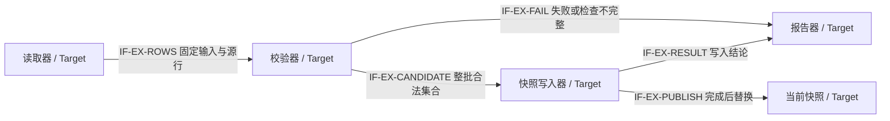

# 系统设计写作与评审指南

适用于 `design.system` 的写作和内容评审。章节编号以本次锁定的
[系统模板](../templates/design/architecture-design.md) 为准；项目只在用户要求升级时采用新版本。
本指南中的示例完全虚构，仅说明表达方式，不构成任何项目的设计或验证证据。

本文侧重内容深度与评审判据；AI 的任务计划、分步执行、绘图检查及续写流程见
[系统设计 AI Agent 编写指南](ai-system-design-authoring-guide.md)。两者配合使用，不替代项目事实和模板。

## 1. 先让读者理解系统

Markdown 不需要仿照 Word 排出长封面。当前系统模板的阅读顺序是：短封面 → §1 的目的/读者
与范围 → §2 产品应用与设计目标 → §3 系统概览 → 后续技术章。封面仅保留文档 ID、版本、状态、
项目、Owner、修改日期、模板 ID 与版本；其余控制信息和修订/导航移到附录 A，原 §1.3–1.6
的参考、裁剪、基线与假设移到附录 B，统一写作说明移到附录 C。不得把附录整段复制回开篇。
影响产品选择和理解的关键前提仍紧邻相关正文，首次出现的术语仍当场解释。

系统概览应是一段可独立阅读的说明：从一个真实问题开始，把系统放进使用环境，沿最重要的一条
数据路径或用户流程说明输入、处理和输出，再解释关键分工、当前范围以及三项主要取舍。
正文约 1–2 页；评审时折叠帮助块后计算篇幅。以自然语言串起因果关系，读者不应先打开其他文件
才能知道这些模块为什么需要协作。图或表用于说明关系，不能取代解释。

**错误写法**：“本系统包含接收、处理和输出模块，详见三个设计文档。”

**为什么错误**：这只能告诉读者文档在哪里，没有交代问题、数据、处理规则或外部结果。

**正确写法**：“这项虚构服务位于采集端与报表端之间，将不同来源的事件归并为统一记录。
接收单元负责格式检查，处理单元按来源和时间窗口归并，输出单元将结果交给报表端；失败记录
回到提交者可观察的错误路径。管理入口提供配置而不处理业务事件。当前完成接收校验，归并仍为
Target/Planned，尚无端到端验证证据。”随后说明该版本最重要的三项取舍及边界。

**完成检查**：请一位未参与设计的读者只看概览，复述问题、拓扑位置、输入处理输出、关键分工、
主路径、本版本范围及三项取舍。任一项只能回答“去看链接”时，应补写概览。

## 2. 根据责任选择 profile 和裁剪

以模板 §B.2 的矩阵作为章节适用规则：先写责任范围，再逐项核对硬件、软件、加速路径、UI、
信息安全和物理工程的触发条件。系统概览、关键功能/流程、接口、验证、实现计划和风险属于系统
核心；不同技术实现章节按事实触发。子系统/模块按领域使用 `design.definition` 或硬件/FPGA
专项模板，直接承接上级约束，说明自己承担的责任并引用系统背景；不重复建文，也不把整套
系统章节复制到每一个单元。

**错误写法**：“我们是软件，所以硬件、部署和安全全写 N/A。”

**为什么错误**：软件可能不设计板卡，但仍有运行资源、网络、身份、外部输入和调试入口；项目
标签不能代替实际责任判断。缺少依据的 N/A 还掩盖了未完成设计。

**正确写法**：“本服务不拥有板卡设计，§7 按已批准 TAIL-003 省略；节点资源和故障域在 §8.6
描述。服务存在管理入口和用户输入，因此 §15 适用，需说明信任边界和授权位置。”

**完成检查**：每个条件章节都有事实判断；每个 omit/simplify 都能追到 tailoring 文档、决定、
批准人和证据。待批决定保留 Pending 和受影响内容。章节合并仍能从原信息项找到新承载位置。
结构裁剪使用 `template_conformance=tailored` 和 `tailoring_ref`；工具仅检查引用关系，批准内容
与实际适用性仍由 Reviewer 核验。不要另建第二套版本锁或排除机制。

## 3. 把现状、规划和验证分清

三个维度回答不同问题。图的 `Current / Target / Transitional` 表示观察哪种架构；能力的
`Planned / Partial / Implemented` 表示实际落地到哪里；验证结果的
`NOT_RUN / BLOCKED / FAIL / PARTIAL / Verified` 表示在指定条件下证明到了哪里。
文档自身的 Draft/Approved 只描述文档控制状态。

**错误写法**：“当前架构已支持双节点恢复”，图中恢复模块只是下个版本计划，测试只覆盖单节点启动。

**为什么错误**：图混合了现有和未来模块，又把局部测试借用成整个能力的证据。

**正确写法**：当前启动能力写 Implemented/Verified，并引用对应基线下的启动测试；恢复能力
另写 Target/Planned/NOT_RUN。并存图用不同框型及文字标签，注明迁移期间哪些路径实际可达，
何时切换以及失败返回边界。单元测试只能证明被测单元，不代表生产 E2E 已验证。

**完成检查**：抽取任意一个关键能力，能找到其输入版本、配置/拓扑、已实现范围、验证结果和证据。
发现 Current 图含 Planned 对象时，应拆图或改成 Transitional 并补图例和迁移边界。

## 4. 让图解释关系

每张架构图应在图内或紧邻图注显示：图号和标题、视图状态、Baseline ID、适用版本/配置/拓扑、
对象和 Owner、责任/信任边界、箭头方向、数据或控制含义、协议/IF ID 和图例。图旁用一段话解释
代表路径及关键等待/失败点。对象状态和连线类型使用不同编码维度；例如未来对象用虚线框加
Target 标签，数据线和控制线分别用实线/点线并注文字，不能让同一种线型同时表示两种含义。

**错误写法**：`入口 → 引擎 → 存储`，所有对象样式相同，箭头不标含义，图注只有“系统架构”。

**为什么错误**：看不出是部署关系、调用还是数据传输，也不知是否已实现以及哪一侧对失败负责。

**正确写法**：“FIG-5-1，Current，Baseline B-01，单节点配置。接收单元（Owner A）通过 IF-01
把校验后的事件提交到处理单元（Owner B）；处理单元通过 IF-02 写入结果存储。实线为业务数据，
点线为管理控制；存储位于外部信任域。”图旁说明写入失败在哪个边界返回，真实协议由接口条目给出。

**完成检查**：把图和紧邻图注单独交给读者，读者能识别对象、方向、Owner、状态和适用范围；
每个块对应职责条目，每条跨 Owner 连接对应接口条目。纯概念草图标注“结构示例”并在正式稿替换。

## 5. 把数字写成可核查的结论

每项数值都有单位、作用域、负载/上下文、版本/配置/拓扑和来源。目标写 Target，规范限值写
Specified，计算/估算写 Modeled，仿真写 Simulated，实际测量写 Measured。未获得证据时写 Unknown
或 NOT_RUN；不能因为表格有 Measured 一栏就把估算填进去。并列比较的值必须使用相同范围。

**错误写法**：“吞吐 10000，容量 64，性能测试通过。”

**为什么错误**：没有单位、输入规模、节点数、来源、测量条件和通过阈值，无法复算或确认范围。

**正确写法**：“虚构算例：单节点、固定配置、每项记录 1 KiB，输入目标为 1000 records/s；
按 2 s 最大等待时间计算，所需 payload 缓存为 2000 KiB，类型为 Modeled。实现开销、运行余量
和实际测量尚未确定，不能将 2000 KiB 直接声明为支持上限。”

**完成检查**：Reviewer 能沿来源或公式复算数字，能区分支持范围、极限和目标，并确认实测报告
与声称范围一致。假设失效后的容量或性能结论进入风险表，不能继续显示为有效。

模型不仅是给数字贴标签。按模板 §13.1，从单次输入的资源需求推到整条路径：相同资源上的
计算时间、字节或空间要合计，多个阶段的独立峰值不能重复使用同一份预算。“各阶段取最小值”
需要同一负载口径及独立或已计入共享影响的资源前提，所得仍是上界而非支持承诺。模型应能帮助
作者决定增加资源、改变并行或限制入口，并说明延迟、容量和成本上的代价；验证再检验这些假设。

## 6. 系统设计的深度与唯一 authority

系统设计保留“为什么这样分工、如何协作、全局约束和失败影响”，下级文档维护完整字段定义、
内部算法细节、寄存器、安装步骤和测试程序。需要向下引用时，正文仍解释对当前系统有决定意义的语义；引用
同时固定 Document ID/路径/版本或提交、负责 Owner 和适用 scope。不能只留下链接，也不能复制
整份下级内容造成同步负担。

**错误写法一**：“接口详见 OpenAPI。”没有说明谁调用、何时调用、失败如何传播。

**错误写法二**：把全部 OpenAPI 字段或 RTL 状态机复制进系统设计，并手动修改默认值。

**为什么错误**：前者缺少系统设计，后者建立了竞争 authority，后续修订可能产生两套契约。

**正确写法**：说明提供方和消费方、主要请求/结果语义、权限、超时与重试边界、状态归属以及
失败后系统表现，再引用唯一契约的精确版本。模块内部算法写在定义文档，系统仅说明选择理由
与输入/输出保证，以及理解这些保证所必需的关键处理原理、数据变换和配对/流控条件。不能因为
细节有下级文档，就删除读懂主路径必需的解释。§14 给出验证策略、oracle 和覆盖；具体测试步骤
引用测试规格/程序。

必要的数据格式图与字段摘要可以从固定版本的机器定义提取或生成，标出来源、摘要范围和核对
方法，并明确它是解释性视图，不是另一份可独立修改的规范。还没有机器定义的新设计可以写
Proposed 结构，记录当前设计责任、待定项及后续契约形成条件；不能虚构现有 Schema，或以
“没有 Schema”为由不解释数据。逻辑结构图必须与真实字节布局区分。

**完成检查**：每个跨 Owner 边界只有一个行为/字段 authority；正文能够解释其协作责任，同时
与所引用版本一致。可读性与去重必须同时满足。

跨单元机制拆出后，系统正文仍解释端到端原理、关键阶段、系统级约束和代表失败，机制文档
唯一维护详细状态转换、参与方协议和恢复步骤。用同一 Process/Step/Constraint ID 及固定
文档基线核对摘要与细节；系统层阶段图不是另一份完整机制状态机。两层各自可读、范围互补，
不能把“唯一 authority”理解成系统只剩链接，也不能复制全套步骤后分别修改。

系统模板 §5.2 还必须把各章决定分配给下游，机制模板 §3.1、通用单元模板 §1.1 与硬件/FPGA
专项模板 §1.1 接收这些输入。专项模板 §12 直接关联约束的本地验证与系统组合验证，
不必另建通用单元文档；板卡和 FPGA 的共享预算不能因分别出具报告而被重复计入系统。
来源、决定状态、条件、预算/行为保证和设计自由度要一起传递，下游才能知道哪些不能自行
改变、哪些可以选择实现。原推导与契约不搬进分配表；上级汇总下级落实及组合验证，不用
“各自有 Owner”代替承接。拟议方案、设计分析、实现和实测分别记录，不能层层引用后变成已批准事实。

执行流程也有系统级与操作级之分。配置发布、主要管理操作和升级/回滚，需要在系统设计中
确定发起位置、入口、作用对象、执行方、阶段顺序、生效点和失败结果；不能只说“原子生效”
或“升级手册另述”。下级文档补参数全集及具体实现，操作手册承接逐条执行步骤，但不重新决定
系统什么时候停流、哪个版本可以服务以及什么情况下允许回退。数据不可逆迁移与信任撤销
可能阻止回滚，须在设计时明确；已有备份或健康探测不能自动证明可恢复。

## 7. 信息安全需要架构内容

信息安全章至少连接三张清单：资产和入口、控制措施及实施位置、威胁到验证与剩余风险的映射。
认证、授权、凭据、管理/调试入口、产物信任、升级和回退都要明确 Owner 和失败行为。
`management.security-plan` 可提供管理过程及评审责任，不能代替这些架构选择。

**错误写法**：“采用内网部署，遵循安全计划，因此无需信息安全设计。”

**为什么错误**：没有分析输入和维护入口，也没有说明身份、授权、升级来源或调试能力如何受控。

**正确写法**：识别输入和管理信任边界，说明授权决定点与执行点、凭据生命周期和日志脱敏；
更新包在受控信任链中验证，失败不转交执行；负向测试验证拒绝路径。尚未实现的措施写 Planned，
尚未验证的缓解不能作为已关闭威胁的理由。

**完成检查**：每项适用威胁能追到资产、路径、控制点、验证项和风险 Owner；安全回滚政策与
可靠性章的恢复流程没有冲突。检查内容可记录凭据引用与类别，不得填写真实密钥或秘密。

## 8. 使用帮助块与逐节完成条件

模板中的段落式 `
` 帮助保留“目的、必须写清楚、编写规范、抽象示例、完成条件”。
作者展开帮助后填写块外正文；每章回答系统问题，每节负责一个更具体的设计问题。不要复制
同一段“已满足要求”代替不同章节的结果。表格前后用文字说明因果和取舍；避免只有大量术语行。

关键节按“问题和对象—正常处理—为何这样选择—代价及边界—失败推演”展开成相互承接的段落。
这不是每项各填一句的表单：写到“检查”就说明检查对象和规则，写到“缓存”就说明保存什么、
何时释放及不缓存会怎样，写到“同步”就说明参与者、等待条件和失败结果。篇幅随问题复杂度
变化，不以字数判定质量；读者能否推演一项输入，才是展开深度是否足够的判断依据。

逐节完成条件应指向设计结果，而不只是“内容明确、有证据”。例如故障域的结果是能沿共享
依赖判断实际影响，恢复的结果是能解释每类在途对象的去向，页面的结果是能从布局走完一个
用户任务，启动与热设计的结果是能沿条件变化推演控制动作。评审可以换一个条件检验推导：
共享控制器失效、配置只在部分实例生效、升级后出现新格式数据，或风扇恢复但温度仍高；正文
若只能再次回答“自动处理”，就还缺少机制或适用边界，不能因表格已填满而通过。

每种重要模式分别写场景、图、编号步骤、原理、限制和代表失败；关键模块分别写输入生命周期、
状态读写与交付/释放条件。功能、过程、模块、数据章从不同角度解释同一条责任链，不复制四遍
相同步骤：功能讲外部语义，过程讲跨模块顺序及模式差异，模块讲局部机制，数据章讲对象变化。通过稳定 ID
相互定位，只有读懂当前节所需的语义在本节重复。

模板第 6 章是“重要过程”，不再仅承担正常数据流：§6.1 建立过程索引与工作模式，§6.2 写
启动，§6.3 写配置加载与生效，§6.4 写数据平面，§6.5 写停止/重启，§6.6 写异常恢复，§6.7
写模式切换。新增的生命周期说明都要有段落式推导、流程图或时序图及步骤，不能用“各模块
初始化完成”跳过系统顺序。纯软件也需要启动与初始配置说明，但不需要复制不适用的上电步骤。

评审时连读几个过程：启动只开放管理入口时，业务请求应怎样返回；配置保存后但尚未生效时，
数据路径究竟使用哪个版本；停流时配置发布与在途任务谁先结束。每个过程单看正确但交叉起来
无法判断结果，仍是设计缺口。专业章节保留硬件时序、状态一致性、接口和可靠性机制，完整
系统级过程由第 6 章串起；详细机制按本指南 §6 分工，升级等已有完整专节的过程在模板 §6.1
索引其唯一正文，不再复制一份。

涉及唯一执行者时，再用两个同时到达的启动请求检查排他范围：先查询不存在再启动并不能
自动防止重复创建，超时也不证明旧执行者已退出。配置版本同时检查内存与持久化生命周期：
请求不再引用旧内存副本，不代表重启、回退或审计不再需要对应持久化版本。不同对象的释放
条件应分别写明，不能用同一个“自动清理”掩盖这些区别。

评审先折叠帮助检查正文可读性，再逐节对照完成条件找证据。一个章节有内容、标题齐全或来源
工具 PASS，只证明不同层面的事实。内容评审检查逻辑和证据；模板工具不自动判断架构质量。
未闭合项记录 Owner、影响和关闭条件，涉及该能力的完成结论保持未完成；这允许诚实的 Draft，
不允许把未验证状态伪装成合格的产品能力。

遇到关键机制未定时按本指南 §11 做章节预设计，不能仅登记未决项后把本节视为完成。所有适用
节还需统一检查：实际决定、依据、下游必须遵守的约束、允许自由度和承接检查分别在哪里。
答案来自正文和分配引用，不是五句固定结尾；不涉及下游分配的节说明其结果使用方或边界。

模板帮助可以在正式交付时删除；保留顶部规则、已选 profile/裁剪证据、版本/状态说明、正文、
图例及引用。导出工具不支持折叠时可从交付副本删除帮助；不要为了降低帮助占比而缩减设计内容。

评审顺序：先读概览复述系统，再沿主流程核对图和职责，最后检查状态/证据、适用性、安全和
authority。一次只沿有意义的责任链核对，避免把检查退化成“标题数量达标”。

## 9. 贯穿示例：离线图书目录导入工具

以下完全虚构，使用 `EXAMPLE-BOOK-01` 作为统一示例基线，所有能力均为 Target / Planned /
NOT_RUN，所有结构均为 Proposed；不存在对应的已实现项目或测试报告。这是一组完整展开的
关键节写法示范，不是覆盖安全、性能、部署等全部章节的可交付系统设计，也不是要求项目采用
这些机制。它只使用公开常识构造的场景、字段和流程，不使用任何保密参考文档的业务内容。

### 9.1 应用、问题与系统分工

整理人员从外部编目工具导出目录文件，本机阅读器却要求每个书目编号只对应一条记录。文件中
的重复编号和空标题会造成歧义，直接覆盖旧目录还可能让本来可用的目录被错误文件替换。因此
拟建一个离线导入工具：先检查输入，给使用者指出具体问题；只有整批有效且使用者明确选择
生成模式时，才用新快照替换当前目录。工具不负责编辑原始书目、不提供问答服务，也不改变
阅读器的检索逻辑。当前尚未实现，下面描述的是目标方案，不是现状。

工具分为读取器、校验器、报告器和快照写入器。读取器负责取得固定输入副本和源行号；校验器
负责记录合法性与整批唯一性；报告器负责可定位的反馈；写入器只接收已通过整批校验的集合，
是当前快照的唯一写入者。这样分工使“只检查、不改目录”与“检查后生成”复用同一套规则，
又把影响当前目录的动作限制在一个位置。代价是发布前必须保留候选集合，需要明确单次输入
容量；容量与内存上限尚待预算和验证，不能宣称支持任意大小文件。

### 9.2 功能如何实现：整批校验，而非部分覆盖

功能 `F-BOOK-01` 接受一个用户选择的 UTF-8 CSV 文件，表头包含 `book_id` 和 `title`。
本例规则把编号视为非空字符串，保留前导零；标题去除两端 ASCII 空格后不得为空。读取器
获取本次任务的固定输入副本和摘要后，所有检查均针对该副本，不在读取途中混用另一次文件
版本。报告也绑定这个摘要，以免使用者拿旧报告解释后来修改的文件。无法取得可处理输入时
直接返回任务错误，不进入发布路径。

校验器依次检查每行字段，并在任务内建立“编号→首次出现行号”的索引。已满足字段规则的
记录才进入候选集合；后续遇到相同编号时，不覆盖首条记录，而是记录首次与当前行号的冲突。
格式允许继续解析时，工具收集其余错误，减少使用者逐个修正、反复运行的次数；无法继续解析
或资源不足时则终止并标记报告不完整，不能把已检查前缀当作全文件通过。

例如编号为 `0012` 的合法记录先出现，随后另一行再次使用 `0012`，报告应同时指出两行，
整批结果为失败。选择禁止部分发布，是因为用户要替换完整目录，而不是应用增量补丁；若仅
跳过错误行，生成的目录会静默丢失用户希望保留的内容。相应代价是一个错误也会阻止整批生成。
验收应验证错误定位、整批失败和当前快照未变三个结果，只检查“返回失败”不能覆盖这项功能。

### 9.3 模式一：仅校验

`MODE-CHECK` 用于提交正式目录前检查文件。此模式生成诊断报告，但不调用写入器；即使校验
成功，也不代表当前目录已经改变。下图在工具边界内的对象由 Import Owner 负责，用户为外部
输入方。`IF-EX-*` 是本算例的逻辑交接标识，不代表已有协议文件或真实网络连接。

FIG-EX-1，仅校验路径；EXAMPLE-BOOK-01，Target/Planned/NOT_RUN，本机单任务。
实线箭头为本次任务的数据或结果交接，Owner/边界如上；快照写入器不在本模式可达路径中。

1. 读取器取得固定输入副本，计算用于报告关联的摘要，按顺序产生带源行号的记录。
2. 校验器按 `F-BOOK-01` 检查字段与重复编号，得到候选集合和错误清单。
3. 报告器返回通过/失败及检查是否完整。成功时报告合法记录数；失败时定位已发现的问题。
4. 工具结束任务并释放候选集合与编号索引，当前快照始终未被写入。

把校验结果留在任务内，而不是把它当作以后生成的通行证，可以避免输入改变后仍沿用旧结论。
代价是正式生成时需要重新检查那次实际输入。若中途内存不足，报告只能说明检查未完成及已知
问题；用户不能据此断言文件没有其他错误。当前快照不变是这条路径的行为保证，不是测试已
通过的证据；测试应监视写入入口未被调用，并检查快照内容未变。

### 9.4 模式二：校验后生成目录快照

`MODE-GENERATE` 用于完整替换目录，共用固定输入与整批校验规则，但增加了快照发布步骤。
本例只设计本机、单写入任务的范围：已有写入任务时拒绝第二任务，排他约束由写入器执行；
具体锁与异常释放实现仍需在下级规格和测试中确定，不宣称跨主机多写者一致性。

FIG-EX-2，生成路径；EXAMPLE-BOOK-01，Target/Planned/NOT_RUN，本机单写入任务。
实线为有条件的数据或结果交接；所有内部对象由 Import Owner 负责，当前快照由外部阅读器
消费。读取输入和报告交付边界同 FIG-EX-1；箭头是逻辑接口，不声称实际协议已经实现。

1. 工具重新取得这次选择的固定输入，执行完整校验；不复用另一输入版本的通过报告。
2. 任一错误或检查不完整都结束生成路径并返回报告，已发布目录保持不变。
3. 整批通过后，写入器在排他写入范围内将候选集合写入与当前快照同一文件系统的临时文件。
4. 临时文件写完并完成所需检查后，利用目标文件系统的原子替换能力切换当前快照；只有替换
   成功后才返回生成成功。目标环境是否满足该前提需验证，不满足时不能沿用该发布保证。

临时文件与当前目录分离，使逐条写入期间阅读器不会读到半个新目录。替换是发布分界：替换
前失败保留旧目录；替换后新打开快照的读者读取新版本，已打开旧文件的读者行为需按目标环境
固定并验证。仅有原子替换并不证明断电持久性；突然掉电和介质损坏后的恢复不在本例已证明
范围，不能把“进程内生成成功”扩展为所有故障下的数据安全。

如果替换已发生，但进程在报告成功前退出，调用者可能不知道操作结果。恢复时应核对当前
快照及关联的输入标识后报告结果，不能把没有收到成功响应当作替换未发生；具体恢复记录和
核对方法仍是待定设计。临时文件清理、排他写入及结果不确定场景必须进入实现前的未决事项，
不能因这段原理说明完整而声称实现或验收已经完成。

### 9.5 模块处理：校验器为什么需要任务内索引

校验器的输入是固定输入中的一条记录及其源行号，输出是候选记录或诊断；它不直接写当前
目录。逐行检查只能发现本行字段问题，无法判断此前是否出现过相同编号，因此还需要一个
任务内编号索引。选择索引而不是反复扫描此前全部记录，是为了避免随文件增长重复进行整段
查找，代价是额外内存与分配失败路径；性能和内存结论仍需按实际实现验证。

对每行，校验器先验证字段，再查编号索引；未出现过才登记首次行号并加入候选集合，已出现
则产生冲突诊断。此顺序保证空编号不会进入索引，也不会因为后来的重复记录而丢失最初的来源
位置。候选与诊断使用同一个输入副本的行号，所以无需跨文件配对；并发多文件不在当前范围。
文件检查结束前，候选仅是暂存结果，不能被写入器提前消费。

任务完成或中断后释放索引；若误把索引保留到下一任务，不同文件中的合法相同编号会被误报。
因此测试除了同文件重复，还应连续执行两个合法文件，证明状态不会串到下一任务。分配失败
应产生任务失败和不完整报告，不能悄悄跳过唯一性检查继续返回成功。模块设计由此把作用域、
顺序、资源和外部语义连接起来，而不是只列“校验模块：负责校验”。

### 9.6 数据结构与前后变化

以下是解释性逻辑视图，不是 CSV 字节布局或完整 Schema。本算例尚无机器定义，由本节说明
Proposed 语义；编码、字段全集及兼容规则需由后续契约明确。真实项目若已有机器定义，应从
其固定版本提取同样范围的摘要并核对一致性，不能另外手写一份竞争规范。

| 阶段 | 代表形态 | 变化及原因 | 生产者与消费者 |
|---|---|---|---|
| DATA-A | 原始行 `0012, 标题甲 `，源行号 2 | 保留固定输入字节和来源，供后续检查及定位 | 读取器 → 校验器 |
| DATA-B | 候选 `{book_id:"0012", title:"标题甲"}`，旁路诊断位置 `source_line:2` | 编号保持字符串，标题按已声明规则去两端 ASCII 空格；行号用于报告，不是书目属性 | 校验器 → 报告器，或整批通过后的写入器 |
| DATA-C | 快照中的书目记录集合 | 不写入源行号；只在生成模式发布，输入摘要与发布结果的关联方式仍待设计 | 写入器 → 阅读器 |

DATA-A 到 DATA-B 改变的是标题表示，不是书目身份；把编号转换为整数会丢掉前导零，因此
不符合本例规则。源行号只在固定输入中有意义，随着书目进入阅读器便不再承担定位责任，不能
拿它作为跨文件的永久标识。失败报告使用摘要加行号定位输入，但摘要本身不证明发布成功。

仅校验模式在 DATA-B 结束后释放任务状态；生成模式则在整批通过后进入 DATA-C。这个差异
与前述两张模式图吻合，也解释了为什么只列三个数据格式名称不够：读者还需要知道每次变换
发生的条件、字段为何变化以及谁从中获得什么信息。

### 9.7 怎样判断展开程度合格

读者现在应能解释：为什么分离校验与发布、为什么需要任务内索引、重复记录在哪里阻止生成、
只校验为何不改变目录、源行号为何不进入书目快照，以及替换前失败和替换后结果未知的区别。
这些答案来自图、步骤与因果段落的配合，不靠模块链接或表格数量。若只能复述组件名称，说明
正文仍未讲透原理。

本例同时保留真实的设计缺口：输入与内存上限、完整契约、排他执行与异常清理、结果恢复、
文件系统能力及断电恢复验证仍需决定。写作者不能为了照着示例“写完整”而补造决定或测试。
模板帮助的是表达和发现缺口，真实方案及证据仍由项目提供；结构完整不等于设计已具备实现条件。

## 10. 可测试性、可维护性与调试的分工

§14 用六节讲清主要测试方法与判定、测试控制与故障恢复、环境快速部署与复位、并发环境隔离、
自动化复现以及覆盖验收。每节围绕实际场景简要解释做法与限制，不堆砌测试术语。可观测性和
统计、日志与故障定位要求写在 §12.2，自检与诊断作为其下的 §12.2.1；§12.3 专门说明升级与回滚。
指示灯、状态查询、维护/调试命令，以及替代依赖、旁路和环回接口的能力要求写在 §11.4。
§14 引用这些设计来组织验证，不重复定义机制。

系统设计必须提出维护要求，不能只罗列“有指示灯、有统计、有日志”。说明需要呈现哪些状态、
查询或操作哪些能力、统计什么及口径、记录哪些事件、支持定位到哪一级，以及责任模块和验收
依据。主要调试命令的类别、能力、运行位置、被控对象、入口和执行流程也须在系统设计阶段
确定，关键操作给代表调用和结果判据；不能把这些决定推迟为“下级补充”。应区分维护机上的
远程客户端、目标节点本地命令或串口操作，明确工具环境、权限、前置条件及取消/退出方式。
参数全集、解析实现、引脚、完整日志 Schema 等由下级规格承接；系统层仍保留关键语义与分工，
不退化成只有需求编号的索引。

方法要贴合系统主要行为。例如 HIFM 的 prompt/LLM 返回检查思路，可以展开为固定输入与配置、
发送请求、检查内容和结构、保存原始结果。随后说明测试环境怎样就绪和复位，多任务如何分配
资源、避免相互清理，自动化怎样保留失败并按同一输入重跑。具体事实与阈值仍需项目提供，
这里不声称已有测试能力或通过证据。

不能把这些重点当成全部验证内容：仍需根据功能、接口、模式和故障模型补齐边界输入、可控
状态、故障注入和恢复判据，并在覆盖矩阵中保留缺口。测试环境相互隔离是为了防止任务串扰；
业务并发测试则可能有意共享被测服务，两类场景及结论必须分开。

## 11. 从章节预设计到下游承接

当作者还不能推演关键机制、说明取舍或给出判定方法时，应先解决这些问题，而不是先填完整
章节目录。把本节真正需要决定的问题列出来，逐个固定输入、约束及已知事实，比较可行选项，
沿同一正常输入和代表失败检查结果，再给推荐、代价及待验证项。若只有一个可行方案，也说明
约束为何排除了其他选项，不凑两个虚假选项。简单问题在本节草稿完成，复杂问题使用已有
`evaluation.technical-analysis`；其备选、方法、反例、建议和后续行动即可承载，不新增模板种类。

**错误写法**：“内存是否足够待定，Owner 后续确认；本章设计完成。”这只登记了问题，没有
说明怎样做决定，也隐藏了对下游实现的影响。

**改进路径（完全虚构，沿用目录工具的 Target/Planned/NOT_RUN 背景）**：先问“在固定的输入
上限内，全量候选与编号索引能否同时放入分配内存？”列出记录数、字段长度、索引开销及公共
预算的来源；缺少其中一项就说明需收集什么，而不是填一个想象的平均值。比较全量保留与受控
外部暂存等适用方案，推演重复记录、内存不足和临时存储失败后如何保持整批不发布，并比较
额外 I/O、清理及部署依赖。这里是在比较选项，不为示例工具新增已批准的存储机制。

若推荐先验证全量方案，下一步应明确要用哪个固定输入范围分析/测量峰值、如何计入实现开销、
结果低于何种分配才可继续；不满足时返回上级评估限制输入、重新分配或选择其他方案。输入
范围尚未确认时，分析可以条件式继续，但相关容量结论和依赖它的实现不能被宣称已闭合。
已有足够依据完成设计判断，也不代表实现已完成或实测已通过；反之，关键机制仍未知时，填上
Planned/NOT_RUN 也不能让设计自动完成。

选定方案后，分析引用留作理由，机制、限制、失败行为和验证方法必须写回正文；重要决定按
既有权限及 ADR 规则记录，不因为写了“推荐”就标 Approved。不相关章节可以继续，依赖该
决定的工作明确等待条件。关闭未决项时检查概览、流程、预算、约束分配和下级输入是否同步，
不能只将问题表改为 Done。

**承接的组合检查**：不能把整机 64 MiB 同时分给三个单元各自使用，再因三者分别小于 64 MiB
宣称整体通过。系统模板 §5.2 的虚构算例把它分为 16 + 24 + 16 + 8 MiB，仍需明确公共项、
副本与同一并发峰值口径。下级记录继承值和落实方式，上级检查组合模型及后续证据；允许选择
索引算法不等于允许扩大预算或改变错误行为。延迟还要按执行路径、排队和并行关系组合，不能
简单叠加局部分位数或混合不同负载。行为约束则逐跳检查提供方保证是否满足消费方前提。

评审结束时应能从一个系统约束找到原推导、承接单元、下级落实和验证，再从下级的差距反查
应由谁裁决、哪些流程和预算受影响。下级尚未开始时保留待承接状态及检查计划，不伪造签收
或通过结果；分配本身可完成设计，系统组合验证仍按实际进度开放。
