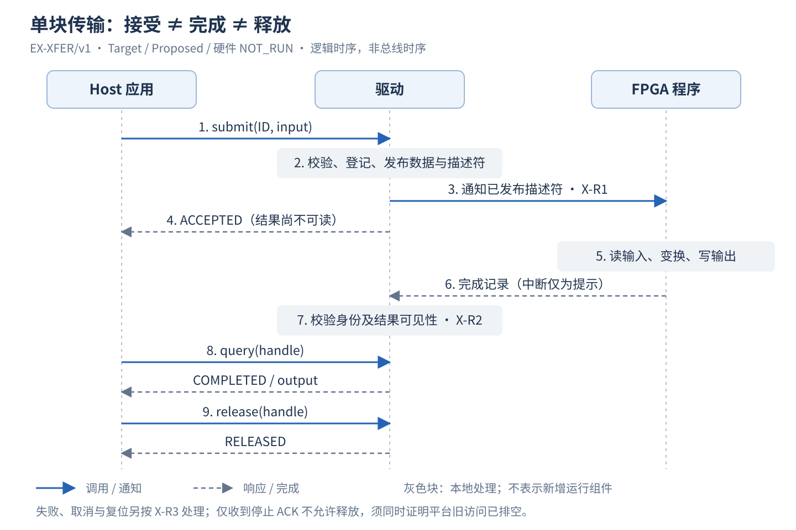

# 虚构案例：Host—驱动—FPGA 单块数据传输

版本：0.1.0-draft.1 · 日期：2026-09-12 · Target / Proposed / 真实设备 NOT_IMPLEMENTED、NOT_RUN

本例是公开、独立构造的教学设计，不引用 HIFM 或保密 demo 的协议、参数与实现。
它展示如何把一项软硬件协作写清楚，不能直接作为项目实现输入。平台无法提供所要求的
停止/排空保证时，应记录设计或实现缺口，不假定增加一个状态字段就获得安全能力。

## 1. 用途与范围

测试应用提交一块数据，驱动安排 FPGA 将每个输入字节异或 `0x5a` 写入独立输出缓冲区，
完成后应用读取结果。这样可用独立 Oracle 检查数据路径，而不是以中断到达作为处理成功。
本例只有一个独占设备会话和一个在途槽位，没有多队列、持久化、自动重放或租户调度。
每会话最多接受 256 个不同 request ID，终态及冻结输入保留到会话关闭，避免无限增长的去重历史；
达到上限时新 ID 返回 LEDGER_FULL，既有 ID 的查询、取消、释放和幂等调用仍可用。
输入和输出由驱动私有分配并登记，应用不能在在途期间修改或释放；输出没有外部业务副作用。

应用到驱动是逻辑调用，驱动到 FPGA 是描述符、通知与完成交接。逻辑调用中的句柄不是
DMA 地址；图中的箭头也不指定 PCIe/AXI 标准。设备总线、驱动框架与平台 fence 的具体实现
必须由实际项目选择并验证，本例只冻结共同保证。

[可编辑 SVG](xfer-sequence.svg)复用 STD 机制图的灰蓝模块、请求实线及响应虚线样式；不需要外部绘图服务。

图 X-1 是 Target 逻辑时序，不是总线时序或中断实现；通知及完成的可见性要求见 X-R1/2。
具体传输可另选，但任何实现都必须保留这些先后关系。正常路径中应用也可在完成前查询，
得到 ACCEPTED；轮询或通知丢失都不改变驱动的权威状态。

## 2. 参与方与约束承接

| 参与方 | 决定及持有 | 不能自行决定 | 本地/组合验证 |
|---|---|---|---|
| Host 应用 | 输入、request ID、何时取消/读取/释放 | 不能解释 ACCEPTED 为结果可读，不能重新提交同 ID 不同输入 | 调用关联、结果 Oracle / X-V1、X-V4 |
| 驱动 | 会话/epoch、私有缓冲区、描述符发布、对应用状态 | 不能以软件 timeout 证明 DMA 停止 | 校验/内存与设备同步 / X-V2、X-V3 |
| FPGA 程序 | 本次描述符执行、完成记录、停止后不再发起访问 | 不能在通知之前读未发布描述符，不能越界或重复完成 | RTL/模拟检查 / X-V1、X-V3 |
| 平台 DMA 隔离/排空能力 | 地址映射、停止接收旧访问及已发出访问的可见完成 | 不能以设备逻辑复位代替 fabric/Host 侧排空 | 平台实现及真实设备组合验证 / X-V3 |

平台能力是明确的下游设计输入，不是本例新增一个通用服务。它可能由既有驱动、设备和
总线能力组合实现。必须给出实际实现位置、返回条件与反例；尚未选择方案时 X-R3 仍为
设计未闭合，不能只标“等待实测”。单板独占由驱动准入执行，复位不能并发影响其他测试。

## 3. 唯一规则与原生布局

本节拥有行为；[xfer-native.h](xfer-native.h) 是示例描述符与完成记录的字段/偏移 authority。
它是原生 C 表达，不是自动生成的产品头文件；下面的完整阅读表须与它核对。Host 结构的
`sizeof/offsetof` 检查只证明布局，不允许把大端 Host 内存直接当作小端 wire 字节。

| ID | 共同规则 | 下游自由度 |
|---|---|---|
| X-R1 | 驱动冻结输入并登记互不重叠的输入/输出映射；输入和描述符对设备可见后才能通知。接受后独占至 X-R2 或 X-R3 允许释放 | 平台内存同步、通知实现；不得改变发布顺序 |
| X-R2 | COMPLETED 需要匹配 epoch/request ID、合法结果/长度、输出对 CPU 可见且设备不再访问这次缓冲区。完成记录必须在输出及最后访问之后发布 | 中断/轮询可选；单个中断不作完成证据 |
| X-R3 | 取消先停止新提交；只有设备停止确认和平台隔离/排空确认都覆盖旧 epoch 的全部访问，才能标 SAFE_STOPPED 并释放旧映射。逻辑 reset ACK 单独不足 | 如何得到可信停止/排空证据由下游设计；失败保持隔离 |
| X-R4 | 同会话 request ID 不复用；同 ID 同冻结输入返回原操作，同 ID 不同输入拒绝。旧 epoch/不匹配 ID 的完成不能改变当前操作 | 去重索引组织；本例终态保留至会话关闭 |
| X-R5 | 一个槽位；新 ID 在槽位占用时返回 BUSY，不通知设备，不占用新缓冲区。长度非法在准入前拒绝 | 内部内存管理；不得增加隐式排队或自动重试 |

描述符 32 bytes，小端；所有设备地址 64-byte 对齐，长度 1–4096 bytes，已登记映射容量至少
为 length，输入/输出不重叠。地址为驱动在选定地址域中的有效 DMA 地址，不由应用输入。
两个地址、长度、request ID 和 epoch 在本次请求内冻结。

| IF-XFER#DESC 字段 | 偏移/宽度 | 含义及约束 |
|---|---|---|
| input_addr | 0 / u64 | 本会话登记的只读设备输入地址 |
| output_addr | 8 / u64 | 本会话登记的私有输出地址，容量足够 |
| request_id | 16 / u64 | 会话内非零且不复用；耗尽后拒绝新请求 |
| length | 24 / u32 | 1–4096 bytes，不超过两侧已登记容量 |
| epoch | 28 / u32 | 驱动分配的非零设备会话代次，不回绕复用 |

| IF-XFER#COMPLETE 字段 | 偏移/宽度 | 含义及约束 |
|---|---|---|
| request_id | 0 / u64 | 原提交身份，必须匹配 |
| epoch | 8 / u32 | 原提交代次，必须匹配 |
| status | 12 / u32 | 0=OK，1=DEVICE_ERROR；其他值非法，不得据此完成/释放 |
| bytes_done | 16 / u32 | OK 时必须等于 length；DEVICE_ERROR 为 0，不声明部分结果有效 |
| reserved | 20 / u32 | 必须为零；接收端非零按协议错误处理 |

完成记录为 24 bytes。DEVICE_ERROR 记录只有在设备已停止本次所有访问且按 X-R2 发布后
才允许终结为 FAILED；仅收到错误中断或格式错误记录则结果未知、继续隔离。协议版本由
设备发现入口与驱动支持表固定为 `EX-XFER/v1`，不把版本塞进未定义字段；不匹配时不提交。
该发现入口、描述符承载、通知、完成读取和停止/fence 是项目需提供的传输绑定，未绑定前
本例只能做逻辑/布局验证，不能声称已给出可运行的板卡协议。

## 4. 完整逻辑调用与错误

本节定义教学调用值域，不指定 HTTP、ioctl 或某一操作系统 ABI。正式项目应将这些逻辑
操作映射到既有接口格式，并补齐其原生签名；不得给检查器换一份 JSON 协议后宣称原生已验。

| 调用 | 完整输入 | 成功返回 | 明确拒绝/下一步 |
|---|---|---|---|
| submit | session，request_id，input bytes（长度1–4096） | handle=(session,epoch,request_id)，state=ACCEPTED | BAD_INPUT/CONFLICT/BUSY/LEDGER_FULL/EPOCH_EXHAUSTED：未新增执行；查询旧 handle，或处理未受理输入/维护阻塞 |
| query | 本会话 handle | state=ACCEPTED/COMPLETED/FAILED/STOPPING/SAFE_STOPPED/RELEASED；仅 COMPLETED 有完整 output bytes，其余 output=null | BAD_HANDLE：无合法关联，不猜目标、不影响当前操作 |
| cancel | 本会话 handle | state=STOPPING，或已有终态；不返回伪造完成结果 | BAD_HANDLE；已释放则幂等返回 RELEASED |
| release | 本会话 handle | state=RELEASED；output=null | NOT_SAFE：仍受理中或停止未确认，保留映射，可 query/cancel |

所有调用首先校验 session 与 handle 归属；无授权会话统一 FORBIDDEN，无状态变化。
submit 同 ID 重复优先查既有冻结输入，再查容量；同参数返回既有状态/handle（包括 RELEASED），
不会因已释放自动创建新执行。这四项是非阻塞逻辑调用；应用轮询 query 的等待期限属于调用方
策略，不是省略的接口参数，期限结束仅表示停止等待，取消须显式调用。驱动进程退出或设备复位丢失关联时，不恢复旧请求，旧映射隔离至 X-R3
证明安全；新会话开放前完成相同检查，epoch 耗尽或不可安全恢复时拒绝开放。
本例校验顺序是会话授权、输入合法性、旧 ID 参数核对、槽位容量、历史容量，再准备新执行；
容量耗尽不能删除旧去重记录来放行。会话生命周期由驱动既有独占设备入口管理，不由业务调用隐式重开。

一套具体调用：session=S1、epoch=7，submit(101, `[00,01,ff]`) 返回 handle=(S1,7,101)/ACCEPTED。
FPGA 应输出 `[5a,5b,a5]`，并发布 COMPLETE={request_id:101,epoch:7,status:0,bytes_done:3,reserved:0}。
驱动完成 X-R2 的可见性核对后，query 返回 COMPLETED/output=[5a,5b,a5]；release 返回 RELEASED。
同 ID 改为 `[00,02,ff]` 返回 CONFLICT；还在运行时 release 返回 NOT_SAFE；epoch=6 的完成被拒绝为
迟到旧事件并记诊断，当前请求仍 ACCEPTED。参数方括号是十六进制字节展示，不是新序列化格式。

## 5. 停止、复位和资源归还

| 当前状态/事件 | 事实由谁产生 | 驱动判定及资源动作 |
|---|---|---|
| ACCEPTED / 匹配完成 | FPGA 按 X-R2 发布；驱动完成平台同步 | COMPLETED 或 FAILED；之后可 release，尚未 release 时仍占槽 |
| ACCEPTED / cancel | 驱动关闭本槽提交并发起停止 | STOPPING，不能归还映射 |
| STOPPING / 设备停止确认 | FPGA 保证该 epoch 不再发起新访问 | 只记 device_stopped，仍等待平台证明 |
| STOPPING / 平台确认 | 平台隔离并排空旧 epoch 已发出的全部访问 | 与 device_stopped 都为真才 SAFE_STOPPED；结果可未知，不冒充成功 |
| STOPPING / 期限到、fence 失败或证据不可读 | 等待者记录实际失败/缺失 | 保持 STOPPING/BLOCKED，不能因计时器结束生成“已安全” |
| STOPPING / 匹配或旧完成 | 驱动校验身份，但不撤回停止选择 | 记录诊断，不绕过 X-R3，不向应用返回 COMPLETED |
| COMPLETED/FAILED/SAFE_STOPPED / release | 驱动核对终态与映射身份 | RELEASED，归还映射及槽位，保留终态去重记录 |

两个安全事实必须绑定同一旧 epoch，不接受无对象的“全局成功”。驱动收到证据的顺序可不同，
但检查的事实需同时成立；平台所谓 fence 若只保证通知写入而不涵盖设备数据访问，则不满足本例。
确认方法缺失是下游设计缺口。安全成立但结果证据丢失时，应用可丢弃本例私有输出并释放；
对于有不可撤销外部写入的产品，不能直接复用此策略。

停止路径释放后，重新开放设备需以新 epoch 完成重新初始化、映射与准入；不能重新开放旧 epoch。
模型只模拟 epoch 更新，实际重新初始化与平台解绑/重绑仍是项目实现义务，失败时禁止新提交。
完成与取消竞争由驱动串行裁决：若先接受可信完成，cancel 返回该终态；若先进入 STOPPING，
后到完成不绕过停止确认。release 后新的 request ID 可用槽位，但旧完成永远不能作用于新操作。
状态/Guard 唯一在本节；测试及下级设计引用 X-R2/3/4，不各写另一套“超时就释放”规则。

## 6. 映射与原生检查边界

| 逻辑 ID | 唯一源/定位 | 下游与检查 |
|---|---|---|
| IF-XFER#DESC | xfer-native.h：`struct xfer_desc_v1 {` | 驱动编码、FPGA 解码；完整字段、偏移、端序向量 |
| IF-XFER#COMPLETE | xfer-native.h：`struct xfer_complete_v1 {` | FPGA 产生、驱动校验；身份、状态、长度与可见性 |
| IF-XFER#SUBMIT/QUERY/CANCEL/RELEASE | 本文 §4 逻辑契约 | 尚无原生 OS 调用定义；未达到接口实现基线，不建空文件 |

使用 catalog 时，native literal 只能证明上述唯一声明行及文件 hash/版本可定位，不能证明
所有 C 字段、RTL 端口或 ABI 一致；原生检查的命令及覆盖另行报告。本文刻意不制造一个
`complete` JSON catalog 来绕过缺少真实传输/OS 签名的事实。
驱动/FPGA 正式规格需引用原头文件或项目真正 authority，提供原生解析/编译和共同字节向量；
命令未知或工具不支持则对应项未检查，不能把“目录 PASS”扩大成硬件接口 PASS。

## 7. 设计验证项、Case、环境与 Run

| 设计 V / 规则 | 可执行 Case 要证明什么 | 环境 | 当前边界 |
|---|---|---|---|
| X-V1 / X-R1/2 | X-T1：合法输入、变换 Oracle、匹配完整完成；结构单独用黄金字节向量检查 | X-ENV-M 模型；X-ENV-C C布局；X-ENV-H板卡 | 模型/布局可执行；硬件未实现、NOT_RUN |
| X-V2 / X-R4/5 | X-T2：非法长度、同 ID 换输入、重复、BUSY、旧 epoch/ID 完成 | X-ENV-M / X-ENV-H | 模型可执行；硬件 NOT_RUN |
| X-V3 / X-R3 | X-T3：取消后仅设备 ACK 不释放；缺证据继续阻塞；同代次双确认后释放 | X-ENV-M / X-ENV-H | 模型不能证明真实 DMA fence；平台绑定未定 |
| X-V4 / X-R2/3/4 | X-T4：完成先到、取消先到、释放后新操作与迟到旧完成 | X-ENV-M / X-ENV-H | 模型可执行；真实并发、隔离 NOT_RUN |

[test_host_fpga_example.py](../../tests/test_host_fpga_example.py) 是教学参考模型及布局测试，
不是驱动/RTL 实现，也不是平台适配器。测试通过外部调用和具名完成/停止确认事件推进状态，
不直接赋 SAFE_STOPPED 来通过断言。向量与模型 PASS 均不能关闭 X-ENV-H 的义务。
实际 Run 应保存命令、退出码、基线、环境、日志及缺口；本文不预填 Run ID 或板卡通过结论。

X-ENV-H 需具备可确认旧 DMA 停止/排空的真实控制与观察；未实现前 BLOCKED。它按整板独占
部署和复位，退出时仍未安全停止则保持隔离，不让下一条 Case 使用该板。正式项目还需给出
真实脚本、路径、资源锁和清理证据；不从本例推断这些能力已经存在。

## 8. 怎样用于模板和批量写作

接口控制模板承载 §2/3/6 的边界与原生 authority；契约规格承载 §3–5 的行为及完整调用；
测试规格承接 §7 的 V/Case/环境/Run。实际项目不必拆成三份重复文档，按唯一 authority 精确引用。
修改 X-R3 时回查调用返回、状态表、图、资源释放、FPGA 停止义务、平台 fence 和 X-T3/4，
并按批量指南检查其他使用同一缓冲区或复位域的机制。不能只修改本文件里的措辞。
