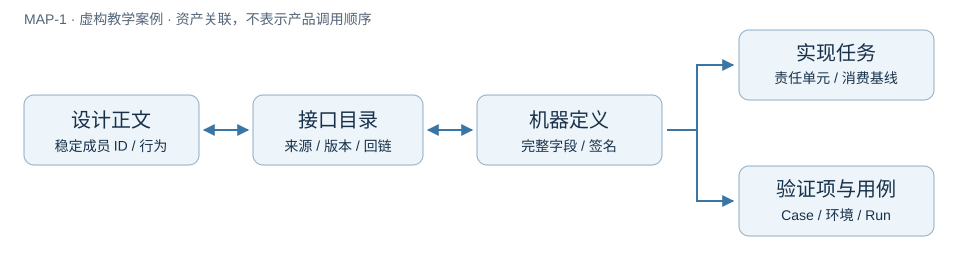

<!-- STD_DOCUMENT_COVER_BEGIN -->
# 虚构暂存导出：正文到接口、实现与验证的完整映射

| 文档字段 | 值 |
|---|---|
| Document ID | `EX-EXPORT-MAPPING` |
| Document Version | `3.1.0-draft.1` |
| Status | `Draft` |
| Project | `STD` |
| Document Owner | `STD Example Maintainer` |
| Last Modified Date | `2026-09-12` |
| Template ID | `interfaces.control` |
| Template Version | `0.2.0` |
<!-- STD_DOCUMENT_COVER_END -->


Target / Proposed / 服务未实现 / Runtime NOT_RUN



图 MAP-1 是跨资产导航，不是产品调用流程；[SVG](mapping.svg)是可编辑源。
先读[完整案例](../mechanism-side-effect-example.md)了解为什么要先停止、再取证和释放。
[真实 Schema](ex-export-v1.schema.json)拥有结构/签名/适用编码，案例拥有行为；
[完整阅读视图](contract-view.md)由 Schema 生成并逐字检查；[catalog](catalog.json)只索引、不复制字段。
案例原 revision 2 的全部公共封包、七操作、十二错误与内部完成凭据都已纳入，协议 v1 不改；
本次增加结构来源，不声称实现 Unix socket、凭据核对或真实写入隔离。

## 1. 接口成员总目录

同一 IF-EXPORT 下的成员 ID 稳定，不随行号或文件改名。下表覆盖全部声明范围；字段按
`成员ID.字段名` 定位，复合字段沿 $ref 进入引用类型，禁止两个模块再定义不同的同名公共类型。

| 成员 ID | 类型 / 名称 | 机器定义 selector | 行为位置 |
|---|---|---|---|
| `IF-EXPORT#TYPE01` | type / Id | `/$defs/Id` | [contract-data](../mechanism-side-effect-example.md#contract-data) |
| `IF-EXPORT#TYPE02` | type / Payload | `/$defs/Payload` | [contract-data](../mechanism-side-effect-example.md#contract-data) |
| `IF-EXPORT#TYPE03` | type / EmptyArgs | `/$defs/EmptyArgs` | [contract-data](../mechanism-side-effect-example.md#contract-data) |
| `IF-EXPORT#TYPE04` | type / PrepareArgs | `/$defs/PrepareArgs` | [contract-data](../mechanism-side-effect-example.md#contract-data) |
| `IF-EXPORT#TYPE05` | type / FinalizeArgs | `/$defs/FinalizeArgs` | [contract-data](../mechanism-side-effect-example.md#contract-data) |
| `IF-EXPORT#TYPE06` | type / State | `/$defs/State` | [contract-data](../mechanism-side-effect-example.md#contract-data) |
| `IF-EXPORT#TYPE07` | type / Output | `/$defs/Output` | [contract-data](../mechanism-side-effect-example.md#contract-data) |
| `IF-EXPORT#TYPE08` | type / Request | `/$defs/Request` | [contract-data](../mechanism-side-effect-example.md#contract-data) |
| `IF-EXPORT#TYPE09` | type / Error | `/$defs/Error` | [contract-data](../mechanism-side-effect-example.md#contract-data) |
| `IF-EXPORT#TYPE10` | type / SuccessResponse | `/$defs/SuccessResponse` | [contract-data](../mechanism-side-effect-example.md#contract-data) |
| `IF-EXPORT#TYPE11` | type / ErrorResponse | `/$defs/ErrorResponse` | [contract-data](../mechanism-side-effect-example.md#contract-data) |
| `IF-EXPORT#TYPE12` | type / Response | `/$defs/Response` | [contract-data](../mechanism-side-effect-example.md#contract-data) |
| `IF-EXPORT#TYPE13` | type / CompletionReceipt | `/$defs/CompletionReceipt` | [contract-data](../mechanism-side-effect-example.md#contract-data) |
| `IF-EXPORT#OP01` | operation / prepare | `/x-operations/prepare` | [contract-behavior](../mechanism-side-effect-example.md#contract-behavior) |
| `IF-EXPORT#OP02` | operation / execute | `/x-operations/execute` | [contract-behavior](../mechanism-side-effect-example.md#contract-behavior) |
| `IF-EXPORT#OP03` | operation / inspect | `/x-operations/inspect` | [contract-behavior](../mechanism-side-effect-example.md#contract-behavior) |
| `IF-EXPORT#OP04` | operation / stop | `/x-operations/stop` | [contract-behavior](../mechanism-side-effect-example.md#contract-behavior) |
| `IF-EXPORT#OP05` | operation / collect | `/x-operations/collect` | [contract-behavior](../mechanism-side-effect-example.md#contract-behavior) |
| `IF-EXPORT#OP06` | operation / finalize | `/x-operations/finalize` | [contract-behavior](../mechanism-side-effect-example.md#contract-behavior) |
| `IF-EXPORT#OP07` | operation / release | `/x-operations/release` | [contract-behavior](../mechanism-side-effect-example.md#contract-behavior) |
| `IF-EXPORT#ERR01` | error / FORBIDDEN | `/x-errors/FORBIDDEN` | [error-actions](../mechanism-side-effect-example.md#error-actions) |
| `IF-EXPORT#ERR02` | error / BAD_REQUEST | `/x-errors/BAD_REQUEST` | [error-actions](../mechanism-side-effect-example.md#error-actions) |
| `IF-EXPORT#ERR03` | error / INSTANCE_MISMATCH | `/x-errors/INSTANCE_MISMATCH` | [error-actions](../mechanism-side-effect-example.md#error-actions) |
| `IF-EXPORT#ERR04` | error / NOT_FOUND | `/x-errors/NOT_FOUND` | [error-actions](../mechanism-side-effect-example.md#error-actions) |
| `IF-EXPORT#ERR05` | error / CLOSED | `/x-errors/CLOSED` | [error-actions](../mechanism-side-effect-example.md#error-actions) |
| `IF-EXPORT#ERR06` | error / CONFLICT | `/x-errors/CONFLICT` | [error-actions](../mechanism-side-effect-example.md#error-actions) |
| `IF-EXPORT#ERR07` | error / BUSY | `/x-errors/BUSY` | [error-actions](../mechanism-side-effect-example.md#error-actions) |
| `IF-EXPORT#ERR08` | error / LEDGER_FULL | `/x-errors/LEDGER_FULL` | [error-actions](../mechanism-side-effect-example.md#error-actions) |
| `IF-EXPORT#ERR09` | error / NOT_SAFE | `/x-errors/NOT_SAFE` | [error-actions](../mechanism-side-effect-example.md#error-actions) |
| `IF-EXPORT#ERR10` | error / EVIDENCE_PENDING | `/x-errors/EVIDENCE_PENDING` | [error-actions](../mechanism-side-effect-example.md#error-actions) |
| `IF-EXPORT#ERR11` | error / RESULT_UNAVAILABLE | `/x-errors/RESULT_UNAVAILABLE` | [error-actions](../mechanism-side-effect-example.md#error-actions) |
| `IF-EXPORT#ERR12` | error / NOT_FINALIZED | `/x-errors/NOT_FINALIZED` | [error-actions](../mechanism-side-effect-example.md#error-actions) |

<a id="downstream"></a>
## 2. 下游承接与验证

| 来源成员 / 基线 | 提供或消费 / 责任单元 | 实现位置与自由度 | 设计项 → Case / 环境 / 状态 |
|---|---|---|---|
| IF-EXPORT#OP01–OP07 / v1 revision 3 | A-control 提供 | 真实服务 NOT_IMPLEMENTED，无现成代码位置；可选内部函数组织，不改 EX-R1–8 | EX-V1–6 → EX-T1–6 / EX-ENV-P / NOT_RUN |
| 同上及所引用类型/错误 | C-client 消费 | 真实客户端 NOT_IMPLEMENTED；不得换 ID 自动重试，必须核对响应关联 | EX-V1/6 → EX-T1/6 / EX-ENV-P / NOT_RUN |
| 完整协议解释 / v1 | 教学逻辑模型（不充当服务 backend） | [内存模型](../../../tests/test_mechanism_effect_example.py)已有逻辑测试；无真实 IPC/文件强制点 | 案例 §7 单列 EX-ENV-M；模型通过不关闭 EX-ENV-P |

独立范围输入 [downstream-scope.json](downstream-scope.json) 固定全部已规划参与方及逐成员适用性，
catalog 2.0.0 用 family.downstream_inventory 绑定其版本和完整文件摘要，不从实际 downstream 行反推分母。
内部 CompletionReceipt 由 W-worker 提供、A-control 消费，不映射成 C-client 的公共响应；共享 Id 另包含内部凭据两方。
范围中的 required 保留 NOT_IMPLEMENTED/NOT_RUN 者；not_applicable 给出成员/配置理由，不能用来隐藏未实现。
真实 A/W receipt backend 同样 NOT_IMPLEMENTED/NOT_RUN，关联 EX-V3/6→EX-T3/6；模型不充当真实后台。
范围由示例维护者先按行为设计确定，脚本只能核对声明的一致性，不能证明裁剪理由获批或现实中没有其他消费者。

目录逐成员/逐 backend 保留消费 version/revision/hash、设计项与 Case。上表汇总不删除未实现者。
具体 EX-V/EX-T/环境语义仍唯一见[案例 §7](../mechanism-side-effect-example.md#7-验证项用例环境与执行记录)。
没有运行就不编造 Run ID；本轮静态/模型命令和结果在[复审记录](../../interface-data-mapping-review.md)。

## 3. 两条可以实际执行的定位路径

1. 从 `IF-EXPORT#OP01` 查 catalog → `/x-operations/prepare` → request 的
   `#/$defs/Request` → operation_id 的 `#/$defs/Id`：1–64 ASCII、首字母、无缺省/null。
   args 在 op=prepare 时必须为 PrepareArgs；payload 原样 UTF-8，最多 4096 bytes。
   回到案例 EX-R1 核对 UID + operation_id、冻结参数与重复行为，再查本页 A/C 和 EX-V1→EX-T1。
2. 同 ID 换 payload：案例 §4.4 的 q8 → ErrorResponse → Error.code=`CONFLICT` →
   catalog ERR06 → error-actions。不得覆盖旧操作或换 request_id 绕过；按原参数核查既有实例。
   检查模型的重复参数反例与真实 backend NOT_RUN，不能由错误 Schema 通过推出重复执行安全。

字段/签名投影不是行为正确性证明。Schema 不能独立检查 peer credential、UTF-8 字节数、
重复 JSON key、输出摘要相等、请求/响应关联或 stop 的真实隔离；原有逻辑模型和新映射回归分别验证其声明范围。

## 4. 本地检查

```sh
python3 scripts/validate-interface-catalog --project-root . --catalog docs/examples/interfaces/catalog.json
python3 -m unittest discover -s tests -p 'test_interface_mapping.py' -v
python3 -m unittest discover -s tests -p 'test_mechanism_effect_example.py' -v
```

命令从 STD 根执行，无网络。需要更新某个投影时加 `--print-view 'IF-EXPORT#OP01'`，
将输出置于同名 CONTRACT_VIEW 标记内，复算受影响来源摘要并重跑；工具不会自动改项目契约。
完整目录仅证明声明范围内的机器成员均已索引，不证明本例服务实现、独立评审或运行验收。

## 文档控制与教学映射

<!-- STD_DOCUMENT_CONTROL_BEGIN -->
| 文档字段 | 值 |
|---|---|
| Authority | `STD` |
| Authors | `STD` |
| Created Date | `2026-09-12` |
| Template Conformance | `legacy-mapped` |
| Tailoring Reference | `none` |
| Migration Map Reference | `docs/interface-data-mapping-review.md` |
| Repository | `corezilla/STD` |
| Canonical Path | `docs/examples/interfaces/README.md` |
| Supersedes | `none` |
<!-- STD_DOCUMENT_CONTROL_END -->

同名 metadata、短封面和文末控制信息使用同一文档身份；不新增隐藏版本。
本页为 legacy-mapped 教学片段，不声称完整 native 设计或产品批准；信息项映射与保留缺口见
[复审记录](../../interface-data-mapping-review.md#5-bc67a74-之后的四项修正)。
