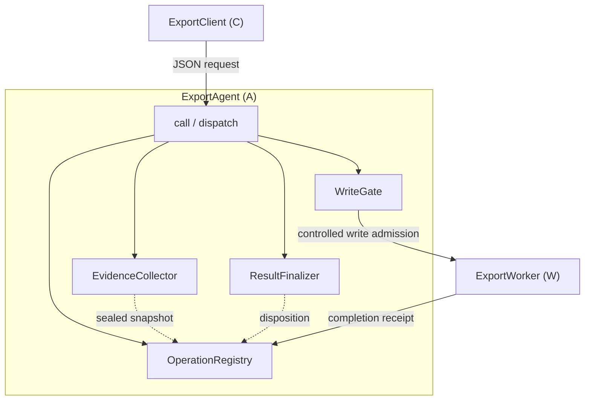
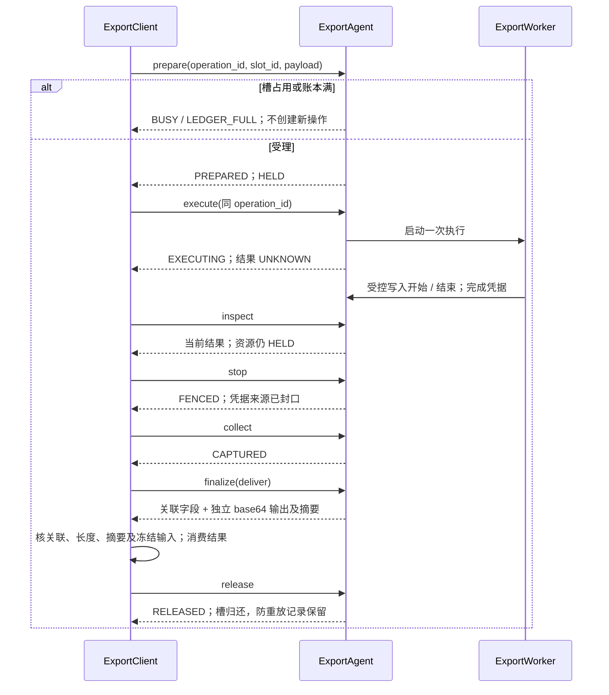
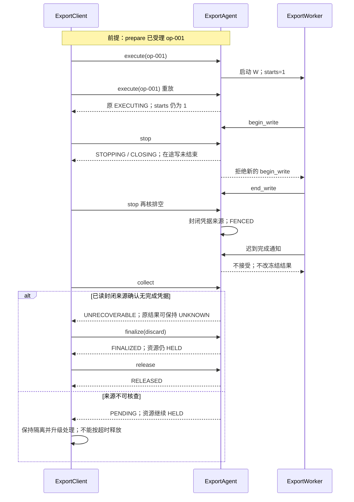

# 异步模块连续案例：ExportAgent

版本：0.1.0-draft.1 · EX-EXPORT 模块视角 · Target / Planned

这是已有暂存导出机制的模块实现切片，不新增协议、队列服务或硬件驱动。行为 authority 仍是
[EX-EXPORT 机制](mechanism-side-effect-example.md)，机器字段仍由
[Schema](interfaces/ex-export-v1.schema.json) 和 [目录](interfaces/catalog.json) 唯一维护。
本案例沿用既有 A/W/C 标识；它们是教学参与方，不是假定某个项目已登记的 S/M 编号。
项目采用时从父设计获得正式模块编号。Python 模型只模拟事件与受控写入计数，不运行 socket、
文件写入或真实线程隔离；模型通过不代表生产 Driver、PES 或运行环境验证通过。

## 1. 从用途到内部组成

调用方 C 要获得 payload 的 UTF-8 暂存结果。ExportAgent（A）受理一次任务并控制执行权限，
ExportWorker（W）异步生成结果，C 校验并消费结果后显式释放。受理不等于执行完成，
完成通知不等于资源归还，调用方也不能仅因等待超时就复用槽位。



图 A1 · Target。框是逻辑组成，实线标调用/交接，虚线是状态依赖，不代表线程拓扑。
dispatch 校验请求并路由；Registry 拥有操作身份、输入和状态；WriteGate 关闭新写入并跟踪在途写；
Collector 从已封口来源判定凭据；Finalizer 锁定 deliver/discard 分支。它们是 A 内部职责，
不要求分别建库或独立服务。模型将这些职责压缩在 ExportModel 中，结构图不是现有类声明图。

## 2. 正常流程、容量拒绝与消费



图 A2 · Target。本设计故意不排队：等待队列长度为 0，唯一在途槽位为 1。
因此“队列满”在此具体化为准入容量满返回 BUSY；不为了演示新增等待队列。
记录上限 16 独立于槽位，释放后仍可能 LEDGER_FULL。容量与规则以机制 EX-R1/R7 为准。
消费错误或响应丢失时不猜测成功：查询同一操作、重调同一已选 finalize 分支取得原结果；
未安全收口不可释放。重调 release 不得释放后来操作的槽位。

## 3. 取消、迟到完成与安全重放



图 A3 · Target。演练通过请求和 Worker 事件产生事实，不直接改 phase/evidence。
begin_write/end_write 是模型的受控外部事件，不是新增客户端 RPC。停止与凭据封口规则引用 EX-R2/R5。
完成通知早于封口时可进入冻结快照，晚于封口不能改变结果；两种交错分别测试。

| 动作 | 本例具体含义 | 不允许的推断 |
|---|---|---|
| 查询 | inspect 读取原操作 | NOT_FOUND 不证明别的实例从未执行 |
| 同请求重放 | prepare 核对同 ID/完整参数；EXECUTING 中 execute 只返回状态 | 不要求先停 W；参数变更为 CONFLICT |
| 接管 | 本例无换 Worker 或跨实例接管；控制事实丢失保持隔离 | 不由迟到超时推导旧权限已失效 |
| 新业务重试 | 已释放后由 C 明确提交新 ID，重新核容量 | 不换 ID 绕过原 UNKNOWN/HELD |

## 4. 真实机器定义到调用的映射

固定接口基线：EX-EXPORT-01/v1，revision `3`。完整源 SHA-256 是
`567a5dd09ddc370772601452701269e43687e57c5750e201c86d25eb2eeb5ed6`，
由 catalog.source 绑定；这是本地字节基线，不假称已发布 commit。
正文成员与签名的唯一入口仍为 [接口阅读视图](interfaces/README.md)，此处只是调用路径索引。

| 成员 | 机器 selector | 本例使用位置 |
|---|---|---|
| IF-EXPORT#OP01 prepare | /x-operations/prepare | A2 准入；关联 request/response/error 角色由目录读取 |
| IF-EXPORT#TYPE08 Request | /$defs/Request | 六个必填封包字段；op 决定 args 形状 |
| IF-EXPORT#TYPE04 PrepareArgs | /$defs/PrepareArgs | slot_id/payload；不得漏字段或隐式转换 |
| IF-EXPORT#TYPE12 Response | /$defs/Response | ok=true/false 互斥封包 |
| IF-EXPORT#TYPE13 CompletionReceipt | /$defs/CompletionReceipt | W→A 通知；绑定输入摘要及操作/实例 |
| IF-EXPORT#ERR06 CONFLICT | /x-errors/CONFLICT | 相同 operation_id 不同输入 |
| IF-EXPORT#ERR07 BUSY | /x-errors/BUSY | 槽容量满；无新操作 |

以下是完整原始请求。可直接作为 `ExportModel.call(req)` 输入；不是只有 args 的伪调用。

```json
{"protocol":"EX-EXPORT-01/v1","request_id":"req-1","agent_instance":"agent-a1","operation_id":"op-001","op":"prepare","args":{"slot_id":"slot-1","payload":"demo"}}
```

```json
{"protocol":"EX-EXPORT-01/v1","request_id":"req-1","agent_instance":"agent-a1","operation_id":"op-001","ok":true,"state":{"phase":"PREPARED","result":"NOT_STARTED","access":"OPEN","evidence":"PENDING","disposition":null,"resource":"HELD","admission":"BLOCKED"},"output":null}
```

| 输入变化 | Schema / 语义预期 | 状态保证 |
|---|---|---|
| 同 ID、payload 改 other | Schema 合法；CONFLICT | 不改冻结 payload，不分配槽 |
| 删除 args.payload | Request Schema 拒绝；BAD_REQUEST | 不创建操作 |
| 占槽后不同 ID prepare | Schema 合法；BUSY | 原任务仍可执行/取消 |
| finalize(discard) 早于 stop | Schema 合法；NOT_SAFE | 不释放、不跳过写门禁 |

对应完整 CONFLICT 错误响应（原操作 prepare 后，用 request_id=req-2 发冲突请求）：

```json
{"protocol":"EX-EXPORT-01/v1","request_id":"req-2","agent_instance":"agent-a1","operation_id":"op-001","ok":false,"error":{"code":"CONFLICT"}}
```

Schema 证明结构，模型和独立向量检查业务行为，目录检查证明成员/角色/源及既有正文身份对应。
本文件是补充教程，不另声明一份同成员 authority，不改原目录的 provider/consumer 分母。

## 5. 构建、装配与预算承接

教学实现是仓库测试目标 `unittest discover` 中的 Python ExportModel，复用
`tests/test_mechanism_effect_example.py`，新增连续调用测试在 `tests/test_module_async_example.py`。
依赖标准库和现有 jsonschema；不新增动态库、头文件、socket 或应用入口。
宿主测试 setUp 构造实例，各测试独立输入，实际操作经 call 和 Worker 事件进入；对象销毁由测试进程承担。
模型未实现物理文件清理、真实写权限隔离、线程竞争或单调时钟期限，不能用测试结束销毁对象冒充生产 release。

生产装配仍待确定的输入包括：平台/编译或解释器版本、进程和 IPC 宿主、存储及虚拟化条件、
权限配置、初始化/复位/启动/排队运行/停止/清理各段预算与总期限。已有协议规定 stop/collect
单次至多 2000 ms；它们不是总取消期限，也不允许到时把未排空判为已安全。
冷/热启动、并发启动峰值、控制账本常驻开销与槽占用需要实际布局和工作负载校核。
本例不调用 LLM，模型能力/上下文/请求配额预算不适用；不能把这个裁剪用于实际 LLM 模块。

## 6. 验证和运行入口

在 STD 根目录运行：

```sh
python3 -m unittest discover -s tests -p test_module_async_example.py
python3 scripts/validate-interface-catalog --catalog docs/examples/interfaces/catalog.json --project-root .
```

连续测试涵盖 A2 正常消费释放、A3 重放/取消/迟到、容量拒绝、源不可核查、参数冲突与 Schema 错误。
固定输入 demo 的独立期望是 UTF-8 bytes `64 65 6d 6f`，不是从模型输出重新生成期望。
模块模型通过只能反馈局部逻辑结论；真实宿主隔离、时间预算、文件回收和组合验证仍为 NOT_RUN。
