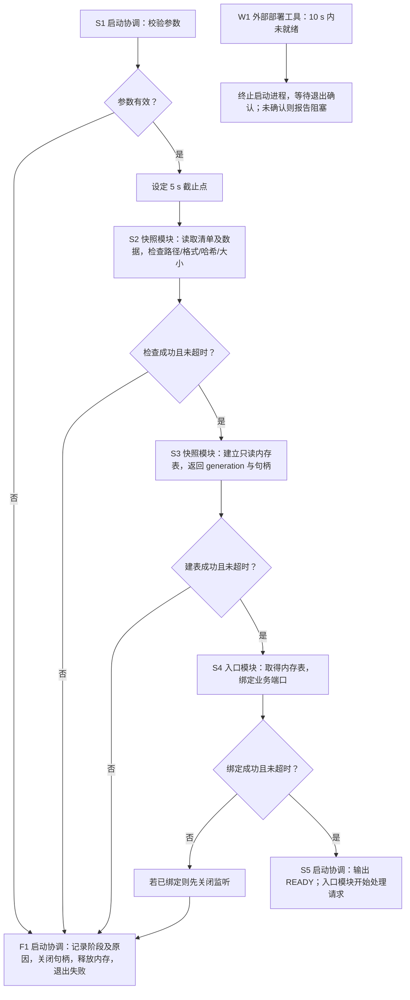

# 软件启动与恢复：一节完整设计样稿

版本：0.1.0 · 日期：2026-09-14

本例全部虚构，展示软件系统设计的写法，不代表 STD 或任何项目的实现建议。示例基线 EX-SEARCH/v1，
视图 Target，实现 Planned，运行验证 NOT_RUN。以下“采用”“必须”仅是这个教学设计内部的选择。
图文推演不是已运行的测试；项目必须使用自己的事实和已有机制，不能抄用示例参数或新增机制来填表。

## 1. 先看差别

**不足的写法**：“启动时加载配置、恢复状态并执行自检，全部就绪后开放服务；失败时安全退出，
禁止盲目重试。恢复由生命周期模块负责，测试待执行。”

这段话列了目标，却没有回答：恢复什么、从哪里取得、哪些事实证明就绪、何时接收请求、哪项
失败后释放哪些资源。最后的测试状态是必要记录，但不能补上前面的设计。下面示范实际正文；
它不是把这段话扩写成更多“应该”，而是给出本例所选方案及其依据。

## 2. P-START：只读目录检索服务的启动与恢复

### 2.1 目的、范围和所选方案

用户通过检索 API 查询一个已离线生成的目录快照。一次返回必须来自同一个完整快照，不能
一部分来自旧目录、一部分来自新目录。本版本只在启动时加载快照，不在线建索引、不热切换；
快照生成器是外部工具。服务重启只恢复“可查询的快照”，不恢复上一次请求：查询没有持久任务，
断开的调用由客户端判断是否重新发起。

软件采用一个服务进程。入口模块负责 HTTP 请求，快照模块负责读取与检查，启动协调模块
在同一进程内串行组织二者。进程启动后先检查快照，成功后才绑定业务端口；因此启动期间没有
“端口可连接但可用数据尚未确定”的窗口。代价是加载期间无法通过业务 API 查看进度，启动结果
由进程标准错误输出和退出状态提供，部署工具等待这些结果。独立管理服务不在本例范围内。

进程接收两个固定启动参数：snapshot_dir 与 listen_address；参数名是教学语义，不是已有
CLI 的声明。外部部署者提供一个只读快照目录，整个进程寿命内禁止原地修改；新目录的选择
通过停止后重新启动完成。该前提无法保证时，本方案不能声明读取一致性，需要重新设计输入交付。

### 2.2 如何得到就绪事实

snapshot_dir 包含 manifest.json 及其列出的数据文件。外部生成器与快照模块的唯一格式契约
在本例规定：清单给出 format_version、generation、逐文件相对路径和 SHA-256；仅接受格式
版本 1，路径不得越出快照目录或经符号链接跳转，文件大小总计最多 32 MiB。32 MiB 和下面的
5 s 都是教学设计选择的 Target 上限，不是测量结果；实现前要验证部署介质上的可行性。

启动协调模块先校验两项参数非空且地址可解析，失败走 F1；通过后记录一个单调时钟截止点，覆盖读取、检查、建立内存检索表和端口绑定，
总预算 5 s。读取按有界块进行，每块返回后检查期限；内存建表也在批次边界检查期限。部署环境
限定本地存储，系统调用本身可能阻塞，所以应用内检查不被声称为硬实时保证。外部部署工具另以
10 s 启动上限监督进程：限时内收到本次启动进程的 READY 输出后停止启动监督，否则终止该进程并确认其退出；没有退出确认就不能声称清理完成或再次启动。上限到达后才收到的迟到 READY 不撤销已发起的终止。

快照模块校验清单、路径、文件内容哈希及数据记录的格式，全部成功后构建一个只读内存检索表，
返回 generation 和该表的句柄。文件句柄随读取关闭。启动协调模块只在拿到这个成功结果且预算
未耗尽时，将内存表交给入口模块，再执行端口绑定。入口模块不在成功绑定之前处理业务请求。
绑定成功后写出 READY(generation, listen_address) 并进入请求循环；此时两项事实共同成立：
数据检查成功、服务入口确已取得。READY 输出不是新的持久状态或另一套接口契约。

### 2.3 图与步骤

图 1：EX-SEARCH/v1，Target / Planned / NOT_RUN。框内为实际执行方与动作；菱形为判断，
错误分支统一到 F1。P-START 同时用于冷启动与崩溃后的重新启动，没有另一个跳过检查的恢复入口。

W1 是独立监督路径，可中断 S1–S4，不表示 F1 必定先完成。收到退出确认后操作系统回收该进程
的监听 socket、文件句柄和内存；启动过程中没有写入快照的动作，所以无需撤销数据写入。
部署工具在限时内收到 S5 的 READY 后不再执行 W1；迟到 READY 按上述规则处理，客户端可能短暂连接后被终止，本例只读请求没有持久副作用。正常运行期停止和请求结束另由相应过程定义。

S1–S5 的顺序特意把端口绑定放在最后：如果先开放入口再检查数据，就需要额外定义未就绪请求
如何处理。本例选择较小的行为面。文件哈希由快照模块从实际读取的字节计算，不用“目录存在”
代替内容可用。端口被其他进程占用时直接进入 F1，不自动换端口，否则客户端的目标地址会失效。

### 2.4 失败、清理与重新启动

F1 输出失败阶段、原因代码和可获得的 generation，随后以非零状态退出；没有成功读到清单时
generation 为空，不补造值。清理关闭本次取得的资源，不删除快照，也不删除其他进程的文件。
失败不在进程内无限重试，也不自动回退到另一个目录：指定快照是调用者选择的业务基线，改用旧
快照会改变查询含义。操作者修复输入或端口冲突后可以重新发起 P-START，每次从 S1 完整检查。

进程在 S2/S3 崩溃时，尚未开放端口，客户端得不到成功连接。确认进程已经退出后重新启动，
重新读取同一指定目录并建表，不复用一张无法证明完整的内存表。若前次退出尚未确认，则部署者
保持阻塞并处理该进程，而不是让第二个进程争抢同一服务地址。本例的恢复不涉及持久副作用；
有写入任务的项目必须另行设计在途结果和写入权，不得从此处推导可安全重放。

## 3. 具体推演与下游检查

| 设计推演输入 | 按图经过的路径 | 必须得到的结果 |
|---|---|---|
| generation=g7，2 个文件共 8 MiB，格式/哈希匹配，端口空闲，全部操作在 5 s 内返回 | S1→S2→S3→S4→S5 | 仅 g7 对外查询；READY 在绑定成功后输出 |
| g7 第二个文件哈希不符 | S1→S2→F1 | 不绑定端口；输出哈希失败；释放已读内容；不改磁盘输入 |
| 数据检查通过，但端口已被占用 | S1→S2→S3→S4→F1 | 不输出 READY，不换端口；释放内存表；原占用进程不受影响 |
| S2 阻塞超过外部 10 s 上限 | W1→终止→退出确认 | 有确认才判资源已回收；无确认则阻塞，不冒称退出成功 |
| S3 崩溃后确认退出，再次启动，输入仍为 g7 | 新一次 S1→S2→S3→S4→S5 | 不跳过哈希校验；不恢复旧请求；不复用前次内存 |

这是依据方案做的纸面推演，以上用例尚未执行。下游快照模块需要用损坏清单、越界路径、符号链接、
超大文件和格式错误测试拒绝行为；入口模块需验证绑定失败时不会报告 READY。软件组合测试需覆盖
启动时端口不可用、正常开放、超时监督和崩溃后重新启动；测试工具检查端口、标准错误输出、退出状态
以及磁盘输入不变，而不是只检查日志里出现“成功”。实际执行后记录环境、输入和 Run，不能用本表当运行证据。

下游可以自行选择内存检索表的数据结构，但不能改变指定快照语义、先检查后开放的顺序、失败不换端口
或目录的政策。读取和建表的资源峰值及耗时还要实测；若不能满足上限，返回软件系统设计调整预算或
方案，不以局部测试通过宣布整个启动目标完成。

## 4. 将写法用于真实项目

先核查项目已有入口、运行对象、契约和恢复策略，再写同等深度的一节。不能把本例单进程、只读输入、
5 s/10 s 或快照格式当作默认设计。真实项目的判断可能不同，但读者应同样能从正文找到每个图中判断的
事实来源，用实际输入推出下一步，并知道失败在哪里结束、下游哪些选择不能自行改变。
