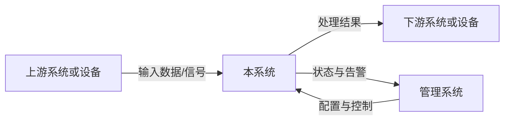
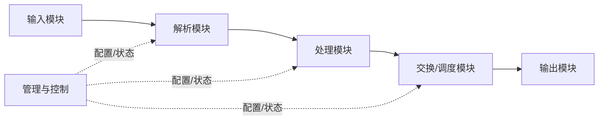
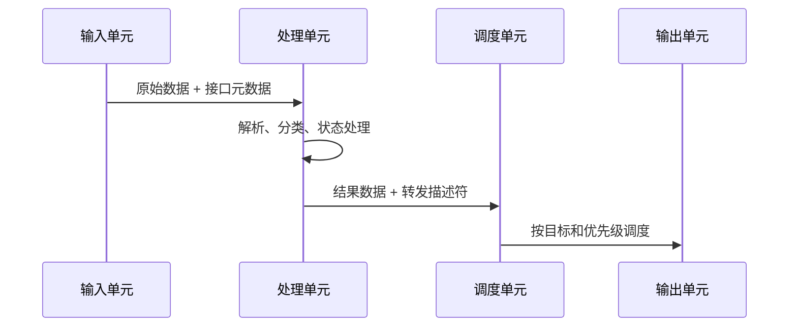

<!-- STD_DOCUMENT_COVER_BEGIN -->
# {{document_title}}

| 文档字段 | 值 |
|---|---|
| Document ID | `{{document_id}}` |
| Document Version | `{{document_version}}` |
| Status | `{{document_status}}` |
| Project | `{{project}}` |
| Authority | `{{authority}}` |
| Document Owner | {{document_owner}} |
| Authors | {{authors}} |
| Created Date | `{{created_at}}` |
| Last Modified Date | `{{last_modified_at}}` |
| Template ID | `{{template_id}}` |
| Template Version | `{{template_version}}` |
| Template Conformance | `{{template_conformance}}` |
| Tailoring Reference | {{tailoring_ref}} |
| Migration Map Reference | {{migration_map_ref}} |
| Repository | `{{source_repository}}` |
| Canonical Path | `{{source_path}}` |
| Supersedes | {{supersedes}} |

> Reviewer、Approver、Approval Date 和 Release Tag 在进入相应状态时填写。Git commit/tag 是
> 外部不可变证据；不要在文档内容中伪造包含自身的 commit hash。
<!-- STD_DOCUMENT_COVER_END -->

| 设计属性 | 值 |
|---|---|
| Design Level | `{{design_level}}` |
| Domain | `{{domain}}` |
| Visibility | `{{visibility}}` |

> 本模板用于设备、软硬件一体产品以及复杂软件系统的总体设计。正文必须让读者回答五个问题：
> 为什么做、实现什么、系统由什么组成、数据和控制如何流动、各部分怎样落地并验证。
> 每章的帮助块可在草稿期保留，正式发布前可以删除。不适用的章节写 `N/A` 并说明原因，
> 不得为了填满模板虚构实现、性能或测试证据。

## 修订记录

本节编写建议、规范与示例

**本节目的**：保留文档演进和评审责任的可追溯记录。

**必须写清楚**：版本、日期、作者、变更原因、影响章节，以及实际 Reviewer/Approver。

**编写规范**：每次形成可评审版本都新增一行，不覆盖历史；未完成评审时保持 Pending。

**抽象示例**：`0.3.0 | 2026-09-09 | A | 增加过载恢复流程，影响 §5.3 和 IF-004 | Pending`。

| Document Version | Date | Author | Change Summary | Reviewer/Approver |
|---|---|---|---|---|
| `{{document_version}}` | `{{last_modified_at}}` | {{authors}} | Initial or current revision | Pending |

## 目录、表目录与图目录

本节编写建议、规范与示例

**本节目的**：让长文档可以快速导航，并使图表能够被稳定引用。

**必须写清楚**：目录生成方式、正式表格清单、正式图片和 Mermaid 图清单。

**编写规范**：目录由渲染工具生成；图表使用稳定编号，删除或重编号需在修订记录说明。

**抽象示例**：`FIG-5-1 正常数据处理流程 — §5.2`；`TABLE-10-1 外部接口总表 — §10.1`。

> 发布工具应根据 Markdown 标题自动生成目录。所有正式表格使用 `TABLE-<章节>-<序号>`，所有正式
> 图片和 Mermaid 图使用 `FIG-<章节>-<序号>`，并在图表下方写标题和说明；没有图或表时写 `N/A`。

- **目录**：由 Markdown 渲染器生成。
- **表目录**：列出正式表格编号、名称和所在章节。
- **图目录**：列出正式图编号、名称和所在章节。

## 1. 文档说明

编写建议、规范与示例

**本章目的**：说明本文管什么、不管什么，以及读者应如何使用本文。

**必须写清楚**：设计对象、设计层级、适用版本、目标读者、上下游文档、范围和非目标。

**编写规范**：

- 系统、子系统、板卡、服务或模块只能选择一个主要设计层级。
- 需求、接口、详细设计和测试已有独立权威文档时，只引用，不复制。
- “未来可能支持”必须与本版本承诺分开。

**抽象示例**：本文描述边缘处理设备的系统级设计，覆盖输入、处理、交换和管理路径；不定义芯片
寄存器位域，也不代替安装手册。

### 1.1 目的与读者

本节编写建议、规范与示例

**本节目的**：说明本文为什么存在，以及各类读者如何使用它。

**必须写清楚**：支持的决定或活动、主要读者、每类读者需要从本文获得的结果。

**编写规范**：不要写“供相关人员参考”；应说明读者看完后能完成什么设计、实现或验证工作。

**抽象示例**：系统负责人用本文确认责任边界，开发者据此实现模块和接口，测试人员据此设计验收用例。

<!-- 说明本文帮助谁做什么决定或完成什么实现。 -->

### 1.2 范围、非目标与设计层级

本节编写建议、规范与示例

**本节目的**：固定设计对象和边界，防止文档无限扩张或遗漏责任。

**必须写清楚**：范围内、范围外、排除原因、主要设计层级，以及跨层描述的边界。

**编写规范**：优先选择单一层级；跨层时说明必要性和每层深度，并引用负责详细内容的文档。

**抽象示例**：本文覆盖设备系统和板卡连接，不展开器件寄存器；寄存器定义由独立接口文档负责。

<!-- 明确本文覆盖和不覆盖的内容，以及与上下游文档的边界。 -->

### 1.3 参考资料与术语

本节编写建议、规范与示例

**本节目的**：固定设计输入和统一术语，避免引用漂移或概念歧义。

**必须写清楚**：参考资料 ID、版本/路径、用途、authority，以及项目特有术语的精确定义。

**编写规范**：引用固定版本或提交；通用词不重复定义，缩写首次出现仍需在正文展开。

**抽象示例**：`IF-SYS-001 | v1.2 | 数据面字段 authority`；`处理单元：执行解析和策略的逻辑单元`。

<!-- 引用需求、接口、约束、ADR 和测试文档；只定义影响理解的项目术语。 -->

## 2. 产品应用与设计目标

编写建议、规范与示例

**本章目的**：先解释真实问题和部署环境，再进入技术方案。

**必须写清楚**：谁使用、部署在哪里、上下游设备或系统是谁、输入输出是什么、不做会产生什么
影响，以及成功标准。

**编写规范**：

- 用一张环境/上下文图展示系统边界，箭头必须标注数据、命令或物理信号。
- 至少描述一种典型部署；多种组网方式要说明适用条件和差异。
- 设计目标必须可验证，不使用“高性能”“高可靠”等无阈值表述。

**抽象示例**：设备接收上游数据，执行解析、过滤和分发后输出给下游系统；设备不反向修改上游
业务。目标是支持指定输入规模，并在过载时按明确策略降级而不是静默丢失。

### 2.1 问题与业务背景

本节编写建议、规范与示例

**本节目的**：让读者先理解要解决的问题，而不是直接面对技术方案。

**必须写清楚**：当前环境、现状、具体问题、影响，以及为什么现在需要解决。

**编写规范**：使用可核验事实，不从器件型号或宣传性能力开始；未批准的方案不能写成背景事实。

**抽象示例**：现有节点无法在目标输入规模下持续处理，导致下游数据不完整，因此需要增加分级处理能力。

<!-- 说明为什么需要该系统、当前痛点及其影响。 -->

### 2.2 用户与使用场景

本节编写建议、规范与示例

**本节目的**：把系统能力放入真实用户和运行场景中描述。

**必须写清楚**：角色、前置条件、触发动作、系统响应、可观察结果和失败结果。

**编写规范**：至少覆盖常见、容量边界和异常场景；使用稳定场景 ID 供功能、流程和测试引用。

**抽象示例**：`UC-02` 运维人员切换处理模式；系统校验配置、排空旧流并报告切换成功或失败原因。

<!-- 列出角色、触发场景、期望结果和异常场景。 -->

### 2.3 应用环境与系统边界

本节编写建议、规范与示例

**本节目的**：明确系统所处环境、外部依赖和责任边界。

**必须写清楚**：上下游、数据/命令/信号、方向、协议、责任主体、信任边界和典型组网。

**编写规范**：上下文图与连接表配套；多种组网分别写适用条件，外部组件不得算作本系统实现。

**抽象示例**：上游设备提供输入流，本系统处理后交付下游；管理系统只配置和观测，不进入数据面。

<!-- 提供上下文图、上下游清单、信任边界、物理环境和网络/总线边界。 -->

### 2.4 设计目标与成功条件

本节编写建议、规范与示例

**本节目的**：把方向性目标转换成可以设计和验收的条件。

**必须写清楚**：目标 ID、度量口径、环境、负载、阈值、证据类型和验证方法。

**编写规范**：禁止只写“高性能/高可靠”；估算值、理论上限和实测支持值必须明确区分。

**抽象示例**：`G-003` 在固定报文分布和目标拓扑下持续处理指定负载，丢失率低于已批准阈值。

| Goal ID | 目标 | 度量 | 目标值/边界 | 验证方式 |
|---|---|---|---|---|
| G-001 | <!-- 示例：持续处理目标负载 --> | <!-- throughput --> | <!-- 明确数值与条件 --> | <!-- 测试或分析 --> |

## 3. 功能与需求实现概览

编写建议、规范与示例

**本章目的**：直接回答“系统要实现什么”。

**必须写清楚**：功能清单、输入、处理、输出、触发条件、约束、异常行为和验收条件。

**编写规范**：

- 每项功能使用稳定 ID，并追溯到需求。
- 不只写名词；必须描述输入经过什么处理产生什么输出。
- 配置范围、容量和模式限制必须显式写出。
- 尚未实现、部分实现和计划功能分别标记，不得混写。

**抽象示例**：`F-003` 接收带有分类字段的数据单元，根据已加载规则产生转发、丢弃或进入状态管理
三类动作；规则未命中时采用明确默认动作，并产生可观测计数。

### 3.1 功能总表

本节编写建议、规范与示例

**本节目的**：建立完整、可追溯的系统功能清单。

**必须写清楚**：功能 ID、调用方、输入、核心处理、输出、当前状态和验收条件。

**编写规范**：名称使用动宾结构；输入—处理—输出形成闭环，状态使用受控词表而非“基本完成”。

**抽象示例**：`F-004 | 分发处理结果 | 调度模块 | 带目标的描述符 | 选择可用出口 | 输出队列 | Partial`。

| Function ID | 功能 | 用户/调用方 | 输入 | 核心处理 | 输出 | 状态 | 验收条件 |
|---|---|---|---|---|---|---|---|
| F-001 | <!-- 功能名称 --> | <!-- 角色 --> | <!-- 输入 --> | <!-- 处理 --> | <!-- 输出 --> | Planned | <!-- 可执行条件 --> |

### 3.2 功能详细说明

本节编写建议、规范与示例

**本节目的**：把复杂功能展开到工程师能够直接实现的深度。

**必须写清楚**：目的、前置条件、输入、处理顺序、状态、输出、配置、异常和验收。

**编写规范**：复杂功能独立成节；已有机器契约时引用字段 authority，但仍解释系统责任和行为语义。

**抽象示例**：规则处理功能按解析、匹配、动作执行顺序展开，并说明未命中、表更新和资源耗尽行为。

<!-- 对每个复杂功能重复以下结构：目的、前置条件、输入、处理步骤、输出、配置、异常、验收。 -->

#### F-XXX：功能名称

本节编写建议、规范与示例

**本节目的**：提供每项复杂功能都能复用的统一填写单元。

**必须写清楚**：功能总表中的真实 ID、判断顺序、状态变化、默认行为、边界条件和外部结果。

**编写规范**：复制本小节后必须替换 `F-XXX`；每条验收条件应能直接转换为测试输入和 oracle。

**抽象示例**：当输入有效且资源可用时产生结果；输入非法时返回类型化错误；资源不足时进入受控降级。

- **解决的问题**：
- **前置条件**：
- **输入与来源**：
- **处理规则**：
- **输出与去向**：
- **配置与容量边界**：
- **异常与降级**：
- **验收条件**：

### 3.3 需求追溯

本节编写建议、规范与示例

**本节目的**：证明需求、设计、接口和验证之间没有断链。

**必须写清楚**：每个功能对应的需求、设计章节、接口/契约和验证用例。

**编写规范**：缺失关联不能留空，应记录缺口、Owner 和关闭 Gate；跨系统功能必须引用接口 authority。

**抽象示例**：`F-004 → REQ-DATA-012 → §5.2 → IF-DATA-003 → TC-E2E-008`。

| Function ID | Requirement ID | Design Section | Interface/Contract | Verification Case |
|---|---|---|---|---|
| F-001 | REQ-001 | §3.2 | IF-001 | TC-001 |

## 4. 总体结构

编写建议、规范与示例

**本章目的**：展示系统由哪些部分组成，各自为什么存在、负责什么以及如何连接。

**必须写清楚**：系统功能框图、子系统/板卡/服务清单、职责、接口方向、关键资源和实现位置。

**编写规范**：

- 图中的每个块都必须在职责表中有对应项。
- 职责必须写“负责”和“不负责”，避免多个模块拥有同一责任。
- 软件写到仓库路径和关键 symbol；硬件写到板卡、器件或 RTL block；混合系统同时提供两种映射。
- 复杂模块继续拆分；简单模块不要制造无意义层级。

**抽象示例**：输入模块完成物理接入和帧校验；处理模块完成解析与策略执行；交换模块只执行已决定的
转发结果；管理模块负责配置和观测，不进入业务数据面。

### 4.1 系统功能框图

本节编写建议、规范与示例

**本节目的**：用一张图建立整个设计的共同结构视图。

**必须写清楚**：当前层级的关键组成、主数据流、控制关系和外部连接。

**编写规范**：不要混入所有内部细节；图中名称必须与职责表和实际代码、板卡或 RTL 名称一致。

**抽象示例**：输入、解析、处理、调度和输出组成主链，管理模块用虚线表示配置与状态关系。

### 4.2 组成与职责

本节编写建议、规范与示例

**本节目的**：把框图中的方块转换成清晰的责任和实现分工。

**必须写清楚**：模块职责、非职责、提供接口、依赖、实例关系和实现位置。

**编写规范**：框图中每块对应一行；位置写真实路径/板卡/RTL block，未创建时写计划位置和 Owner。

**抽象示例**：解析模块负责生成标准描述符，不负责策略决定；实现位于 `src/parser/` 和 `rtl/parser/`。

| Block ID | 模块/单元 | 负责 | 不负责 | Provided Interface | 依赖 | 实现位置 |
|---|---|---|---|---|---|---|
| BB-001 | <!-- 名称 --> | <!-- 职责 --> | <!-- 边界 --> | <!-- 接口 --> | <!-- 依赖 --> | <!-- path/block --> |

### 4.3 物理与逻辑对应关系

本节编写建议、规范与示例

**本节目的**：说明逻辑设计如何落实到真实运行和物理载体。

**必须写清楚**：逻辑块到板卡、芯片、区域、进程、线程或实例的映射，以及共享资源和故障域。

**编写规范**：说明一对多/多对一关系和不同模式下的变化；不要把逻辑图直接当部署图。

**抽象示例**：两个逻辑处理实例共享一个物理缓存控制器，但分别属于独立故障隔离域。

<!-- 描述逻辑功能如何映射到板卡、芯片、进程、容器、服务或线程。 -->

## 5. 工作模式与端到端流程

编写建议、规范与示例

**本章目的**：回答系统在每种工作模式下怎样运行，数据和控制逐步经过哪里。

**必须写清楚**：模式选择条件、每种模式的资源拓扑、逐步数据流、状态变化、容量、限制、异常和切换。

**编写规范**：

- 先用模式矩阵比较，再为每种重要模式提供数据流图和编号步骤。
- 每一步写清发起方、接收方、数据形态、变换和失败处理。
- 模式切换是否在线、是否丢状态、是否需要重启必须明确。
- 正常流之外至少描述过载、输入异常和下游不可用。

**抽象示例**：直通模式下输入与处理单元一一对应；复制模式在调度层复制数据，分别送往独立处理单元。
两者的资源占用、输出收敛和故障影响不同，不能只用一个“支持多模式”句子概括。

### 5.1 工作模式矩阵

本节编写建议、规范与示例

**本节目的**：让读者快速比较不同工作模式的拓扑、能力和代价。

**必须写清楚**：模式场景、输入/处理/输出拓扑、容量、限制、选择和切换条件。

**编写规范**：只有改变数据路径、资源分配或行为的配置才算模式；单一模式也要记录固定边界。

**抽象示例**：直通模式减少复制和延迟；复制模式增加使用方数量，但降低单路可用输入能力。

| Mode ID | 模式 | 适用场景 | 输入拓扑 | 处理拓扑 | 输出拓扑 | 容量/限制 | 切换条件 |
|---|---|---|---|---|---|---|---|
| MODE-01 | <!-- 名称 --> | <!-- 场景 --> | <!-- 输入 --> | <!-- 处理 --> | <!-- 输出 --> | <!-- 限制 --> | <!-- 切换 --> |

### 5.2 正常数据流

本节编写建议、规范与示例

**本节目的**：使工程师能沿着一条真实数据路径理解系统运行。

**必须写清楚**：每一步的发起方、接收方、数据形态、处理、状态变化、缓存和输出。

**编写规范**：先图后编号步骤；异步队列、缓存和跨时钟域边界不能因图面简化而遗漏。

**抽象示例**：输入单元校验并附加接口元数据，处理单元生成动作，调度单元选择出口并更新计数。

<!-- 按 1、2、3…逐步解释图中的数据、变换、状态和责任主体。 -->

### 5.3 异常、过载与恢复流程

本节编写建议、规范与示例

**本节目的**：明确非正常情况下系统如何保持可预测和可恢复。

**必须写清楚**：触发、检测、影响、丢弃/重试/降级、告警、恢复条件和最终外部结果。

**编写规范**：至少覆盖无效输入、过载、缓存耗尽、下游中断和内部故障；重试需定义幂等边界。

**抽象示例**：输出持续阻塞后停止接收新数据、保留已确认状态并告警；恢复后从安全边界继续。

<!-- 描述校验失败、缓存不足、处理超时、下游中断、重试、丢弃、告警和恢复。 -->

### 5.4 模式切换与状态迁移

本节编写建议、规范与示例

**本节目的**：定义工作模式切换的控制、状态和数据安全边界。

**必须写清楚**：触发方、控制接口、停流/排空/重启需求、状态迁移、失败结果和回滚步骤。

**编写规范**：禁止只写“支持动态切换”；应说明切换原子点和调用方如何判断成功或失败。

**抽象示例**：控制面提交新模式后先停止入口并排空队列，切换资源映射成功后再恢复入口。

<!-- 描述切换触发、原子性、数据面影响、状态保留和回滚。 -->

## 6. 硬件实现方案

编写建议、规范与示例

**本章目的**：说明功能如何落实到硬件组成、接口和关键器件。

**必须写清楚**：硬件架构、板间接口、时钟/复位/电源、器件选择、信号完整性、可靠性及开发平台。

**编写规范**：

- 软件项目可写 `N/A`；设备项目不能只放框图而没有接口和选型依据。
- 器件选择应关联带宽、容量、功耗、供货、生命周期和替代方案。
- 估算、仿真和实测结论必须分开标记。
- 详细原理图或 BOM 是独立 authority 时使用链接引用。

**抽象示例**：处理器件通过高速串行接口连接输入模块，通过存储接口连接外部缓存；选择结果必须满足
峰值带宽、最坏突发缓存和温度范围，而非仅写器件型号。

### 6.1 硬件架构与板卡组成

本节编写建议、规范与示例

**本节目的**：建立从整机到板卡和关键器件的硬件实现全景。

**必须写清楚**：组成、功能、数量、资源、连接、故障域，以及原理图/BOM authority。

**编写规范**：解释设计意图而非抄录物料字段；图、清单和真实硬件命名应一致。

**抽象示例**：系统由接口板、处理板和交换板组成，处理板可多实例扩展但共享背板带宽。

### 6.2 板间与器件接口

本节编写建议、规范与示例

**本节目的**：固定板间和器件间连接的系统级约束。

**必须写清楚**：端点、方向、协议、宽度、速率、时钟、同步、流控、错误和 authority。

**编写规范**：详细管脚/寄存器引用唯一接口文档；本节说明系统级用途、容量和限制。

**抽象示例**：处理器件通过全双工高速链路连接交换器件，采用独立时钟恢复并传播链路错误状态。

| IF ID | 起点 | 终点 | 类型/协议 | 宽度/速率 | 时钟/同步 | 流控 | 错误处理 |
|---|---|---|---|---|---|---|---|

### 6.3 时钟、复位、电源与信号完整性

本节编写建议、规范与示例

**本节目的**：说明硬件能否按正确顺序稳定启动并在目标速率下工作。

**必须写清楚**：时钟来源、复位域/顺序、电源轨/时序、关键信号完整性假设和验证状态。

**编写规范**：区分规格、计算、仿真和实测；未验证项必须进入风险及验证矩阵。

**抽象示例**：参考时钟稳定且电源良好后释放链路复位，随后由管理软件确认训练状态。

### 6.4 器件选型与容量依据

本节编写建议、规范与示例

**本节目的**：证明关键器件能够满足功能、容量、可靠性和交付要求。

**必须写清楚**：候选、选择理由、约束、余量、生命周期、供应风险和替代条件。

**编写规范**：替代器件要检查硬件、固件、时序和软件兼容，不能只写“同系列兼容”。

**抽象示例**：缓存器件选择由峰值带宽和最坏突发容量决定，并保留经批准余量和第二来源方案。

### 6.5 硬件可靠性与开发平台

本节编写建议、规范与示例

**本节目的**：定义硬件故障下的保护方式，并保证开发结果可复现。

**必须写清楚**：保护、冗余、降额、错误检测、诊断、安全状态、工具版本、输入和产物位置。

**编写规范**：每个可靠性机制关联故障模型和验证方法；工具链必须固定版本和目标器件。

**抽象示例**：单风扇失效触发降额和告警；原理图检查与时序报告由固定工具版本生成并保存。

## 7. 软件实现方案

编写建议、规范与示例

**本章目的**：把系统功能落实到可实现的软件模块、进程、协议和代码位置。

**必须写清楚**：软件架构、模块职责、主要通信、状态与并发、配置、错误处理、可靠性和开发平台。

**编写规范**：

- 模块名称必须与仓库目录、package、service 或关键 symbol 对应。
- 对每个模块说明输入、输出、状态、线程/任务模型和失败传播。
- 页面型系统增加页面、路由、操作和 Loading/Empty/Error 状态。
- 不在设计文档里复制 OpenAPI/Schema；引用其路径并解释语义边界。

**抽象示例**：控制服务加载经校验的配置快照并原子发布给数据面；数据面只读快照，不直接修改配置源。

### 7.1 软件架构

本节编写建议、规范与示例

**本节目的**：展示软件如何分层、分进程并协作完成系统功能。

**必须写清楚**：进程/服务/线程、调用方向、数据与控制路径、状态归属、启动顺序和故障域。

**编写规范**：先给架构图再解释；名称对应真实代码和部署，不把未来模块画成当前实现。

**抽象示例**：控制服务校验并发布配置快照，数据面进程只读快照并独立上报运行状态。

<!-- 编写建议：在此放置软件架构图和架构说明。 -->

### 7.2 模块设计与代码映射

本节编写建议、规范与示例

**本节目的**：让开发者能够从设计直接定位需要实现或修改的代码。

**必须写清楚**：模块职责、接口、状态、并发、错误边界、关键 symbol 和仓库路径。

**编写规范**：每个软件模块一行；计划模块写计划路径和 Owner，不能用“相关代码”等模糊位置。

**抽象示例**：`MOD-02 | 配置校验 | snapshot in/out | 单写多读 | typed error | src/config/validator.*`。

| Module ID | 模块 | 职责 | 输入/输出 | 状态/并发模型 | 错误边界 | 实现路径 |
|---|---|---|---|---|---|---|

### 7.3 通信、配置与状态管理

本节编写建议、规范与示例

**本节目的**：定义软件模块间协作以及配置和状态的一致性规则。

**必须写清楚**：通信方式、配置来源/校验/生效、状态 ownership、并发控制、持久化和恢复。

**编写规范**：区分配置源、运行快照和观测副本；明确事务/原子边界及重复、乱序、超时行为。

**抽象示例**：管理进程原子替换不可变配置快照，工作线程按 generation 读取，不允许局部更新。

<!-- 编写建议：在此描述通信、配置发布和状态生命周期。 -->

### 7.4 页面与交互（如适用）

本节编写建议、规范与示例

**本节目的**：当系统包含 UI 时，定义用户看到的页面、操作和状态反馈。

**必须写清楚**：页面/路由、内容、操作、权限、Loading/Empty/Error、跳转和后端契约。

**编写规范**：无 UI 时明确写 `N/A`；页面操作应关联功能 ID，错误不能只依赖日志呈现。

**抽象示例**：状态页展示模块健康度；加载中显示 skeleton，无数据说明原因，失败显示可操作恢复入口。

| Page ID | 路由 | 展示内容 | 主要操作 | Loading/Empty/Error | 后端契约 |
|---|---|---|---|---|---|

### 7.5 软件可靠性与开发平台

本节编写建议、规范与示例

**本节目的**：说明软件如何检测和处理故障，并固定可复现的开发构建环境。

**必须写清楚**：超时、重试、隔离、重启、数据恢复、日志/指标，以及语言、工具和构建版本。

**编写规范**：可靠性机制关联具体故障；重试给出上限和幂等要求，构建工具使用可固定版本。

**抽象示例**：调用超时后只对幂等操作有限重试；连续失败打开隔离并由健康指标触发告警。

<!-- 编写建议：在此说明软件可靠性机制、工具链和可复现构建方式。 -->

## 8. 可编程逻辑与专用处理单元

编写建议、规范与示例

**本章目的**：当系统包含 FPGA、ASIC、DPU、GPU 或专用加速器时，说明其内部模块和流水处理。

**必须写清楚**：内部框图、模块职责、接口位宽与时序、流水和缓存、背压、跨时钟域、资源及异常。

**编写规范**：

- 没有专用处理单元时写 `N/A`。
- 模块按数据经过的顺序描述，不只列名称。
- 数据与描述符若分离，必须写对应关系、顺序约束及重新汇合规则。
- 资源/时序结果注明工具版本、目标器件和实测或估算状态。

**抽象示例**：解析单元从宽数据总线提取字段并生成描述符；策略单元修改描述符；编辑单元依据描述符
重写数据。两条流水通过序号保持一一对应，任一路背压都会传播至共同缓存边界。

### 8.1 内部模块框图

本节编写建议、规范与示例

**本节目的**：展示专用处理单元的内部流水、控制和外部连接。

**必须写清楚**：输入/输出、处理级、缓存、控制模块、存储接口和调试路径。

**编写规范**：模块名称对应 RTL/kernel/firmware；数据流和控制流使用不同线型并附文字说明。

**抽象示例**：输入适配、解析、策略、编辑、缓存和输出构成主流水，控制模块旁路配置各级。

<!-- 编写建议：在此放置专用处理单元内部框图。 -->

### 8.2 模块处理说明

本节编写建议、规范与示例

**本节目的**：把内部框图逐块展开到可实现和可验证的粒度。

**必须写清楚**：输入、处理算法、输出、延迟/吞吐、缓存、背压、错误和实现位置。

**编写规范**：按数据经过顺序排列；存在旁路或反馈时单独说明，不能只列模块名称。

**抽象示例**：解析块每周期接收一个数据单元，产生描述符；非法格式丢弃并递增类型化计数器。

| Block | 输入 | 处理 | 输出 | 延迟/吞吐 | 缓存/背压 | 异常 |
|---|---|---|---|---|---|---|

### 8.3 时序、资源与跨域设计

本节编写建议、规范与示例

**本节目的**：证明设计在目标器件和频率下具有足够资源并能安全跨域。

**必须写清楚**：时钟域、跨域方法、流水延迟、资源预算、时序余量、约束和证据状态。

**编写规范**：标明工具/器件/版本；估算、综合、布局布线和实测不能混为同一结论。

**抽象示例**：异步 FIFO 跨越输入与处理时钟域；满/空同步延迟计入背压和容量预算。

<!-- 编写建议：在此记录时钟域、资源表、时序路径和验证证据。 -->

### 8.4 开发、仿真与调试平台

本节编写建议、规范与示例

**本节目的**：定义从开发到仿真、上板和现场调试所需的环境与入口。

**必须写清楚**：工具版本、仿真器、测试平台、调试接口、构建命令、输入和产物位置。

**编写规范**：给出可重复命令和环境约束；临时个人路径不得成为正式构建依赖。

**抽象示例**：CI 使用固定容器运行 lint 和仿真，实验室通过调试接口读取内部状态与捕获缓冲。

<!-- 编写建议：在此说明开发、仿真、上板和调试环境。 -->

## 9. 数据、描述符与存储结构

编写建议、规范与示例

**本章目的**：描述系统内部真正流动和持久化的数据，以及各阶段如何改变它。

**必须写清楚**：主要数据流、描述符/元数据、状态表、缓存与存储、字段 ownership、生命周期和容量依据。

**编写规范**：

- 用 A/B/C 等阶段点或稳定 ID 标记数据形态，和数据流图一一对应。
- 位域、Schema、IDL 已有机器权威时引用，不手工复制；本章解释设计含义和变换。
- 每个表/状态对象说明 key、value、读写者、建立、更新、老化、删除及并发规则。
- 容量计算写出公式、单位、假设和余量。

**抽象示例**：原始数据在解析阶段保持 payload 不变并附加描述符；策略阶段只更新动作字段；输出阶段
根据动作字段修改封装。状态表以流标识为 key，具有显式创建与老化条件。

### 9.1 业务数据流

本节编写建议、规范与示例

**本节目的**：说明主要业务数据在系统各阶段的形态和变换。

**必须写清楚**：阶段 ID、格式 authority、生产者、消费者、变换、顺序和生命周期。

**编写规范**：阶段点与流程图一致；payload 未变化也要说明，复制、拆分、合并必须可追踪。

**抽象示例**：`DATA-B` 保留输入 payload，新增已校验描述符；由解析块产生、策略块消费。

| Data ID | 所在阶段 | 格式 authority | 产生者 | 消费者 | 变换 | 生命周期 |
|---|---|---|---|---|---|---|

### 9.2 描述符与元数据流

本节编写建议、规范与示例

**本节目的**：说明伴随业务数据传递的控制信息如何产生、更新并保持对应关系。

**必须写清楚**：字段 authority、产生/修改/消费方、有效范围、顺序标识和与 payload 的关联方法。

**编写规范**：不要手抄位域；引用机器定义并解释各处理阶段允许修改哪些字段。

**抽象示例**：解析阶段创建描述符，策略阶段只写动作字段，输出阶段消费后释放；序号防止错配。

<!-- 编写建议：在此描述描述符字段 ownership、阶段变换和数据对应关系。 -->

### 9.3 状态表、缓存与持久化

本节编写建议、规范与示例

**本节目的**：定义状态对象和缓存如何建立、使用、回收并保持一致。

**必须写清楚**：key/value、Schema、读写者、生命周期、容量、并发、一致性和恢复方式。

**编写规范**：区分临时缓存、运行状态和持久化事实；每个状态对象只能有一个写 authority。

**抽象示例**：会话表按规范化流 ID 建立，报文更新活动时间，超时或结束事件删除并输出统计。

| Object ID | Key | Value/Schema | 读者 | 写者 | 建立/更新/删除 | 容量与一致性 |
|---|---|---|---|---|---|---|

### 9.4 容量与带宽计算

本节编写建议、规范与示例

**本节目的**：证明缓存、存储、链路和处理资源能够支撑设计目标。

**必须写清楚**：公式、单位、输入来源、最坏条件、并发/拓扑、余量和 modeled/measured 状态。

**编写规范**：单位不能混用；原始极限不等于支持值，支持值需包含运行保留和安全余量。

**抽象示例**：所需缓存等于峰值输入速率乘最大背压时间，再加协议和实现余量。

<!-- 写出公式、单位、输入来源、余量和 modeled/measured 状态。 -->

## 10. 接口与通信协议

编写建议、规范与示例

**本章目的**：定义系统内外如何交换数据和控制，并明确兼容与失败边界。

**必须写清楚**：接口清单、方向、协议、格式 authority、初始化/握手、流控、超时、错误、版本和兼容性。

**编写规范**：

- 所有跨责任边界的连接都必须有 IF ID。
- 字段级规范引用 OpenAPI、IDL、Schema、寄存器表或接口控制文档。
- 区分数据面、控制面、管理面和观测面。
- 未知字段、版本不兼容、重复请求和连接中断的行为必须定义。

**抽象示例**：控制接口接受带版本的配置快照，校验失败时拒绝整个快照；数据接口使用信用流控，耗尽时
上游停止发送并记录持续时间，不允许无声覆盖缓存。

### 10.1 接口总表

本节编写建议、规范与示例

**本节目的**：建立所有跨责任边界接口的唯一索引。

**必须写清楚**：接口 ID、类型、提供方、使用方、协议/总线、authority、流控/超时和版本策略。

**编写规范**：每个外部连接和跨 Owner 连接一行；详细规范链接到唯一机器或接口 authority。

**抽象示例**：`IF-CTRL-01 | control | 管理服务 | 数据面 | versioned snapshot | Schema X | 2 s | additive`。

| IF ID | 类型 | 提供方 | 使用方 | 协议/总线 | 数据 authority | 超时/流控 | 版本策略 |
|---|---|---|---|---|---|---|---|

### 10.2 数据面接口

本节编写建议、规范与示例

**本节目的**：定义承载主要业务数据的接口及其持续运行行为。

**必须写清楚**：格式、速率、顺序、流控、背压、校验、错误、统计和停启条件。

**编写规范**：按 IF ID 分节；给出正常和边界条件，字段级内容引用机器契约。

**抽象示例**：接口保持同一流内顺序，信用耗尽时停止发送；校验失败的数据丢弃并计数。

<!-- 编写建议：按 IF ID 描述数据面语义和异常行为。 -->

### 10.3 控制与管理接口

本节编写建议、规范与示例

**本节目的**：定义配置、控制和管理操作如何安全改变系统行为。

**必须写清楚**：身份权限、请求、校验、原子性、幂等、状态结果、超时、失败和审计。

**编写规范**：控制决定和数据执行分层；禁止未授权调用方绕过校验直接修改运行状态。

**抽象示例**：配置提交先完整校验，成功后原子生效并返回 generation；失败时旧配置保持有效。

<!-- 编写建议：按 IF ID 描述控制和管理操作。 -->

### 10.4 观测、调试与维护接口

本节编写建议、规范与示例

**本节目的**：规定如何观察系统、定位问题和执行受控维护。

**必须写清楚**：指标、日志、trace、寄存器、调试入口、访问权限、采样、保留和性能影响。

**编写规范**：观测接口不得隐式执行控制决定；敏感信息需脱敏并按可见性限制。

**抽象示例**：只读健康接口返回模块状态和 generation；危险调试操作需要维护模式和审计记录。

<!-- 编写建议：在此描述观测、诊断和维护接口的安全边界。 -->

## 11. 可靠性、维护与升级

编写建议、规范与示例

**本章目的**：说明故障如何被发现、隔离、恢复和维护，而不是笼统声称“高可靠”。

**必须写清楚**：故障模型、状态指示、监控告警、定位信息、恢复策略、远程维护、版本升级和回滚。

**编写规范**：

- 每类故障写检测机制、系统响应、外部表现、恢复方式和数据影响。
- watchdog、冗余、重试等机制必须写适用边界，避免恢复风暴。
- 升级说明兼容范围、状态迁移、失败回滚和不可中断条件。

**抽象示例**：处理单元无响应超过阈值后隔离该单元并停止向其调度；自动重启仅允许一次，连续失败转为
人工处置并保留诊断快照。

### 11.1 故障模型与可靠性机制

本节编写建议、规范与示例

**本节目的**：系统性列出会影响功能、数据或服务的故障及其处置机制。

**必须写清楚**：故障触发、检测、隔离、系统响应、数据影响、恢复、降级和验证方法。

**编写规范**：按硬件、软件、接口、数据和外部依赖分类；每个机制必须对应具体故障而非口号。

**抽象示例**：处理实例失联后停止向其调度，保留未确认任务并告警；恢复需重新完成健康检查。

| Failure ID | 故障 | 检测 | 系统响应 | 数据影响 | 恢复 | 验证 |
|---|---|---|---|---|---|---|

### 11.2 状态指示、监控与故障定位

本节编写建议、规范与示例

**本节目的**：使运维和研发人员能够判断系统状态并定位故障来源。

**必须写清楚**：指示灯/状态、指标、日志、trace、诊断快照、告警阈值、关联 ID 和保留策略。

**编写规范**：每个关键故障至少有机器可读信号；状态含义、更新周期和无数据状态必须明确。

**抽象示例**：链路状态包含 down/training/up/degraded，变化生成事件并带端口、原因和时间戳。

<!-- 编写建议：在此建立状态、告警和诊断信息到故障模型的映射。 -->

### 11.3 维护、升级与回滚

本节编写建议、规范与示例

**本节目的**：定义系统如何被安全维护、升级并在失败时恢复到已知状态。

**必须写清楚**：维护入口、权限、升级对象、兼容检查、状态迁移、中断窗口、回滚和审计。

**编写规范**：升级步骤引用操作文档；本节重点说明设计支持和不可跨越的安全边界。

**抽象示例**：新版本先验证签名和兼容矩阵，再写备用分区；启动失败自动回到上一已知版本。

<!-- 编写建议：在此描述维护能力、升级状态机和失败回滚。 -->

## 12. 性能、扩展与兼容性

编写建议、规范与示例

**本章目的**：说明容量怎样得出、瓶颈在哪里、如何扩展，以及哪些版本能够共存。

**必须写清楚**：workload、吞吐/延迟/容量、资源余量、瓶颈、扩容方式、兼容矩阵和降级行为。

**编写规范**：

- 所有性能数字必须绑定数据规模、报文/请求分布、拓扑、配置和环境。
- modeled、simulated、measured 分开，不把理论上限当作支持值。
- 扩容必须说明分片/调度方式、状态归属和故障域变化。
- 兼容性覆盖硬件修订、固件、软件、协议和数据格式。

**抽象示例**：支持值取链路、处理、存储和输出四个阶段中最小可持续能力，并保留规定余量；增加处理
单元后，调度表与状态归属必须同步扩展。

### 12.1 性能模型与预算

本节编写建议、规范与示例

**本节目的**：用统一 workload 和资源模型解释各项性能与容量结论。

**必须写清楚**：指标、负载、上下文、拓扑、配置、理论/模型/实测值、支持值和证据。

**编写规范**：所有值带单位和作用域；支持值不得直接取资源耗尽边界，必须体现保留和余量。

**抽象示例**：持续吞吐支持值取输入链路、处理流水、存储和输出四阶段能力的最小值。

| Metric | Workload/Context | Modeled | Measured | Supported limit | Evidence |
|---|---|---:|---:|---:|---|

### 12.2 瓶颈与资源余量

本节编写建议、规范与示例

**本节目的**：说明最先限制系统的资源以及设计为变化和突发保留的空间。

**必须写清楚**：瓶颈资源、触发 workload、利用率、余量、过载表现、监控和缓解方案。

**编写规范**：分别检查计算、内存、缓存、链路、存储和外部依赖；用证据而非经验断言瓶颈。

**抽象示例**：输出带宽先于处理能力达到上限，超过阈值后通过背压限制入口并产生告警。

<!-- 编写建议：在此填写瓶颈分析、资源预算和过载边界。 -->

### 12.3 扩容方案与兼容矩阵

本节编写建议、规范与示例

**本节目的**：定义增加容量的方法以及软硬件版本组合的可用边界。

**必须写清楚**：扩容单元、调度/分片、状态归属、故障域、上限，以及版本兼容和降级行为。

**编写规范**：提供明确矩阵；“向后兼容”必须说明兼容对象、范围、验证和不兼容结果。

**抽象示例**：增加处理板同步扩展调度表；旧控制软件可读新状态但不能配置新增能力。

<!-- 编写建议：在此给出扩容拓扑、操作条件和兼容矩阵。 -->

## 13. 可测试性与验收设计

编写建议、规范与示例

**本章目的**：在设计阶段就说明如何证明功能和质量目标已经实现。

**必须写清楚**：测试接口、数据源、注入点、自检、环回、观测点、oracle、环境和接受条件。

**编写规范**：

- 每项功能、接口、工作模式、故障和质量目标至少映射一个验证项。
- 写清怎样生成输入、在哪里观察结果、什么条件算通过。
- 静态检查、仿真、实验室测试和真实环境测试分别记录。
- `NOT_RUN`、`BLOCKED` 和分析结论不得写成 `PASS`。

**抽象示例**：内部数据路径支持可控测试源与末端环回；测试读取输入/输出计数和错误状态，证明正常、
背压和故障恢复路径，不依赖人工观察单一指示灯。

### 13.1 测试支持与观测点

本节编写建议、规范与示例

**本节目的**：在设计中预留可控制、可观察且不会破坏正常运行的测试能力。

**必须写清楚**：测试模式、测试点、注入点、捕获点、计数器/日志/寄存器、权限和性能影响。

**编写规范**：说明测试模式与正常模式的隔离和退出条件；测试接口不得绕过安全与审计边界。

**抽象示例**：维护模式允许在解析前注入测试数据并在输出前捕获，正常模式下入口强制关闭。

<!-- 编写建议：在此列出测试接口、观测点、权限和隔离机制。 -->

### 13.2 测试数据源、自检与环回

本节编写建议、规范与示例

**本节目的**：定义不依赖完整外部系统时如何验证各层数据路径和硬件状态。

**必须写清楚**：测试数据生成、输入重放、上电/周期/人工自检、内部/外部环回和结果比对。

**编写规范**：每种机制写覆盖路径、未覆盖路径、触发条件、持续时间、破坏性和通过 oracle。

**抽象示例**：上电自检验证存储和关键链路；内部环回覆盖处理流水，外部环回另覆盖物理接口。

<!-- 编写建议：在此描述测试源、BIST/自检、环回层级和结果判定。 -->

### 13.3 验证与验收矩阵

本节编写建议、规范与示例

**本节目的**：将功能、接口、模式、故障和质量目标映射到可执行验证及接受条件。

**必须写清楚**：目标 ID、层级、输入、环境、oracle、证据、状态和覆盖缺口。

**编写规范**：区分分析、静态、仿真、单元、实验室、生产和外部验证；NOT_RUN/BLOCKED 如实保留。

**抽象示例**：`MODE-02 | lab E2E | 峰值突发输入 | 无未声明丢失且告警正确 | report-X | Planned`。

| Target ID | 测试层级 | 场景/输入 | Oracle | 环境 | Evidence | 状态 |
|---|---|---|---|---|---|---|

## 14. 结构、热、工艺与安全设计

编写建议、规范与示例

**本章目的**：覆盖设备能否安全、稳定、可制造地在目标环境运行。纯软件系统可整体写 `N/A`。

**必须写清楚**：结构与尺寸、装配维护空间、热路径、功耗、关键工艺、制造测试、安全和 EMC。

**编写规范**：

- 给出环境条件、功耗来源、热假设和验证方式。
- 关键工艺关联可制造性、良率、检测和返修。
- 安全项说明危险源、保护、失效状态和适用法规。
- “待热设计/待安规确认”必须进入风险和 Owner，不得遗漏。

**抽象示例**：风道按最坏功耗和进风温度设计；单风扇失效时系统进入降额状态并告警；关键温度点由
传感器覆盖，保护阈值与器件额定值保持安全余量。

### 14.1 结构与造型

本节编写建议、规范与示例

**本节目的**：说明设备外形、内部布局和维护空间如何满足安装及使用要求。

**必须写清楚**：尺寸、重量、安装方式、板卡布局、风道、线缆、维护操作和人机约束。

**编写规范**：引用机械图 authority；关键尺寸和维护间隙必须可验证，并说明不同配置差异。

**抽象示例**：前维护接口与后部风道分离，更换模块无需拆除相邻设备或断开非相关线缆。

<!-- 编写建议：在此描述机械结构、布局、安装和维护空间。 -->

### 14.2 功耗与热设计

本节编写建议、规范与示例

**本节目的**：证明设备在目标环境和最坏配置下能够供电并维持安全温度。

**必须写清楚**：功耗预算、热源、环境条件、风量/散热路径、传感器、保护阈值和失效降额。

**编写规范**：典型值和最坏值分开；模型、仿真和实测结果均标注边界与证据。

**抽象示例**：最坏配置功耗纳入电源和散热预算；单风扇失效时自动降额并保持关键器件低于限制。

<!-- 编写建议：在此填写功耗表、热路径、保护和验证方案。 -->

### 14.3 工艺与制造测试

本节编写建议、规范与示例

**本节目的**：确保设计可以稳定制造、检测、返修并追溯。

**必须写清楚**：关键工艺、DFM/DFT、装配、制造测试、校准、序列化、良率和返修边界。

**编写规范**：关键工艺参数引用受控工艺文件；制造测试说明覆盖目标、fixture 和判退标准。

**抽象示例**：每台设备写入唯一序列号，完成电源、链路、存储和环回测试后保存可追溯记录。

<!-- 编写建议：在此描述制造工艺、生产测试和质量追溯。 -->

### 14.4 安全与电磁兼容

本节编写建议、规范与示例

**本节目的**：识别设备安全和 EMC 风险，并定义设计保护及合规验证。

**必须写清楚**：危险源、接地/绝缘/防护、过压过流过温、ESD/EMI/EMS、法规和失效安全状态。

**编写规范**：每项要求关联适用标准、设计措施和测试；尚未认证不得表述为已合规。

**抽象示例**：外部端口设置浪涌与 ESD 防护，机壳可靠接地；实验室测试覆盖发射和抗扰度。

<!-- 编写建议：在此填写安全风险、保护措施和 EMC 验证。 -->

## 15. 实现计划

编写建议、规范与示例

**本章目的**：把设计转化为团队可以直接执行的实现顺序。

**必须写清楚**：设计元素、具体变更、文件/模块/板卡、依赖、负责人、完成条件、迁移和回滚。

**编写规范**：

- 不写“完善功能”之类无法执行的任务。
- 软件任务写真实路径和 symbol；硬件任务写设计文件、器件/板卡和交付物。
- 原型、工程样机、量产和软件发布的 Gate 分开。

**抽象示例**：先冻结内部数据契约，再实现生产者和消费者，随后接入端到端流程；契约测试通过后才能
并行开发两端。

| 顺序 | Function/Block | 变更内容 | 实现位置/交付物 | 依赖 | Owner | 完成条件 | 回滚边界 |
|---:|---|---|---|---|---|---|---|

## 16. 设计决策、风险与未决项

编写建议、规范与示例

**本章目的**：保留为什么这样设计，以及哪些问题仍可能阻止实现或发布。

**必须写清楚**：关键决策及 ADR、备选方案、风险、技术债、假设、Owner 和关闭证据。

**编写规范**：

- 决策摘要不代替 ADR；涉及重大取舍时链接独立 ADR。
- 风险写触发条件和影响，不只写标题。
- 未决项必须有负责人和最迟决策 Gate。

**抽象示例**：外部缓存位宽存在容量与时序取舍；在实现冻结前需要原型数据决定方案，未决期间不得
将任一方案写成已批准基线。

### 16.1 设计决策

本节编写建议、规范与示例

**本节目的**：记录对系统结构、成本、风险或兼容性有长期影响的选择。

**必须写清楚**：决定、备选方案、理由、状态、影响范围和独立 ADR 链接。

**编写规范**：这里只保留索引和摘要；重大决策在 ADR 中记录完整上下文和后果。

**抽象示例**：选择共享缓存而非每模块独立缓存，以降低成本，但需要额外仲裁和故障隔离。

| ADR/Decision | 决定 | 备选方案 | 理由 | 状态 | 影响范围 |
|---|---|---|---|---|---|

### 16.2 风险、技术债与未决项

本节编写建议、规范与示例

**本节目的**：公开可能阻止实现、验证或发布的问题，并为关闭它们建立责任和证据。

**必须写清楚**：类型、触发条件、影响、概率/严重度、缓解措施、Owner、截止 Gate 和关闭证据。

**编写规范**：不要用“后续优化”隐藏未决问题；假设失效和外部依赖也必须作为风险记录。

**抽象示例**：关键器件供货尚未锁定，可能影响量产；Owner 在设计冻结前确认替代方案和验证计划。

| ID | 类型 | 描述与触发条件 | 影响 | 缓解/下一步 | Owner | 关闭证据/Gate |
|---|---|---|---|---|---|---|
