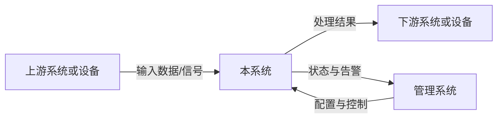
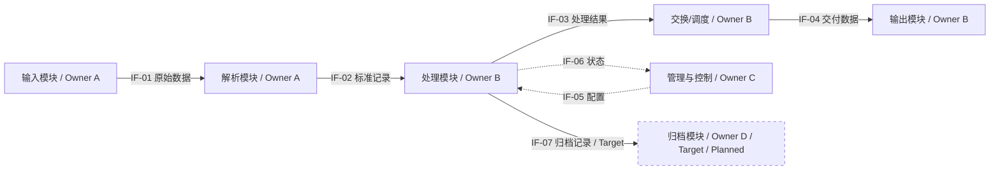
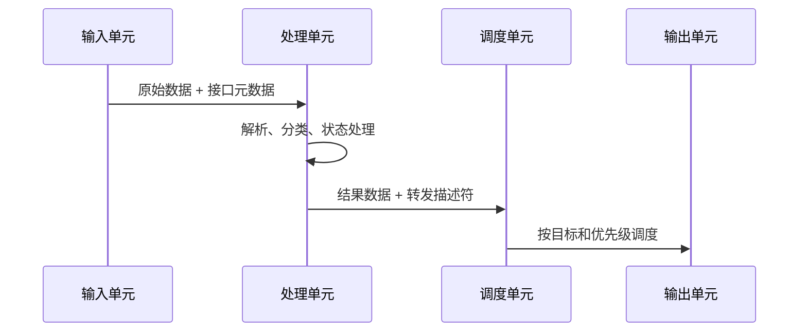

<!-- STD_DOCUMENT_COVER_BEGIN -->
# {{document_title}}

| 文档字段 | 值 |
|---|---|
| Document ID | `{{document_id}}` |
| Document Version | `{{document_version}}` |
| Status | `{{document_status}}` |
| Project | `{{project}}` |
| Authority | `{{authority}}` |
| Document Owner | {{document_owner}} |
| Authors | {{authors}} |
| Created Date | `{{created_at}}` |
| Last Modified Date | `{{last_modified_at}}` |
| Template ID | `{{template_id}}` |
| Template Version | `{{template_version}}` |
| Template Conformance | `{{template_conformance}}` |
| Tailoring Reference | {{tailoring_ref}} |
| Migration Map Reference | {{migration_map_ref}} |
| Repository | `{{source_repository}}` |
| Canonical Path | `{{source_path}}` |
| Supersedes | {{supersedes}} |

> Reviewer、Approver、Approval Date 和 Release Tag 在进入相应状态时填写。Git commit/tag 是
> 外部不可变证据；不要在文档内容中伪造包含自身的 commit hash。
<!-- STD_DOCUMENT_COVER_END -->

| 设计属性 | 值 |
|---|---|
| Design Level | `{{design_level}}` |
| Domain | `{{domain}}` |
| Visibility | `{{visibility}}` |

> 本模板用于设备、软硬件一体产品以及复杂软件系统的总体设计。正文必须让读者回答五个问题：
> 为什么做、实现什么、系统由什么组成、数据和控制如何流动、各部分怎样落地并验证。
> 先按 §1.4 选择适用 profile，再写 §2 的系统概览。所有正文遵循 §1.5 的版本、状态和证据规则。
> 每处保留可展开的段落式编写建议，默认折叠；帮助和抽象示例不属于项目设计正文，也不计入概览
> 的 1–2 页。评审时折叠帮助阅读，正式交付可以删除帮助块，但必须保留填写后的设计与裁剪依据。
> 详细正反例见已锁定 STD 的 `docs/architecture-design-authoring-guide.md`。示例均为虚构结构示范。

**正文怎样展开**：关键设计节先用连续段落交代场景、对象和约束，再沿一个代表输入解释判断、
处理、状态变化和外部结果，最后解释选择这种机制的理由、代价及失效边界。遇到“校验、调度、
缓存、同步”等词，继续说明校验什么、依据什么决定、保存什么以及何时生效；不能让动词代替原理。
图表示关系，编号步骤说明先后，表格用来比较或汇总，三者都不能替代因果解释。简单功能不必
人为拉长；复杂功能应展开到读者能够推演一例正常输入和一例边界输入，而不是凑固定字数。
设计输入不足时记录缺口及其影响，不得为了写满段落补造算法、容量、实现位置或验证结果。

**交付检查表（由 Reviewer 根据实际正文判断，不以标题齐全或工具 PASS 代替）**

- [ ] 只读 §2 的 1–2 页，就能说明系统问题、位置、输入—处理—输出、分工、主路径、版本范围及三项取舍。
- [ ] 每张架构图都有对象边界、方向、协议/IF ID、Owner、视图状态、适用版本/配置/拓扑和图例。
- [ ] 每个关键能力分别记录实现状态、验证结果及其证据；图中的未来部分具有独立样式和文字标记。
- [ ] 每个跨 Owner 边界的提供方、消费方和字段/行为 authority 唯一，引用之外仍解释协作原理。
- [ ] 每项数值结论都有单位、作用域、条件和来源/证据等级；目标、估算、仿真和实测没有混用。
- [ ] 每个章节或信息项的 `N/A` 都有 §1.4 的条件判定、tailoring decision、理由和批准记录。
- [ ] 正文能解释为何这样设计、如何运行及失败结果；没有只列文档索引，也没有复制下级规格成为第二份 authority。
- [ ] 所有适用节的完成条件都有正文证据；未闭合项有 Owner、影响及关闭条件，未被勾选为完成。

## 修订记录

<details>
<summary>本节编写建议、规范与示例</summary>

**本节目的**：保留文档演进和评审责任的可追溯记录。

**必须写清楚**：版本、日期、作者、变更原因、影响章节，以及实际 Reviewer/Approver。

**编写规范**：每次形成可评审版本都新增一行，不覆盖历史；未完成评审时保持 Pending。

**抽象示例**：`0.3.0 | 2026-09-09 | A | 增加过载恢复流程，影响 §6.6 和 IF-004 | Pending`。

**完成条件**：版本行能追到本次实际变更和影响范围，待评审与已批准记录可区分；已有历史没有被覆盖。

</details>

| Document Version | Date | Author | Change Summary | Reviewer/Approver |
|---|---|---|---|---|
| `{{document_version}}` | `{{last_modified_at}}` | {{authors}} | Initial or current revision | Pending |

## 目录、表目录与图目录

<details>
<summary>本节编写建议、规范与示例</summary>

**本节目的**：让长文档可以快速导航，并使图表能够被稳定引用。

**必须写清楚**：目录生成方式、正式表格清单、正式图片和 Mermaid 图清单。

**编写规范**：优先使用项目现有渲染工具生成目录；无此能力时维护人工目录并核对导航。
图表使用稳定编号，删除或重编号需在修订记录说明。

**抽象示例**：`FIG-6-1 数据平面处理流程 — §6.4`；`TABLE-11-1 外部接口总表 — §11.1`。

**完成条件**：使用项目实际渲染方式核对导航，图表编号和所在章节一致；无自动目录功能时已有可用的人工目录。

</details>

> 用项目实际支持的渲染方式生成或维护目录；本模板不提供自动目录工具。所有正式表格使用
> `TABLE-<章节>-<序号>`，图片和 Mermaid 图使用 `FIG-<章节>-<序号>`，并在图表下方写标题和说明。
> 图表目录只列实际存在的图表。

- **目录**：记录采用的渲染工具或人工维护方式，并核对导航。
- **表目录**：列出正式表格编号、名称和所在章节。
- **图目录**：列出正式图编号、名称和所在章节。

## 1. 文档说明

<details>
<summary>编写建议、规范与示例</summary>

**本章目的**：说明本文管什么、不管什么，以及读者应如何使用本文。

**必须写清楚**：设计对象、设计层级、适用版本、目标读者、上下游文档、范围和非目标。

**编写规范**：

- 本模板描述一个系统级设计对象；子系统/模块默认使用 `design.definition`。确需跨层时明确
  系统级主体、下钻目的和截止深度，`cross-level` 不能成为复制所有详细设计的理由。
- 需求、接口、详细设计和测试已有独立权威文档时，说明系统相关的语义、责任和约束并引用权威来源，
  不复制其完整字段表、RTL 实现或测试步骤。
- “未来可能支持”必须与本版本承诺分开。

**抽象示例**：本文描述边缘处理设备的系统级设计，覆盖输入、处理、交换和管理路径；不定义芯片
寄存器位域，也不代替安装手册。

**完成条件**：读者能判断本文的对象、读者、版本、范围和裁剪依据；所依赖的假设与未决项有责任人，且没有跨层 authority 冲突。

</details>

### 1.1 目的与读者

<details>
<summary>本节编写建议、规范与示例</summary>

**本节目的**：说明本文为什么存在，以及各类读者如何使用它。

**必须写清楚**：支持的决定或活动、主要读者、每类读者需要从本文获得的结果。

**编写规范**：不要写“供相关人员参考”；应说明读者看完后能完成什么设计、实现或验证工作。

**抽象示例**：系统负责人用本文确认责任边界，开发者据此实现模块和接口，测试人员据此设计验收用例。

**完成条件**：至少一类实际读者能从描述中知道读完后可以作出什么决定或开展什么工作，内容与文档范围一致。

</details>

<!-- 说明本文帮助谁做什么决定或完成什么实现。 -->

### 1.2 范围、非目标与设计层级

<details>
<summary>本节编写建议、规范与示例</summary>

**本节目的**：固定设计对象和边界，防止文档无限扩张或遗漏责任。

**必须写清楚**：范围内、范围外、排除原因、主要设计层级，以及跨层描述的边界。

**编写规范**：优先选择单一层级；跨层时说明必要性和每层深度，并引用负责详细内容的文档。

**抽象示例**：本文覆盖设备系统和板卡连接，不展开器件寄存器；寄存器定义由独立接口文档负责。

**完成条件**：每个重要边界都有归属；跨层下钻深度与上级/下级文档的职责一致，不会产生两份 current authority。

</details>

<!-- 明确本文覆盖和不覆盖的内容，以及与上下游文档的边界。 -->

### 1.3 参考资料与术语

<details>
<summary>本节编写建议、规范与示例</summary>

**本节目的**：固定设计输入和统一术语，避免引用漂移或概念歧义。

**必须写清楚**：参考资料 ID、版本/路径、用途、authority，以及项目特有术语的精确定义。

**编写规范**：引用固定版本或提交；通用词不重复定义，缩写首次出现仍需在正文展开。

**抽象示例**：`IF-SYS-001 | v1.2 | 数据面字段 authority`；`处理单元：执行解析和策略的逻辑单元`。

**完成条件**：关键引用能定位到实际版本和责任方，正文核心术语无相互矛盾定义；未定引用明确记录缺口。

</details>

<!-- 引用需求、接口、约束、ADR 和测试文档；只定义影响理解的项目术语。 -->

### 1.4 适用 profile 与章节裁剪

<details>
<summary>本节编写建议、规范与示例</summary>

**本节目的**：按设计对象的实际责任确定写作范围，使作者和 Reviewer 对必需信息有同一判断依据。

**必须写清楚**：所选 profile、技术组成、条件章节的触发事实、逐项 keep/simplify/omit 决定、
理由、影响、替代内容位置、批准责任人及记录。下表使用本模板当前章节编号。

**编写规范**：先根据产品责任选择 profile，再判定条件；不能为跳过困难内容改变 profile。
触发条件成立的章节升级为必需。条件不成立也要有裁剪记录；裁剪待批时保留章节和缺口。
原生模板的适用分支选择不等于任意删章，结构裁剪使用已有 `tailored` 和 `tailoring_ref` 机制。

**抽象示例**：软件服务运行在外部云平台上；其硬件板卡设计不在责任范围，§7 引用已批准的
`TAIL-003` 后标为 N/A，§8.6 仍完整说明节点资源、网络和故障域；不能连同部署边界一起省略。

**完成条件**：所选 profile 与责任范围相符，所有条件章节都有事实判断；每个省略/合并能追到已生效决定和信息承载位置，待批裁剪没有当作已生效。

</details>

| Design Profile | 选择依据 | 必需章节 | 条件章节 |
|---|---|---|---|
| `software-system` | 交付对象主要是软件服务/应用，不拥有板卡设计 | §1–6、§8、§10–14、§17–18 | §7、§9、§15–16；§8.4 按有无 UI 判定 |
| `integrated-system` | 同时拥有设备硬件和软件/固件设计责任 | §1–8、§10–14、§16–18 | §9、§15；§8.4 按有无 UI 判定 |
| `hardware-fpga` | 硬件系统为主要交付对象，可含 FPGA/专用处理单元 | §1–7、§10–14、§16–18 | §8–9、§15；§8.4 随软件和 UI 范围判定 |
| `subsystem/module` | 交付对象是上级系统内的单一责任单元 | 使用 `design.definition` 的问题/能力、边界、结构、流程、数据、失败、安全、实现与验收核心 | 不机械复制本模板；只引用系统背景和全局决策，并在正文解释本单元承担的具体义务 |

`Design Profile` 是文档写作范围，记录于本节；它不新增或改写项目 `std.lock.json.project_profile`
的枚举。条件小节（例如 §8.4）按自己的触发条件判断，即使所属章总体必需。
所有系统 profile 都保留 §17 的实现/交付依赖和完成条件。
§6 重要过程适用于所有系统：启动、初始配置如何形成和业务路径不得只用链接代替。按实际
产品描述冷启动、进程初始化或外部平台负责的启动边界；不要求为填写模板新增在线配置、多个
模式或独立数据平面。不存在的能力记录适用性依据，未实现但已规划的能力保留状态与缺口。

| 条件范围 | 满足任一条件即必须编写 | 不成立时仍需保留的信息 |
|---|---|---|
| §7 硬件实现 | 本系统拥有板卡、器件或电气连接设计责任 | 外部硬件的依赖、资源及故障边界写入 §3.3/§5.3/§8.6 |
| §8 软件实现 | 本系统拥有软件、驱动、固件或管理程序的行为 | 外部软件的协议、启动及维护依赖写入 §11–12 |
| §9 专用处理 | 系统包含或依赖 FPGA/ASIC/DPU/GPU 加速路径 | 没有该路径的拓扑事实；外购设备只描述消费边界，不复制供应方内部设计 |
| §8.4 页面 | 本版本拥有 Web、桌面、终端或设备图形操作界面 | CLI/API 等实际入口仍在 §4/§11 描述，不能因无页面省略功能 |
| §15 信息安全 | 存在不可信输入、跨信任域、管理/调试入口、身份、秘密/敏感数据、可更新软件/固件或第三方可执行组件 | 即使条件均不成立，也要记录资产/入口筛查结果及安全责任人的裁剪决定；离线不等于无风险 |
| §16 物理工程 | 拥有机箱、供电、热、制造、人身或电气安全设计责任 | 外部设施的环境约束、资源限制和责任方仍记录在系统边界中 |

| 范围/信息项 | 条件判定与事实 | keep / simplify / omit | 理由与风险 | 替代位置 | Tailoring Document ID / Decision ID | 批准人/状态/版本证据 |
|---|---|---|---|---|---|---|

选择 profile 后逐项填写条件判定；合并相同理由的子项时列清所覆盖的范围。`N/A` 格式为
`N/A — 理由；Tailoring Document ID / Decision ID；批准记录`。只有记录生效后才能省略内容；
可从精简正文移走不适用标题，但须在本表保留原章节编号和映射。必需信息不可因裁剪丢失，
章节合并须指出承载位置。结构裁剪的封面/sidecar 使用 `template_conformance=tailored`，
`tailoring_ref` 指向项目内 `management.tailoring` 的 Document ID；批准证据由评审核验。

### 1.5 适用基线、视图状态与证据规则

<details>
<summary>本节编写建议、规范与示例</summary>

**本节目的**：保证整份文档中的图、表、能力和数字描述的是明确版本下的同一组事实。

**必须写清楚**：当前输入版本/提交、目标版本、配置、拓扑、运行模式和证据范围；每个视图及能力
在这些范围中的状态。实现状态和验证结果必须分列，文档获批不代表产品能力已验证。

**编写规范**：所有图沿用下面的状态规则，例外就在图旁声明。混合视图必须标出迁移前后边界和
尚未连通的路径。数值要区分目标与结论，附单位、作用域、条件、来源和证据；缺失数据保留未知。

**抽象示例**：当前版本的接收功能为 Implemented/NOT_RUN，表示代码已存在但还没有相应验证；
目标版本的持久化模块用虚线框和“Target / Planned”文字标记，不能借用接收功能的测试结果。

**完成条件**：任取一张架构图、一项能力和一个数字，都能识别适用版本、配置/拓扑与相应状态；Current 和 Target 无未标注混合，Verified 无越界借用证据。

</details>

| Baseline ID | Current 输入版本/提交 | Target 版本/范围 | 配置与模式 | 拓扑/资源与环境 | 生效范围/Owner |
|---|---|---|---|---|---|

- **架构视图**：每张图明确 `Current / Target / Transitional`、Baseline ID、适用版本/配置/拓扑。
  `Current` 只含已有路径；`Target` 表示预期设计；`Transitional` 必须解释并存条件、迁移顺序和切换边界。
  当前与未来对象不能用相同视觉样式：例如当前用实线框，未来用虚线框并附 Target/Planned 标签；
  不仅靠颜色区分。连接线的数据/控制类型使用独立图例，不能与对象的规划状态混用。
- **能力状态**：实现列使用 `Planned / Partial / Implemented`，分别说明未实现、部分范围实现、
  声明范围全部实现；验证列使用 `NOT_RUN / BLOCKED / FAIL / PARTIAL / Verified`。
  `Verified` 必须绑定同一能力范围、输入版本、配置和验收条件下的通过证据；只验证一部分写 PARTIAL。
  若已有工具原始词表为 PASS/FAIL，保留原始结果并解释对应范围，不改写原始证据。
- **数值类型**：目标写 `Target`；推导/估算、仿真和实测结论分别写 `Modeled / Simulated / Measured`。
  外部规范限值写 `Specified` 并标来源；不可用数字写 `Unknown` 和责任人。每个数字附单位、
  作用域、负载、拓扑/配置和来源；不同类型不能互相证明，实测单例不自动代表全部支持范围。
- **图的语义**：图内或紧邻图注写清对象、责任/信任边界、Owner、箭头方向、数据/控制含义、
  协议或 IF ID、状态和图例，并附解释主路径的文字。单张图应能脱离前后页独立读懂；
  框图中的每块、跨 Owner 的每条连接分别对应 §5 的责任表和 §11 的接口条目。

### 1.6 设计约束与关键假设

<details>
<summary>本节编写建议、规范与示例</summary>

**本节目的**：让读者理解方案在哪些硬约束和未证实前提下成立，并能识别假设失效后的影响。

**必须写清楚**：外部约束及来源、设计假设、影响的模式/功能、验证方式、Owner 和失效处理。
成本、部署、兼容、资源和交付约束应与本版本的选择关联。

**编写规范**：不可改变的输入记为 Constraint，待验证前提记为 Assumption，团队选择记入 §18.1；
不能把希望达到的能力写成已知条件。被假设阻塞的数字和实现计划必须使用同一个假设 ID。

**抽象示例**：接入协议版本固定是约束；下游能在限定时间内恢复是待验证假设；队列预算依赖该假设，
超时后采取拒收还是丢弃需要独立设计决定和验证。

**完成条件**：每项关键假设能追到受影响的设计、数字或计划，并有验证责任和失效后果；约束、假设与团队决策没有混写。

</details>

| ID | Constraint / Assumption | 内容与来源 | 影响范围 | 验证/失效后果 | Owner | 状态/关闭条件 |
|---|---|---|---|---|---|---|

## 2. 系统概览（必需，1–2 页）

<details>
<summary>编写建议、规范与示例</summary>

**本章目的**：让没有参与讨论的读者在阅读约 1–2 页后，能够用自己的话解释系统用途、工作原理和边界。

**必须写清楚**：用连贯段落回答下面七个问题，以一张最小的主路径图辅助理解；细节放后续章节。
先选一个代表场景沿输入—处理—输出走通，再交代其他模式的关键差异。所有本版本的承诺都注明状态。

**编写规范**：本节必须自包含。不得仅列文档链接、模块清单或需求索引；没有阅读后续章节的读者
也应能理解系统用途、工作原理和主要边界。按项目渲染后的正文控制为约 1–2 页，帮助块不计页数。
不得通过把字号缩小或改成密集缩写满足篇幅要求。三项取舍各写选择、收益、代价和不适用边界。

**抽象示例**：一项虚构的数据整理服务位于采集端与报表端之间，将多源事件校验、归并后输出统一记录。
接收单元负责校验，处理单元负责归并，输出单元负责交付；管理入口只改变配置。当前仅接收与校验
已实现，归并处于目标设计；为保留来源信息选择暂存记录，代价是占用存储。该说明先让读者看懂主链，
再由后续章节解释字段和故障处理。

**完成条件**：未参与设计的读者只读本节即可复述七个问题的答案；概览与后文同一基线一致，正文约 1–2 页且不靠跳转补足用途或工作原理。

</details>

本节为所有系统 profile 的必需正文，不能裁剪成引用。请连续说明：

1. **问题与价值**：为谁解决什么具体问题，不解决会造成什么影响。
2. **环境与位置**：上游、下游、管理者和本系统在部署拓扑中的位置及责任边界。
3. **输入—处理—输出**：接收什么、按什么主要规则变换、把什么可观察结果交给谁。
4. **关键分工**：关键子系统为什么存在、各自负责什么，谁拥有共享数据和跨界决定。
5. **一条主路径**：代表数据或用户动作从入口到结果的完整过程，注明主要等待点和失败出口。
6. **本版本做到哪里**：适用版本、配置/拓扑、Current/Target 差异、能力实现状态和验证范围。
7. **三项关键取舍**：最影响本系统的三项选择、备选、收益、代价和边界；未决时明确 Owner 与影响。

<!-- 在此写自包含概览和一张带基线、责任、方向、协议、状态及图例的主路径图。 -->

## 3. 产品应用与设计目标

<details>
<summary>编写建议、规范与示例</summary>

**本章目的**：先解释真实问题和部署环境，再进入技术方案。

**必须写清楚**：谁使用、部署在哪里、上下游设备或系统是谁、输入输出是什么、不做会产生什么
影响，以及成功标准。

**编写规范**：

- 用一张环境/上下文图展示系统边界，箭头必须标注数据、命令或物理信号。
- 至少描述一种典型部署；多种组网方式要说明适用条件和差异。
- 设计目标必须可验证，不使用“高性能”“高可靠”等无阈值表述。

**抽象示例**：设备接收上游数据，执行解析、过滤和分发后输出给下游系统；设备不反向修改上游
业务。目标是支持指定输入规模，并在过载时按明确策略降级而不是静默丢失。

**完成条件**：典型用户、实际问题、系统环境与可验证目标形成因果链；读者能解释为何需要这套方案及不适用场景。

</details>

### 3.1 问题与业务背景

<details>
<summary>本节编写建议、规范与示例</summary>

**本节目的**：让读者先理解要解决的问题，而不是直接面对技术方案。

**必须写清楚**：当前环境、现状、具体问题、影响，以及为什么现在需要解决。

**编写规范**：使用可核验事实，不从器件型号或宣传性能力开始；未批准的方案不能写成背景事实。

**抽象示例**：现有节点无法在目标输入规模下持续处理，导致下游数据不完整，因此需要增加分级处理能力。

**完成条件**：问题具有具体影响及可核验来源，目标方案没有被当成既有背景；读者能说明本系统要改善什么结果。

</details>

<!-- 说明为什么需要该系统、当前痛点及其影响。 -->

### 3.2 用户与使用场景

<details>
<summary>本节编写建议、规范与示例</summary>

**本节目的**：把系统能力放入真实用户和运行场景中描述。

**必须写清楚**：角色、前置条件、触发动作、系统响应、可观察结果和失败结果。

**编写规范**：至少覆盖常见、容量边界和异常场景；使用稳定场景 ID 供功能、流程和测试引用。

**抽象示例**：`UC-02` 运维人员切换处理模式；系统校验配置、排空旧流并报告切换成功或失败原因。

**完成条件**：至少一条正常场景和适用异常/容量边界场景可从触发走到可观察结果，并能关联功能和验证项。

</details>

<!-- 列出角色、触发场景、期望结果和异常场景。 -->

### 3.3 应用环境与系统边界

<details>
<summary>本节编写建议、规范与示例</summary>

**本节目的**：明确系统所处环境、外部依赖和责任边界。

**必须写清楚**：上下游、数据/命令/信号、方向、协议、责任主体、信任边界和典型组网。

**编写规范**：先描述一个实际使用场景，让读者知道数据从哪里来、谁需要结果、为什么要在两者
之间放置本系统，再画上下文图。图后沿一次完整交互解释外部对象与本系统各做什么，尤其说明
哪些处理属于外部依赖，不计作本系统实现。存在多种组网时逐种给出图、适用条件和路径说明，
比较多出或减少的组件为何需要、对容量和故障影响有什么改变；不能只展示几张没有解释的拓扑图。
连接表负责汇总边界，正文负责解释这些连接为何存在，并引用后续工作模式中的对应路径。

**抽象示例**：以下为虚构的本机图书目录导入工具，Target/Planned/NOT_RUN。整理人员从外部
编目软件导出文件，工具位于导出文件与本机目录阅读器之间，负责检查记录并生成统一目录快照。
它不负责原始编目，也不代替阅读器提供查询界面。使用者先选择仅校验模式查看错误；文件通过
检查后，可选择生成模式替换目录快照。两种模式都不改变原始输入文件；只有生成模式进入写入
路径，因此只想检查文件的使用者不会意外改变当前目录。这里用一条交互说明了系统位置和责任，
而不是把“编目软件、导入工具、阅读器”三个名称当作设计内容。

**完成条件**：图、上下游清单和文字一致，跨界数据/命令、信任域和责任方明确；外部组件不被计算成本系统已实现能力。

</details>

<!-- 提供上下文图、上下游清单、信任边界、物理环境和网络/总线边界。 -->



> FIG-3-1 上下文结构示例，非项目事实。视图 Current；示例基线 EXAMPLE-B-01；版本/配置/拓扑为
> 示例单节点接入。A/B/M 均为外部 Owner，本系统由 System Owner 负责；边界为本系统方框。
> 箭头方向及文字表示流向与类型，接口对应 IF-IN/IF-OUT/IF-MGMT，正式稿补入实际协议。
> 所有对象均为该示例的当前对象；能力实现/验证为 Implemented/NOT_RUN，不声称已有真实证据。
> 管理者配置本系统并消费告警，业务从上游进入后流向下游；正式稿还需说明失败返回边界。

### 3.4 设计目标与成功条件

<details>
<summary>本节编写建议、规范与示例</summary>

**本节目的**：把方向性目标转换成可以设计和验收的条件。

**必须写清楚**：目标 ID、度量口径、环境、负载、阈值、证据类型和验证方法。

**编写规范**：禁止只写“高性能/高可靠”；估算值、理论上限和实测支持值必须明确区分。

**抽象示例**：`G-003` 在固定报文分布和目标拓扑下持续处理指定负载，丢失率低于已批准阈值。

**完成条件**：各目标都有单位、作用域、前提和通过条件；Reviewer 可据此判断满足与否，未知阈值有明确阻塞影响。

</details>

| Goal ID | 目标 | 度量 | 目标值/边界 | 验证方式 |
|---|---|---|---|---|
| G-001 | <!-- 示例：持续处理目标负载 --> | <!-- throughput --> | <!-- 明确数值与条件 --> | <!-- 测试或分析 --> |

## 4. 功能与需求实现概览

<details>
<summary>编写建议、规范与示例</summary>

**本章目的**：直接回答“系统要实现什么”。

**必须写清楚**：功能清单、输入、处理、输出、触发条件、约束、异常行为和验收条件。

**编写规范**：

- 每项功能使用稳定 ID，并追溯到需求。
- 不只写名词；必须描述输入经过什么处理产生什么输出。
- 配置范围、容量和模式限制必须显式写出。
- 尚未实现、部分实现和计划功能分别标记，不得混写。

**抽象示例**：`F-003` 接收带有分类字段的数据单元，根据已加载规则产生转发、丢弃或进入状态管理
三类动作；规则未命中时采用明确默认动作，并产生可观测计数。

**完成条件**：关键功能均可追到用户需要、实现责任与验收条件，正常/失败结果及实现和验证状态明确；没有只有名词的功能行。

</details>

### 4.1 功能总表

<details>
<summary>本节编写建议、规范与示例</summary>

**本节目的**：建立完整、可追溯的系统功能清单。

**必须写清楚**：功能 ID、调用方、输入、核心处理、输出、当前状态和验收条件。

**编写规范**：名称使用动宾结构；输入—处理—输出形成闭环，按 §1.5 分别填写实现状态和验证结果。
部分实现列出已覆盖/未覆盖范围，Verified 必须有与能力范围、基线及验收条件一致的证据。

**抽象示例**：分发处理结果功能只完成单出口路径，写 `Partial / NOT_RUN`，同时明确多出口尚未实现。

**完成条件**：每项功能的输入—处理—输出闭合，范围和状态有证据支持；功能名称、图和详细节 ID 相互一致。

</details>

| Function ID | 功能 | 用户/调用方 | 输入→核心处理→输出 | 适用基线/范围 | 实现状态 | 验证结果/Evidence | 验收条件 |
|---|---|---|---|---|---|---|---|
| F-001 | <!-- 功能名称 --> | <!-- 角色 --> | <!-- 输入、规则、结果 --> | <!-- Baseline ID/范围 --> | Planned | NOT_RUN | <!-- 可执行条件 --> |

### 4.2 功能详细说明

<details>
<summary>本节编写建议、规范与示例</summary>

**本节目的**：把复杂功能展开到读者能够推演其行为、工程师能够分配实现责任的深度。

**必须写清楚**：目的、前置条件、输入、处理顺序、状态、输出、配置、异常和验收。

**编写规范**：每项复杂功能独立成节。先用一段话讲清功能解决的具体问题、使用者和可观察结果，
再引入后文处理所需的对象、关键属性及前置条件，避免一开始就列内部模块名。随后选择代表输入，
按实际判定顺序说明取什么值、与什么规则比较、如何选择分支、修改哪些状态、结果交给谁；必要时
配图或伪代码，但仍解释这些步骤如何共同实现功能。正常路径讲通后，用一个边界或失败输入说明
哪一步发生变化、已完成的动作是否保留以及使用者最终看到什么。

把“为何采用该机制”放在相关步骤旁，说明决定性的约束、被放弃的可行方案及其代价，不要让读者
必须翻到决策附录才能理解当前选择。已有机器契约时引用固定版本，保留理解行为所必需的语义；
精确字段全集和内部实现仍由下级规格负责。验收条件应从上述输入、判定和结果自然导出，不另写
一组与正文无关的“测试通过”。简单功能可合并段落，但不能省略影响外部结果的关键判断。

**抽象示例**：以下仅示范虚构的目录导入功能，Target/Planned/NOT_RUN。目录阅读器需要唯一的
书目编号，否则同一编号可能对应两条不同记录。导入工具因此先读取固定输入副本，逐行检查编号
非空且未重复，并把合法记录放入候选集合；当前目录在此期间保持不变。只有所有行通过检查，
生成模式才将候选集合交给快照写入模块。仅校验模式则只返回报告，不写当前目录。

若第二条记录重复了第一条的编号，校验模块记录两条记录的源行号；格式仍可解析且资源允许时，
继续收集其他错误，否则终止并标记报告不完整。两种情况都禁止发布，不能把已检查前缀当作
全文件通过。这选择了“整批有效才发布”，而不是跳过错误行发布部分目录，原因是使用者需要
完整替换而非增量补丁；代价是一个错误也会阻止整批生成。
相应验收应检查重复编号的报告内容以及当前快照未变，不能只检查函数是否返回错误码。

**完成条件**：复杂功能按判定顺序解释行为和失败结果，团队能据此确定跨模块实现责任及可测试条件，不需要猜测默认行为。

</details>

<!-- 对每个复杂功能重复下面的小节，用段落展开，不把每个提示仅填成一句话。 -->

#### F-XXX：功能名称

<details>
<summary>本节编写建议、规范与示例</summary>

**本节目的**：提供每项复杂功能都能复用的统一填写单元。

**必须写清楚**：功能总表中的真实 ID、判断顺序、状态变化、默认行为、边界条件和外部结果。

**编写规范**：复制后替换 `F-XXX` 并与功能总表一致。下面五组正文位置是叙述顺序，不是表单字段；
每组按功能复杂度写一个或多个相互承接的段落。不要只写“按规则处理”，应让读者知道规则如何
影响输入和结果；不要用“受控降级”代替降级后的实际行为。若功能跨越多个模块，写清谁判定、
谁持有状态、谁产生对外结果，再引用模块处理节。最后选择正常和失败输入推演预期结果，反查
验收条件是否真能区分正确实现与错误实现。

**抽象示例**：对于上述导入功能，“检查重复编号”还需要解释如何记住此前编号及首次出现行号。
在虚构方案中，校验模块持有本次任务的编号索引，发现重复时不覆盖首条记录，而是生成关联
两个行号的错误。索引在任务结束后释放，不参与下一任务，因此编号重复判断的范围是本次文件，
不是历史全部文件。这样才解释了状态作用域与判断机制；仅填“输入文件、输出报告”不能表达它。

**完成条件**：示例 ID 已替换，正常、边界和失败路径均有外部结果；需求、配置限制和 oracle 可对应，未决行为有 Owner。

</details>

**场景、问题与适用范围**

<!-- 写清使用者、问题、目标结果、适用基线、实现状态、验证结果和前置条件。 -->

**对象、输入与正常处理原理**

<!-- 定义必要对象，沿代表输入解释判断顺序、状态读写、模块分工与输出；必要时配图和步骤。 -->

**方案理由、代价与配置边界**

<!-- 解释关键机制为何满足约束、未采用方案的差别以及容量或配置变化何时会使结论失效。 -->

**边界输入、异常与外部结果**

<!-- 用边界或失败输入推演行为，说明已完成动作、剩余状态、是否重试及其安全边界。 -->

**验收与未决事项**

<!-- 从上面的正常和失败推演给出可观察判据；未定规则记录 Owner、影响和关闭条件。 -->

### 4.3 需求追溯

<details>
<summary>本节编写建议、规范与示例</summary>

**本节目的**：证明需求、设计、接口和验证之间没有断链。

**必须写清楚**：每个功能对应的需求、设计章节、接口/契约和验证用例。

**编写规范**：缺失关联不能留空，应记录缺口、Owner 和关闭 Gate；跨系统功能必须引用接口 authority。

**抽象示例**：`F-004 → REQ-DATA-012 → §6.4 → IF-DATA-003 → TC-E2E-008`。

**完成条件**：选定需求能沿功能到设计、接口和验证闭合，缺口显式登记；既有追溯矩阵被引用而没有维护另一套冲突关系。

</details>

| Function ID | Requirement ID | Design Section | Interface/Contract | Verification Case |
|---|---|---|---|---|
| F-001 | REQ-001 | §4.2 | IF-001 | TC-001 |

## 5. 总体结构

<details>
<summary>编写建议、规范与示例</summary>

**本章目的**：展示系统由哪些部分组成，各自为什么存在、负责什么以及如何连接。

**必须写清楚**：系统功能框图、子系统/板卡/服务清单、职责、接口方向、关键资源和实现位置。

**编写规范**：

- 图中的每个块都必须在职责表中有对应项。
- 职责必须写“负责”和“不负责”，避免多个模块拥有同一责任。
- 软件写到仓库路径和关键 symbol；硬件写到板卡、器件或 RTL block；混合系统同时提供两种映射。
- 复杂模块继续拆分；简单模块不要制造无意义层级。

**抽象示例**：输入模块完成物理接入和帧校验；处理模块完成解析与策略执行；交换模块只执行已决定的
转发结果；管理模块负责配置和观测，不进入业务数据面。

**完成条件**：总体图、职责表和部署映射相互吻合，关键分工有理由，主路径和跨 Owner 接口都有唯一归属。

</details>

### 5.1 系统功能框图

<details>
<summary>本节编写建议、规范与示例</summary>

**本节目的**：用一张图建立整个设计的共同结构视图。

**必须写清楚**：当前层级的关键组成、主数据流、控制关系和外部连接。

**编写规范**：先选足以解释主路径的模块层级，不把每个内部函数或寄存器都画上去。图后沿一条
代表数据路径介绍各块为什么存在、怎样协作，再解释配置、状态和旁路如何影响这条路径。
在发生关键拆分的地方说明理由，例如隔离故障、匹配不同处理速率或避免多方修改共享状态，并
说明多一次交接带来的延迟、资源或一致性代价。图中名称与职责表和实际实现映射一致；尚未决定
实现位置时写计划和缺口，不为填满图而编造代码路径。

**抽象示例**：在虚构的目录导入工具中，读取校验与快照写入分为两个模块。前者只构造候选集合
和错误报告，后者仅接受整批校验成功的集合并负责替换当前快照。这使仅校验模式能够复用前半条
路径而不触发写入，也使写入失败不必改变输入解析规则。代价是需要保留候选集合直至交接完成；
超过已约定输入容量时必须拒绝任务，不能假定内存无限。这里的分工理由比两个模块框本身更重要。

**完成条件**：单看图与图注即可识别对象、主路径、Owner、状态和基线；每块有职责行，每条跨界连接有协议或 IF ID。

</details>



> FIG-5-1 分工与规划差异示例，非项目事实。视图 Transitional；示例基线 EXAMPLE-B-01，
> 当前版本 E1、目标版本 E2，单节点配置。实线框表示 Current 对象，虚线框并带 Target 标签表示
> 规划对象；实线箭头表示业务数据，点线箭头表示管理控制/状态，IF ID 关联接口及协议 authority。
> Owner 标签标记责任边界；正式图还需显示与项目拓扑相符的信任域。
> E1 中输入至输出是可达主链（Implemented/NOT_RUN）；IF-07 尚不可达，归档路径为 Planned/NOT_RUN。
> E2 必须完成双方契约、归档失败策略及切换验证后才能启用该路径；概念图不授权新增此机制。

### 5.2 组成与职责

<details>
<summary>本节编写建议、规范与示例</summary>

**本节目的**：把框图中的方块转换成清晰的责任和实现分工。

**必须写清楚**：模块职责、非职责、提供接口、依赖、实例关系和实现位置。

**编写规范**：框图中每块对应一行；位置写真实路径/板卡/RTL block，未创建时写计划位置和 Owner。

**抽象示例**：解析模块负责生成标准描述符，不负责策略决定；实现位于 `src/parser/` 和 `rtl/parser/`。

**完成条件**：关键责任恰有一个拥有者，提供接口和依赖无相互矛盾；实现位置与当前/计划状态相符。

</details>

| Block ID | 模块/单元与 Owner | 负责/不负责 | Provided Interface | 依赖 | 实现位置/详细设计 authority | 基线/视图 | 实现状态/验证结果 |
|---|---|---|---|---|---|---|---|
| BB-001 | <!-- 名称与责任方 --> | <!-- 职责与边界 --> | <!-- IF ID --> | <!-- 依赖 --> | <!-- path/block/文档 ID --> | <!-- Baseline ID/Current 等 --> | <!-- 分别填写 --> |

### 5.3 物理与逻辑对应关系

<details>
<summary>本节编写建议、规范与示例</summary>

**本节目的**：说明逻辑设计如何落实到真实运行和物理载体。

**必须写清楚**：逻辑块到板卡、芯片、区域、进程、线程或实例的映射，以及共享资源和故障域。

**编写规范**：从 §5.1 的主路径逐块映射到真实载体，解释为何独占、共享或复制，以及不同模式
下实例数和连接如何变化。接着沿电源、控制器、存储、网络和管理进程等共享依赖反向检查影响
范围：一个依赖失效会同时停止哪些功能，逻辑上分开的块是否仍共享物理失效点。故障隔离必须
限定故障类型，并说明阻止传播的机制和剩余共同故障；不能把分进程、分容器或冗余框图本身当作
独立故障域的证明。形成物理—逻辑映射图或表，并在图后解释共享的收益、代价及隔离边界。

**抽象示例**：在虚构双实例设备中，两个处理进程使用各自地址空间；一个进程退出时，管理模块
停止向它分派任务，另一进程可继续运行。这只描述进程退出这一类故障的隔离。两个实例仍共享
缓存控制器，控制器失效可能同时中断两条路径，因此图中把它标为共同依赖，不能宣称整机具备
两个完全独立的故障域。共享减少硬件成本，但保留共同失效点；是否接受该取舍由可靠性目标决定，
在途数据和恢复策略由 §6.6/§12.1 承接，隔离有效性仍需验证。

**完成条件**：每个关键逻辑单元能定位到载体；映射、实例变化和共享理由明确。读者能指定一个
进程或共享部件故障，沿图判断受影响与不受影响的功能，并指出隔离依据和未覆盖的共同故障。

</details>

<!-- 描述逻辑功能如何映射到板卡、芯片、进程、容器、服务或线程。 -->

## 6. 重要过程

<details>
<summary>编写建议、规范与示例</summary>

**本章目的**：把分散在各组成部分的机制串成完整过程，让读者知道系统如何启动、配置如何
生效、业务数据怎样处理，以及怎样停止、恢复或切换。

**必须写清楚**：重要过程与工作模式清单、触发方和执行入口、适用基线、前置状态、参与方、
执行顺序与并行关系、数据/配置/状态变化、完成判据、超时与失败出口，以及过程之间的衔接。

**编写规范**：先从系统生命周期和主要业务任务选择重要过程，不把本章缩成正常数据流。每个
关键过程用流程图或时序图配合编号步骤，从发起一直解释到对外可判断的结果；步骤写到谁依据
什么条件执行什么动作、交付什么、下一步如何知道可以继续。必要时说明入口在哪里、通过什么
命令或接口发起，以及为何采用这一顺序；不能用“完成初始化”“配置生效”“处理数据”代替
中间设计。串行依赖和可并行部分都要标注，每个等待点有退出条件，失败不能从图中消失。

本章负责跨模块的完整顺序和业务结果；硬件启动约束见 §7.3，配置/状态机制见 §8.3，数据
结构见 §10，接口语义见 §11，故障保护与升级见 §12，安全约束见 §15。通过 Process ID、
Mode ID 和 IF ID 关联，引用之外仍保留理解全过程所需的条件与解释，不复制完整字段、代码或
两套流程。停止、重启和故障恢复不能简单倒放启动顺序；配置变更与在途数据使用哪个版本要
彼此一致。额外重要过程按实际需要增加，例如任务取消、主备切换、扩缩容；已有升级等专节可
在 §6.1 索引其唯一正文，不再复制。没有的能力不因本章而被要求新增。

**抽象示例**：虚构服务先校验启动配置、恢复必要状态并检查依赖，再开放请求入口；运行中
发布新配置时明确旧请求继续使用原版本、新请求从何时取得新版；数据处理过程引用这一版本
绑定点。停止服务先禁止新请求并处理在途任务，之后才释放它们仍会访问的资源。三个过程
共享相同对象和状态名称，读者才能判断配置更新与停止同时发生时谁能继续，而非看到三张
互不相干的流程图。这只是写作示例，实际的仲裁规则仍须由项目设计明确。

**完成条件**：读者能推演系统从启动到接收业务、配置变更和停止的一次完整运行，找到各重要
过程的发起、步骤、结果及代表失败；过程相遇时的允许条件明确，机制引用与全过程没有冲突。

</details>

### 6.1 重要过程总览与工作模式

<details>
<summary>本节编写建议、规范与示例</summary>

**本节目的**：确定哪些过程必须展开，并让读者比较不同工作模式的路径、能力和代价。

**必须写清楚**：Process ID、过程目的、触发与前置状态、参与方和结果、正文与验证位置；
Mode ID、模式场景、输入/处理/输出拓扑、容量、限制、选择和切换条件。

**编写规范**：先从冷启动、正常运行、配置变化、停止/重启和异常中识别关键过程，给每项
确定一个正文承载位置，不把清单本身当作过程设计。配置仅在启动时加载，也须说明从哪里
取得、怎样校验和何时被使用；只有一个模式时记录固定路径，不虚构动态切换。再用模式矩阵
比较真正改变路径、资源或行为的差异，同一过程的不同模式可共用稳定 ID 并说明差异。
检查过程可能相遇的情况，例如启动未完成时收到请求、停流时提交配置；写明允许、拒绝、
等待或取消由谁决定，并链接具体分支。不存在的功能按 §1.4 记录依据，规划内容不能冒充当前能力。

**抽象示例**：虚构离线工具把进程启动与输入配置检查记录为一个过程，把仅校验和生成结果
作为两个业务模式；它没有常驻服务或在线配置入口，因此不要求设计热更新。启动校验失败
直接结束，不进入任一业务模式；启动成功也不代表所选文件已经校验通过，两种结果须分开。

**完成条件**：主要生命周期与业务过程均有正文落点，模式差异、过程衔接和不适用范围有依据；
读者能够从一个触发事件找到对应流程，不会只得到模块清单。

</details>

| Process ID | 过程/目的 | 触发方/入口/前置状态 | 参与方/Owner | 完成结果 | 正文位置/关联模式 | 验证/未决项 |
|---|---|---|---|---|---|---|

| Mode ID | 模式 | 适用场景 | 输入拓扑 | 处理拓扑 | 输出拓扑 | 容量/限制 | 切换条件 |
|---|---|---|---|---|---|---|---|
| MODE-01 | <!-- 名称 --> | <!-- 场景 --> | <!-- 输入 --> | <!-- 处理 --> | <!-- 输出 --> | <!-- 限制 --> | <!-- 切换 --> |

### 6.2 系统启动过程

<details>
<summary>本节编写建议、规范与示例</summary>

**本节目的**：说明系统怎样从未运行状态进入可提供业务的状态，避免只有各模块自己的启动说明。

**必须写清楚**：启动类型与入口、发起和编排责任、版本/配置/拓扑、依赖顺序、初始化与状态
恢复、就绪判据、开放业务条件、超时/部分失败处置，以及重复启动和中途退出后的行为。

**编写规范**：先区分首次启动、正常冷启动与进程重启的初态，再沿实际系统给出完整启动图和
编号步骤。说明谁在哪里通过什么入口发起，由哪个组件或外部平台组织，并标明已有或计划状态；
把必要的供电/时钟/复位、运行环境、配置校验、状态恢复、依赖连接、服务注册和自检按依赖
串起，不适用的硬件步骤不机械加入软件项目。明确哪些初始化可并行、谁汇总结果，以及何时
允许管理访问、何时开放业务。
进程存在、端口监听或注册成功都不能单独等同于业务就绪，必须给出针对本系统的完成判据。

每个等待点说明执行方、检测信号、超时依据和失败出口；部分组件已启动时，哪些可以保留以
便诊断、哪些必须停止、哪些资源由谁清理，要能推演。重试和再次启动必须检查残留进程、资源
或状态。对要求单实例或唯一写入者的对象，说明并发启动由哪个既有管理入口串行或排他控制，
排他范围是否覆盖所有启动入口；“先检查不存在、再创建”本身不能阻止并发创建。接管与清理前
必须确认旧执行者已停止或已被隔离，不能仅因超时或记录过期就回收它仍可能使用的资源。
无需单实例约束的对象则写清允许的实例数与分配规则，不为模板增加新锁或管理组件。
托管平台负责的部分说明其承诺与本系统的就绪检查，
不能仅写“平台自动启动”。§7.3/§8.6 提供硬件和部署约束，§6.3 描述初始配置如何取得及生效，
§12.2.1/§15.5 提供自检与信任规则；本节保留它们的整体先后与失败分支，而不是只列引用。

**抽象示例**：虚构服务由运维人员在管理节点通过既有服务管理入口启动。本例假设该管理器
能对目标实例串行处理所有启动请求，并在释放执行权前确认旧执行者退出；第二个启动请求返回
已有任务状态，不创建另一写入者。这是方案前提，需由真实平台能力及测试证明。取得目标启动
执行权后保持业务入口关闭，核验启动版本和配置，恢复必须的持久状态。
状态恢复完成后启动处理实例，各实例完成依赖连接及业务探测后上报就绪；管理器确认所有
必需实例满足条件才开放入口。依赖连接超时则启动失败，保留诊断入口、停止本次创建的处理
实例并释放本次临时资源，不删除持久业务数据；再次启动先核对上次残留再重试。若某类实例
允许缺席运行，必须另有已定义的降级模式及入口限制，不能把部分就绪默认为整体启动成功。

**完成条件**：读者能从启动入口走到业务就绪，判断各阶段谁执行、何时继续和失败停在哪里；
至少能推演一次部分启动失败与再次启动，以及适用的并发启动与旧执行者接管；不能用
“服务拉起成功”代替完成条件。

</details>

**启动流程与就绪判据**

<!-- 编写建议：给出实际入口、启动时序和编号步骤，说明依赖、并行条件及管理/业务入口的开放点。 -->

**启动失败与再次启动**

<!-- 编写建议：从一个等待点分叉，描述超时、已启动部分和残留资源的处置，以及重新发起的条件。 -->

### 6.3 配置加载与生效过程

<details>
<summary>本节编写建议、规范与示例</summary>

**本节目的**：从配置来源一直解释到运行部件实际使用该配置，区分保存、接受与生效。

**必须写清楚**：初始配置来源与优先关系、变更入口和权限、目标范围、校验、保存与发布顺序、
版本/状态绑定、实际生效判据、并发修改、在途任务影响及失败/重启恢复。

**编写规范**：先写启动配置怎样形成：来自哪个已批准来源，多个来源如何裁决，默认值由谁
定义，缺失或非法时如何处理。再按真实能力说明在线修改、重启生效或不可变配置，不为了模板
新增热更新或第二配置通路。选择一项影响主要行为的配置，沿提交者、管理入口、配置保存者和
实际消费者画时序，说明每次交接的内容与版本，以及保存成功、发布成功和已被目标使用各代表
什么。机制、字段及一致性范围引用 §8.3/§11.3，本节将各参与者串成一次完整生效过程。

解释变更与启动、停止或另一变更同时发生时怎样处理，哪些请求继续绑定旧版、哪些会使用新版，
是否需要停流以及多目标部分成功如何呈现。超时不能直接认定变更未生效；写清如何核对原操作
与目标实际状态，不能查询时如何保留未知结果。重启后从哪份可信记录恢复、回退是否还合法
必须与正常发布的提交点一致。系统只在启动时读配置时，也须说明修改文件为何不立即改变运行
状态，以及怎样通过受控重启采用新值，不能用“无在线配置”跳过全部配置过程。

**抽象示例**：虚构服务的处理规则只允许重启生效。操作者通过既有管理入口提交候选配置，
配置管理模块校验并保存版本，返回“待重启”，此时工作实例继续使用旧版本。受控重启先停止
接收请求并结束在途任务，再让新进程读取选定版本、校验并初始化；就绪报告携带实际加载版本，
管理模块核对后才开放业务并把变更标为“已生效”。加载失败时业务仍关闭，按既定恢复政策
决定是否可重新使用旧版；不能只因候选已保存就返回变更成功，也不能静默采用另一来源替代。
支持在线发布的项目应依其真实机制另写流程，不能沿用本例的重启保证宣称热更新。

**完成条件**：读者能跟踪初始配置和一次变更到实际消费者，明确生效点、可观察结果与在途
任务版本；失败、并发和重启的处置与状态机制一致，未定生效方案仍标为未完成设计。

</details>

**配置来源、加载与生效时序**

<!-- 编写建议：展开初始配置和一种主要变更，标出来源裁决、校验、保存、发布及目标实际使用的分界。 -->

**并发、失败与恢复分支**

<!-- 编写建议：说明与启动/停止/其他修改相遇、部分目标失败及响应丢失时如何确认状态或安全退出。 -->

### 6.4 数据平面处理过程

<details>
<summary>本节编写建议、规范与示例</summary>

**本节目的**：使工程师能沿着一条真实数据路径理解系统运行。

**必须写清楚**：每一步的发起方、接收方、数据形态、处理、状态变化、缓存和输出。

本节的数据平面指系统承担的主要业务数据或请求处理路径，并不要求项目新建名为“数据平面”
的独立组件；离线工具同样要解释输入到结果的业务过程。

**编写规范**：按 §6.1 的每种重要模式重复下面的模式单元，先说明何时使用以及相对其他模式
改变了什么，再画本模式实际经过的组件与路径。图后从一个具体输入开始编号，解释每次交接的
数据形态、判定、状态和等待点；异步队列、缓存及跨时钟域边界不能因简化图面而遗漏。步骤之后
补上原理说明：为何采用这个顺序、哪些动作必须先完成、哪些可以并行、共享资源如何限制能力。
模式共用的处理可以引用已写明的小节，但本模式仍须自包含地说明完整入口、差异点和出口，不能
只写“同上”。单一模式也使用一个模式单元，不为凑数量创造不存在的模式。

随后说明适用配置、容量和故障影响，并用一个代表失败说明它从正常链的哪一步分叉、最终如何
结束；共用的恢复细节引用 §6.6，模式切换引用 §6.7。说明入口怎样检查 §6.2 的就绪状态、在
哪里绑定 §6.3 的生效配置，以及停止期间的请求怎样按 §6.5 处置。把本模式新增、绕过、复制
或重排的路径与相邻模块和数据阶段 ID 对齐，避免模式图使用一套名称、数据结构章使用另一套名称。

**抽象示例**：虚构的目录导入工具在仅校验模式下依次读取固定输入、逐行检查并返回报告；候选
记录只在本次任务中存在，不进入快照写入模块。生成模式使用相同校验步骤，但只有整批通过才
进入快照写入路径，任一校验错误都返回报告并结束。两种模式都能解释错误在哪里发生，但只有
生成模式需要解释新快照何时取代旧快照、写入失败后读者仍能看到什么。图、编号步骤、发布原理
和模式限制应分开展开，不能用一行“生成模式增加写入”代替全部差异。

**完成条件**：图与编号步骤一一对应，输入到输出的变换、队列、状态和责任可逐步追踪，异步或跨域边界没有遗漏。

</details>

<!-- 对 §6.1 中每种重要模式重复以下单元，模式编号与矩阵一致。 -->

#### MODE-XXX：模式名称

<details>
<summary>本节编写建议、规范与示例</summary>

**本节目的**：形成一份可以独立阅读的单模式工作说明，而不是所有模式共用一张含糊流程图。

**必须写清楚**：适用场景和基线、本模式图、编号步骤、处理原理与选择理由、配置和资源限制、
典型失败出口，以及与其他模式的差异。

**编写规范**：按下面的正文顺序写。图应标出本模式启用和不经过的关键路径；编号步骤沿同一
输入走到外部结果，不把“模块 A 完成 A 功能”当作步骤。原理段解释顺序、共享状态和约束如何
产生本模式的能力，限制段解释这种能力的适用范围。正常步骤出现的每个等待或写入边界都要能
找到失败结果；若所有模式完全相同，应检查是否只是一个配置参数而非独立工作模式。

**抽象示例**：仅校验模式用于在不改变当前目录的情况下发现输入问题。校验失败时返回行级
错误报告，成功时返回合法记录数和输入摘要，二者都不调用快照写入模块。因为这条路径没有
发布动作，报告成功只说明该次输入通过检查，不代表目录已更新。使用者随后选择生成模式时
仍须对那次实际输入重新校验，不能把旧报告当成任意后来文件的通行证。以上均为虚构目标设计，
不是任何项目的现状或验证证据。

**完成条件**：未读其他模式的读者能沿图和步骤说明本模式的入口、处理及结果，能指出至少
一个关键选择的理由与一条适用限制，并找到代表失败的终态；重复的 MODE-XXX 已替换为真实 ID。

</details>

**适用场景、基线与模式差异**

<!-- 说明为何选择本模式、当前或目标配置，以及与其他模式相比新增或绕过的路径。 -->

**本模式流程图与编号步骤**



> FIG-6-1 主路径顺序示例，非项目事实。视图 Current；EXAMPLE-B-01，示例 E1/单节点配置。
> I/P/D/O 的 Owner 分别对应 §5.2 中的责任条目；消息顺序与数据类型见箭头，跨界协议由
> IF-01/IF-03/IF-04 定义。实线消息表示本示例业务数据流，全部为当前路径、Implemented/NOT_RUN。
> 正式稿填写具体 Owner、协议、队列/等待点和失败出口；图下的编号步骤解释每次变换及其外部结果。

<!-- 按 1、2、3…逐步解释图中的数据、变换、状态和责任主体。 -->

**工作原理与方案理由**

<!-- 解释关键先后关系、并行条件、状态归属和资源分配为何产生本模式能力，不能只重述箭头。 -->

**配置、容量与适用限制**

<!-- 给出改变路径或能力的实际条件、资源边界和代价；定量依据引用同一基线的容量或性能分析。 -->

**代表失败与恢复衔接**

<!-- 从本模式中的一步分叉，解释检测、状态保留、外部结果和安全恢复入口，引用 §6.6/§6.7。 -->

### 6.5 停止与重启过程

<details>
<summary>本节编写建议、规范与示例</summary>

**本节目的**：说明如何停止系统或指定部分，并在不误判任务结果、不破坏保留状态的前提下重新启动。

**必须写清楚**：入口与权限、停止范围、禁止新任务的位置、在途任务排空/取消、状态保存、
资源释放与依赖停止顺序、超时及强制停止边界、完成判据、重启初态和对外影响。

**编写规范**：从一次正常停止写起，先决定哪些入口停止接收、哪些能力仍需保留到业务结束，
再解释如何等待或取消在途工作，最后按依赖释放资源；不能简单把启动顺序倒放。运行中的配置
发布、异步回调或外部请求仍可能改变状态，须说明谁仲裁、哪些动作被拒绝及怎样确认已结束。
排空有时限与可观察进度，超时后明确中止停止、保持停流等待、转人工或允许强制结束的条件；
强制停止不等于正常完成，结果未知任务按 §6.6 处置，不能全部标记为未执行。

区分全系统、单实例和单设备复位的影响，特别说明共享部件是否连带中断其他任务。列明保留
的配置/持久数据和本次可清理的临时资源，清理不得越过目标范围。重启引用 §6.2 的启动过程，
但说明带着哪些保留状态和待恢复任务进入，不把进程重建当作恢复成功。升级采用的停流/重启
引用本节，升级对象、兼容与回退策略仍在 §12.3，不在本节建立另一套升级流程。

**抽象示例**：虚构批处理服务收到指定实例停止请求后，先关闭该实例的新任务接入并禁止配置
切换，保留完成已有任务所需的输出连接。任务结束后保存必要状态，再关闭输出、释放临时资源，
管理入口最后报告“已停止”。若某任务超过排空时限，按本例政策保持停流并转人工，不自动把
它判为失败后重派。受控重启从已确认的停止状态进入 §6.2，读取保留配置和状态；异常退出后
则先核对未知任务，不能直接沿用正常停止结果。本例不支持无条件强制终止，真实项目有此能力
时须另行定义权限、数据损失和验证边界。

**完成条件**：能推演一次有在途任务的停止和一次排空超时，区分停止完成、停止受阻及异常
退出；资源释放、保留数据与重启入口一致，局部操作不会隐含影响未选中的实例。

</details>

**停止、资源释放与重启时序**

<!-- 编写建议：写清停流位置、在途处理、资源释放和完成确认，再说明带何种初态进入启动或恢复过程。 -->

### 6.6 异常、过载与恢复过程

<details>
<summary>本节编写建议、规范与示例</summary>

**本节目的**：明确非正常情况下系统如何保持可预测和可恢复。

**必须写清楚**：触发、检测、影响、丢弃/重试/降级、告警、恢复条件和最终外部结果。

**编写规范**：从 §6.4 的代表流程选择实际失败点，按“检测信号与阈值—处置责任方—停止或隔离
范围—在途对象处置—对外结果—恢复条件”展开，至少覆盖无效输入、过载、缓存耗尽、下游中断
和内部故障。阈值、等待上限与重试次数要有依据，未定时记录缺口。按未接收、已接收未执行、
执行中、已完成和结果未知等实际状态说明对象去向；超时或回执缺失不能自动等同于未执行。
重试由谁决定、复用什么身份、怎样避免重复副作用必须解释，不支持安全重试时明确拒绝或转人工。

“安全边界”要落到可识别的提交点、序号、任务状态或复位代次，并说明从何处取得可信状态。
恢复既检查依赖可用，也检查数据和状态是否一致；说明何时允许接收新任务，以及历史未知任务
如何继续处置。至少给出一条带失败分支的流程或编号步骤，与正常流使用相同对象和阶段 ID；
§12.1 解释故障机制和覆盖范围，本节只展开它在业务路径上的结果，不另定义一套恢复策略。

**抽象示例**：虚构交付服务向外部接收方提交一项结果后连接中断，未收到回执。交付模块将该项
保留为“结果未知”，暂停这一交付通路的新提交并告警；不能因超时就把它重新放入待发送队列。
若接收方提供按原交付标识查询的权威结果，恢复程序先核对该结果：确认完成则结束，只有确认
未执行且原请求不能再生效、满足已约定重试条件时才重试。接收方没有这种能力时，未知项留待
人工处置，不承诺自动恢复。恢复连接只证明通路可达，不证明历史交付成功或失败；重新开放
入口还须满足既定容量和状态检查，未知项的处置不被一次健康检查抹去。

**完成条件**：读者能沿正常流中的一个失败点推演检测、停流、每类在途对象、外部结果及恢复
入口；结果未知与确定失败有不同处置，自动与人工边界明确，不靠“安全恢复”四字跳过设计。

</details>

<!-- 描述校验失败、缓存不足、处理超时、下游中断、重试、丢弃、告警和恢复。 -->

### 6.7 模式切换与状态迁移

<details>
<summary>本节编写建议、规范与示例</summary>

**本节目的**：定义工作模式切换的控制、状态和数据安全边界。

**必须写清楚**：触发方、控制接口、停流/排空/重启需求、状态迁移、失败结果和回滚步骤。

**编写规范**：先明确哪两个模式之间允许切换、是否在线以及为何需要切换，再以 §6.1 的模式
差异推导资源、状态和连接需要改变什么。按授权与前置检查、准备目标资源、停流/排空、迁移、
切换和验证的实际顺序展开，说明可并行步骤和唯一提交点；仅支持重启切换时直接关联 §6.5/§6.2，
不能写成在线动态能力。与配置变更共用的版本机制引用 §6.3，不新增第二个状态修改入口。
说明切换前已接收数据如何结束、新数据从何时进入新路径，以及同时到来的停止或再次切换
如何裁决。每个失败阶段说明仍可继续旧模式、保持停流还是需要恢复；提交后不能假定回滚一定
可行，结果未知时先核对实际状态。只有一个固定模式时记录依据，不要求新增切换能力。

**抽象示例**：虚构处理设备由管理入口发起从直通到复制模式的切换。控制者先检查目标消费者
和容量条件，再停止新输入并等待已接收项交付；排空失败则未发生模式切换，按既定策略继续
等待或恢复旧入口。排空成功后更新资源映射并确认实际生效，再按复制模式的容量限制开放输入。
若映射提交后的确认丢失，入口保持关闭并查询实际模式，不能立即再提交相反操作。复制模式
增加输出副本及资源开销，恢复接入速率应按该模式预算决定，不能沿用直通模式的支持值。

**完成条件**：读者能对照两个模式推演切换中的数据、状态、资源及入口变化，说明成功、失败
与未知结果的不同终态；切换点、回退限制和并发操作规则与配置、停止及接口设计一致。

</details>

<!-- 描述切换触发、原子性、数据面影响、状态保留和回滚。 -->

## 7. 硬件实现方案

<details>
<summary>编写建议、规范与示例</summary>

**本章目的**：说明功能如何落实到硬件组成、接口和关键器件。

**必须写清楚**：硬件架构、板间接口、时钟/复位/电源、器件选择、信号完整性、可靠性及开发平台。

**编写规范**：

- 按 §1.4 判定硬件设计责任并记录裁剪依据；设备项目不能只放框图而没有接口和选型依据。
- 器件选择应关联带宽、容量、功耗、供货、生命周期和替代方案。
- 估算、仿真和实测结论必须分开标记。
- 详细原理图或 BOM 是独立 authority 时使用链接引用。

**抽象示例**：处理器件通过高速串行接口连接输入模块，通过存储接口连接外部缓存；选择结果必须满足
峰值带宽、最坏突发缓存和温度范围，而非仅写器件型号。

**完成条件**：关键器件和连接能解释如何满足目标，时钟/电源/复位与容量约束有依据；硬件详细 authority 与系统摘要一致。

</details>

### 7.1 硬件架构与板卡组成

<details>
<summary>本节编写建议、规范与示例</summary>

**本节目的**：建立从整机到板卡和关键器件的硬件实现全景。

**必须写清楚**：组成、功能、数量、资源、连接、故障域，以及原理图/BOM authority。

**编写规范**：解释设计意图而非抄录物料字段；图、清单和真实硬件命名应一致。

**抽象示例**：系统由接口板、处理板和交换板组成，处理板可多实例扩展但共享背板带宽。

**完成条件**：图和组成表覆盖实际责任范围，每个关键板卡/器件有数量、职责和连接，共享资源与故障域可辨识。

</details>

### 7.2 板间与器件接口

<details>
<summary>本节编写建议、规范与示例</summary>

**本节目的**：固定板间和器件间连接的系统级约束。

**必须写清楚**：端点、方向、协议、宽度、速率、时钟、同步、流控、错误和 authority。

**编写规范**：详细管脚/寄存器引用唯一接口文档；本节说明系统级用途、容量和限制。

**抽象示例**：处理器件通过全双工高速链路连接交换器件，采用独立时钟恢复并传播链路错误状态。

**完成条件**：每条关键连接的端点、方向、协议、容量、同步和错误响应一致，详细字段或管脚能追到唯一 authority。

</details>

| IF ID | 起点 | 终点 | 类型/协议 | 宽度/速率 | 时钟/同步 | 流控 | 错误处理 |
|---|---|---|---|---|---|---|---|

### 7.3 时钟、复位、电源与信号完整性

<details>
<summary>本节编写建议、规范与示例</summary>

**本节目的**：说明硬件能否按正确顺序稳定启动并在目标速率下工作。

**必须写清楚**：时钟来源、复位域/顺序、电源轨/时序、关键信号完整性假设和验证状态。

**编写规范**：从器件和接口约束推导启动依赖，不只列时钟与电源名称。画出供电、时钟稳定、
复位释放、自检、链路训练到开放业务的关系，用时序图或步骤说明各阶段由谁执行、观察什么
就绪信号、需稳定多久、等待上限及失败出口。说明冷启动、局部复位、运行中失锁与正常关断
有何差别；哪些共享域必须联动、如何阻止未就绪部件接收数据以及复位对在途状态的影响。
具体引脚和时序实现引用硬件规格，但上述系统级顺序、判据与责任不能推给下级文档。
本节定义硬件侧的依赖与约束，由 §6.2 串入完整系统启动过程；不要另写一套冲突的系统就绪顺序。

关键信号路径从目标速率、连接介质和器件限制说明约束怎样分配到发送端、通道和接收端，
哪些损耗、干扰或时序假设决定当前选型，超出预算如何调整方案。区分规格、计算、仿真和
实测；没有来源的等待时间、时钟容差和通道余量记录为未决，不用“稳定后”“满足规范”代替。

**抽象示例**：虚构板卡由板级时序控制器保持处理域复位，依次检查必要电源良好和参考时钟
锁定；稳定窗口及超时取自所选器件约束。条件成立才释放复位，由管理软件检查自检和链路
训练结果，最后开放业务入口。锁定超时保持入口关闭并报告停在哪一步；运行中失锁则由设计
指定的保护通路禁止该域继续收发，再按受影响域复位。管理软件不能越过未满足的硬件就绪条件。
正式设计须补实际信号、时序界限和故障响应证据，这个顺序示例本身不证明目标板卡可用。

**完成条件**：有带执行方、就绪判据、时限和失败出口的启动/关断设计，能够推演局部复位及
失锁影响；关键通道预算、取舍及验证责任明确，缺失的工程参数仍列为未决。

</details>

### 7.4 器件选型与容量依据

<details>
<summary>本节编写建议、规范与示例</summary>

**本节目的**：证明关键器件能够满足功能、容量、可靠性和交付要求。

**必须写清楚**：候选、选择理由、约束、余量、生命周期、供应风险和替代条件。

**编写规范**：替代器件要检查硬件、固件、时序和软件兼容，不能只写“同系列兼容”。

**抽象示例**：缓存器件选择由峰值带宽和最坏突发容量决定，并保留经批准余量和第二来源方案。

**完成条件**：选择能追到硬约束及比较依据，最坏容量/带宽有余量说明；替代料的兼容验证责任和触发条件明确。

</details>

### 7.5 硬件可靠性与开发平台

<details>
<summary>本节编写建议、规范与示例</summary>

**本节目的**：定义硬件故障下的保护方式，并保证开发结果可复现。

**必须写清楚**：保护、冗余、降额、错误检测、诊断、安全状态、工具版本、输入和产物位置。

**编写规范**：每个可靠性机制关联故障模型和验证方法；工具链必须固定版本和目标器件。

**抽象示例**：单风扇失效触发降额和告警；原理图检查与时序报告由固定工具版本生成并保存。

**完成条件**：保护机制对应故障和验证项，工具/输入版本足以重现设计检查；尚未获得的报告保持未验证。

</details>

## 8. 软件实现方案

<details>
<summary>编写建议、规范与示例</summary>

**本章目的**：把系统功能落实到可实现的软件模块、进程、协议和代码位置。

**必须写清楚**：软件架构、模块职责、主要通信、状态与并发、配置、错误处理、可靠性和开发平台。

**编写规范**：

- 模块名称必须与仓库目录、package、service 或关键 symbol 对应。
- 对每个模块说明输入、输出、状态、线程/任务模型和失败传播。
- 页面型系统增加页面、路由、操作和 Loading/Empty/Error 状态。
- 不在设计文档里复制 OpenAPI/Schema；引用其路径并解释语义边界。

**抽象示例**：控制服务加载经校验的配置快照并原子发布给数据面；数据面只读快照，不直接修改配置源。

**完成条件**：主要软件功能落实到结构、路径、部署、状态和错误边界，接口/页面及验收彼此一致，已实现与计划范围清楚。

</details>

### 8.1 软件架构

<details>
<summary>本节编写建议、规范与示例</summary>

**本节目的**：展示软件如何分层、分进程并协作完成系统功能。

**必须写清楚**：进程/服务/线程、调用方向、数据与控制路径、状态归属、启动顺序和故障域。

**编写规范**：先给架构图再解释；名称对应真实代码和部署，不把未来模块画成当前实现。
本节确定启动依赖的结构依据，跨服务启动与开放业务的完整顺序统一写在 §6.2。

**抽象示例**：控制服务校验并发布配置快照，数据面进程只读快照并独立上报运行状态。

**完成条件**：进程/服务职责、调用和数据方向、状态归属及故障域可被解释，图中规划模块与当前模块明显区分。

</details>

<!-- 编写建议：在此放置软件架构图和架构说明。 -->

### 8.2 模块设计与代码映射

<details>
<summary>本节编写建议、规范与示例</summary>

**本节目的**：让开发者理解软件模块的处理机制，并能定位需要实现或修改的代码。

**必须写清楚**：模块职责、接口、状态、并发、错误边界、关键 symbol 和仓库路径。

**编写规范**：先用表格索引软件模块及实现位置，再为影响主路径的关键模块写处理说明。正文
从调用者送入的实际对象开始，解释模块依次读取什么、判断什么、创建或修改什么状态、何时向
下游交付，并说明并发、取消、超时和重启如何改变这一过程。跨线程或异步回调的结果归属要明确，
不能用代码路径代替原理。复用 §9.2 的“职责与对象—处理过程—协作约束—取舍与失败”展开顺序
即可，不要求软件项目填写不适用的专用处理单元章。普通转接模块可简写；复杂模块引用下级定义，
但保留影响整个系统的语义。计划路径明确标为计划，未定时记录 Owner，不能猜测真实 symbol。

**抽象示例**：虚构的目录校验模块逐行读取编号和标题，把已出现编号与首次行号保存在任务内
索引中。它先检查字段合法性，再检查编号重复；因此空编号不会成为合法索引项，重复错误也能
指出两条来源记录。模块返回候选记录与错误报告，但不决定写入当前快照；生成模式的控制逻辑
根据整批校验结论决定是否交给写入模块。任务结束释放索引，避免上一次文件影响下一次判断。
这段说明之后才补计划实现路径和单元测试引用，而不是把路径本身作为模块设计。

**完成条件**：每个关键模块有职责、真实或明确标为计划的路径和 Owner，跨模块输入/输出及错误传播对得上。

</details>

| Module ID | 模块 | 职责 | 输入/输出 | 状态/并发模型 | 错误边界 | 实现路径 |
|---|---|---|---|---|---|---|

<!-- 表格仅作索引；在此按关键模块分别写连续的处理原理、协作约束、选择理由及失败推演。 -->

### 8.3 通信、配置与状态管理

<details>
<summary>本节编写建议、规范与示例</summary>

**本节目的**：定义软件模块间协作以及配置和状态的一致性规则。

**必须写清楚**：通信方式、配置来源/校验/生效、状态 ownership、并发控制、持久化和恢复。

**编写规范**：先说明主要消息和状态由谁产生、谁保存、谁消费，以及为何选择同步调用、消息
传递或共享快照。对改变系统行为的主要配置，明确来源、作用范围、修改权限、校验责任、在线
生效或重启生效方式，再选一次代表变更画出从提交到实际使用的生命周期。区分配置源、候选、
当前生效版本和观测副本；写清发布点在哪里，在途任务绑定旧版还是切换新版，以及怎样确认
每个目标已使用该版本，不能只写“原子生效”。

结合拓扑决定一致性范围：单进程替换不等于多实例同步切换。说明并发修改如何裁决、过期提交
如何拒绝、部分目标失败是保留旧版、回退还是停用，以及超时、乱序和重启从何种可信记录恢复。
选择方案时解释为何需要停流或允许版本并存，以及由此带来的停顿、存储或协调代价。形成主要
配置项的作用域/生效规则摘要和一条完整变更时序；完整字段由配置契约维护，控制入口引用 §11.3。
该时序以 §6.3 的 Process ID 作为跨模块正文入口，本节解释版本、持久化和并发机制，保留
理解机制必需的局部步骤，不重新维护第二条全系统配置发布流程。

**抽象示例**：虚构单进程服务允许仅影响单次请求的规则按版本更新。管理模块校验候选后发布
新的不可变快照；请求在入口取得并持有一个版本，直至结束，所以发布前进入的请求继续用旧版，
之后进入的请求用新版。旧快照的进程内副本在无请求引用后释放；持久化版本的保留与删除另按
重启恢复、回退及审计需要决定，不能因内存引用归零就删除仍被持久记录引用的快照。这避免
请求中途混用规则，代价是暂存多个版本；它不适用于要求所有在途任务同时换版的配置。

本例假设存储提供并已验证单记录持久原子替换能力：候选快照先完整保存，发布时串行检查预期
旧版本，暂停新请求入场，更新持久化的“当前版本”记录，再切换进程内引用并开放入口，最后
回应已生效；已持有旧版的请求继续完成。提交记录前失败仍用旧版，提交后进程退出则在重启时
加载记录指定的完整新版，完成初始化后才接收请求。响应丢失时核对该发布操作的版本与结果，
不能只看本地候选文件存在。此选择用短暂停顿减少持久状态与运行引用不一致时的入场歧义；
实际存储保证和操作结果记录必须有依据，不能仅凭文件重命名就推导断电安全，也不能把这套
单进程方案直接当作多进程全局原子发布的证明。

**完成条件**：读者能沿一次配置变更定位提交、保存、发布和实际使用，解释并发提交、部分
失败及重启结果；可见版本与生效版本不会混淆，选择理由、写 authority 和未决机制明确。

</details>

<!-- 编写建议：先说明通信和配置作用域，再展开一次变更的时序、在途任务与失败恢复，解释方案理由。 -->

### 8.4 页面与交互（如适用）

<details>
<summary>本节编写建议、规范与示例</summary>

**本节目的**：当系统包含 UI 时，定义用户看到的页面、操作和状态反馈。

**必须写清楚**：页面/路由、内容、操作、权限、Loading/Empty/Error、跳转和后端契约。

**编写规范**：先从使用者的主要任务确定页面和信息分组，而不是照后端模块生成菜单。对主要
功能页给出简要布局或线框图，说明用户先看什么、选择或输入什么、在哪里发起操作，以及结果
出现在哪里；表格只索引页面，不能替代这段交互设计。选一个核心任务从进入页面展开到结束，
写清输入约束、校验反馈、必要确认、执行进度和成功后的下一步。异步任务说明离开或刷新页面
后如何找到原任务；失败、结果未知、重复点击和取消分别给出可见状态及允许动作。

页面操作关联功能 ID 与后端契约，说明可见、可编辑和可执行权限的差别，隐藏按钮不能代替
服务端授权。Loading/Empty/Error 和权限失败要让用户知道发生了什么、能怎样继续，不只在
日志中留错。系统层确定任务流程、主要区域、关键数据和行为；详细视觉样式及组件实现由 UI
设计承接。无 UI 时按 §1.4 记录 N/A、理由和裁剪决定，不为满足模板新增页面。

**抽象示例**：虚构批处理管理页把任务列表放在左侧，所选任务的输入摘要、校验结果和执行
状态放在右侧。用户选择输入后先看到校验结果，错误定位到对应输入，未通过时不能提交执行；
通过后确认目标再创建任务，页面用返回的任务标识显示进度。仅有查询权限的用户可以查看但
不能提交，服务端同样执行这一约束。若提交响应丢失，页面显示结果待确认，并按契约中的请求
标识查询原操作，不提示用户直接重复创建。刷新后可从任务列表继续查看；取消只显示“已请求”，
直到服务端确认终态才显示“已取消”，不把关闭页面当作取消成功。每一步的接口能力均须在
真实项目中明确，未提供查询或取消能力时就不能照例宣称支持。

**完成条件**：读者能对照主要页面布局走完一个核心任务，说明输入、校验、等待、结果和后续
动作，并能推演一次失败或刷新；页面清单、功能、权限及接口一致，无 UI 的裁剪有批准依据。

</details>

| Page ID | 路由 | 展示内容 | 主要操作 | Loading/Empty/Error | 后端契约 |
|---|---|---|---|---|---|

<!-- 编写建议：表格之后给出主要功能页的简要布局，并沿核心任务写一次完整操作及失败分支。 -->

### 8.5 软件可靠性与开发平台

<details>
<summary>本节编写建议、规范与示例</summary>

**本节目的**：说明软件如何检测和处理故障，并固定可复现的开发构建环境。

**必须写清楚**：超时、重试、隔离、重启、数据恢复、日志/指标，以及语言、工具和构建版本。

**编写规范**：可靠性机制关联具体故障；重试给出上限和幂等要求，构建工具使用可固定版本。

**抽象示例**：调用超时后只对幂等操作有限重试；连续失败打开隔离并由健康指标触发告警。

**完成条件**：恢复机制绑定故障、上限和幂等边界，构建环境及产物来源可定位，测试结果只证明其声明范围。

</details>

<!-- 编写建议：在此说明软件可靠性机制、工具链和可复现构建方式。 -->

### 8.6 部署与运行环境

<details>
<summary>本节编写建议、规范与示例</summary>

**本节目的**：把逻辑软件架构落实到节点、进程、资源和网络，使读者能判断它在什么环境下成立。

**必须写清楚**：版本/配置、节点与实例、资源需求、网络和外部依赖、启动顺序、持久卷、故障域及
单点限制。多种部署分别绑定 Baseline/Topology ID，并说明扩容或切换时哪些映射改变。

**编写规范**：使用部署图或映射表配合文字，不能仅引用安装手册。这里只解释部署决策和约束；
逐条安装命令由运维文档维护，云平台托管部分也要明确责任方和可依赖的保证。
本节给出启动/停止依赖和运行载体，实际执行过程分别关联 §6.2/§6.5。

**抽象示例**：虚构服务中管理进程和两个处理实例部署在不同节点，只有管理进程写配置存储；
处理节点失败不影响配置持久化，但重启实例必须取得一致快照后才能接收请求。

**完成条件**：任意关键软件单元能定位到运行载体、资源、网络、持久化和故障域，启动依赖可执行，部署假设与性能基线一致。

</details>

| Topology/Baseline ID | 节点/进程与实例数 | 资源/单位/依据 | 网络/外部依赖 | 启动/停止依赖 | 持久化/故障域 | Owner/运行约束 |
|---|---|---|---|---|---|---|

## 9. 可编程逻辑与专用处理单元

<details>
<summary>编写建议、规范与示例</summary>

**本章目的**：当系统包含 FPGA、ASIC、DPU、GPU 或专用加速器时，说明其内部模块和流水处理。

**必须写清楚**：内部框图、模块职责、接口位宽与时序、流水和缓存、背压、跨时钟域、资源及异常。

**编写规范**：

- 没有专用处理单元时按 §1.4 记录条件筛查、N/A 和裁剪决定。
- 模块按数据经过的顺序描述，不只列名称。
- 数据与描述符若分离，必须写对应关系、顺序约束及重新汇合规则。
- 资源/时序结果注明工具版本、目标器件和实测或估算状态。

**抽象示例**：解析单元从宽数据总线提取字段并生成描述符；策略单元修改描述符；编辑单元依据描述符
重写数据。两条流水通过序号保持一一对应，任一路背压都会传播至共同缓存边界。

**完成条件**：主流水、控制和存储关系闭合，资源/时序/背压有设计依据，引用实现 authority 并明确未验证路径。

</details>

### 9.1 内部模块框图

<details>
<summary>本节编写建议、规范与示例</summary>

**本节目的**：展示专用处理单元的内部流水、控制和外部连接。

**必须写清楚**：输入/输出、处理级、缓存、控制模块、存储接口和调试路径。

**编写规范**：模块名称对应 RTL/kernel/firmware；数据流和控制流使用不同线型并附文字说明。

**抽象示例**：输入适配、解析、策略、编辑、缓存和输出构成主流水，控制模块旁路配置各级。

**完成条件**：读者可沿数据和控制链找到缓存与外部接口，模块对应实现责任，图注完整且未把未来块画成当前路径。

</details>

<!-- 编写建议：在此放置专用处理单元内部框图。 -->

### 9.2 模块处理说明

<details>
<summary>本节编写建议、规范与示例</summary>

**本节目的**：把内部框图逐块展开到可实现和可验证的粒度。

**必须写清楚**：输入、处理算法、输出、延迟/吞吐、缓存、背压、错误和实现位置。

**编写规范**：按数据经过顺序逐块展开，先说明该块存在的理由、上下游对象和输入输出形态，
再解释处理动作如何改变数据或控制决定。写到缓存时说明保存的对象、分配和释放时机、读写方
及容量作用；写到拆分和汇合时说明配对标识、顺序和缺失一侧后的结果；写到背压时说明谁停止
接收、哪些在途数据仍可能到达、状态在等待时是否保持。存在旁路、反馈或外部存储访问时，
解释触发条件和返回结果如何回到主路径，不只在图上多画一条箭头。

表格只是模块索引，关键模块应使用下面的重复单元写连续说明，配一个正常输入和一个等待或
失败推演。系统设计保留影响跨级协作的算法原理、时序关系和取舍，精确 RTL 状态机或指令级
实现由下级规格维护。没有项目依据时不得照抄示例创造新流水、缓存或标识；缺失的设计决定应
作为阻塞内容记录，而不是写成已实现。

**抽象示例**：虚构的定长样本校验单元采用单时钟、逐项串行处理，Target/Planned/NOT_RUN。
入口仅在暂存寄存器空闲时接收一项样本及其序号，校验单元生成同序号的结果并交给输出握手。
选择把样本和结果保持在同一暂存槽，是为了在输出阻塞时不必另建乱序配对；代价是不能同时
容纳下一项样本。输出尚未接收时，结果与序号保持不变，入口保持不就绪；上游若不能暂停，
该接口就不适用，不能宣称这里已经解决了持续输入的过载问题。

例如样本校验完成而输出不就绪，单元不重复处理或提前释放槽位；只有输出握手完成，才释放
本项并允许后续接收。非法样本产生同序号的错误结果，不生成合法样本输出，释放规则相同。
复位会丢弃在途项，因此外部必须能识别处理中断，本例不承诺无损恢复。吞吐应按这些等待和
释放条件分析，不能由“每项输入只需一个传输周期”推导整条链每周期都能接收一项。

**完成条件**：各处理级的输入输出形态、算法作用和顺序明确，缓存/背压与异常能接到相邻级；细节引用同一实现规格。

</details>

| Block | 输入 | 处理 | 输出 | 延迟/吞吐 | 缓存/背压 | 异常 |
|---|---|---|---|---|---|---|

<!-- 表格后按主路径中的关键块重复以下单元；简单转接块可简写，但须解释其约束。 -->

#### BLK-XXX：模块名称

<details>
<summary>本节编写建议、规范与示例</summary>

**本节目的**：把一个模块从职责名称展开成可以推演的处理机制，并说明它与相邻模块的协作。

**必须写清楚**：存在理由、上下游及数据阶段、关键处理和状态、交付/释放条件、缓存和流控、
选择理由及代价、正常与异常推演、下级实现规格和验证缺口。

**编写规范**：沿一项输入的生命周期写，而不是沿源文件目录介绍。说明输入在何种条件下被
接收、哪些字段只读或会改变、何时产生结果、谁接受结果后才可释放资源。用邻接模块的同名
对象和阶段 ID 检查交接关系；硬件注明有关的握手/时钟/复位语义，软件注明有关的调用、队列
和并发语义，不机械复制另一技术领域的要求。最后用等待或异常推演检查是否存在重复消费、
错配、未释放或提前释放，必要的原理在本节解释，完整实现细节仍引用下级规格。

**抽象示例**：上述虚构校验块之所以能避免样本与结果错配，是因为同一槽位只容纳一个在途项，
结果被接收前不会复用该槽。写“使用缓存保证正确”没有交代这一条件。如果后来改为多项并行，
旧解释便不足以证明配对正确，应重新说明槽位标识、分配和释放规则，而不是只把容量数字增大。

**完成条件**：读者能推演一项数据从接收到释放及一个等待/失败过程，解释模块为何存在与代价，
相邻级的对象、顺序、交付和释放条件一致；BLK-XXX 已替换，未定机制没有假装闭合。

</details>

**职责、存在理由与输入输出对象**

<!-- 对应内部框图和 §10 数据阶段，解释本块解决的具体问题及不负责的内容。 -->

**处理过程与状态变化**

<!-- 用段落和必要步骤解释读取、判断、变换、交付及释放；不能仅写解析、缓存或同步。 -->

**上下游协作、缓存与流控**

<!-- 解释速率不匹配、在途项、等待、配对、背压及复位或取消的传播边界。 -->

**取舍、正常与失败推演**

<!-- 推演具体输入和等待或失败条件，解释收益、代价及不适用范围，并引用实现与验证依据。 -->

### 9.3 时序、资源与跨域设计

<details>
<summary>本节编写建议、规范与示例</summary>

**本节目的**：证明设计在目标器件和频率下具有足够资源并能安全跨域。

**必须写清楚**：时钟域、跨域方法、流水延迟、资源预算、时序余量、约束和证据状态。

**编写规范**：沿数据和控制路径标出时钟域及关系，逐类说明电平、脉冲、多位控制和连续数据
怎样跨越边界，依据是什么；不能把“加同步器”作为所有信号的统一方案。解释多位信息的一致
取得、事件是否允许丢失、数据与描述符怎样保持关联，以及停钟、单侧复位时如何禁止误收发。
复位和重新握手引用 §7.3 的系统顺序，明确旧数据保留、作废或重传的责任，不能假定清空 FIFO
就完成了业务恢复。

资源与时序预算从模式、数据宽度、峰值到达量和允许等待推导，说明并行数、流水级数和缓存
深度为何这样取。缓存要覆盖处理速率差、背压生效前的在途数据及跨域控制延迟；平均速率不足
以证明突发不会溢出。关键路径不满足目标时，解释调整流水、并行或频率的收益与延迟/资源代价。
形成跨域路径说明和可复算资源预算，标明工具、器件和版本，估算、综合、布局布线和实测分开。

**抽象示例**：虚构处理单元把需保持关联的数据与描述符作为同一队列项跨异步 FIFO 传递。
接收侧较慢时，通过背压停止发送；深度预算包含已进入链路但尚未抵达的项，以及满状态反馈
期间仍可能发出的项，不能只按平均吞吐选深度。本例选择复位时协调停止两侧并作废旧队列项，
由上层把这些任务报告为中断；两侧完成复位和就绪握手后才允许新项进入。该选择简化恢复但
不保证在途任务保留，需要在故障设计中明确接受这一代价；具体跨域电路和时序约束由 RTL 设计验证。

**完成条件**：读者能推演一次跨域传输、背压及单侧复位，判断数据关联与旧项去向；缓存、
并行和时序取值有推导，尚未收敛的路径及证据阶段明确，不以器件资源表代替设计预算。

</details>

<!-- 编写建议：在此记录时钟域、资源表、时序路径和验证证据。 -->

### 9.4 开发、仿真与调试平台

<details>
<summary>本节编写建议、规范与示例</summary>

**本节目的**：定义从开发到仿真、上板和现场调试所需的环境与入口。

**必须写清楚**：工具版本、仿真器、测试平台、调试接口、构建命令、输入和产物位置。

**编写规范**：给出可重复命令和环境约束；临时个人路径不得成为正式构建依赖。

**抽象示例**：CI 使用固定容器运行 lint 和仿真，实验室通过调试接口读取内部状态与捕获缓冲。

**完成条件**：环境、输入、工具和产物可定位，复现入口不依赖个人临时路径；仿真与上板验证范围明确。

</details>

<!-- 编写建议：在此说明开发、仿真、上板和调试环境。 -->

## 10. 数据、描述符与存储结构

<details>
<summary>编写建议、规范与示例</summary>

**本章目的**：描述系统内部真正流动和持久化的数据，以及各阶段如何改变它。

**必须写清楚**：主要数据流、描述符/元数据、状态表、缓存与存储、字段 ownership、生命周期和容量依据。

**编写规范**：

- 用 A/B/C 等阶段点或稳定 ID 标记数据形态，和数据流图一一对应。
- 位域、Schema、IDL 已有机器权威时引用固定版本，不维护完整的手工副本。本章仍展示理解
  原理所必需的结构示意、关键字段语义和处理前后变化；摘要不成为第二份字段定义。
- 每个表/状态对象说明 key、value、读写者、建立、更新、老化、删除及并发规则。
- 容量计算写出公式、单位、假设和余量。

**抽象示例**：原始数据在解析阶段保持 payload 不变并附加描述符；策略阶段只更新动作字段；输出阶段
根据动作字段修改封装。状态表以流标识为 key，具有显式创建与老化条件。

**完成条件**：主要数据从产生到释放可追踪，字段/状态的读写责任和格式 authority 唯一，容量模型与流程一致。

</details>

### 10.1 业务数据流

<details>
<summary>本节编写建议、规范与示例</summary>

**本节目的**：说明主要业务数据在系统各阶段的形态和变换。

**必须写清楚**：阶段 ID、格式 authority、生产者、消费者、变换、顺序和生命周期。

**编写规范**：选一项代表数据沿 §6 的路径行走，为发生形态或归属变化的位置分配稳定阶段 ID，
然后展示同一对象在这些位置的前后结构。先说明各部分是什么、谁需要它，再解释哪些内容保持、
哪些新增或修改、修改根据什么决定，以及下游怎样使用结果。阶段图表示变换，不必等同于物理
拷贝；原地修改、共享引用和实际复制要区分。存在拆分、复制或合并时，用同一个关联标识跟踪
各分支，说明数量关系、顺序和回收条件，不能只把“payload + metadata”重复填在每一行。

本节保留读懂数据路径所需的结构示意和有代表性的值，不复制全部字段规范。已存在机器定义的
字段摘要应标明来源版本、摘要范围与一致性核对方法；布局示意若不表示真实位宽或序列化顺序，
要直接注明。数据尚在设计时可以画 Proposed 结构并标记待定项，但不能伪装成已落地格式。

**抽象示例**：以下是虚构目录工具的逻辑阶段示意，Target/Planned/NOT_RUN，仅用于说明写法，
不代表字节布局或任何项目契约。假设规则要求保留书目编号中的前导零，去除标题两端空格。

```text
DATA-A 原始行       → DATA-B 校验后候选记录       → DATA-C 待写入快照
"0012, 标题甲 "      {book_id:"0012", title:"标题甲"}  {records:[候选记录…]}
                    + 旁路诊断 {source_line:2}       不写入 source_line
```

编号始终按字符串处理，避免把“0012”和“12”错误合并；标题依据明确的规范化规则改变，而不是
笼统地“清洗数据”。源行号由读取阶段产生，供校验报告定位问题，不属于阅读器需要的书目属性，
因此不会写入目录快照。只有整批校验成功且选择生成模式，DATA-B 才进入 DATA-C；仅校验模式
结束后释放候选记录。这个示意把保留、修改、新增和不再传递的信息分别解释了出来。

**完成条件**：阶段 ID 与主流程吻合，复制/拆分/合并和 payload 变化都有说明，生产者与消费者能对应。

</details>

| Data ID | 所在阶段 | 格式 authority | 产生者 | 消费者 | 变换 | 生命周期 |
|---|---|---|---|---|---|---|

<!-- 表格后放代表对象的前后结构示意，逐段解释不变、增加、修改、拆分或删除的内容及原因。 -->

### 10.2 描述符与元数据流

<details>
<summary>本节编写建议、规范与示例</summary>

**本节目的**：说明伴随业务数据传递的控制信息如何产生、更新并保持对应关系。

**必须写清楚**：字段 authority、产生/修改/消费方、有效范围、顺序标识和与 payload 的关联方法。

**编写规范**：先解释为什么不能只传业务数据、下游还需要什么控制或定位信息，再展示最小
必要结构。围绕一个代表对象说明各字段由谁产生、依据什么更新、谁使用、何时失效，以及与
payload 如何关联。不能只说“序号保证一致”：要解释序号的有效范围和复用条件，并结合实际
并发、乱序、丢弃及背压说明为何不会错配；没有这些行为的设计不必凭空增加机制。

已有 Schema/IDL/位域定义时，允许展示从固定版本提取或生成的必要字段摘要与前后变化图，
标注“解释性摘要，权威定义见……”及核对方式；不得手工维护完整竞争规范，也不能只留下链接。
没有机器定义时，将结构标为 Proposed，说明当前由哪份设计记录负责、哪些字段语义已决定、
哪些宽度或编码仍待定，以及由谁在何时形成后续契约；不要虚构一个尚不存在的权威文件。

**抽象示例**：虚构目录工具在读取输入时给每条记录附加源行号。校验发现重复编号后，用当前
行号与任务内索引保存的首次行号构造错误，使用者才能定位两个冲突位置；只返回“重复”无法
支持修正。行号只在当前输入副本内有效，报告同时绑定输入摘要；另一文件的相同行号不是同一
记录。诊断信息与候选记录由同一次读取产生，任务结束后一起释放，书目快照不保留这些行号。
这段说明解释了元数据的必要性、产生和消费关系及作用域，而不需要复制整个序列化 Schema。

**完成条件**：任一描述符可找到产生/修改/消费责任及关联 payload 的规则，乱序、丢失或背压时不会留下未定义的对应关系。

</details>

<!-- 写元数据存在理由、必要字段摘要、阶段变换及配对与失效原理，并标明定义来源或 Proposed 决定。 -->

### 10.3 状态表、缓存与持久化

<details>
<summary>本节编写建议、规范与示例</summary>

**本节目的**：定义状态对象和缓存如何建立、使用、回收并保持一致。

**必须写清楚**：key/value、Schema、读写者、生命周期、容量、并发、一致性和恢复方式。

**编写规范**：先从处理路径中的需要解释为什么保存这个对象，再说明查找键如何选择、读写
时机、可见性、容量和回收规则。区分临时缓存、运行状态与持久化事实，并解释丢失各类对象后
系统能恢复什么、不能恢复什么；每个对象明确唯一写入责任及并发协议，不能靠一个“已持久化”
标签代替失败分析。对于替换或淘汰，沿一个在用对象说明旧读者、在途处理和新读者分别看到什么，
指出切换点和资源释放点；底层数据库或文件系统已提供的保证要引用具体前提，不推导额外保证。

**抽象示例**：在虚构导入工具中，编号索引是任务内临时状态，失败后可以从固定输入重新计算；
当前目录快照则是阅读器持续使用的事实，不随导入任务退出而删除。候选集合即使检查通过，也
不能被读者当成当前目录，必须由单一写入模块完成明确发布步骤。选择三者分离是为了使校验
失败不破坏已发布目录，代价是生成期间新旧数据可能同时占用资源，容量分析必须计入重叠期。

**完成条件**：每个关键对象的创建、更新、删除和恢复可解释，Writer/Reader 与并发一致性规则相符，临时副本不被当成权威事实。

</details>

| Object ID | Key | Value/Schema | 读者 | 写者 | 建立/更新/删除 | 容量与一致性 |
|---|---|---|---|---|---|---|

### 10.4 容量与带宽计算

<details>
<summary>本节编写建议、规范与示例</summary>

**本节目的**：证明缓存、存储、链路和处理资源能够支撑设计目标。

**必须写清楚**：公式、单位、输入来源、最坏条件、并发/拓扑、余量和 Modeled/Simulated/Measured 证据类型。

**编写规范**：从前文的数据大小、在途数量、等待时间和并发模式推导资源需求，不凭经验填写
一个孤立容量。先定义计算范围与输入依据，再写公式和逐步代入，说明重复副本、索引、分配开销
及更新重叠期是否已计入；最后解释结果支持了什么设计选择，哪些假设改变后必须重新评估。
单位不能混用；原始极限不等于支持值，支持值需包含运行保留和安全余量。没有输入依据时列出
缺口，不把算例数字移入项目结论，也不能用缓存吸收短时突发的能力证明可承受无限持续过载。

**抽象示例**：虚构预算假设单任务最多 1000 条候选记录，每条候选含内部开销按 1 KiB 估算，
则候选集合占用为 1000 × 1 KiB = 1000 KiB（Modeled，非实测）。编号索引、原始输入副本及
报告尚未计入，因此该结果不是进程总内存，也不能直接作为接收 1000 条记录的支持承诺。若
生成期间旧快照仍被读取，还应区分内存和磁盘上的新旧副本峰值；最终限制由完整预算与验证确定。

**完成条件**：公式和输入足以复算，单位/范围/拓扑一致，峰值、支持值、余量和证据类型明确，缺失测量没有填成实测。

</details>

<!-- 写出公式、单位、输入来源、余量和 Modeled/Simulated/Measured 证据类型。 -->

## 11. 接口与通信协议

<details>
<summary>编写建议、规范与示例</summary>

**本章目的**：定义系统内外如何交换数据和控制，并明确兼容与失败边界。

**必须写清楚**：接口清单、方向、协议、格式 authority、初始化/握手、流控、超时、错误、版本和兼容性。

**编写规范**：

- 所有跨责任边界的连接都必须有 IF ID。
- 字段级规范引用 OpenAPI、IDL、Schema、寄存器表或接口控制文档。
- 区分数据面、控制面、管理面和观测面。
- 未知字段、版本不兼容、重复请求和连接中断的行为必须定义。

**抽象示例**：控制接口接受带版本的配置快照，校验失败时拒绝整个快照；数据接口使用信用流控，耗尽时
上游停止发送并记录持续时间，不允许无声覆盖缓存。

**完成条件**：所有跨责任连接都有唯一接口条目，语义、版本、失败和权限边界与流程一致，字段引用无第二份 authority。

</details>

### 11.1 接口总表

<details>
<summary>本节编写建议、规范与示例</summary>

**本节目的**：建立所有跨责任边界接口的唯一索引。

**必须写清楚**：接口 ID、类型、提供方、使用方、协议/总线、authority、流控/超时和版本策略。

**编写规范**：每个外部连接和跨 Owner 连接一行；详细规范链接到唯一机器或接口 authority。

**抽象示例**：`IF-CTRL-01 | control | 管理服务 | 数据面 | versioned snapshot | Schema X | 2 s | additive`。

**完成条件**：图中每条跨 Owner 连接都有提供方、消费方、协议和 authority；双方引用的版本/范围一致。

</details>

| IF ID | 类型 | 提供方 | 使用方 | 协议/总线 | 数据 authority | 超时/流控 | 版本策略 |
|---|---|---|---|---|---|---|---|

### 11.2 数据面接口

<details>
<summary>本节编写建议、规范与示例</summary>

**本节目的**：定义承载主要业务数据的接口及其持续运行行为。

**必须写清楚**：格式、速率、顺序、流控、背压、校验、错误、统计和停启条件。

**编写规范**：按 IF ID 分节；给出正常和边界条件，字段级内容引用机器契约。

**抽象示例**：接口保持同一流内顺序，信用耗尽时停止发送；校验失败的数据丢弃并计数。

**完成条件**：正常、背压、损坏、顺序和停启行为有明确外部结果，边界条件可映射到验证且与数据流程一致。

</details>

<!-- 编写建议：按 IF ID 描述数据面语义和异常行为。 -->

### 11.3 控制与管理接口

<details>
<summary>本节编写建议、规范与示例</summary>

**本节目的**：定义配置、控制和管理操作如何安全改变系统行为。

**必须写清楚**：身份权限、请求、校验、原子性、幂等、状态结果、超时、失败和审计。

**编写规范**：先列系统实际需要的主要控制操作，例如配置发布、启动/暂停或目标切换，并说明
各自目的、作用对象、调用位置、入口、身份及允许状态，不要求项目新增不需要的操作。选一个
改变运行状态的操作，沿调用者、管理接口、决定者和执行者解释校验、接受、执行、生效和结果
查询。区分“收到请求”“接受任务”和“已在目标生效”，规定每种返回能够证明什么；多目标
操作必须说明结果是逐目标、允许部分成功还是整体成功，不能用一个成功码掩盖不一致。

说明重复调用、并发控制、响应丢失和取消怎样与 §8.3 的版本/状态机制衔接；关键目标选择、
前置状态和请求标识在系统层解释语义，参数全集仍引用接口契约。控制决定与数据执行分层，
所有入口遵守同一授权与状态检查；维护客户端复用这里的通路，不允许绕过校验直接改运行状态。
正文留下主要操作摘要及关键调用流程，足以让调用方判断如何发起、等待、确认或退出。
完整跨模块过程从 §6.1 的索引进入；启动、配置生效和停止分别见 §6.2、§6.3 和 §6.5，
本节维护接口的调用与结果语义，不复制这些过程的全部步骤。

**抽象示例**：虚构管理接口接受操作者对指定实例提交的配置版本，先检查权限、配置合法性
及预期当前版本；并发修改已改变当前版本时拒绝过期提交，不覆盖别人的结果。接口接受请求
后返回操作标识和“处理中”，调用者据此查询；只有目标按 §8.3 的发布规则确认使用指定版本，
才返回“已生效”。响应丢失时先查询原操作，不能创建另一请求代替核对。正式设计还须规定
标识的作用域、保存期限和无法查到结果时的处置；没有可靠结果记录就不能承诺无条件重试。

**完成条件**：每项主要操作的入口、对象、权限和前置状态明确；代表调用能推演到生效或失败，
包括超时与部分成功，返回语义与实际状态一致，下级实现无需重新决定控制流程。

</details>

<!-- 编写建议：按 IF ID 描述控制和管理操作。 -->

### 11.4 维护与调试接口

<details>
<summary>本节编写建议、规范与示例</summary>

**本节目的**：提出系统必须具备的维护与调试接口要求，并明确由哪些组成部分提供。

**必须写清楚**：适用的指示灯、状态查询、维护/调试命令及物理调试口，需要提供的能力、可
辨识状态、命令运行位置与被控对象、访问入口、执行方式、权限及前置条件、返回结果、运行
影响、责任模块和验证依据。

**编写规范**：用“系统应提供……，以便……，由……负责，可通过……验证”表达维护能力要求，
而不是只列“指示灯、CLI、调试口”。根据实际维护场景规定需要哪些入口、能够查询或操作什么、
需要区分哪些状态以及何时禁止操作；物理指示灯按设备实际需要设置，不机械要求纯软件系统
提供硬件接口。系统设计阶段就要确定主要命令类别、能力和执行方案，不能把“在哪里、通过
什么入口、如何操作”全部留给下级设计。关键操作给出代表调用或完整执行流程，关键目标选择
参数和结果语义在本节明确；参数全集、解析器、寄存器位域等细节由下级规格承接。

以下是命令能力的最低核对范围。逐项说明提供什么、由哪个已有入口承载；不适用时说明依据，
不能只填一个 N/A 跳过实际维护需要。这里不是要求所有项目新增独立命令或危险操作，同一接口
可承载多项能力，配置与运行控制复用 §11.3 已定义的通路。

| 命令类别 | 系统设计至少确定的内容 |
|---|---|
| 状态、版本与资源查询 | 系统/子系统运行状态，软件/固件等适用版本，依赖、连接与资源状态 |
| 配置查看与校验 | 当前生效配置、配置来源或版本、合法性检查；修改与生效复用控制接口 |
| 运行统计 | 查询对象、范围与统计快照；是否允许清零、谁可执行及清零影响 |
| 日志与证据获取 | 查询、筛选、导出；是否支持临时调整级别/采样及如何恢复 |
| 自检与诊断 | 可触发的检查、目标范围、执行进度、取消与诊断结果 |
| 跟踪与捕获 | 可观察的数据/状态/路径，触发、过滤、时长/容量限制与停止方式 |
| 测试注入、替代与环回 | 适用的注入点和调试路径、启用条件、覆盖限制及退出恢复 |
| 恢复与维护操作 | 需要支持的暂停/恢复、重启/复位、升级/回滚等操作及其安全边界 |

对每类实际提供的命令，区分“命令在哪里运行”和“操作哪个对象”：例如维护机执行客户端
控制远端管理服务，与登录目标节点执行本地命令不是同一方案。写清本地终端、远程会话、串口
或管理接口等入口，执行身份、工具所在环境、必要工作目录/实例或设备选择、就绪与维护模式
条件。说明如何发起、查看进度和结果、超时/取消及退出；只读查询也应明确失败返回。涉及清零、
复位或状态修改时给出确认、审计、作用范围和业务影响，禁止默认对所有实例操作。未定入口或
执行方式应记录为设计缺口，不能以“后续补命令”判定本节完成。

需要替代依赖/旁路/环回、输入注入或结果捕获时，提出接入位置、覆盖与绕过范围、权限、退出
及恢复正常路径的要求，不把局部调试通过视为真实外部系统已验证。接口读取的统计/日志要求
引用 §12.2，自检要求引用 §12.2.1；本节说明如何访问这些能力，不重复定义其统计口径或日志
策略。多任务测试环境隔离仍放 §14.4。

**抽象示例**：以下仅为虚构目标方案，工具和命令均非现有项目事实。维护人员在维护机的本地
终端运行已安装的 `example-maint` 客户端，通过已配置的管理连接访问目标节点；无需登录
业务容器，命令与当前工作目录无关。只读统计操作示例为
`example-maint stats show --target node-a --instance worker-1`，要求管理连接可用且执行者
具有该实例查询权限。返回实例、统计时间和计数快照；连接或权限失败明确返回错误，不能用
全零统计伪装成功。凭据通过批准的凭据引用提供，不在命令行示例中写真实秘密。

同一方案如允许统计清零，必须另行规定授权身份、目标确认与计数影响，不能把查询命令变成
隐含清零。验收从维护机执行查询并核对目标实例和失败返回，才能验证入口与能力都可用。
指示灯则明确呈现哪些运行状态及状态映射，具体驱动实现由下级硬件设计承接。

**完成条件**：读者能判断主要命令覆盖哪些维护任务、在哪里通过什么入口执行、选择哪个目标、
需要什么条件以及怎样判断结果和安全退出；这些系统级决定已有责任与验收依据，下级只补实现
细节，不再重新猜测入口、作用范围或调用流程。

</details>

<!-- 说明指示灯等接口要求；逐类填写实际命令与执行位置、方式、结果和约束，再展开关键操作流程。 -->

| 能力/IF ID | 主要命令或操作 | 命令运行位置与入口 | 被控对象/选择方式 | 执行身份与前置条件 | 关键调用/执行流程 | 返回与失败判定 | 运行影响/退出 | 责任模块/规格/验收 |
|---|---|---|---|---|---|---|---|---|

## 12. 可靠性、维护与升级

<details>
<summary>编写建议、规范与示例</summary>

**本章目的**：说明故障如何被发现、隔离、恢复和维护，而不是笼统声称“高可靠”。

**必须写清楚**：故障模型、运行统计与日志要求、可观测性与故障定位、自检与诊断、恢复策略、
版本升级和回滚。

**编写规范**：

- 每类故障写检测机制、系统响应、外部表现、恢复方式和数据影响。
- watchdog、冗余、重试等机制必须写适用边界，避免恢复风暴。
- 对统计、日志和诊断提出系统级要求，说明为什么需要、由谁提供和怎样验证，接口引用 §11.4。
- 升级说明兼容范围、状态迁移、失败回滚和不可中断条件。

**抽象示例**：处理单元无响应超过阈值后隔离该单元并停止向其调度；自动重启仅允许一次，连续失败转为
人工处置并保留诊断快照。

**完成条件**：主要故障可沿检测、隔离、恢复到最终状态，数据影响和升级/回滚边界明确，并与安全信任政策一致。

</details>

### 12.1 故障模型与可靠性机制

<details>
<summary>本节编写建议、规范与示例</summary>

**本节目的**：系统性列出会影响功能、数据或服务的故障及其处置机制。

**必须写清楚**：故障触发、检测、隔离、系统响应、数据影响、恢复、降级和验证方法。

**编写规范**：从功能失效后果和 §5.3 的依赖关系出发，再按硬件、软件、接口、数据及外部依赖
归类，明确需要防止数据损坏、限制中断还是仅帮助诊断。对主要故障说明为何选择隔离、冗余、
重启或人工恢复，保护范围与不保护的情形是什么，以及额外资源、切换时间和数据损失代价。
冗余必须检查共同电源、控制器、网络、存储和控制进程，不能把实例数量当作可靠性结论。

检测写到信号来源、判定条件和处置责任，区分失联、变慢和已确认故障，说明误判及连续故障
如何限制自动动作。恢复成功同时检查业务路径和必要状态，不能只检查进程存活；重试或重启
上限、升级人工处置的条件与验证方法须有依据。用一项代表故障验证机制能否达到目标，再检查
该保护机制自身失效会怎样。故障清单作为索引，通过 Failure ID 引用 §6.6 的在途对象与业务
恢复流程、§12.2 的诊断信号和 §14 的验证，不在三个章节维护相互矛盾的处置规则。

**抽象示例**：虚构服务用两个处理实例降低单进程退出造成的中断，但它们仍依赖同一个结果
存储。管理模块根据进程退出信号移出故障实例；仅健康探测超时时先标记疑似故障并停止向其
分派新任务，不把所有未返回任务判为未执行。任务处置按 §6.6 核对结果，实例重启后通过依赖
检查与代表业务探测才重新接收任务。共享结果存储故障不由这一冗余方案覆盖，两实例都可能
不可用；应记录这一限制，并由目标决定是接受风险还是另行设计保护，而非声称单故障全部容忍。

**完成条件**：主要故障有目标、检测、机制选择理由、影响范围和验证映射；读者能区分已覆盖
故障、共同失效点与人工处置边界，并解释保护机制失效、误判及连续故障时的限制。

</details>

| Failure ID | 故障 | 检测 | 系统响应 | 数据影响 | 恢复 | 验证 |
|---|---|---|---|---|---|---|

### 12.2 运行统计、日志与故障定位

<details>
<summary>本节编写建议、规范与示例</summary>

**本节目的**：提出系统维护所需的统计、日志和诊断信息要求，使运行状况可判断、故障可定位。

**必须写清楚**：需统计的业务量、成功/失败与资源状态，统计口径和作用域，必须记录的事件、
日志级别与关联要求，保留和资源预算，故障定位目标、责任模块与验证依据。

**编写规范**：从日常维护和典型故障出发，明确“必须知道什么”及其理由。统计要求写到计数
对象、单位、按模块/接口/任务等统计范围、累计或窗口口径、更新时效及复位规则，避免只写
“支持统计”。日志要求说明哪些运行事件、错误和关键操作必须记录，如何通过时间和关联标识
串联同一次处理，以及级别、采样、保留、轮转、脱敏和资源不足时的处理原则。定量目标需有
依据；尚未决定的时效、容量或保留期限标记未决，不用“适量”代替要求，也不随意补数值。

规定定位到哪个责任边界所需的信息，由哪些模块采集和汇聚，并用代表故障说明如何验证这些
信息足够。每个关键故障至少有机器可读信号；缺少记录时须考虑采样、延迟及保留策略，不能
直接推断动作未发生。指示灯和调试命令是访问或呈现能力的接口，放在 §11.4；具体指标名、
日志字段全集、存储实现和命令语法由下级设计承接，系统设计保留口径、必要语义、约束与分工。

**抽象示例**：虚构请求系统应按处理实例提供已接收、已完成、失败和在途数量，并明确各计数
的增减时机及复位规则；维护人员才能区分业务量变化与处理停滞。任务失败日志应包含关联
标识、处理阶段和原因，由阶段所属模块记录、管理模块汇聚，以便区分排队超时与交付失败。
验收分别构造成功、失败和停滞场景，核对统计变化和定位信息；日志不默认保存敏感输入全文。

**完成条件**：统计口径、必要日志和故障定位要求可以交给下级设计实现并据以验收；采集责任、
时效与保留、开销和信息安全约束明确，不以“有日志、有计数器”代替满足维护需求。

</details>

<!-- 提出运行统计、日志与故障定位要求，解释口径、必要信息、责任模块及验收方法。 -->

#### 12.2.1 自检与诊断设计

<details>
<summary>本节编写建议、规范与示例</summary>

**本节目的**：提出系统应具备的自检与诊断能力要求，并说明如何帮助维护人员缩小故障范围。

**必须写清楚**：适用的启动/周期/人工自检、检查对象、触发条件、诊断结果、覆盖限制、耗时、
数据影响以及中止和恢复方式。

**编写规范**：从维护需求选择自检项目，不要求所有项目都实现全部自检形式。逐项解释检查
经过什么路径、依据什么判断、失败如何报告和影响服务。使用环回或注入时引用 §11.4 的机制，
不在本节重定义接口；破坏性或耗时检查说明维护窗口和退出条件，局部通过不代表整体健康。
明确责任模块与验收依据，具体自检算法、命令和逐步诊断程序由下级设计及操作文档承接。

**抽象示例**：虚构设备启动时检查关键存储和内部链路，失败则禁止进入服务状态并报告故障
位置；运行期只执行不修改业务数据的轻量检查。内部链路自检通过不证明外部连接正常，需要
外部路径诊断才能进一步缩小范围。以上是设计示例，不是任何项目已有的自检或执行证据。

**完成条件**：每项自检的触发、判定、服务影响、诊断结果与未覆盖范围明确，能够安全中止或
结束，结果能关联 §12.2 的故障定位信息。

</details>

<!-- 写清自检/诊断项目、触发、检查原理、结果、覆盖限制、运行影响与退出方式。 -->

### 12.3 升级与回滚

<details>
<summary>本节编写建议、规范与示例</summary>

**本节目的**：定义系统如何安全升级，并在升级失败时回到已知可用状态。

**必须写清楚**：升级入口、权限、升级对象、兼容检查、状态迁移、中断窗口、回滚和审计。

**编写规范**：先确定升级单元和依赖关系，区分服务、固件、配置与持久化数据；比较在线滚动、
停机替换等适用方案，解释为何选择以及可接受的中断和版本并存范围。系统层必须明确由谁在
哪里发起、通过什么入口执行、目标怎样选择，以及升级包从何处取得和验证。给出从预检查、
停流/排空、安装或迁移、切换、健康与业务检查到重新开放服务的阶段流程，注明执行方、进入/
退出条件、进度与结果查询、时限和各阶段失败出口；实际顺序按所选方案设计，不机械照抄。

标出版本切换点和不可逆点，分别分析代码、配置与数据能否回退。说明旧版本是否能读取新数据，
恢复备份会丢掉什么、恢复多久、谁批准，以及升级控制者中途退出后从哪份记录继续或中止。
备份存在不等于恢复已验证，更不等于零数据损失。回退受 §15.5 信任/撤销规则约束，不允许
为恢复可用性重新启用被禁止版本。具体命令参数与逐步操作由操作文档承接，但本节的入口、
阶段顺序、责任、业务影响和回退判据不能只写“详见升级手册”。

**抽象示例**：虚构单实例服务选择维护窗口升级。维护人员从管理入口指定目标版本，升级
控制程序核验包及兼容条件，暂停入口并等待在途任务结束；超时则中止升级，保留旧版并报告
阻塞任务，不强行安装。排空后停止旧服务，保存可恢复的旧状态，安装并以业务入口关闭的模式
启动新版，通过兼容与业务探测后才开放写入。若开放前失败，只有旧数据未被不可逆修改且旧版
仍受信任时才恢复旧服务；如果新版已写入旧版无法读取的数据，则不能只换回程序，必须按已
验证的数据恢复方案处置，否则保持维护状态并转人工。本方案接受停机代价，换取较少的版本
并存复杂度；实际中断上限和恢复能力仍须验证。

**完成条件**：有可推演的升级阶段流程和逐阶段失败/回退判据，能解释控制者退出及新数据
产生后的处置；系统级执行方案、不可逆点、停机与数据损失边界明确，不把回滚写成无条件保证。

</details>

<!-- 编写建议：在此描述升级状态机、兼容与数据迁移约束，以及失败回滚。 -->

## 13. 性能、扩展与兼容性

<details>
<summary>编写建议、规范与示例</summary>

**本章目的**：说明容量怎样得出、瓶颈在哪里、如何扩展，以及哪些版本能够共存。

**必须写清楚**：workload、吞吐/延迟/容量、资源余量、瓶颈、扩容方式、兼容矩阵和降级行为。

**编写规范**：

- 所有性能数字必须绑定数据规模、报文/请求分布、拓扑、配置和环境。
- Modeled、Simulated、Measured 分开，不把理论上限当作支持值。
- 扩容必须说明分片/调度方式、状态归属和故障域变化。
- 兼容性覆盖硬件修订、固件、软件、协议和数据格式。

**抽象示例**：虚构系统的解析与计算阶段共享处理器，因此先合计每个请求在该处理器上的消耗，
再与链路和存储预算比较。增加计算实例未必增加共享处理器或输出链路的能力；扩容前须重算
瓶颈及状态分配，不能把独立阶段能力的最小值直接作为系统支持值。推导示例见 §13.1。

**完成条件**：容量与性能结论可追到相同负载/基线，瓶颈和余量解释成立，扩容/兼容边界与状态及部署一致。

</details>

### 13.1 性能模型与预算

<details>
<summary>本节编写建议、规范与示例</summary>

**本节目的**：用统一 workload 和资源模型解释各项性能与容量结论。

**必须写清楚**：指标、负载、上下文、拓扑、配置、理论/模型/实测值、支持值和证据。

**编写规范**：从代表负载开始，写清输入大小与分布、到达速率/突发、并发、输出放大或压缩
以及运行模式；沿 §6/§10 的同一条路径，估计每次处理消耗的计算时间、传输字节、读写次数和
常驻/临时空间。把这些需求映射到 §5 的实际资源，先合计共享资源上的需求，再比较资源可用
预算，避免同一处理器、内存带宽或链路被多个阶段重复分配。用公式或步骤保留输入、单位、
作用域和假设，让读者能复算；未知量写来源缺口及影响，不凭经验补数。

“各阶段能力取最小值”只可在同一工作负载口径、资源独立或共享影响已计入、无遗漏约束时
用于推导吞吐上界，不能直接当作支持承诺。延迟需说明处理、传输和排队组成及分位目标，容量
需覆盖常驻状态、并发峰值、缓存、临时副本与运行保留；平均值不能替代峰值或尾延迟。由模型
定位瓶颈，再解释增加资源、改变批量/并行或限制接入为何有效及其代价，检查改动是否产生新的
瓶颈。支持范围另据余量政策和对应验证确定，不能把理论上限减去任意比例就称为已支持。

**抽象示例**：以下为虚构 Modeled 算例，假设每个请求的 A、B 两阶段各消耗同一个专用单核
10 ms CPU 时间，忽略其他开销和约束。每请求合计 20 ms，因此该核的吞吐上界为
`1 CPU-s/s ÷ 0.020 CPU-s/request = 50 requests/s`；不能把两个阶段独立运行时的
100 requests/s 取最小值后仍报 100。若分别放到两个专用核，且能跨请求流水、交接与其他
资源不成为约束，计算侧上界才可能达到 100 requests/s，单请求计算时间仍为 20 ms。
这种拆分增加核数和交接成本；队列等待、内存峰值、实际开销与余量未验证前，两种上界都不是
支持值，也不是响应时间承诺。真实项目应替换负载与参数，并保留同样的推导链。

**完成条件**：至少一条主要负载有从单次需求到共享资源、瓶颈和方案选择的可复算推导；吞吐、
延迟与容量口径相互一致，上界、目标、支持范围和证据分开，未知参数不会被隐藏在结论中。

</details>

| Metric/单位/作用域 | Baseline/Workload/Topology | Target/Specified | Modeled | Simulated | Measured | Supported limit/限定条件 | Evidence/来源 |
|---|---|---|---|---|---|---|---|

### 13.2 瓶颈与资源余量

<details>
<summary>本节编写建议、规范与示例</summary>

**本节目的**：说明最先限制系统的资源以及设计为变化和突发保留的空间。

**必须写清楚**：瓶颈资源、触发 workload、利用率、余量、过载表现、监控和缓解方案。

**编写规范**：分别检查计算、内存、缓存、链路、存储和外部依赖；用证据而非经验断言瓶颈。

**抽象示例**：输出带宽先于处理能力达到上限，超过阈值后通过背压限制入口并产生告警。

**完成条件**：最先限制能力的资源有依据，余量与过载表现可解释，缓解方案不会把另一个资源极限隐藏。

</details>

<!-- 编写建议：在此填写瓶颈分析、资源预算和过载边界。 -->

### 13.3 扩容方案与兼容矩阵

<details>
<summary>本节编写建议、规范与示例</summary>

**本节目的**：定义增加容量的方法以及软硬件版本组合的可用边界。

**必须写清楚**：扩容单元、调度/分片、状态归属、故障域、上限，以及版本兼容和降级行为。

**编写规范**：提供明确矩阵；“向后兼容”必须说明兼容对象、范围、验证和不兼容结果。

**抽象示例**：增加处理板同步扩展调度表；旧控制软件可读新状态但不能配置新增能力。

**完成条件**：有效与无效组合、扩容时状态/故障域变化及失败结果明确，兼容结论有对应版本的验证依据。

</details>

<!-- 编写建议：在此给出扩容拓扑、操作条件和兼容矩阵。 -->

## 14. 可测试性与验收设计

<details>
<summary>编写建议、规范与示例</summary>

**本章目的**：在设计阶段就说明如何证明功能和质量目标已经实现。

**必须写清楚**：主要测试方法与判定、可控输入和异常恢复、环境部署与复位、并发与隔离、
自动化复现，以及覆盖范围和验收条件。

**编写规范**：围绕本系统最重要的行为说明实际怎样测，不只列“单元、集成、性能测试”等名称。
先讲输入和结果判定，再说明怎样准备环境、构造状态、并发执行和复现失败。可观测性与故障定位
引用 §12.2，自检引用 §12.2.1；替代依赖、旁路及环回引用 §11.4。本章负责组织验证及说明所需
设计支持，不重复维护这些机制。详细用例和操作步骤放测试规格，分析、仿真与真实运行证据
分别记录，`NOT_RUN`、`BLOCKED` 不得写成 `PASS`。

**抽象示例**：对于 LLM 推理相关系统，一种主要方法是构造固定 prompt 与上下文，运行请求并
检查返回内容、结构和耗时；测试环境从指定基线启动，不同任务隔离运行，自动保存输入、输出
及判定结果。该流程说明怎样验证，不代表模型输出一定正确，也不代替硬件、接口或恢复测试。

**完成条件**：读者知道主要能力怎样测、结果如何判定、环境怎样部署/复位和并发执行；验证项
能自动或受控执行并复现，覆盖与证据范围明确，未知项没有被当作已验证。

</details>

### 14.1 主要测试方法与结果判定

<details>
<summary>本节编写建议、规范与示例</summary>

**本节目的**：说明针对本系统主要行为选择什么方法，以及怎样区分正确与错误结果。

**必须写清楚**：被测能力与层级、输入构造/重放、负载和配置、参考结果或判定规则、容差、
重复次数及覆盖限制。

**编写规范**：选代表场景解释完整测试过程：为何选这种输入、经过哪些组件、采集什么结果、
依据什么判断。分别说明正常、边界和错误输入；固定测试数据和参考结果来源，避免把被测实现
自己的输出直接当作正确答案。按实际需要组合静态、单元、仿真、端到端和性能方法，注明各自
不能证明什么。非确定性结果应预先约定重复次数和接受规则，不通过挑选一次成功结果判定通过。

**抽象示例**：以 HIFM 的 prompt/LLM 返回检查思路为方法示例，不声称已有实现或证据：构造
带可核对事实和输出格式要求的 prompt，固定模型、上下文和生成参数，检查关键事实、结构与
完整性；长上下文或多请求场景另记录耗时和资源表现。允许多种正确表述时采用明确的语义检查
项，而非整段字符串相等；需要精确字段时仍做精确比对。“返回了文字”或接口成功不足以证明
推理结果正确，内容检查也不能单独证明吞吐、硬件稳定性或恢复能力。

**完成条件**：每种主要方法都有代表输入、执行路径与独立的正确性判据，能说明选用理由、
证据层级及未覆盖范围，关键结果无需依赖“看起来正常”的主观判断。

</details>

<!-- 用代表场景说明主要测试方法、输入构造、结果检查与范围，不只列测试类别。 -->

### 14.2 测试控制、故障注入与恢复验证

<details>
<summary>本节编写建议、规范与示例</summary>

**本节目的**：让难以自然出现的边界和故障可以受控触发，并证明系统响应与恢复符合设计。

**必须写清楚**：初始状态、配置与触发控制、注入点和故障范围、预期响应、恢复条件、最终
状态、权限及测试影响。

**编写规范**：从实际故障模型选择超时、断连、非法输入、资源不足或处理中断等场景，说明在
哪一步施加何种条件、如何确认已触发、如何观察和结束，不能依靠等待偶发故障。控制与注入
使用 §11.4 的受控接口，定位信息引用 §12；说明能否作用于专用测试环境、是否改变时序和负载。
恢复判定包括业务状态与在途任务结果，不能只以进程重新启动为成功；测试结束须撤销注入并
检查残留影响，不要求项目为不适用故障新增机制。

**抽象示例**：虚构请求系统在处理期间注入一次下游超时，检查返回状态、任务释放和已完成
结果是否重复交付；解除故障后再次提交合法请求，确认恢复服务且旧任务未污染新任务。该场景
验证超时与恢复边界，不自动证明断电或存储损坏后的恢复。

**完成条件**：适用边界/故障能够受控构造和撤销，注入范围、预期响应与恢复终态明确，测试
不会留下未声明状态或绕过权限边界。

</details>

<!-- 说明可控初态、故障触发、预期响应、撤销与恢复判据，引用接口和维护设计。 -->

### 14.3 测试环境的快速部署与复位

<details>
<summary>本节编写建议、规范与示例</summary>

**本节目的**：使测试环境能快速进入已知状态，失败后无需手工拼装即可再次执行。

**必须写清楚**：环境基线与依赖、部署入口、就绪判据、初始化数据、复位范围与检查、预计或
实测耗时、失败清理和证据保留。

**编写规范**：说明从已有机器到可测状态的最短可重复路径，优先复用项目已有镜像、脚本和
固定依赖。区分首次部署、日常重建、软复位与完整复位；列出哪些任务、数据、缓存或设备状态
清除，哪些固定产物保留。复位前保存失败证据，复位后检查基线和就绪状态；清理只能作用于
本测试拥有的资源，不得波及其他任务。部署与复位耗时是设计目标还是实测结果应明确区分。

**抽象示例**：虚构推理测试环境复用已校验的模型文件，每次运行只建立独立配置与数据目录。
软复位取消并确认结束本任务请求、清除会话状态，再执行就绪检查；模型文件不必重复下载。
测试冷启动或冷缓存时另建对应初态，不能把保留缓存的快速复位结果作为冷启动证据。

**完成条件**：环境可以按固定入口部署和复位，完成标准及资源范围明确，保留状态不改变
测试前提，失败证据可留存且重新执行不依赖未记录的手工操作。

</details>

<!-- 说明部署/复位入口、依赖与初态、保留/清除范围、就绪检查和耗时依据。 -->

### 14.4 并发测试与环境隔离

<details>
<summary>本节编写建议、规范与示例</summary>

**本节目的**：支持多个测试任务同时运行，避免数据、资源和清理动作相互干扰。

**必须写清楚**：任务身份、可并行单元、并发上限、端口/目录/数据/设备分配、共享资源约束、
串行条件及清理归属。

**编写规范**：区分测试任务之间的环境隔离与主动施加并发业务负载。前者要求独立的配置、
数据和结果，后者有意共享被测服务以验证竞争与容量；不能混用结论。按现有部署方式说明隔离
手段；无法安全隔离的独占设备或状态应调度串行，而不是只加任务 ID 就假定没有干扰。性能
测试记录共享资源及竞争条件，取消或复位只能回收本任务资源。模块旁路/替代依赖属于 §11.4，
不是本节所说的多任务环境隔离。

**抽象示例**：虚构推理回归任务各有独立结果目录和会话标识，可并行执行；若共用一组加速
资源，调度器限制总占用，性能基准则独占或明确记录竞争负载。测试多用户争用时有意让请求
进入同一实例，并将该场景与相互隔离的正确性回归分别报告。

**完成条件**：能够判断哪些测试可并行、各资源由谁占用和释放；任务失败不会清理其他任务，
共享资源的干扰可识别，不把竞争环境结果冒充独占基准。

</details>

<!-- 说明并发任务分配、资源隔离和共享边界、串行条件，以及取消/复位时的资源归属。 -->

### 14.5 自动化执行与复现

<details>
<summary>本节编写建议、规范与示例</summary>

**本节目的**：把环境准备、测试、判定与证据保存串成可重复运行的流程。

**必须写清楚**：自动执行入口、版本/配置/输入、任务编排、超时与退出状态、结果检查、产物
保存、失败重跑及清理。

**编写规范**：优先使用已有脚本和 CI，说明部署、就绪、执行、判定、保存证据及复位如何衔接。
固定代码、模型或固件、数据、参数与适用的随机种子；固定种子不等于所有平台都逐字确定。
自动报告区分断言失败、环境失败和未执行，不把失败后重跑成功覆盖原失败记录。必须人工判断
的部分说明标准和责任，不强行自动判为通过；详细命令与用例引用测试规格，不能只写“接入 CI”。

**抽象示例**：虚构流程按用例集自动发送 prompt，保存每次输入、原始返回、耗时和逐项检查
结果，并绑定模型与配置。超时用例先保存错误记录再复位；重跑保留同一输入但生成新的运行
记录，使研发能够复现问题并比较结果，而不是只得到一个汇总通过率。

**完成条件**：一轮测试有明确入口、结果和可追溯产物，失败可按原基线重跑，自动判定及人工
判断边界清楚，清理不丢证据也不影响其他任务。

</details>

<!-- 描述准备→执行→判定→归档→清理流程、复现所需输入及人工判断边界。 -->

### 14.6 验证覆盖与验收矩阵

<details>
<summary>本节编写建议、规范与示例</summary>

**本节目的**：将功能、接口、模式、故障和质量目标映射到可执行验证及接受条件。

**必须写清楚**：目标 ID、层级、输入、环境、oracle、证据、状态和覆盖缺口。

**编写规范**：区分分析、静态、仿真、单元、实验室、生产和外部验证；NOT_RUN/BLOCKED 如实保留。

**抽象示例**：`MODE-02` 的实验室 E2E 计划使用峰值突发输入，oracle 为无未声明丢失且告警正确；
执行前写 NOT_RUN，执行后记录实际结果和报告，不能提前填写 Verified。

**完成条件**：目标能追到验证场景、基线、环境、oracle 和 Owner，实际结果有证据；计划、缺口与已验证范围可区分。

</details>

| Target ID/能力范围 | 测试层级 | 场景/输入 | Oracle/接受条件 | 基线/环境/拓扑 | Evidence | 验证结果 | Owner/未覆盖范围 |
|---|---|---|---|---|---|---|---|

## 15. 信息安全架构

<details>
<summary>编写建议、规范与示例</summary>

**本章目的**：说明系统如何在已识别的信任边界上保护资产，并把安全要求落实到真实架构和责任方。

**必须写清楚**：资产、身份、入口、信任边界、授权决策点、凭据与数据生命周期、启动和升级信任、
威胁、控制措施、剩余风险和验证责任。按 §1.4 的条件筛查确定本章是否适用。

**编写规范**：离线、内网或有 `management.security-plan` 均不能自动免除本章。管理计划定义过程，
本文定义系统边界上的技术责任；字段、密码协议和操作步骤引用各自 authority。本章的安全机制
同样标注 Current/Target、实现与验证状态，拟议控制不能写成已有防护。

**抽象示例**：虚构系统接收外部上传，接收端校验格式并限制资源，管理面在独立授权点控制配置；
即使隔离部署，也必须处理恶意输入、越权维护和更新包来源问题。

**完成条件**：资产、信任边界、身份、秘密、管理/调试及产物信任构成一致架构；适用威胁对应措施、Owner、验证和剩余风险。

</details>

### 15.1 资产、入口与信任边界

<details>
<summary>本节编写建议、规范与示例</summary>

**本节目的**：明确保护对象和不可信输入进入系统的位置，为后续安全选择提供可追踪起点。

**必须写清楚**：资产价值/敏感等级、持有者、外部与内部入口、信任域、跨域路径及其 IF ID。
威胁假设要覆盖用户、管理者、外部系统和具有设备接触能力的主体。

**编写规范**：在上下文/数据流图上标注信任边界，并在此解释每次跨越所需的检查；不能把同一
网络内的所有进程默认视为可信。资产和入口随版本/拓扑变化时重新核对受影响范围。

**抽象示例**：上传文件、处理结果和配置分别属于不同资产；上传入口是不可信边界，配置写入口
属于管理边界，两者不能共享无条件的访问许可。

**完成条件**：主要资产和入口均与拓扑及 IF ID 对应，信任跨越有检查责任，不存在未说明的默认可信连接。

</details>

| Asset ID | 资产/敏感性 | 入口/IF ID | 信任域与跨域路径 | 保护目标/威胁假设 | Owner |
|---|---|---|---|---|---|

### 15.2 身份认证与授权

<details>
<summary>本节编写建议、规范与示例</summary>

**本节目的**：定义谁能够以什么身份执行什么操作，以及系统在哪个唯一位置作出授权决定。

**必须写清楚**：用户/服务/设备身份、认证来源、身份传播、权限粒度、租户或项目范围、撤销、
会话失效、默认拒绝、特权维护及认证依赖不可用时的结果。

**编写规范**：区分认证、授权和网络可达性；逐个敏感操作写出校验点和执行点，跨 Owner 调用
说明谁负责传递身份、谁负责校验。禁止用“内网调用”代替权限模型。

**抽象示例**：只读观测身份可以获取本项目健康状态但不能提交配置；执行端复核授权范围，
权限撤销后旧会话的后续写请求按声明的失效策略处理。

**完成条件**：敏感操作可沿主体、认证、授权到执行点追踪，撤销/失效和拒绝结果可验证，网络可达性没有代替授权。

</details>

| 主体/身份来源 | 操作/资源范围 | 认证入口 | 授权决定/执行点 | 撤销/失效/拒绝结果 | Owner/验证项 |
|---|---|---|---|---|---|

### 15.3 密钥、凭据与敏感数据

<details>
<summary>本节编写建议、规范与示例</summary>

**本节目的**：使秘密和敏感数据从创建到销毁的处理过程都有明确的访问边界和泄露防护。

**必须写清楚**：凭据来源、存储位置类别、访问主体、传输保护、轮换/撤销、备份/恢复、保留/删除、
日志与转储脱敏以及故障时的行为。架构只记录引用和机制，不放真实凭据、私钥或敏感样本。

**编写规范**：区分数据加密与访问授权；指出各阶段何处以明文存在及由谁控制。外部秘密服务
不可用时写明是否拒绝操作和恢复条件，避免无声明的默认凭据或静默降级。

**抽象示例**：处理进程通过受控身份获取短期凭据，诊断包只保存凭据引用和错误分类；轮换失败
会阻塞受影响的新连接，并按既定保留规则结束旧凭据的有效期。

**完成条件**：创建、存储、传输、轮换、恢复和删除均有控制及 Owner，日志/转储不含真实秘密，故障降级行为已说明。

</details>

| 数据/秘密类别 | 来源/存储/传输保护 | 可访问主体 | 轮换/撤销/删除 | 备份/转储/日志边界 | 失败行为/Owner |
|---|---|---|---|---|---|

### 15.4 控制面、管理面与调试面防护

<details>
<summary>本节编写建议、规范与示例</summary>

**本节目的**：限制能改变系统行为或绕过常规接口的入口，并防止一次越权扩散到其他责任域。

**必须写清楚**：管理/API/CLI/调试端口的暴露条件、网络或物理隔离、开启权限、输入与资源限制、
维护模式、危险操作确认、审计以及退出/关闭条件。

**编写规范**：逐入口关联 §11 接口表，区分只读观测和改变运行状态的操作；默认关闭的调试口
要说明关闭由谁实施和如何验证，不能仅在图上画一条隔离线。

**抽象示例**：维护入口仅在受控模式启用，执行敏感操作前验证设备及操作者身份；退出维护后
接口权限失效，并产生可关联的审计事件。

**完成条件**：各敏感入口有暴露条件和实施点，关闭/维护模式及负向测试明确，与接口表和权限模型一致。

</details>

| 入口/IF ID | 暴露条件 | 允许操作 | 防护/隔离与实施点 | 失效/关闭条件 | Owner/负向验证 |
|---|---|---|---|---|---|

### 15.5 启动、升级、回滚与供应链信任

<details>
<summary>本节编写建议、规范与示例</summary>

**本节目的**：定义系统为何信任正在执行和即将安装的产物，并处理更新失败、撤销和恢复之间的关系。

**必须写清楚**：信任根、产物来源/签名/摘要、依赖来源、验证责任、密钥变更、版本兼容、
受损产物拒绝、更新中断、回退政策和恢复路径；托管边界说明依赖供应方的何种保证。

**编写规范**：§12.3 定义可用性与回滚流程，本节定义其安全约束；说明如何避免退回已撤销的脆弱版本，
同时保留获准的恢复路径。不能用“支持安全启动”代替信任链及失败行为。

**抽象示例**：加载程序验证产物来源与完整性后才转交执行；更新失败时只回到兼容且未撤销的
已知版本，签名服务或信任根恢复由明确责任方处理。

**完成条件**：可执行产物的来源到执行形成可解释信任链，撤销和更新失败有受控恢复路径，安全政策与可靠性回滚无冲突。

</details>

| 产物/依赖与版本 | 信任来源/验证点 | 签名或摘要 authority | 拒绝/撤销条件 | 安全回滚/恢复约束 | Owner/验证项 |
|---|---|---|---|---|---|

### 15.6 威胁、审计与安全验证

<details>
<summary>本节编写建议、规范与示例</summary>

**本节目的**：把威胁、架构控制和验证闭环连接起来，公开仍未覆盖的攻击路径和风险承担者。

**必须写清楚**：威胁/资产/路径、控制措施与实施位置、审计事件及保护、负向测试、证据范围、
剩余风险、责任人和接受决定。审计还需说明时间关联、保留、访问权限和记录失败时的处理。

**编写规范**：至少检查未授权调用、恶意/畸形输入、资源耗尽、敏感数据暴露及产物篡改等适用威胁；
每条威胁映射到一个负责控制的 Owner 和验证项。未执行测试写 NOT_RUN/BLOCKED，剩余风险不自动关闭。

**抽象示例**：配置越权威胁关联授权检查点，负向用例验证拒绝且审计无秘密泄漏；若尚无审计存储
防篡改证据，该部分单独记录为未验证并指明风险责任方。

**完成条件**：适用威胁均可追到控制点、负向验证及责任方，审计保留/保护/失败处理明确，未验证措施未用于关闭剩余风险。

</details>

| Threat ID/资产/路径 | 缓解措施/实施点 | 审计与记录失败行为 | 验证项/证据范围 | 实现状态/验证结果 | Owner/剩余风险与决定 |
|---|---|---|---|---|---|

## 16. 结构、热、工艺与安全设计

<details>
<summary>编写建议、规范与示例</summary>

**本章目的**：覆盖设备能否安全、稳定、可制造地在目标环境运行。信息安全架构由 §15 负责，
本章负责物理、人身、电气和 EMC 安全；无此设计责任时按 §1.4 记录裁剪。

**必须写清楚**：结构与尺寸、装配维护空间、热路径、功耗、关键工艺、制造测试、安全和 EMC。

**编写规范**：

- 给出环境条件、功耗来源、热假设和验证方式。
- 关键工艺关联可制造性、良率、检测和返修。
- 安全项说明危险源、保护、失效状态和适用法规。
- “待热设计/待安规确认”必须进入风险和 Owner，不得遗漏。

**抽象示例**：风道按最坏功耗和进风温度设计；单风扇失效时系统进入降额状态并告警；关键温度点由
传感器覆盖，保护阈值与器件额定值保持安全余量。

**完成条件**：目标环境下的结构、功热、制造和物理安全约束有设计依据与验证责任，信息安全独立关联到 §15。

</details>

### 16.1 结构与造型

<details>
<summary>本节编写建议、规范与示例</summary>

**本节目的**：说明设备外形、内部布局和维护空间如何满足安装及使用要求。

**必须写清楚**：尺寸、重量、安装方式、板卡布局、风道、线缆、维护操作和人机约束。

**编写规范**：引用机械图 authority；关键尺寸和维护间隙必须可验证，并说明不同配置差异。

**抽象示例**：前维护接口与后部风道分离，更换模块无需拆除相邻设备或断开非相关线缆。

**完成条件**：布局、尺寸、安装与维护空间满足环境及接口边界，关键工程文件可定位，限制与实际机械对象一致。

</details>

<!-- 编写建议：在此描述机械结构、布局、安装和维护空间。 -->

### 16.2 功耗与热设计

<details>
<summary>本节编写建议、规范与示例</summary>

**本节目的**：证明设备在目标环境和最坏配置下能够供电并维持安全温度。

**必须写清楚**：功耗预算、热源、环境条件、风量/散热路径、传感器、保护阈值和失效降额。

**编写规范**：从配置和工作模式列出主要耗电部件、同时工作条件、持续/瞬时负载及转换损耗，
推导各供电路径和整机预算，说明据此怎样选择电源能力及余量；典型值和最坏值分开，不能在
缺少并发依据时简单叠加所有峰值或假定它们不会同时出现。沿主要热源解释热怎样经过导热部件、
散热器和气流排出，结合进风环境、布局、阻力和温升预算选择散热方案，说明尺寸、噪声、功耗
与可维护性取舍。只给总风量不能证明每个热点都得到冷却。

保护设计要把传感器位置与所保护的器件对应起来，说明读数与器件限制的关系、误差和响应
延迟，以及谁在什么条件下调速、限功率、降额或停机。降额后用什么负载上限确保仍在供电/
散热能力内，何时允许恢复、怎样避免反复切换，传感器失效或散热能力进一步下降时怎么处置，
均需系统层决定。形成分模式功耗预算、主要热路径和保护状态转换；阈值与策略绑定来源和
验证责任，Modeled/Simulated/Measured 不混用，没有证据时不得声称故障下温度必然受控。

**抽象示例**：虚构设备中两块处理板可同时满载，预算计入两板功耗、共享部件及电源转换损耗；
因为后板接收到的空气已被前板加热，不能只按机箱进风温度估算后板余量。方案在后板关键热区
设置温度观测，并由管理控制器结合风扇状态限制处理负载。单风扇失效时只允许进入经过验证的
低负载模式；若没有可证明的安全模式，或传感器失效不能判断温度，则按保护策略停止受影响
业务，而不是继续宣称降额即可运行。恢复正常风扇后，仍须满足温度回差和稳定观察条件才能
解除限制。正式设计需补实际预算、观测误差、阈值和转换条件，本例不提供任何设备安全认证。

**完成条件**：能够沿配置/负载推到电源和散热选择，并沿一次过温或风扇故障推到保护与恢复；
热点、传感器、控制责任和负载限制相互对应，预算与保护结论有依据，未验证条件保持未决。

</details>

<!-- 编写建议：在此填写功耗表、热路径、保护和验证方案。 -->

### 16.3 工艺与制造测试

<details>
<summary>本节编写建议、规范与示例</summary>

**本节目的**：确保设计可以稳定制造、检测、返修并追溯。

**必须写清楚**：关键工艺、DFM/DFT、装配、制造测试、校准、序列化、良率和返修边界。

**编写规范**：关键工艺参数引用受控工艺文件；制造测试说明覆盖目标、fixture 和判退标准。

**抽象示例**：每台设备写入唯一序列号，完成电源、链路、存储和环回测试后保存可追溯记录。

**完成条件**：关键工艺对应可制造/可检验的结果，检测、追溯和返修责任明确，生产测试不替代未覆盖的设计验证。

</details>

<!-- 编写建议：在此描述制造工艺、生产测试和质量追溯。 -->

### 16.4 安全与电磁兼容

<details>
<summary>本节编写建议、规范与示例</summary>

**本节目的**：识别设备安全和 EMC 风险，并定义设计保护及合规验证。

**必须写清楚**：危险源、接地/绝缘/防护、过压过流过温、ESD/EMI/EMS、法规和失效安全状态。

**编写规范**：每项要求关联适用标准、设计措施和测试；尚未认证不得表述为已合规。

**抽象示例**：外部端口设置浪涌与 ESD 防护，机壳可靠接地；实验室测试覆盖发射和抗扰度。

**完成条件**：危险源、防护和失效状态有对应验证责任，适用要求及证据范围明确，不将计划认证写成已认证。

</details>

<!-- 编写建议：在此填写安全风险、保护措施和 EMC 验证。 -->

## 17. 实现计划

<details>
<summary>编写建议、规范与示例</summary>

**本章目的**：把设计转化为团队可以直接执行的实现顺序。

**必须写清楚**：设计元素、具体变更、文件/模块/板卡、依赖、负责人、完成条件、迁移和回滚。

**编写规范**：

- 不写“完善功能”之类无法执行的任务。
- 软件任务写真实路径和 symbol；硬件任务写设计文件、器件/板卡和交付物。
- 原型、工程样机、量产和软件发布的 Gate 分开。

**抽象示例**：先冻结内部数据契约，再实现生产者和消费者，随后接入端到端流程；契约测试通过后才能
并行开发两端。

**完成条件**：每项关键能力有具体任务、交付物、依赖、Owner 和完成条件，顺序与接口冻结/验证条件一致，阻塞及回滚边界明确。

</details>

| 顺序 | Function/Block | 变更内容 | 实现位置/交付物 | 依赖 | Owner | 完成条件 | 回滚边界 |
|---:|---|---|---|---|---|---|---|

## 18. 设计决策、风险与未决项

<details>
<summary>编写建议、规范与示例</summary>

**本章目的**：保留为什么这样设计，以及哪些问题仍可能阻止实现或发布。

**必须写清楚**：关键决策及 ADR、备选方案、风险、技术债、假设、Owner 和关闭证据。

**编写规范**：

- 决策摘要不代替 ADR；涉及重大取舍时链接独立 ADR。
- 风险写触发条件和影响，不只写标题。
- 未决项必须有负责人和最迟决策 Gate。

**抽象示例**：外部缓存位宽存在容量与时序取舍；在实现冻结前需要原型数据决定方案，未决期间不得
将任一方案写成已批准基线。

**完成条件**：影响系统的关键取舍、约束和未决项可追到范围及责任，概览中的三项取舍与本章记录一致。

</details>

### 18.1 设计决策

<details>
<summary>本节编写建议、规范与示例</summary>

**本节目的**：记录对系统结构、成本、风险或兼容性有长期影响的选择。

**必须写清楚**：决定、备选方案、理由、状态、影响范围和独立 ADR 链接。

**编写规范**：这里只保留索引和摘要；重大决策在 ADR 中记录完整上下文和后果。

**抽象示例**：选择共享缓存而非每模块独立缓存，以降低成本，但需要额外仲裁和故障隔离。

**完成条件**：关键选择有备选、理由、代价和适用边界，批准与拟议状态可区分，摘要与独立 ADR 一致。

</details>

| ADR/Decision | 决定 | 备选方案 | 理由 | 状态 | 影响范围 |
|---|---|---|---|---|---|

### 18.2 风险、技术债与未决项

<details>
<summary>本节编写建议、规范与示例</summary>

**本节目的**：公开可能阻止实现、验证或发布的问题，并为关闭它们建立责任和证据。

**必须写清楚**：类型、触发条件、影响、概率/严重度、缓解措施、Owner、截止 Gate 和关闭证据。

**编写规范**：不要用“后续优化”隐藏未决问题；假设失效和外部依赖也必须作为风险记录。

**抽象示例**：关键器件供货尚未锁定，可能影响量产；Owner 在设计冻结前确认替代方案和验证计划。

**完成条件**：每项风险或假设失效有触发、影响、措施、Owner 和关闭证据/Gate，未闭合事项仍在受影响能力及计划中可见。

</details>

| ID | 类型 | 描述与触发条件 | 影响 | 缓解/下一步 | Owner | 关闭证据/Gate |
|---|---|---|---|---|---|---|
