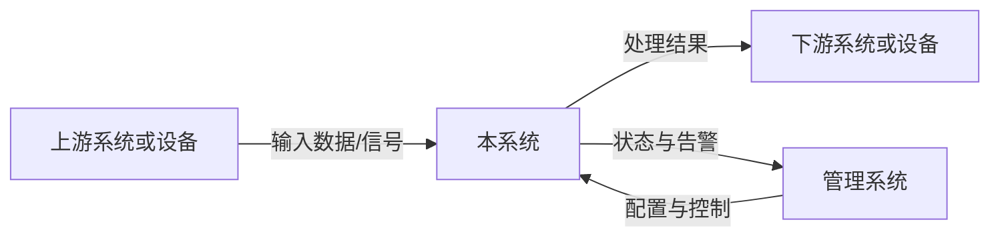
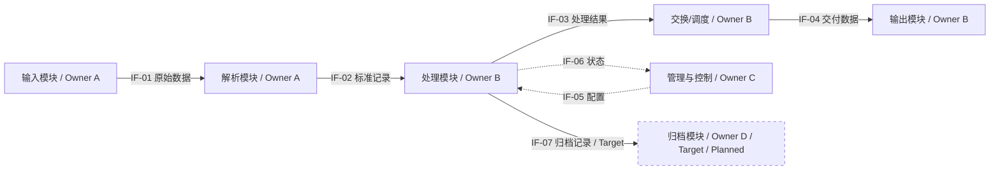
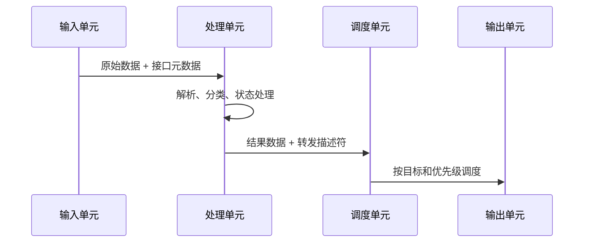

<!-- STD_DOCUMENT_COVER_BEGIN -->
# {{document_title}}

| 文档字段 | 值 |
|---|---|
| Document ID | `{{document_id}}` |
| Document Version | `{{document_version}}` |
| Status | `{{document_status}}` |
| Project | `{{project}}` |
| Authority | `{{authority}}` |
| Document Owner | {{document_owner}} |
| Authors | {{authors}} |
| Created Date | `{{created_at}}` |
| Last Modified Date | `{{last_modified_at}}` |
| Template ID | `{{template_id}}` |
| Template Version | `{{template_version}}` |
| Template Conformance | `{{template_conformance}}` |
| Tailoring Reference | {{tailoring_ref}} |
| Migration Map Reference | {{migration_map_ref}} |
| Repository | `{{source_repository}}` |
| Canonical Path | `{{source_path}}` |
| Supersedes | {{supersedes}} |

> Reviewer、Approver、Approval Date 和 Release Tag 在进入相应状态时填写。Git commit/tag 是
> 外部不可变证据；不要在文档内容中伪造包含自身的 commit hash。
<!-- STD_DOCUMENT_COVER_END -->

| 设计属性 | 值 |
|---|---|
| Design Level | `{{design_level}}` |
| Domain | `{{domain}}` |
| Visibility | `{{visibility}}` |

> 本模板用于设备、软硬件一体产品以及复杂软件系统的总体设计。正文必须让读者回答五个问题：
> 为什么做、实现什么、系统由什么组成、数据和控制如何流动、各部分怎样落地并验证。
> 先按 §1.4 选择适用 profile，再写 §2 的系统概览。所有正文遵循 §1.5 的版本、状态和证据规则。
> 每处保留可展开的段落式编写建议，默认折叠；帮助和抽象示例不属于项目设计正文，也不计入概览
> 的 1–2 页。评审时折叠帮助阅读，正式交付可以删除帮助块，但必须保留填写后的设计与裁剪依据。
> 详细正反例见已锁定 STD 的 `docs/architecture-design-authoring-guide.md`。示例均为虚构结构示范。

**交付检查表（由 Reviewer 根据实际正文判断，不以标题齐全或工具 PASS 代替）**

- [ ] 只读 §2 的 1–2 页，就能说明系统问题、位置、输入—处理—输出、分工、主路径、版本范围及三项取舍。
- [ ] 每张架构图都有对象边界、方向、协议/IF ID、Owner、视图状态、适用版本/配置/拓扑和图例。
- [ ] 每个关键能力分别记录实现状态、验证结果及其证据；图中的未来部分具有独立样式和文字标记。
- [ ] 每个跨 Owner 边界的提供方、消费方和字段/行为 authority 唯一，引用之外仍解释协作原理。
- [ ] 每项数值结论都有单位、作用域、条件和来源/证据等级；目标、估算、仿真和实测没有混用。
- [ ] 每个章节或信息项的 `N/A` 都有 §1.4 的条件判定、tailoring decision、理由和批准记录。
- [ ] 正文能解释为何这样设计、如何运行及失败结果；没有只列文档索引，也没有复制下级规格成为第二份 authority。
- [ ] 所有适用节的完成条件都有正文证据；未闭合项有 Owner、影响及关闭条件，未被勾选为完成。

## 修订记录

本节编写建议、规范与示例

**本节目的**：保留文档演进和评审责任的可追溯记录。

**必须写清楚**：版本、日期、作者、变更原因、影响章节，以及实际 Reviewer/Approver。

**编写规范**：每次形成可评审版本都新增一行，不覆盖历史；未完成评审时保持 Pending。

**抽象示例**：`0.3.0 | 2026-09-09 | A | 增加过载恢复流程，影响 §6.3 和 IF-004 | Pending`。

**完成条件**：版本行能追到本次实际变更和影响范围，待评审与已批准记录可区分；已有历史没有被覆盖。

| Document Version | Date | Author | Change Summary | Reviewer/Approver |
|---|---|---|---|---|
| `{{document_version}}` | `{{last_modified_at}}` | {{authors}} | Initial or current revision | Pending |

## 目录、表目录与图目录

本节编写建议、规范与示例

**本节目的**：让长文档可以快速导航，并使图表能够被稳定引用。

**必须写清楚**：目录生成方式、正式表格清单、正式图片和 Mermaid 图清单。

**编写规范**：优先使用项目现有渲染工具生成目录；无此能力时维护人工目录并核对导航。
图表使用稳定编号，删除或重编号需在修订记录说明。

**抽象示例**：`FIG-6-1 正常数据处理流程 — §6.2`；`TABLE-11-1 外部接口总表 — §11.1`。

**完成条件**：使用项目实际渲染方式核对导航，图表编号和所在章节一致；无自动目录功能时已有可用的人工目录。

> 用项目实际支持的渲染方式生成或维护目录；本模板不提供自动目录工具。所有正式表格使用
> `TABLE-<章节>-<序号>`，图片和 Mermaid 图使用 `FIG-<章节>-<序号>`，并在图表下方写标题和说明。
> 图表目录只列实际存在的图表。

- **目录**：记录采用的渲染工具或人工维护方式，并核对导航。
- **表目录**：列出正式表格编号、名称和所在章节。
- **图目录**：列出正式图编号、名称和所在章节。

## 1. 文档说明

编写建议、规范与示例

**本章目的**：说明本文管什么、不管什么，以及读者应如何使用本文。

**必须写清楚**：设计对象、设计层级、适用版本、目标读者、上下游文档、范围和非目标。

**编写规范**：

- 本模板描述一个系统级设计对象；子系统/模块默认使用 `design.definition`。确需跨层时明确
  系统级主体、下钻目的和截止深度，`cross-level` 不能成为复制所有详细设计的理由。
- 需求、接口、详细设计和测试已有独立权威文档时，说明系统相关的语义、责任和约束并引用权威来源，
  不复制其完整字段表、RTL 实现或测试步骤。
- “未来可能支持”必须与本版本承诺分开。

**抽象示例**：本文描述边缘处理设备的系统级设计，覆盖输入、处理、交换和管理路径；不定义芯片
寄存器位域，也不代替安装手册。

**完成条件**：读者能判断本文的对象、读者、版本、范围和裁剪依据；所依赖的假设与未决项有责任人，且没有跨层 authority 冲突。

### 1.1 目的与读者

本节编写建议、规范与示例

**本节目的**：说明本文为什么存在，以及各类读者如何使用它。

**必须写清楚**：支持的决定或活动、主要读者、每类读者需要从本文获得的结果。

**编写规范**：不要写“供相关人员参考”；应说明读者看完后能完成什么设计、实现或验证工作。

**抽象示例**：系统负责人用本文确认责任边界，开发者据此实现模块和接口，测试人员据此设计验收用例。

**完成条件**：至少一类实际读者能从描述中知道读完后可以作出什么决定或开展什么工作，内容与文档范围一致。

<!-- 说明本文帮助谁做什么决定或完成什么实现。 -->

### 1.2 范围、非目标与设计层级

本节编写建议、规范与示例

**本节目的**：固定设计对象和边界，防止文档无限扩张或遗漏责任。

**必须写清楚**：范围内、范围外、排除原因、主要设计层级，以及跨层描述的边界。

**编写规范**：优先选择单一层级；跨层时说明必要性和每层深度，并引用负责详细内容的文档。

**抽象示例**：本文覆盖设备系统和板卡连接，不展开器件寄存器；寄存器定义由独立接口文档负责。

**完成条件**：每个重要边界都有归属；跨层下钻深度与上级/下级文档的职责一致，不会产生两份 current authority。

<!-- 明确本文覆盖和不覆盖的内容，以及与上下游文档的边界。 -->

### 1.3 参考资料与术语

本节编写建议、规范与示例

**本节目的**：固定设计输入和统一术语，避免引用漂移或概念歧义。

**必须写清楚**：参考资料 ID、版本/路径、用途、authority，以及项目特有术语的精确定义。

**编写规范**：引用固定版本或提交；通用词不重复定义，缩写首次出现仍需在正文展开。

**抽象示例**：`IF-SYS-001 | v1.2 | 数据面字段 authority`；`处理单元：执行解析和策略的逻辑单元`。

**完成条件**：关键引用能定位到实际版本和责任方，正文核心术语无相互矛盾定义；未定引用明确记录缺口。

<!-- 引用需求、接口、约束、ADR 和测试文档；只定义影响理解的项目术语。 -->

### 1.4 适用 profile 与章节裁剪

本节编写建议、规范与示例

**本节目的**：按设计对象的实际责任确定写作范围，使作者和 Reviewer 对必需信息有同一判断依据。

**必须写清楚**：所选 profile、技术组成、条件章节的触发事实、逐项 keep/simplify/omit 决定、
理由、影响、替代内容位置、批准责任人及记录。下表使用本模板当前章节编号。

**编写规范**：先根据产品责任选择 profile，再判定条件；不能为跳过困难内容改变 profile。
触发条件成立的章节升级为必需。条件不成立也要有裁剪记录；裁剪待批时保留章节和缺口。
原生模板的适用分支选择不等于任意删章，结构裁剪使用已有 `tailored` 和 `tailoring_ref` 机制。

**抽象示例**：软件服务运行在外部云平台上；其硬件板卡设计不在责任范围，§7 引用已批准的
`TAIL-003` 后标为 N/A，§8.6 仍完整说明节点资源、网络和故障域；不能连同部署边界一起省略。

**完成条件**：所选 profile 与责任范围相符，所有条件章节都有事实判断；每个省略/合并能追到已生效决定和信息承载位置，待批裁剪没有当作已生效。

| Design Profile | 选择依据 | 必需章节 | 条件章节 |
|---|---|---|---|
| `software-system` | 交付对象主要是软件服务/应用，不拥有板卡设计 | §1–6、§8、§10–14、§17–18 | §7、§9、§15–16；§8.4 按有无 UI 判定 |
| `integrated-system` | 同时拥有设备硬件和软件/固件设计责任 | §1–8、§10–14、§16–18 | §9、§15；§8.4 按有无 UI 判定 |
| `hardware-fpga` | 硬件系统为主要交付对象，可含 FPGA/专用处理单元 | §1–7、§10–14、§16–18 | §8–9、§15；§8.4 随软件和 UI 范围判定 |
| `subsystem/module` | 交付对象是上级系统内的单一责任单元 | 使用 `design.definition` 的问题/能力、边界、结构、流程、数据、失败、安全、实现与验收核心 | 不机械复制本模板；只引用系统背景和全局决策，并在正文解释本单元承担的具体义务 |

`Design Profile` 是文档写作范围，记录于本节；它不新增或改写项目 `std.lock.json.project_profile`
的枚举。条件小节（例如 §8.4）按自己的触发条件判断，即使所属章总体必需。
所有系统 profile 都保留 §17 的实现/交付依赖和完成条件。

| 条件范围 | 满足任一条件即必须编写 | 不成立时仍需保留的信息 |
|---|---|---|
| §7 硬件实现 | 本系统拥有板卡、器件或电气连接设计责任 | 外部硬件的依赖、资源及故障边界写入 §3.3/§5.3/§8.6 |
| §8 软件实现 | 本系统拥有软件、驱动、固件或管理程序的行为 | 外部软件的协议、启动及维护依赖写入 §11–12 |
| §9 专用处理 | 系统包含或依赖 FPGA/ASIC/DPU/GPU 加速路径 | 没有该路径的拓扑事实；外购设备只描述消费边界，不复制供应方内部设计 |
| §8.4 页面 | 本版本拥有 Web、桌面、终端或设备图形操作界面 | CLI/API 等实际入口仍在 §4/§11 描述，不能因无页面省略功能 |
| §15 信息安全 | 存在不可信输入、跨信任域、管理/调试入口、身份、秘密/敏感数据、可更新软件/固件或第三方可执行组件 | 即使条件均不成立，也要记录资产/入口筛查结果及安全责任人的裁剪决定；离线不等于无风险 |
| §16 物理工程 | 拥有机箱、供电、热、制造、人身或电气安全设计责任 | 外部设施的环境约束、资源限制和责任方仍记录在系统边界中 |

| 范围/信息项 | 条件判定与事实 | keep / simplify / omit | 理由与风险 | 替代位置 | Tailoring Document ID / Decision ID | 批准人/状态/版本证据 |
|---|---|---|---|---|---|---|

选择 profile 后逐项填写条件判定；合并相同理由的子项时列清所覆盖的范围。`N/A` 格式为
`N/A — 理由；Tailoring Document ID / Decision ID；批准记录`。只有记录生效后才能省略内容；
可从精简正文移走不适用标题，但须在本表保留原章节编号和映射。必需信息不可因裁剪丢失，
章节合并须指出承载位置。结构裁剪的封面/sidecar 使用 `template_conformance=tailored`，
`tailoring_ref` 指向项目内 `management.tailoring` 的 Document ID；批准证据由评审核验。

### 1.5 适用基线、视图状态与证据规则

本节编写建议、规范与示例

**本节目的**：保证整份文档中的图、表、能力和数字描述的是明确版本下的同一组事实。

**必须写清楚**：当前输入版本/提交、目标版本、配置、拓扑、运行模式和证据范围；每个视图及能力
在这些范围中的状态。实现状态和验证结果必须分列，文档获批不代表产品能力已验证。

**编写规范**：所有图沿用下面的状态规则，例外就在图旁声明。混合视图必须标出迁移前后边界和
尚未连通的路径。数值要区分目标与结论，附单位、作用域、条件、来源和证据；缺失数据保留未知。

**抽象示例**：当前版本的接收功能为 Implemented/NOT_RUN，表示代码已存在但还没有相应验证；
目标版本的持久化模块用虚线框和“Target / Planned”文字标记，不能借用接收功能的测试结果。

**完成条件**：任取一张架构图、一项能力和一个数字，都能识别适用版本、配置/拓扑与相应状态；Current 和 Target 无未标注混合，Verified 无越界借用证据。

| Baseline ID | Current 输入版本/提交 | Target 版本/范围 | 配置与模式 | 拓扑/资源与环境 | 生效范围/Owner |
|---|---|---|---|---|---|

- **架构视图**：每张图明确 `Current / Target / Transitional`、Baseline ID、适用版本/配置/拓扑。
  `Current` 只含已有路径；`Target` 表示预期设计；`Transitional` 必须解释并存条件、迁移顺序和切换边界。
  当前与未来对象不能用相同视觉样式：例如当前用实线框，未来用虚线框并附 Target/Planned 标签；
  不仅靠颜色区分。连接线的数据/控制类型使用独立图例，不能与对象的规划状态混用。
- **能力状态**：实现列使用 `Planned / Partial / Implemented`，分别说明未实现、部分范围实现、
  声明范围全部实现；验证列使用 `NOT_RUN / BLOCKED / FAIL / PARTIAL / Verified`。
  `Verified` 必须绑定同一能力范围、输入版本、配置和验收条件下的通过证据；只验证一部分写 PARTIAL。
  若已有工具原始词表为 PASS/FAIL，保留原始结果并解释对应范围，不改写原始证据。
- **数值类型**：目标写 `Target`；推导/估算、仿真和实测结论分别写 `Modeled / Simulated / Measured`。
  外部规范限值写 `Specified` 并标来源；不可用数字写 `Unknown` 和责任人。每个数字附单位、
  作用域、负载、拓扑/配置和来源；不同类型不能互相证明，实测单例不自动代表全部支持范围。
- **图的语义**：图内或紧邻图注写清对象、责任/信任边界、Owner、箭头方向、数据/控制含义、
  协议或 IF ID、状态和图例，并附解释主路径的文字。单张图应能脱离前后页独立读懂；
  框图中的每块、跨 Owner 的每条连接分别对应 §5 的责任表和 §11 的接口条目。

### 1.6 设计约束与关键假设

本节编写建议、规范与示例

**本节目的**：让读者理解方案在哪些硬约束和未证实前提下成立，并能识别假设失效后的影响。

**必须写清楚**：外部约束及来源、设计假设、影响的模式/功能、验证方式、Owner 和失效处理。
成本、部署、兼容、资源和交付约束应与本版本的选择关联。

**编写规范**：不可改变的输入记为 Constraint，待验证前提记为 Assumption，团队选择记入 §18.1；
不能把希望达到的能力写成已知条件。被假设阻塞的数字和实现计划必须使用同一个假设 ID。

**抽象示例**：接入协议版本固定是约束；下游能在限定时间内恢复是待验证假设；队列预算依赖该假设，
超时后采取拒收还是丢弃需要独立设计决定和验证。

**完成条件**：每项关键假设能追到受影响的设计、数字或计划，并有验证责任和失效后果；约束、假设与团队决策没有混写。

| ID | Constraint / Assumption | 内容与来源 | 影响范围 | 验证/失效后果 | Owner | 状态/关闭条件 |
|---|---|---|---|---|---|---|

## 2. 系统概览（必需，1–2 页）

编写建议、规范与示例

**本章目的**：让没有参与讨论的读者在阅读约 1–2 页后，能够用自己的话解释系统用途、工作原理和边界。

**必须写清楚**：用连贯段落回答下面七个问题，以一张最小的主路径图辅助理解；细节放后续章节。
先选一个代表场景沿输入—处理—输出走通，再交代其他模式的关键差异。所有本版本的承诺都注明状态。

**编写规范**：本节必须自包含。不得仅列文档链接、模块清单或需求索引；没有阅读后续章节的读者
也应能理解系统用途、工作原理和主要边界。按项目渲染后的正文控制为约 1–2 页，帮助块不计页数。
不得通过把字号缩小或改成密集缩写满足篇幅要求。三项取舍各写选择、收益、代价和不适用边界。

**抽象示例**：一项虚构的数据整理服务位于采集端与报表端之间，将多源事件校验、归并后输出统一记录。
接收单元负责校验，处理单元负责归并，输出单元负责交付；管理入口只改变配置。当前仅接收与校验
已实现，归并处于目标设计；为保留来源信息选择暂存记录，代价是占用存储。该说明先让读者看懂主链，
再由后续章节解释字段和故障处理。

**完成条件**：未参与设计的读者只读本节即可复述七个问题的答案；概览与后文同一基线一致，正文约 1–2 页且不靠跳转补足用途或工作原理。

本节为所有系统 profile 的必需正文，不能裁剪成引用。请连续说明：

1. **问题与价值**：为谁解决什么具体问题，不解决会造成什么影响。
2. **环境与位置**：上游、下游、管理者和本系统在部署拓扑中的位置及责任边界。
3. **输入—处理—输出**：接收什么、按什么主要规则变换、把什么可观察结果交给谁。
4. **关键分工**：关键子系统为什么存在、各自负责什么，谁拥有共享数据和跨界决定。
5. **一条主路径**：代表数据或用户动作从入口到结果的完整过程，注明主要等待点和失败出口。
6. **本版本做到哪里**：适用版本、配置/拓扑、Current/Target 差异、能力实现状态和验证范围。
7. **三项关键取舍**：最影响本系统的三项选择、备选、收益、代价和边界；未决时明确 Owner 与影响。

<!-- 在此写自包含概览和一张带基线、责任、方向、协议、状态及图例的主路径图。 -->

## 3. 产品应用与设计目标

编写建议、规范与示例

**本章目的**：先解释真实问题和部署环境，再进入技术方案。

**必须写清楚**：谁使用、部署在哪里、上下游设备或系统是谁、输入输出是什么、不做会产生什么
影响，以及成功标准。

**编写规范**：

- 用一张环境/上下文图展示系统边界，箭头必须标注数据、命令或物理信号。
- 至少描述一种典型部署；多种组网方式要说明适用条件和差异。
- 设计目标必须可验证，不使用“高性能”“高可靠”等无阈值表述。

**抽象示例**：设备接收上游数据，执行解析、过滤和分发后输出给下游系统；设备不反向修改上游
业务。目标是支持指定输入规模，并在过载时按明确策略降级而不是静默丢失。

**完成条件**：典型用户、实际问题、系统环境与可验证目标形成因果链；读者能解释为何需要这套方案及不适用场景。

### 3.1 问题与业务背景

本节编写建议、规范与示例

**本节目的**：让读者先理解要解决的问题，而不是直接面对技术方案。

**必须写清楚**：当前环境、现状、具体问题、影响，以及为什么现在需要解决。

**编写规范**：使用可核验事实，不从器件型号或宣传性能力开始；未批准的方案不能写成背景事实。

**抽象示例**：现有节点无法在目标输入规模下持续处理，导致下游数据不完整，因此需要增加分级处理能力。

**完成条件**：问题具有具体影响及可核验来源，目标方案没有被当成既有背景；读者能说明本系统要改善什么结果。

<!-- 说明为什么需要该系统、当前痛点及其影响。 -->

### 3.2 用户与使用场景

本节编写建议、规范与示例

**本节目的**：把系统能力放入真实用户和运行场景中描述。

**必须写清楚**：角色、前置条件、触发动作、系统响应、可观察结果和失败结果。

**编写规范**：至少覆盖常见、容量边界和异常场景；使用稳定场景 ID 供功能、流程和测试引用。

**抽象示例**：`UC-02` 运维人员切换处理模式；系统校验配置、排空旧流并报告切换成功或失败原因。

**完成条件**：至少一条正常场景和适用异常/容量边界场景可从触发走到可观察结果，并能关联功能和验证项。

<!-- 列出角色、触发场景、期望结果和异常场景。 -->

### 3.3 应用环境与系统边界

本节编写建议、规范与示例

**本节目的**：明确系统所处环境、外部依赖和责任边界。

**必须写清楚**：上下游、数据/命令/信号、方向、协议、责任主体、信任边界和典型组网。

**编写规范**：上下文图与连接表配套；多种组网分别写适用条件，外部组件不得算作本系统实现。

**抽象示例**：上游设备提供输入流，本系统处理后交付下游；管理系统只配置和观测，不进入数据面。

**完成条件**：图、上下游清单和文字一致，跨界数据/命令、信任域和责任方明确；外部组件不被计算成本系统已实现能力。

<!-- 提供上下文图、上下游清单、信任边界、物理环境和网络/总线边界。 -->

> FIG-3-1 上下文结构示例，非项目事实。视图 Current；示例基线 EXAMPLE-B-01；版本/配置/拓扑为
> 示例单节点接入。A/B/M 均为外部 Owner，本系统由 System Owner 负责；边界为本系统方框。
> 箭头方向及文字表示流向与类型，接口对应 IF-IN/IF-OUT/IF-MGMT，正式稿补入实际协议。
> 所有对象均为该示例的当前对象；能力实现/验证为 Implemented/NOT_RUN，不声称已有真实证据。
> 管理者配置本系统并消费告警，业务从上游进入后流向下游；正式稿还需说明失败返回边界。

### 3.4 设计目标与成功条件

本节编写建议、规范与示例

**本节目的**：把方向性目标转换成可以设计和验收的条件。

**必须写清楚**：目标 ID、度量口径、环境、负载、阈值、证据类型和验证方法。

**编写规范**：禁止只写“高性能/高可靠”；估算值、理论上限和实测支持值必须明确区分。

**抽象示例**：`G-003` 在固定报文分布和目标拓扑下持续处理指定负载，丢失率低于已批准阈值。

**完成条件**：各目标都有单位、作用域、前提和通过条件；Reviewer 可据此判断满足与否，未知阈值有明确阻塞影响。

| Goal ID | 目标 | 度量 | 目标值/边界 | 验证方式 |
|---|---|---|---|---|
| G-001 | <!-- 示例：持续处理目标负载 --> | <!-- throughput --> | <!-- 明确数值与条件 --> | <!-- 测试或分析 --> |

## 4. 功能与需求实现概览

编写建议、规范与示例

**本章目的**：直接回答“系统要实现什么”。

**必须写清楚**：功能清单、输入、处理、输出、触发条件、约束、异常行为和验收条件。

**编写规范**：

- 每项功能使用稳定 ID，并追溯到需求。
- 不只写名词；必须描述输入经过什么处理产生什么输出。
- 配置范围、容量和模式限制必须显式写出。
- 尚未实现、部分实现和计划功能分别标记，不得混写。

**抽象示例**：`F-003` 接收带有分类字段的数据单元，根据已加载规则产生转发、丢弃或进入状态管理
三类动作；规则未命中时采用明确默认动作，并产生可观测计数。

**完成条件**：关键功能均可追到用户需要、实现责任与验收条件，正常/失败结果及实现和验证状态明确；没有只有名词的功能行。

### 4.1 功能总表

本节编写建议、规范与示例

**本节目的**：建立完整、可追溯的系统功能清单。

**必须写清楚**：功能 ID、调用方、输入、核心处理、输出、当前状态和验收条件。

**编写规范**：名称使用动宾结构；输入—处理—输出形成闭环，按 §1.5 分别填写实现状态和验证结果。
部分实现列出已覆盖/未覆盖范围，Verified 必须有与能力范围、基线及验收条件一致的证据。

**抽象示例**：分发处理结果功能只完成单出口路径，写 `Partial / NOT_RUN`，同时明确多出口尚未实现。

**完成条件**：每项功能的输入—处理—输出闭合，范围和状态有证据支持；功能名称、图和详细节 ID 相互一致。

| Function ID | 功能 | 用户/调用方 | 输入→核心处理→输出 | 适用基线/范围 | 实现状态 | 验证结果/Evidence | 验收条件 |
|---|---|---|---|---|---|---|---|
| F-001 | <!-- 功能名称 --> | <!-- 角色 --> | <!-- 输入、规则、结果 --> | <!-- Baseline ID/范围 --> | Planned | NOT_RUN | <!-- 可执行条件 --> |

### 4.2 功能详细说明

本节编写建议、规范与示例

**本节目的**：把复杂功能展开到工程师能够直接实现的深度。

**必须写清楚**：目的、前置条件、输入、处理顺序、状态、输出、配置、异常和验收。

**编写规范**：复杂功能独立成节；已有机器契约时引用字段 authority，但仍解释系统责任和行为语义。

**抽象示例**：规则处理功能按解析、匹配、动作执行顺序展开，并说明未命中、表更新和资源耗尽行为。

**完成条件**：复杂功能按判定顺序解释行为和失败结果，团队能据此确定跨模块实现责任及可测试条件，不需要猜测默认行为。

<!-- 对每个复杂功能重复以下结构：目的、前置条件、输入、处理步骤、输出、配置、异常、验收。 -->

#### F-XXX：功能名称

本节编写建议、规范与示例

**本节目的**：提供每项复杂功能都能复用的统一填写单元。

**必须写清楚**：功能总表中的真实 ID、判断顺序、状态变化、默认行为、边界条件和外部结果。

**编写规范**：复制本小节后必须替换 `F-XXX`；每条验收条件应能直接转换为测试输入和 oracle。

**抽象示例**：当输入有效且资源可用时产生结果；输入非法时返回类型化错误；资源不足时进入受控降级。

**完成条件**：示例 ID 已替换，正常、边界和失败路径均有外部结果；需求、配置限制和 oracle 可对应，未决行为有 Owner。

- **解决的问题**：
- **适用基线、实现状态与验证结果**：
- **前置条件**：
- **输入与来源**：
- **处理规则**：
- **输出与去向**：
- **配置与容量边界**：
- **异常与降级**：
- **验收条件**：

### 4.3 需求追溯

本节编写建议、规范与示例

**本节目的**：证明需求、设计、接口和验证之间没有断链。

**必须写清楚**：每个功能对应的需求、设计章节、接口/契约和验证用例。

**编写规范**：缺失关联不能留空，应记录缺口、Owner 和关闭 Gate；跨系统功能必须引用接口 authority。

**抽象示例**：`F-004 → REQ-DATA-012 → §6.2 → IF-DATA-003 → TC-E2E-008`。

**完成条件**：选定需求能沿功能到设计、接口和验证闭合，缺口显式登记；既有追溯矩阵被引用而没有维护另一套冲突关系。

| Function ID | Requirement ID | Design Section | Interface/Contract | Verification Case |
|---|---|---|---|---|
| F-001 | REQ-001 | §4.2 | IF-001 | TC-001 |

## 5. 总体结构

编写建议、规范与示例

**本章目的**：展示系统由哪些部分组成，各自为什么存在、负责什么以及如何连接。

**必须写清楚**：系统功能框图、子系统/板卡/服务清单、职责、接口方向、关键资源和实现位置。

**编写规范**：

- 图中的每个块都必须在职责表中有对应项。
- 职责必须写“负责”和“不负责”，避免多个模块拥有同一责任。
- 软件写到仓库路径和关键 symbol；硬件写到板卡、器件或 RTL block；混合系统同时提供两种映射。
- 复杂模块继续拆分；简单模块不要制造无意义层级。

**抽象示例**：输入模块完成物理接入和帧校验；处理模块完成解析与策略执行；交换模块只执行已决定的
转发结果；管理模块负责配置和观测，不进入业务数据面。

**完成条件**：总体图、职责表和部署映射相互吻合，关键分工有理由，主路径和跨 Owner 接口都有唯一归属。

### 5.1 系统功能框图

本节编写建议、规范与示例

**本节目的**：用一张图建立整个设计的共同结构视图。

**必须写清楚**：当前层级的关键组成、主数据流、控制关系和外部连接。

**编写规范**：不要混入所有内部细节；图中名称必须与职责表和实际代码、板卡或 RTL 名称一致。

**抽象示例**：输入、解析、处理、调度和输出组成主链，管理模块用虚线表示配置与状态关系。

**完成条件**：单看图与图注即可识别对象、主路径、Owner、状态和基线；每块有职责行，每条跨界连接有协议或 IF ID。

> FIG-5-1 分工与规划差异示例，非项目事实。视图 Transitional；示例基线 EXAMPLE-B-01，
> 当前版本 E1、目标版本 E2，单节点配置。实线框表示 Current 对象，虚线框并带 Target 标签表示
> 规划对象；实线箭头表示业务数据，点线箭头表示管理控制/状态，IF ID 关联接口及协议 authority。
> Owner 标签标记责任边界；正式图还需显示与项目拓扑相符的信任域。
> E1 中输入至输出是可达主链（Implemented/NOT_RUN）；IF-07 尚不可达，归档路径为 Planned/NOT_RUN。
> E2 必须完成双方契约、归档失败策略及切换验证后才能启用该路径；概念图不授权新增此机制。

### 5.2 组成与职责

本节编写建议、规范与示例

**本节目的**：把框图中的方块转换成清晰的责任和实现分工。

**必须写清楚**：模块职责、非职责、提供接口、依赖、实例关系和实现位置。

**编写规范**：框图中每块对应一行；位置写真实路径/板卡/RTL block，未创建时写计划位置和 Owner。

**抽象示例**：解析模块负责生成标准描述符，不负责策略决定；实现位于 `src/parser/` 和 `rtl/parser/`。

**完成条件**：关键责任恰有一个拥有者，提供接口和依赖无相互矛盾；实现位置与当前/计划状态相符。

| Block ID | 模块/单元与 Owner | 负责/不负责 | Provided Interface | 依赖 | 实现位置/详细设计 authority | 基线/视图 | 实现状态/验证结果 |
|---|---|---|---|---|---|---|---|
| BB-001 | <!-- 名称与责任方 --> | <!-- 职责与边界 --> | <!-- IF ID --> | <!-- 依赖 --> | <!-- path/block/文档 ID --> | <!-- Baseline ID/Current 等 --> | <!-- 分别填写 --> |

### 5.3 物理与逻辑对应关系

本节编写建议、规范与示例

**本节目的**：说明逻辑设计如何落实到真实运行和物理载体。

**必须写清楚**：逻辑块到板卡、芯片、区域、进程、线程或实例的映射，以及共享资源和故障域。

**编写规范**：说明一对多/多对一关系和不同模式下的变化；不要把逻辑图直接当部署图。

**抽象示例**：两个逻辑处理实例共享一个物理缓存控制器，但分别属于独立故障隔离域。

**完成条件**：每个关键逻辑单元可定位到承载节点/板卡/进程与故障域，共享资源、一对多或多对一关系及模式差异明确。

<!-- 描述逻辑功能如何映射到板卡、芯片、进程、容器、服务或线程。 -->

## 6. 工作模式与端到端流程

编写建议、规范与示例

**本章目的**：回答系统在每种工作模式下怎样运行，数据和控制逐步经过哪里。

**必须写清楚**：模式选择条件、每种模式的资源拓扑、逐步数据流、状态变化、容量、限制、异常和切换。

**编写规范**：

- 先用模式矩阵比较，再为每种重要模式提供数据流图和编号步骤。
- 每一步写清发起方、接收方、数据形态、变换和失败处理。
- 模式切换是否在线、是否丢状态、是否需要重启必须明确。
- 正常流之外至少描述过载、输入异常和下游不可用。

**抽象示例**：直通模式下输入与处理单元一一对应；复制模式在调度层复制数据，分别送往独立处理单元。
两者的资源占用、输出收敛和故障影响不同，不能只用一个“支持多模式”句子概括。

**完成条件**：读者能沿每条主要模式走完整个正常与失败路径，并解释模式切换、共享状态和资源变化；没有仅用名称代替机制。

### 6.1 工作模式矩阵

本节编写建议、规范与示例

**本节目的**：让读者快速比较不同工作模式的拓扑、能力和代价。

**必须写清楚**：模式场景、输入/处理/输出拓扑、容量、限制、选择和切换条件。

**编写规范**：只有改变数据路径、资源分配或行为的配置才算模式；单一模式也要记录固定边界。

**抽象示例**：直通模式减少复制和延迟；复制模式增加使用方数量，但降低单路可用输入能力。

**完成条件**：模式之间的行为和资源差异可比较，选择/切换条件明确；只有一种模式时也已界定固定边界。

| Mode ID | 模式 | 适用场景 | 输入拓扑 | 处理拓扑 | 输出拓扑 | 容量/限制 | 切换条件 |
|---|---|---|---|---|---|---|---|
| MODE-01 | <!-- 名称 --> | <!-- 场景 --> | <!-- 输入 --> | <!-- 处理 --> | <!-- 输出 --> | <!-- 限制 --> | <!-- 切换 --> |

### 6.2 正常数据流

本节编写建议、规范与示例

**本节目的**：使工程师能沿着一条真实数据路径理解系统运行。

**必须写清楚**：每一步的发起方、接收方、数据形态、处理、状态变化、缓存和输出。

**编写规范**：先图后编号步骤；异步队列、缓存和跨时钟域边界不能因图面简化而遗漏。

**抽象示例**：输入单元校验并附加接口元数据，处理单元生成动作，调度单元选择出口并更新计数。

**完成条件**：图与编号步骤一一对应，输入到输出的变换、队列、状态和责任可逐步追踪，异步或跨域边界没有遗漏。

> FIG-6-1 主路径顺序示例，非项目事实。视图 Current；EXAMPLE-B-01，示例 E1/单节点配置。
> I/P/D/O 的 Owner 分别对应 §5.2 中的责任条目；消息顺序与数据类型见箭头，跨界协议由
> IF-01/IF-03/IF-04 定义。实线消息表示本示例业务数据流，全部为当前路径、Implemented/NOT_RUN。
> 正式稿填写具体 Owner、协议、队列/等待点和失败出口；图下的编号步骤解释每次变换及其外部结果。

<!-- 按 1、2、3…逐步解释图中的数据、变换、状态和责任主体。 -->

### 6.3 异常、过载与恢复流程

本节编写建议、规范与示例

**本节目的**：明确非正常情况下系统如何保持可预测和可恢复。

**必须写清楚**：触发、检测、影响、丢弃/重试/降级、告警、恢复条件和最终外部结果。

**编写规范**：至少覆盖无效输入、过载、缓存耗尽、下游中断和内部故障；重试需定义幂等边界。

**抽象示例**：输出持续阻塞后停止接收新数据、保留已确认状态并告警；恢复后从安全边界继续。

**完成条件**：适用故障有检测、响应、最终状态和恢复条件；重试/丢弃不会在文档中形成未定义的重复执行或数据丢失边界。

<!-- 描述校验失败、缓存不足、处理超时、下游中断、重试、丢弃、告警和恢复。 -->

### 6.4 模式切换与状态迁移

本节编写建议、规范与示例

**本节目的**：定义工作模式切换的控制、状态和数据安全边界。

**必须写清楚**：触发方、控制接口、停流/排空/重启需求、状态迁移、失败结果和回滚步骤。

**编写规范**：禁止只写“支持动态切换”；应说明切换原子点和调用方如何判断成功或失败。

**抽象示例**：控制面提交新模式后先停止入口并排空队列，切换资源映射成功后再恢复入口。

**完成条件**：成功与失败均有可判定终态，切换原子点、在途数据/状态处理和回滚约束与接口及维护设计一致。

<!-- 描述切换触发、原子性、数据面影响、状态保留和回滚。 -->

## 7. 硬件实现方案

编写建议、规范与示例

**本章目的**：说明功能如何落实到硬件组成、接口和关键器件。

**必须写清楚**：硬件架构、板间接口、时钟/复位/电源、器件选择、信号完整性、可靠性及开发平台。

**编写规范**：

- 按 §1.4 判定硬件设计责任并记录裁剪依据；设备项目不能只放框图而没有接口和选型依据。
- 器件选择应关联带宽、容量、功耗、供货、生命周期和替代方案。
- 估算、仿真和实测结论必须分开标记。
- 详细原理图或 BOM 是独立 authority 时使用链接引用。

**抽象示例**：处理器件通过高速串行接口连接输入模块，通过存储接口连接外部缓存；选择结果必须满足
峰值带宽、最坏突发缓存和温度范围，而非仅写器件型号。

**完成条件**：关键器件和连接能解释如何满足目标，时钟/电源/复位与容量约束有依据；硬件详细 authority 与系统摘要一致。

### 7.1 硬件架构与板卡组成

本节编写建议、规范与示例

**本节目的**：建立从整机到板卡和关键器件的硬件实现全景。

**必须写清楚**：组成、功能、数量、资源、连接、故障域，以及原理图/BOM authority。

**编写规范**：解释设计意图而非抄录物料字段；图、清单和真实硬件命名应一致。

**抽象示例**：系统由接口板、处理板和交换板组成，处理板可多实例扩展但共享背板带宽。

**完成条件**：图和组成表覆盖实际责任范围，每个关键板卡/器件有数量、职责和连接，共享资源与故障域可辨识。

### 7.2 板间与器件接口

本节编写建议、规范与示例

**本节目的**：固定板间和器件间连接的系统级约束。

**必须写清楚**：端点、方向、协议、宽度、速率、时钟、同步、流控、错误和 authority。

**编写规范**：详细管脚/寄存器引用唯一接口文档；本节说明系统级用途、容量和限制。

**抽象示例**：处理器件通过全双工高速链路连接交换器件，采用独立时钟恢复并传播链路错误状态。

**完成条件**：每条关键连接的端点、方向、协议、容量、同步和错误响应一致，详细字段或管脚能追到唯一 authority。

| IF ID | 起点 | 终点 | 类型/协议 | 宽度/速率 | 时钟/同步 | 流控 | 错误处理 |
|---|---|---|---|---|---|---|---|

### 7.3 时钟、复位、电源与信号完整性

本节编写建议、规范与示例

**本节目的**：说明硬件能否按正确顺序稳定启动并在目标速率下工作。

**必须写清楚**：时钟来源、复位域/顺序、电源轨/时序、关键信号完整性假设和验证状态。

**编写规范**：区分规格、计算、仿真和实测；未验证项必须进入风险及验证矩阵。

**抽象示例**：参考时钟稳定且电源良好后释放链路复位，随后由管理软件确认训练状态。

**完成条件**：启动/关断顺序和关键跨域依赖能被复核，约束与验证状态分别标注，未证实稳定性的路径进入风险和验证矩阵。

### 7.4 器件选型与容量依据

本节编写建议、规范与示例

**本节目的**：证明关键器件能够满足功能、容量、可靠性和交付要求。

**必须写清楚**：候选、选择理由、约束、余量、生命周期、供应风险和替代条件。

**编写规范**：替代器件要检查硬件、固件、时序和软件兼容，不能只写“同系列兼容”。

**抽象示例**：缓存器件选择由峰值带宽和最坏突发容量决定，并保留经批准余量和第二来源方案。

**完成条件**：选择能追到硬约束及比较依据，最坏容量/带宽有余量说明；替代料的兼容验证责任和触发条件明确。

### 7.5 硬件可靠性与开发平台

本节编写建议、规范与示例

**本节目的**：定义硬件故障下的保护方式，并保证开发结果可复现。

**必须写清楚**：保护、冗余、降额、错误检测、诊断、安全状态、工具版本、输入和产物位置。

**编写规范**：每个可靠性机制关联故障模型和验证方法；工具链必须固定版本和目标器件。

**抽象示例**：单风扇失效触发降额和告警；原理图检查与时序报告由固定工具版本生成并保存。

**完成条件**：保护机制对应故障和验证项，工具/输入版本足以重现设计检查；尚未获得的报告保持未验证。

## 8. 软件实现方案

编写建议、规范与示例

**本章目的**：把系统功能落实到可实现的软件模块、进程、协议和代码位置。

**必须写清楚**：软件架构、模块职责、主要通信、状态与并发、配置、错误处理、可靠性和开发平台。

**编写规范**：

- 模块名称必须与仓库目录、package、service 或关键 symbol 对应。
- 对每个模块说明输入、输出、状态、线程/任务模型和失败传播。
- 页面型系统增加页面、路由、操作和 Loading/Empty/Error 状态。
- 不在设计文档里复制 OpenAPI/Schema；引用其路径并解释语义边界。

**抽象示例**：控制服务加载经校验的配置快照并原子发布给数据面；数据面只读快照，不直接修改配置源。

**完成条件**：主要软件功能落实到结构、路径、部署、状态和错误边界，接口/页面及验收彼此一致，已实现与计划范围清楚。

### 8.1 软件架构

本节编写建议、规范与示例

**本节目的**：展示软件如何分层、分进程并协作完成系统功能。

**必须写清楚**：进程/服务/线程、调用方向、数据与控制路径、状态归属、启动顺序和故障域。

**编写规范**：先给架构图再解释；名称对应真实代码和部署，不把未来模块画成当前实现。

**抽象示例**：控制服务校验并发布配置快照，数据面进程只读快照并独立上报运行状态。

**完成条件**：进程/服务职责、调用和数据方向、状态归属及故障域可被解释，图中规划模块与当前模块明显区分。

<!-- 编写建议：在此放置软件架构图和架构说明。 -->

### 8.2 模块设计与代码映射

本节编写建议、规范与示例

**本节目的**：让开发者能够从设计直接定位需要实现或修改的代码。

**必须写清楚**：模块职责、接口、状态、并发、错误边界、关键 symbol 和仓库路径。

**编写规范**：每个软件模块一行；计划模块写计划路径和 Owner，不能用“相关代码”等模糊位置。

**抽象示例**：`MOD-02 | 配置校验 | snapshot in/out | 单写多读 | typed error | src/config/validator.*`。

**完成条件**：每个关键模块有职责、真实或明确标为计划的路径和 Owner，跨模块输入/输出及错误传播对得上。

| Module ID | 模块 | 职责 | 输入/输出 | 状态/并发模型 | 错误边界 | 实现路径 |
|---|---|---|---|---|---|---|

### 8.3 通信、配置与状态管理

本节编写建议、规范与示例

**本节目的**：定义软件模块间协作以及配置和状态的一致性规则。

**必须写清楚**：通信方式、配置来源/校验/生效、状态 ownership、并发控制、持久化和恢复。

**编写规范**：区分配置源、运行快照和观测副本；明确事务/原子边界及重复、乱序、超时行为。

**抽象示例**：管理进程原子替换不可变配置快照，工作线程按 generation 读取，不允许局部更新。

**完成条件**：作者能解释配置从来源到生效的全过程，以及乱序、重复、并发、超时和重启后的确定结果；写 authority 唯一。

<!-- 编写建议：在此描述通信、配置发布和状态生命周期。 -->

### 8.4 页面与交互（如适用）

本节编写建议、规范与示例

**本节目的**：当系统包含 UI 时，定义用户看到的页面、操作和状态反馈。

**必须写清楚**：页面/路由、内容、操作、权限、Loading/Empty/Error、跳转和后端契约。

**编写规范**：无 UI 时按 §1.4 记录 N/A、理由和裁剪决定；页面操作应关联功能 ID，错误不能只依赖日志呈现。

**抽象示例**：状态页展示模块健康度；加载中显示 skeleton，无数据说明原因，失败显示可操作恢复入口。

**完成条件**：每个实际页面和操作能关联功能及契约，加载/空/错误/权限状态有用户可见结果；无 UI 的裁剪有批准依据。

| Page ID | 路由 | 展示内容 | 主要操作 | Loading/Empty/Error | 后端契约 |
|---|---|---|---|---|---|

### 8.5 软件可靠性与开发平台

本节编写建议、规范与示例

**本节目的**：说明软件如何检测和处理故障，并固定可复现的开发构建环境。

**必须写清楚**：超时、重试、隔离、重启、数据恢复、日志/指标，以及语言、工具和构建版本。

**编写规范**：可靠性机制关联具体故障；重试给出上限和幂等要求，构建工具使用可固定版本。

**抽象示例**：调用超时后只对幂等操作有限重试；连续失败打开隔离并由健康指标触发告警。

**完成条件**：恢复机制绑定故障、上限和幂等边界，构建环境及产物来源可定位，测试结果只证明其声明范围。

<!-- 编写建议：在此说明软件可靠性机制、工具链和可复现构建方式。 -->

### 8.6 部署与运行环境

本节编写建议、规范与示例

**本节目的**：把逻辑软件架构落实到节点、进程、资源和网络，使读者能判断它在什么环境下成立。

**必须写清楚**：版本/配置、节点与实例、资源需求、网络和外部依赖、启动顺序、持久卷、故障域及
单点限制。多种部署分别绑定 Baseline/Topology ID，并说明扩容或切换时哪些映射改变。

**编写规范**：使用部署图或映射表配合文字，不能仅引用安装手册。这里只解释部署决策和约束；
逐条安装命令由运维文档维护，云平台托管部分也要明确责任方和可依赖的保证。

**抽象示例**：虚构服务中管理进程和两个处理实例部署在不同节点，只有管理进程写配置存储；
处理节点失败不影响配置持久化，但重启实例必须取得一致快照后才能接收请求。

**完成条件**：任意关键软件单元能定位到运行载体、资源、网络、持久化和故障域，启动依赖可执行，部署假设与性能基线一致。

| Topology/Baseline ID | 节点/进程与实例数 | 资源/单位/依据 | 网络/外部依赖 | 启动/停止依赖 | 持久化/故障域 | Owner/运行约束 |
|---|---|---|---|---|---|---|

## 9. 可编程逻辑与专用处理单元

编写建议、规范与示例

**本章目的**：当系统包含 FPGA、ASIC、DPU、GPU 或专用加速器时，说明其内部模块和流水处理。

**必须写清楚**：内部框图、模块职责、接口位宽与时序、流水和缓存、背压、跨时钟域、资源及异常。

**编写规范**：

- 没有专用处理单元时按 §1.4 记录条件筛查、N/A 和裁剪决定。
- 模块按数据经过的顺序描述，不只列名称。
- 数据与描述符若分离，必须写对应关系、顺序约束及重新汇合规则。
- 资源/时序结果注明工具版本、目标器件和实测或估算状态。

**抽象示例**：解析单元从宽数据总线提取字段并生成描述符；策略单元修改描述符；编辑单元依据描述符
重写数据。两条流水通过序号保持一一对应，任一路背压都会传播至共同缓存边界。

**完成条件**：主流水、控制和存储关系闭合，资源/时序/背压有设计依据，引用实现 authority 并明确未验证路径。

### 9.1 内部模块框图

本节编写建议、规范与示例

**本节目的**：展示专用处理单元的内部流水、控制和外部连接。

**必须写清楚**：输入/输出、处理级、缓存、控制模块、存储接口和调试路径。

**编写规范**：模块名称对应 RTL/kernel/firmware；数据流和控制流使用不同线型并附文字说明。

**抽象示例**：输入适配、解析、策略、编辑、缓存和输出构成主流水，控制模块旁路配置各级。

**完成条件**：读者可沿数据和控制链找到缓存与外部接口，模块对应实现责任，图注完整且未把未来块画成当前路径。

<!-- 编写建议：在此放置专用处理单元内部框图。 -->

### 9.2 模块处理说明

本节编写建议、规范与示例

**本节目的**：把内部框图逐块展开到可实现和可验证的粒度。

**必须写清楚**：输入、处理算法、输出、延迟/吞吐、缓存、背压、错误和实现位置。

**编写规范**：按数据经过顺序排列；存在旁路或反馈时单独说明，不能只列模块名称。

**抽象示例**：解析块每周期接收一个数据单元，产生描述符；非法格式丢弃并递增类型化计数器。

**完成条件**：各处理级的输入输出形态、算法作用和顺序明确，缓存/背压与异常能接到相邻级；细节引用同一实现规格。

| Block | 输入 | 处理 | 输出 | 延迟/吞吐 | 缓存/背压 | 异常 |
|---|---|---|---|---|---|---|

### 9.3 时序、资源与跨域设计

本节编写建议、规范与示例

**本节目的**：证明设计在目标器件和频率下具有足够资源并能安全跨域。

**必须写清楚**：时钟域、跨域方法、流水延迟、资源预算、时序余量、约束和证据状态。

**编写规范**：标明工具/器件/版本；估算、综合、布局布线和实测不能混为同一结论。

**抽象示例**：异步 FIFO 跨越输入与处理时钟域；满/空同步延迟计入背压和容量预算。

**完成条件**：时钟域、跨域同步和资源预算可核对，工具阶段与证据等级清楚，未收敛路径有风险及责任人。

<!-- 编写建议：在此记录时钟域、资源表、时序路径和验证证据。 -->

### 9.4 开发、仿真与调试平台

本节编写建议、规范与示例

**本节目的**：定义从开发到仿真、上板和现场调试所需的环境与入口。

**必须写清楚**：工具版本、仿真器、测试平台、调试接口、构建命令、输入和产物位置。

**编写规范**：给出可重复命令和环境约束；临时个人路径不得成为正式构建依赖。

**抽象示例**：CI 使用固定容器运行 lint 和仿真，实验室通过调试接口读取内部状态与捕获缓冲。

**完成条件**：环境、输入、工具和产物可定位，复现入口不依赖个人临时路径；仿真与上板验证范围明确。

<!-- 编写建议：在此说明开发、仿真、上板和调试环境。 -->

## 10. 数据、描述符与存储结构

编写建议、规范与示例

**本章目的**：描述系统内部真正流动和持久化的数据，以及各阶段如何改变它。

**必须写清楚**：主要数据流、描述符/元数据、状态表、缓存与存储、字段 ownership、生命周期和容量依据。

**编写规范**：

- 用 A/B/C 等阶段点或稳定 ID 标记数据形态，和数据流图一一对应。
- 位域、Schema、IDL 已有机器权威时引用，不手工复制；本章解释设计含义和变换。
- 每个表/状态对象说明 key、value、读写者、建立、更新、老化、删除及并发规则。
- 容量计算写出公式、单位、假设和余量。

**抽象示例**：原始数据在解析阶段保持 payload 不变并附加描述符；策略阶段只更新动作字段；输出阶段
根据动作字段修改封装。状态表以流标识为 key，具有显式创建与老化条件。

**完成条件**：主要数据从产生到释放可追踪，字段/状态的读写责任和格式 authority 唯一，容量模型与流程一致。

### 10.1 业务数据流

本节编写建议、规范与示例

**本节目的**：说明主要业务数据在系统各阶段的形态和变换。

**必须写清楚**：阶段 ID、格式 authority、生产者、消费者、变换、顺序和生命周期。

**编写规范**：阶段点与流程图一致；payload 未变化也要说明，复制、拆分、合并必须可追踪。

**抽象示例**：`DATA-B` 保留输入 payload，新增已校验描述符；由解析块产生、策略块消费。

**完成条件**：阶段 ID 与主流程吻合，复制/拆分/合并和 payload 变化都有说明，生产者与消费者能对应。

| Data ID | 所在阶段 | 格式 authority | 产生者 | 消费者 | 变换 | 生命周期 |
|---|---|---|---|---|---|---|

### 10.2 描述符与元数据流

本节编写建议、规范与示例

**本节目的**：说明伴随业务数据传递的控制信息如何产生、更新并保持对应关系。

**必须写清楚**：字段 authority、产生/修改/消费方、有效范围、顺序标识和与 payload 的关联方法。

**编写规范**：不要手抄位域；引用机器定义并解释各处理阶段允许修改哪些字段。

**抽象示例**：解析阶段创建描述符，策略阶段只写动作字段，输出阶段消费后释放；序号防止错配。

**完成条件**：任一描述符可找到产生/修改/消费责任及关联 payload 的规则，乱序、丢失或背压时不会留下未定义的对应关系。

<!-- 编写建议：在此描述描述符字段 ownership、阶段变换和数据对应关系。 -->

### 10.3 状态表、缓存与持久化

本节编写建议、规范与示例

**本节目的**：定义状态对象和缓存如何建立、使用、回收并保持一致。

**必须写清楚**：key/value、Schema、读写者、生命周期、容量、并发、一致性和恢复方式。

**编写规范**：区分临时缓存、运行状态和持久化事实；每个状态对象只能有一个写 authority。

**抽象示例**：会话表按规范化流 ID 建立，报文更新活动时间，超时或结束事件删除并输出统计。

**完成条件**：每个关键对象的创建、更新、删除和恢复可解释，Writer/Reader 与并发一致性规则相符，临时副本不被当成权威事实。

| Object ID | Key | Value/Schema | 读者 | 写者 | 建立/更新/删除 | 容量与一致性 |
|---|---|---|---|---|---|---|

### 10.4 容量与带宽计算

本节编写建议、规范与示例

**本节目的**：证明缓存、存储、链路和处理资源能够支撑设计目标。

**必须写清楚**：公式、单位、输入来源、最坏条件、并发/拓扑、余量和 Modeled/Simulated/Measured 证据类型。

**编写规范**：单位不能混用；原始极限不等于支持值，支持值需包含运行保留和安全余量。

**抽象示例**：所需缓存等于峰值输入速率乘最大背压时间，再加协议和实现余量。

**完成条件**：公式和输入足以复算，单位/范围/拓扑一致，峰值、支持值、余量和证据类型明确，缺失测量没有填成实测。

<!-- 写出公式、单位、输入来源、余量和 Modeled/Simulated/Measured 证据类型。 -->

## 11. 接口与通信协议

编写建议、规范与示例

**本章目的**：定义系统内外如何交换数据和控制，并明确兼容与失败边界。

**必须写清楚**：接口清单、方向、协议、格式 authority、初始化/握手、流控、超时、错误、版本和兼容性。

**编写规范**：

- 所有跨责任边界的连接都必须有 IF ID。
- 字段级规范引用 OpenAPI、IDL、Schema、寄存器表或接口控制文档。
- 区分数据面、控制面、管理面和观测面。
- 未知字段、版本不兼容、重复请求和连接中断的行为必须定义。

**抽象示例**：控制接口接受带版本的配置快照，校验失败时拒绝整个快照；数据接口使用信用流控，耗尽时
上游停止发送并记录持续时间，不允许无声覆盖缓存。

**完成条件**：所有跨责任连接都有唯一接口条目，语义、版本、失败和权限边界与流程一致，字段引用无第二份 authority。

### 11.1 接口总表

本节编写建议、规范与示例

**本节目的**：建立所有跨责任边界接口的唯一索引。

**必须写清楚**：接口 ID、类型、提供方、使用方、协议/总线、authority、流控/超时和版本策略。

**编写规范**：每个外部连接和跨 Owner 连接一行；详细规范链接到唯一机器或接口 authority。

**抽象示例**：`IF-CTRL-01 | control | 管理服务 | 数据面 | versioned snapshot | Schema X | 2 s | additive`。

**完成条件**：图中每条跨 Owner 连接都有提供方、消费方、协议和 authority；双方引用的版本/范围一致。

| IF ID | 类型 | 提供方 | 使用方 | 协议/总线 | 数据 authority | 超时/流控 | 版本策略 |
|---|---|---|---|---|---|---|---|

### 11.2 数据面接口

本节编写建议、规范与示例

**本节目的**：定义承载主要业务数据的接口及其持续运行行为。

**必须写清楚**：格式、速率、顺序、流控、背压、校验、错误、统计和停启条件。

**编写规范**：按 IF ID 分节；给出正常和边界条件，字段级内容引用机器契约。

**抽象示例**：接口保持同一流内顺序，信用耗尽时停止发送；校验失败的数据丢弃并计数。

**完成条件**：正常、背压、损坏、顺序和停启行为有明确外部结果，边界条件可映射到验证且与数据流程一致。

<!-- 编写建议：按 IF ID 描述数据面语义和异常行为。 -->

### 11.3 控制与管理接口

本节编写建议、规范与示例

**本节目的**：定义配置、控制和管理操作如何安全改变系统行为。

**必须写清楚**：身份权限、请求、校验、原子性、幂等、状态结果、超时、失败和审计。

**编写规范**：控制决定和数据执行分层；禁止未授权调用方绕过校验直接修改运行状态。

**抽象示例**：配置提交先完整校验，成功后原子生效并返回 generation；失败时旧配置保持有效。

**完成条件**：每项敏感操作的授权、校验、生效、幂等和失败结果可逐步解释，返回结果能让调用方判断是否已改变状态。

<!-- 编写建议：按 IF ID 描述控制和管理操作。 -->

### 11.4 观测、调试与维护接口

本节编写建议、规范与示例

**本节目的**：规定如何观察系统、定位问题和执行受控维护。

**必须写清楚**：指标、日志、trace、寄存器、调试入口、访问权限、采样、保留和性能影响。

**编写规范**：观测接口不得隐式执行控制决定；敏感信息需脱敏并按可见性限制。

**抽象示例**：只读健康接口返回模块状态和 generation；危险调试操作需要维护模式和审计记录。

**完成条件**：读写与危险操作边界明确，敏感信息、访问权限、观测代价和审计义务有落实位置。

<!-- 编写建议：在此描述观测、诊断和维护接口的安全边界。 -->

## 12. 可靠性、维护与升级

编写建议、规范与示例

**本章目的**：说明故障如何被发现、隔离、恢复和维护，而不是笼统声称“高可靠”。

**必须写清楚**：故障模型、状态指示、监控告警、定位信息、恢复策略、远程维护、版本升级和回滚。

**编写规范**：

- 每类故障写检测机制、系统响应、外部表现、恢复方式和数据影响。
- watchdog、冗余、重试等机制必须写适用边界，避免恢复风暴。
- 升级说明兼容范围、状态迁移、失败回滚和不可中断条件。

**抽象示例**：处理单元无响应超过阈值后隔离该单元并停止向其调度；自动重启仅允许一次，连续失败转为
人工处置并保留诊断快照。

**完成条件**：主要故障可沿检测、隔离、恢复到最终状态，数据影响和升级/回滚边界明确，并与安全信任政策一致。

### 12.1 故障模型与可靠性机制

本节编写建议、规范与示例

**本节目的**：系统性列出会影响功能、数据或服务的故障及其处置机制。

**必须写清楚**：故障触发、检测、隔离、系统响应、数据影响、恢复、降级和验证方法。

**编写规范**：按硬件、软件、接口、数据和外部依赖分类；每个机制必须对应具体故障而非口号。

**抽象示例**：处理实例失联后停止向其调度，保留未确认任务并告警；恢复需重新完成健康检查。

**完成条件**：适用故障有检测和响应，机制对应具体影响与验证，连续或复合故障的限制没有隐藏。

| Failure ID | 故障 | 检测 | 系统响应 | 数据影响 | 恢复 | 验证 |
|---|---|---|---|---|---|---|

### 12.2 状态指示、监控与故障定位

本节编写建议、规范与示例

**本节目的**：使运维和研发人员能够判断系统状态并定位故障来源。

**必须写清楚**：指示灯/状态、指标、日志、trace、诊断快照、告警阈值、关联 ID 和保留策略。

**编写规范**：每个关键故障至少有机器可读信号；状态含义、更新周期和无数据状态必须明确。

**抽象示例**：链路状态包含 down/training/up/degraded，变化生成事件并带端口、原因和时间戳。

**完成条件**：关键故障可由机器可读信号定位，状态含义、时效、关联 ID 和缺失数据行为明确，事件不泄露敏感信息。

<!-- 编写建议：在此建立状态、告警和诊断信息到故障模型的映射。 -->

### 12.3 维护、升级与回滚

本节编写建议、规范与示例

**本节目的**：定义系统如何被安全维护、升级并在失败时恢复到已知状态。

**必须写清楚**：维护入口、权限、升级对象、兼容检查、状态迁移、中断窗口、回滚和审计。

**编写规范**：升级步骤引用操作文档；本节重点说明设计支持和不可跨越的安全边界。

**抽象示例**：新版本先验证签名和兼容矩阵，再写备用分区；启动失败自动回到上一已知版本。

**完成条件**：维护状态、兼容、数据迁移、中断和失败结果可追踪，回滚不会违反 §15.5 的撤销/信任边界。

<!-- 编写建议：在此描述维护能力、升级状态机和失败回滚。 -->

## 13. 性能、扩展与兼容性

编写建议、规范与示例

**本章目的**：说明容量怎样得出、瓶颈在哪里、如何扩展，以及哪些版本能够共存。

**必须写清楚**：workload、吞吐/延迟/容量、资源余量、瓶颈、扩容方式、兼容矩阵和降级行为。

**编写规范**：

- 所有性能数字必须绑定数据规模、报文/请求分布、拓扑、配置和环境。
- Modeled、Simulated、Measured 分开，不把理论上限当作支持值。
- 扩容必须说明分片/调度方式、状态归属和故障域变化。
- 兼容性覆盖硬件修订、固件、软件、协议和数据格式。

**抽象示例**：支持值取链路、处理、存储和输出四个阶段中最小可持续能力，并保留规定余量；增加处理
单元后，调度表与状态归属必须同步扩展。

**完成条件**：容量与性能结论可追到相同负载/基线，瓶颈和余量解释成立，扩容/兼容边界与状态及部署一致。

### 13.1 性能模型与预算

本节编写建议、规范与示例

**本节目的**：用统一 workload 和资源模型解释各项性能与容量结论。

**必须写清楚**：指标、负载、上下文、拓扑、配置、理论/模型/实测值、支持值和证据。

**编写规范**：所有值带单位和作用域；支持值不得直接取资源耗尽边界，必须体现保留和余量。

**抽象示例**：持续吞吐支持值取输入链路、处理流水、存储和输出四阶段能力的最小值。

**完成条件**：目标、规范、模型、仿真、实测和支持范围分别标注，跨阶段取值口径一致，每项承诺都有对应条件或未决记录。

| Metric/单位/作用域 | Baseline/Workload/Topology | Target/Specified | Modeled | Simulated | Measured | Supported limit/限定条件 | Evidence/来源 |
|---|---|---|---|---|---|---|---|

### 13.2 瓶颈与资源余量

本节编写建议、规范与示例

**本节目的**：说明最先限制系统的资源以及设计为变化和突发保留的空间。

**必须写清楚**：瓶颈资源、触发 workload、利用率、余量、过载表现、监控和缓解方案。

**编写规范**：分别检查计算、内存、缓存、链路、存储和外部依赖；用证据而非经验断言瓶颈。

**抽象示例**：输出带宽先于处理能力达到上限，超过阈值后通过背压限制入口并产生告警。

**完成条件**：最先限制能力的资源有依据，余量与过载表现可解释，缓解方案不会把另一个资源极限隐藏。

<!-- 编写建议：在此填写瓶颈分析、资源预算和过载边界。 -->

### 13.3 扩容方案与兼容矩阵

本节编写建议、规范与示例

**本节目的**：定义增加容量的方法以及软硬件版本组合的可用边界。

**必须写清楚**：扩容单元、调度/分片、状态归属、故障域、上限，以及版本兼容和降级行为。

**编写规范**：提供明确矩阵；“向后兼容”必须说明兼容对象、范围、验证和不兼容结果。

**抽象示例**：增加处理板同步扩展调度表；旧控制软件可读新状态但不能配置新增能力。

**完成条件**：有效与无效组合、扩容时状态/故障域变化及失败结果明确，兼容结论有对应版本的验证依据。

<!-- 编写建议：在此给出扩容拓扑、操作条件和兼容矩阵。 -->

## 14. 可测试性与验收设计

编写建议、规范与示例

**本章目的**：在设计阶段就说明如何证明功能和质量目标已经实现。

**必须写清楚**：测试接口、数据源、注入点、自检、环回、观测点、oracle、环境和接受条件。

**编写规范**：

- 每项功能、接口、工作模式、故障和质量目标至少映射一个验证项。
- 写清怎样生成输入、在哪里观察结果、什么条件算通过。
- 静态检查、仿真、实验室测试和真实环境测试分别记录。
- `NOT_RUN`、`BLOCKED` 和分析结论不得写成 `PASS`。

**抽象示例**：内部数据路径支持可控测试源与末端环回；测试读取输入/输出计数和错误状态，证明正常、
背压和故障恢复路径，不依赖人工观察单一指示灯。

**完成条件**：关键功能、模式、接口、故障和目标均有可控输入、可观察结果及 oracle，未覆盖和未执行项如实保留。

### 14.1 测试支持与观测点

本节编写建议、规范与示例

**本节目的**：在设计中预留可控制、可观察且不会破坏正常运行的测试能力。

**必须写清楚**：测试模式、测试点、注入点、捕获点、计数器/日志/寄存器、权限和性能影响。

**编写规范**：说明测试模式与正常模式的隔离和退出条件；测试接口不得绕过安全与审计边界。

**抽象示例**：维护模式允许在解析前注入测试数据并在输出前捕获，正常模式下入口强制关闭。

**完成条件**：测试入口、观测点和权限足以验证目标路径，进入/退出及性能影响明确，测试能力不能绕过生产安全边界。

<!-- 编写建议：在此列出测试接口、观测点、权限和隔离机制。 -->

### 14.2 测试数据源、自检与环回

本节编写建议、规范与示例

**本节目的**：定义不依赖完整外部系统时如何验证各层数据路径和硬件状态。

**必须写清楚**：测试数据生成、输入重放、上电/周期/人工自检、内部/外部环回和结果比对。

**编写规范**：每种机制写覆盖路径、未覆盖路径、触发条件、持续时间、破坏性和通过 oracle。

**抽象示例**：上电自检验证存储和关键链路；内部环回覆盖处理流水，外部环回另覆盖物理接口。

**完成条件**：每种机制的覆盖与未覆盖路径、触发、破坏性和结果判定明确；内部自检不被用来证明未经过的外部链路。

<!-- 编写建议：在此描述测试源、BIST/自检、环回层级和结果判定。 -->

### 14.3 验证与验收矩阵

本节编写建议、规范与示例

**本节目的**：将功能、接口、模式、故障和质量目标映射到可执行验证及接受条件。

**必须写清楚**：目标 ID、层级、输入、环境、oracle、证据、状态和覆盖缺口。

**编写规范**：区分分析、静态、仿真、单元、实验室、生产和外部验证；NOT_RUN/BLOCKED 如实保留。

**抽象示例**：`MODE-02` 的实验室 E2E 计划使用峰值突发输入，oracle 为无未声明丢失且告警正确；
执行前写 NOT_RUN，执行后记录实际结果和报告，不能提前填写 Verified。

**完成条件**：目标能追到验证场景、基线、环境、oracle 和 Owner，实际结果有证据；计划、缺口与已验证范围可区分。

| Target ID/能力范围 | 测试层级 | 场景/输入 | Oracle/接受条件 | 基线/环境/拓扑 | Evidence | 验证结果 | Owner/未覆盖范围 |
|---|---|---|---|---|---|---|---|

## 15. 信息安全架构

编写建议、规范与示例

**本章目的**：说明系统如何在已识别的信任边界上保护资产，并把安全要求落实到真实架构和责任方。

**必须写清楚**：资产、身份、入口、信任边界、授权决策点、凭据与数据生命周期、启动和升级信任、
威胁、控制措施、剩余风险和验证责任。按 §1.4 的条件筛查确定本章是否适用。

**编写规范**：离线、内网或有 `management.security-plan` 均不能自动免除本章。管理计划定义过程，
本文定义系统边界上的技术责任；字段、密码协议和操作步骤引用各自 authority。本章的安全机制
同样标注 Current/Target、实现与验证状态，拟议控制不能写成已有防护。

**抽象示例**：虚构系统接收外部上传，接收端校验格式并限制资源，管理面在独立授权点控制配置；
即使隔离部署，也必须处理恶意输入、越权维护和更新包来源问题。

**完成条件**：资产、信任边界、身份、秘密、管理/调试及产物信任构成一致架构；适用威胁对应措施、Owner、验证和剩余风险。

### 15.1 资产、入口与信任边界

本节编写建议、规范与示例

**本节目的**：明确保护对象和不可信输入进入系统的位置，为后续安全选择提供可追踪起点。

**必须写清楚**：资产价值/敏感等级、持有者、外部与内部入口、信任域、跨域路径及其 IF ID。
威胁假设要覆盖用户、管理者、外部系统和具有设备接触能力的主体。

**编写规范**：在上下文/数据流图上标注信任边界，并在此解释每次跨越所需的检查；不能把同一
网络内的所有进程默认视为可信。资产和入口随版本/拓扑变化时重新核对受影响范围。

**抽象示例**：上传文件、处理结果和配置分别属于不同资产；上传入口是不可信边界，配置写入口
属于管理边界，两者不能共享无条件的访问许可。

**完成条件**：主要资产和入口均与拓扑及 IF ID 对应，信任跨越有检查责任，不存在未说明的默认可信连接。

| Asset ID | 资产/敏感性 | 入口/IF ID | 信任域与跨域路径 | 保护目标/威胁假设 | Owner |
|---|---|---|---|---|---|

### 15.2 身份认证与授权

本节编写建议、规范与示例

**本节目的**：定义谁能够以什么身份执行什么操作，以及系统在哪个唯一位置作出授权决定。

**必须写清楚**：用户/服务/设备身份、认证来源、身份传播、权限粒度、租户或项目范围、撤销、
会话失效、默认拒绝、特权维护及认证依赖不可用时的结果。

**编写规范**：区分认证、授权和网络可达性；逐个敏感操作写出校验点和执行点，跨 Owner 调用
说明谁负责传递身份、谁负责校验。禁止用“内网调用”代替权限模型。

**抽象示例**：只读观测身份可以获取本项目健康状态但不能提交配置；执行端复核授权范围，
权限撤销后旧会话的后续写请求按声明的失效策略处理。

**完成条件**：敏感操作可沿主体、认证、授权到执行点追踪，撤销/失效和拒绝结果可验证，网络可达性没有代替授权。

| 主体/身份来源 | 操作/资源范围 | 认证入口 | 授权决定/执行点 | 撤销/失效/拒绝结果 | Owner/验证项 |
|---|---|---|---|---|---|

### 15.3 密钥、凭据与敏感数据

本节编写建议、规范与示例

**本节目的**：使秘密和敏感数据从创建到销毁的处理过程都有明确的访问边界和泄露防护。

**必须写清楚**：凭据来源、存储位置类别、访问主体、传输保护、轮换/撤销、备份/恢复、保留/删除、
日志与转储脱敏以及故障时的行为。架构只记录引用和机制，不放真实凭据、私钥或敏感样本。

**编写规范**：区分数据加密与访问授权；指出各阶段何处以明文存在及由谁控制。外部秘密服务
不可用时写明是否拒绝操作和恢复条件，避免无声明的默认凭据或静默降级。

**抽象示例**：处理进程通过受控身份获取短期凭据，诊断包只保存凭据引用和错误分类；轮换失败
会阻塞受影响的新连接，并按既定保留规则结束旧凭据的有效期。

**完成条件**：创建、存储、传输、轮换、恢复和删除均有控制及 Owner，日志/转储不含真实秘密，故障降级行为已说明。

| 数据/秘密类别 | 来源/存储/传输保护 | 可访问主体 | 轮换/撤销/删除 | 备份/转储/日志边界 | 失败行为/Owner |
|---|---|---|---|---|---|

### 15.4 控制面、管理面与调试面防护

本节编写建议、规范与示例

**本节目的**：限制能改变系统行为或绕过常规接口的入口，并防止一次越权扩散到其他责任域。

**必须写清楚**：管理/API/CLI/调试端口的暴露条件、网络或物理隔离、开启权限、输入与资源限制、
维护模式、危险操作确认、审计以及退出/关闭条件。

**编写规范**：逐入口关联 §11 接口表，区分只读观测和改变运行状态的操作；默认关闭的调试口
要说明关闭由谁实施和如何验证，不能仅在图上画一条隔离线。

**抽象示例**：维护入口仅在受控模式启用，执行敏感操作前验证设备及操作者身份；退出维护后
接口权限失效，并产生可关联的审计事件。

**完成条件**：各敏感入口有暴露条件和实施点，关闭/维护模式及负向测试明确，与接口表和权限模型一致。

| 入口/IF ID | 暴露条件 | 允许操作 | 防护/隔离与实施点 | 失效/关闭条件 | Owner/负向验证 |
|---|---|---|---|---|---|

### 15.5 启动、升级、回滚与供应链信任

本节编写建议、规范与示例

**本节目的**：定义系统为何信任正在执行和即将安装的产物，并处理更新失败、撤销和恢复之间的关系。

**必须写清楚**：信任根、产物来源/签名/摘要、依赖来源、验证责任、密钥变更、版本兼容、
受损产物拒绝、更新中断、回退政策和恢复路径；托管边界说明依赖供应方的何种保证。

**编写规范**：§12.3 定义可用性与回滚流程，本节定义其安全约束；说明如何避免退回已撤销的脆弱版本，
同时保留获准的恢复路径。不能用“支持安全启动”代替信任链及失败行为。

**抽象示例**：加载程序验证产物来源与完整性后才转交执行；更新失败时只回到兼容且未撤销的
已知版本，签名服务或信任根恢复由明确责任方处理。

**完成条件**：可执行产物的来源到执行形成可解释信任链，撤销和更新失败有受控恢复路径，安全政策与可靠性回滚无冲突。

| 产物/依赖与版本 | 信任来源/验证点 | 签名或摘要 authority | 拒绝/撤销条件 | 安全回滚/恢复约束 | Owner/验证项 |
|---|---|---|---|---|---|

### 15.6 威胁、审计与安全验证

本节编写建议、规范与示例

**本节目的**：把威胁、架构控制和验证闭环连接起来，公开仍未覆盖的攻击路径和风险承担者。

**必须写清楚**：威胁/资产/路径、控制措施与实施位置、审计事件及保护、负向测试、证据范围、
剩余风险、责任人和接受决定。审计还需说明时间关联、保留、访问权限和记录失败时的处理。

**编写规范**：至少检查未授权调用、恶意/畸形输入、资源耗尽、敏感数据暴露及产物篡改等适用威胁；
每条威胁映射到一个负责控制的 Owner 和验证项。未执行测试写 NOT_RUN/BLOCKED，剩余风险不自动关闭。

**抽象示例**：配置越权威胁关联授权检查点，负向用例验证拒绝且审计无秘密泄漏；若尚无审计存储
防篡改证据，该部分单独记录为未验证并指明风险责任方。

**完成条件**：适用威胁均可追到控制点、负向验证及责任方，审计保留/保护/失败处理明确，未验证措施未用于关闭剩余风险。

| Threat ID/资产/路径 | 缓解措施/实施点 | 审计与记录失败行为 | 验证项/证据范围 | 实现状态/验证结果 | Owner/剩余风险与决定 |
|---|---|---|---|---|---|

## 16. 结构、热、工艺与安全设计

编写建议、规范与示例

**本章目的**：覆盖设备能否安全、稳定、可制造地在目标环境运行。信息安全架构由 §15 负责，
本章负责物理、人身、电气和 EMC 安全；无此设计责任时按 §1.4 记录裁剪。

**必须写清楚**：结构与尺寸、装配维护空间、热路径、功耗、关键工艺、制造测试、安全和 EMC。

**编写规范**：

- 给出环境条件、功耗来源、热假设和验证方式。
- 关键工艺关联可制造性、良率、检测和返修。
- 安全项说明危险源、保护、失效状态和适用法规。
- “待热设计/待安规确认”必须进入风险和 Owner，不得遗漏。

**抽象示例**：风道按最坏功耗和进风温度设计；单风扇失效时系统进入降额状态并告警；关键温度点由
传感器覆盖，保护阈值与器件额定值保持安全余量。

**完成条件**：目标环境下的结构、功热、制造和物理安全约束有设计依据与验证责任，信息安全独立关联到 §15。

### 16.1 结构与造型

本节编写建议、规范与示例

**本节目的**：说明设备外形、内部布局和维护空间如何满足安装及使用要求。

**必须写清楚**：尺寸、重量、安装方式、板卡布局、风道、线缆、维护操作和人机约束。

**编写规范**：引用机械图 authority；关键尺寸和维护间隙必须可验证，并说明不同配置差异。

**抽象示例**：前维护接口与后部风道分离，更换模块无需拆除相邻设备或断开非相关线缆。

**完成条件**：布局、尺寸、安装与维护空间满足环境及接口边界，关键工程文件可定位，限制与实际机械对象一致。

<!-- 编写建议：在此描述机械结构、布局、安装和维护空间。 -->

### 16.2 功耗与热设计

本节编写建议、规范与示例

**本节目的**：证明设备在目标环境和最坏配置下能够供电并维持安全温度。

**必须写清楚**：功耗预算、热源、环境条件、风量/散热路径、传感器、保护阈值和失效降额。

**编写规范**：典型值和最坏值分开；模型、仿真和实测结果均标注边界与证据。

**抽象示例**：最坏配置功耗纳入电源和散热预算；单风扇失效时自动降额并保持关键器件低于限制。

**完成条件**：功耗输入、最坏工况、热路径和保护阈值有来源，模型/仿真/实测范围明确，热保护能关联故障及验证。

<!-- 编写建议：在此填写功耗表、热路径、保护和验证方案。 -->

### 16.3 工艺与制造测试

本节编写建议、规范与示例

**本节目的**：确保设计可以稳定制造、检测、返修并追溯。

**必须写清楚**：关键工艺、DFM/DFT、装配、制造测试、校准、序列化、良率和返修边界。

**编写规范**：关键工艺参数引用受控工艺文件；制造测试说明覆盖目标、fixture 和判退标准。

**抽象示例**：每台设备写入唯一序列号，完成电源、链路、存储和环回测试后保存可追溯记录。

**完成条件**：关键工艺对应可制造/可检验的结果，检测、追溯和返修责任明确，生产测试不替代未覆盖的设计验证。

<!-- 编写建议：在此描述制造工艺、生产测试和质量追溯。 -->

### 16.4 安全与电磁兼容

本节编写建议、规范与示例

**本节目的**：识别设备安全和 EMC 风险，并定义设计保护及合规验证。

**必须写清楚**：危险源、接地/绝缘/防护、过压过流过温、ESD/EMI/EMS、法规和失效安全状态。

**编写规范**：每项要求关联适用标准、设计措施和测试；尚未认证不得表述为已合规。

**抽象示例**：外部端口设置浪涌与 ESD 防护，机壳可靠接地；实验室测试覆盖发射和抗扰度。

**完成条件**：危险源、防护和失效状态有对应验证责任，适用要求及证据范围明确，不将计划认证写成已认证。

<!-- 编写建议：在此填写安全风险、保护措施和 EMC 验证。 -->

## 17. 实现计划

编写建议、规范与示例

**本章目的**：把设计转化为团队可以直接执行的实现顺序。

**必须写清楚**：设计元素、具体变更、文件/模块/板卡、依赖、负责人、完成条件、迁移和回滚。

**编写规范**：

- 不写“完善功能”之类无法执行的任务。
- 软件任务写真实路径和 symbol；硬件任务写设计文件、器件/板卡和交付物。
- 原型、工程样机、量产和软件发布的 Gate 分开。

**抽象示例**：先冻结内部数据契约，再实现生产者和消费者，随后接入端到端流程；契约测试通过后才能
并行开发两端。

**完成条件**：每项关键能力有具体任务、交付物、依赖、Owner 和完成条件，顺序与接口冻结/验证条件一致，阻塞及回滚边界明确。

| 顺序 | Function/Block | 变更内容 | 实现位置/交付物 | 依赖 | Owner | 完成条件 | 回滚边界 |
|---:|---|---|---|---|---|---|---|

## 18. 设计决策、风险与未决项

编写建议、规范与示例

**本章目的**：保留为什么这样设计，以及哪些问题仍可能阻止实现或发布。

**必须写清楚**：关键决策及 ADR、备选方案、风险、技术债、假设、Owner 和关闭证据。

**编写规范**：

- 决策摘要不代替 ADR；涉及重大取舍时链接独立 ADR。
- 风险写触发条件和影响，不只写标题。
- 未决项必须有负责人和最迟决策 Gate。

**抽象示例**：外部缓存位宽存在容量与时序取舍；在实现冻结前需要原型数据决定方案，未决期间不得
将任一方案写成已批准基线。

**完成条件**：影响系统的关键取舍、约束和未决项可追到范围及责任，概览中的三项取舍与本章记录一致。

### 18.1 设计决策

本节编写建议、规范与示例

**本节目的**：记录对系统结构、成本、风险或兼容性有长期影响的选择。

**必须写清楚**：决定、备选方案、理由、状态、影响范围和独立 ADR 链接。

**编写规范**：这里只保留索引和摘要；重大决策在 ADR 中记录完整上下文和后果。

**抽象示例**：选择共享缓存而非每模块独立缓存，以降低成本，但需要额外仲裁和故障隔离。

**完成条件**：关键选择有备选、理由、代价和适用边界，批准与拟议状态可区分，摘要与独立 ADR 一致。

| ADR/Decision | 决定 | 备选方案 | 理由 | 状态 | 影响范围 |
|---|---|---|---|---|---|

### 18.2 风险、技术债与未决项

本节编写建议、规范与示例

**本节目的**：公开可能阻止实现、验证或发布的问题，并为关闭它们建立责任和证据。

**必须写清楚**：类型、触发条件、影响、概率/严重度、缓解措施、Owner、截止 Gate 和关闭证据。

**编写规范**：不要用“后续优化”隐藏未决问题；假设失效和外部依赖也必须作为风险记录。

**抽象示例**：关键器件供货尚未锁定，可能影响量产；Owner 在设计冻结前确认替代方案和验证计划。

**完成条件**：每项风险或假设失效有触发、影响、措施、Owner 和关闭证据/Gate，未闭合事项仍在受影响能力及计划中可见。

| ID | 类型 | 描述与触发条件 | 影响 | 缓解/下一步 | Owner | 关闭证据/Gate |
|---|---|---|---|---|---|---|
