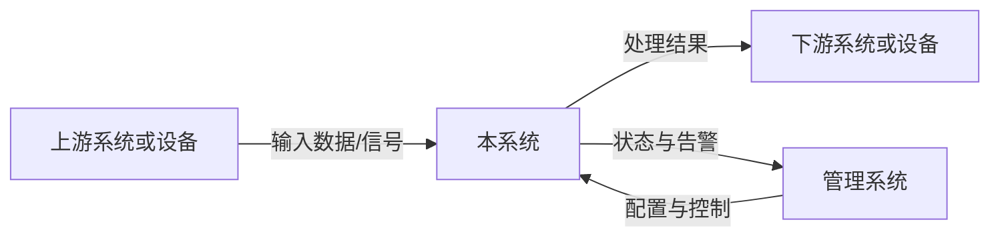
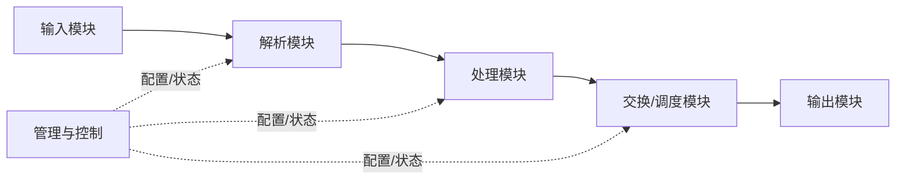
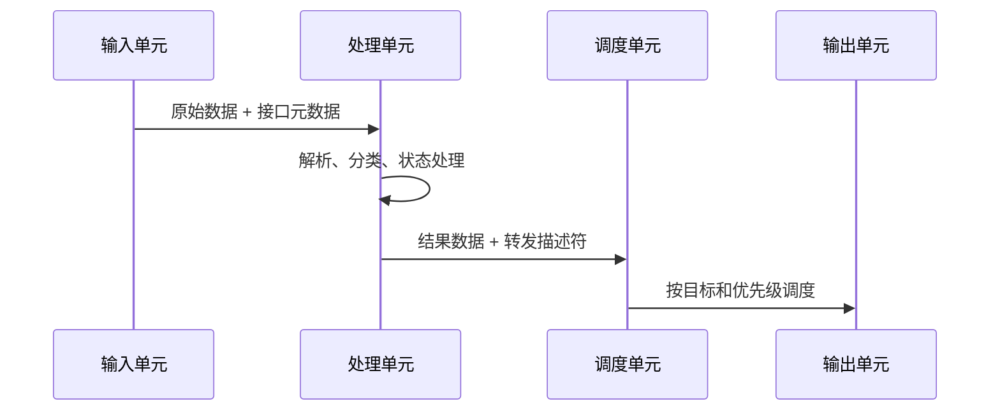

<!-- STD_DOCUMENT_COVER_BEGIN -->
# {{document_title}}

| 文档字段 | 值 |
|---|---|
| Document ID | `{{document_id}}` |
| Document Version | `{{document_version}}` |
| Status | `{{document_status}}` |
| Project | `{{project}}` |
| Authority | `{{authority}}` |
| Document Owner | {{document_owner}} |
| Authors | {{authors}} |
| Created Date | `{{created_at}}` |
| Last Modified Date | `{{last_modified_at}}` |
| Template ID | `{{template_id}}` |
| Template Version | `{{template_version}}` |
| Template Conformance | `{{template_conformance}}` |
| Tailoring Reference | {{tailoring_ref}} |
| Migration Map Reference | {{migration_map_ref}} |
| Repository | `{{source_repository}}` |
| Canonical Path | `{{source_path}}` |
| Supersedes | {{supersedes}} |

> Reviewer、Approver、Approval Date 和 Release Tag 在进入相应状态时填写。Git commit/tag 是
> 外部不可变证据；不要在文档内容中伪造包含自身的 commit hash。
<!-- STD_DOCUMENT_COVER_END -->

| 设计属性 | 值 |
|---|---|
| Design Level | `{{design_level}}` |
| Domain | `{{domain}}` |
| Visibility | `{{visibility}}` |

> 本模板用于设备、软硬件一体产品以及复杂软件系统的总体设计。正文必须让读者回答五个问题：
> 为什么做、实现什么、系统由什么组成、数据和控制如何流动、各部分怎样落地并验证。
> 每章的帮助块可在草稿期保留，正式发布前可以删除。不适用的章节写 `N/A` 并说明原因，
> 不得为了填满模板虚构实现、性能或测试证据。

## 修订记录

| Document Version | Date | Author | Change Summary | Reviewer/Approver |
|---|---|---|---|---|
| `{{document_version}}` | `{{last_modified_at}}` | {{authors}} | Initial or current revision | Pending |

## 目录、表目录与图目录

> 发布工具应根据 Markdown 标题自动生成目录。所有正式表格使用 `TABLE-<章节>-<序号>`，所有正式
> 图片和 Mermaid 图使用 `FIG-<章节>-<序号>`，并在图表下方写标题和说明；没有图或表时写 `N/A`。

- **目录**：由 Markdown 渲染器生成。
- **表目录**：列出正式表格编号、名称和所在章节。
- **图目录**：列出正式图编号、名称和所在章节。

## 1. 文档说明

编写建议、规范与示例

**本章目的**：说明本文管什么、不管什么，以及读者应如何使用本文。

**必须写清楚**：设计对象、设计层级、适用版本、目标读者、上下游文档、范围和非目标。

**编写规范**：

- 系统、子系统、板卡、服务或模块只能选择一个主要设计层级。
- 需求、接口、详细设计和测试已有独立权威文档时，只引用，不复制。
- “未来可能支持”必须与本版本承诺分开。

**抽象示例**：本文描述边缘处理设备的系统级设计，覆盖输入、处理、交换和管理路径；不定义芯片
寄存器位域，也不代替安装手册。

### 1.1 目的与读者

<!-- 说明本文帮助谁做什么决定或完成什么实现。 -->

### 1.2 范围、非目标与设计层级

<!-- 明确本文覆盖和不覆盖的内容，以及与上下游文档的边界。 -->

### 1.3 参考资料与术语

<!-- 引用需求、接口、约束、ADR 和测试文档；只定义影响理解的项目术语。 -->

## 2. 产品应用与设计目标

编写建议、规范与示例

**本章目的**：先解释真实问题和部署环境，再进入技术方案。

**必须写清楚**：谁使用、部署在哪里、上下游设备或系统是谁、输入输出是什么、不做会产生什么
影响，以及成功标准。

**编写规范**：

- 用一张环境/上下文图展示系统边界，箭头必须标注数据、命令或物理信号。
- 至少描述一种典型部署；多种组网方式要说明适用条件和差异。
- 设计目标必须可验证，不使用“高性能”“高可靠”等无阈值表述。

**抽象示例**：设备接收上游数据，执行解析、过滤和分发后输出给下游系统；设备不反向修改上游
业务。目标是支持指定输入规模，并在过载时按明确策略降级而不是静默丢失。

### 2.1 问题与业务背景

<!-- 说明为什么需要该系统、当前痛点及其影响。 -->

### 2.2 用户与使用场景

<!-- 列出角色、触发场景、期望结果和异常场景。 -->

### 2.3 应用环境与系统边界

<!-- 提供上下文图、上下游清单、信任边界、物理环境和网络/总线边界。 -->

### 2.4 设计目标与成功条件

| Goal ID | 目标 | 度量 | 目标值/边界 | 验证方式 |
|---|---|---|---|---|
| G-001 | <!-- 示例：持续处理目标负载 --> | <!-- throughput --> | <!-- 明确数值与条件 --> | <!-- 测试或分析 --> |

## 3. 功能与需求实现概览

编写建议、规范与示例

**本章目的**：直接回答“系统要实现什么”。

**必须写清楚**：功能清单、输入、处理、输出、触发条件、约束、异常行为和验收条件。

**编写规范**：

- 每项功能使用稳定 ID，并追溯到需求。
- 不只写名词；必须描述输入经过什么处理产生什么输出。
- 配置范围、容量和模式限制必须显式写出。
- 尚未实现、部分实现和计划功能分别标记，不得混写。

**抽象示例**：`F-003` 接收带有分类字段的数据单元，根据已加载规则产生转发、丢弃或进入状态管理
三类动作；规则未命中时采用明确默认动作，并产生可观测计数。

### 3.1 功能总表

| Function ID | 功能 | 用户/调用方 | 输入 | 核心处理 | 输出 | 状态 | 验收条件 |
|---|---|---|---|---|---|---|---|
| F-001 | <!-- 功能名称 --> | <!-- 角色 --> | <!-- 输入 --> | <!-- 处理 --> | <!-- 输出 --> | Planned | <!-- 可执行条件 --> |

### 3.2 功能详细说明

<!-- 对每个复杂功能重复以下结构：目的、前置条件、输入、处理步骤、输出、配置、异常、验收。 -->

#### F-XXX：功能名称

- **解决的问题**：
- **前置条件**：
- **输入与来源**：
- **处理规则**：
- **输出与去向**：
- **配置与容量边界**：
- **异常与降级**：
- **验收条件**：

### 3.3 需求追溯

| Function ID | Requirement ID | Design Section | Interface/Contract | Verification Case |
|---|---|---|---|---|
| F-001 | REQ-001 | §3.2 | IF-001 | TC-001 |

## 4. 总体结构

编写建议、规范与示例

**本章目的**：展示系统由哪些部分组成，各自为什么存在、负责什么以及如何连接。

**必须写清楚**：系统功能框图、子系统/板卡/服务清单、职责、接口方向、关键资源和实现位置。

**编写规范**：

- 图中的每个块都必须在职责表中有对应项。
- 职责必须写“负责”和“不负责”，避免多个模块拥有同一责任。
- 软件写到仓库路径和关键 symbol；硬件写到板卡、器件或 RTL block；混合系统同时提供两种映射。
- 复杂模块继续拆分；简单模块不要制造无意义层级。

**抽象示例**：输入模块完成物理接入和帧校验；处理模块完成解析与策略执行；交换模块只执行已决定的
转发结果；管理模块负责配置和观测，不进入业务数据面。

### 4.1 系统功能框图

### 4.2 组成与职责

| Block ID | 模块/单元 | 负责 | 不负责 | Provided Interface | 依赖 | 实现位置 |
|---|---|---|---|---|---|---|
| BB-001 | <!-- 名称 --> | <!-- 职责 --> | <!-- 边界 --> | <!-- 接口 --> | <!-- 依赖 --> | <!-- path/block --> |

### 4.3 物理与逻辑对应关系

<!-- 描述逻辑功能如何映射到板卡、芯片、进程、容器、服务或线程。 -->

## 5. 工作模式与端到端流程

编写建议、规范与示例

**本章目的**：回答系统在每种工作模式下怎样运行，数据和控制逐步经过哪里。

**必须写清楚**：模式选择条件、每种模式的资源拓扑、逐步数据流、状态变化、容量、限制、异常和切换。

**编写规范**：

- 先用模式矩阵比较，再为每种重要模式提供数据流图和编号步骤。
- 每一步写清发起方、接收方、数据形态、变换和失败处理。
- 模式切换是否在线、是否丢状态、是否需要重启必须明确。
- 正常流之外至少描述过载、输入异常和下游不可用。

**抽象示例**：直通模式下输入与处理单元一一对应；复制模式在调度层复制数据，分别送往独立处理单元。
两者的资源占用、输出收敛和故障影响不同，不能只用一个“支持多模式”句子概括。

### 5.1 工作模式矩阵

| Mode ID | 模式 | 适用场景 | 输入拓扑 | 处理拓扑 | 输出拓扑 | 容量/限制 | 切换条件 |
|---|---|---|---|---|---|---|---|
| MODE-01 | <!-- 名称 --> | <!-- 场景 --> | <!-- 输入 --> | <!-- 处理 --> | <!-- 输出 --> | <!-- 限制 --> | <!-- 切换 --> |

### 5.2 正常数据流

<!-- 按 1、2、3…逐步解释图中的数据、变换、状态和责任主体。 -->

### 5.3 异常、过载与恢复流程

<!-- 描述校验失败、缓存不足、处理超时、下游中断、重试、丢弃、告警和恢复。 -->

### 5.4 模式切换与状态迁移

<!-- 描述切换触发、原子性、数据面影响、状态保留和回滚。 -->

## 6. 硬件实现方案

编写建议、规范与示例

**本章目的**：说明功能如何落实到硬件组成、接口和关键器件。

**必须写清楚**：硬件架构、板间接口、时钟/复位/电源、器件选择、信号完整性、可靠性及开发平台。

**编写规范**：

- 软件项目可写 `N/A`；设备项目不能只放框图而没有接口和选型依据。
- 器件选择应关联带宽、容量、功耗、供货、生命周期和替代方案。
- 估算、仿真和实测结论必须分开标记。
- 详细原理图或 BOM 是独立 authority 时使用链接引用。

**抽象示例**：处理器件通过高速串行接口连接输入模块，通过存储接口连接外部缓存；选择结果必须满足
峰值带宽、最坏突发缓存和温度范围，而非仅写器件型号。

### 6.1 硬件架构与板卡组成

### 6.2 板间与器件接口

| IF ID | 起点 | 终点 | 类型/协议 | 宽度/速率 | 时钟/同步 | 流控 | 错误处理 |
|---|---|---|---|---|---|---|---|

### 6.3 时钟、复位、电源与信号完整性

### 6.4 器件选型与容量依据

### 6.5 硬件可靠性与开发平台

## 7. 软件实现方案

编写建议、规范与示例

**本章目的**：把系统功能落实到可实现的软件模块、进程、协议和代码位置。

**必须写清楚**：软件架构、模块职责、主要通信、状态与并发、配置、错误处理、可靠性和开发平台。

**编写规范**：

- 模块名称必须与仓库目录、package、service 或关键 symbol 对应。
- 对每个模块说明输入、输出、状态、线程/任务模型和失败传播。
- 页面型系统增加页面、路由、操作和 Loading/Empty/Error 状态。
- 不在设计文档里复制 OpenAPI/Schema；引用其路径并解释语义边界。

**抽象示例**：控制服务加载经校验的配置快照并原子发布给数据面；数据面只读快照，不直接修改配置源。

### 7.1 软件架构

### 7.2 模块设计与代码映射

| Module ID | 模块 | 职责 | 输入/输出 | 状态/并发模型 | 错误边界 | 实现路径 |
|---|---|---|---|---|---|---|

### 7.3 通信、配置与状态管理

### 7.4 页面与交互（如适用）

| Page ID | 路由 | 展示内容 | 主要操作 | Loading/Empty/Error | 后端契约 |
|---|---|---|---|---|---|

### 7.5 软件可靠性与开发平台

## 8. 可编程逻辑与专用处理单元

编写建议、规范与示例

**本章目的**：当系统包含 FPGA、ASIC、DPU、GPU 或专用加速器时，说明其内部模块和流水处理。

**必须写清楚**：内部框图、模块职责、接口位宽与时序、流水和缓存、背压、跨时钟域、资源及异常。

**编写规范**：

- 没有专用处理单元时写 `N/A`。
- 模块按数据经过的顺序描述，不只列名称。
- 数据与描述符若分离，必须写对应关系、顺序约束及重新汇合规则。
- 资源/时序结果注明工具版本、目标器件和实测或估算状态。

**抽象示例**：解析单元从宽数据总线提取字段并生成描述符；策略单元修改描述符；编辑单元依据描述符
重写数据。两条流水通过序号保持一一对应，任一路背压都会传播至共同缓存边界。

### 8.1 内部模块框图

### 8.2 模块处理说明

| Block | 输入 | 处理 | 输出 | 延迟/吞吐 | 缓存/背压 | 异常 |
|---|---|---|---|---|---|---|

### 8.3 时序、资源与跨域设计

### 8.4 开发、仿真与调试平台

## 9. 数据、描述符与存储结构

编写建议、规范与示例

**本章目的**：描述系统内部真正流动和持久化的数据，以及各阶段如何改变它。

**必须写清楚**：主要数据流、描述符/元数据、状态表、缓存与存储、字段 ownership、生命周期和容量依据。

**编写规范**：

- 用 A/B/C 等阶段点或稳定 ID 标记数据形态，和数据流图一一对应。
- 位域、Schema、IDL 已有机器权威时引用，不手工复制；本章解释设计含义和变换。
- 每个表/状态对象说明 key、value、读写者、建立、更新、老化、删除及并发规则。
- 容量计算写出公式、单位、假设和余量。

**抽象示例**：原始数据在解析阶段保持 payload 不变并附加描述符；策略阶段只更新动作字段；输出阶段
根据动作字段修改封装。状态表以流标识为 key，具有显式创建与老化条件。

### 9.1 业务数据流

| Data ID | 所在阶段 | 格式 authority | 产生者 | 消费者 | 变换 | 生命周期 |
|---|---|---|---|---|---|---|

### 9.2 描述符与元数据流

### 9.3 状态表、缓存与持久化

| Object ID | Key | Value/Schema | 读者 | 写者 | 建立/更新/删除 | 容量与一致性 |
|---|---|---|---|---|---|---|

### 9.4 容量与带宽计算

<!-- 写出公式、单位、输入来源、余量和 modeled/measured 状态。 -->

## 10. 接口与通信协议

编写建议、规范与示例

**本章目的**：定义系统内外如何交换数据和控制，并明确兼容与失败边界。

**必须写清楚**：接口清单、方向、协议、格式 authority、初始化/握手、流控、超时、错误、版本和兼容性。

**编写规范**：

- 所有跨责任边界的连接都必须有 IF ID。
- 字段级规范引用 OpenAPI、IDL、Schema、寄存器表或接口控制文档。
- 区分数据面、控制面、管理面和观测面。
- 未知字段、版本不兼容、重复请求和连接中断的行为必须定义。

**抽象示例**：控制接口接受带版本的配置快照，校验失败时拒绝整个快照；数据接口使用信用流控，耗尽时
上游停止发送并记录持续时间，不允许无声覆盖缓存。

### 10.1 接口总表

| IF ID | 类型 | 提供方 | 使用方 | 协议/总线 | 数据 authority | 超时/流控 | 版本策略 |
|---|---|---|---|---|---|---|---|

### 10.2 数据面接口

### 10.3 控制与管理接口

### 10.4 观测、调试与维护接口

## 11. 可靠性、维护与升级

编写建议、规范与示例

**本章目的**：说明故障如何被发现、隔离、恢复和维护，而不是笼统声称“高可靠”。

**必须写清楚**：故障模型、状态指示、监控告警、定位信息、恢复策略、远程维护、版本升级和回滚。

**编写规范**：

- 每类故障写检测机制、系统响应、外部表现、恢复方式和数据影响。
- watchdog、冗余、重试等机制必须写适用边界，避免恢复风暴。
- 升级说明兼容范围、状态迁移、失败回滚和不可中断条件。

**抽象示例**：处理单元无响应超过阈值后隔离该单元并停止向其调度；自动重启仅允许一次，连续失败转为
人工处置并保留诊断快照。

### 11.1 故障模型与可靠性机制

| Failure ID | 故障 | 检测 | 系统响应 | 数据影响 | 恢复 | 验证 |
|---|---|---|---|---|---|---|

### 11.2 状态指示、监控与故障定位

### 11.3 维护、升级与回滚

## 12. 性能、扩展与兼容性

编写建议、规范与示例

**本章目的**：说明容量怎样得出、瓶颈在哪里、如何扩展，以及哪些版本能够共存。

**必须写清楚**：workload、吞吐/延迟/容量、资源余量、瓶颈、扩容方式、兼容矩阵和降级行为。

**编写规范**：

- 所有性能数字必须绑定数据规模、报文/请求分布、拓扑、配置和环境。
- modeled、simulated、measured 分开，不把理论上限当作支持值。
- 扩容必须说明分片/调度方式、状态归属和故障域变化。
- 兼容性覆盖硬件修订、固件、软件、协议和数据格式。

**抽象示例**：支持值取链路、处理、存储和输出四个阶段中最小可持续能力，并保留规定余量；增加处理
单元后，调度表与状态归属必须同步扩展。

### 12.1 性能模型与预算

| Metric | Workload/Context | Modeled | Measured | Supported limit | Evidence |
|---|---|---:|---:|---:|---|

### 12.2 瓶颈与资源余量

### 12.3 扩容方案与兼容矩阵

## 13. 可测试性与验收设计

编写建议、规范与示例

**本章目的**：在设计阶段就说明如何证明功能和质量目标已经实现。

**必须写清楚**：测试接口、数据源、注入点、自检、环回、观测点、oracle、环境和接受条件。

**编写规范**：

- 每项功能、接口、工作模式、故障和质量目标至少映射一个验证项。
- 写清怎样生成输入、在哪里观察结果、什么条件算通过。
- 静态检查、仿真、实验室测试和真实环境测试分别记录。
- `NOT_RUN`、`BLOCKED` 和分析结论不得写成 `PASS`。

**抽象示例**：内部数据路径支持可控测试源与末端环回；测试读取输入/输出计数和错误状态，证明正常、
背压和故障恢复路径，不依赖人工观察单一指示灯。

### 13.1 测试支持与观测点

### 13.2 测试数据源、自检与环回

### 13.3 验证与验收矩阵

| Target ID | 测试层级 | 场景/输入 | Oracle | 环境 | Evidence | 状态 |
|---|---|---|---|---|---|---|

## 14. 结构、热、工艺与安全设计

编写建议、规范与示例

**本章目的**：覆盖设备能否安全、稳定、可制造地在目标环境运行。纯软件系统可整体写 `N/A`。

**必须写清楚**：结构与尺寸、装配维护空间、热路径、功耗、关键工艺、制造测试、安全和 EMC。

**编写规范**：

- 给出环境条件、功耗来源、热假设和验证方式。
- 关键工艺关联可制造性、良率、检测和返修。
- 安全项说明危险源、保护、失效状态和适用法规。
- “待热设计/待安规确认”必须进入风险和 Owner，不得遗漏。

**抽象示例**：风道按最坏功耗和进风温度设计；单风扇失效时系统进入降额状态并告警；关键温度点由
传感器覆盖，保护阈值与器件额定值保持安全余量。

### 14.1 结构与造型

### 14.2 功耗与热设计

### 14.3 工艺与制造测试

### 14.4 安全与电磁兼容

## 15. 实现计划

编写建议、规范与示例

**本章目的**：把设计转化为团队可以直接执行的实现顺序。

**必须写清楚**：设计元素、具体变更、文件/模块/板卡、依赖、负责人、完成条件、迁移和回滚。

**编写规范**：

- 不写“完善功能”之类无法执行的任务。
- 软件任务写真实路径和 symbol；硬件任务写设计文件、器件/板卡和交付物。
- 原型、工程样机、量产和软件发布的 Gate 分开。

**抽象示例**：先冻结内部数据契约，再实现生产者和消费者，随后接入端到端流程；契约测试通过后才能
并行开发两端。

| 顺序 | Function/Block | 变更内容 | 实现位置/交付物 | 依赖 | Owner | 完成条件 | 回滚边界 |
|---:|---|---|---|---|---|---|---|

## 16. 设计决策、风险与未决项

编写建议、规范与示例

**本章目的**：保留为什么这样设计，以及哪些问题仍可能阻止实现或发布。

**必须写清楚**：关键决策及 ADR、备选方案、风险、技术债、假设、Owner 和关闭证据。

**编写规范**：

- 决策摘要不代替 ADR；涉及重大取舍时链接独立 ADR。
- 风险写触发条件和影响，不只写标题。
- 未决项必须有负责人和最迟决策 Gate。

**抽象示例**：外部缓存位宽存在容量与时序取舍；在实现冻结前需要原型数据决定方案，未决期间不得
将任一方案写成已批准基线。

### 16.1 设计决策

| ADR/Decision | 决定 | 备选方案 | 理由 | 状态 | 影响范围 |
|---|---|---|---|---|---|

### 16.2 风险、技术债与未决项

| ID | 类型 | 描述与触发条件 | 影响 | 缓解/下一步 | Owner | 关闭证据/Gate |
|---|---|---|---|---|---|---|
