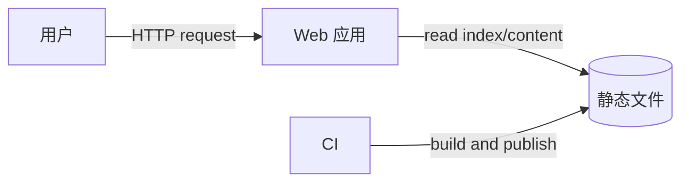
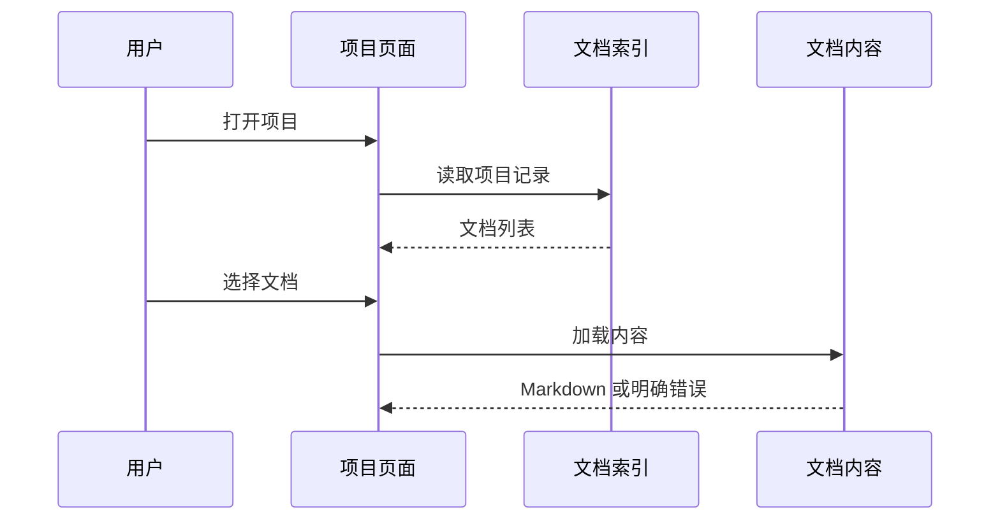

<!-- STD_DOCUMENT_COVER_BEGIN -->
# {{document_title}}

| 文档字段 | 值 |
|---|---|
| Document ID | `{{document_id}}` |
| Document Version | `{{document_version}}` |
| Status | `{{document_status}}` |
| Project | `{{project}}` |
| Authority | `{{authority}}` |
| Document Owner | {{document_owner}} |
| Authors | {{authors}} |
| Created Date | `{{created_at}}` |
| Last Modified Date | `{{last_modified_at}}` |
| Template ID | `{{template_id}}` |
| Template Version | `{{template_version}}` |
| Template Conformance | `{{template_conformance}}` |
| Tailoring Reference | {{tailoring_ref}} |
| Migration Map Reference | {{migration_map_ref}} |
| Repository | `{{source_repository}}` |
| Canonical Path | `{{source_path}}` |
| Supersedes | {{supersedes}} |

> Reviewer、Approver、Approval Date 和 Release Tag 在进入相应状态时填写。Git commit/tag 是
> 外部不可变证据；不要在文档内容中伪造包含自身的 commit hash。
<!-- STD_DOCUMENT_COVER_END -->

> 本模板采用 arc42 v9.0 的十二章结构，并为每章补充 STD 编写建议和示例。帮助内容可在草稿期
> 保留，正式发布前可删除。章节不适用时写 `N/A` 和理由，不要为了填满模板虚构内容。
> 上游结构与说明见 [arc42 官方模板概览](https://arc42.org/overview/)；STD 的改编和许可证说明
> 见 `THIRD_PARTY_NOTICES.md`。

## 1. Introduction and Goals（引言与目标）

编写建议、规范与示例

**本节目的**：让第一次接触项目的人知道为什么做、谁使用、实现什么，以及怎样算成功。

**必须回答**：

- 当前具体问题是什么，不解决会怎样？
- 用户或调用方是谁？
- 系统提供哪些可观察功能？
- 最重要的质量目标和成功条件是什么？

**编写建议**：先写问题和结果，再写技术。功能使用稳定 ID，并给出输入、输出和验收条件。

**示例**：

| Function ID | 用户 | 场景 | 系统行为 | 可观察结果 | 验收条件 |
|---|---|---|---|---|---|
| F-001 | 访客 | 打开项目 | 加载项目文档索引 | 显示可见文档列表 | 两次点击内打开任一当前文档 |

### 1.1 问题与背景

<!-- 在此填写当前问题、影响和为什么现在需要解决。 -->

### 1.2 用户、场景与功能

<!-- 在此填写用户、使用场景和带验收条件的功能清单。 -->

### 1.3 质量目标

<!-- 只列最重要、可衡量且会影响架构的目标。 -->

## 2. Architecture Constraints（架构约束）

编写建议、规范与示例

**本节目的**：记录设计不能自由选择的边界。

**必须回答**：有哪些技术、组织、法规、硬件、成本、时间和兼容性约束？哪些是假设？

**编写建议**：约束必须说明来源和影响；偏好不是约束。尚未证实的内容标记为假设。

**示例**：

| ID | 约束 | 来源 | 对设计的影响 | 可否变更 |
|---|---|---|---|---|
| CON-001 | 必须部署为静态站点 | 产品决定 | 无服务端数据库和登录状态 | 需产品 Owner 批准 |

<!-- 在此填写约束表和关键假设。 -->

## 3. Context and Scope（上下文与范围）

编写建议、规范与示例

**本节目的**：画清系统内外边界，避免责任扩张或遗漏依赖。

**必须回答**：系统负责什么、不负责什么？谁向它输入什么？它向谁输出什么？信任边界在哪里？

**编写建议**：箭头必须标注传递的数据、命令或物理信号。分别描述业务上下文和技术上下文。

**示例**：

| 外部参与方 | 输入到本系统 | 从本系统获得 | 契约/协议 | 失败影响 |
|---|---|---|---|---|
| CI | Markdown 和配置 | 静态产物 | build command | 保留上一成功版本 |

### 3.1 Scope 与 Non-goals

<!-- 明确范围内、范围外和原因。 -->

### 3.2 Business Context

<!-- 说明用户、业务系统和业务信息交换。 -->

### 3.3 Technical Context

<!-- 说明协议、文件、事件、设备或物理连接。 -->

## 4. Solution Strategy（解决方案策略）

编写建议、规范与示例

**本节目的**：用短篇幅说明整体怎样解决问题，以及为什么选择这条路线。

**必须回答**：核心方案是什么？关键技术和分解原则是什么？哪些备选方案被放弃，为什么？

**编写建议**：本节只写最重要的决定，详细取舍链接 ADR。每项策略应能追溯到目标或约束。

**示例**：采用构建时生成索引的静态架构，因为 CON-001 禁止服务端状态；全文搜索在浏览器内完成。

<!-- 在此总结解决方案、关键技术选择、分解原则和主要取舍。 -->

## 5. Building Block View（构建块视图）

编写建议、规范与示例

**本节目的**：把系统分解为可以分工和实现的组件，并映射到真实代码。

**必须回答**：有哪些组件？各自负责/不负责什么？调用方向是什么？代码在哪里？

**编写建议**：从 Level 1 全景开始，只对复杂组件继续展开。名称应与代码目录、服务或 RTL block 一致。

**示例**：

| ID | Building Block | 职责 | Provided interface | 依赖 | 实现位置 |
|---|---|---|---|---|---|
| BB-01 | Index Builder | 扫描内容并生成索引 | `index.json` | Markdown parser | `src/build-index.ts` |

### 5.1 Level 1：系统分解

<!-- 在此填写组件图、职责表和真实实现路径。 -->

### 5.2 Level 2+：关键组件内部

<!-- 只展开需要独立解释的复杂组件；简单组件可写 N/A。 -->

## 6. Runtime View（运行时视图）

编写建议、规范与示例

**本节目的**：展示用户操作或系统事件发生后，数据和控制如何端到端流动。

**必须回答**：入口是什么？每一步由谁处理？数据如何变化？成功、空状态、失败和恢复分别怎样？

**编写建议**：至少描述最重要的正常流程和一个失败流程。每一步关联接口、状态变化和 timeout。

**页面型系统还必须填写**：页面、路由、主要操作、Loading/Empty/Error 状态和跳转关系。

**示例**：

| Page ID | 路由 | 内容 | 操作 | Loading/Empty/Error | 跳转 |
|---|---|---|---|---|---|
| UI-01 | `/projects/:id` | 项目摘要和文档列表 | 筛选、打开 | skeleton/空列表/错误提示 | `/docs/:id` |

### 6.1 页面与交互

<!-- 有 UI 时填写页面清单和操作流；无 UI 写 N/A 及原因。 -->

### 6.2 正常端到端流程

<!-- 在此填写 sequence 和逐步数据变化。 -->

### 6.3 失败、并发与恢复流程

<!-- 覆盖 timeout、重复、取消、部分失败和恢复。 -->

## 7. Deployment View（部署视图）

编写建议、规范与示例

**本节目的**：说明软件、数据和设备实际运行在哪里，以及环境和故障域怎样影响设计。

**必须回答**：进程/容器/板卡落点、网络或总线、持久化、配置来源、环境差异、扩缩容和故障域。

**编写建议**：使用真实部署名称和端口/协议；开发、测试、生产差异要显式列出。

**示例**：

| Artifact/Process | Node/Device | Network/Bus | Config | Persistent data | Failure domain |
|---|---|---|---|---|---|
| Static bundle | CDN | HTTPS | build-time | none | region |

<!-- 在此填写部署图、环境差异和容量/资源边界。 -->

## 8. Cross-cutting Concepts（横切概念）

编写建议、规范与示例

**本节目的**：集中说明多个组件都必须一致遵循的实现规则。

**必须回答**：数据模型、身份权限、错误、日志、配置、并发、持久化、兼容性和测试策略如何统一？

**编写建议**：只写跨多个组件的规则；单一组件细节留在其设计中。字段级定义引用机器契约。

**示例**：

| Concept | 统一规则 | Enforcement | 实现/契约位置 |
|---|---|---|---|
| Error handling | API 只返回 typed error；日志文本不作为机器状态 | middleware + contract test | `src/errors.ts` |

### 8.1 数据模型、状态与存储

<!-- 说明实体、ownership、读写者、生命周期和迁移。 -->

### 8.2 接口、错误与兼容性

<!-- 引用 OpenAPI、Schema、IDL、ABI、CSR 等机器权威。 -->

### 8.3 安全、可观测性与运维规则

<!-- 说明身份传播、权限、敏感数据、日志、metric、trace 和恢复原则。 -->

## 9. Architecture Decisions（架构决策）

编写建议、规范与示例

**本节目的**：让后来者知道重要选择为什么形成，而不只是看到最终结构。

**必须回答**：哪些决定显著影响成本、边界、兼容性、可靠性或后续实现？

**编写建议**：这里只放摘要和 ADR 链接，不复制完整 ADR。尚未决定的项目写 Owner 和截止点。

**示例**：

| ADR | 决定 | 状态 | 影响范围 |
|---|---|---|---|
| ADR-004 | 采用静态生成而不是运行时数据库 | Accepted | build、部署、搜索 |

<!-- 在此填写决定索引和仍待决定的问题。 -->

## 10. Quality Requirements（质量要求）

编写建议、规范与示例

**本节目的**：把“快、稳定、安全、易维护”等模糊目标变成可以验证的场景。

**必须回答**：在什么条件下，由什么事件触发，系统应在多长时间或什么限制内作出什么响应？

**编写建议**：必须给 workload、环境、度量和阈值；估算、模拟与实测分开。

**示例**：

| ID | 场景/负载 | 期望响应 | 度量与阈值 | 验证方法 |
|---|---|---|---|---|
| QR-01 | 1,000 篇文档冷启动 | 项目页可交互 | p95 < 2 s，测试网络条件固定 | browser benchmark |

<!-- 在此填写质量树和可测量质量场景。 -->

## 11. Risks and Technical Debt（风险与技术债）

编写建议、规范与示例

**本节目的**：公开可能使实现或上线失败的问题，避免把未知项包装成完成。

**必须回答**：风险是什么、触发条件是什么、影响多大、谁负责、如何缓解、什么证据能关闭？

**示例**：

| ID | 风险/债务 | 触发条件与影响 | 缓解措施 | Owner | 关闭证据 |
|---|---|---|---|---|---|
| R-01 | 浏览器索引过大 | 文档超过 10k 时内存上升 | 分片或预过滤 | Web Owner | 规模测试通过 |

<!-- 在此填写风险、技术债和外部依赖。 -->

## 12. Glossary（术语表）

编写建议、规范与示例

**本节目的**：统一项目特有词汇，避免同一个词被不同角色理解成不同含义。

**编写建议**：只收录会影响设计理解的术语；缩写首次出现仍需展开。不要复制通用词典。

**示例**：

| Term | Definition | Not the same as |
|---|---|---|
| Current document | 当前 authority 接受并纳入索引的文档 | Git 中任意历史文档 |

<!-- 在此填写术语、缩写及容易混淆的反例。 -->

## Implementation Plan（实现计划，STD 补充）

编写建议、规范与示例

arc42 用于描述架构；STD 额外要求把已批准设计落到实现任务。每项任务必须有真实路径、依赖和
完成条件，不能只写“实现后端”或“完善页面”。

| 顺序 | 功能/设计元素 | 变更 | 新增/修改路径 | 关键 symbol | 依赖 | 完成条件 |
|---:|---|---|---|---|---|---|
| 1 | F-001 / BB-01 | 生成文档索引 | `src/build-index.ts` | `buildIndex()` | Schema | fixture tests pass |
| 2 | UI-01 | 实现项目页面 | `src/pages/project.tsx` | `ProjectPage` | 任务 1 | loading/empty/error tests pass |

<!-- 在此填写已批准的实现顺序、文件清单、迁移和回滚边界。 -->

## Verification and Acceptance（验证与验收，STD 补充）

编写建议、规范与示例

把功能、质量目标和风险映射到可执行测试。`NOT_RUN`、`BLOCKED` 和静态检查不得冒充 runtime PASS。

| Function/Quality/Risk | 测试层级 | 场景 | Oracle | Evidence | 状态 |
|---|---|---|---|---|---|
| F-001 | UI | 有数据、空数据、加载失败 | 页面状态符合设计 | CI report | Planned |
| QR-01 | performance | 1,000 docs cold load | p95 < 2 s | benchmark | NOT_RUN |

<!-- 在此填写验证矩阵和接受条件。 -->
