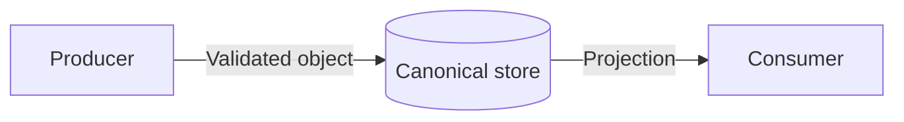

<!-- STD_DOCUMENT_COVER_BEGIN -->
# {{document_title}}

> STD 使用入口：[STD 主说明与执行流程](../../README.md)。这是工程文档标准模板；作者先读入口，再按项目已采用版本读取适用规范和专项指南。

| 文档字段 | 值 |
|---|---|
| Document ID | `{{document_id}}` |
| Document Version | `{{document_version}}` |
| Status | `{{document_status}}` |
| Project | `{{project}}` |
| Authority | `{{authority}}` |
| Document Owner | {{document_owner}} |
| Authors | {{authors}} |
| Created Date | `{{created_at}}` |
| Last Modified Date | `{{last_modified_at}}` |
| Template ID | `{{template_id}}` |
| Template Version | `{{template_version}}` |
| Template Conformance | `{{template_conformance}}` |
| Tailoring Reference | {{tailoring_ref}} |
| Migration Map Reference | {{migration_map_ref}} |
| Repository | `{{source_repository}}` |
| Canonical Path | `{{source_path}}` |
| Supersedes | {{supersedes}} |

> Reviewer、Approver、Approval Date 和 Release Tag 在进入相应状态时填写。Git commit/tag 是
> 外部不可变证据；不要在文档内容中伪造包含自身的 commit hash。
<!-- STD_DOCUMENT_COVER_END -->

<!--
编写建议：本模板解释数据的业务语义和 ownership；字段类型的机器权威仍是 Schema/IDL。
至少为关键对象给出一条合法示例和一条非法示例。示例值提交前必须替换。
编写规范见 docs/design-writing-guide.md。
-->

## 1. 用途、范围与 authority

说明谁生产和消费这些数据、解决什么歧义，以及对应机器契约的位置。

## 2. 命名、单位与通用规则

| Rule | Requirement | Example |
|---|---|---|
| 时间 | ISO 8601 UTC | `2026-09-09T08:30:00Z` |
| 容量 | 明确 SI 或 binary unit | `512 GiB` |
| ID | 稳定、不可复用 | `doc_01H...` |

## 3. Entity / Object Catalog

<!-- 编写建议：本节列全本文负责解释的 Data/Type ID、对象边界、提供/消费方及唯一机器源；§4 逐字段写类型、必填/可空、范围/单位、枚举、条件有效性与含义，§5 列每个状态和错误值及未知值行为，§6–§9 说明身份、关系、编码与寿命。本文是字段阅读视图，不拥有操作接口；接口按成员 ID 引用本类型，不在词典里另定签名。 -->

| ID | Name | Owner | Lifecycle | Persistence | Schema source |
|---|---|---|---|---|---|
| <!-- TODO --> | | | | | |

依 `docs/interface-data-mapping-standard.md` 绑定类型成员 ID、固定源和可达 selector；共享类型引用原 ID，不在两个模块重定义。正文保留生成或核对的完整字段视图，目录只作索引。

| 类型成员 ID / 基线 | 机器源 / selector | 正文稳定锚点 | 原类型引用 / 投影/转换 / 损失补足 |
|---|---|---|---|

## 4. Field Dictionary

| 类型成员 ID.Field/原字段号 | Type/位宽/引用 | Required/null/条件有效 | Unit/Encoding/大小/计数 | Range/枚举/跨字段约束 | Default | Meaning |
|---|---|---|---|---|---|---|
| <!-- TODO --> | | | | | | |

## 5. Enum、Status 与 Error Values

<!-- 编写建议：系统公共错误逐码引用系统设计 Error ID、代码值、机器源和调用方动作；本节可解释数据字典视图，但不能改变系统定义。对每个枚举列出合法值、保留值、未知值处理和兼容边界。 -->

| Type | Value | Meaning | Producer | Consumer behavior for unknown value |
|---|---|---|---|---|
| DocumentStatus | `approved` | 已通过 authority 批准 | Review workflow | display as current |

## 6. Identity、Key、Reference 与 Ownership

说明主键、外键、幂等键、租户/项目 scope 和唯一写入 authority。

## 7. 数据关系与数据流



| Data | Producer | Validation | Store/Transport | Consumer | Derived output |
|---|---|---|---|---|---|
| <!-- TODO --> | | | | | |

## 8. Serialization、Alignment、Endianness 与 Compatibility

逻辑位宽、序列化长度、Host sizeof 与 wire offset 分开；实际 ABI 才给端序、padding/reserved、校验覆盖。可变数组给计数来源、边界及溢出处理，不能用 sizeof 代替序列化规格。

## 9. Persistence、Retention、Migration 与 Deletion

## 10. Validation 与 Examples

合法示例：

```json
{"id":"doc_01H...","status":"approved"}
```

非法示例及预期错误：

```json
{"id":"","status":"unknown-value"}
```

| Example/Test | Valid/Invalid | Expected result | Machine source |
|---|---|---|---|
| minimal valid | Valid | accepted | `fixtures/document.valid.json` |
| unknown status | Invalid | `ERR_STATUS` | `fixtures/document.invalid.json` |

## 11. 实现映射与变更计划

| Data/Schema | Source path | Generated type/code | Migration | Test |
|---|---|---|---|---|
| <!-- TODO --> | | | | |
