<!-- STD_DOCUMENT_COVER_BEGIN -->
# {{document_title}}

> STD 使用入口：[STD 主说明与执行流程](../../README.md)。这是工程文档标准模板；作者先读入口，再按项目已采用版本读取适用规范和专项指南。

| 文档字段 | 值 |
|---|---|
| Document ID | `{{document_id}}` |
| Document Version | `{{document_version}}` |
| Status | `{{document_status}}` |
| Project | `{{project}}` |
| Document Owner | {{document_owner}} |
| Last Modified Date | `{{last_modified_at}}` |
| Template ID | `{{template_id}}` |
| Template Version | `{{template_version}}` |

<!-- STD_DOCUMENT_COVER_END -->

## 1. 单元摘要：为什么存在

<details>
<summary>本节编写建议、规范与示例</summary>

本模板为《软件模块设计说明书》，沿用 Template ID `design.definition`，适用于软件系统或软件子系统下的模块详细设计。内部函数、类和算法是实现组织，不自动新增正式模块层级；模块也不必等同于一个类、进程或部署服务。固件/RTL、板卡/电路采用专项模板，旧版通用单元实例继续按已采用基线维护，不自动迁移。

保留 15 个主章，在现有章节内解决设计问题。每节围绕“具体问题 → 采用方案及依据 → 代表输入与失败推演 → 实现和验证承接”形成连续正文，表格只汇总结论。采用已有决定时核查后落实，不要求制造新方案。关键行为未知时先预设计，不能以“负责处理”“保证一致性”或待办清单充当设计完成。

正文与编写过程隔离：用户编辑指令、绘图要求、生成过程、修改经过和模板执行说明只留在编写/评审记录；正式正文描述产品和选定设计。逐段检查是在讲模块还是作者如何写作，特别复查图注、章节开头和新增段落。明确的编辑/生成残留是质量评审阻断项；不要关键词禁用“本图”，必要图例与边界说明应保留。帮助块与教学例子不得充作项目正文。

图明确 Current / Target / Transitional，能力的实现与验证状态分开；数值写明单位、范围、条件及 Modeled / Simulated / Measured。混合状态有图例，不能把 Planned 对象画成当前已部署。条件章节不适用时写责任边界及 tailoring 依据，不为模板新增队列、缓存、UI、重试或升级机制。

条件章节按已写明的模块事实触发，而非由作者任意挑选：§3 登记常驻服务或端点宿主时，§5.4 与 §10 必须交代启动、就绪、停止和在途请求；§6 出现跨步骤状态、队列或取消时，§6.6 与 §10 必须给出状态转换、不变量和并发出口；§6.7 出现本模块写入的持久表时，§10 必须交代事务提交点、崩溃恢复与重放边界。没有这些事实才可按实际边界写 N/A，并给出来源和 tailoring/Decision 依据；“无共享可变状态”不能替代对已登记运行状态的分析。

共同方法见 `docs/design-writing-guide.md`、`docs/ai-authoring-guide.md` 与 `docs/ai-guides/unit-design.md`；接口遵循 `docs/interface-data-mapping-standard.md`。

本模板统一采用“记录型 → 固定格式段落；矩阵型 → 表格”：一项功能、约束、操作面、依赖、数据、
规则、接口、失败、容量、验证或未决问题是独立多字段记录时，按对应章节的固定字段逐项写；只有
需要横向比较多行短值、表示状态转换或映射关系时才用表格。不能把长签名、路径、错误语义或验收
条件压缩进宽表；同一类记录不得混用两种形式。

**本节目的**：让读者先理解软件模块承担的实际处理，而不是先读一串职责、类名或源码路径。

**必须写清楚**：模块对象 ID、直属父对象与父文档、使用场景、输入和输出、主要处理原理、非目标及适用版本/配置。用一段自包含说明贯通一次调用，再用摘要表归纳。

**编写规范**：软件总体方案与跨模块政策从父设计承接，本模块决定内部怎样实现。摘要不写索引式“详见各模块”；架构在 §5 展开，不能到实现任务末尾才首次出现。

按 `docs/software-object-identifiers.md` 从父设计登记表继承模块编号、正式英文名称和直属父对象，不能写作时自行另编。正式组件在图中使用“英文名称（稳定编号）”，正文和接口/验证引用同一身份；Document ID 与对象编号分开。新建文档默认文件名为 `<name>-design.md`、Document ID 为稳定的 `<name>`，最终取值必须由父设计对象登记表唯一关联到 `Mxxx`，重命名文件不改变已采用的 Document ID。内部 I1/I2 仅为本模块作用域内的实现标识，不申请正式模块编号；旧项目只按明确采用的范围迁移。

**抽象示例**：文末 EX-MODULE/v1 的目录筛选器接受内存记录与类别，返回确定顺序的记录 ID，不读数据库、不负责网络重试。STD 仓库 `demo/llmtier-module-design/` 中经授权的 M001/M002 真实写作样板分别展示服务端点与浏览器页面操作面；它们保留项目 authority 和 Draft 状态，只能参考表达方法。实际项目须采用自己的输入，不照抄案例能力。

**完成条件**：新读者仅看本节就能说明什么时候调用、做什么、得到什么及不负责什么；可从 §5 找到内部方案，而不是只能从链接反猜用途。

</details>

<!-- 在此写入本节设计正文；图表汇总结论，不替代方案与依据。 -->

| 项目 | 内容 |
|---|---|
| 模块编号 / 正式英文名称 | <!-- TODO --> |
| 直属父对象编号 / 名称 | <!-- TODO --> |
| 父设计 Document ID / 固定基线 / 登记位置 | <!-- TODO --> |
| 上级系统/父单元 | <!-- TODO --> |
| 解决的问题 | <!-- TODO --> |
| 提供的能力 | <!-- TODO --> |
| 主要使用者 | <!-- TODO --> |
| 不负责 | <!-- TODO --> |

### 1.1 继承的上级约束与落实方式

<details>
<summary>本节编写建议、规范与示例</summary>

**本节目的**：把父单元或系统已经决定的输入固定下来，使本单元在明确边界内设计，不重新
决定系统级政策，也不因分层丢失总体预算和行为保证。

**必须写清楚**：上级 Document ID/版本或提交、Constraint ID、决定状态、适用条件、继承的
预算或行为保证、本单元可自行选择的范围、落实位置、再分配、验证和不满足时的反馈。

**编写规范**：逐项接收影响本单元功能、接口、状态、资源、安全、维护或制造的上级约束，
沿用原 ID 并固定输入基线，以来源文档与约束 ID 联合定位；细分新约束时关联父约束，不复用
同一 ID 表示不同要求。只保留理解要求必需的语义和分配值，契约字段引用唯一机器定义。
标明上级是已批准决定还是拟议输入，承接拟议输入不使它自动获批；确无父单元约束时说明独立
责任边界及直接需求来源，不能用 N/A 隐藏缺失输入。遇到冲突或缺少关键值时，提出具体差距、
选项和影响，请原决定责任方裁决，不擅自放宽上限或改变超限、重试和失败政策。

把每项约束连接到本单元的结构、流程、预算或验证；继续分解时分配给内部单元，保留公共开销
及余量，不把同一总预算重复交给每个模块。共享资源、模式、并发、峰值和行为前提按同一口径
组合校核，将结果或未决项回传上级。验证区分设计分析、实现检查和实测，局部通过不代替系统
组合验证。上级变化只在项目明确采用该变更后重新评估，不自动追随未锁定的新文档。

**抽象示例**：虚构上级拟议约束 `CON-MEM-01` 给校验单元单任务峰值 24 MiB，包含索引和候选
记录。单元可以选择索引算法，但不能把溢出的对象移到“公共内存”规避计账，也不能跳过唯一性
检查。设计在容量节给出相同输入上限下的峰值推导，测试验证超限时整批失败而非部分发布。
若发现无法满足，报告差额和压缩、限制输入等选项，等待系统责任方决定，不自行改成 32 MiB。
这里是拟议设计示例，不是任何产品预算或通过证据。

**完成条件**：每项继承约束能追到固定来源、适用状态和本地落实/验证，自由度与禁止变更的
边界清楚；再分配可组合，差距已反馈且未被标为满足，系统无需从实现细节反猜本单元是否承接。

</details>

<!-- 在此写入本节设计正文；图表汇总结论，不替代方案与依据。 -->

<!-- 约束是独立多字段记录，逐项使用固定格式段落，不改成七列宽表。 -->

#### 1.1.N `<Constraint ID>` · <约束名称>

<!-- 编写建议：逐条引用上级固定约束和版本，写出本模块的落实位置、预算份额、不能改变的行为、可自行设计的范围及验证入口。若上级预算未分配，不要自拟“满足系统要求”，应登记阻断与反馈路径。 -->

- **上级基线与决定状态**

  <!-- TODO -->
- **适用条件**

  <!-- TODO -->
- **继承预算或行为保证**

  <!-- TODO -->
- **可自行选择/不可改变**

  <!-- TODO -->
- **本地落实/内部再分配**

  <!-- TODO -->
- **验证方法与结果/证据**

  <!-- TODO / NOT_RUN -->
- **差距/变更影响/反馈责任**

  <!-- TODO / none -->

<!-- 记录后解释主要约束如何组合满足上级输入，定位正文和证据；不要复制完整系统设计或机器契约。 -->

## 2. 需求、功能与验收条件

<details>
<summary>本节编写建议、规范与示例</summary>

**本节目的**：把父级分配转换为本模块可以判断对错的行为，先确定处理语义再选择实现。

**必须写清楚**：每项功能的真实调用者、输入前提、正常输出、边界与错误，以及 Function ID 与上级需求/Constraint ID 的关系。解释主要功能怎样组合，哪些在模块外完成。

**编写规范**：验收条件必须可用具体输入判定，不能只写“正确、高效、支持扩展”。空输入、非法输入和依赖失败分别定义，成功与错误不能混用。行为在本章或相应规则章唯一维护，避免多处重复造成歧义。功能是包含长句的多字段独立记录，统一使用下方固定格式段落，不压进七列宽表。

**抽象示例**：筛选器空输入返回空 ID 列表；重复 ID 是整批非法输入，即使重复项不匹配类别也拒绝，不能悄悄丢弃后声称成功。

**完成条件**：实现者不需自己决定外部可观察的边界行为，测试者可以给出独立预期结果；未定语义明确记为设计缺口。

</details>

<!-- 在此按以下固定字段逐项写入；同类功能保持字段名和顺序一致。 -->

### 2.N `F-<MODULE>-<NAME>` · <功能名称>

<!-- 编写建议：一个用户可感知或对外可观察的功能单独成节，先描述触发场景、输入和前提，再描述行为、互斥输出、错误与验收判据。用具体例子检查功能边界，不把“负责处理请求”当功能规格；功能 ID 应能一路追到接口、过程和 V/Case。 -->

- **上级需求 / Constraint ID**

  <!-- TODO -->
- **调用方**

  <!-- TODO -->
- **输入与前提**

  <!-- TODO -->
- **行为**

  <!-- TODO -->
- **输出**

  <!-- TODO -->
- **错误与边界**

  <!-- TODO -->
- **验收条件**

  <!-- TODO -->

## 3. UI、CLI、服务端点或设备操作面

<details>
<summary>本节编写建议、规范与示例</summary>

**本节目的**：明确模块实际拥有的交互或服务入口，不重复上层产品界面，也不为纯库虚构页面、命令或端点。

**必须写清楚**：适用时说明谁在什么位置、以什么身份对哪个对象执行操作，输入校验、结果/错误展示、取消和可用条件。服务端点型模块在本节把 HTTP/RPC 端点集定义为操作面，用 Surface ID 组织端点族、调用者、认证、输入、结果和错误；这不等同于拥有 UI/CLI。设备操作面仅指本软件提供的入口，不在这里重订电气或寄存器契约。

**编写规范**：入口到 §9 接口可追踪，权限和错误不因入口而改变。UI 页面、CLI 命令、HTTP/RPC 端点集和设备操作面按实际类型分别记录；模块没有任何直接操作面时写 `N/A + 实际调用入口/归属 + tailoring 依据`，不能把“没有页面”误写成没有 API。非本模块责任写实际归属及裁剪依据，维护专用入口的行为在 §11 唯一展开。本章不是页面布局或绘图指令。

**抽象示例**：HTTP API 模块可将 `/v1/*`、`/health` 分别登记为业务与健康 Surface；目录筛选器仅被现有应用函数调用，没有独立 UI/CLI/服务端点，上层如何显示空列表不是模块新增交互能力的理由。

**完成条件**：每个入口都有执行位置、对象和结果，或有明确的不适用边界；不能只看到命令名称却不知道如何调用。

</details>

<!-- 在此写入本节设计正文；图表汇总结论，不替代方案与依据。 -->

<!-- 操作面是独立多字段记录，逐项使用固定格式段落。 -->

#### 3.N `<Surface ID>` · <操作面名称>

<!-- 编写建议：按真实 UI 页面、CLI 命令、HTTP/RPC 端点或设备操作面记录，写清使用者何时触发、权限、输入、反馈、失败提示及取消行为。无操作面时说明由哪个上级入口承接，不为内部 helper 虚构界面。 -->

- **类型 / 位置**

  <!-- UI 页面 / CLI / HTTP-RPC 端点集 / 设备操作面；执行位置 -->
- **调用者 / 身份 / 被操作对象**

  <!-- TODO -->
- **操作与入口**

  <!-- TODO -->
- **输入与校验**

  <!-- TODO -->
- **正常结果 / 可见性**

  <!-- TODO -->
- **Empty / Error / Disabled / 取消**

  <!-- TODO -->
- **§9 接口与 §11 维护引用**

  <!-- TODO -->

## 4. 外部边界与依赖

<details>
<summary>本节编写建议、规范与示例</summary>

**本节目的**：确定模块与调用方、被调用方及运行环境的交接条件，使内部设计建立在真实依赖上。

**必须写清楚**：唯一接口来源、同步/异步方式、对象有效期、身份/配置来源、可用性及失败影响。附模块上下文图，标出输入来源、输出去向和责任边界；不是重复完整产品应用环境。

**编写规范**：业务 Owner 与运行时执行者分开，进程、线程及调用栈不得由组件框推导。普通语言运行库按版本和限制归组，不枚举无关内部结构。接口细节在 §9 维护，本章解释为何依赖及失效责任。

**抽象示例**：筛选器依赖调用者在调用期间保持输入不可变；若实际 API 不能保证，应选择受控复制或其他已授权措施，不能只在图里画“快照”便认为成立。

**完成条件**：沿上下文图可以找到每次交接的前提和错误责任，没有隐含新增服务，也不要求接收方猜测数据来源。

</details>

<!-- STD_TEMPLATE_EXAMPLE_BEGIN -->
**上下文图例：模块在调用环境中的位置**

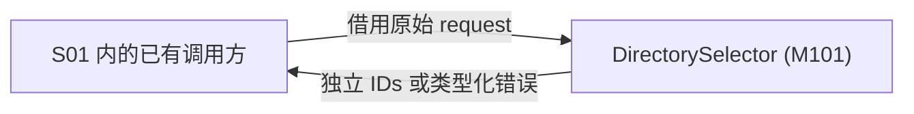

图 M-C1 · EX-MODULE/v1 · Target / Planned / NOT_RUN。实线表示同步函数入参和返回，不是网络或新部署边界。
S01 的已有调用方拥有 request 及 records；M101 借用只读输入并产生独立 IDs 或类型化错误。调用方保持输入及字段不可变直至返回。
内部文件结构见 §5，过程见 §7；本图只展示模块外部交接，不代替完整产品应用环境。
<!-- STD_TEMPLATE_EXAMPLE_END -->

<!-- 在此写入本节设计正文；图表汇总结论，不替代方案与依据。 -->

<!-- 外部依赖是独立多字段记录，逐项使用固定格式段落。 -->

#### 4.N `<Dependency ID>` · <依赖或参与方名称>

<!-- 编写建议：区分上游提供的公共契约、本模块直接依赖和可替代依赖，写清所需保证、故障域、超时、初始化顺序和失效时本模块的行为。只记录设计所需的边界，不维护所有调用方的反向名单。 -->

- **角色 / 运行位置 / Owner**

  <!-- TODO -->
- **本模块调用或消费**

  <!-- TODO -->
- **本模块提供**

  <!-- TODO -->
- **契约 authority / 版本 / selector**

  <!-- TODO -->
- **同步方式 / timeout / 生命周期**

  <!-- TODO -->
- **不可用或失败影响 / 责任出口**

  <!-- TODO -->

## 5. 内部结构与实现位置

<details>
<summary>本节编写建议、规范与示例</summary>

**本节目的**：给出实现者可以采用的内部组织和取舍，不能只把上级职责换成几个类名。

**必须写清楚**：内部组成图、各内部对象处理什么、如何调用/交接、为什么这样拆分；入口到核心处理的路径及实现文件/symbol。图后逐个解释处理与协作，再用表汇总。包含、同步调用、异步消息与共享访问用图例区分。

图中以正式英文组件名或实际 symbol 为主要名称，内部标识辅助定位，不能以中文职责替代组件身份。图后按图中组成顺序逐个展开职责、输入、处理、输出和协作；有实际分层时按“层 → 内部组件”组织，无分层时不强套层次。表格与文件列表不能代替这些说明。

**编写规范**：不强制套 Entry/Service/Repository 分层。可以是少量函数而非微服务，组件数由处理和状态边界决定。说明方案与替代方案的实际代价；既有方案足够时说明依据，不凑虚假选项。计划路径明确 Planned/NOT_IMPLEMENTED，不伪称存在。

模块设计已接近实现，图的粒度须下沉到实际内部组件、函数/文件、数据对象、调用参数与判断动作，
而不是重复上级系统的职责框。结构图、数据结构/寿命图、调用时序、过程及算法图各表达一种关系；
在对应章节就地给出，不只把图集中放在附录。数量随实际关系增加，不为凑图新增实现对象。

模块由多个内部子模块、类或代码文件组成时，必须用结构图表达模块边界、内部组成及主要依赖，
并映射到文件/symbol。这里的内部子模块是实现分解，不自动增加正式设计层级，也不要求每个另写设计文档。
逻辑组件与文件不必一一对应：一个组件可跨文件，多个 helper 也可同文件，按实际映射说明。
确实只有一个入口和一个核心处理对象、没有需要表达的内部包含或依赖关系时，可用固定字段组件记录替代结构图，
但必须给出 tailoring 依据并说明为何图不会增加信息；一旦存在多个内部对象、文件间依赖、服务生命周期或共享状态，
仍必须画结构图。结构图不能被文件树或流程图替代。

**抽象示例**：先完整校验再筛选排序，选择两阶段组织是为了保证“不匹配项也检查重复 ID”；只筛选后校验会漏掉非法输入。两个内部函数共享一次调用的数据，不是两个正式软件模块。

**完成条件**：读者能将 §2 行为定位到内部处理，并解释关键拆分为什么必要。组成图不能替代 §7 带条件的过程图，职责表不能代替方案正文。

</details>

<!-- STD_TEMPLATE_EXAMPLE_BEGIN -->
**内部结构图例：逻辑组件与计划文件的对应**

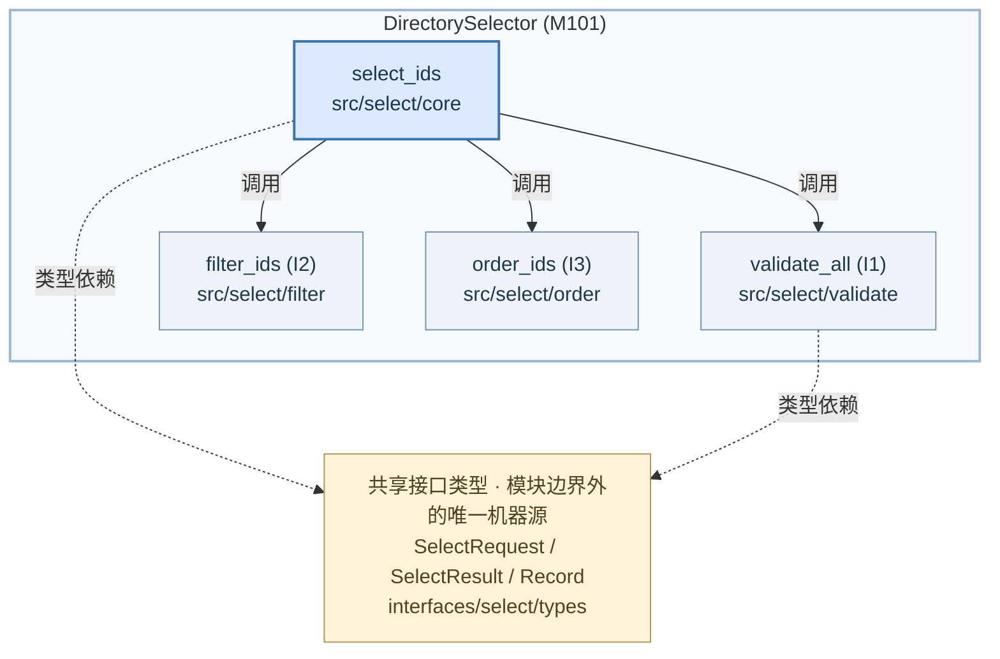

图 M-S1 · EX-MODULE/v1 · Target / Planned / NOT_RUN。外框表示模块内部组成，实线表示同步调用，
虚线表示对权威类型的依赖；图不表示线程、进程或处理时序。所有路径均为计划路径，语言后缀待定。

入口 core 负责组织一次调用及统一返回；validate 对全部输入检查字段与 ID 唯一性；filter 保存匹配项的输入索引；
order 按既定规则排序并构造独立结果。四个源文件是同一 M101 的实现组织，不是四个新的正式模块。
共享类型由 interfaces/select/types 唯一维护，不能在各文件里再定义一套公共字段。
具体执行顺序与失败出口见 §7 同一案例的 M-P1；M-S1 展示“由什么组成及如何关联”，不替代过程设计。
<!-- STD_TEMPLATE_EXAMPLE_END -->

<!-- 在此写入本节设计正文；图表汇总结论，不替代方案与依据。 -->

### 5.1 内部组成

<!-- 编写建议：依据模块的主要职责和变化边界拆出内部组件/文件，先画真实或 Target 的组成图，再解释各自拥有的状态和协作。只有单一入口与单一处理单元时可按模板规定用固定字段替代图，但必须给出简化理由；不要机械堆类名。 -->

<!-- 多对象模块先给结构图及图文核对；简单模块写明 tailoring 依据。逐项使用以下固定字段。 -->

#### 5.1.N `<Internal ID>` · <内部组件 / 类 / 函数>

<!-- 编写建议：逐内部单元写职责、持有状态、提供的行为、依赖方向和落地文件；说明拆分依据及为何不是独立正式模块。用一个正常调用说明它与相邻单元的交接，而不是只列“管理/处理/协调”。 -->

- **职责与非职责**

  <!-- TODO -->
- **输入、处理与输出**

  <!-- TODO -->
- **协作对象**

  <!-- TODO -->
- **文件 / symbol / 实现状态**

  <!-- TODO -->
- **拆分依据与替代方案代价**

  <!-- TODO -->

### 5.2 内部调用过程

<!-- 编写建议：从公开入口沿关键函数走到输出，逐步标明数据和状态变化、同步/异步边界及失败返回。此处是内部结构的主调用路径；复杂流程须与 §7 的逐流程图共用 Process/Call/IF ID，不能各画一套不同语义。 -->

<!-- 至少沿一条代表输入写清文件/组件谁调用谁、传什么、返回/异常如何交接；重要过程仍在 §7 画图。 -->

#### 5.2.N `<Call ID>` · <调用过程名称>

<!-- 编写建议：一次调用链对应一项，列出起点、各步执行函数、传递的数据结构、完成条件和可能失败出口。若涉及队列或回调，明确受理不等于完成，并说明迟到回调的归属。 -->

- **入口与调用上下文**

  <!-- TODO -->
- **调用链（文件 / symbol → 文件 / symbol）**

  <!-- TODO -->
- **逐步传递的数据**

  <!-- TODO -->
- **返回、异常与清理**

  <!-- TODO -->
- **对应流程 / 接口 / 验证**

  <!-- TODO -->

### 5.3 文件间接口契约

<!-- 编写建议：只记录本模块内部文件之间需要稳定约束的接口，给出 provider/consumer 文件与 symbol、参数/结果类型和所有权。公共跨模块接口归 §9 或机器源，不应在本节形成第二份字段定义；若函数仅是私有 helper，可直接指向 ISD。 -->

<!-- 本节只映射内部文件/组件间的交接和依赖；签名、输入输出、错误与寿命在 §9 对应类别的同一接口记录中唯一定义，公共接口仍以固定机器源为 authority。 -->

#### 5.3.N `<IF-ID>` · `<provider file / symbol>` → `<consumer file / symbol>`

<!-- 编写建议：用真实文件和 symbol 固定交接位置，再写完整输入输出、调用时机、错误传播与生命周期约束。对于 Planned 文件应明确状态，不把计划路径冒充已有实现；同一接口的具体字段引用 §6 类型。 -->

- **接口成员 ID / §9 逐接口定义位置**

  <!-- TODO -->
- **本文件的提供或使用责任**

  <!-- TODO -->
- **交接时机 / 本地调用步骤**

  <!-- TODO -->
- **§9.3 生命周期约束**

  <!-- TODO -->
- **实现与验证位置**

  <!-- TODO -->

### 5.4 服务提供方式（条件适用）

<!-- 编写建议：服务端点型或常驻模块才展开监听、启动、就绪、停止、并发和宿主装配；纯库函数说明不适用及由谁调用。区分服务已启动、可接收请求和依赖已就绪，写清每个阶段的失败出口。 -->

<!-- 对 §3 已登记且需要本模块常驻承载的操作面，说明 server/runtime、线程/事件循环、监听与生命周期；
本节引用 Surface ID，不重新定义端点集、认证、输入或错误。纯函数/静态前端写 N/A + 理由。 -->

- **运行载体与入口**

  <!-- TODO / N/A + 依据 -->
- **并发/线程模型**

  <!-- TODO / N/A + 依据 -->
- **初始化、Ready、生效与停止**

  <!-- TODO / N/A + 依据 -->
- **宿主装配、失败和资源回收责任**

  <!-- TODO / N/A + 依据 -->

### 5.5 依赖方向

<!-- 编写建议：画出本模块内部类型与调用依赖的允许方向，解释循环依赖如何禁止或隔离，以及生成代码、宿主接口和测试替身的位置。只写“分层”不足以指导编码；应说明某个具体文件是否允许引用另一个文件。 -->

<!-- 说明允许的依赖方向、禁止的反向依赖/环及检查方法；不要只复述文件树。 -->

- **允许方向**

  <!-- TODO -->
- **禁止方向与原因**

  <!-- TODO -->
- **循环/越层检查**

  <!-- TODO -->
- **变更影响**

  <!-- TODO -->

## 6. 数据结构设计

<details>
<summary>本节编写建议、规范与示例</summary>


<!-- 数据结构分类编写建议与教学例子；生成文档时按实际对象保留适用类别。
只保留适用类别，并在章首记录不适用类别的原因与 tailoring 依据。类别按性质划分，不按输入/输出划分；每个具体结构以真实名称作带编号的小节标题，字段、约束、唯一来源、所有权/寿命、合法与拒绝实例及验证随该结构描述，不另设数据结构清单。下列例子均为虚构，不能作为项目契约：

| 类别 | 具体示例（均为虚构） | 适用条件与关键约束 |
|---|---|---|
| 公共基础类型与枚举 | `InspectionState = ACCEPTED \| RUNNING \| SUCCEEDED \| FAILED`；示例值 `RUNNING` | 多处共用时采用；`RUNNING` 表示已开始执行，未知值拒绝 |
| 业务与操作数据结构 | `InspectionRequest {request_id:"req-7", image_uri:"asset://image/7", policy_version:3}` | 存在业务载荷时采用；三字段必填，`request_id` 绑定一次业务操作 |
| 配置与规则数据结构 | `config/inspection-policy.yaml {schema_version:1, policy_version:3, enabled:true, score_threshold:0.75}` | 存在受控规则时采用；阈值在 0–1，新版本仅对后续任务生效 |
| 通信报文结构 | `FrameReadyEvent {source_id:2, frame_id:7, sequence:42, image_ref_id:9}` | 存在消息交接时采用；`sequence` 在同一来源内递增，重复号按契约去重 |
| 设备与 FPGA 表项结构 | `RouteTableEntry {route_id:u12=7, target:u4=2}` | 实际拥有设备/RTL 表项时采用；16 位布局和写入确认均须由机器源定义 |
| 运行状态数据结构 | `InspectionRuntimeState {task_id:"t-7", generation:2, state:RUNNING, result_uri:null}` | 存在跨步骤状态时采用；唯一写者确认 `ACCEPTED → RUNNING` 后发布 |
| 数据库表结构 | `inspection_jobs(task_id PRIMARY KEY, generation, state, result_uri)` | 实际拥有数据库表时采用；受理回复前提交事务，升级说明版本迁移 |
| 错误码与错误结构 | `InspectionError {code:QUEUE_FULL, request_id:"req-7", task_id:null}` | 存在错误载荷时采用；公共 `QUEUE_FULL` 逐码定义，拒绝本次新任务 |

结构小节以 `InspectionRequest` 等真实名称为标题：先展示类型声明，再逐字段写类型、必填/范围、跨字段规则、来源、持有者和验证。上表只是简短实例，不是字段全集或机器权威；没有设备或数据库的项目，不要为了填类别发明寄存器或表。


**以下为本层原有编写要求。**

**数据与错误承接**：先列模块拥有及引用的 Data/Type ID、公共或私有属性、唯一来源、生产/消费和寿命；私有关键对象逐字段写类型、可空性、范围/单位、不变量及合法/拒绝实例。公共数据和系统错误码引用上级 ID 与固定机器源，不另造代码值。

**本节目的**：把数据怎样组织、查找、变更和释放设计清楚，不只列状态名称或字段。

**必须写清楚**：关键类型与唯一来源、字段名/类型/必填性/单位/范围、索引/容器选择、键与跨字段约束、创建/读写/持有者、借用/复制及释放时机。跟随一个对象说明入口、中间态和输出形态；重要生命周期给状态图及转换表，列事件、执行者、Guard 的事实来源、动作和出口。私有 dataclass/struct 等也要达到实现者不需猜字段的深度；公共字段只引用 §9 唯一机器源，不复制第二份 authority。

**编写规范**：区分对象内存寿命、业务状态与访问权限；不能用一个 Done 同时表示成功、停止和释放。状态切换说明原子性和失败后的有效对象，外部引用存在时不能提前复用缓冲。公共类型引用 §9，私有结构在本章唯一维护。

从 §9 的每个输入、成功返回和错误返回反查本章或固定外部机器源：必填字段逐一有来源、构造时机和合法值；接口不得返回本章要求却没有任何操作能够产生的字段。与上级共用的类型若在本章增加字段或改名，应登记差异、变更责任及版本，在裁决前不得把本地投影冒充上级合同。

分别描述易失状态与持久状态；没有持久化不等于没有生命周期。内存队列、在途调用、
缓冲区占用、取消与复位仍须写明状态权威、合法转换、可观察条件及释放规则。只有确实
不存在相关状态或生命周期时才说明 N/A 及理由，不能用“无数据库”省略在途行为。

**抽象示例**：筛选器借用只读输入，调用内拥有 seen 集合和候选数组；成功返回独立 ID 结果，失败不返回候选数组，两条路径均丢弃临时对象。无数据库不能免除这一说明。

**完成条件**：从对象出生走到每个出口，无重复释放、悬空引用或无主状态；Guard 有可获得的事实，不靠测试直接修改内部变量才能继续。

-->
</details>

<!-- STD_TEMPLATE_EXAMPLE_BEGIN -->
**数据生命周期图例：借用输入与调用内临时对象**

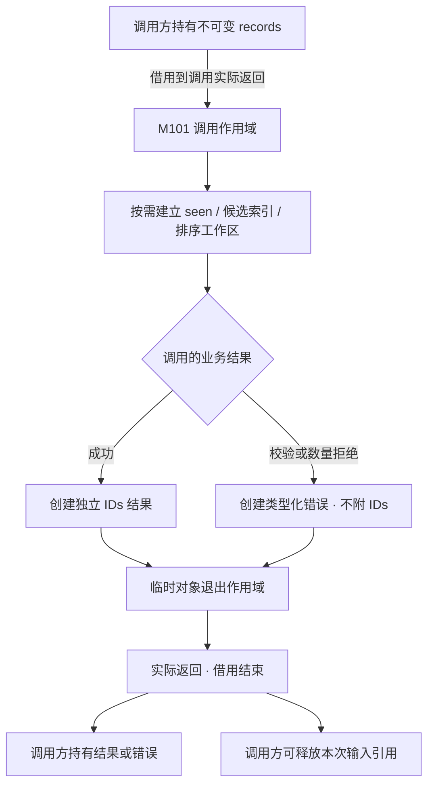

图 M-D1 · EX-MODULE/v1 · Target / Planned / NOT_RUN。箭头表示寿命与所有权交接，不是持久状态机。
错误可能发生在临时对象尚未建立时，退出作用域只处理已建立对象；业务分支的准确发生位置见 M-P1。
独立结果与临时区不能共用会被回收的存储。多次调用共享同一不可变输入时，一次返回只结束本次借用，不能提前释放其他调用仍使用的对象。

| 对象 | 所有者 / 访问方式 | 出生与结束 | 成功 / 失败后的归属 |
|---|---|---|---|
| records 与字段 | 调用方拥有；M101 只读借用 | 调用前存在；本次实际返回结束借用 | 始终归调用方，需等所有借用结束才能销毁 |
| seen、候选索引、排序工作区 | 单次调用独享 | 按需分配；所有正常/业务错误出口退出作用域 | 不跨调用保留，不作为结果返回 |
| IDs / 错误对象 | M101 构造，返回后交给调用方 | 返回前建立独立存储 | 成功只有 IDs；业务失败只有错误，无半成品 |

宿主强制终止和不可恢复分配失败不属于正常返回路径，采用前需关闭文末 O1；不能用这张图宣称所有运行库异常已解决。

**数据结构图例：公开类型与私有工作区**

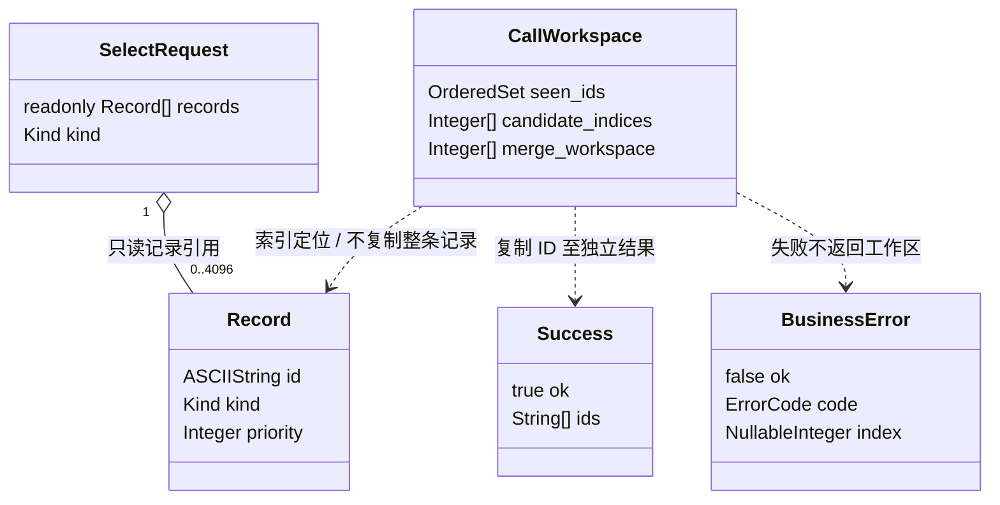

图 M-D2 · EX-MODULE/v1 · Target / Planned / NOT_RUN。聚合线表示借用关联，虚线表示访问或构造关系，不是执行顺序。
公开类型是文末 IF-SELECT/v1 的阅读投影，CallWorkspace 是模块私有组织；Success 与 BusinessError 是互斥结果，不能同时返回。
图中 0..4096 表示合法输入约束，不代表机器容器天然阻止第 4097 项；越限及字段细则仍由 R-VALID 检查。
Kind 的 A/B、priority 范围和 ID 格式以文末规格为准；这张图补充结构关系，不另立字段 authority。
<!-- STD_TEMPLATE_EXAMPLE_END -->

<!-- 在此写入本节设计正文；图表汇总结论，不替代方案与依据。 -->

### 6.1 公共基础类型与枚举（适用时）

<details>
<summary>本节编写建议、规范与示例</summary>

**本节目的**：统一本层拥有的共享类型与枚举语义，使该类数据可由下级直接承接。

**必须写清楚**：逐值含义、合法范围、未知值处理及唯一来源；逐结构记录 Data/Type ID、固定来源、字段、所有权与寿命、合法和拒绝实例及验证。

**编写规范**：复用上级类型时仅给固定引用和本层投影，不重定义值。本类别不适用时在章首说明原因和 tailoring 依据，不保留空小节。如果字段已有机器定义，应固定版本并逐项核对；教学例子不得成为项目默认值。

**抽象示例**：任务状态 RUNNING 只表示执行已开始，不代表成功完成；示例只说明写法，不是项目的机器契约。

**完成条件**：各使用处对同一值作一致解释，且没有与其他章节重复维护同一字段定义。

</details>

<!-- 编写建议：只收录本模块拥有或必须呈现的公共基础类型与枚举；已由上级或机器源定义的值只引用固定来源。逐值写含义、范围、未知值处理和适用边界。虚构例子：InspectionState 的 RUNNING 只表示检测已开始执行，不等于完成。 -->

#### 6.1.N `<真实结构名>`

- **完整定义、Data/Type/Error ID 与唯一来源**
- **逐字段/逐值类型、范围、含义与跨字段约束**
- **生产/修改、所有权、可见点、寿命及失败出口**
- **合法与拒绝实例、V/Case 与证据状态**

<!-- STD_TEMPLATE_EXAMPLE_BEGIN -->
**6.1.1 `InspectionState`（公共状态枚举，虚构）**

```text
enum InspectionState { ACCEPTED, RUNNING, SUCCEEDED, FAILED }
```

- **Data/Type ID、含义与来源**：

  `DATA-EX-STATE`；一次检测任务的权威业务状态。示例机器源为 `Proposed: InspectionState`；正式设计须给出实际 Schema/IDL 路径、版本和核对结果，或记录形成契约的 Owner 与 Gate。

- **逐值定义**：

  `ACCEPTED`＝已受理但尚未执行；`RUNNING`＝已开始执行但无最终结果；`SUCCEEDED`＝结果已发布；`FAILED`＝执行终止且未发布成功结果。未知值拒绝，不映射为 `FAILED`。

- **约束与生命周期**：

  状态键为 `task_id`；只有任务状态的权威持有者可改变值，发布后读者才可观察。`RUNNING → SUCCEEDED` 必须已有可定位的结果；终态不得再回到 `RUNNING`。任务保留期限由系统级策略决定，此例不虚构期限。

- **合法/拒绝实例**：

  已发布结果 `result_id=res-7` 后置 `SUCCEEDED` 合法；只有执行开始记录、没有结果时置 `SUCCEEDED` 必须拒绝。

- **验证**：

  设计向量 `V-EX-STATE-01` 检查终态前提和未知值拒绝；本例 `NOT_RUN`，不表示验证通过。

<!-- STD_TEMPLATE_EXAMPLE_END -->

### 6.2 业务与操作数据结构（适用时）

<details>
<summary>本节编写建议、规范与示例</summary>

**本节目的**：定义业务操作实际交换和保存的对象，使该类数据可由下级直接承接。

**必须写清楚**：逐字段类型、必填性、范围、键及跨字段条件；逐结构记录 Data/Type ID、固定来源、字段、所有权与寿命、合法和拒绝实例及验证。

**编写规范**：同一结构无论作为输入还是输出只定义一次。本类别不适用时在章首说明原因和 tailoring 依据，不保留空小节。如果字段已有机器定义，应固定版本并逐项核对；教学例子不得成为项目默认值。

**抽象示例**：InspectionRequest 用非空 request_id 关联一次检测操作；示例只说明写法，不是项目的机器契约。

**完成条件**：合法与拒绝实例均能依字段和规则判定，且没有与其他章节重复维护同一字段定义。

</details>

<!-- 编写建议：按真实业务对象逐字段说明类型、必填/可空、范围和跨字段不变量；同一结构在多个接口使用时只定义一次。虚构例子：InspectionRequest 的 request_id 非空且标识一次业务操作。 -->

#### 6.2.N `<真实结构名>`

- **完整定义、Data/Type/Error ID 与唯一来源**
- **逐字段/逐值类型、范围、含义与跨字段约束**
- **生产/修改、所有权、可见点、寿命及失败出口**
- **合法与拒绝实例、V/Case 与证据状态**

<!-- STD_TEMPLATE_EXAMPLE_BEGIN -->
**6.2.1 `InspectionRequest`（业务对象，虚构）**

```text
InspectionRequest {
  request_id: string,
  image_uri: string,
  policy_version: uint32
}
```

- **Data/Type ID、用途与来源**：

  `DATA-EX-REQUEST`；代表一次待受理的检测请求，示例机器源为 `Proposed: InspectionRequest`。正式项目需绑定实际类型定义和固定版本。

- **`request_id`**：

  必填、非空字符串，作为同一业务请求的稳定身份；实际编码及长度上限由 Schema 确定。

- **`image_uri`**：

  必填、非空字符串，指向待检图像而非图像字节副本；URI 方案和访问权限由图像存储契约确定。

- **`policy_version`**：

  必填、正整数，指定本次请求采用的已发布规则版本。

- **跨字段与寿命**：

  同一 `request_id` 重放时，`image_uri` 与 `policy_version` 必须保持一致；冲突值不得创建第二任务。受理方创建任务记录后保留请求身份；原图的所有权与释放期限另由图像存储契约决定。

- **合法/拒绝实例**：

  `{request_id:"req-7", image_uri:"asset://image/7", policy_version:3}` 在引用和版本均存在时合法；同一 `request_id` 携带另一个图像 URI 应拒绝并返回已定义的冲突错误。

- **验证**：

  `V-EX-REQUEST-01` 覆盖合法构造、缺字段和同 ID 冲突；本例 `NOT_RUN`。

<!-- STD_TEMPLATE_EXAMPLE_END -->

<!-- STD_TEMPLATE_EXAMPLE_BEGIN -->
**6.2.2 `InspectionSubmission`（受理结果，虚构）**

```text
InspectionSubmission {
  request_id: string,
  task_id: string,
  disposition: ACCEPTED | EXISTING
}
```

- **Data/Type ID、用途与来源**：

  `DATA-EX-SUBMISSION`；表示请求已受理或同请求重放找到了原任务，不表示检测已经完成。示例机器源为 `Proposed: InspectionSubmission`。

- **`request_id`**：

  必填，等于输入 `InspectionRequest.request_id`；用于把响应绑定到原请求。

- **`task_id`**：

  必填、非空；`ACCEPTED` 指向本次新建任务，`EXISTING` 指向相同请求身份下已存在的原任务。

- **`disposition`**：

  必填；`ACCEPTED` 表示首次受理，`EXISTING` 表示同一请求内容重放且未新增执行；未知值拒绝。

- **约束与生命周期**：

  受理责任单元在任务身份持久确定后构造结果；响应丢失时仍可凭原 `request_id` 查询。任务何时完成由 §6.1 的 `InspectionState` 表达，不能从 `InspectionSubmission` 推断成功检测。

- **合法/拒绝实例**：

  `{request_id:"req-7", task_id:"t-7", disposition:ACCEPTED}` 在确实新建 `t-7` 后合法；没有持久任务身份却返回 `ACCEPTED` 必须拒绝。

- **验证**：

  `V-EX-SUBMISSION-01` 检查首次受理、同请求重放、响应丢失后查询和无重复任务；本例 `NOT_RUN`。

<!-- STD_TEMPLATE_EXAMPLE_END -->

### 6.3 配置与规则数据结构（适用时）

<details>
<summary>本节编写建议、规范与示例</summary>

**本节目的**：固定决定行为的配置与规则载荷，使该类数据可由下级直接承接。

**必须写清楚**：字段、默认值来源、版本、校验和生效点；逐结构记录 Data/Type ID、固定来源、字段、所有权与寿命、合法和拒绝实例及验证。

**编写规范**：未决定的配置不得由下级自行添加 fallback。本类别不适用时在章首说明原因和 tailoring 依据，不保留空小节。如果字段已有机器定义，应固定版本并逐项核对；教学例子不得成为项目默认值。

**抽象示例**：DetectionPolicy 的新版阈值只作用于新任务；示例只说明写法，不是项目的机器契约。

**完成条件**：能判定任一操作使用哪一版规则，且没有与其他章节重复维护同一字段定义。

</details>

<!-- 编写建议：给出受控配置的字段、默认值来源、版本、校验和生效点；配置未定义时不能由下级自创 fallback。虚构例子：DetectionPolicy 的 threshold 只对新受理任务生效。 -->

#### 6.3.N `<真实结构名>`

- **完整定义、Data/Type/Error ID 与唯一来源**
- **逐字段/逐值类型、范围、含义与跨字段约束**
- **生产/修改、所有权、可见点、寿命及失败出口**
- **合法与拒绝实例、V/Case 与证据状态**

<!-- STD_TEMPLATE_EXAMPLE_BEGIN -->
**6.3.1 `config/inspection-policy.yaml`（配置文件，虚构）**

```yaml
schema_version: 1
policy_version: 3
enabled: true
score_threshold: 0.75
```

- **Data/Type ID、用途与来源**：

  `DATA-EX-POLICY-FILE`；这是一份决定检测任务是否准入及其判定阈值的 YAML 文件，不是单独的内存对象。示例路径和内容均为虚构；真实项目须指定受控文件路径、唯一配置 Schema、版本及部署责任方。

- **`schema_version`**：

  必填整数，本例只接受 `1`；用于选择文件格式，未知版本拒绝加载。

- **`policy_version`**：

  必填正整数，标识本次加载的规则版本；发布后不复用。

- **`enabled`**：

  必填布尔值；`false` 表示不受理新的检测任务，不改变既有任务的终态。

- **`score_threshold`**：

  必填数值，闭区间 `[0, 1]`，单位为无量纲得分；`enabled=false` 时仍须通过格式校验，避免下次启用时读取无效值。

- **文件级约束与生效**：

  本例由进程在启动时读取并整份校验；缺字段、重复键、未知键、类型错误或越界值均使启动失败，不静默使用默认值。启动成功后进程固定一份已校验快照；编辑磁盘文件不会热更新，只有按启动过程重启并确认新版本后才生效。运行中任务的恢复规则由系统恢复设计决定。

- **合法/拒绝实例**：

  上面的完整文件在受控路径且通过 Schema 校验时合法；将 `score_threshold` 改为 `1.2` 或增加未知键 `fallback_mode` 时必须拒绝整份文件，不能部分采用。

- **验证**：

  `V-EX-POLICY-FILE-01` 覆盖完整加载、缺字段/未知键/越界拒绝、修改文件但未重启时版本不变；本例 `NOT_RUN`。

<!-- STD_TEMPLATE_EXAMPLE_END -->

### 6.4 通信报文结构（适用时）

<details>
<summary>本节编写建议、规范与示例</summary>

**本节目的**：定义跨执行边界交换的消息载荷，使该类数据可由下级直接承接。

**必须写清楚**：字段、编码、关联身份、顺序、重复与兼容边界；逐结构记录 Data/Type ID、固定来源、字段、所有权与寿命、合法和拒绝实例及验证。

**编写规范**：投递与重试动作在接口章节定义，结构只拥有载荷语义。本类别不适用时在章首说明原因和 tailoring 依据，不保留空小节。如果字段已有机器定义，应固定版本并逐项核对；教学例子不得成为项目默认值。

**抽象示例**：FrameReadyEvent 使用 frame_id 与来源内递增的 sequence；示例只说明写法，不是项目的机器契约。

**完成条件**：两端可按同一报文解释和验证，且没有与其他章节重复维护同一字段定义。

</details>

<!-- 编写建议：定义真实消息、事件、流或文件载荷的字段、编码、关联身份、顺序与兼容边界；投递/重试行为由对应接口定义。虚构例子：FrameReadyEvent 带 frame_id 与来源内递增的 sequence。 -->

#### 6.4.N `<真实结构名>`

- **完整定义、Data/Type/Error ID 与唯一来源**
- **逐字段/逐值类型、范围、含义与跨字段约束**
- **生产/修改、所有权、可见点、寿命及失败出口**
- **合法与拒绝实例、V/Case 与证据状态**

<!-- STD_TEMPLATE_EXAMPLE_BEGIN -->
**6.4.1 `FrameReadyEvent`（通信报文，虚构）**

| 报文内 bit 位置 | 0–15 | 16–23 | 24–31 | 32–63 | 64–127 | 128–191 | 192–255 |
|---|---|---|---|---|---|---|---|
| 字段 | `magic` | `version` | `flags` | `source_id` | `frame_id` | `sequence` | `image_ref_id` |
| 类型 | `u16` | `u8` | `u8` | `u32` | `u64` | `u64` | `u64` |

图 EX-DATA-4 · `FrameReadyEvent` 的线传布局；表格从左到右为报文顺序，编号为从报文起始位置计算的 bit offset。图仅展示虚构教学格式，不是项目的机器权威。该固定报文共 256 bit／32 byte，多字节整数字段按网络字节序（大端）编码；没有隐含填充或可变长尾部。

- **Data/Type ID、用途与来源**：

  `DATA-EX-FRAME-EVENT`；通知采集图像已可读取。示例机器源为 `Proposed: FrameReadyEvent`；正式项目须固定消息 Schema、版本和实际传输绑定，不从图推导 topic 或部署事实。

- **`magic`（bit 0–15）**：

  必填 `u16`，固定值 `0xA55A`；不匹配则按格式错误拒绝，不继续解析其他字段。

- **`version`（bit 16–23）**：

  必填 `u8`，本教学格式仅接受 `1`；未知版本拒绝，不猜测字段兼容。

- **`flags`（bit 24–31）**：

  必填 `u8`，本版必须为 `0`；非零保留位拒绝。

- **`source_id`（bit 32–63）**：

  必填 `u32`，非零，标识采集来源。

- **`frame_id`（bit 64–127）**：

  必填 `u64`，非零，标识该来源的一帧。

- **`sequence`（bit 128–191）**：

  必填 `u64`，非零，在同一来源内递增；不得据此跨来源排序，耗尽前须停止该来源的新报文而非回绕复用。

- **`image_ref_id`（bit 192–255）**：

  必填 `u64`，非零，引用该来源已发布且可读取的图像；引用的解析与授权由图像存储契约确定，报文本身不携带图像字节。

- **约束与寿命**：

  `(source_id, sequence)` 是去重键；同键不同 `frame_id` 或 `image_ref_id` 为冲突。报文只在图像可读取后发布；事件被消费不等于图像资源可删除。传输确认、重试和背压属于对应接口，不在此重复定义。

- **合法/拒绝实例**：

  `magic=0xA55A, version=1, flags=0, source_id=2, frame_id=7, sequence=42, image_ref_id=9` 按图编码为 32 byte 且引用已发布图像时合法；将 `flags` 改为 `1` 或同键改用另一个 `image_ref_id` 应拒绝，不覆盖原记录。

- **验证**：

  `V-EX-FRAME-01` 覆盖逐字段编码/解码、长度与端序、版本/保留位拒绝、重复与冲突报文；本例 `NOT_RUN`。

<!-- STD_TEMPLATE_EXAMPLE_END -->

### 6.5 设备与 FPGA 表项结构（适用时）

<details>
<summary>本节编写建议、规范与示例</summary>

**本节目的**：定义实际设备或 RTL 表项的受控布局，使该类数据可由下级直接承接。

**必须写清楚**：位宽、复位值、读写权限、写入确认与生效条件；逐结构记录 Data/Type ID、固定来源、字段、所有权与寿命、合法和拒绝实例及验证。

**编写规范**：纯软件项目无此对象时按 tailoring 删除，不虚构寄存器。本类别不适用时在章首说明原因和 tailoring 依据，不保留空小节。如果字段已有机器定义，应固定版本并逐项核对；教学例子不得成为项目默认值。

**抽象示例**：RouteTableEntry 的 target 位宽以固定 register map 为准；示例只说明写法，不是项目的机器契约。

**完成条件**：表项写入与读取有唯一可核对的机器来源，且没有与其他章节重复维护同一字段定义。

</details>

<!-- 编写建议：只有真实拥有设备或 RTL 表项时才保留；按固定机器源描述位宽、复位值、读写约束与生效条件。纯软件范围不得为填模板虚构寄存器。虚构例子：RouteTableEntry 的布局来自 register map。 -->

#### 6.5.N `<真实结构名>`

- **完整定义、Data/Type/Error ID 与唯一来源**
- **逐字段/逐值类型、范围、含义与跨字段约束**
- **生产/修改、所有权、可见点、寿命及失败出口**
- **合法与拒绝实例、V/Case 与证据状态**

<!-- STD_TEMPLATE_EXAMPLE_BEGIN -->
**6.5.1 `CaptureStatusRegister`（设备寄存器，虚构）**

假设设备暴露一个 `CAPTURE_MMIO` 控制地址空间。下表偏移均相对该地址空间基址；基址由实际平台分配，不在本例编造物理地址。所有寄存器均按 32-bit 对齐、小端字节序访问；不支持非对齐或非 32-bit 访问。未列出的偏移为保留区，访问返回总线拒绝，不得作为兼容扩展的隐式空间。

| 偏移 | 寄存器名称 | 宽度/访问 | 复位或初值 | 用途与访问副作用摘要 |
|---|---|---|---|---|
| `0x00` | `CAP_ID` | 32-bit / RO | `0x43415031` | 设备身份常量 `CAP1`；读取无副作用，不表示设备已就绪。 |
| `0x04` | `CAP_VERSION` | 32-bit / RO | `0x00010000` | 高 16 位主版本、低 16 位次版本；软件先核对兼容范围。 |
| `0x10` | `CAP_CONTROL` | 32-bit / RW | `0x00000000` | 受控启停入口；写入可能触发动作，不能按普通内存变量处理。 |
| `0x20` | `CAP_STATUS` | 32-bit / RO | `0x00000000` | 本例下方完整展开的状态寄存器；原子读取，无读清副作用。 |
| `0x24` | `CAP_FRAME_COUNT` | 32-bit / RO | `0x00000000` | 已完成帧数；达到最大值后饱和，设备复位时清零。 |
| `0x28` | `CAP_DROPPED_COUNT` | 32-bit / RO | `0x00000000` | 因输入溢出而丢弃的帧数；达到最大值后饱和，设备复位时清零。 |
| `0x2C` | `CAP_IRQ_STATUS` | 32-bit / RW1C | `0x00000000` | 中断状态；读取得到当前锁存位，写 `1` 清对应位，写 `0` 不改变该位。 |

此表只示范**寄存器列表**的覆盖方式，不是其余六个寄存器的完整字段定义。真实设计应为 `CAP_CONTROL`、`CAP_IRQ_STATUS` 等每个实际使用的寄存器另设同名小节，固定具体位域、合法写序列、清除时机、并发及异常行为；若下级 register map/RTL 是机器权威，本表须从同一固定基线生成或逐项核对。

| 寄存器逻辑位 | 31–3 | 2 | 1 | 0 |
|---|---|---|---|---|
| 字段 | `reserved` | `overflow` | `busy` | `ready` |

图 EX-DATA-5A · 表格从左到右是寄存器高位到低位，表头直接给出逻辑位编号；位域布局不表示总线的字节传输顺序。本例假设设备寄存器空间偏移 `0x20`、32-bit 对齐访问、小端字节序；均为虚构教学条件。

- **Data/Type ID、用途与来源**：

  `DATA-EX-CAPTURE-STATUS`；供控制单元读取采集状态。示例机器源为 `Proposed: CaptureStatusRegister`；正式设计须用固定版本 register map/RTL 逐位核对。

- **`reserved`（bit 31–3）**：

  只读，复位和正常读取均为零；读到非零视为格式/版本不匹配，不按已知字段解释。

- **`overflow`（bit 2）**：

  只读、复位值 `0`；发生输入溢出后锁存为 `1`，本教学例子中只在设备复位时清零。

- **`busy`（bit 1）**：

  只读、复位值 `0`；采集操作正在进行时为 `1`。

- **`ready`（bit 0）**：

  只读、复位值 `0`；初始化完成且可接收新操作时为 `1`。`ready` 与 `busy` 不得同时为 `1`。

- **访问与生命周期**：

  一次 32-bit 读取返回同一时刻的原子快照；写此只读地址返回总线拒绝，不改变状态。复位全零不等于已经就绪；何时从复位进入 `ready=1` 由设备启动过程定义。

- **合法/拒绝实例**：

  读取 `0x00000001` 表示就绪且不忙；`0x00000003` 同时声明就绪与忙，违反不变量，控制单元须报告设备状态异常，不能凭其中一个位继续执行。

- **验证**：

  `V-EX-REGISTER-01` 覆盖复位值、位域、只读拒写、原子读取和互斥状态；本例 `NOT_RUN`，不代表 RTL 仿真或上板结果。

<!-- STD_TEMPLATE_EXAMPLE_END -->

<!-- STD_TEMPLATE_EXAMPLE_BEGIN -->
**6.5.2 `RouteTableEntry`（FPGA 数据表项，虚构）**

| 表项逻辑位 | 15–12 | 11–0 |
|---|---|---|
| 字段 | `target` | `route_id` |

图 EX-DATA-5B · 表格从左到右是表项高位到低位，表头直接给出逻辑位编号。本例假设 `route_table[0..63]` 共 64 项，基址偏移 `0x100`，每项占 2 byte、步长 2 byte；第 `i` 项位于 `0x100 + 2i`。16-bit 表项按小端字节序读写，图不是字节传输时序。

- **Data/Type ID、用途与来源**：

  `DATA-EX-ROUTE`；表项给 FPGA 路由查找提供目标。示例布局为 `Proposed`；真实设计须以固定版本 RTL/register map 为机器权威，逐位核对容量、地址和生效规则。

- **`target`（bit 15–12）**：

  无符号 4 位，范围 0–15，选择输出目标。

- **`route_id`（bit 11–0）**：

  无符号 12 位，运行有效值 1–4095；`0` 表示空项，不参加有效路由查找。

- **索引、约束与生命周期**：

  表索引为 0–63，索引与 `route_id` 是不同概念；复位后 64 项全零。只有获授权的控制单元可在停止路由查找后以 16-bit 原子写入表项，硬件写入确认后，重新启动的查找才采用新值；在途查找不得混用旧新值。停止/确认/重启的调用条件由表项写入接口定义，本节只固定数据布局和生效边界。

- **合法/拒绝实例**：

  索引 `5` 写入 `target=2, route_id=7`，逻辑值为 `0x2007`、小端字节为 `07 20`，重启查找后有效；`target=2, route_id=0` 不可作为有效路由，读取时应按空项处理，不能把它当作已配置目标。

- **验证**：

  `V-EX-ROUTE-01` 覆盖地址步长、大小端编码、复位空项、无效值和写入后生效边界；本例 `NOT_RUN`，不代表 FPGA 仿真或上板结果。

<!-- STD_TEMPLATE_EXAMPLE_END -->

### 6.6 运行状态数据结构（适用时）

<details>
<summary>本节编写建议、规范与示例</summary>

**本节目的**：定义跨步骤保留的状态及其权威，使该类数据可由下级直接承接。

**必须写清楚**：字段、唯一写者、转移前提、可见点和恢复事实；逐结构记录 Data/Type ID、固定来源、字段、所有权与寿命、合法和拒绝实例及验证。

**编写规范**：状态名称不代替进入条件，内存态与持久态分开。本类别不适用时在章首说明原因和 tailoring 依据，不保留空小节。如果字段已有机器定义，应固定版本并逐项核对；教学例子不得成为项目默认值。

逐条核对状态转换的动作与 §9 实际接口：每项持久化、释放或 fencing 动作都须有可调用的操作、执行责任方、Guard 和原子提交边界。若转换表承诺的动作无法由已定义操作完成，应标为设计缺口并阻断依赖它的编码；不能用流程图上的“清空并提交”替代接口合同。

**抽象示例**：TaskRuntimeState 进入 RUNNING 需有已受理执行的事实；示例只说明写法，不是项目的机器契约。

**完成条件**：正常、失败和重启路径均能定位当前有效状态，且没有与其他章节重复维护同一字段定义。

对拥有跨步骤状态的模块，状态模型是本节条件必需的交付物：按状态对象分别给状态图和转换表，记录事件、Guard 的权威事实来源、唯一写者、动作、原子可见点、失败/迟到出口与可验证不变量；§10 引用同一转换 ID 推演交错与恢复，不维护第二套状态规则。纯调用内局部变量无需虚构持久状态机，但仍说明对象寿命。

</details>

<!-- 编写建议：定义状态字段、唯一写者、允许转移、可见点和恢复事实；状态不能只列名称而不写进入条件。虚构例子：TaskRuntimeState 从 QUEUED 到 RUNNING 须有受理执行的事实。 -->

#### 6.6.N `<真实结构名>`

- **完整定义、Data/Type/Error ID 与唯一来源**
- **逐字段/逐值类型、范围、含义与跨字段约束**
- **生产/修改、所有权、可见点、寿命及失败出口**
- **状态图、转换表与不变量（跨步骤状态必填）**

  <!-- 每条 Transition ID：原状态、事件/执行者、Guard 的权威事实来源、动作/提交点、新状态、迟到/失败出口、VRC；无跨步骤状态时给出可核查的 N/A 事实与决定 -->
- **合法与拒绝实例、V/Case 与证据状态**

<!-- 跨步骤状态适用时，在该结构下给出状态图和转换表：Transition ID、原状态、事件/执行者、Guard 的事实来源、动作及提交点、新状态、迟到/失败出口、对应不变量与 VRC。表中不写“检查条件满足”而不说明谁产生可检查事实。 -->

<!-- STD_TEMPLATE_EXAMPLE_BEGIN -->
**6.6.1 `InspectionRuntimeState`（运行状态，虚构）**

```text
InspectionRuntimeState {
  task_id: string,
  generation: uint32,
  state: InspectionState,
  result_uri: string?
}
```

- **Data/Type ID、用途与来源**：

  `DATA-EX-RUNTIME`；表示一项任务当前权威状态。示例机器源为 `Proposed: InspectionRuntimeState`；`InspectionState` 指向 §6.1 的同名教学类型，真实项目须改用自己的唯一来源。

- **`task_id`**：

  必填、非空字符串，作为任务状态键。

- **`generation`**：

  必填、正整数，标识该任务状态的更新代次。

- **`state`**：

  必填，取 §6.1 `InspectionState` 的已定义值。

- **`result_uri`**：

  可空字符串，仅在 `SUCCEEDED` 时必填，其他状态必须为空；URI 方案由结果存储契约确定。

- **约束与生命周期**：

  任务状态持有者是唯一写者，更新以 `(task_id, generation)` 防止旧完成覆盖新状态。状态读者可见点是权威更新提交后；进程内副本可失效，但不得将其直接当作持久事实。保留与恢复规则由系统策略明确。

- **合法/拒绝实例**：

  `{task_id:"t-7", generation:2, state:SUCCEEDED, result_uri:"result://7"}` 在结果已发布时合法；`state:SUCCEEDED, result_uri:null` 必须拒绝。

- **验证**：

  `V-EX-RUNTIME-01` 覆盖终态不变量和旧代次更新拒绝；本例 `NOT_RUN`。

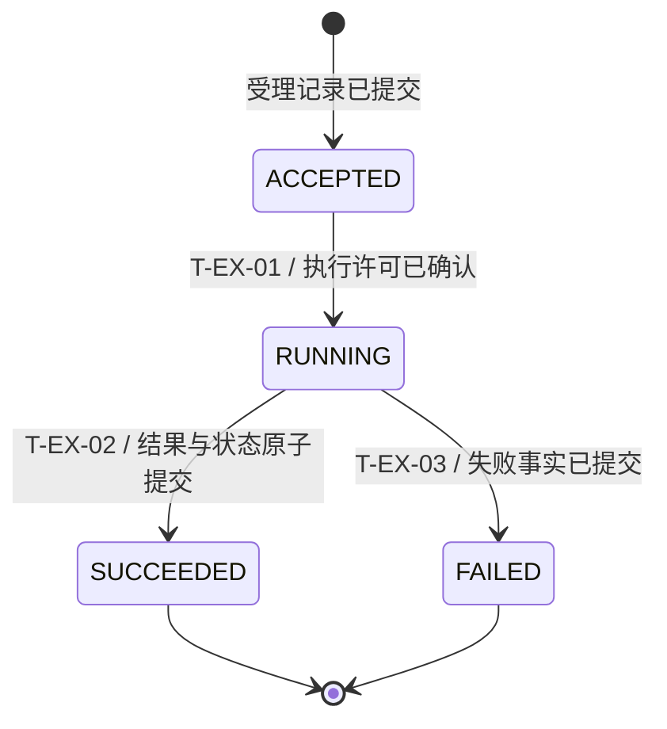

图 M-D3 · 虚构 Target / Planned / NOT_RUN。`T-EX-01` 的 Guard 事实来自权威受理记录与一次执行许可；`T-EX-02` 要求结果已持久提交，不能仅凭完成通知进入 `SUCCEEDED`。此图只演示状态转换写法，未定义取消/重启协议；真实模块有这些能力时须补对应转换、迟到事件和失败出口，并在 §10 用同一 Transition ID 推演。

<!-- STD_TEMPLATE_EXAMPLE_END -->

### 6.7 数据库表结构（适用时）

<details>
<summary>本节编写建议、规范与示例</summary>

**本节目的**：定义本层实际拥有的持久表，使该类数据可由下级直接承接。

**必须写清楚**：列、类型、主键/索引、约束、事务边界和迁移版本；逐结构记录 Data/Type ID、固定来源、字段、所有权与寿命、合法和拒绝实例及验证。

**编写规范**：只读外部数据库时引用其唯一来源，不自创表定义。本类别不适用时在章首说明原因和 tailoring 依据，不保留空小节。如果字段已有机器定义，应固定版本并逐项核对；教学例子不得成为项目默认值。

**抽象示例**：inspection_jobs 在承诺受理前完成事务提交；示例只说明写法，不是项目的机器契约。

**完成条件**：冲突、崩溃和升级后的表状态可核查，且没有与其他章节重复维护同一字段定义。

</details>

<!-- 编写建议：仅对实际拥有的持久表逐列写类型、键、索引、约束、事务边界和迁移规则。虚构例子：inspection_jobs 在受理回复前完成约定的持久提交。 -->

#### 6.7.N `<真实结构名>`

- **完整定义、Data/Type/Error ID 与唯一来源**
- **逐字段/逐值类型、范围、含义与跨字段约束**
- **生产/修改、所有权、可见点、寿命及失败出口**
- **合法与拒绝实例、V/Case 与证据状态**

<!-- STD_TEMPLATE_EXAMPLE_BEGIN -->
**6.7.1 `inspection_jobs`（数据库表，虚构）**

```sql
CREATE TABLE inspection_jobs (
  task_id TEXT PRIMARY KEY,
  generation INTEGER NOT NULL CHECK (generation >= 1),
  state TEXT NOT NULL,
  result_uri TEXT NULL,
  CHECK ((state = 'SUCCEEDED' AND result_uri IS NOT NULL)
      OR (state <> 'SUCCEEDED' AND result_uri IS NULL))
);
```

- **Data/Type ID、用途与来源**：

  `DATA-EX-JOBS-TABLE`；保存任务的可恢复事实，示例 DDL 状态为 `Proposed`。真实系统须以受控迁移文件/Schema 的固定版本为机器权威，并说明数据库产品与约束支持情况。

- **`task_id`**：

  非空主键，对应任务身份。

- **`generation`**：

  正整数，用于防止旧更新覆盖。

- **`state`**：

  非空，采用 §6.1 枚举的持久编码；实际编码映射须固定。

- **`result_uri`**：

  可空，仅在成功终态非空。此例没有声称存在查询索引，真实查询路径应决定索引。

- **事务与生命周期**：

  唯一写入责任单元在承诺“任务已受理”前提交首条记录；状态与结果引用在同一事务中更新。崩溃后以已提交行恢复，不以页面缓存推断提交。保留期限、删除权限和数据迁移版本必须由项目确定。

- **合法/拒绝实例**：

  `('t-7', 2, 'SUCCEEDED', 'result://7')` 在结果已发布时合法；`('t-8', 1, 'SUCCEEDED', NULL)` 违反约束，应拒绝且不得提交部分终态。

- **验证**：

  `V-EX-JOBS-01` 覆盖约束拒绝、提交失败与崩溃恢复；本例 `NOT_RUN`。

<!-- STD_TEMPLATE_EXAMPLE_END -->

### 6.8 错误码与错误结构（适用时）

<details>
<summary>本节编写建议、规范与示例</summary>

**本节目的**：定义本层拥有的错误数据并承接公共码，使该类数据可由下级直接承接。

**必须写清楚**：逐码含义、载荷、触发事实、结果状态和下级用法；逐结构记录 Data/Type ID、固定来源、字段、所有权与寿命、合法和拒绝实例及验证。

**编写规范**：公共错误沿用系统唯一来源，私有异常越界前映射。本类别不适用时在章首说明原因和 tailoring 依据，不保留空小节。如果字段已有机器定义，应固定版本并逐项核对；教学例子不得成为项目默认值。

**抽象示例**：QUEUE_FULL 表示本次任务未受理，不等于执行失败；示例只说明写法，不是项目的机器契约。

**完成条件**：接口每个失败出口均指向已定义错误及验证，且没有与其他章节重复维护同一字段定义。

</details>

<!-- 编写建议：公共错误码继承系统逐码定义，本模块写产生、透传或转换责任；私有错误不可冒充公共码。虚构例子：QUEUE_FULL 表示本次任务未受理，与执行失败不同。 -->

#### 6.8.N `<真实结构名>`

- **完整定义、Data/Type/Error ID 与唯一来源**
- **逐字段/逐值类型、范围、含义与跨字段约束**
- **生产/修改、所有权、可见点、寿命及失败出口**
- **合法与拒绝实例、V/Case 与证据状态**

<!-- STD_TEMPLATE_EXAMPLE_BEGIN -->
**6.8.1 `InspectionErrorCode`（公共错误码枚举，虚构）**

```text
enum InspectionErrorCode { INVALID_REQUEST, REQUEST_CONFLICT, PERMISSION_DENIED, QUEUE_FULL }
```

- **Data/Type/Error ID、来源**：

  枚举 `DATA-EX-ERROR-CODE`；各值分别为 `ERR-EX-INVALID-REQUEST`、`ERR-EX-REQUEST-CONFLICT`、`ERR-EX-PERMISSION-DENIED`、`ERR-EX-QUEUE-FULL`。示例机器源为 `Proposed: InspectionErrorCode`。正式项目须固定实际 Error enum/Schema 的代码值、版本和核对结果，不把教学名称当作已分配码。

- **`INVALID_REQUEST`**：

  必填字段缺失、值不合法或引用不可读取；校验在创建任务前结束，调用方修正输入，不得原样重试。

- **`REQUEST_CONFLICT`**：

  已有相同 `request_id`，但图像或规则版本不同；不创建第二任务，调用方核对原请求身份，不得换 ID 绕过冲突。

- **`PERMISSION_DENIED`**：

  当前身份无权提交该请求；在创建任务前拒绝，调用方取得授权后才可重新提交。

- **`QUEUE_FULL` 的含义与边界**：

  受理队列达到确定上限，本次请求未受理且未创建任务；不表示已受理任务执行失败，也不表示结果未知。其他未知码不得擅自映射为 `QUEUE_FULL`。

- **触发、结果与副作用**：

  权限与输入校验先于冲突和容量判定；受理责任单元在入队前依据权威队列容量事实判定 `QUEUE_FULL`。以上错误均不得创建新任务或占用其执行资源；仅 `QUEUE_FULL` 可在接口规定的期限内按同一请求身份重试，不能把重试理解为已有任务恢复。

- **下级承接与载荷**：

  受理模块产生这些码，边界适配模块可透传，界面按错误码提示修正、授权、核对原请求或稍后重试；错误响应使用下方同节定义的 `InspectionError`，其中 `task_id` 必须为空。

- **合法/拒绝实例与验证**：

  队列满且无新任务时返回 `QUEUE_FULL` 合法；任务已创建却返回此码必须拒绝。`V-EX-QUEUE-01` 核对触发事实、错误码和无副作用，本例 `NOT_RUN`。

<!-- STD_TEMPLATE_EXAMPLE_END -->

<!-- STD_TEMPLATE_EXAMPLE_BEGIN -->
**6.8.2 `InspectionError`（错误载荷结构，虚构）**

```text
InspectionError {
  code: InspectionErrorCode,
  request_id: string?,
  task_id: string?
}
```

- **Data/Type ID、用途与来源**：

  `DATA-EX-ERROR`；表示一次请求的错误响应。示例机器源为 `Proposed: InspectionError`；正式设计须固定错误载荷 Schema 及其版本。

- **`code`**：

  必填，取本节 `InspectionErrorCode` 的已定义值；本结构不重新分配错误码。

- **`request_id`**：

  字段必填、值可空；输入有合法 `request_id` 时原样返回，输入缺失或 ID 自身无效导致 `INVALID_REQUEST` 时为 `null`。其他三个错误码必须携带非空原请求 ID。

- **`task_id`**：

  可空字符串；上述四种错误都表示本次未创建任务，因此必须为空。响应丢失造成的结果未知不是本错误载荷，须用原 `request_id` 查询权威结果。

- **约束与生命周期**：

  错误响应由边界适配单元构造，并随本次请求返回；日志可保留关联身份，但敏感信息不得未经授权复制到载荷。实际编码与长度由 Schema 固定。

- **合法/拒绝实例**：

  `{code:QUEUE_FULL, request_id:"req-7", task_id:null}` 在确实未受理时合法；本次任务已创建却返回任何上述错误码都属语义错误，必须阻断。

- **验证**：

  `V-EX-ERROR-01` 检查字段条件、关联身份和敏感信息边界；本例 `NOT_RUN`。

<!-- STD_TEMPLATE_EXAMPLE_END -->

## 7. 主流程与数据流

<details>
<summary>本节编写建议、规范与示例</summary>

**本节目的**：把内部组件组织成可执行过程，说明真实输入怎样成为结果，以及中途失败如何结束。

**必须写清楚**：登记全部重要过程及适用性，每个重要流程都要有流程图或时序图、连续正文和异常分支，并完成图文核对。按实际过程在本章扩展子节，至少贯通代表业务；初始化、配置生效、取消/停止按实际责任展开，不存在的过程解释边界。流程图表达业务判断和状态变化，§5.2 的内部调用过程表达文件/组件谁调谁、传什么；两者必须引用同一 Process/Call/IF ID 并核对一致，不能互相替代。

**编写规范**：图节点用实际执行者/动作/判定，连线注明数据、调用或事件。步骤说明数据形态、执行上下文、状态变化、输出可见点、清理与错误；每个等待给产生事实的动作、判定来源、期限和合法出口。架构图、职责表、文字箭头链或 Stage DAG 不能替代过程图。简单同步过程也画正常和拒绝路径，复用图须明确覆盖哪些过程与分支。

**抽象示例**：同一筛选调用先检查数量再校验每条记录，重复即失败，只有全部合法才筛选排序；不能在图中先返回部分结果而正文声称原子返回。

**完成条件**：使用具体输入按图推演，正常、错误和适用的并发/取消均走到结果与清理，没有跳过未知判定。过程清单不漏图，图与接口、状态和算法的顺序及错误一致。

</details>

<!-- STD_TEMPLATE_EXAMPLE_BEGIN -->
**主要流程图例：公开入口到返回与清理**

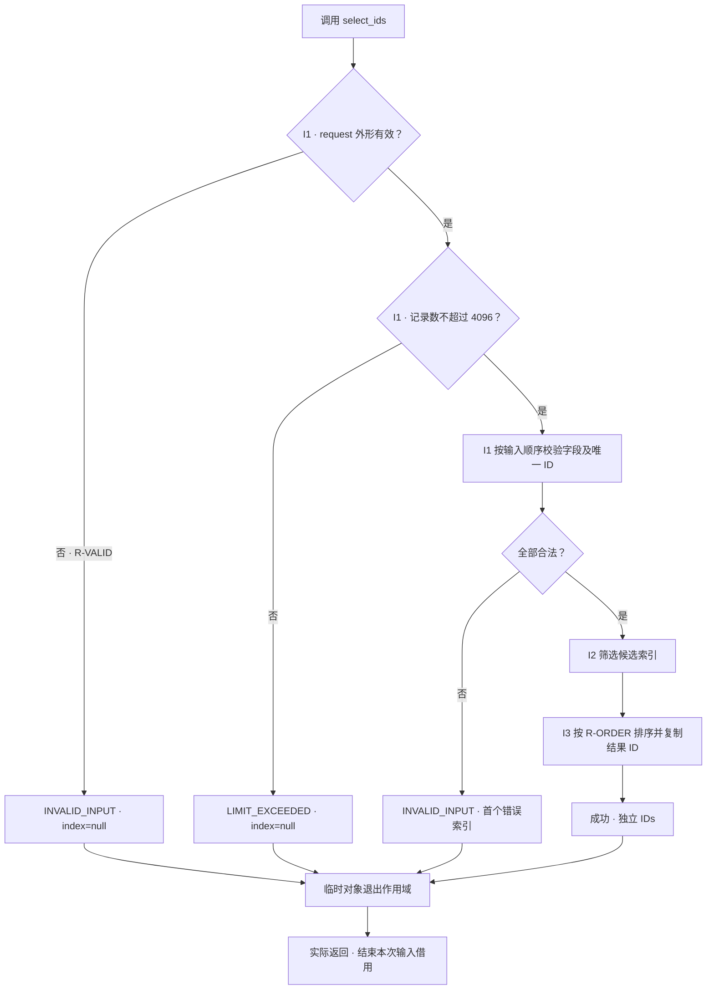

图 M-P1 · EX-MODULE/v1 · Target / Planned / NOT_RUN。公开操作 P-SELECT 的正常、数量超限、结构非法和逐记录非法分支在同一图中展开。
菱形所需事实来自当前请求及 I1 按 R-VALID 的校验结果，不依赖远端等待或无来源的“确认安全”。
失败不再执行筛选/排序，已建立临时对象退出作用域；成功结果独立于临时存储。空输入沿正常分支返回空 IDs。

以文末三条记录请求为例，I1 校验全部三条、I2 得到候选索引 [0,1]、I3 返回 [a1,b2]；若第三条改成重复 a1，
I1 直接产生 index=2 的 INVALID_INPUT，不能因其类别不匹配而绕过校验。具体排序算法见 §8，不在总流程图中掩盖判断。

| Process ID | 正文 / 图 | 代表正常路径 | 代表错误路径 |
|---|---|---|---|
| P-SELECT | 本段 / M-P1 | 完整校验 → 筛选 → 排序 → 独立返回 | 输入或数量拒绝 → 清理已有临时对象 → 类型化错误 |

本案例没有独立初始化、配置生效或停止 API；真实模块若有这些重要过程，须各自补图、正文、异常分支及核对，不以本例只有一条流程作为裁剪依据。
<!-- STD_TEMPLATE_EXAMPLE_END -->

<!-- 在此写入本节设计正文；图表汇总结论，不替代方案与依据。 -->

<!-- 下表用于多过程的短值横向比较；单个过程的长语义留在图和正文，不压进表格。 -->

| Process ID | 触发/适用条件 | 图与正文位置 | 正常/异常出口 | 接口/规则/验证项 |
|---|---|---|---|---|

| Step | 输入 | 执行位置 | 处理/规则 | 输出/状态变化 |
|---|---|---|---|---|
| 1 | <!-- TODO --> | | | |

## 8. 关键算法与业务规则

<details>
<summary>本节编写建议、规范与示例</summary>

**本节目的**：确定不可随意改变的判定、顺序和处理方法，并说明算法选择依据。

**必须写清楚**：输入前提、计算/查找/排序或调度规则、边界、复杂度和资源需求。复杂或易歧义逻辑给伪代码和同一输入的中间值，说明哪些算法可替换、替换后保留什么保证。

每个重要算法必须有算法图、连续正文和具体输入推演，必要时配伪代码；核对分支条件、中间值、循环推进及退出。主流程图不能替代算法内部判断，只有图也不能代替选择依据。简单逻辑说明规则及边界，不为满足图例虚构复杂算法。

**编写规范**：伪代码覆盖决定正确性的非法输入、空集、溢出及适用的并发检查。规则用 Rule ID 唯一维护，其他章引用而非各写一种优先级。简单 CRUD 无需虚构算法，但仍定位校验、权限和冲突政策，说明无新增算法的理由。

**抽象示例**：筛选结果按 priority 降序、id 升序比较，不依赖哈希迭代顺序；固定 ASCII ID 避免本地语言排序差异。用同优先级反序输入检查第二排序键，不能用“稳定排序”四字替代比较规则。

**完成条件**：另一位作者能依据正文算出相同输出和失败结果，复杂度与 §12 负载口径一致，不需要从语言默认行为猜业务语义。

</details>

<!-- STD_TEMPLATE_EXAMPLE_BEGIN -->
**算法图例：候选索引的归并排序**

R-ORDER（本案例唯一规则位置）：I1 完整校验通过后，I2 按请求 kind 筛选，I3 按 priority 数值降序、同值按 id 的 ASCII 升序排列。
无匹配返回空 IDs。此处选归并排序，输入是已经校验的 records 与候选索引，不重新改变 R-VALID 的错误顺序。

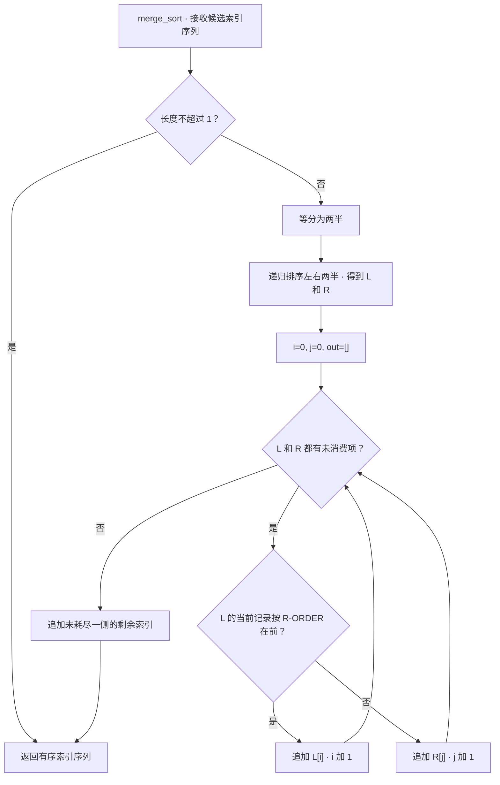

图 M-ALG1 · EX-MODULE/v1 · Target / Planned / NOT_RUN。菱形读取序列长度、游标及记录比较键；每轮恰消费一项，
所以合并循环可终止。空集与单元素走基线出口，所有候选经过比较后返回有序索引，再由 I3 复制对应 ID 形成独立结果。
类型/重复 ID 的业务错误已经由 M-P1 的 I1 拒绝，不在排序中另加含糊的“失败重试”。

```text
before(a, b):
    if records[a].priority != records[b].priority:
        return records[a].priority > records[b].priority
    return records[a].id < records[b].id       # ASCII 顺序；I1 已保证 ID 唯一

merge_sort(indices):
    if len(indices) <= 1: return copy(indices)
    L = merge_sort(first half); R = merge_sort(second half)
    i = 0; j = 0; out = []
    while i < len(L) and j < len(R):
        if before(L[i], R[j]): append L[i] to out; i += 1
        else: append R[j] to out; j += 1
    append remaining L[i:] and R[j:] to out
    return out
```

文末请求的两个候选先分成 [b2] 和 [a1]；priority 相同，ASCII 比较选择 a1，随后追加 b2，最终为 [a1,b2]。
选择归并的代价是额外工作区；k 个匹配项的比较为 O(k log k)，工作区峰值 O(k)，递归栈 O(log k)。
上述峰值以深度优先求值、每层合并后及时释放子数组为前提，不能将所有递归中间结果长期保存；具体字节开销待 §12 量测。
R-ORDER 是外部可观察规则，归并仅是本地实现选择；换等价算法需重新证明顺序、边界与资源，不需重新发明公共语义。
<!-- STD_TEMPLATE_EXAMPLE_END -->

<!-- 在此写入本节设计正文；图表汇总结论，不替代方案与依据。 -->

<!-- 规则是独立多字段记录，逐项使用固定格式段落。 -->

#### 8.N `<Rule ID>` · <算法或业务规则名称>

<!-- 编写建议：将算法画成能反映判断与循环出口的流程图，再用一组代表输入逐步推算中间值、输出和错误。写出选择依据、边界、复杂度与资源上限；“按规则计算”或只放公式不足以让实现者处理异常输入。 -->

- **输入前提 / 适用条件**

  <!-- TODO -->
- **算法 / 规则 / 选择依据**

  <!-- TODO -->
- **结果 / 不变量 / 边界**

  <!-- TODO -->
- **复杂度 / 资源限制**

  <!-- TODO -->
- **允许替换范围 / 不可改变保证**

  <!-- TODO -->
- **具体输入推演 / 验证项**

  <!-- TODO -->

## 9. 接口设计

<details>
<summary>本节编写建议、规范与示例</summary>

<!-- 接口分类编写建议与教学例子；生成文档时按实际接口保留适用类别。
只保留真实存在的接口类别；不适用类别说明边界与 tailoring 依据。每个接口以真实函数、路由、消息或端口名为标题，下面先给完整的代码式声明，再在同一小节写输入、输出、逐条件错误、交互和验证。以下均为虚构示意：

| 可选类别 | 具体接口示例（均为虚构） | 适用条件与结果语义 |
|---|---|---|
| API | `submit_inspection(request: InspectionRequest) -> InspectionSubmission \| InspectionError` | 实际提供函数/端点时采用；合法请求返回 `task_id=t-7`，非法请求返回 `INVALID_REQUEST` |
| 消息与数据流接口 | `frame.ready(event: FrameReadyEvent) -> DeliveryAck \| DeliveryError` | 实际跨边界发消息时采用；`sequence=42` 被接收则确认 42，队列满则显式拒绝 |
| 硬件与固件接口 | `route_table_write(index:u16, entry:RouteTableEntry) -> WriteAck \| BusError` | 实际拥有寄存器/RTL 边界时采用；写入完成握手后才可读到新表项 |
| 人机与维护接口 | `inspectctl status --task t7 -> TaskStatus \| CommandError` | 实际提供 CLI 时采用；存在任务显示 `RUNNING`，未知任务返回 `TASK_NOT_FOUND` |

接口声明中的类型名必须能直接定位到本模板的数据结构设计章或固定外部机器来源；不要只给 ID 让读者猜输入输出。完整的 `submit_inspection` 虚构示例放在 API 节；请求、成功输出和错误载荷分别在数据结构设计章按归属定义或固定引用，不在接口章维护第二份字段表。


**以下为本层原有编写要求。**

**接口与错误承接**：按实际形态和名称逐接口记录模块提供或继承的 Interface/Member ID、请求/响应/错误类型、固定签名/来源和实现责任；每个失败分支引用系统 Error ID 或私有码的边界映射，写明载荷、结果状态、副作用与合法下一步。§5.3 仅引用同一成员 ID 描述文件间交接。

**本节目的**：使提供方和消费方按同一签名、数据规格与错误语义实现调用，而不只是找到文件名。

**必须写清楚**：操作/成员 ID、request/response/error 角色、固定源版本/revision/hash/selector、完整必需参数、返回与所有权、前提及兼容边界。一套具体请求、成功响应与失败响应关联同一实例；函数按真实签名举例，不凭空增加网络封装。

接口的每个必填输入和输出字段须能定位到 §6 的结构、固定外部机器源，或在本节说明明确的构造规则和事实来源；不能让实现者从函数名猜测实例身份、时间戳或状态标志。共享类型增加、删除或改名字段时，说明这是原合同变更还是本模块私有适配，并核对上下游引用。

**编写规范**：系统公共接口、本层接口与内部 helper 区分唯一维护范围。跨 Owner/对外类型按映射规范绑定项目 interfaces 目录，身份复用封面/metadata，不另造隐藏版本。读取实际机器签名核对角色、完整性，不能把 request/response 互换或漏掉 response；私有 helper 不必升级公共契约。规格未定义是设计缺口，规格完整但代码缺失才是 NOT_IMPLEMENTED，未执行验证是 NOT_RUN。

同一 Interface/Member ID 在上级机制、父设计、本模块和提供方设计中出现时，逐项核对真实名称、参数与类型、互斥返回、错误、结果状态和所有权；发现冲突须给出原文档/版本、差异、裁决 Owner 与受阻范围。提供方尚未接受的 Proposed 接口不能写成已经冻结的 Current 合同，依赖该合同的编码在裁决前不得标为可直接实现。当前实现事实与计划中的设计权威分别引用；被引用的权威文件必须存在并能定位到相应版本或提交。

解释行为和设计意图；需要完整阅读视图时从 OpenAPI、Schema、IDL、ABI 或 register map 生成或逐项核对，不独立维护第二份字段 authority。

按 `docs/interface-data-mapping-standard.md` 复用上级接口族/成员 ID；先读取固定机器源，再按同一基线说明本地职责。
正文的完整字段阅读视图生成或逐项核对，不独立手改一套。§6 数据、§13 实现任务及 §14 验证用同一成员标识。

多个 backend 分别填写，未实现和未运行不从分母删除；若无法满足，回报原 ID、反例和影响，不静默改错误或字段。

**抽象示例**：筛选接口成功是 IDs，重复 ID 失败是 INVALID_INPUT，互斥返回分支都要说明；不能只列 request 类型要求调用方猜错误。文末类型仅为教学投影，不是可直接采用的项目权威目录。

**完成条件**：拿样例逐参数模拟双方调用，接收方能确定对象、含义和下一步；角色、签名、返回分支及设计/实现/验证映射完整。机器检查不替代语义核对。

-->
</details>

<!-- STD_TEMPLATE_EXAMPLE_BEGIN -->
**接口调用图例：公开签名、内部参数与互斥返回**

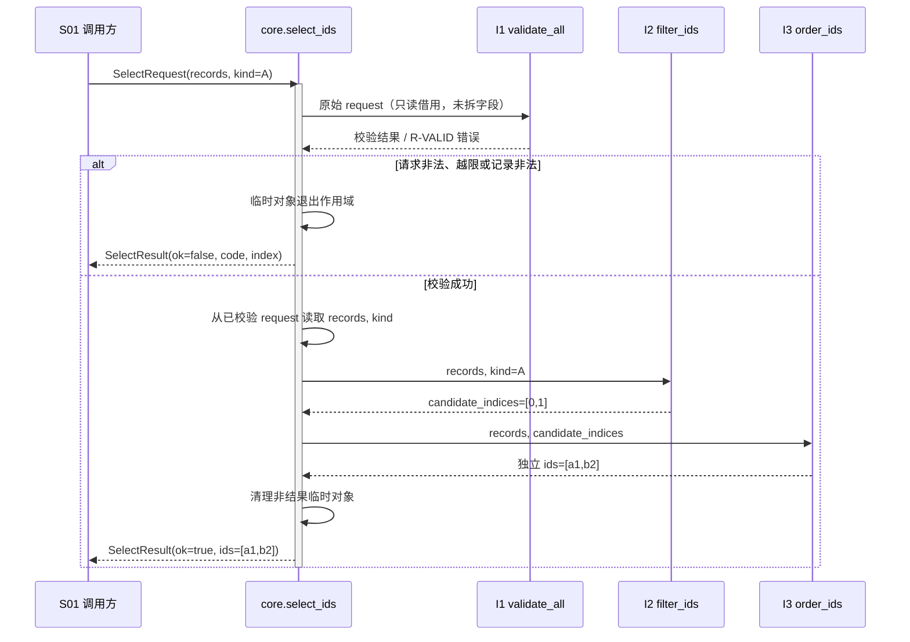

图 M-I1 · EX-MODULE/v1 · Target / Planned / NOT_RUN。实线是同步调用，虚线是返回；I1–I3 在同一调用栈运行，不是远程服务。
公开签名和完整字段以文末 IF-SELECT/v1 为准。图使用同一三条记录请求，参数由入口传入，helper 不能靠隐含全局变量猜对象。
这里 I1 的完整校验包括请求形状和数量检查；失败回传既定错误，入口负责公共结果封装。
入口把原始 request 交给 validate_all(request)，在成功前不取字段、不丢弃额外字段、不做类型转换；否则 I1 无法检查请求本身。缺少 records、额外字段或非对象输入均由 I1 返回 INVALID_INPUT/index=null，不能提前解引用失败或将清洗后的输入当作原请求。
错误分支不再调用 I2/I3，不附候选 IDs；成功返回的 IDs 不借用会被清理的工作区。I1 的私有校验结果不因此变成新公共协议。
<!-- STD_TEMPLATE_EXAMPLE_END -->

<!-- 以下按实际接口形态保留适用类别；每个接口用真实名称作标题，完整合同只写在该记录内。 -->

### 9.1 API（适用时）

<details><summary>编写建议、规范与示例</summary>

**本节目的**：把真实函数或端点的完整可调用合同固定在一处。

**必须写清楚**：名称/签名、来源、输入、输出、错误、交互及验证。

**编写规范**：逐接口成节；字段和公共错误引用唯一权威，不另建清单。输入、输出、错误、交互与验证留在同一记录，不能拆到别章。

**抽象示例**：同请求重放返回原任务状态，不表示新增执行。

**完成条件**：编码者能找到接口、构造调用并解释所有适用结果。

模块以实际函数名、端点或消息名为主索引，Interface/Member ID 用于追踪。公共接口继承父级固定契约；私有文件间接口仅在真实交接处定义，不给每个 helper 编公共 ID。每个接口在一个小节写完，不把寿命、错误或实例移到其他接口小节。标题使用真实限定函数名、完整签名或 HTTP/RPC 路由；同名接口标明所属模块与版本。尚未实现的 symbol 标 Planned，机器目录 location/symbol 保持 null。共享字段引用数据结构章和固定机器源，不另造字段表。纯函数不套异步任务协议；有副作用的接口必须说明结果已知性、重放与安全接管区别。

</details>

#### `<真实函数名、完整签名或 HTTP/RPC 路由>`

<!-- 编写建议：先给完整函数/端点声明，再逐输入参数描述对应 §6 的数据结构及校验；逐输出和错误写触发条件、字段、状态/副作用与下一步。用真实名称而非只有 Interface ID，确保编码者能从签名直接定位契约。 -->

<!-- 先在此放代码式完整声明：函数/端点名称(参数名: 数据结构名, ...) -> 成功数据结构名 | 错误数据结构名；使用项目实际语法、参数名和数据结构名。 -->

- **Interface/Member ID、用途、提供责任与来源**

  <!-- 继承/本层拥有/私有；固定版本、selector/hash -->
- **输入与前提**

  <!-- 参数/请求 Data/Type ID、校验顺序、身份权限、ownership -->
- **成功输出与保证**

  <!-- 返回/响应 Data/Type ID、状态、副作用与寿命 -->
- **错误与合法下一步**

  <!-- 逐条件 Error ID、载荷、结果已知性、查询/重放/停止 -->
- **交互与生命周期**

  <!-- 上下文、同步/异步、并发、超时/取消、版本、释放 -->
- **实现与验证**

  <!-- 真实文件/symbol 或 Planned、合法与拒绝实例、V/Case/Run -->

<!-- STD_TEMPLATE_EXAMPLE_BEGIN -->
**9.1.1 `submit_inspection`（虚构异步受理接口）**

本例复用同一套虚构输入、结果和错误语义；上级或机器源已拥有的公共字段只固定引用，本层不重新分配。

```text
submit_inspection(
  request: InspectionRequest
) -> InspectionSubmission | InspectionError
```

- **Interface/Member ID、用途、提供责任与唯一来源**:
`IF-EX-SUBMIT-INSPECTION`；受理一项图像检测请求，由 `InspectionAdmission` 提供。接口和三个类型均为教学用 `Proposed` 契约；输入与成功输出字段见 §6.2 的 `InspectionRequest`（`DATA-EX-REQUEST`）、`InspectionSubmission`（`DATA-EX-SUBMISSION`），错误码和载荷见 §6.8 的 `InspectionErrorCode`、`InspectionError`（`DATA-EX-ERROR-CODE`、`DATA-EX-ERROR`）。正式项目须换成固定的机器源、版本和成员 selector。

- **输入与前提**
	* `request`：必填,类型 `InspectionRequest`。其中 `request_id` 必须是本次业务请求的稳定身份；`image_uri` 必须指向调用身份有权读取的有效图像；`policy_version` 必须指向已发布规则。先检查身份权限，再检查请求字段、图像引用和规则版本；之后以 `request_id` 原子核对已受理记录：内容相同走重放，内容不同拒绝；只有新请求才检查队列容量并创建任务。字段的类型和跨字段约束只在 §6.2 定义，此处写该接口如何使用它们。

- **成功输出与保证**：
首次受理返回 `InspectionSubmission{request_id:"req-7", task_id:"t-7", disposition:ACCEPTED}`；任务身份和请求关联已持久确定，但检测未必开始。同一 `request_id`、相同图像和规则版本的重放返回原 `task_id` 与 `disposition:EXISTING`，不新增执行；即使原任务仍在运行，也不要求先停止原执行者。

- **错误与合法下一步**：
输入字段或引用无效时返回 `InspectionError{code:INVALID_REQUEST, request_id:<原值或 null>, task_id:null}`，调用方修正请求；同一 ID 携带不同内容时返回 `REQUEST_CONFLICT`，调用方核对原请求，不换 ID 绕过；未获授权时返回 `PERMISSION_DENIED`，须先取得授权；新请求遇队列满返回 `QUEUE_FULL`，本次未受理，可稍后以同一请求身份再试。四种错误均不创建本次任务，码值含义和载荷约束由 §6.8 唯一维护。

- **交互与生命周期**：
这是异步任务的同步受理调用；成功响应不表示检测完成。受理记录对重放可见后才能返回 `ACCEPTED`。调用超时或连接中断且无有效响应时，结果是**未知**，不是 `INVALID_REQUEST` 或 `QUEUE_FULL`；只有权威 `request_id` 判重仍可用时，才允许原请求原样重放并读取原结果，不可换 ID 发起新执行。取消本次网络等待不取消已受理任务。并发同 ID 调用只能产生一个任务；请求身份保留期和兼容版本须由实际系统合同固定，本教学例子不臆造数值。

- **实现分配与验证**：
`InspectionAdmission` 负责权限/输入校验、原子判重、容量判断和任务创建；状态持有者负责后续完成状态。`V-EX-SUBMIT-01` 用合法首次请求、同 ID 同内容重放、同 ID 异内容、无权限、无效图像、队列满和响应丢失向量检查返回类型、错误码与任务数量；教学例子未执行测试，不代表真实系统通过。

本例仅示范接口记录应达到的粒度；不能把 `Proposed` 类型、示意成员名或未运行的验证项复制为项目已批准契约。
<!-- STD_TEMPLATE_EXAMPLE_END -->

### 9.2 消息与数据流接口（适用时）

<details><summary>编写建议、规范与示例</summary>

**本节目的**：固定组件或系统为协作而交换的命令、状态、消息及连续数据的格式与交接行为；内部协作即使使用 HTTP/RPC，也在本节定义，面向使用方的 API 留在 §9.1。

内部协作使用 HTTP/RPC 时，以实际 method + route 或 RPC 方法为标题，在同一记录说明请求/响应、鉴权、协议状态与业务错误映射、超时和版本；不得因传输形式把同一接口再放入 §9.1。

**必须写清楚**：消息身份、格式、确认、顺序、背压、丢失及验证。

**编写规范**：以真实 topic/流名逐接口成节，字段只引用数据结构章。把确认、背压、丢失和恢复与该流的正常及异常实例写在同一记录。

**抽象示例**：队列已满时拒绝新消息并返回可判定错误，不默默丢弃。

**完成条件**：两端能用相同关联身份解释正常与异常交付。

按真实 topic、消息、队列、流或文件交换名称逐项成节。同节描述生产/接收责任、Data/Type ID、编码、边界与顺序、确认、积压/背压、重复/丢失/迟到、停启和错误；不得把消息字段或异常语义留到另一章。用同一关联身份完成正常及失败实例。

</details>

#### `<真实协作端点、消息、topic、队列或流名称>`

<!-- 编写建议：按真实消息名写完整载荷类型、序号/关联 ID、发布/受理/完成的区别，以及重复、丢失、延迟和队列满时的处理。字段引用 §6，不在消息章节另造一套结构。 -->

<!-- 先在此放代码式完整声明：消息/流名(输入数据结构名) -> 确认或输出数据结构名 | 错误数据结构名；使用项目实际语法、参数名和数据结构名。 -->

- **Interface/Member ID、用途、责任与唯一来源**

  <!-- TODO -->
- **输入、输出及关联身份**

  <!-- Data/Type ID、编码、消息边界、确认 -->
- **交互、错误及生命周期**

  <!-- 顺序、流控、超时、重复、取消、释放 -->
- **实现与验证**

  <!-- 位置/状态、正常及异常实例、V/Case/Run -->

### 9.3 硬件与固件接口（适用时）

<details><summary>编写建议、规范与示例</summary>

**本节目的**：固定真实物理或逻辑硬件交接而不虚构设备。

**必须写清楚**：端点、方向、位宽/电气、时序、复位、错误及验证。

**编写规范**：机器寄存器或接口控制文件保持唯一权威；纯软件按 tailoring 省略。实际端点的电气、时序、错误与验证须集中在同一接口记录。

**抽象示例**：复位未完成时 READY 无效，接收端不得采样。

**完成条件**：两端能按同一约束连接并验证异常时的安全状态。

仅在本子系统或模块实际拥有硬件/FPGA/固件边界时使用；纯软件按 tailoring 省略，不虚构寄存器。每条连接在一处定义端点、方向、连接器/管脚、标准版本与项目选项、位宽/电气、时钟复位、握手、错误和验证。既有 register map 或接口控制文件保持唯一机器权威。

</details>

#### `<真实连接、总线、寄存器组或端口名称>`

<!-- 编写建议：只有模块实际跨软硬件边界时采用，写出方向、信号/寄存器类型、前提、握手、超时和错误映射。位域与电气定义引用唯一权威；纯软件模块写明不适用，不发明“设备接口”。 -->

<!-- 先在此放代码式完整声明：端口/连接名、方向、信号或寄存器类型/位宽、状态或错误输出；使用项目实际语法、参数名和数据结构名。 -->

- **Interface/Member ID、用途、端点与来源**

  <!-- TODO -->
- **输入输出与物理约束**

  <!-- Data/Type ID、方向、管脚、位宽、电气、时序 -->
- **交互、错误与恢复**

  <!-- 时钟复位、握手、超时、异常、释放 -->
- **实例与验证**

  <!-- 正常/边界时序、V/Case/Run -->

### 9.4 人机与维护接口（适用时）

<details><summary>编写建议、规范与示例</summary>

**本节目的**：让用户或维护者知道在哪里对哪个对象怎样操作。

**必须写清楚**：入口、身份、目标、输入、反馈、错误、退出及验证。

**编写规范**：以实际页面操作或命令逐项成节，不凭模板新增入口。执行位置、目标选择、权限、反馈和失败出口须连续呈现，不另建命令表。

**抽象示例**：未知目标返回拒绝，不自动改选其他实例。

**完成条件**：非作者能执行代表操作、解释结果并安全退出。

按实际 UI 操作、CLI 命令、诊断入口逐项完整描述，不为满足模板新增命令。写清在哪里执行、控制哪个对象、权限及前置、输入/默认、反馈/退出码、运行影响、审计和恢复；统计口径引用唯一来源。

</details>

#### `<真实页面操作、命令或诊断入口>`

<!-- 编写建议：给出用户可执行的完整动作或命令及参数，再说明权限、目标对象、返回反馈、错误提示、超时和审计。操作面语义与 §3 一致，本节集中定义具体接口，不把同一个命令的输入输出拆散。 -->

<!-- 先在此放代码式完整声明：页面操作/CLI 命令及参数名: 数据结构名 -> 反馈数据结构名 | 错误数据结构名；使用项目实际语法、参数名和数据结构名。 -->

- **Interface/Member ID、用途、提供责任与来源**

  <!-- TODO -->
- **执行位置、目标与输入**

  <!-- 环境、身份、参数或控件、前置 -->
- **输出、错误与交互**

  <!-- 反馈、超时/取消、作用范围、审计、退出 -->
- **实例与验证**

  <!-- 正常及拒绝调用、V/Case/Run -->

## 10. 并发、失败与恢复

<details>
<summary>本节编写建议、规范与示例</summary>

**本节目的**：保证同时调用、异常和停止时仍遵守契约，不用“线程安全、幂等重试”代替设计。

**必须写清楚**：实际执行上下文、可重入范围、共享对象/锁或同步手段、锁顺序和持有期间允许操作；超时/取消传播、部分执行、迟到响应、重启、过载及释放规则。无共享可变状态时说明事实与调用者义务，不虚构线程池或分布式锁。

先与 §3、§5.4、§6.6、§6.7 做事实联动：常驻宿主必须覆盖启动/就绪/停止及在途调用；跨步骤状态必须引用 §6.6 的转换 ID 和不变量；持久写入必须覆盖事务边界、持久提交点、崩溃后恢复入口及同请求重放。某项确实由宿主而非本模块承担时，写明宿主文档/接口、交接事实和组合验证，不用 N/A 消掉责任。对每个适用触发事实至少推演一条失败或交错路径。

**编写规范**：有副作用时区分结果已知性、访问安全、操作终态、资源释放、重新准入。区分四种动作：状态查询只读原操作；同请求重放须核对同一身份和完整参数，由权威幂等记录返回原状态/结果而不新增执行，原执行者可继续运行；执行者接管涉及执行权转移，须保证旧执行者已停止或被可靠隔离；新业务重试须依据原结果及业务政策重新准入，可能重复副作用时仍须满足安全执行与去重条件。不能换 key 绕过未知结果，也不能把查询或不新增执行的重放一律要求先停止。记录去重范围、有效期、冲突参数和记录过期后的处理。停止/取证事实由谁以什么证据和期限判定必须可执行；无法确认时保留阻塞或按已有人工路径处理，不伪造恢复机制。推演互相等待、提前清理封死未来分支及晚到事件复活旧对象。

只读同步库演练非法输入、同时调用与调用者中断后的实际寿命；有副作用、取证及资源收口的机制才演练证据不可恢复但已安全停止，不给所有模块强加 lease、取证或取消 API。未提供中途取消时说明返回前不会停止，调用者超时不等于本模块结束。

幂等/去重条件必须从实际契约和权威记录核实。异步连续参考位于已采用 STD 源的 `docs/examples/module-async-export-example.md`：它复用真实 Schema/目录，展示受理、执行、通知、消费、释放和取消/迟到/容量拒绝，不能将其物理隔离模型当成项目已有能力。

**抽象示例**：筛选器各调用独享临时集合、借用不可变输入，因此无内部互斥锁；调用者若在后台线程运行后放弃等待，仍须保留输入直至函数返回，不能立刻复用缓冲。

**完成条件**：每个适用失败点有检测事实、处理及最终资源归属；至少推演一组并发交错。完整验证从公开入口开始，不直接篡改内部状态制造释放成功。

</details>

<!-- STD_TEMPLATE_EXAMPLE_BEGIN -->
**并发与中断图例：两次调用互不污染**

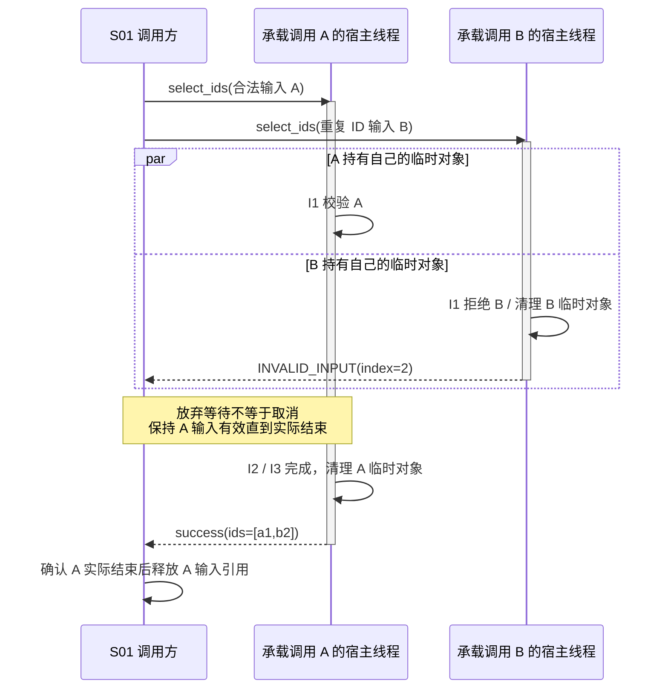

图 M-X1 · EX-MODULE/v1 · Target / Planned / NOT_RUN。线程由宿主测试环境提供，不是 M101 新建的线程池。
这是一种允许交错，不保证 B 总先结束。B 的 seen 和候选区不与 A 共享；B 失败不改变 A 的结果。
“放弃等待”没有向模块发送停止操作，不代表调用已终止。实际返回是结束借用的依据，未取得这一事实前不能复位 A 输入。
同一不可变输入共享给两次调用的变体还须等待全部借用结束，见 M-D1；有副作用模块不得以本只读示例替代安全接管和去重设计。
<!-- STD_TEMPLATE_EXAMPLE_END -->

<!-- STD_TEMPLATE_EXAMPLE_BEGIN -->
**有状态异步服务切片：受理、崩溃和取消（虚构）**

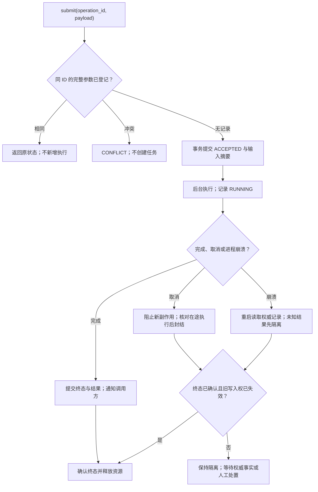

图 M-X2 · 虚构 Target / Planned / NOT_RUN。图只展示必须追问的节点，不提供可照搬的执行权转移政策：受理事务的提交先于 `ACCEPTED` 回复；崩溃后先核对持久事实，不能凭超时自动重跑副作用；取消必须说明谁证明旧执行者已停止或被隔离、何时能释放。实际设计还须在 §6.6 给出每条转换的 Guard 来源与不变量，在 §9 给出 `submit` 的输入、返回和错误，在 §13–14 指向实现及可复现故障测试。完整连续案例见 `docs/examples/module-async-export-example.md`；不得把此图当成项目现有能力。

| 教学转换 | Guard 的事实来源 | 允许的结果 | 不能作的推断 |
|---|---|---|---|
| ACCEPTED → RUNNING | 权威受理记录与执行许可 | 只启动一次执行 | 回复丢失不等于未受理 |
| RUNNING → 终态 | Worker 完成凭据与持久提交确认 | 发布终态并通知 | 通知成功不代替提交 |
| 取消/崩溃 → RELEASED | 旧写入权限失效、终态经权威记录确认 | 释放本操作资源 | 超时或重启本身不证明安全释放 |

这些只是教学事实类型；真实模块须固定生产者、读取入口、期限和失败出口，并用注入点重现提交前/后崩溃与迟到完成。
<!-- STD_TEMPLATE_EXAMPLE_END -->

<!-- 在此写入本节设计正文；图表汇总结论，不替代方案与依据。 -->

<!-- 并发或失败场景是独立多字段记录，逐项使用固定格式段落。 -->

#### 10.N `<Failure / Concurrency ID>` · <场景名称>

<!-- 编写建议：用具体的两条操作交错或一处故障注入描述场景，写清此前已经发生的副作用、结果已知性、锁/事务/lease 保护、退出和释放条件。区分状态查询、同请求重放、执行者接管与新业务重试；不能把所有“重试”套用同一停止条件。 -->

- **初始条件 / 并发交错 / 失败点**

  <!-- TODO -->
- **检测事实 / authority / 期限**

  <!-- TODO -->
- **处理行为 / 副作用边界**

  <!-- TODO -->
- **状态查询 / 同请求重放 / 接管 / 新业务重试**

  <!-- TODO / N/A + 理由 -->
- **最终状态 / 资源归属 / 后续合法入口**

  <!-- TODO -->
- **验证项 / 组合责任**

  <!-- TODO -->

## 11. 安全、权限与可观测性

<details>
<summary>本节编写建议、规范与示例</summary>

**本节目的**：落实安全边界和维护能力，使拒绝、诊断与恢复有实际执行位置。

**必须写清楚**：输入信任、身份与授权继承/检查点、敏感数据及禁止记录内容。实际拥有维护能力时说明日志/统计/trace 的触发、关联 ID、单位、窗口、重置和读取方式；调试命令说明执行环境、身份、目标、影响范围和退出/恢复条件。

**编写规范**：继承上级指标 ID 与口径，诊断不能改变业务结果或引入越权后门；复位副作用回链 §10。没有独立命令、日志或升级器时说明上层怎样得到错误及诊断责任，不因模板新增平台。权限服务失败不能默认放行。

**抽象示例**：筛选器仅返回结构化错误码，不记录输入内容；调用应用负责计数与脱敏日志，不能因此宣称本模块有远程诊断服务。

**完成条件**：一个真实故障在哪里识别、如何安全定位及由谁处理均可说明，不只列日志/指标名称；无能力时给责任出口而非空泛“由平台保障”。

</details>

<!-- 在此写入本节设计正文。 -->

## 12. 容量、性能与运行限制

<details>
<summary>本节编写建议、规范与示例</summary>

**本节目的**：把内部结构和算法转换成可校核的资源需求与运行上限。

**必须写清楚**：输入规模、同时调用数、持久/临时/借用内存、共享开销及峰值重叠，复杂度或排队条件与超限处理；容量估算和延迟实测分开给依据。

适用时固定软件/运行库版本、硬件、虚拟化、依赖和数据规模；分别给初始化、复位、启动、排队/运行、停止、清理的预算、起止事件、计时来源及总期限。并行阶段按关键路径计算总期限，不盲目相加；重试不得重置总期限。区分冷/热启动、并发启动峰值、共享额度扣减与归还、超限拒绝/退避/阻塞出口及责任。纯函数可引用宿主启动与资源预算，不虚构独立生命周期。

使用 LLM 时明确所需能力、模型/服务基线、输入上下文和最大输出规模、请求量、峰值并发、排队与调用预算、取消后的占用和费用/配额边界；超限按已采用策略处理，不擅自新增模型 fallback。

**编写规范**：从 §6 容器与 §8 算法逐项推导，不凭空填吞吐目标。继承 §1.1 原单位、负载和拓扑口径，单调用上限不自动限制全进程并发。实现语言的对象/分配器成本未知时列公式与量测任务，不假装逻辑字节就是实测内存。

按 §1.1 的上级约束和相同负载/模式/拓扑口径推导本单元需求；分解时计入公共开销、共享资源
和峰值重叠。局部预算不足先反馈，不能通过扩大上限或改变系统行为自行消除缺口。

**抽象示例**：n 个输入、k 个匹配项，临时空间为 seen(n)、候选(k)、结果(k) 与排序工作区之和；同时 c 次调用的峰值还需调用方组合校核，不能只计返回 ID。

**完成条件**：资源需求可回查组成和上级分配；未测量项保持未实测，超限不能擅自扩预算、借未计账内存或放宽语义解决。

</details>

<!-- 在此写入本节设计正文；图表汇总结论，不替代方案与依据。 -->

<!-- 容量或性能项是独立多字段记录，逐项使用固定格式段落；仅在比较同口径短值时另建矩阵。 -->

#### 12.N `<Capacity / Performance ID>` · <指标名称>

<!-- 编写建议：从负载和环境条件推导资源与时间预算，给出输入规模、并发、冷/热启动、各阶段耗时、峰值和共享资源扣减。说明超限时拒绝、排队或降级的具体出口；若使用 LLM，列明上下文、请求量、峰值并发和排队预算。 -->

- **目标 / 限制 / 单位**

  <!-- TODO -->
- **适用版本 / 配置 / 硬件 / 虚拟化 / 依赖**

  <!-- TODO -->
- **负载、数据规模与并发口径**

  <!-- TODO -->
- **推导 / 测量方法与证据等级**

  <!-- Modeled / Simulated / Measured -->
- **共享资源扣减 / 峰值重叠 / 余量**

  <!-- TODO -->
- **超限行为 / 责任出口**

  <!-- TODO -->
- **验证项 / Evidence**

  <!-- TODO / NOT_RUN -->

## 13. 实现步骤与文件清单

<details>
<summary>本节编写建议、规范与示例</summary>

**本节目的**：将已确定的方案交给开发，不再次把关键设计问题推迟给开发自行决定。

**必须写清楚**：文件分解与按依赖排列的实现步骤。每个文件记录真实或 Planned 路径、职责、关键 symbol、接口成员/Rule/Constraint ID、实现状态、可选择的局部实现及不可改变行为；步骤记录前置输入、涉及文件、交付结果和检查方法。记录禁止修改的共享接口/邻接模块与需要协调的变更。

明确归属的构建目标、语言/工具链基线、依赖库与版本、编译/链接条件、导出头文件或符号及私有范围；说明宿主如何装配、注入依赖、初始化及销毁，失败时由谁回收，以及如何进入宿主测试目标。纯内部模块引用父级产物与现有测试入口，不强建独立库。给实际或 Planned 构建/测试命令、工作目录、输入条件和预期产物，未选定的关键装配决策列设计缺口。

**编写规范**：接口语义、错误行为和测试向量完成评审后两端可并行实现；各自通过契约测试后集成，组合验收后才关闭父级目标，不能要求真实实现测试通过才能开始实现。文件清单是定位而非批准，本文不自动授予代码修改或提交权限。

**抽象示例**：筛选器类型、核心函数与向量测试各有计划文件；可换等价排序实现，但不得改变比较器、错误优先级或输入不可变约定。

**完成条件**：每项任务有前提、输入及可检查交付，开发不必重新决定公共语义；缺失文件明确标记，不伪造已有 symbol。

</details>

<!-- 在此按固定字段写入；路径/签名较长，不压进宽表。 -->

### 13.1 文件分解（设计 → 代码文件）

<!-- 编写建议：把模块职责映射到真实或 Planned 的仓库相对路径、导出 symbol、构建目标与宿主装配位置。多个文件仍属于同一个模块；纯内部模块可沿用父产物，不必制造独立库。 -->

#### 13.1.N `<repository-relative path>`

<!-- 编写建议：每个文件写明确切职责、承接的功能/接口/规则 ID、导出的类型或函数、依赖和生成方式，并给出最小编译/测试入口。文件尚不存在时标 Planned；不能用任意文件名替代实现组织决定。 -->

- **职责 / 非职责**

  <!-- TODO -->
- **关键 symbol / 导出范围**

  <!-- TODO -->
- **承接 Function / Rule / Constraint / Interface ID**

  <!-- TODO -->
- **构建目标 / 依赖 / 宿主装配**

  <!-- TODO -->
- **实现状态**

  <!-- Planned / Partial / Implemented -->
- **验证入口**

  <!-- TODO -->

### 13.2 实现步骤

<!-- 编写建议：按依赖顺序组织可单独检查的工作单元，先确定公共契约与数据结构，再实现正常路径、错误与恢复，最后集成验证。每步说明完成证据和允许并行的前提；避免“实现模块并测试”这样无法验收的大任务。 -->

#### 13.2.N <步骤名称>

<!-- 编写建议：一项步骤对应具体文件/symbol、上游规则、前置条件、预期代码变化与可执行检查。若接口语义尚未定，先关闭设计缺口而不是分配编码任务。 -->

- **前置输入 / 依赖**

  <!-- TODO -->
- **新增 / 修改文件与 symbol**

  <!-- TODO -->
- **固定语义 / 可自行决定范围**

  <!-- TODO -->
- **交付结果**

  <!-- TODO -->
- **完成检查**

  <!-- TODO -->

## 14. 测试与验收

<details>
<summary>本节编写建议、规范与示例</summary>

**本节目的**：给实现者一套可证伪设计的方法，不把测试类别清单或未执行命令当通过证据。

**必须写清楚**：被测模块 ID 与父对象、设计验证要求 VRC → 可执行 Case → 环境/配置 → Run/证据；具体输入构造、独立 Oracle、边界/失败/并发交错、部署复位、并行隔离及自动执行/失败复现。涉及 LLM 的模块按实际职责说明 prompt/响应构造和判据，不泛化为所有模块必需。

**编写规范**：预期结果不能由被测实现再计算一遍证明自身正确。故障注入标明位置、条件和安全边界，从公开入口验证全路径。只读内存函数可用测试进程和独立输入，无需新服务；外部资源须定义命名空间、清理及复位确认。未实现、NOT_RUN、不适用及失败分别计入覆盖，局部通过不关闭系统组合要求。

测试环境固定 §12 的版本、硬件/虚拟化、依赖、数据规模和冷/热条件；从初始化到清理记录各段耗时、总期限及超限出口，不以 Ready 一个标志代表全部通过。覆盖并发启动峰值、共享资源扣减/归还、复位失败、停止未确认和清理超时；LLM 模块用固定能力/上下文/请求量验证并发、排队和调用预算。无相关能力时指出宿主承担项和组合验证入口。

将 §1.1 的 Constraint ID 与下表的功能/规则一并覆盖，区分本单元证明的范围和仍需上级组合
验证的条件；未实现或未实测可以如实保留，不能把设计分析当作实测 PASS。

在本章建立从来源出发的正向闭环：以 §1.1 适用 Constraint、§2 Function、§7 重要过程、§8 Rule、§9 对外 Interface 与关键错误出口为分母，逐项定位选定方案、§13 真实或 Planned 文件/装配责任和至少一个 VRC/Case；父级组合保证另记组合验证入口。确实不归本模块的项保留来源 ID，指向实际责任方与批准的裁剪决定；关键语义未定则标阻断编码，不能填一个虚构文件或用 NOT_RUN 遮盖。反向核对每个文件与 VRC 所引用的 ID 都存在且适用。同一规则仍在唯一章节维护，本章只保存索引和覆盖判定。

正向覆盖采用一个来源 ID 一条记录；多个 ID 可以指向同一文件或 VRC，但不得合并为一条来源记录，或只写 `A/B/C` 与 ID 范围来声称全部覆盖。逐项比较章节中的来源 ID 集合与 §14.1 记录集合，特别检查重要 Process 和正文实际承接的上级 Constraint；缺项、无主文件、无验证入口或尚未裁决的接口冲突均不能判为闭环。

**抽象示例**：以反序 ID、同 priority 检查精确结果；用不匹配类别中的重复 ID 检查完整校验。合法/非法输入同时调用，检查互不污染、输入不变、错误不携带半成品。

**完成条件**：所有适用功能、过程、约束与错误分支可定位用例及判据，环境能重复建立/隔离/清理；结构回归不代表实际模块已验证。

</details>

### 14.1 正向覆盖与交付闭环

<!-- 编写建议：从上级约束和本模块功能/过程/规则/接口/错误的全集逐项核对，不只从现有文件或测试反查。一个来源 ID 单独成节，多个 ID 可复用同一文件或 VRC，不合并成一条记录。每项定位正文方案、计划或实际实现文件、可证伪的验证项以及父级组合责任；空白或未决合同不是“已覆盖”。不要复制接口或规则定义。 -->

#### 14.1.N `<Constraint / Function / Process / Rule / Interface / Error ID>`

- **来源与适用性 / 固定基线**

  <!-- 来源 ID、版本；适用 / 非本模块责任 / 阻断编码及事实依据 -->
- **选定方案与正文锚点**

  <!-- 精确章节或稳定锚点；不复述权威规则 -->
- **§13 实现文件 / 装配责任**

  <!-- 实际或 Planned 路径；多文件时说明各自责任 -->
- **§14 VRC / Case / 独立判据**

  <!-- 至少一个本地验证入口；未执行标 NOT_RUN，不省略 Expected -->
- **父级组合验证或裁剪/阻断决定**

  <!-- 组合入口；非本模块责任时给 Owner + tailoring/Decision；缺关键规则时给阻断范围 -->

<!-- 完成后反向核对 §13 文件和以下 VRC 的每个来源 ID 都能回到本节适用行；相关 ID 集合无缺项、无幽灵引用。 -->

### 14.2 验证要求与用例

<!-- STD_TEMPLATE_EXAMPLE_BEGIN -->
**验证关系图例：局部设计不自动关闭父级目标**

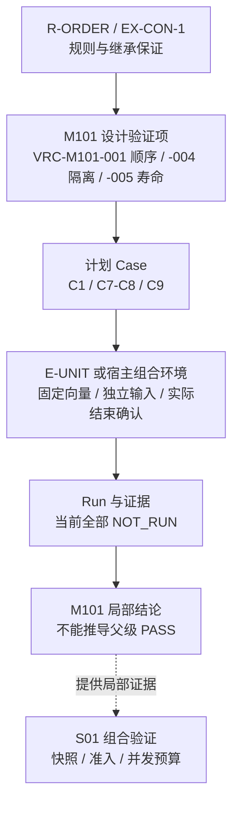

图 M-V1 · EX-MODULE/v1 · Target / Planned / NOT_RUN。实线表示验证承接关系，不是执行流程；虚线表示局部证据输入父级评审。
VRC-M101-001/C1 用固定 [a1,b2] 判顺序；VRC-M101-004/C7-C8 检查并发不污染；VRC-M101-005/C9 需宿主确认实际调用结束，不能只检查“不再等待”。
图只突出三项的关联方式，完整分母仍以文末 VRC-M101-001–006 为准，不能把图外错误/边界用例删去；没有执行记录就没有通过结论。
<!-- STD_TEMPLATE_EXAMPLE_END -->

<!-- 在此写入本节设计正文；图表汇总结论，不替代方案与依据。 -->

<!-- 验证项是独立多字段记录，逐项使用固定格式段落。 -->

#### 14.2.N `VRC-<MODULE>-<nnn>` · <验证要求名称>

<!-- 编写建议：逐条写可执行的输入构造、独立 Oracle、Expected、环境/隔离条件和证据位置，覆盖正常、边界、失败及恢复。计划用例和已运行结果分列，模块局部通过不能替代父级组合验收。 -->

- **覆盖 Function / Rule / Constraint / Interface**

  <!-- TODO -->
- **Case / 正常、边界与失败输入**

  <!-- TODO -->
- **环境 / 配置 / 隔离与复位**

  <!-- TODO -->
- **独立 Oracle / Expected**

  <!-- TODO -->
- **Actual / Evidence / Run ID**

  <!-- TODO / NOT_RUN -->
- **Verdict / 状态**

  <!-- NOT_RUN / BLOCKED / FAIL / PARTIAL / Verified -->
- **父级组合验证交接**

  <!-- TODO -->

## 15. 风险、未决问题与引用

<details>
<summary>本节编写建议、规范与示例</summary>

模块设计确定可观察行为、公共接口、算法规则、不变量、预算和失败语义；ISD细化准确文件/symbol、私有类型、语言表示、调用/锁/清理步骤、装配及测试入口。模块已具有这些细节时兼作，不另写重复文档。metadata以design_object_id固定模块，implementation_specification登记embedded/separate/not_required/missing及信息项覆盖映射，格式见ISD规范。不能因建立ISD推迟模块行为决定。

兼作时为已存在的信息章节添加稳定锚点，覆盖映射指向本文件；独立时指向唯一ISD入口及其分卷。入口保留isd-handoff六列承接矩阵；安全/持久化适用时使用七列实现表，验证使用Expected/Actual/Verdict/Run八列表，可复用ISD模板的栏目。记录较宽时按通用固定格式段落规则表达，不丢字段。运行validate-design --check-isd-delivery检查交付槽位；基础草稿校验不表示已交付。
**本节目的**：集中管理阻止设计完成的具体问题和来源，避免每节用待办掩盖核心方案缺失。

**必须写清楚**：未决项影响的规则/接口/流程/约束、事实缺口、可行选项、裁决责任、关闭条件与下一步取证行动；固定来源与已采用决定，区分设计、实现及测试缺口。

**编写规范**：选定方案后回写唯一规则位置，同时复查接口、状态表、图、算法、资源与验证，列出尚存旧语义。一个规则不在多章独立维护。`<MODULE>` 取父设计对象登记表为本模块固定的命名空间 token：可采用正式短名（如 `API`）或对象 ID（如 `M001`），项目选定一种后须在本模块所有 ID 中一致使用并保持可反查映射，不能混用。新建模块记录分别使用功能 `F-<MODULE>-<nnn-or-name>`、接口 `IF-<MODULE>-<nnn>`、验证要求 `VRC-<MODULE>-<nnn>`、风险 `RISK-<MODULE>-<nnn>` 和约束 `CON-<MODULE>-<nnn>`；Process、Case 等其他项目命名空间按其规范登记，不能与上述类别复用前缀或只靠补零区分。已采用历史 ID 不静默重命名，而是在登记处注明类型及映射。编写记录与产品设计分开，编辑指令不转写成产品事实；项目未主动要求时不检查或追随新 STD/模板版本。

关键机制或判定方法未定时，先在相关节做“输入与约束 → 选项 → 正常/失败推演 → 推荐与代价
→ 未决项”的预设计；复杂问题复用 `evaluation.technical-analysis`，不强制另建文档。选择后
回写正文、§1.1 承接与验证映射。关键机制未定不能判设计完成，不受该决定影响的工作可继续。
逐节收口检查实际决定、依据、继承/分配约束、自由度及承接检查位置，不能用五句口号代替正文。

**抽象示例**：语言未定导致对象开销待量测可记录任务及预算风险；错误输出未定是接口设计缺口，不能一律标 NOT_IMPLEMENTED。排序规则唯一维护在 §8，流程及测试引用 Rule ID。

**完成条件**：每个关键未决问题有解决路径且未冒充设计完成；正式正文通过新读者、具体调用和图文一致性复审，编写残留已移出。

</details>

<!-- ISD 采用登记是一条多字段记录，使用固定格式段落。 -->

#### 15.ISD · 实现规格采用方式

<!-- 编写建议：明确填写 embedded、separate、not_required 或 missing 及其依据；embedded 时逐项映射 ISD 必需信息在本模块设计的章节，separate 时指向唯一 ISD Document ID，missing 则登记阻断。不能把“没有 ISD 文件”自动解释为已兼作。 -->

- **采用模式**

  <!-- embedded / separate / not_required / missing -->
- **模块对象 ID**

  <!-- TODO -->
- **实现规格 Document ID**

  <!-- embedded 时为本文 Document ID；separate 时为独立 ISD -->
- **metadata 覆盖映射入口**

  <!-- §5/§6/§9/§10/§13/§14 的实际稳定锚点或覆盖清单 -->
- **理由 / 决定引用**

  <!-- embedded 仅在本文已覆盖 ISD 必需信息时采用；覆盖不足时改为 separate 或 missing -->

<!-- 在此写入本节设计正文；图表汇总结论，不替代方案与依据。 -->

<!-- 风险或未决问题是独立多字段记录，逐项使用固定格式段落。 -->

#### 15.N `RISK-<MODULE>-<nnn>` 或 `<Open ID>` · <问题名称>

<!-- 编写建议：记录具体未决设计问题或风险反例、影响的功能/接口、Owner、最晚关闭 Gate、分析入口和决定引用。未实现与未验证可保留状态；关键机制未决定则不得声称设计完成。 -->

- **类型 / 影响的规则、接口、流程或约束**

  <!-- Risk / Open Question / Decision -->
- **事实缺口 / 触发条件**

  <!-- TODO -->
- **影响 / 阻塞边界**

  <!-- TODO -->
- **Owner / 最晚关闭 Gate**

  <!-- TODO -->
- **选项 / 推荐 / 下一步取证**

  <!-- TODO -->
- **关闭条件 / 决定或当前状态**

  <!-- TODO -->

## 附录 A. 机制承接表

<details>
<summary>本节编写建议与规范</summary>

**本节目的**：从本模块视角横向核对它在全部系统机制中承担的责任，并把机制要求落实到正文、接口、代码文件/symbol 与验证；不按机制顺序重写模块正文。

**必须写清楚**：每个来源机制第 14.4 节的稳定要求、本文落实位置、固定与可自行决定的边界、提供/消费接口、计划或实际代码落点，以及局部和组合验证交接。

**编写规范**：本章是承接侧，固定字段与机制第 14.4 节对齐。一个模块承接多个机制时逐项登记；标题必须使用 Mechanism Document ID + 机制第 14.4 节的精确 Requirement ID，不得只写章节号或复述文字。同一要求只引用机制 authority，不复制规则。机制尚未设计、规格缺失和代码 `NOT_IMPLEMENTED` 分别记录，不能互相替代。父系统机制清单中的适用机制必须全部出现。模块确实不参与任何机制时，明确写 `N/A`、父系统机制清单核对结果、tailoring/决定依据及批准记录，不能用空附录表达不适用。

**抽象示例**：推理模块分别承接流式返回、用量计量和配置生效三个机制；每行引用各机制第 14.4 节的来源 ID，再落到本模块正文、Provider Adapter symbol 和对应局部/组合用例，不把三份机制按章节复制进模块正文。

**完成条件**：从每个机制要求能找到本模块的实际设计与实现责任；从每个相关代码入口可反查来源机制，并能区分模块局部验证与机制组合验证。

</details>

<!-- 逐项使用以下固定字段；同一文档内不得混用八列宽表。 -->

#### A.N `<Mechanism Document ID>` / `<Requirement ID>` · <要求简述>

- **来源 Capability / Step / Constraint / 接口成员**

  <!-- TODO -->
- **本模块必须负责的行为与保证**

  <!-- TODO -->
- **本模块提供 / 消费的接口**

  <!-- TODO -->
- **本文落实位置**

  <!-- TODO -->
- **代码文件 / symbol 或 NOT_IMPLEMENTED**

  <!-- TODO -->
- **允许自行决定的范围**

  <!-- TODO -->
- **本地验证 / 组合验证交接**

  <!-- TODO -->

<!-- 无适用机制时写：N/A — 父系统机制清单核对结果；Tailoring/Decision ID；批准记录。 -->

文档控制信息（与封面和 metadata 保持一致）：

<!-- STD_DOCUMENT_CONTROL_BEGIN -->
| 文档字段 | 值 |
|---|---|
| Authority | `{{authority}}` |
| Authors | {{authors}} |
| Created Date | `{{created_at}}` |
| Template Conformance | `{{template_conformance}}` |
| Tailoring Reference | {{tailoring_ref}} |
| Migration Map Reference | {{migration_map_ref}} |
| Repository | `{{source_repository}}` |
| Canonical Path | `{{source_path}}` |
| Supersedes | {{supersedes}} |
<!-- STD_DOCUMENT_CONTROL_END -->

<!-- Reviewer、Approver、Approval Date、Release Tag 按真实状态记录；不要伪造包含自身的 commit hash。 -->

<!-- STD_TEMPLATE_EXAMPLE_BEGIN -->
## 附录 B. 连续教学样稿：只读目录筛选模块

<details>
<summary>案例用途、适用范围与使用边界</summary>

**本节目的**：用同一对象贯通用途、内部方案、可调用接口、数据状态、重要过程和测试，示范表格之外实际需要决定什么。

**必须写清楚**：本例 EX-MODULE/v1 是虚构的 Target 方案，能力 Planned，测试 NOT_RUN；不是 HIFM、Slinky 或任何产品的既有实现/预算。九张 Mermaid 图按用途放在 §4–10、§14，均为可编辑源；本附录串联同一 M101 的设计与向量，不再独立维护第二套图。

**编写规范**：案例按正文各章的主题给出压缩切片，不替代完整项目设计。裁剪来自本例只读、同步、无 I/O 的边界；有副作用或异步模块还须完成 §10 的适用演练。代码块是教学接口投影和伪代码，没有真实 interfaces authority；实际采用前按 §9 建立/核对机器定义与目录，不伪造版本、hash 或源码存在。生成器会移除本标记块，项目必须写自己的图与设计。

**抽象示例**：不能只把“目录筛选器”换成业务模块名；实际模块若使用外部存储，本例无等待的流程及寿命前提就不再适用。

**完成条件**：能沿公开入口手算正常、错误、并发和资源归属，且能指出仍待实现/量测的内容；该演练不宣称软件运行测试已通过。

</details>

**用途与承接（对应 §1–4）**

DirectorySelector（M101）属于虚构 S01 目录应用子系统。用户在已有界面选择类别后，S01 调用 M101 对内存记录筛选并按优先级展示 ID。
M101 不加载文件、不授权用户、不访问网络，不产生业务写入，也没有独立 UI、线程或取消 API。
父输入为虚构文档 EX-S01/v1，拟议约束 EX-CON-1 是输入不可变与整批返回，EX-CON-2 是每次最多 4096 条；
拟议输入不因此获批。父设计负责输入快照的建立及整个应用并发准入，不将单调用上限当成进程容量。

上下文见 §4 图 M-C1：已有调用方以同步函数传入借用记录，接收独立结果或错误。

**内部方案（对应 §5）**

M101 的入口 select_ids 顺序执行完整校验、筛选和排序。完整校验必须先于筛选，否则非匹配类别中的重复 ID 会漏检。
先校验会遍历全部输入，但换来统一的非法输入语义；不增加缓存、后台工作者或 Repository 层。
内部 I1–I3 只是 helper 标识，不是新的正式模块。它们位于调用方线程的同一次调用栈，临时数据不跨调用共享。

内部结构与文件对应见 §5 图 M-S1；同一入口顺序调用 I1、I2、I3，不能由图推导并发线程。

I1 用有序集合检查唯一 ID；I2 保存匹配项的输入索引，不复制整条记录；I3 按规则比较并复制结果 ID，返回结果不借用输入内存。
选择有序集合使校验最坏 O(n log n)，避免在本例引入哈希碰撞假设；可换等价实现，但要重新证明复杂度与峰值。

**数据、接口与规则（对应 §6、§8–9）**

教学接口 IF-SELECT/v1 的角色是 request=SelectRequest、response=SelectResult，其中错误为 response 的互斥分支。
函数 `select_ids(request: SelectRequest) -> SelectResult` 同步返回；未声明的字段拒绝，不进行隐式类型转换。

```text
SelectRequest = {records: readonly Record[], kind: "A" | "B"}
Record        = {id: ASCII string matching [a-z0-9]{1,16},
                 kind: "A" | "B", priority: integer in [0,9]}
SelectResult  = {ok: true, ids: string[]}
              | {ok: false, code: "INVALID_INPUT", index: integer | null}
              | {ok: false, code: "LIMIT_EXCEEDED", index: null}
```

R-VALID：先检查 request 对象、准确字段集合、kind 及 records 为数组，否则 INVALID_INPUT/index=null；
再检查长度，超过 4096 返回 LIMIT_EXCEEDED；随后按输入索引递增检查 Record 的准确字段集合、字段类型/范围及 ID 唯一性，
第一个不合法或重复项返回 INVALID_INPUT/index=该零基索引。布尔值不当整数接受。
筛选与排序采用 §8 教学图例唯一维护的 R-ORDER；错误不附带 IDs。R-VALID 在本附录唯一维护，过程及测试引用规则 ID。

```json
{"records":[{"id":"b2","kind":"A","priority":3},{"id":"a1","kind":"A","priority":3},{"id":"c3","kind":"B","priority":9}],"kind":"A"}
```

该请求的候选索引为 [0,1]，按 R-ORDER 返回 `{"ok":true,"ids":["a1","b2"]}`。
若把第三条 ID 改成 a1，即使它的 kind 为 B，也返回 `{"ok":false,"code":"INVALID_INPUT","index":2}`。
空 records 返回 `{"ok":true,"ids":[]}`。这些是预期向量，不是执行记录。

输入及字段由调用方拥有；seen 有序集合、候选索引和排序工作区由调用局部作用域拥有。
成功时独立结果交给调用方，临时对象离开作用域；失败时只返回错误，已分配临时对象同样退出作用域。
“校验/筛选/排序”是调用内阶段，不是可外部修改的持久状态机。

**重要过程 P-SELECT（对应 §7、§10）**

正常与拒绝分支见 §7 图 M-P1，数据归属见 §6 图 M-D1；算法细化见 §8 图 M-ALG1，适用并发交错见 §10 图 M-X1。

正常请求通过完整校验后才产生候选，再一次性返回结果。失败路径不进入后续筛选/排序；清理节点对尚未分配对象不做释放操作。
本模块只有这一重要处理过程，空集与拒绝分支由同图覆盖；无初始化、配置热更新或独立停止过程，生命周期从调用开始到返回结束。

```text
select_ids(request):
    # 以下请求形状、数量与逐记录校验是 I1 validate_all 的内联展开
    if request shape / kind / records container invalid: return INVALID_INPUT(null)
    if len(records) > 4096: return LIMIT_EXCEEDED(null)
    seen = ordered_set()                   # 调用局部，不是静态全局集合
    for i, record in input order:
        if record invalid or record.id in seen: return INVALID_INPUT(i)
        seen.add(record.id)
    candidates = indices whose kind equals request.kind
    sort candidates using R-ORDER
    return success(copy IDs at sorted indices)
    # 全部返回路径由作用域管理临时对象，结果存储单独交给调用方
```

同一输入可被两个调用同时只读借用，但 seen/candidates/result 各自独立。一个调用因重复 ID 失败，不改变另一个调用的数据与结果。
调用者在其他线程放弃等待不终止正在执行的函数，也不能立即修改或释放输入；必须等该调用实际返回。
进程强制终止不承诺返回错误或执行用户态清理，由宿主回收进程资源。运行库不可恢复的分配失败不伪装成上述业务错误，
属于父应用的资源故障边界；具体语言的可恢复分配异常策略仍须在采用本方案前明确。
本例无副作用、重试、取证或资源租约，因此不人为添加“安全停止后取证失败”的协议。

**维护、资源与实现交付（对应 §11–13）**

M101 不输出日志、不持有凭据；调用应用按错误码计数和脱敏记录，不记录原始 Record 内容。
输入已通过应用访问控制，但本模块仍执行 R-VALID，不将权限检查和结构校验混为一件事。
设计分析中 n≤4096、k≤n，时间为 O(n log n + k log k)，临时峰值由 seen(n)、候选索引(k)、排序工作区与结果 ID 拷贝(k) 组成，
另计调用者拥有的输入；同时 c 次调用按实际重叠组合，不将输入共享误算成 c 份复制。
这些是 Modeled 复杂度，不是延迟或内存实测。语言对象布局/分配成本、宿主并发上限与延迟目标待父设计确认和量测，不能据此发布吞吐数字。

| 计划文件（均 NOT_IMPLEMENTED） | 承接内容 | 固定决定 / 实现自由度 |
|---|---|---|
| interfaces/select/types（语言后缀待定） | IF-SELECT 的 request/response 机器源及目录登记 | 语义、角色、错误优先级固定；采用前确定语言与 selector/hash |
| src/select/core（语言后缀待定） | select_ids 入口及调用编排，对应图 M-S1 | 不改变输入、不部分返回，统一结果出口 |
| src/select/validate（语言后缀待定） | I1 validate_all、R-VALID | 完整校验与错误优先级不变；等价容器可选但重核成本 |
| src/select/filter（语言后缀待定） | I2 filter_ids | 只在校验成功后生成匹配项索引，不复制完整记录 |
| src/select/order（语言后缀待定） | I3 order_ids、R-ORDER | 比较规则和独立结果不变；等价排序可选但重核成本 |
| tests/select/vectors（语言后缀待定） | 下表 Case 和隔离并发检查 | 固定预期值，不从被测实现反算 Oracle |

先评审类型、错误和向量，再实现公开入口及 helpers，随后跑契约与并发检查；不要求未实现代码先通过测试才能开发。
不得借此修改父级准入、访问控制或新增缓存。路径和公开投影是计划，不虚构现有机器 hash 或接口目录 PASS。

**设计验证、缺口与一致性（对应 §14–15）**

所有条目被测对象为 M101、父对象 S01。环境 E-UNIT 是所选语言的独立测试进程，无外部服务；每例新建输入和捕获结果，
结束后退出作用域。并行例不用共享可变 fixture；对不可变同一输入的共享读取另设例，调用结束前不复位输入。
自动执行需保留语言/运行库版本、向量及运行命令，失败保留具体输入与交错。下表 Case 均待实现，Run 均 NOT_RUN。

| 设计验证要求 / 上级约束或规则 | Case（计划）与输入 | 独立 Oracle | 环境 / Run |
|---|---|---|---|
| VRC-M101-001 / R-ORDER | C1：上文三条记录；C2：空数组；C11：仅含上文前两条 A 记录，查询 B | 分别为 [a1,b2]、[]、[]；输入逐字段不变 | E-UNIT / NOT_RUN |
| VRC-M101-002 / R-VALID | C3：不匹配类别中的重复 a1；C4：上文第一、二条的 priority 分别改为 -1、10 | index 分别为 2 和 0；无 ids 字段 | E-UNIT / NOT_RUN |
| VRC-M101-003 / EX-CON-2 | C5：4096 条合法唯一 ID；C6：4097 条且末条非法 | 前者正常；后者 LIMIT_EXCEEDED 优先于逐记录校验 | E-UNIT / NOT_RUN |
| VRC-M101-004 / EX-CON-1 | C7：两次同输入并行只读；C8：独立合法/非法调用并行 | 两次结果一致；合法结果不受另一调用失败影响；输入不变 | E-UNIT / NOT_RUN |
| VRC-M101-005 / §10 寿命前提 | C9：宿主放弃等待，仍保持输入到工作线程实际结束 | 接收最终完成后才允许释放；没有伪造取消成功 | 宿主组合环境待定 / NOT_RUN |
| VRC-M101-006 / IF-SELECT | C10：缺字段、额外字段、布尔 priority、越界 priority、非 ASCII ID、非法 kind | request 级 index=null；记录级首个错误索引，无隐式转换 | E-UNIT / NOT_RUN |

O1：实现语言及可恢复分配失败策略未定，Owner 为模块负责人，需以候选语言异常模型和父资源政策裁决并回写 §9–10；
O2：内存/延迟及并发组合预算未定，Owner 为 S01 负责人，需给约束并以实际布局/工作负载量测回写 §12。
这两项不能用 NOT_IMPLEMENTED 代替设计缺口，也不能判本教学方案已具备生产实现批准条件。
R-VALID 改动时回查 IF-SELECT、M-P1、伪代码、VRC-M101-002/-003/-006；R-ORDER 改动时回查 I3 与 VRC-M101-001。
局部 Case 即使通过，也不能代替 S01 的输入快照、准入与并发组合验证。
<!-- STD_TEMPLATE_EXAMPLE_END -->
