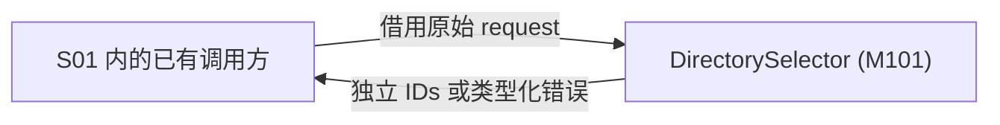
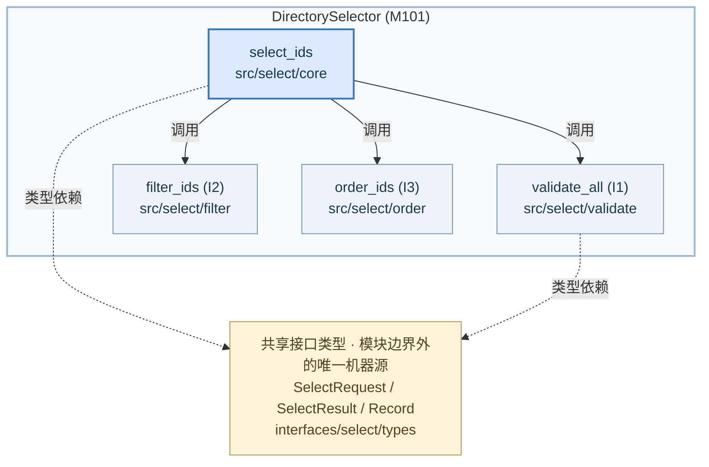
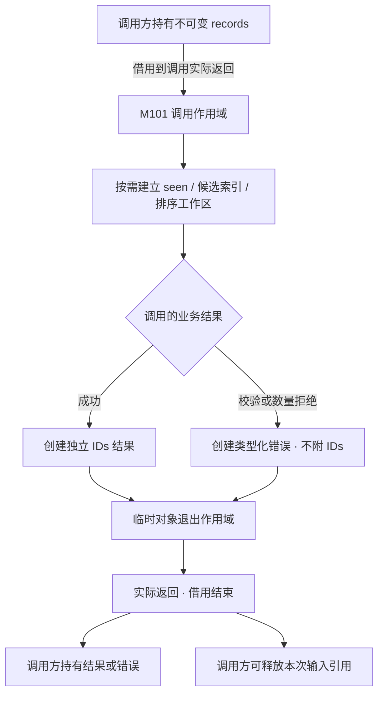
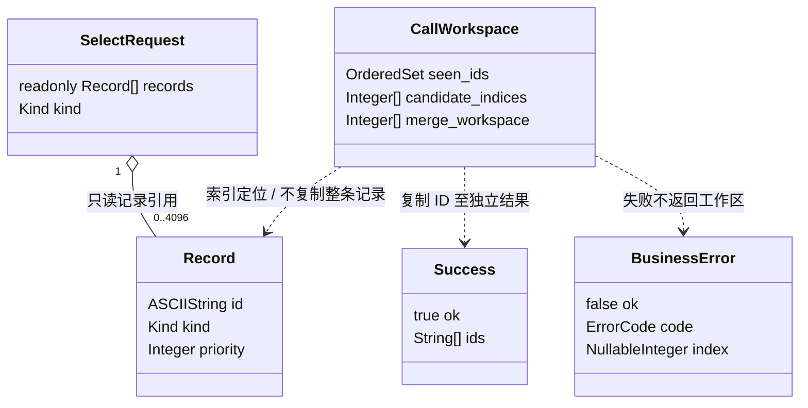
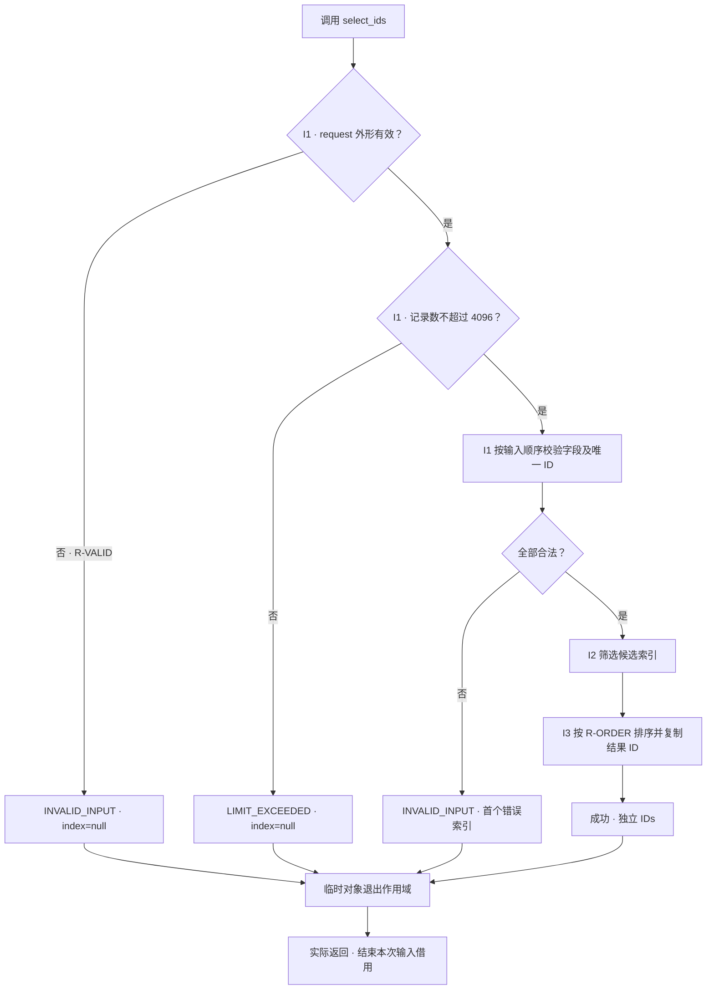
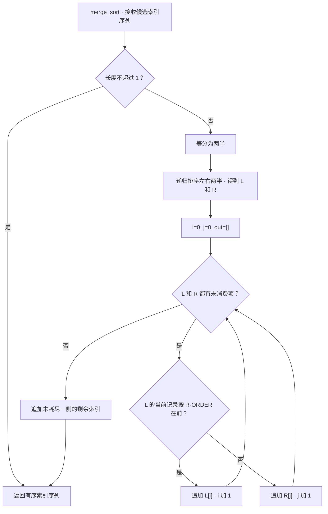
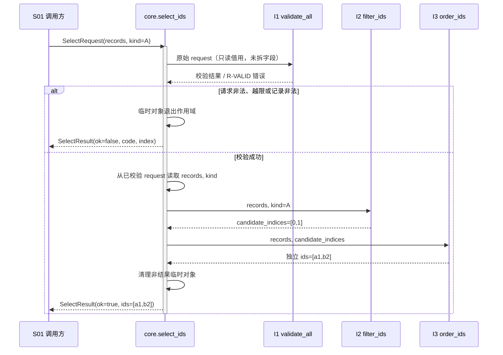
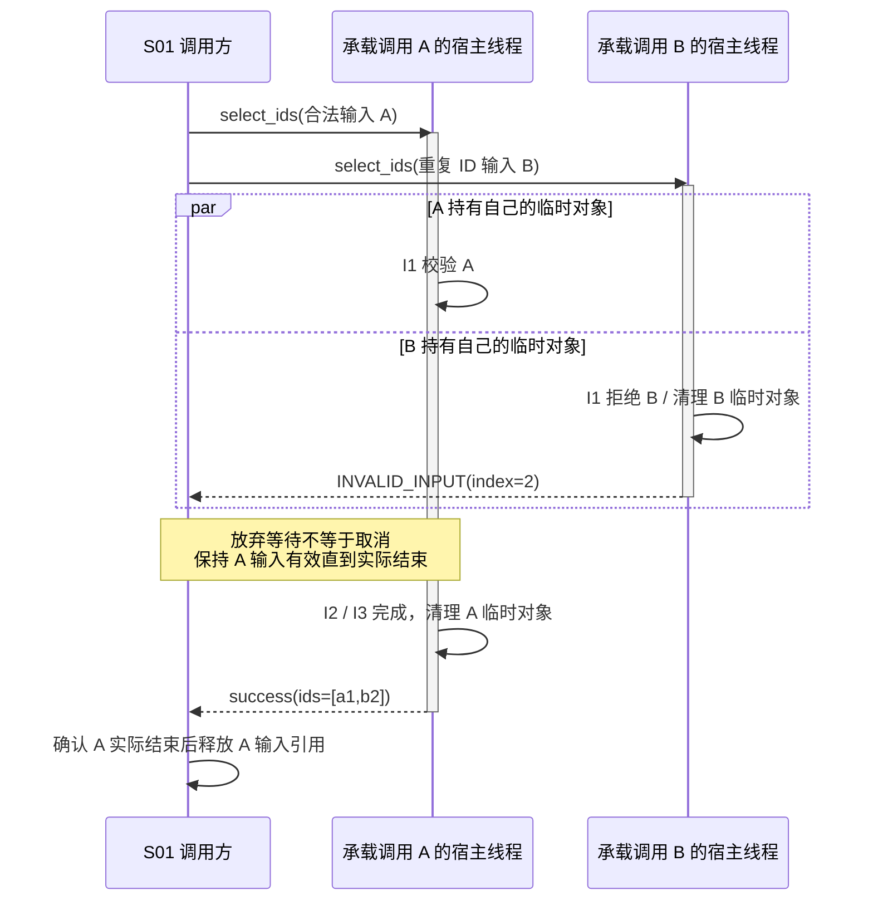
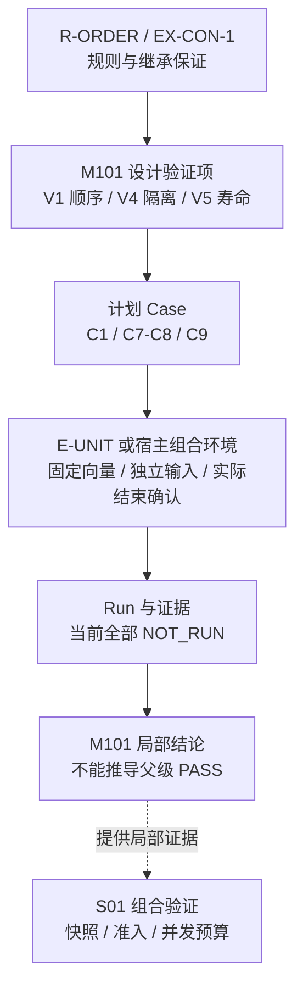

<!-- STD_DOCUMENT_COVER_BEGIN -->
# {{document_title}}

> STD 使用入口：[STD 主说明与执行流程](../../README.md)。这是工程文档标准模板；作者先读入口，再按项目已采用版本读取适用规范和专项指南。

| 文档字段 | 值 |
|---|---|
| Document ID | `{{document_id}}` |
| Document Version | `{{document_version}}` |
| Status | `{{document_status}}` |
| Project | `{{project}}` |
| Document Owner | {{document_owner}} |
| Last Modified Date | `{{last_modified_at}}` |
| Template ID | `{{template_id}}` |
| Template Version | `{{template_version}}` |

<!-- STD_DOCUMENT_COVER_END -->

## 1. 单元摘要：为什么存在

<details>
<summary>本节编写建议、规范与示例</summary>

本模板为《软件模块设计说明书》，沿用 Template ID `design.definition`，适用于软件系统或软件子系统下的模块详细设计。内部函数、类和算法是实现组织，不自动新增正式模块层级；模块也不必等同于一个类、进程或部署服务。固件/RTL、板卡/电路采用专项模板，旧版通用单元实例继续按已采用基线维护，不自动迁移。

保留 15 个主章，在现有章节内解决设计问题。每节围绕“具体问题 → 采用方案及依据 → 代表输入与失败推演 → 实现和验证承接”形成连续正文，表格只汇总结论。采用已有决定时核查后落实，不要求制造新方案。关键行为未知时先预设计，不能以“负责处理”“保证一致性”或待办清单充当设计完成。

正文与编写过程隔离：用户编辑指令、绘图要求、生成过程、修改经过和模板执行说明只留在编写/评审记录；正式正文描述产品和选定设计。逐段检查是在讲模块还是作者如何写作，特别复查图注、章节开头和新增段落。明确的编辑/生成残留是质量评审阻断项；不要关键词禁用“本图”，必要图例与边界说明应保留。帮助块与教学例子不得充作项目正文。

图明确 Current / Target / Transitional，能力的实现与验证状态分开；数值写明单位、范围、条件及 Modeled / Simulated / Measured。混合状态有图例，不能把 Planned 对象画成当前已部署。条件章节不适用时写责任边界及 tailoring 依据，不为模板新增队列、缓存、UI、重试或升级机制。

共同方法见 `docs/design-writing-guide.md`、`docs/ai-authoring-guide.md` 与 `docs/ai-guides/unit-design.md`；接口遵循 `docs/interface-data-mapping-standard.md`。

**本节目的**：让读者先理解软件模块承担的实际处理，而不是先读一串职责、类名或源码路径。

**必须写清楚**：模块对象 ID、直属父对象与父文档、使用场景、输入和输出、主要处理原理、非目标及适用版本/配置。用一段自包含说明贯通一次调用，再用摘要表归纳。

**编写规范**：软件总体方案与跨模块政策从父设计承接，本模块决定内部怎样实现。摘要不写索引式“详见各模块”；架构在 §5 展开，不能到实现任务末尾才首次出现。

按 `docs/software-object-identifiers.md` 从父设计登记表继承模块编号、正式英文名称和直属父对象，不能写作时自行另编。正式组件在图中使用“英文名称（稳定编号）”，正文和接口/验证引用同一身份；Document ID 与对象编号分开。内部 I1/I2 仅为本模块作用域内的实现标识，不申请正式模块编号；旧项目只按明确采用的范围迁移。

**抽象示例**：文末 EX-MODULE/v1 的目录筛选器接受内存记录与类别，返回确定顺序的记录 ID，不读数据库、不负责网络重试。实际项目须采用自己的输入，不照抄本例能力。

**完成条件**：新读者仅看本节就能说明什么时候调用、做什么、得到什么及不负责什么；可从 §5 找到内部方案，而不是只能从链接反猜用途。

</details>

<!-- 在此写入本节设计正文；图表汇总结论，不替代方案与依据。 -->

| 项目 | 内容 |
|---|---|
| 模块编号 / 正式英文名称 | <!-- TODO --> |
| 直属父对象编号 / 名称 | <!-- TODO --> |
| 父设计 Document ID / 固定基线 / 登记位置 | <!-- TODO --> |
| 上级系统/父单元 | <!-- TODO --> |
| 解决的问题 | <!-- TODO --> |
| 提供的能力 | <!-- TODO --> |
| 主要使用者 | <!-- TODO --> |
| 不负责 | <!-- TODO --> |

### 1.1 继承的上级约束与落实方式

<details>
<summary>本节编写建议、规范与示例</summary>

**本节目的**：把父单元或系统已经决定的输入固定下来，使本单元在明确边界内设计，不重新
决定系统级政策，也不因分层丢失总体预算和行为保证。

**必须写清楚**：上级 Document ID/版本或提交、Constraint ID、决定状态、适用条件、继承的
预算或行为保证、本单元可自行选择的范围、落实位置、再分配、验证和不满足时的反馈。

**编写规范**：逐项接收影响本单元功能、接口、状态、资源、安全、维护或制造的上级约束，
沿用原 ID 并固定输入基线，以来源文档与约束 ID 联合定位；细分新约束时关联父约束，不复用
同一 ID 表示不同要求。只保留理解要求必需的语义和分配值，契约字段引用唯一机器定义。
标明上级是已批准决定还是拟议输入，承接拟议输入不使它自动获批；确无父单元约束时说明独立
责任边界及直接需求来源，不能用 N/A 隐藏缺失输入。遇到冲突或缺少关键值时，提出具体差距、
选项和影响，请原决定责任方裁决，不擅自放宽上限或改变超限、重试和失败政策。

把每项约束连接到本单元的结构、流程、预算或验证；继续分解时分配给内部单元，保留公共开销
及余量，不把同一总预算重复交给每个模块。共享资源、模式、并发、峰值和行为前提按同一口径
组合校核，将结果或未决项回传上级。验证区分设计分析、实现检查和实测，局部通过不代替系统
组合验证。上级变化只在项目明确采用该变更后重新评估，不自动追随未锁定的新文档。

**抽象示例**：虚构上级拟议约束 `CON-MEM-01` 给校验单元单任务峰值 24 MiB，包含索引和候选
记录。单元可以选择索引算法，但不能把溢出的对象移到“公共内存”规避计账，也不能跳过唯一性
检查。设计在容量节给出相同输入上限下的峰值推导，测试验证超限时整批失败而非部分发布。
若发现无法满足，报告差额和压缩、限制输入等选项，等待系统责任方决定，不自行改成 32 MiB。
这里是拟议设计示例，不是任何产品预算或通过证据。

**完成条件**：每项继承约束能追到固定来源、适用状态和本地落实/验证，自由度与禁止变更的
边界清楚；再分配可组合，差距已反馈且未被标为满足，系统无需从实现细节反猜本单元是否承接。

</details>

<!-- 在此写入本节设计正文；图表汇总结论，不替代方案与依据。 -->

| Constraint ID / 上级基线与决定状态 | 适用条件 | 继承预算或行为保证 | 可自行选择/不可改变 | 本地落实/内部再分配 | 验证方法与结果/证据 | 差距/变更影响/反馈责任 |
|---|---|---|---|---|---|---|

<!-- 表后解释主要约束如何组合满足上级输入，定位正文和证据；不要复制完整系统设计或机器契约。 -->

## 2. 需求、功能与验收条件

<details>
<summary>本节编写建议、规范与示例</summary>

**本节目的**：把父级分配转换为本模块可以判断对错的行为，先确定处理语义再选择实现。

**必须写清楚**：每项功能的真实调用者、输入前提、正常输出、边界与错误，以及 Function ID 与上级需求/Constraint ID 的关系。解释主要功能怎样组合，哪些在模块外完成。

**编写规范**：验收条件必须可用具体输入判定，不能只写“正确、高效、支持扩展”。空输入、非法输入和依赖失败分别定义，成功与错误不能混用。行为在本章或相应规则章唯一维护，避免多表重复造成歧义。

**抽象示例**：筛选器空输入返回空 ID 列表；重复 ID 是整批非法输入，即使重复项不匹配类别也拒绝，不能悄悄丢弃后声称成功。

**完成条件**：实现者不需自己决定外部可观察的边界行为，测试者可以给出独立预期结果；未定语义明确记为设计缺口。

</details>

<!-- 在此写入本节设计正文；图表汇总结论，不替代方案与依据。 -->

| Function ID | 调用方 | 输入 | 行为 | 输出 | 错误 | 验收条件 |
|---|---|---|---|---|---|---|

## 3. UI、CLI 或设备操作面

<details>
<summary>本节编写建议、规范与示例</summary>

**本节目的**：明确模块实际拥有的交互入口，不重复上层产品界面，也不为纯库虚构页面或命令。

**必须写清楚**：适用时说明谁在什么位置、以什么身份对哪个对象执行操作，输入校验、结果/错误展示、取消和可用条件。设备操作面仅指本软件提供的入口，不在这里重订电气或寄存器契约。

**编写规范**：入口到 §9 接口可追踪，权限和错误不因入口而改变。非本模块责任写实际归属及裁剪依据，维护专用入口的行为在 §11 唯一展开。本章不是页面布局或绘图指令。

**抽象示例**：目录筛选器仅被现有应用调用，没有独立 UI/CLI；上层如何显示空列表不是模块新增交互能力的理由。

**完成条件**：每个入口都有执行位置、对象和结果，或有明确的不适用边界；不能只看到命令名称却不知道如何调用。

</details>

<!-- 在此写入本节设计正文；图表汇总结论，不替代方案与依据。 -->

| Surface ID | 页面/命令/寄存器 | 操作 | 输入 | 正常结果 | Empty/Error/Disabled |
|---|---|---|---|---|---|

## 4. 外部边界与依赖

<details>
<summary>本节编写建议、规范与示例</summary>

**本节目的**：确定模块与调用方、被调用方及运行环境的交接条件，使内部设计建立在真实依赖上。

**必须写清楚**：唯一接口来源、同步/异步方式、对象有效期、身份/配置来源、可用性及失败影响。附模块上下文图，标出输入来源、输出去向和责任边界；不是重复完整产品应用环境。

**编写规范**：业务 Owner 与运行时执行者分开，进程、线程及调用栈不得由组件框推导。普通语言运行库按版本和限制归组，不枚举无关内部结构。接口细节在 §9 维护，本章解释为何依赖及失效责任。

**抽象示例**：筛选器依赖调用者在调用期间保持输入不可变；若实际 API 不能保证，应选择受控复制或其他已授权措施，不能只在图里画“快照”便认为成立。

**完成条件**：沿上下文图可以找到每次交接的前提和错误责任，没有隐含新增服务，也不要求接收方猜测数据来源。

</details>

<!-- STD_TEMPLATE_EXAMPLE_BEGIN -->
**上下文图例：模块在调用环境中的位置**



图 M-C1 · EX-MODULE/v1 · Target / Planned / NOT_RUN。实线表示同步函数入参和返回，不是网络或新部署边界。
S01 的已有调用方拥有 request 及 records；M101 借用只读输入并产生独立 IDs 或类型化错误。调用方保持输入及字段不可变直至返回。
内部文件结构见 §5，过程见 §7；本图只展示模块外部交接，不代替完整产品应用环境。
<!-- STD_TEMPLATE_EXAMPLE_END -->

<!-- 在此写入本节设计正文；图表汇总结论，不替代方案与依据。 -->

| 依赖/参与方 | 本单元调用或消费 | 本单元提供 | 契约 | timeout/失败影响 |
|---|---|---|---|---|
| <!-- TODO --> | | | | |

## 5. 内部结构与实现位置

<details>
<summary>本节编写建议、规范与示例</summary>

**本节目的**：给出实现者可以采用的内部组织和取舍，不能只把上级职责换成几个类名。

**必须写清楚**：内部组成图、各内部对象处理什么、如何调用/交接、为什么这样拆分；入口到核心处理的路径及实现文件/symbol。图后逐个解释处理与协作，再用表汇总。包含、同步调用、异步消息与共享访问用图例区分。

图中以正式英文组件名或实际 symbol 为主要名称，内部标识辅助定位，不能以中文职责替代组件身份。图后按图中组成顺序逐个展开职责、输入、处理、输出和协作；有实际分层时按“层 → 内部组件”组织，无分层时不强套层次。表格与文件列表不能代替这些说明。

**编写规范**：不强制套 Entry/Service/Repository 分层。可以是少量函数而非微服务，组件数由处理和状态边界决定。说明方案与替代方案的实际代价；既有方案足够时说明依据，不凑虚假选项。计划路径明确 Planned/NOT_IMPLEMENTED，不伪称存在。

模块设计已接近实现，图的粒度须下沉到实际内部组件、函数/文件、数据对象、调用参数与判断动作，
而不是重复上级系统的职责框。结构图、数据结构/寿命图、调用时序、过程及算法图各表达一种关系；
在对应章节就地给出，不只把图集中放在附录。数量随实际关系增加，不为凑图新增实现对象。

模块由多个内部子模块、类或代码文件组成时，必须用结构图表达模块边界、内部组成及主要依赖，
并映射到文件/symbol。这里的内部子模块是实现分解，不自动增加正式设计层级，也不要求每个另写设计文档。
逻辑组件与文件不必一一对应：一个组件可跨文件，多个 helper 也可同文件，按实际映射说明。
确实没有进一步分解时，画模块边界、入口与核心处理即可，不为图例硬拆组件；结构图不能被文件树或流程图替代。

**抽象示例**：先完整校验再筛选排序，选择两阶段组织是为了保证“不匹配项也检查重复 ID”；只筛选后校验会漏掉非法输入。两个内部函数共享一次调用的数据，不是两个正式软件模块。

**完成条件**：读者能将 §2 行为定位到内部处理，并解释关键拆分为什么必要。组成图不能替代 §7 带条件的过程图，职责表不能代替方案正文。

</details>

<!-- STD_TEMPLATE_EXAMPLE_BEGIN -->
**内部结构图例：逻辑组件与计划文件的对应**



图 M-S1 · EX-MODULE/v1 · Target / Planned / NOT_RUN。外框表示模块内部组成，实线表示同步调用，
虚线表示对权威类型的依赖；图不表示线程、进程或处理时序。所有路径均为计划路径，语言后缀待定。

入口 core 负责组织一次调用及统一返回；validate 对全部输入检查字段与 ID 唯一性；filter 保存匹配项的输入索引；
order 按既定规则排序并构造独立结果。四个源文件是同一 M101 的实现组织，不是四个新的正式模块。
共享类型由 interfaces/select/types 唯一维护，不能在各文件里再定义一套公共字段。
具体执行顺序与失败出口见 §7 同一案例的 M-P1；M-S1 展示“由什么组成及如何关联”，不替代过程设计。
<!-- STD_TEMPLATE_EXAMPLE_END -->

<!-- 在此写入本节设计正文；图表汇总结论，不替代方案与依据。 -->

| Internal ID | 内部函数/类/组件 | 处理与协作 | 输入/输出 | 文件/symbol 与实现状态 | 责任人 |
|---|---|---|---|---|---|

## 6. 数据模型、状态与 ownership

<details>
<summary>本节编写建议、规范与示例</summary>

**本节目的**：把数据怎样组织、查找、变更和释放设计清楚，不只列状态名称或字段。

**必须写清楚**：关键类型与唯一来源、索引/容器选择、键与跨字段约束、创建/读写/持有者、借用/复制及释放时机。跟随一个对象说明入口、中间态和输出形态；重要生命周期给状态图及转换表，列事件、执行者、Guard 的事实来源、动作和出口。

**编写规范**：区分对象内存寿命、业务状态与访问权限；不能用一个 Done 同时表示成功、停止和释放。状态切换说明原子性和失败后的有效对象，外部引用存在时不能提前复用缓冲。公共类型引用 §9，私有结构在本章唯一维护。

分别描述易失状态与持久状态；没有持久化不等于没有生命周期。内存队列、在途调用、
缓冲区占用、取消与复位仍须写明状态权威、合法转换、可观察条件及释放规则。只有确实
不存在相关状态或生命周期时才说明 N/A 及理由，不能用“无数据库”省略在途行为。

**抽象示例**：筛选器借用只读输入，调用内拥有 seen 集合和候选数组；成功返回独立 ID 结果，失败不返回候选数组，两条路径均丢弃临时对象。无数据库不能免除这一说明。

**完成条件**：从对象出生走到每个出口，无重复释放、悬空引用或无主状态；Guard 有可获得的事实，不靠测试直接修改内部变量才能继续。

</details>

<!-- STD_TEMPLATE_EXAMPLE_BEGIN -->
**数据生命周期图例：借用输入与调用内临时对象**



图 M-D1 · EX-MODULE/v1 · Target / Planned / NOT_RUN。箭头表示寿命与所有权交接，不是持久状态机。
错误可能发生在临时对象尚未建立时，退出作用域只处理已建立对象；业务分支的准确发生位置见 M-P1。
独立结果与临时区不能共用会被回收的存储。多次调用共享同一不可变输入时，一次返回只结束本次借用，不能提前释放其他调用仍使用的对象。

| 对象 | 所有者 / 访问方式 | 出生与结束 | 成功 / 失败后的归属 |
|---|---|---|---|
| records 与字段 | 调用方拥有；M101 只读借用 | 调用前存在；本次实际返回结束借用 | 始终归调用方，需等所有借用结束才能销毁 |
| seen、候选索引、排序工作区 | 单次调用独享 | 按需分配；所有正常/业务错误出口退出作用域 | 不跨调用保留，不作为结果返回 |
| IDs / 错误对象 | M101 构造，返回后交给调用方 | 返回前建立独立存储 | 成功只有 IDs；业务失败只有错误，无半成品 |

宿主强制终止和不可恢复分配失败不属于正常返回路径，采用前需关闭文末 O1；不能用这张图宣称所有运行库异常已解决。

**数据结构图例：公开类型与私有工作区**



图 M-D2 · EX-MODULE/v1 · Target / Planned / NOT_RUN。聚合线表示借用关联，虚线表示访问或构造关系，不是执行顺序。
公开类型是文末 IF-SELECT/v1 的阅读投影，CallWorkspace 是模块私有组织；Success 与 BusinessError 是互斥结果，不能同时返回。
图中 0..4096 表示合法输入约束，不代表机器容器天然阻止第 4097 项；越限及字段细则仍由 R-VALID 检查。
Kind 的 A/B、priority 范围和 ID 格式以文末规格为准；这张图补充结构关系，不另立字段 authority。
<!-- STD_TEMPLATE_EXAMPLE_END -->

<!-- 在此写入本节设计正文；图表汇总结论，不替代方案与依据。 -->

| 数据/状态 | 类型/关键字段 | Writer | Reader | 存储/生命周期 | Authority |
|---|---|---|---|---|---|
| <!-- TODO --> | | | | | |

## 7. 主流程与数据流

<details>
<summary>本节编写建议、规范与示例</summary>

**本节目的**：把内部组件组织成可执行过程，说明真实输入怎样成为结果，以及中途失败如何结束。

**必须写清楚**：登记全部重要过程及适用性，每个重要流程都要有流程图或时序图、连续正文和异常分支，并完成图文核对。按实际过程在本章扩展子节，至少贯通代表业务；初始化、配置生效、取消/停止按实际责任展开，不存在的过程解释边界。

**编写规范**：图节点用实际执行者/动作/判定，连线注明数据、调用或事件。步骤说明数据形态、执行上下文、状态变化、输出可见点、清理与错误；每个等待给产生事实的动作、判定来源、期限和合法出口。架构图、职责表、文字箭头链或 Stage DAG 不能替代过程图。简单同步过程也画正常和拒绝路径，复用图须明确覆盖哪些过程与分支。

**抽象示例**：同一筛选调用先检查数量再校验每条记录，重复即失败，只有全部合法才筛选排序；不能在图中先返回部分结果而正文声称原子返回。

**完成条件**：使用具体输入按图推演，正常、错误和适用的并发/取消均走到结果与清理，没有跳过未知判定。过程清单不漏图，图与接口、状态和算法的顺序及错误一致。

</details>

<!-- STD_TEMPLATE_EXAMPLE_BEGIN -->
**主要流程图例：公开入口到返回与清理**



图 M-P1 · EX-MODULE/v1 · Target / Planned / NOT_RUN。公开操作 P-SELECT 的正常、数量超限、结构非法和逐记录非法分支在同一图中展开。
菱形所需事实来自当前请求及 I1 按 R-VALID 的校验结果，不依赖远端等待或无来源的“确认安全”。
失败不再执行筛选/排序，已建立临时对象退出作用域；成功结果独立于临时存储。空输入沿正常分支返回空 IDs。

以文末三条记录请求为例，I1 校验全部三条、I2 得到候选索引 [0,1]、I3 返回 [a1,b2]；若第三条改成重复 a1，
I1 直接产生 index=2 的 INVALID_INPUT，不能因其类别不匹配而绕过校验。具体排序算法见 §8，不在总流程图中掩盖判断。

| Process ID | 正文 / 图 | 代表正常路径 | 代表错误路径 |
|---|---|---|---|
| P-SELECT | 本段 / M-P1 | 完整校验 → 筛选 → 排序 → 独立返回 | 输入或数量拒绝 → 清理已有临时对象 → 类型化错误 |

本案例没有独立初始化、配置生效或停止 API；真实模块若有这些重要过程，须各自补图、正文、异常分支及核对，不以本例只有一条流程作为裁剪依据。
<!-- STD_TEMPLATE_EXAMPLE_END -->

<!-- 在此写入本节设计正文；图表汇总结论，不替代方案与依据。 -->

| Process ID | 触发/适用条件 | 图与正文位置 | 正常/异常出口 | 接口/规则/验证项 |
|---|---|---|---|---|

| Step | 输入 | 执行位置 | 处理/规则 | 输出/状态变化 |
|---|---|---|---|---|
| 1 | <!-- TODO --> | | | |

## 8. 关键算法与业务规则

<details>
<summary>本节编写建议、规范与示例</summary>

**本节目的**：确定不可随意改变的判定、顺序和处理方法，并说明算法选择依据。

**必须写清楚**：输入前提、计算/查找/排序或调度规则、边界、复杂度和资源需求。复杂或易歧义逻辑给伪代码和同一输入的中间值，说明哪些算法可替换、替换后保留什么保证。

每个重要算法必须有算法图、连续正文和具体输入推演，必要时配伪代码；核对分支条件、中间值、循环推进及退出。主流程图不能替代算法内部判断，只有图也不能代替选择依据。简单逻辑说明规则及边界，不为满足图例虚构复杂算法。

**编写规范**：伪代码覆盖决定正确性的非法输入、空集、溢出及适用的并发检查。规则用 Rule ID 唯一维护，其他章引用而非各写一种优先级。简单 CRUD 无需虚构算法，但仍定位校验、权限和冲突政策，说明无新增算法的理由。

**抽象示例**：筛选结果按 priority 降序、id 升序比较，不依赖哈希迭代顺序；固定 ASCII ID 避免本地语言排序差异。用同优先级反序输入检查第二排序键，不能用“稳定排序”四字替代比较规则。

**完成条件**：另一位作者能依据正文算出相同输出和失败结果，复杂度与 §12 负载口径一致，不需要从语言默认行为猜业务语义。

</details>

<!-- STD_TEMPLATE_EXAMPLE_BEGIN -->
**算法图例：候选索引的归并排序**

R-ORDER（本案例唯一规则位置）：I1 完整校验通过后，I2 按请求 kind 筛选，I3 按 priority 数值降序、同值按 id 的 ASCII 升序排列。
无匹配返回空 IDs。此处选归并排序，输入是已经校验的 records 与候选索引，不重新改变 R-VALID 的错误顺序。



图 M-ALG1 · EX-MODULE/v1 · Target / Planned / NOT_RUN。菱形读取序列长度、游标及记录比较键；每轮恰消费一项，
所以合并循环可终止。空集与单元素走基线出口，所有候选经过比较后返回有序索引，再由 I3 复制对应 ID 形成独立结果。
类型/重复 ID 的业务错误已经由 M-P1 的 I1 拒绝，不在排序中另加含糊的“失败重试”。

```text
before(a, b):
    if records[a].priority != records[b].priority:
        return records[a].priority > records[b].priority
    return records[a].id < records[b].id       # ASCII 顺序；I1 已保证 ID 唯一

merge_sort(indices):
    if len(indices) <= 1: return copy(indices)
    L = merge_sort(first half); R = merge_sort(second half)
    i = 0; j = 0; out = []
    while i < len(L) and j < len(R):
        if before(L[i], R[j]): append L[i] to out; i += 1
        else: append R[j] to out; j += 1
    append remaining L[i:] and R[j:] to out
    return out
```

文末请求的两个候选先分成 [b2] 和 [a1]；priority 相同，ASCII 比较选择 a1，随后追加 b2，最终为 [a1,b2]。
选择归并的代价是额外工作区；k 个匹配项的比较为 O(k log k)，工作区峰值 O(k)，递归栈 O(log k)。
上述峰值以深度优先求值、每层合并后及时释放子数组为前提，不能将所有递归中间结果长期保存；具体字节开销待 §12 量测。
R-ORDER 是外部可观察规则，归并仅是本地实现选择；换等价算法需重新证明顺序、边界与资源，不需重新发明公共语义。
<!-- STD_TEMPLATE_EXAMPLE_END -->

<!-- 在此写入本节设计正文；图表汇总结论，不替代方案与依据。 -->

| Rule ID | 条件 | 算法/规则 | 结果 | 复杂度/限制 | 测试 |
|---|---|---|---|---|---|

## 9. 接口与机器契约

<details>
<summary>本节编写建议、规范与示例</summary>

**本节目的**：使提供方和消费方按同一签名、数据规格与错误语义实现调用，而不只是找到文件名。

**必须写清楚**：操作/成员 ID、request/response/error 角色、固定源版本/revision/hash/selector、完整必需参数、返回与所有权、前提及兼容边界。一套具体请求、成功响应与失败响应关联同一实例；函数按真实签名举例，不凭空增加网络封装。

**编写规范**：系统公共接口、本层接口与内部 helper 区分唯一维护范围。跨 Owner/对外类型按映射规范绑定项目 interfaces 目录，身份复用封面/metadata，不另造隐藏版本。读取实际机器签名核对角色、完整性，不能把 request/response 互换或漏掉 response；私有 helper 不必升级公共契约。规格未定义是设计缺口，规格完整但代码缺失才是 NOT_IMPLEMENTED，未执行验证是 NOT_RUN。

解释行为和设计意图；需要完整阅读视图时从 OpenAPI、Schema、IDL、ABI 或 register map 生成或逐项核对，不独立维护第二份字段 authority。

按 `docs/interface-data-mapping-standard.md` 复用上级接口族/成员 ID；先读取固定机器源，再按同一基线说明本地职责。
正文的完整字段阅读视图生成或逐项核对，不独立手改一套。§6 数据、§13 实现任务及 §14 验证用同一成员标识。

多个 backend 分别填写，未实现和未运行不从分母删除；若无法满足，回报原 ID、反例和影响，不静默改错误或字段。

**抽象示例**：筛选接口成功是 IDs，重复 ID 失败是 INVALID_INPUT，互斥返回分支都要说明；不能只列 request 类型要求调用方猜错误。文末类型仅为教学投影，不是可直接采用的项目权威目录。

**完成条件**：拿样例逐参数模拟双方调用，接收方能确定对象、含义和下一步；角色、签名、返回分支及设计/实现/验证映射完整。机器检查不替代语义核对。

</details>

<!-- STD_TEMPLATE_EXAMPLE_BEGIN -->
**接口调用图例：公开签名、内部参数与互斥返回**



图 M-I1 · EX-MODULE/v1 · Target / Planned / NOT_RUN。实线是同步调用，虚线是返回；I1–I3 在同一调用栈运行，不是远程服务。
公开签名和完整字段以文末 IF-SELECT/v1 为准。图使用同一三条记录请求，参数由入口传入，helper 不能靠隐含全局变量猜对象。
这里 I1 的完整校验包括请求形状和数量检查；失败回传既定错误，入口负责公共结果封装。
入口把原始 request 交给 validate_all(request)，在成功前不取字段、不丢弃额外字段、不做类型转换；否则 I1 无法检查请求本身。缺少 records、额外字段或非对象输入均由 I1 返回 INVALID_INPUT/index=null，不能提前解引用失败或将清洗后的输入当作原请求。
错误分支不再调用 I2/I3，不附候选 IDs；成功返回的 IDs 不借用会被清理的工作区。I1 的私有校验结果不因此变成新公共协议。
<!-- STD_TEMPLATE_EXAMPLE_END -->

<!-- 在此写入本节设计正文；图表汇总结论，不替代方案与依据。 -->

| Interface | Direction | Operation | Contract source | Compatibility | Error model |
|---|---|---|---|---|---|
| <!-- TODO --> | | | | | |

| 接口成员 ID / 类型字段 ID | 提供/消费 / 责任模块 / backend | 消费版本/revision/hash / selector | 本地文件/symbol 或 NOT_IMPLEMENTED | Constraint / 设计 V → Case / 环境 / Run |
|---|---|---|---|---|

## 10. 并发、失败与恢复

<details>
<summary>本节编写建议、规范与示例</summary>

**本节目的**：保证同时调用、异常和停止时仍遵守契约，不用“线程安全、幂等重试”代替设计。

**必须写清楚**：实际执行上下文、可重入范围、共享对象/锁或同步手段、锁顺序和持有期间允许操作；超时/取消传播、部分执行、迟到响应、重启、过载及释放规则。无共享可变状态时说明事实与调用者义务，不虚构线程池或分布式锁。

**编写规范**：有副作用时区分结果已知性、访问安全、操作终态、资源释放、重新准入。区分四种动作：状态查询只读原操作；同请求重放须核对同一身份和完整参数，由权威幂等记录返回原状态/结果而不新增执行，原执行者可继续运行；执行者接管涉及执行权转移，须保证旧执行者已停止或被可靠隔离；新业务重试须依据原结果及业务政策重新准入，可能重复副作用时仍须满足安全执行与去重条件。不能换 key 绕过未知结果，也不能把查询或不新增执行的重放一律要求先停止。记录去重范围、有效期、冲突参数和记录过期后的处理。停止/取证事实由谁以什么证据和期限判定必须可执行；无法确认时保留阻塞或按已有人工路径处理，不伪造恢复机制。推演互相等待、提前清理封死未来分支及晚到事件复活旧对象。

只读同步库演练非法输入、同时调用与调用者中断后的实际寿命；有副作用、取证及资源收口的机制才演练证据不可恢复但已安全停止，不给所有模块强加 lease、取证或取消 API。未提供中途取消时说明返回前不会停止，调用者超时不等于本模块结束。

幂等/去重条件必须从实际契约和权威记录核实。异步连续参考位于已采用 STD 源的 `docs/examples/module-async-export-example.md`：它复用真实 Schema/目录，展示受理、执行、通知、消费、释放和取消/迟到/容量拒绝，不能将其物理隔离模型当成项目已有能力。

**抽象示例**：筛选器各调用独享临时集合、借用不可变输入，因此无内部互斥锁；调用者若在后台线程运行后放弃等待，仍须保留输入直至函数返回，不能立刻复用缓冲。

**完成条件**：每个适用失败点有检测事实、处理及最终资源归属；至少推演一组并发交错。完整验证从公开入口开始，不直接篡改内部状态制造释放成功。

</details>

<!-- STD_TEMPLATE_EXAMPLE_BEGIN -->
**并发与中断图例：两次调用互不污染**



图 M-X1 · EX-MODULE/v1 · Target / Planned / NOT_RUN。线程由宿主测试环境提供，不是 M101 新建的线程池。
这是一种允许交错，不保证 B 总先结束。B 的 seen 和候选区不与 A 共享；B 失败不改变 A 的结果。
“放弃等待”没有向模块发送停止操作，不代表调用已终止。实际返回是结束借用的依据，未取得这一事实前不能复位 A 输入。
同一不可变输入共享给两次调用的变体还须等待全部借用结束，见 M-D1；有副作用模块不得以本只读示例替代安全接管和去重设计。
<!-- STD_TEMPLATE_EXAMPLE_END -->

<!-- 在此写入本节设计正文；图表汇总结论，不替代方案与依据。 -->

| 场景 | 并发/失败点 | 检测 | 行为 | 幂等/重试 | 最终状态 |
|---|---|---|---|---|---|

## 11. 安全、权限与可观测性

<details>
<summary>本节编写建议、规范与示例</summary>

**本节目的**：落实安全边界和维护能力，使拒绝、诊断与恢复有实际执行位置。

**必须写清楚**：输入信任、身份与授权继承/检查点、敏感数据及禁止记录内容。实际拥有维护能力时说明日志/统计/trace 的触发、关联 ID、单位、窗口、重置和读取方式；调试命令说明执行环境、身份、目标、影响范围和退出/恢复条件。

**编写规范**：继承上级指标 ID 与口径，诊断不能改变业务结果或引入越权后门；复位副作用回链 §10。没有独立命令、日志或升级器时说明上层怎样得到错误及诊断责任，不因模板新增平台。权限服务失败不能默认放行。

**抽象示例**：筛选器仅返回结构化错误码，不记录输入内容；调用应用负责计数与脱敏日志，不能因此宣称本模块有远程诊断服务。

**完成条件**：一个真实故障在哪里识别、如何安全定位及由谁处理均可说明，不只列日志/指标名称；无能力时给责任出口而非空泛“由平台保障”。

</details>

<!-- 在此写入本节设计正文。 -->

## 12. 容量、性能与运行限制

<details>
<summary>本节编写建议、规范与示例</summary>

**本节目的**：把内部结构和算法转换成可校核的资源需求与运行上限。

**必须写清楚**：输入规模、同时调用数、持久/临时/借用内存、共享开销及峰值重叠，复杂度或排队条件与超限处理；容量估算和延迟实测分开给依据。

适用时固定软件/运行库版本、硬件、虚拟化、依赖和数据规模；分别给初始化、复位、启动、排队/运行、停止、清理的预算、起止事件、计时来源及总期限。并行阶段按关键路径计算总期限，不盲目相加；重试不得重置总期限。区分冷/热启动、并发启动峰值、共享额度扣减与归还、超限拒绝/退避/阻塞出口及责任。纯函数可引用宿主启动与资源预算，不虚构独立生命周期。

使用 LLM 时明确所需能力、模型/服务基线、输入上下文和最大输出规模、请求量、峰值并发、排队与调用预算、取消后的占用和费用/配额边界；超限按已采用策略处理，不擅自新增模型 fallback。

**编写规范**：从 §6 容器与 §8 算法逐项推导，不凭空填吞吐目标。继承 §1.1 原单位、负载和拓扑口径，单调用上限不自动限制全进程并发。实现语言的对象/分配器成本未知时列公式与量测任务，不假装逻辑字节就是实测内存。

按 §1.1 的上级约束和相同负载/模式/拓扑口径推导本单元需求；分解时计入公共开销、共享资源
和峰值重叠。局部预算不足先反馈，不能通过扩大上限或改变系统行为自行消除缺口。

**抽象示例**：n 个输入、k 个匹配项，临时空间为 seen(n)、候选(k)、结果(k) 与排序工作区之和；同时 c 次调用的峰值还需调用方组合校核，不能只计返回 ID。

**完成条件**：资源需求可回查组成和上级分配；未测量项保持未实测，超限不能擅自扩预算、借未计账内存或放宽语义解决。

</details>

<!-- 在此写入本节设计正文；图表汇总结论，不替代方案与依据。 -->

| 指标 | 目标/限制 | 口径与负载 | 证据等级 | 超限行为 |
|---|---|---|---|---|
| <!-- TODO --> | | | Modeled/Simulated/Measured | |

## 13. 实现步骤与文件清单

<details>
<summary>本节编写建议、规范与示例</summary>

**本节目的**：将已确定的方案交给开发，不再次把关键设计问题推迟给开发自行决定。

**必须写清楚**：按依赖排列的任务、真实或 Planned 路径、关键 symbol、接口成员/Rule/Constraint ID、可选择的局部实现及不可改变行为。记录禁止修改的共享接口/邻接模块与需要协调的变更。

明确归属的构建目标、语言/工具链基线、依赖库与版本、编译/链接条件、导出头文件或符号及私有范围；说明宿主如何装配、注入依赖、初始化及销毁，失败时由谁回收，以及如何进入宿主测试目标。纯内部模块引用父级产物与现有测试入口，不强建独立库。给实际或 Planned 构建/测试命令、工作目录、输入条件和预期产物，未选定的关键装配决策列设计缺口。

**编写规范**：接口语义、错误行为和测试向量完成评审后两端可并行实现；各自通过契约测试后集成，组合验收后才关闭父级目标，不能要求真实实现测试通过才能开始实现。文件清单是定位而非批准，本文不自动授予代码修改或提交权限。

**抽象示例**：筛选器类型、核心函数与向量测试各有计划文件；可换等价排序实现，但不得改变比较器、错误优先级或输入不可变约定。

**完成条件**：每项任务有前提、输入及可检查交付，开发不必重新决定公共语义；缺失文件明确标记，不伪造已有 symbol。

</details>

<!-- 在此写入本节设计正文；图表汇总结论，不替代方案与依据。 -->

| 顺序 | 任务 | 新增/修改文件 | 关键 symbol | 前置依赖 | 完成条件 |
|---:|---|---|---|---|---|

## 14. 测试与验收

<details>
<summary>本节编写建议、规范与示例</summary>

**本节目的**：给实现者一套可证伪设计的方法，不把测试类别清单或未执行命令当通过证据。

**必须写清楚**：被测模块 ID 与父对象、设计验证项 V → 可执行 Case → 环境/配置 → Run/证据；具体输入构造、独立 Oracle、边界/失败/并发交错、部署复位、并行隔离及自动执行/失败复现。涉及 LLM 的模块按实际职责说明 prompt/响应构造和判据，不泛化为所有模块必需。

**编写规范**：预期结果不能由被测实现再计算一遍证明自身正确。故障注入标明位置、条件和安全边界，从公开入口验证全路径。只读内存函数可用测试进程和独立输入，无需新服务；外部资源须定义命名空间、清理及复位确认。未实现、NOT_RUN、不适用及失败分别计入覆盖，局部通过不关闭系统组合要求。

测试环境固定 §12 的版本、硬件/虚拟化、依赖、数据规模和冷/热条件；从初始化到清理记录各段耗时、总期限及超限出口，不以 Ready 一个标志代表全部通过。覆盖并发启动峰值、共享资源扣减/归还、复位失败、停止未确认和清理超时；LLM 模块用固定能力/上下文/请求量验证并发、排队和调用预算。无相关能力时指出宿主承担项和组合验证入口。

将 §1.1 的 Constraint ID 与下表的功能/规则一并覆盖，区分本单元证明的范围和仍需上级组合
验证的条件；未实现或未实测可以如实保留，不能把设计分析当作实测 PASS。

**抽象示例**：以反序 ID、同 priority 检查精确结果；用不匹配类别中的重复 ID 检查完整校验。合法/非法输入同时调用，检查互不污染、输入不变、错误不携带半成品。

**完成条件**：所有适用功能、过程、约束与错误分支可定位用例及判据，环境能重复建立/隔离/清理；结构回归不代表实际模块已验证。

</details>

<!-- STD_TEMPLATE_EXAMPLE_BEGIN -->
**验证关系图例：局部设计不自动关闭父级目标**



图 M-V1 · EX-MODULE/v1 · Target / Planned / NOT_RUN。实线表示验证承接关系，不是执行流程；虚线表示局部证据输入父级评审。
V1/C1 用固定 [a1,b2] 判顺序；V4/C7-C8 检查并发不污染；V5/C9 需宿主确认实际调用结束，不能只检查“不再等待”。
图只突出三项的关联方式，完整分母仍以文末 V1–V6 表为准，不能把图外错误/边界用例删去；没有执行记录就没有通过结论。
<!-- STD_TEMPLATE_EXAMPLE_END -->

<!-- 在此写入本节设计正文；图表汇总结论，不替代方案与依据。 -->

| Function/Rule/Constraint | Test | 正常/边界/失败场景 | Oracle | Evidence | 状态 |
|---|---|---|---|---|---|

## 15. 风险、未决问题与引用

<details>
<summary>本节编写建议、规范与示例</summary>

模块设计确定可观察行为、公共接口、算法规则、不变量、预算和失败语义；ISD细化准确文件/symbol、私有类型、语言表示、调用/锁/清理步骤、装配及测试入口。模块已具有这些细节时兼作，不另写重复文档。metadata以design_object_id固定模块，implementation_specification登记embedded/separate/not_required/missing及信息项覆盖映射，格式见ISD规范。不能因建立ISD推迟模块行为决定。

兼作时为已存在的信息章节添加稳定锚点，覆盖映射指向本文件；独立时指向唯一ISD入口及其分卷。入口保留isd-handoff六列承接矩阵；安全/持久化适用时使用七列实现表，验证使用Expected/Actual/Verdict/Run八列表，可复用ISD模板的栏目。表格可放在原对应章节，不增加主章节。运行validate-design --check-isd-delivery检查交付槽位；基础草稿校验不表示已交付。
**本节目的**：集中管理阻止设计完成的具体问题和来源，避免每节用待办掩盖核心方案缺失。

**必须写清楚**：未决项影响的规则/接口/流程/约束、事实缺口、可行选项、裁决责任、关闭条件与下一步取证行动；固定来源与已采用决定，区分设计、实现及测试缺口。

**编写规范**：选定方案后回写唯一规则位置，同时复查接口、状态表、图、算法、资源与验证，列出尚存旧语义。一个规则不在多章独立维护。编写记录与产品设计分开，编辑指令不转写成产品事实；项目未主动要求时不检查或追随新 STD/模板版本。

关键机制或判定方法未定时，先在相关节做“输入与约束 → 选项 → 正常/失败推演 → 推荐与代价
→ 未决项”的预设计；复杂问题复用 `evaluation.technical-analysis`，不强制另建文档。选择后
回写正文、§1.1 承接与验证映射。关键机制未定不能判设计完成，不受该决定影响的工作可继续。
逐节收口检查实际决定、依据、继承/分配约束、自由度及承接检查位置，不能用五句口号代替正文。

**抽象示例**：语言未定导致对象开销待量测可记录任务及预算风险；错误输出未定是接口设计缺口，不能一律标 NOT_IMPLEMENTED。排序规则唯一维护在 §8，流程及测试引用 Rule ID。

**完成条件**：每个关键未决问题有解决路径且未冒充设计完成；正式正文通过新读者、具体调用和图文一致性复审，编写残留已移出。

</details>

| ISD采用模式 | 对象ID | 实现规格Document ID | metadata覆盖映射入口 | 不需要时的理由/决定引用 |
|---|---|---|---|---|

<!-- 在此写入本节设计正文；图表汇总结论，不替代方案与依据。 -->

| ID | 问题 | 阻塞影响 | Owner | 截止时间/Gate | 决定或状态 |
|---|---|---|---|---|---|
| <!-- TODO --> | | | | | |

## 附录 A. 机制承接表

<details>
<summary>本节编写建议与规范</summary>

**本节目的**：从本模块视角横向核对它在全部系统机制中承担的责任，并把机制要求落实到正文、接口、代码文件/symbol 与验证；不按机制顺序重写模块正文。

**必须写清楚**：每个来源机制第 14.4 节的稳定要求、本文落实位置、固定与可自行决定的边界、提供/消费接口、计划或实际代码落点，以及局部和组合验证交接。

**编写规范**：本表是承接侧，列名与机制第 14.4 节对齐。一个模块承接多个机制时逐项登记；首列必须使用 Mechanism Document ID + 机制第 14.4 节的精确 Requirement ID，不得只写章节号或复述文字。同一要求只引用机制 authority，不复制规则。机制尚未设计、规格缺失和代码 `NOT_IMPLEMENTED` 分别记录，不能互相替代。父系统机制清单中的适用机制必须全部出现，或给出有批准依据的不适用结论。

**抽象示例**：推理模块分别承接流式返回、用量计量和配置生效三个机制；每行引用各机制第 14.4 节的来源 ID，再落到本模块正文、Provider Adapter symbol 和对应局部/组合用例，不把三份机制按章节复制进模块正文。

**完成条件**：从每个机制要求能找到本模块的实际设计与实现责任；从每个相关代码入口可反查来源机制，并能区分模块局部验证与机制组合验证。

</details>

| 来源机制 Document ID / 第 14.4 节要求 ID | 来源 Capability / Step / Constraint / 接口成员 | 本模块必须负责的行为与保证 | 本模块提供/消费的接口 | 本文落实位置 | 代码文件 / symbol 或 NOT_IMPLEMENTED | 允许自行决定的范围 | 本地验证 / 组合验证交接 |
|---|---|---|---|---|---|---|---|

文档控制信息（与封面和 metadata 保持一致）：

<!-- STD_DOCUMENT_CONTROL_BEGIN -->
| 文档字段 | 值 |
|---|---|
| Authority | `{{authority}}` |
| Authors | {{authors}} |
| Created Date | `{{created_at}}` |
| Template Conformance | `{{template_conformance}}` |
| Tailoring Reference | {{tailoring_ref}} |
| Migration Map Reference | {{migration_map_ref}} |
| Repository | `{{source_repository}}` |
| Canonical Path | `{{source_path}}` |
| Supersedes | {{supersedes}} |
<!-- STD_DOCUMENT_CONTROL_END -->

<!-- Reviewer、Approver、Approval Date、Release Tag 按真实状态记录；不要伪造包含自身的 commit hash。 -->

<!-- STD_TEMPLATE_EXAMPLE_BEGIN -->
## 附录 B. 连续教学样稿：只读目录筛选模块

<details>
<summary>案例用途、适用范围与使用边界</summary>

**本节目的**：用同一对象贯通用途、内部方案、可调用接口、数据状态、重要过程和测试，示范表格之外实际需要决定什么。

**必须写清楚**：本例 EX-MODULE/v1 是虚构的 Target 方案，能力 Planned，测试 NOT_RUN；不是 HIFM、Slinky 或任何产品的既有实现/预算。九张 Mermaid 图按用途放在 §4–10、§14，均为可编辑源；本附录串联同一 M101 的设计与向量，不再独立维护第二套图。

**编写规范**：案例按正文各章的主题给出压缩切片，不替代完整项目设计。裁剪来自本例只读、同步、无 I/O 的边界；有副作用或异步模块还须完成 §10 的适用演练。代码块是教学接口投影和伪代码，没有真实 interfaces authority；实际采用前按 §9 建立/核对机器定义与目录，不伪造版本、hash 或源码存在。生成器会移除本标记块，项目必须写自己的图与设计。

**抽象示例**：不能只把“目录筛选器”换成业务模块名；实际模块若使用外部存储，本例无等待的流程及寿命前提就不再适用。

**完成条件**：能沿公开入口手算正常、错误、并发和资源归属，且能指出仍待实现/量测的内容；该演练不宣称软件运行测试已通过。

</details>

**用途与承接（对应 §1–4）**

DirectorySelector（M101）属于虚构 S01 目录应用子系统。用户在已有界面选择类别后，S01 调用 M101 对内存记录筛选并按优先级展示 ID。
M101 不加载文件、不授权用户、不访问网络，不产生业务写入，也没有独立 UI、线程或取消 API。
父输入为虚构文档 EX-S01/v1，拟议约束 EX-CON-1 是输入不可变与整批返回，EX-CON-2 是每次最多 4096 条；
拟议输入不因此获批。父设计负责输入快照的建立及整个应用并发准入，不将单调用上限当成进程容量。

上下文见 §4 图 M-C1：已有调用方以同步函数传入借用记录，接收独立结果或错误。

**内部方案（对应 §5）**

M101 的入口 select_ids 顺序执行完整校验、筛选和排序。完整校验必须先于筛选，否则非匹配类别中的重复 ID 会漏检。
先校验会遍历全部输入，但换来统一的非法输入语义；不增加缓存、后台工作者或 Repository 层。
内部 I1–I3 只是 helper 标识，不是新的正式模块。它们位于调用方线程的同一次调用栈，临时数据不跨调用共享。

内部结构与文件对应见 §5 图 M-S1；同一入口顺序调用 I1、I2、I3，不能由图推导并发线程。

I1 用有序集合检查唯一 ID；I2 保存匹配项的输入索引，不复制整条记录；I3 按规则比较并复制结果 ID，返回结果不借用输入内存。
选择有序集合使校验最坏 O(n log n)，避免在本例引入哈希碰撞假设；可换等价实现，但要重新证明复杂度与峰值。

**数据、接口与规则（对应 §6、§8–9）**

教学接口 IF-SELECT/v1 的角色是 request=SelectRequest、response=SelectResult，其中错误为 response 的互斥分支。
函数 `select_ids(request: SelectRequest) -> SelectResult` 同步返回；未声明的字段拒绝，不进行隐式类型转换。

```text
SelectRequest = {records: readonly Record[], kind: "A" | "B"}
Record        = {id: ASCII string matching [a-z0-9]{1,16},
                 kind: "A" | "B", priority: integer in [0,9]}
SelectResult  = {ok: true, ids: string[]}
              | {ok: false, code: "INVALID_INPUT", index: integer | null}
              | {ok: false, code: "LIMIT_EXCEEDED", index: null}
```

R-VALID：先检查 request 对象、准确字段集合、kind 及 records 为数组，否则 INVALID_INPUT/index=null；
再检查长度，超过 4096 返回 LIMIT_EXCEEDED；随后按输入索引递增检查 Record 的准确字段集合、字段类型/范围及 ID 唯一性，
第一个不合法或重复项返回 INVALID_INPUT/index=该零基索引。布尔值不当整数接受。
筛选与排序采用 §8 教学图例唯一维护的 R-ORDER；错误不附带 IDs。R-VALID 在本附录唯一维护，过程及测试引用规则 ID。

```json
{"records":[{"id":"b2","kind":"A","priority":3},{"id":"a1","kind":"A","priority":3},{"id":"c3","kind":"B","priority":9}],"kind":"A"}
```

该请求的候选索引为 [0,1]，按 R-ORDER 返回 `{"ok":true,"ids":["a1","b2"]}`。
若把第三条 ID 改成 a1，即使它的 kind 为 B，也返回 `{"ok":false,"code":"INVALID_INPUT","index":2}`。
空 records 返回 `{"ok":true,"ids":[]}`。这些是预期向量，不是执行记录。

输入及字段由调用方拥有；seen 有序集合、候选索引和排序工作区由调用局部作用域拥有。
成功时独立结果交给调用方，临时对象离开作用域；失败时只返回错误，已分配临时对象同样退出作用域。
“校验/筛选/排序”是调用内阶段，不是可外部修改的持久状态机。

**重要过程 P-SELECT（对应 §7、§10）**

正常与拒绝分支见 §7 图 M-P1，数据归属见 §6 图 M-D1；算法细化见 §8 图 M-ALG1，适用并发交错见 §10 图 M-X1。

正常请求通过完整校验后才产生候选，再一次性返回结果。失败路径不进入后续筛选/排序；清理节点对尚未分配对象不做释放操作。
本模块只有这一重要处理过程，空集与拒绝分支由同图覆盖；无初始化、配置热更新或独立停止过程，生命周期从调用开始到返回结束。

```text
select_ids(request):
    # 以下请求形状、数量与逐记录校验是 I1 validate_all 的内联展开
    if request shape / kind / records container invalid: return INVALID_INPUT(null)
    if len(records) > 4096: return LIMIT_EXCEEDED(null)
    seen = ordered_set()                   # 调用局部，不是静态全局集合
    for i, record in input order:
        if record invalid or record.id in seen: return INVALID_INPUT(i)
        seen.add(record.id)
    candidates = indices whose kind equals request.kind
    sort candidates using R-ORDER
    return success(copy IDs at sorted indices)
    # 全部返回路径由作用域管理临时对象，结果存储单独交给调用方
```

同一输入可被两个调用同时只读借用，但 seen/candidates/result 各自独立。一个调用因重复 ID 失败，不改变另一个调用的数据与结果。
调用者在其他线程放弃等待不终止正在执行的函数，也不能立即修改或释放输入；必须等该调用实际返回。
进程强制终止不承诺返回错误或执行用户态清理，由宿主回收进程资源。运行库不可恢复的分配失败不伪装成上述业务错误，
属于父应用的资源故障边界；具体语言的可恢复分配异常策略仍须在采用本方案前明确。
本例无副作用、重试、取证或资源租约，因此不人为添加“安全停止后取证失败”的协议。

**维护、资源与实现交付（对应 §11–13）**

M101 不输出日志、不持有凭据；调用应用按错误码计数和脱敏记录，不记录原始 Record 内容。
输入已通过应用访问控制，但本模块仍执行 R-VALID，不将权限检查和结构校验混为一件事。
设计分析中 n≤4096、k≤n，时间为 O(n log n + k log k)，临时峰值由 seen(n)、候选索引(k)、排序工作区与结果 ID 拷贝(k) 组成，
另计调用者拥有的输入；同时 c 次调用按实际重叠组合，不将输入共享误算成 c 份复制。
这些是 Modeled 复杂度，不是延迟或内存实测。语言对象布局/分配成本、宿主并发上限与延迟目标待父设计确认和量测，不能据此发布吞吐数字。

| 计划文件（均 NOT_IMPLEMENTED） | 承接内容 | 固定决定 / 实现自由度 |
|---|---|---|
| interfaces/select/types（语言后缀待定） | IF-SELECT 的 request/response 机器源及目录登记 | 语义、角色、错误优先级固定；采用前确定语言与 selector/hash |
| src/select/core（语言后缀待定） | select_ids 入口及调用编排，对应图 M-S1 | 不改变输入、不部分返回，统一结果出口 |
| src/select/validate（语言后缀待定） | I1 validate_all、R-VALID | 完整校验与错误优先级不变；等价容器可选但重核成本 |
| src/select/filter（语言后缀待定） | I2 filter_ids | 只在校验成功后生成匹配项索引，不复制完整记录 |
| src/select/order（语言后缀待定） | I3 order_ids、R-ORDER | 比较规则和独立结果不变；等价排序可选但重核成本 |
| tests/select/vectors（语言后缀待定） | 下表 Case 和隔离并发检查 | 固定预期值，不从被测实现反算 Oracle |

先评审类型、错误和向量，再实现公开入口及 helpers，随后跑契约与并发检查；不要求未实现代码先通过测试才能开发。
不得借此修改父级准入、访问控制或新增缓存。路径和公开投影是计划，不虚构现有机器 hash 或接口目录 PASS。

**设计验证、缺口与一致性（对应 §14–15）**

所有条目被测对象为 M101、父对象 S01。环境 E-UNIT 是所选语言的独立测试进程，无外部服务；每例新建输入和捕获结果，
结束后退出作用域。并行例不用共享可变 fixture；对不可变同一输入的共享读取另设例，调用结束前不复位输入。
自动执行需保留语言/运行库版本、向量及运行命令，失败保留具体输入与交错。下表 Case 均待实现，Run 均 NOT_RUN。

| 设计 V / 上级约束或规则 | Case（计划）与输入 | 独立 Oracle | 环境 / Run |
|---|---|---|---|
| V1 / R-ORDER | C1：上文三条记录；C2：空数组；C11：仅含上文前两条 A 记录，查询 B | 分别为 [a1,b2]、[]、[]；输入逐字段不变 | E-UNIT / NOT_RUN |
| V2 / R-VALID | C3：不匹配类别中的重复 a1；C4：上文第一、二条的 priority 分别改为 -1、10 | index 分别为 2 和 0；无 ids 字段 | E-UNIT / NOT_RUN |
| V3 / EX-CON-2 | C5：4096 条合法唯一 ID；C6：4097 条且末条非法 | 前者正常；后者 LIMIT_EXCEEDED 优先于逐记录校验 | E-UNIT / NOT_RUN |
| V4 / EX-CON-1 | C7：两次同输入并行只读；C8：独立合法/非法调用并行 | 两次结果一致；合法结果不受另一调用失败影响；输入不变 | E-UNIT / NOT_RUN |
| V5 / §10 寿命前提 | C9：宿主放弃等待，仍保持输入到工作线程实际结束 | 接收最终完成后才允许释放；没有伪造取消成功 | 宿主组合环境待定 / NOT_RUN |
| V6 / IF-SELECT | C10：缺字段、额外字段、布尔 priority、越界 priority、非 ASCII ID、非法 kind | request 级 index=null；记录级首个错误索引，无隐式转换 | E-UNIT / NOT_RUN |

O1：实现语言及可恢复分配失败策略未定，Owner 为模块负责人，需以候选语言异常模型和父资源政策裁决并回写 §9–10；
O2：内存/延迟及并发组合预算未定，Owner 为 S01 负责人，需给约束并以实际布局/工作负载量测回写 §12。
这两项不能用 NOT_IMPLEMENTED 代替设计缺口，也不能判本教学方案已具备生产实现批准条件。
R-VALID 改动时回查 IF-SELECT、M-P1、伪代码、V2/V3/V6；R-ORDER 改动时回查 I3 与 V1。
局部 Case 即使通过，也不能代替 S01 的输入快照、准入与并发组合验证。
<!-- STD_TEMPLATE_EXAMPLE_END -->
