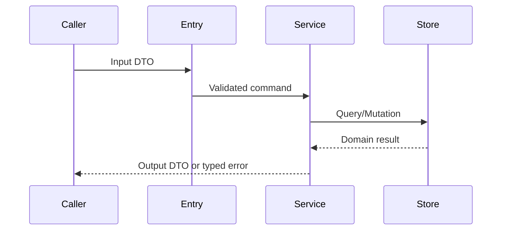

<!-- STD_DOCUMENT_COVER_BEGIN -->
# {{document_title}}

| 文档字段 | 值 |
|---|---|
| Document ID | `{{document_id}}` |
| Document Version | `{{document_version}}` |
| Status | `{{document_status}}` |
| Project | `{{project}}` |
| Authority | `{{authority}}` |
| Document Owner | {{document_owner}} |
| Authors | {{authors}} |
| Created Date | `{{created_at}}` |
| Last Modified Date | `{{last_modified_at}}` |
| Template ID | `{{template_id}}` |
| Template Version | `{{template_version}}` |
| Template Conformance | `{{template_conformance}}` |
| Tailoring Reference | {{tailoring_ref}} |
| Migration Map Reference | {{migration_map_ref}} |
| Repository | `{{source_repository}}` |
| Canonical Path | `{{source_path}}` |
| Supersedes | {{supersedes}} |

> Reviewer、Approver、Approval Date 和 Release Tag 在进入相应状态时填写。Git commit/tag 是
> 外部不可变证据；不要在文档内容中伪造包含自身的 commit hash。
<!-- STD_DOCUMENT_COVER_END -->

<!--
编写建议：适用于 subsystem、module、component 和 implementation-unit。先描述该单元向外提供的功能，
再继承上级约束、描述内部实现。必须给出真实或明确标为计划的代码/RTL/硬件路径和端到端调用示例。编写规范见
docs/design-writing-guide.md；所有示例提交前必须替换。
-->

## 1. 单元摘要：为什么存在

| 项目 | 内容 |
|---|---|
| 上级系统/父单元 | <!-- TODO --> |
| 解决的问题 | <!-- TODO --> |
| 提供的能力 | <!-- TODO --> |
| 主要使用者 | <!-- TODO --> |
| 不负责 | <!-- TODO --> |

### 1.1 继承的上级约束与落实方式

本节编写建议、规范与示例

**本节目的**：把父单元或系统已经决定的输入固定下来，使本单元在明确边界内设计，不重新
决定系统级政策，也不因分层丢失总体预算和行为保证。

**必须写清楚**：上级 Document ID/版本或提交、Constraint ID、决定状态、适用条件、继承的
预算或行为保证、本单元可自行选择的范围、落实位置、再分配、验证和不满足时的反馈。

**编写规范**：逐项接收影响本单元功能、接口、状态、资源、安全、维护或制造的上级约束，
沿用原 ID 并固定输入基线，以来源文档与约束 ID 联合定位；细分新约束时关联父约束，不复用
同一 ID 表示不同要求。只保留理解要求必需的语义和分配值，契约字段引用唯一机器定义。
标明上级是已批准决定还是拟议输入，承接拟议输入不使它自动获批；确无父单元约束时说明独立
责任边界及直接需求来源，不能用 N/A 隐藏缺失输入。遇到冲突或缺少关键值时，提出具体差距、
选项和影响，请原决定责任方裁决，不擅自放宽上限或改变超限、重试和失败政策。

把每项约束连接到本单元的结构、流程、预算或验证；继续分解时分配给内部单元，保留公共开销
及余量，不把同一总预算重复交给每个模块。共享资源、模式、并发、峰值和行为前提按同一口径
组合校核，将结果或未决项回传上级。验证区分设计分析、实现检查和实测，局部通过不代替系统
组合验证。上级变化只在项目明确采用该变更后重新评估，不自动追随未锁定的新文档。

**抽象示例**：虚构上级拟议约束 `CON-MEM-01` 给校验单元单任务峰值 24 MiB，包含索引和候选
记录。单元可以选择索引算法，但不能把溢出的对象移到“公共内存”规避计账，也不能跳过唯一性
检查。设计在容量节给出相同输入上限下的峰值推导，测试验证超限时整批失败而非部分发布。
若发现无法满足，报告差额和压缩、限制输入等选项，等待系统责任方决定，不自行改成 32 MiB。
这里是拟议设计示例，不是任何产品预算或通过证据。

**完成条件**：每项继承约束能追到固定来源、适用状态和本地落实/验证，自由度与禁止变更的
边界清楚；再分配可组合，差距已反馈且未被标为满足，系统无需从实现细节反猜本单元是否承接。

| Constraint ID / 上级基线与决定状态 | 适用条件 | 继承预算或行为保证 | 可自行选择/不可改变 | 本地落实/内部再分配 | 验证方法与结果/证据 | 差距/变更影响/反馈责任 |
|---|---|---|---|---|---|---|

<!-- 表后解释主要约束如何组合满足上级输入，定位正文和证据；不要复制完整系统设计或机器契约。 -->

## 2. 需求、功能与验收条件

| Function ID | 调用方 | 输入 | 行为 | 输出 | 错误 | 验收条件 |
|---|---|---|---|---|---|---|
| MOD-F-001 | API Handler | validated request | 查询并排序记录 | result list | typed error | 顺序稳定且错误可区分 |

## 3. UI、CLI 或设备操作面

如果本单元直接拥有页面、命令或设备操作入口，列出完整行为；否则写 N/A 并引用上层入口。

| Surface ID | 页面/命令/寄存器 | 操作 | 输入 | 正常结果 | Empty/Error/Disabled |
|---|---|---|---|---|---|
| CLI-001 | `tool list` | 列出记录 | filter | 表格/JSON | 空列表和非零退出码 |

## 4. 外部边界与依赖

| 依赖/参与方 | 本单元调用或消费 | 本单元提供 | 契约 | timeout/失败影响 |
|---|---|---|---|---|
| <!-- TODO --> | | | | |

## 5. 内部结构与实现位置

| Internal ID | 模块/类/RTL block | 职责 | 输入/输出 | 实现路径 | Owner |
|---|---|---|---|---|---|
| I-001 | `DocumentService` | 编排查询和权限 | request/result | `src/document/service.ts` | Backend |

## 6. 数据模型、状态与 ownership

| 数据/状态 | 类型/关键字段 | Writer | Reader | 存储/生命周期 | Authority |
|---|---|---|---|---|---|
| <!-- TODO --> | | | | | |

需要状态机时列出合法转换；没有持久状态时明确写 N/A。

## 7. 主流程与数据流

至少给出一个真实调用示例，标明每一步的数据形态。

| Step | 输入 | 执行位置 | 处理/规则 | 输出/状态变化 |
|---|---|---|---|---|
| 1 | <!-- TODO --> | | | |

## 8. 关键算法与业务规则

| Rule ID | 条件 | 算法/规则 | 结果 | 复杂度/限制 | 测试 |
|---|---|---|---|---|---|
| R-001 | 多条候选记录 | status 后按 ID 稳定排序 | deterministic list | O(n log n) | `test_stable_order` |

复杂逻辑给出伪代码；简单 CRUD 可写 N/A，但必须说明校验和权限规则在哪里实现。

## 9. 接口与机器契约

| Interface | Direction | Operation | Contract source | Compatibility | Error model |
|---|---|---|---|---|---|
| <!-- TODO --> | | | | | |

解释行为和设计意图；需要完整阅读视图时从 OpenAPI、Schema、IDL、ABI 或 register map 生成或逐项核对，不独立维护第二份字段 authority。

按 `docs/interface-data-mapping-standard.md` 复用上级接口族/成员 ID；先读取固定机器源，再按同一基线说明本地职责。
正文的完整字段阅读视图生成或逐项核对，不独立手改一套。§6 数据、§13 实现任务及 §14 验证用同一成员标识。

| 接口成员 ID / 类型字段 ID | 提供/消费 / 责任模块 / backend | 消费版本/revision/hash / selector | 本地文件/symbol 或 NOT_IMPLEMENTED | Constraint / 设计 V → Case / 环境 / Run |
|---|---|---|---|---|

多个 backend 分别填写，未实现和未运行不从分母删除；若无法满足，回报原 ID、反例和影响，不静默改错误或字段。

## 10. 并发、失败与恢复

| 场景 | 并发/失败点 | 检测 | 行为 | 幂等/重试 | 最终状态 |
|---|---|---|---|---|---|
| 重复提交 | 写入前 | idempotency key | 返回原结果 | 相同 key 可重试 | 单一记录 |

覆盖 timeout、取消、部分成功、重启、backpressure 和资源耗尽；不适用项说明原因。

## 11. 安全、权限与可观测性

说明信任边界、身份传播、授权位置、敏感字段、日志/metric/trace 以及禁止记录的内容。

## 12. 容量、性能与运行限制

按 §1.1 的上级约束和相同负载/模式/拓扑口径推导本单元需求；分解时计入公共开销、共享资源
和峰值重叠。局部预算不足先反馈，不能通过扩大上限或改变系统行为自行消除缺口。

| 指标 | 目标/限制 | 口径与负载 | 证据等级 | 超限行为 |
|---|---|---|---|---|
| <!-- TODO --> | | | estimated/simulated/measured | |

## 13. 实现步骤与文件清单

| 顺序 | 任务 | 新增/修改文件 | 关键 symbol | 前置依赖 | 完成条件 |
|---:|---|---|---|---|---|
| 1 | 定义接口 | `src/document/types.ts` | `DocumentQuery` | Contract approved | typecheck 通过 |
| 2 | 实现服务 | `src/document/service.ts` | `DocumentService` | 任务 1 | unit test 通过 |

明确哪些文件不得修改。当前实现、已批准变更和未来设想必须分开。

## 14. 测试与验收

将 §1.1 的 Constraint ID 与下表的功能/规则一并覆盖，区分本单元证明的范围和仍需上级组合
验证的条件；未实现或未实测可以如实保留，不能把设计分析当作实测 PASS。

| Function/Rule/Constraint | Test | 正常/边界/失败场景 | Oracle | Evidence | 状态 |
|---|---|---|---|---|---|
| MOD-F-001 | `test_list` | 正常、空、存储失败 | result/error contract | CI | Planned |

## 15. 风险、未决问题与引用

关键机制或判定方法未定时，先在相关节做“输入与约束 → 选项 → 正常/失败推演 → 推荐与代价
→ 未决项”的预设计；复杂问题复用 `evaluation.technical-analysis`，不强制另建文档。选择后
回写正文、§1.1 承接与验证映射。关键机制未定不能判设计完成，不受该决定影响的工作可继续。
逐节收口检查实际决定、依据、继承/分配约束、自由度及承接检查位置，不能用五句口号代替正文。

| ID | 问题 | 阻塞影响 | Owner | 截止时间/Gate | 决定或状态 |
|---|---|---|---|---|---|
| <!-- TODO --> | | | | | |
