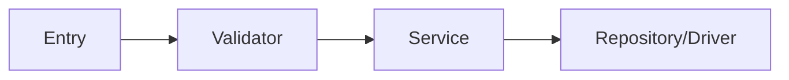
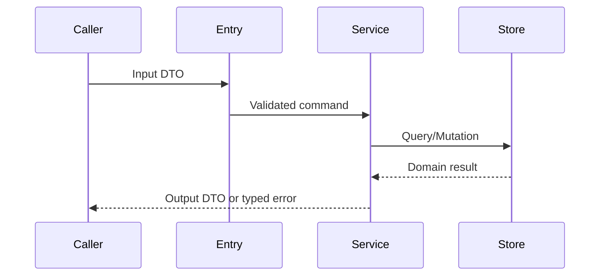

<!-- STD_DOCUMENT_COVER_BEGIN -->
# {{document_title}}

| 文档字段 | 值 |
|---|---|
| Document ID | `{{document_id}}` |
| Document Version | `{{document_version}}` |
| Status | `{{document_status}}` |
| Project | `{{project}}` |
| Authority | `{{authority}}` |
| Document Owner | {{document_owner}} |
| Authors | {{authors}} |
| Created Date | `{{created_at}}` |
| Last Modified Date | `{{last_modified_at}}` |
| Template ID | `{{template_id}}` |
| Template Version | `{{template_version}}` |
| Template Conformance | `{{template_conformance}}` |
| Tailoring Reference | {{tailoring_ref}} |
| Migration Map Reference | {{migration_map_ref}} |
| Repository | `{{source_repository}}` |
| Canonical Path | `{{source_path}}` |
| Supersedes | {{supersedes}} |

> Reviewer、Approver、Approval Date 和 Release Tag 在进入相应状态时填写。Git commit/tag 是
> 外部不可变证据；不要在文档内容中伪造包含自身的 commit hash。
<!-- STD_DOCUMENT_COVER_END -->

<!--
编写建议：适用于 subsystem、module、component 和 implementation-unit。先描述该单元向外提供的功能，
再描述内部实现。必须给出真实代码/RTL/硬件路径和端到端调用示例。编写规范见
docs/design-writing-guide.md；所有示例提交前必须替换。
-->

## 1. 单元摘要：为什么存在

| 项目 | 内容 |
|---|---|
| 上级系统/父单元 | <!-- TODO --> |
| 解决的问题 | <!-- TODO --> |
| 提供的能力 | <!-- TODO --> |
| 主要使用者 | <!-- TODO --> |
| 不负责 | <!-- TODO --> |

## 2. 需求、功能与验收条件

| Function ID | 调用方 | 输入 | 行为 | 输出 | 错误 | 验收条件 |
|---|---|---|---|---|---|---|
| MOD-F-001 | API Handler | validated request | 查询并排序记录 | result list | typed error | 顺序稳定且错误可区分 |

## 3. UI、CLI 或设备操作面

如果本单元直接拥有页面、命令或设备操作入口，列出完整行为；否则写 N/A 并引用上层入口。

| Surface ID | 页面/命令/寄存器 | 操作 | 输入 | 正常结果 | Empty/Error/Disabled |
|---|---|---|---|---|---|
| CLI-001 | `tool list` | 列出记录 | filter | 表格/JSON | 空列表和非零退出码 |

## 4. 外部边界与依赖

| 依赖/参与方 | 本单元调用或消费 | 本单元提供 | 契约 | timeout/失败影响 |
|---|---|---|---|---|
| <!-- TODO --> | | | | |

## 5. 内部结构与实现位置

| Internal ID | 模块/类/RTL block | 职责 | 输入/输出 | 实现路径 | Owner |
|---|---|---|---|---|---|
| I-001 | `DocumentService` | 编排查询和权限 | request/result | `src/document/service.ts` | Backend |

## 6. 数据模型、状态与 ownership

| 数据/状态 | 类型/关键字段 | Writer | Reader | 存储/生命周期 | Authority |
|---|---|---|---|---|---|
| <!-- TODO --> | | | | | |

需要状态机时列出合法转换；没有持久状态时明确写 N/A。

## 7. 主流程与数据流

至少给出一个真实调用示例，标明每一步的数据形态。

| Step | 输入 | 执行位置 | 处理/规则 | 输出/状态变化 |
|---|---|---|---|---|
| 1 | <!-- TODO --> | | | |

## 8. 关键算法与业务规则

| Rule ID | 条件 | 算法/规则 | 结果 | 复杂度/限制 | 测试 |
|---|---|---|---|---|---|
| R-001 | 多条候选记录 | status 后按 ID 稳定排序 | deterministic list | O(n log n) | `test_stable_order` |

复杂逻辑给出伪代码；简单 CRUD 可写 N/A，但必须说明校验和权限规则在哪里实现。

## 9. 接口与机器契约

| Interface | Direction | Operation | Contract source | Compatibility | Error model |
|---|---|---|---|---|---|
| <!-- TODO --> | | | | | |

只解释设计意图，不复制 OpenAPI、Schema、IDL、ABI 或 register map 的字段定义。

## 10. 并发、失败与恢复

| 场景 | 并发/失败点 | 检测 | 行为 | 幂等/重试 | 最终状态 |
|---|---|---|---|---|---|
| 重复提交 | 写入前 | idempotency key | 返回原结果 | 相同 key 可重试 | 单一记录 |

覆盖 timeout、取消、部分成功、重启、backpressure 和资源耗尽；不适用项说明原因。

## 11. 安全、权限与可观测性

说明信任边界、身份传播、授权位置、敏感字段、日志/metric/trace 以及禁止记录的内容。

## 12. 容量、性能与运行限制

| 指标 | 目标/限制 | 口径与负载 | 证据等级 | 超限行为 |
|---|---|---|---|---|
| <!-- TODO --> | | | estimated/simulated/measured | |

## 13. 实现步骤与文件清单

| 顺序 | 任务 | 新增/修改文件 | 关键 symbol | 前置依赖 | 完成条件 |
|---:|---|---|---|---|---|
| 1 | 定义接口 | `src/document/types.ts` | `DocumentQuery` | Contract approved | typecheck 通过 |
| 2 | 实现服务 | `src/document/service.ts` | `DocumentService` | 任务 1 | unit test 通过 |

明确哪些文件不得修改。当前实现、已批准变更和未来设想必须分开。

## 14. 测试与验收

| Function/Rule | Test | 正常/边界/失败场景 | Oracle | Evidence | 状态 |
|---|---|---|---|---|---|
| MOD-F-001 | `test_list` | 正常、空、存储失败 | result/error contract | CI | Planned |

## 15. 风险、未决问题与引用

| ID | 问题 | 阻塞影响 | Owner | 截止时间/Gate | 决定或状态 |
|---|---|---|---|---|---|
| <!-- TODO --> | | | | | |
