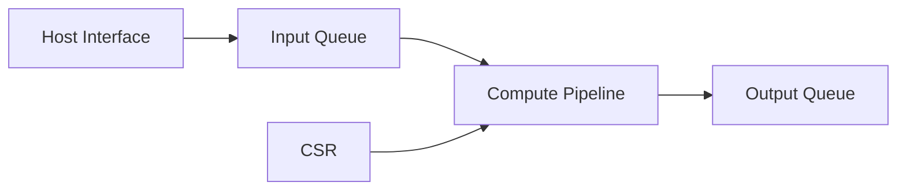

<!-- STD_DOCUMENT_COVER_BEGIN -->
# {{document_title}}

| 文档字段 | 值 |
|---|---|
| Document ID | `{{document_id}}` |
| Document Version | `{{document_version}}` |
| Status | `{{document_status}}` |
| Project | `{{project}}` |
| Authority | `{{authority}}` |
| Document Owner | {{document_owner}} |
| Authors | {{authors}} |
| Created Date | `{{created_at}}` |
| Last Modified Date | `{{last_modified_at}}` |
| Template ID | `{{template_id}}` |
| Template Version | `{{template_version}}` |
| Template Conformance | `{{template_conformance}}` |
| Tailoring Reference | {{tailoring_ref}} |
| Migration Map Reference | {{migration_map_ref}} |
| Repository | `{{source_repository}}` |
| Canonical Path | `{{source_path}}` |
| Supersedes | {{supersedes}} |

> Reviewer、Approver、Approval Date 和 Release Tag 在进入相应状态时填写。Git commit/tag 是
> 外部不可变证据；不要在文档内容中伪造包含自身的 commit hash。
<!-- STD_DOCUMENT_COVER_END -->

<!--
编写建议：先写可观察功能与完整数据路径，再分解 RTL block。每个接口、clock domain、buffer、
backpressure 和错误路径都要能落到 RTL/约束/测试文件。示例必须替换。
编写规范见 docs/design-writing-guide.md。
-->

## 1. 用途、功能与输入冻结

| 项目 | 内容 |
|---|---|
| 使用场景 | <!-- TODO --> |
| 要解决的问题 | <!-- TODO --> |
| 目标器件/板卡 | <!-- TODO --> |
| 输入契约 | <!-- API/ABI/寄存器/数据格式 --> |
| 成功条件 | <!-- TODO --> |

| Function ID | 输入 | RTL 行为 | 输出 | 时序/吞吐 | 验收条件 |
|---|---|---|---|---|---|
| RTL-F-001 | AXI stream packet | validate + transform | output packet | 1 beat/cycle steady state | golden vectors pass |

## 2. Top-level、模块与实现文件

| Block ID | RTL block | 职责 | Clock/Reset | 输入/输出 | Source path | Owner |
|---|---|---|---|---|---|---|
| B-001 | `input_queue` | 缓冲并施加 backpressure | core_clk/core_rst_n | AXI-S | `rtl/input_queue.sv` | RTL |

## 3. 数据面端到端流程

| Step | 数据格式 | Producer → Consumer | 处理 | Buffer/latency | 错误结果 |
|---:|---|---|---|---|---|
| 1 | InputBeat | Host IF → Queue | framing check | FIFO / 2 cycles | error counter |

说明 packet/transaction 的进入、变换、存储和输出；提供典型和边界示例向量。

## 4. 控制面、CSR 与软件交互

| Register/Command | Writer | Effect | Readback | Illegal access | Authority |
|---|---|---|---|---|---|
| `CONTROL.start` | Driver | start accepted job | busy/status | ignored + error | register spec |

描述软件从配置、启动、轮询/中断到完成或恢复的完整流程。

## 5. 内部协议、状态机和 backpressure

| State | Event/Guard | Next | Output/action | timeout/error |
|---|---|---|---|---|
| IDLE | start && configured | RUN | accept input | config error |

明确 valid/ready、ordering、queue depth、arbitration、fence 和资源耗尽行为。

## 6. Clock、Reset 与 CDC/RDC

| Domain | Frequency/source | Reset | Crossing | CDC primitive/proof | Constraint |
|---|---|---|---|---|---|
| core_clk | 300 MHz PLL | sync active-low | host→core | async FIFO | `constraints.xdc` |

## 7. Memory、DMA、buffer 与一致性

| Resource | Owner | Address/size | Access pattern | Alignment/order | Overflow/recovery |
|---|---|---|---|---|---|
| <!-- TODO --> | | | | | |

## 8. 错误、隔离、恢复与可观测性

| Failure | Detection | Containment | CSR/interrupt/counter | Recovery | Data validity |
|---|---|---|---|---|---|
| malformed packet | header check | drop current packet | ERR_FORMAT + counter | next packet | output absent |

## 9. 资源、频率、延迟、吞吐与功耗预算

| Metric | Target | Condition/topology | Estimate | Post-implementation | Margin |
|---|---|---|---|---|---|
| LUT | < 60% | target part | <!-- TODO --> | NOT_RUN | |

注明器件、工具版本、约束、利用率假设和 evidence 等级。

## 10. 软件模型、仿真器与 golden contract

定义共同输入输出、bit-exact/tolerance 规则、错误语义、测试向量和实测校准方式。

## 11. 实现计划与交付物

| 顺序 | 任务 | RTL/constraint/test path | 依赖 | 完成条件 |
|---:|---|---|---|---|
| 1 | 输入队列 | `rtl/input_queue.sv`、`tb/input_queue_tb.sv` | interface approved | lint + unit pass |

## 12. Verification 与验收

| Function/Invariant | 方法 | 正常/边界/失败场景 | Oracle | Evidence | 状态 |
|---|---|---|---|---|---|
| RTL-F-001 | simulation | min/max packet + stall | golden vector | report | Planned |

覆盖 lint、CDC/RDC、仿真、formal、综合、实现、时序和板级；未运行不得写 PASS。

## 13. Platform Profile、风险与未决问题

| ID | 平台差异/问题 | 影响 | Owner | 关闭证据/Gate | 状态 |
|---|---|---|---|---|---|
| <!-- TODO --> | | | | | |
