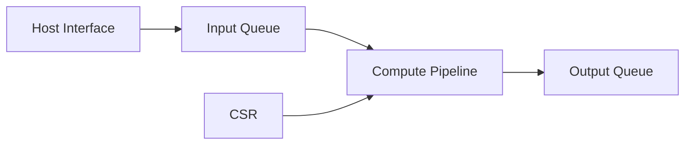

<!-- STD_DOCUMENT_COVER_BEGIN -->
# {{document_title}}

| 文档字段 | 值 |
|---|---|
| Document ID | `{{document_id}}` |
| Document Version | `{{document_version}}` |
| Status | `{{document_status}}` |
| Project | `{{project}}` |
| Authority | `{{authority}}` |
| Document Owner | {{document_owner}} |
| Authors | {{authors}} |
| Created Date | `{{created_at}}` |
| Last Modified Date | `{{last_modified_at}}` |
| Template ID | `{{template_id}}` |
| Template Version | `{{template_version}}` |
| Template Conformance | `{{template_conformance}}` |
| Tailoring Reference | {{tailoring_ref}} |
| Migration Map Reference | {{migration_map_ref}} |
| Repository | `{{source_repository}}` |
| Canonical Path | `{{source_path}}` |
| Supersedes | {{supersedes}} |

> Reviewer、Approver、Approval Date 和 Release Tag 在进入相应状态时填写。Git commit/tag 是
> 外部不可变证据；不要在文档内容中伪造包含自身的 commit hash。
<!-- STD_DOCUMENT_COVER_END -->

<!--
编写建议：先写可观察功能与完整数据路径，再分解 RTL block。每个接口、clock domain、buffer、
backpressure 和错误路径都要能落到 RTL/约束/测试文件。示例必须替换。
编写规范见 docs/design-writing-guide.md。
-->

## 1. 用途、功能与输入冻结

| 项目 | 内容 |
|---|---|
| 使用场景 | <!-- TODO --> |
| 要解决的问题 | <!-- TODO --> |
| 目标器件/板卡 | <!-- TODO --> |
| 输入契约 | <!-- API/ABI/寄存器/数据格式 --> |
| 成功条件 | <!-- TODO --> |

| Function ID | 输入 | RTL 行为 | 输出 | 时序/吞吐 | 验收条件 |
|---|---|---|---|---|---|
| RTL-F-001 | AXI stream packet | validate + transform | output packet | 1 beat/cycle steady state | golden vectors pass |

### 1.1 继承的上级约束与落实方式

本节编写建议、规范与示例

**本节目的**：把系统、板卡或父单元的固定分配接入 RTL 设计，让缓存、延迟、吞吐和功耗目标
以及复位、背压、错误与隔离行为都有上级依据，而非由各个 block 独立承诺。

**必须写清楚**：上级 Document ID、固定版本或提交、Constraint ID、决定状态及适用拓扑；
继承预算或行为约束、单位和计量边界；本地落实/内部再分配、可自行选择/不可改变的范围，
本地验证与系统组合验证分别覆盖什么、由谁验证、交付哪些证据。

**编写规范**：用来源文档与 Constraint ID 联合定位，沿用上级 ID；来自系统、板卡和机制的
要求分别标来源，内部细分关联父约束。固定器件、频率、数据宽度、并发、流控及最坏输入条件，
避免以无 stall 的局部 beat/cycle 冒充整机吞吐。定位 RTL block、状态/协议、CDC 约束、buffer
及 testbench，字段继续引用唯一机器契约；拟议分配保持拟议。无父单元时说明独立责任和直接
需求来源，不以 N/A 隐藏缺失输入；不必另建 `design.definition` 文档来重复承接。

§7、§9 给出资源与性能推导：分配含控制元数据、公共开销及余量，共享存储只计一次，不能
每个模块都占满同一总额。说明允许的流水级数、仲裁或布局选择及不得改变的顺序、超限和
恢复语义。§12 区分模块/顶层仿真、formal、实现报告等本地证据与驱动、板卡和外部链路参与的
系统组合验证；局部时序收敛不能证明系统负载下满足性能或恢复要求。冲突、超额或缺失输入
反馈原决定责任方，不静默放宽约束；上级变更只在项目明确采用后重新评估。

**抽象示例**：虚构上级拟议约束 `CON-BUF-01` 给本单元同一配置下的缓存总额 8 MiB，并要求
拥塞时背压而非覆盖未消费数据。可暂分数据 6 MiB、描述符 1 MiB、余量 1 MiB，内部队列布局
可选但计账和超限行为不可改。本地检查占用及长时间 stall 下的不覆盖不变量；系统组合还需
验证上游确实响应背压，并在既定超时内进入约定结果。仿真 PASS 不能代替板级协作证据；
数值和行为仅示范写法，不代表任何产品实现。

**完成条件**：继承项能从固定基线追到 RTL/约束/预算及验证，内部再分配可组合，自由度和
反馈边界明确；本地与系统证据分开，未运行、未满足或尚未决定的项保持可见。

| Constraint ID / 上级基线与决定状态 | 适用条件与计量边界 | 继承预算或行为约束 | 可自行选择/不可改变 | 本地落实/内部再分配 | 本地验证与系统组合验证/责任 | 差距/变更影响/证据状态 |
|---|---|---|---|---|---|---|

## 2. Top-level、模块与实现文件

| Block ID | RTL block | 职责 | Clock/Reset | 输入/输出 | Source path | Owner |
|---|---|---|---|---|---|---|
| B-001 | `input_queue` | 缓冲并施加 backpressure | core_clk/core_rst_n | AXI-S | `rtl/input_queue.sv` | RTL |

## 3. 数据面端到端流程

| Step | 数据格式 | Producer → Consumer | 处理 | Buffer/latency | 错误结果 |
|---:|---|---|---|---|---|
| 1 | InputBeat | Host IF → Queue | framing check | FIFO / 2 cycles | error counter |

说明 packet/transaction 的进入、变换、存储和输出；提供典型和边界示例向量。

## 4. 控制面、CSR 与软件交互

| Register/Command | Writer | Effect | Readback | Illegal access | Authority |
|---|---|---|---|---|---|
| `CONTROL.start` | Driver | start accepted job | busy/status | ignored + error | register spec |

描述软件从配置、启动、轮询/中断到完成或恢复的完整流程。

## 5. 内部协议、状态机和 backpressure

| State | Event/Guard | Next | Output/action | timeout/error |
|---|---|---|---|---|
| IDLE | start && configured | RUN | accept input | config error |

明确 valid/ready、ordering、queue depth、arbitration、fence 和资源耗尽行为。

## 6. Clock、Reset 与 CDC/RDC

| Domain | Frequency/source | Reset | Crossing | CDC primitive/proof | Constraint |
|---|---|---|---|---|---|
| core_clk | 300 MHz PLL | sync active-low | host→core | async FIFO | `constraints.xdc` |

## 7. Memory、DMA、buffer 与一致性

关联 §1.1 的 Constraint ID，解释共享存储、描述符、在途数据和余量的计账及超限行为。

| Resource | Owner | Address/size | Access pattern | Alignment/order | Overflow/recovery |
|---|---|---|---|---|---|
| <!-- TODO --> | | | | | |

## 8. 错误、隔离、恢复与可观测性

| Failure | Detection | Containment | CSR/interrupt/counter | Recovery | Data validity |
|---|---|---|---|---|---|
| malformed packet | header check | drop current packet | ERR_FORMAT + counter | next packet | output absent |

## 9. 资源、频率、延迟、吞吐与功耗预算

| Metric | Target | Condition/topology | Estimate | Post-implementation | Margin |
|---|---|---|---|---|---|
| LUT | < 60% | target part | <!-- TODO --> | NOT_RUN | |

注明器件、工具版本、约束、利用率假设和 evidence 等级。关联 §1.1 的 Constraint ID，
按相同拓扑、负载和计量边界校核内部再分配，区分本地结果与尚待系统验证的预算。

## 10. 软件模型、仿真器与 golden contract

定义共同输入输出、bit-exact/tolerance 规则、错误语义、测试向量和实测校准方式。

## 11. 实现计划与交付物

| 顺序 | 任务 | RTL/constraint/test path | 依赖 | 完成条件 |
|---:|---|---|---|---|
| 1 | 输入队列 | `rtl/input_queue.sv`、`tb/input_queue_tb.sv` | interface approved | lint + unit pass |

## 12. Verification 与验收

将 §1.1 的 Constraint ID 与功能/不变量一起映射到验收。本地验证覆盖 RTL、协议与实现约束；
系统组合验证覆盖实际生产者/消费者、软件驱动、板卡及时钟/复位/流控条件，注明各方责任和
交接证据。两类结果分开，局部 PASS 不关闭系统目标；差距返回原约束责任方。

| Function/Invariant/Constraint ID | 本地/系统组合范围 | 方法 | 正常/边界/失败场景与条件 | Oracle | 验证责任 | Evidence | 状态 |
|---|---|---|---|---|---|---|---|
| RTL-F-001 | 本地：RTL 顶层 | simulation | min/max packet + stall | golden vector | RTL verification | NOT_RUN | Planned |

覆盖 lint、CDC/RDC、仿真、formal、综合、实现、时序和板级；未运行不得写 PASS。

## 13. Platform Profile、风险与未决问题

| ID | 平台差异/问题 | 影响 | Owner | 关闭证据/Gate | 状态 |
|---|---|---|---|---|---|
| <!-- TODO --> | | | | | |
