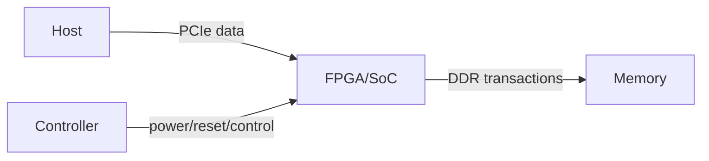

<!-- STD_DOCUMENT_COVER_BEGIN -->
# {{document_title}}

> STD 使用入口：[STD 主说明与执行流程](../../README.md)。这是工程文档标准模板；作者先读入口，再按项目已采用版本读取适用规范和专项指南。

| 文档字段 | 值 |
|---|---|
| Document ID | `{{document_id}}` |
| Document Version | `{{document_version}}` |
| Status | `{{document_status}}` |
| Project | `{{project}}` |
| Authority | `{{authority}}` |
| Document Owner | {{document_owner}} |
| Authors | {{authors}} |
| Created Date | `{{created_at}}` |
| Last Modified Date | `{{last_modified_at}}` |
| Template ID | `{{template_id}}` |
| Template Version | `{{template_version}}` |
| Template Conformance | `{{template_conformance}}` |
| Tailoring Reference | {{tailoring_ref}} |
| Migration Map Reference | {{migration_map_ref}} |
| Repository | `{{source_repository}}` |
| Canonical Path | `{{source_path}}` |
| Supersedes | {{supersedes}} |

> Reviewer、Approver、Approval Date 和 Release Tag 在进入相应状态时填写。Git commit/tag 是
> 外部不可变证据；不要在文档内容中伪造包含自身的 commit hash。
<!-- STD_DOCUMENT_COVER_END -->

<!--
编写建议：从产品要实现的功能和外部接口开始，再展开器件、电源、时钟、PCB 和验证。
数值必须带单位、条件和证据等级；示例必须替换。编写规范见 docs/design-writing-guide.md。
-->

## 1. 产品用途、问题与成功条件

<!-- 编写建议：先说明板卡在整机中的位置、承担的功能和需要解决的具体问题，给出输入、可观察输出及失败保护。成功条件要绑定配置、负载、环境和测量方法；“满足性能要求”不是可验收条件。 -->

| 项目 | 内容 |
|---|---|
| 使用场景 | <!-- 示例：单槽 PCIe 加速卡 --> |
| 要解决的问题 | <!-- TODO --> |
| 关键功能 | <!-- TODO --> |
| 成功条件 | <!-- 示例：所有电源轨通过、链路稳定枚举、热稳态不过限 --> |
| Non-goals | <!-- TODO --> |

### 1.1 继承的上级约束与落实方式

本节编写建议、规范与示例

**本节目的**：把系统或父单元分配给板卡的预算和行为要求转为本地设计输入，避免板卡只列
自己的目标，却无法证明其接入后仍满足系统约束。

**必须写清楚**：上级 Document ID、固定版本或提交、Constraint ID、决定状态及适用配置；
继承的功耗、尺寸、散热、链路等预算与启动、保护、制造测试等行为约束；本地落实位置、
内部再分配、可自行选择/不可改变的范围，以及本地验证与系统组合验证的责任和条件。

**编写规范**：用来源文档与 Constraint ID 联合定位，沿用上级 ID；细分项关联父约束，不把
拟议输入当作已批准决定。正文解释落实到哪些器件、电源树、原理图页、PCB 区域、固件或测试
预留，字段和接口引用唯一契约。器件选择可在已给自由度内调整，但不能静默放宽输入功率、
风道、启动时序或故障保护要求。确无父单元时说明独立责任及直接需求来源，不能用 N/A 隐藏
缺失输入；不必另建 `design.definition` 文档来重复承接。

内部预算计入转换损耗、公共开销和余量，以相同负载、温度、配置及测量边界组合校核。板卡
输入功率若已包含 FPGA，系统不能把两者再次相加。§7 保留推导，§10 落实制造测试预留，
§12 按同一约束区分板级验证和整机供电、风道、链路及保护联动验证。缺口记录差值、影响和
裁决责任，不能修改测试预期来假装满足；上级变更只在项目明确采用后重新评估。

**抽象示例**：虚构上级拟议约束 `CON-PWR-01` 限定板卡输入不超过 100 W，已含转换损耗和
板载风扇。板卡暂分逻辑与存储 80 W、损耗和风扇 10 W、余量 10 W，并在电源与热设计中推导
适用负载和环境；可选择器件，不能把损耗移出计账。板级按同一输入边界测量，整机还需验证
规定插槽组合、供电和风道下的行为，单板通过不能关闭整机验证。数值仅为写法示例，不是实测。

**完成条件**：每项继承约束可追到固定来源、本地落实/内部再分配及验证，自由度与禁止变更
边界明确；本地验证与系统组合验证分别有责任、条件和证据状态，待验证或不满足的项不冒称闭合。

| Constraint ID / 上级基线与决定状态 | 适用条件与测量边界 | 继承预算或行为约束 | 可自行选择/不可改变 | 本地落实/内部再分配 | 本地验证与系统组合验证/责任 | 差距/变更影响/证据状态 |
|---|---|---|---|---|---|---|

## 2. 系统边界与功能清单

<!-- 编写建议：画出板卡与主机、电源、其他板卡、传感器及维护人员的边界，逐功能写输入、硬件行为、输出、失败保护和验收条件。按上级功能/Constraint ID 追溯，避免把器件清单当功能清单。 -->

| Function ID | 输入 | 硬件行为 | 输出 | 失败/保护 | 验收条件 |
|---|---|---|---|---|---|
| HW-F-001 | 12 V 输入 | 转换并监控核心电源 | 0.85 V rail | OVP/OCP shutdown | 全负载电压在容差内 |

## 3. 功能框图、数据流与控制流

<!-- 编写建议：先列板级数据/控制/电源对象及方向；跨板卡或跨器件的共享类型、状态与错误指示引用上级 Data/Type/Error ID 和固定来源。本层拥有的信号逐项给位宽、电平、时序、复位及失效含义，不套软件数据库字段。 -->

逐条解释数据、控制、电源、时钟和复位如何穿过各模块。

## 4. 模块、器件与实现位置

<!-- 编写建议：依据 §3 框图逐模块说明器件选择、实际料号、封装、供电和接口，并定位原理图页及 PCB 区域。解释选择依据、替代料约束和供应风险；同名功能块在图、BOM 和原理图之间必须可追。 -->

| Block | 职责 | 关键器件/P-N | Provided interface | 依赖 | 原理图/PCB 位置 |
|---|---|---|---|---|---|
| Power | 生成核心 rail | <!-- TODO --> | PGOOD | 12 V | `SCH-POWER` |

记录正式料号、封装、生命周期、供应风险、替代料和 qualification 状态。

## 5. 外部接口

<!-- 编写建议：先列所有连接器/端口的 Interface/Member ID、提供和消费器件、唯一规范来源；逐项说明引脚/信号、方向、电平、时序、协议版本、保护、错误与测试。系统公共错误码若经驱动上报，明确硬件指示到 Error ID 的映射责任，而不在板卡文档私设公共代码值。 -->

| Interface | Connector/Pin | Protocol/Level | Direction | Rate/Timing | Protection | Authority |
|---|---|---|---|---|---|---|
| PCIe | J1 | Gen5 x8 | bidirectional | 32 GT/s | ESD | interface spec |

按 `docs/interface-data-mapping-standard.md` 承接接口族#成员 ID，不另外复制寄存器/信号 authority；标准号、版本、适用部分与项目选项写全，自定义信号明确方向、位宽、时钟/时序、电压/电平及其他适用电气条件。

| 接口/信号/寄存器成员 ID / 上级 Constraint | 机器源 / selector / 版本/revision/hash | 标准绑定 / 项目条件 | 提供/消费 / 器件端口/原理图位置或未实现 | 设计 V → 板级 Case / 系统组合验证 |
|---|---|---|---|---|

## 6. 电源、时钟、复位与启动顺序

<!-- 编写建议：用时序图描述上电、时钟稳定、复位释放、固件/FPGA 就绪到可工作，以及关机与异常掉电。每个 rail/clock/reset 给来源、目标与容差、监测点、依赖和超时保护；不得只列电压表而没有启动因果关系。 -->

| Rail/Clock/Reset | Source | Consumer | Target/Tolerance | Sequence dependency | Monitor |
|---|---|---|---|---|---|
| VCORE | U10 | FPGA core | 0.85 V ±3% | after 12V_OK | ADC0 |

提供启动和关断时序，说明异常时的保护和恢复。

## 7. 高速、PCB、机械与热设计

<!-- 编写建议：把上级链路、尺寸、功耗和温度约束转成叠层、阻抗、损耗、布局、风道与热预算，说明负载/环境条件、模型、余量及后续实测。系统总额与板级分配使用同一边界，不能把转换损耗或风扇功耗移到表外。 -->

记录 stack-up、阻抗、loss budget、SI/PI、布局布线、尺寸、安装、风道、热模型和环境范围。
预算关联 §1.1 的 Constraint ID，说明分配、损耗、余量及组合推导，不把本地目标代替上级要求。

| Budget | Target | Condition | Method/tool | Margin | Evidence |
|---|---|---|---|---|---|
| 热阻 | <!-- TODO --> | ambient/load/airflow | simulation | | modeled |

## 8. 配置、BOM 与产品变体

<!-- 编写建议：逐 SKU/装配变体说明料件差异、识别方法、功能和兼容性变化，并绑定配置或 eFuse/跳线的真实来源。替代料应记录 qualification 条件；不能让一个 BOM 行隐含多个未说明的行为变体。 -->

| Variant | Population/config | Capability difference | Compatibility | Identification |
|---|---|---|---|---|
| <!-- TODO --> | | | | |

## 9. 故障、保护、诊断与恢复

<!-- 编写建议：从过流、过温、链路失步、存储错误等具体故障出发，逐项写检测、保护动作、可见信号、锁存/自动恢复条件及残余风险。说明维修人员从哪里观察和执行复位，保护动作不能让无效数据继续被当作正常输出。 -->

| Failure | Detection | Protection | Observable signal | Recovery | Residual risk |
|---|---|---|---|---|---|
| over-temperature | sensor threshold | throttle/shutdown | alert + latch | cool + explicit reset | <!-- TODO --> |

## 10. 制造、测试与 Bring-up

<!-- 编写建议：从制造缺陷如何被发现反推测试点、连接器、烧录/校准、边界扫描和装配前后可达性；写清首板上电顺序、预期量测值、停机阈值及失败定位到可返修单元的方法。详细工装可另立文档，但板卡必须预留必要能力。 -->

给出 DFM/DFT、test point、边界扫描、产测、首板上电顺序、预期测量值和停止条件。
关联 §1.1 分配的测试能力与 Constraint ID，定位原理图/PCB/固件的预留及装配后的可达性。

## 11. 实现交付物与变更计划

<!-- 编写建议：按原理图、PCB、BOM、装配资料、固件配合和验证工装的依赖顺序列交付物，给真实文件/页/区域、Owner、输入和检查结果。接口或电源政策未定时应先关闭决定，不把“画板完成”当可制造交付。 -->

| 顺序 | 交付物/变更 | 文件/页/区域 | Owner | 输入 | 完成条件 |
|---:|---|---|---|---|---|
| 1 | 电源原理图 | `hardware/schematic/power.kicad_sch` | EE | rail budget | ERC + review |

## 12. Verification 与验收

<!-- 编写建议：每项功能和 Constraint ID 给出板级与系统组合的测试条件、测量边界、独立 Oracle、责任方和证据状态。分析、仿真、检查、演示与实测分开；单板通过不自动证明整机供电、风道、链路和故障联动。 -->

将 §1.1 的 Constraint ID 与功能/需求一起映射到验收。板级检查验证本地落实；系统组合验证
检查多板、供电、散热、链路及保护的共同条件，注明系统责任方和交接证据。两类结果分开记录，
局部 PASS 不关闭系统目标；未执行写 NOT_RUN，差距返回原约束责任方。

| Function/Requirement/Constraint ID | 本地/系统组合范围 | 方法 | 条件与测量边界 | 测量/Oracle | 验证责任 | Evidence | 状态 |
|---|---|---|---|---|---|---|---|
| HW-F-001 | 本地：板卡电源轨 | bench test | min/nominal/max load | voltage tolerance | EE | NOT_RUN | Planned |

区分 analysis、simulation、inspection、demonstration 和 test；区分估算与实测。

## 13. 风险、未决问题与决定

<!-- 编写建议：记录器件供货、SI/PI、热、EMC、测试可达性和上级输入不足等具体风险，每项给影响、Owner、最晚关闭 Gate 及所需证据。关键器件或约束未定时不能把设计状态提升为已完成。 -->

| ID | 问题/风险 | 影响 | Owner | 关闭证据/Gate | 状态 |
|---|---|---|---|---|---|
| <!-- TODO --> | | | | | |
