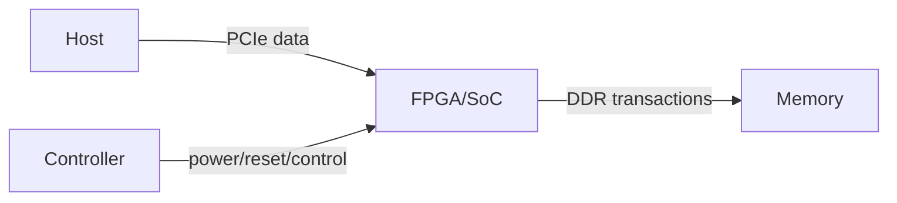

<!-- STD_DOCUMENT_COVER_BEGIN -->
# {{document_title}}

| 文档字段 | 值 |
|---|---|
| Document ID | `{{document_id}}` |
| Document Version | `{{document_version}}` |
| Status | `{{document_status}}` |
| Project | `{{project}}` |
| Authority | `{{authority}}` |
| Document Owner | {{document_owner}} |
| Authors | {{authors}} |
| Created Date | `{{created_at}}` |
| Last Modified Date | `{{last_modified_at}}` |
| Template ID | `{{template_id}}` |
| Template Version | `{{template_version}}` |
| Template Conformance | `{{template_conformance}}` |
| Tailoring Reference | {{tailoring_ref}} |
| Migration Map Reference | {{migration_map_ref}} |
| Repository | `{{source_repository}}` |
| Canonical Path | `{{source_path}}` |
| Supersedes | {{supersedes}} |

> Reviewer、Approver、Approval Date 和 Release Tag 在进入相应状态时填写。Git commit/tag 是
> 外部不可变证据；不要在文档内容中伪造包含自身的 commit hash。
<!-- STD_DOCUMENT_COVER_END -->

<!--
编写建议：从产品要实现的功能和外部接口开始，再展开器件、电源、时钟、PCB 和验证。
数值必须带单位、条件和证据等级；示例必须替换。编写规范见 docs/design-writing-guide.md。
-->

## 1. 产品用途、问题与成功条件

| 项目 | 内容 |
|---|---|
| 使用场景 | <!-- 示例：单槽 PCIe 加速卡 --> |
| 要解决的问题 | <!-- TODO --> |
| 关键功能 | <!-- TODO --> |
| 成功条件 | <!-- 示例：所有电源轨通过、链路稳定枚举、热稳态不过限 --> |
| Non-goals | <!-- TODO --> |

## 2. 系统边界与功能清单

| Function ID | 输入 | 硬件行为 | 输出 | 失败/保护 | 验收条件 |
|---|---|---|---|---|---|
| HW-F-001 | 12 V 输入 | 转换并监控核心电源 | 0.85 V rail | OVP/OCP shutdown | 全负载电压在容差内 |

## 3. 功能框图、数据流与控制流

逐条解释数据、控制、电源、时钟和复位如何穿过各模块。

## 4. 模块、器件与实现位置

| Block | 职责 | 关键器件/P-N | Provided interface | 依赖 | 原理图/PCB 位置 |
|---|---|---|---|---|---|
| Power | 生成核心 rail | <!-- TODO --> | PGOOD | 12 V | `SCH-POWER` |

记录正式料号、封装、生命周期、供应风险、替代料和 qualification 状态。

## 5. 外部接口

| Interface | Connector/Pin | Protocol/Level | Direction | Rate/Timing | Protection | Authority |
|---|---|---|---|---|---|---|
| PCIe | J1 | Gen5 x8 | bidirectional | 32 GT/s | ESD | interface spec |

## 6. 电源、时钟、复位与启动顺序

| Rail/Clock/Reset | Source | Consumer | Target/Tolerance | Sequence dependency | Monitor |
|---|---|---|---|---|---|
| VCORE | U10 | FPGA core | 0.85 V ±3% | after 12V_OK | ADC0 |

提供启动和关断时序，说明异常时的保护和恢复。

## 7. 高速、PCB、机械与热设计

记录 stack-up、阻抗、loss budget、SI/PI、布局布线、尺寸、安装、风道、热模型和环境范围。

| Budget | Target | Condition | Method/tool | Margin | Evidence |
|---|---|---|---|---|---|
| 热阻 | <!-- TODO --> | ambient/load/airflow | simulation | | modeled |

## 8. 配置、BOM 与产品变体

| Variant | Population/config | Capability difference | Compatibility | Identification |
|---|---|---|---|---|
| <!-- TODO --> | | | | |

## 9. 故障、保护、诊断与恢复

| Failure | Detection | Protection | Observable signal | Recovery | Residual risk |
|---|---|---|---|---|---|
| over-temperature | sensor threshold | throttle/shutdown | alert + latch | cool + explicit reset | <!-- TODO --> |

## 10. 制造、测试与 Bring-up

给出 DFM/DFT、test point、边界扫描、产测、首板上电顺序、预期测量值和停止条件。

## 11. 实现交付物与变更计划

| 顺序 | 交付物/变更 | 文件/页/区域 | Owner | 输入 | 完成条件 |
|---:|---|---|---|---|---|
| 1 | 电源原理图 | `hardware/schematic/power.kicad_sch` | EE | rail budget | ERC + review |

## 12. Verification 与验收

| Function/Requirement | 方法 | 条件 | 测量/Oracle | Evidence | 状态 |
|---|---|---|---|---|---|
| HW-F-001 | bench test | min/nominal/max load | voltage tolerance | report | Planned |

区分 analysis、simulation、inspection、demonstration 和 test；区分估算与实测。

## 13. 风险、未决问题与决定

| ID | 问题/风险 | 影响 | Owner | 关闭证据/Gate | 状态 |
|---|---|---|---|---|---|
| <!-- TODO --> | | | | | |
