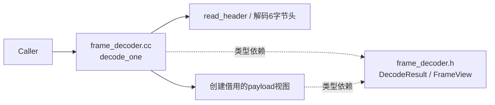
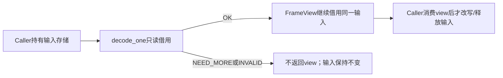
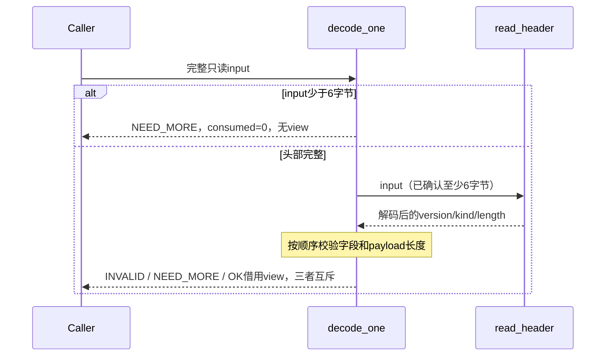
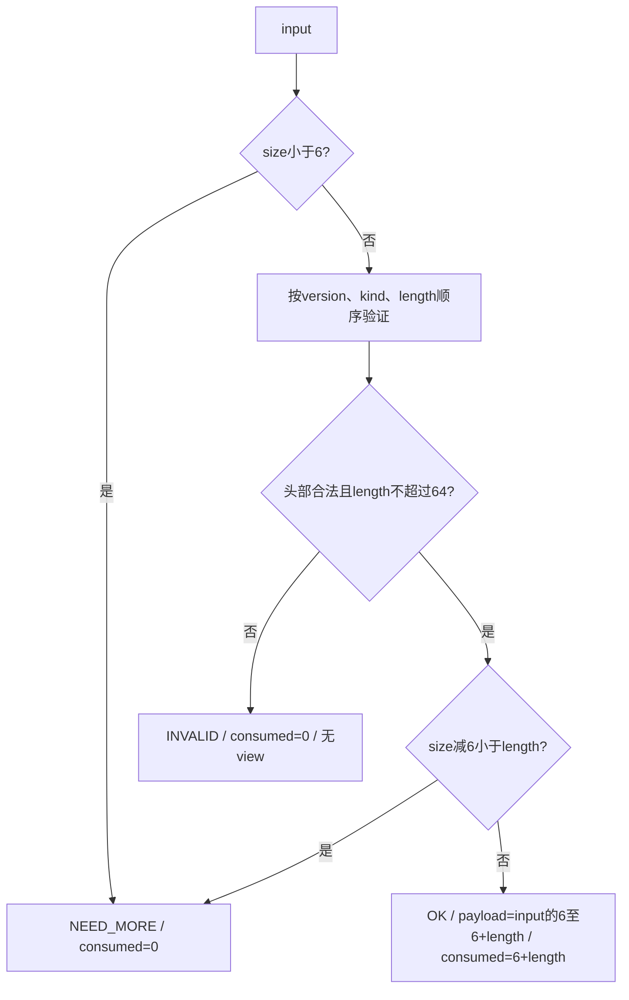

<!-- STD_DOCUMENT_COVER_BEGIN -->
# {{document_title}}

> STD 使用入口：[STD 主说明与执行流程](../../README.md)。这是工程文档标准模板；作者先读入口，再按项目已采用版本读取适用规范和专项指南。

| 文档字段 | 值 |
|---|---|
| Document ID | `{{document_id}}` |
| Document Version | `{{document_version}}` |
| Status | `{{document_status}}` |
| Project | `{{project}}` |
| Document Owner | {{document_owner}} |
| Last Modified Date | `{{last_modified_at}}` |
| Template ID | `{{template_id}}` |
| Template Version | `{{template_version}}` |
<!-- STD_DOCUMENT_COVER_END -->

## 1. 实现目标与输入基线

<a id="isd-scope"></a>

<details>
<summary>编写要求与完成条件</summary>

先用一段文字说明功能、场景、代表输入输出及本次范围。默认一个模块一份ISD，覆盖多个源文件；模块设计已达到本模板深度时直接兼作，不重复建文。ISD不新增模块层级或编号。遵循 `docs/isd-standard.md` 和 `docs/ai-guides/implementation-design.md`。独立稿默认位于 `docs/50_implementation_design/<name>.isd.md`，项目已有批准路径时沿用该路径。

独立稿为design.implementation、level=module、domain=software；parent_document_id沿模块直属父对象设计，同模块设计用下表单独引用。项目采用的版本固定，不自动追随上游。帮助块和虚构教学例子不能替代项目正文。

逐项按ISD规范的承接矩阵确定分工：模块设计不能把关键数据、签名、算法、过程、失败语义和验证规格推迟到ISD。本层细化私有表示、函数步骤和装配；已有完整定义用固定来源引用并保留必要语义，不重复维护。每行写清本层必须展开什么、哪些决定不可改变、允许的实现自由度及原V/Case入口。

完成条件：读者明确做什么、输入来自哪里、原决定是什么、本次实现范围和非目标。

全文统一采用“记录型 → 固定字段段落；矩阵型 → 表格”。一个模块、函数、数据对象、异常、验证项或未决问题是独立多字段记录，必须逐项使用本模板给出的字段段落；只有库状态分支、状态转换或短值映射等需要横向比较的内容才用表格。同类记录不得混用两种形式。
</details>

### 1.1 实现对象

- **模块 ID / 名称**：<!-- TODO -->
- **直属父对象 / 父设计**：<!-- TODO -->
- **模块设计 Document ID / 版本 / 路径 / 摘要**：<!-- TODO -->
- **需求与 Constraint ID**：<!-- TODO -->
- **实现范围 / 非目标**：<!-- TODO -->
- **ISD 默认落位或项目批准路径**：<!-- TODO -->

<a id="isd-handoff"></a>

### 1.2.N `<Handoff ID>` · <承接项名称>

- **上游信息项 / 规则 ID**：<!-- TODO -->
- **固定来源 / 版本 / 锚点 / 摘要**：<!-- TODO -->
- **ISD 细化内容 / 章节**：<!-- TODO -->
- **唯一权威位置**：<!-- TODO -->
- **实现自由度**：<!-- TODO -->
- **原 V/Case 及本地验证位置**：<!-- TODO -->

## 2. 既有实现差异（条件章节）

<details><summary>编写要求与完成条件</summary>

本章只在 brownfield 场景适用：存在需要修改的既有代码，并已固定 baseline commit/version。逐项列保留、新增、修改、删除的具体位置和原因；框架集成写 hook 所在函数、触发条件、原路径如何保留及回退是否已获上级允许，禁止只写“接入框架”。

greenfield 或设计先行且不存在既有实现时，不制造 Current，也不从其他项目抄实现；在正文明确 `not_applicable`、原因和已接受的 tailoring/范围决定引用，然后直接描述 Target。未存在的目标路径标 Planned。完成条件是适用性可判定；适用时每项差异能回到模块决定，已有用户改动得到保留。
</details>

### 2.1 适用性

- **适用性**：<!-- brownfield / not_applicable -->
- **依据**：<!-- baseline commit/version；或 greenfield/设计先行说明 -->
- **Tailoring / 范围决定引用**：<!-- TODO -->

### 2.N `<Change ID>` · <差异名称>

- **基线 commit / 版本**：<!-- TODO -->
- **文件 / symbol**：<!-- TODO / Planned -->
- **Current 行为**：<!-- TODO -->
- **Target 改动与理由**：<!-- TODO -->
- **原规则 / 成员 ID**：<!-- TODO -->
- **实现状态**：<!-- Planned / Implemented；与 §5、§8–§10 一致 -->

## 3. 文件、内部组件与调用关系

<a id="isd-structure"></a>

<details><summary>编写要求与完成条件</summary>

先画内部文件/组件调用与类型依赖，再解释分工。一个类不必独占文件，一个文件不必独立成ISD。列头文件可见性、构建目标、生成源与输出；拆分稿由唯一入口汇总，不重复维护共享类型。完成条件是能定位入口、helper、共享类型和实际装配位置。
</details>

<!-- STD_TEMPLATE_EXAMPLE_BEGIN -->
虚构EX-ISD/v1，FrameDecoder（M201），Target / NOT_IMPLEMENTED / NOT_RUN。同步解析一个帧，不创建线程。



实线为调用/处理，虚线为类型依赖；read_header是私有helper，仍在同一模块。真实项目替换文件及关系，不复制此解析协议。
<!-- STD_TEMPLATE_EXAMPLE_END -->

### 3.N `<File / Internal ID>` · <文件或内部组件>

- **职责及调用者**：<!-- TODO -->
- **类型 / 函数**：<!-- TODO -->
- **可见性**：<!-- public / private / generated -->
- **调用与类型依赖**：<!-- TODO -->
- **构建目标 / 生成源 / 输出**：<!-- TODO -->
- **实现状态**：<!-- Planned / Implemented -->

## 4. 内部数据与所有权

<a id="isd-data"></a>

<details><summary>编写要求与完成条件</summary>

给私有结构逐字段类型、单位、初值、范围、不变量及 owner。只有原生 ABI、持久二进制、寄存器或跨语言布局适用时才展开字节、位宽、`sizeof`、端序和对齐；Python 对象、JSON、HTTP 等纯软件逻辑结构写 `N/A + 原因 + authority`，不为满足模板虚构 ABI。公共类型引用 interfaces 源 ID/selector/version/hash，不复制形成第二份权威。画输入、工作区、输出的创建/借用/释放和失败路径；持久状态另给事件、Guard、动作和退出。完成条件是成功及失败都无无主对象。
</details>

<!-- STD_TEMPLATE_EXAMPLE_BEGIN -->
EX-ISD/v1的输入是只读字节span；FrameView为 `{kind:u8, payload:borrowed byte span}`。DecodeResult为互斥分支：OK(view,consumed:size_t)、NEED_MORE(consumed=0)、INVALID(reason,consumed=0)。无堆分配。


<!-- STD_TEMPLATE_EXAMPLE_END -->

### 4.N `<Data ID>` · <私有类型或数据对象>

- **类型 / 字段**：<!-- 逐字段 TODO -->
- **单位 / 初值 / 范围 / 不变量**：<!-- TODO -->
- **逻辑编码与原生 ABI 适用性**：<!-- 适用时写字节、位宽、端序、对齐；否则 N/A + 依据 -->
- **创建 / 修改者**：<!-- TODO -->
- **Owner / 借用期限 / 释放者**：<!-- TODO -->
- **公共类型 authority**：<!-- source ID / selector / version / hash；或 private -->
- **持久化与敏感性**：<!-- transient / persistent；敏感字段及处理 -->

## 5. 函数与接口实现规格

<a id="isd-functions"></a>

<details><summary>编写要求与完成条件</summary>

逐关键函数给签名、完整参数、返回、错误优先级、前置条件、上下文、副作用、幂等和 ownership。每项还必须明确 `thread-safe`、`reentrant`、nested-call policy、transaction participation、blocking/timeout；未知就作为设计缺口，不能由编码者猜测。简单无状态函数可分组，有副作用或共享状态的函数须单独说明。接口输入与输出逐项引用权威成员；内部 helper 明确拿到原始请求还是已校验值。不能以“见代码”省略当前尚未确定的设计。

本章同时维护错误传播矩阵的实现视图：从底层异常或失败事实追到模块处理、typed/native 异常所有权、宿主/public error、日志和 retry。规则的业务语义仍由上游唯一维护；本层只落实准确抛出、捕获和映射位置。
</details>

<!-- STD_TEMPLATE_EXAMPLE_BEGIN -->
教学签名 `DecodeResult decode_one(std::span<const std::uint8_t> input) noexcept`，位于 `ex_isd` 命名空间；非空span要求有效存储，空span允许。数据竞争和悬空地址是调用者违约，不伪装成帧格式错误。借用输出不跨输入寿命。


<!-- STD_TEMPLATE_EXAMPLE_END -->

### 5.1.N `<Function ID>` · <函数名称>

- **文件 / symbol / 可见性**：<!-- TODO -->
- **原成员 ID 或私有来源**：<!-- TODO -->
- **完整签名与 caller**：<!-- TODO -->
- **前置条件与校验顺序**：<!-- TODO -->
- **返回 / 错误优先级**：<!-- TODO -->
- **副作用 / 执行上下文 / 幂等性**：<!-- TODO -->
- **输入输出 ownership 与寿命**：<!-- TODO -->
- **Thread-safe / reentrant**：<!-- yes/no/conditional + 条件 -->
- **Nested-call policy**：<!-- allowed/forbidden + 锁/事务边界 -->
- **Transaction participation**：<!-- none/owner/joins existing/creates new -->
- **Blocking / timeout / cancellation**：<!-- TODO -->
- **实现状态 / 验证项**：<!-- Planned/Implemented；VRC... -->

### 5.2 错误传播矩阵

#### 5.2.N `<Error ID>` · <异常或失败场景>

- **底层异常 / 失败事实**：<!-- TODO -->
- **模块是否处理及处理函数**：<!-- propagate / translate / recover / reject -->
- **Typed 异常与原生异常所有权**：<!-- 谁抛出、谁捕获、谁映射 -->
- **宿主 / public payload 或状态码**：<!-- TODO -->
- **日志级别 / 脱敏 / 关联字段**：<!-- TODO -->
- **是否可重试及前提**：<!-- query / replay / takeover / new attempt -->
- **状态与副作用影响 / 验证项**：<!-- TODO -->

## 6. 关键流程与算法

<a id="isd-algorithms"></a>

<details><summary>编写要求与完成条件</summary>

每个重要过程有流程图或时序图，并说明入口、数据形态、分支事实来源、结果可见点和异常出口。关键算法给伪代码、具体输入和中间值；不要逐行重述全部代码。异步过程分别设计正常、取消、迟到、超时和未知访问，不从教学同步例推导无需清理。

每个重要算法必须有算法图、连续正文及具体输入推演，必要时配伪代码；主流程图只有展开该算法的实际条件、推进和退出才可兼作。核对整数提升、溢出、边界、未对齐访问和语言/库默认行为，不用抽象的“读取整数”掩盖实现风险。简单逻辑不强造算法。
</details>

<!-- STD_TEMPLATE_EXAMPLE_BEGIN -->
EX-ISD/v1规则：头为version:u8、kind:u8、length:u32大端，共6字节；仅version=1、kind=1，payload最多64字节，零长允许。错误优先级为version、kind、length；完整头非法立即INVALID，不等待payload。只解析首帧，余字节交caller。



```text
if input.size < 6: return NEED_MORE(0)
read version, kind, length_be
if version != 1: return INVALID(VERSION, 0)
if kind != 1: return INVALID(KIND, 0)
if length_be > 64: return INVALID(LENGTH, 0)
if input.size - 6 < length_be: return NEED_MORE(0)
return OK(borrow(input[6 : 6+length_be]), 6+length_be)
```

输入 `01 01 00 00 00 02 41 42` 得length=2、借用payload=`41 42`、consumed=8。只收到前7字节得NEED_MORE；长度字段为65时仅头部就INVALID。先限制长度再加6，不把未知u32直接加到小类型。
<!-- STD_TEMPLATE_EXAMPLE_END -->

### 6.N `<Process / Rule ID>` · <过程或算法名称>

- **触发与执行者**：<!-- TODO -->
- **入口函数及数据**：<!-- TODO -->
- **步骤 / 算法 / 复杂度**：<!-- TODO；必要时引用图和伪代码 -->
- **判断事实来源**：<!-- 调用 / 事件 / 字段 / 时钟 -->
- **成功可见点**：<!-- TODO -->
- **失败、取消与清理**：<!-- TODO -->
- **代表输入与中间值**：<!-- TODO -->
- **规则 / 接口 / 验证引用**：<!-- TODO -->

## 7. 并发、失败、持久化与安全生命周期

<a id="isd-lifecycle"></a>

<details><summary>编写要求与完成条件</summary>

列线程/回调、锁粒度及顺序、锁内禁止调用、原子/可见性、依赖和外部访问寿命。区分状态查询、幂等重放、执行者接管、新业务重试；取消请求/超时不等于实际停止。启动部分失败、半组提交、迟到结果、断连及关闭各给谁清理、凭什么事实及有限等待出口。同步无状态模块说明为何无相关机制，不空造状态机。

拥有持久状态时，继承上游事务、恢复和升级政策，落实事务边界及开始/提交/回滚函数、原子覆盖的数据及事务外副作用；区分持久提交点、对外响应点和响应丢失后的结果核对。指出崩溃后由谁调用恢复入口、读取哪个版本/记录、怎样判断已提交或未完成，以及重复恢复的安全条件。

schema 演进与拒绝语义为持久化模块必填。先写策略决定，明确首版或当前版本不接受的迁移模式，例如无增量升级、无 downgrade、无自动修复；再逐项给原规则、升级/降级策略、接受/拒绝条件、源/目标版本与转换函数、拒绝后的处理。必须覆盖空库、版本匹配、版本不匹配、无版本表旧库、部分初始化和完整性失败的状态分支，说明事实来源、启动结果及是否允许重跑。重要恢复/转换过程按 §6 配图和推演。无持久状态时说明不适用及实际宿主边界，不生成数据库策略。

教学FrameDecoder只使用栈变量，并发调用不共享可变状态；同一输入可并发只读，caller不得同时改写。无取消接口、外部I/O或持久状态。

承接模块安全/权限和可观测性要求，不只设计功能错误：按适用性写可信身份/授权检查函数、被检查字段、副作用前的拒绝点、权限依赖失败出口；敏感数据禁止记录范围、脱敏位置；原日志/指标/trace 的触发、关联 ID、单位/窗口/重置及上报函数。已有诊断命令写实际入口和权限，不另造机制。不拥有这些能力时指出返回给宿主的结构化信息、宿主接收点及其责任；“宿主负责”不能代替交接设计。

使用本地持久化时，安全记录必须可执行：明确文件和目录权限、创建时 umask、symlink/hardlink 处理、备份与恢复介质、敏感数据静态保护、删除/擦除、磁盘耗尽及只读文件系统。每项写检查对象、时点、判定事实、拒绝或降级出口和验证项，不能只写“权限安全”。
</details>

### 7.1 并发、交错与失败收口

#### 7.1.N `<Concurrency / Failure ID>` · <交错或故障名称>

- **参与线程 / 回调 / 事务**：<!-- TODO -->
- **已产生或可能产生的副作用**：<!-- TODO -->
- **检测事实 / 期限**：<!-- TODO -->
- **状态 / 错误 / 结果已知性**：<!-- TODO -->
- **保留 / 释放责任**：<!-- TODO -->
- **允许的 query / replay / takeover / retry**：<!-- TODO -->
- **验证项**：<!-- TODO -->

<a id="isd-persistence"></a>

### 7.2 持久化、恢复与 schema 演进

#### 7.2.1.N `<Persistence ID>` · <事务或持久化操作>

- **原规则 / 事务**：<!-- TODO -->
- **原子范围 / 事务外副作用**：<!-- TODO -->
- **开始 / 提交 / 回滚函数**：<!-- TODO -->
- **持久提交点 / 对外响应点**：<!-- TODO -->
- **响应丢失后的权威核对**：<!-- TODO -->
- **恢复入口 / 判定记录 / 重复恢复条件**：<!-- TODO -->
- **验证项**：<!-- TODO -->

#### 7.2.2 Schema 演进策略决定

- **Schema authority / 当前版本事实来源**：<!-- TODO -->
- **允许的升级模式**：<!-- TODO -->
- **明确不接受的迁移模式**：<!-- 例如：无增量升级 / 无 downgrade / 无自动修复；按项目实际写 -->
- **兼容边界**：<!-- 新程序读旧库、旧程序读新库、跨版本跳跃 -->
- **失败后的系统状态与责任方**：<!-- TODO -->

##### 7.2.2.N `<Schema Rule ID>` · <演进或拒绝规则>

- **原规则**：<!-- TODO -->
- **升级 / 降级策略**：<!-- TODO -->
- **接受 / 拒绝条件**：<!-- TODO -->
- **源 / 目标版本与转换函数**：<!-- TODO -->
- **拒绝后如何处理**：<!-- 拒绝启动 / 只读 / 人工恢复；不得静默修复 -->
- **验证项**：<!-- TODO -->

#### 7.2.3 库状态分支矩阵

| 库状态 | 判定事实 | 启动结果 | 是否允许重跑及条件 |
|---|---|---|---|
| 空库 | <!-- TODO --> | <!-- TODO --> | <!-- TODO --> |
| 版本匹配 | <!-- TODO --> | <!-- TODO --> | <!-- TODO --> |
| 版本不匹配 | <!-- TODO --> | <!-- TODO --> | <!-- TODO --> |
| 无版本表旧库 | <!-- TODO --> | <!-- TODO --> | <!-- TODO --> |
| 部分初始化 | <!-- TODO --> | <!-- TODO --> | <!-- TODO --> |
| 完整性失败 | <!-- TODO --> | <!-- TODO --> | <!-- TODO --> |

<a id="isd-security"></a>

### 7.3 安全、权限与可观测性

#### 7.3.1.N `<Security / Observability ID>` · <规则名称>

- **原规则**：<!-- TODO -->
- **可信输入 / 敏感字段 / 检查对象**：<!-- TODO -->
- **检查函数 / 时点**：<!-- TODO -->
- **拒绝 / 宿主交付出口**：<!-- TODO -->
- **脱敏 / 禁止输出**：<!-- TODO -->
- **日志 / 指标 / trace 口径及触发**：<!-- TODO -->
- **验证项**：<!-- TODO -->

#### 7.3.2.N `<Local Storage Security ID>` · <本地持久化安全项>

- **适用对象 / 路径 / Owner**：<!-- 文件、目录、备份或介质 -->
- **文件与目录权限 / umask**：<!-- TODO -->
- **Symlink / hardlink / 路径替换策略**：<!-- TODO -->
- **备份 / 恢复 / 敏感数据静态保护**：<!-- TODO -->
- **删除 / 擦除 / 保留期限**：<!-- TODO -->
- **磁盘耗尽 / 只读文件系统行为**：<!-- TODO -->
- **检查时点 / 判定 / 拒绝或降级出口**：<!-- TODO -->
- **验证项**：<!-- TODO -->

## 8. 资源、构建与宿主接入

<a id="isd-resources"></a>

<details><summary>编写要求与完成条件</summary>

写明工具链/语言、库版本、产物、编译链接条件、导出/私有范围和宿主如何初始化、注入及销毁。既有框架写实际调用点，内部模块引用原构建目标，不强建新库。峰值含输入、工作区、结果、并发副本及未知占用；上限来自原预算，超限行为确定。未测量不标Measured。

引用模块设计的环境和预算基线，逐项落到本实现：软件/库版本、硬件与虚拟化、依赖和数据规模；初始化、复位、启动、排队/运行、停止、清理的起止事件、单调计时点、分段预算及总期限。重试不重置总期限，等待或清理超限给具体出口，未确认安全不得释放。明确冷/热启动、并发启动峰值、共享额度扣减/归还及仍由宿主承担的范围，不重新制定上级政策。涉及 LLM 时关联所需能力、上下文与最大输出、请求量、并发和排队/调用预算，并定位请求构造、限额申请与超限处理函数；不适用时说明实际边界。

教学例目标为C++20的既有解析库，测试目标包含frame_decoder.cc；复杂度O(1)、payload零拷贝，无堆工作区，输入和输出视图存储归caller。示例不规定项目语言或预算。
</details>

### 8.N `<Resource / Build ID>` · <资源或装配项>

- **目标文件 / 产物 / 构建目标**：<!-- TODO -->
- **工具链 / 语言 / 依赖版本**：<!-- TODO -->
- **宿主接入 / 初始化 / 退出次序**：<!-- TODO -->
- **环境 / 数据规模 / 冷热条件**：<!-- TODO -->
- **峰值构成 / 上限 / 共享额度**：<!-- TODO -->
- **分段预算 / 总期限 / 计时点**：<!-- TODO -->
- **超限、部分启动与清理出口**：<!-- TODO -->
- **构建或运行命令及前置条件**：<!-- TODO -->

## 9. 验证规格与实现任务

<a id="isd-verification"></a>

<details><summary>编写要求与完成条件</summary>

将规则/接口→设计V→Case→Vector→独立Oracle→环境/Run对应。每个vector保留独立expected/actual和判定；case是测试主题，不把所有分支混成“通过”。给实际或Planned测试入口、输入构造、故障注入、清理及预期结果。局部PASS不代替宿主/子系统组合。任务按依赖排列，说明完成条件，不要求未实现模块先有运行PASS。

允许在依赖边界使用受控替身、故障点、可控时钟及调度来制造提交失败、进程崩溃、响应丢失等条件；从正常入口建立前置事实，再记录注入点/时刻、故障语义、观察结果和复位方法。禁止直接修改业务终态以伪造正常流程通过。构造旧版本数据可作为明确标注的恢复/升级测试fixture，但不能冒充本轮真实执行留下的记录。模型与真实进程/存储测试分别标明覆盖，不把模拟崩溃当真实持久性验证。

适用持久化时，在提交前、提交后响应前及恢复过程中演练中断，重启后检查记录与外部副作用的一致性、重复恢复和合法后续动作；升级测试覆盖旧数据、转换中断、非法版本及切换失败，按原政策验证继续/回退或阻断。每项关联§7的具体函数和提交/切换事实，不只检查重启后Ready。

验证 §8 的环境和分段/总期限：覆盖冷/热条件、并发资源峰值、超限与额度归还、停止未确认及清理失败。没有真实时钟或宿主运行证据时保持 NOT_RUN；单元模型 PASS 不替代时间、物理隔离或宿主组合验证。

逐项承接安全/维护V：从真实入口构造拒绝、权限依赖失败、敏感输入、异常上报及重复/并发计数条件，检查错误字段、不泄露和原统计口径；不适用项说明边界。宿主接收/日志/权限验证与模块局部测试分别记录，不能把返回错误码的单测当宿主诊断闭环已通过。
</details>

<!-- STD_TEMPLATE_EXAMPLE_BEGIN -->
EX-ISD/v1，以下全为预期向量，NOT_RUN；同一公开decode_one入口，无内部状态篡改。

| Case/Vector | 输入 | 独立预期 |
|---|---|---|
| C1/v1 正常 | `01 01 00 00 00 02 41 42` | OK，payload=4142，consumed=8 |
| C1/v2 零长 | `01 01 00 00 00 00` | OK，空payload，consumed=6 |
| C2/v1 短头 | 空输入 | NEED_MORE，consumed=0，无view |
| C2/v2 短体 | `01 01 00 00 00 02 41` | NEED_MORE，consumed=0，无view |
| C3/v1 长度超限 | `01 01 00 00 00 41` | INVALID LENGTH，consumed=0 |
| C3/v2 错误优先级 | `02 02 ff ff ff ff` | INVALID VERSION，consumed=0 |
| C1/v3 尾部数据 | 正常v1后追加FF | OK，consumed仍为8，FF不消费 |

另需C3/v3合法version但kind=2、C1/v4长度64且载荷完整，以及并发只读和输入不被修改的用例。测试环境为固定C++20工具链和宿主单测目标；真实项目填写实际目标与命令，不能执行文档伪代码冒充产品测试。

本案例的可编译教学实现位于已采用 STD 源的 `docs/examples/isd-frame-decoder/`：`frame_decoder.h` 定义完整类型与公开签名，`frame_decoder.cc` 实现私有 read_header 和入口，`frame_decoder_test.cc` 给独立固定向量。README 记录字段→函数→向量映射、构建命令、借用寿命及未覆盖条件。它是与文档核对的教学机器源，不是任何项目的新接口 authority；项目采用前必须映射自己的接口目录。实际运行教学测试只证明本例局部行为，不升级为产品测试 PASS。
<!-- STD_TEMPLATE_EXAMPLE_END -->

### 9.1.N `VRC-<MODULE>-<nnn>` · <验证要求名称>

- **Rule / 成员**：<!-- TODO -->
- **V / Case / Vector**：<!-- TODO -->
- **输入 / 故障 / 环境**：<!-- TODO -->
- **Oracle / Expected**：<!-- TODO -->
- **Actual / Evidence**：<!-- NOT_RUN 或真实结果/证据 -->
- **Verdict**：<!-- PASS / FAIL / NOT_RUN / BLOCKED -->
- **测试入口 / 清理**：<!-- TODO -->
- **Run ID / Status**：<!-- NOT_RUN 或真实 Run ID/状态 -->

<a id="isd-tasks"></a>

### 9.2.N `<Task ID>` · <实现任务名称>

- **顺序 / 前置项**：<!-- TODO -->
- **文件 / symbol / 构建目标**：<!-- TODO -->
- **不可改变的规则**：<!-- TODO -->
- **实施动作**：<!-- TODO -->
- **完成检查**：<!-- TODO -->
- **实现 / 验证状态**：<!-- Planned / Implemented；NOT_RUN / PASS... -->

## 10. 映射、复核与未决项

<details><summary>编写要求与完成条件</summary>

复用项目模块/接口登记表：模块ID→模块设计→ISD或兼作入口→文件/symbol→验证项。公共成员固定version/revision/hash和selector；新类型引用原authority。分卷互链，已有详细模块设计兼作时在入口记录本模板信息项到章节的映射，不复制正文。

本表的计划位置明确标Planned，不写入机器目录的location/symbol：未实现时二者必须null，原成员、role/module/backend和V/Case不变、runs为空。模块设计和ISD引用同一承接行，不增加第二条实现。核实实际代码后更新原行，代码出现不等于验证通过。转换例见已采用STD源的 `docs/examples/isd-planned-mapping.md`。

按编码者、接口消费者、并发资源及测试视角复核，记录实际检查和缺口。规格未知明确阻断范围和解决动作，NOT_IMPLEMENTED/NOT_RUN不代替未决设计。同步图、状态、算法、接口和测试，作者编辑说明不进入正式设计。审批、实现和运行验证状态分开；本模板不授权提交或发布。

未决项必须能找到Owner、最晚关闭阶段/截止Gate、阻断范围、分析或决策引用、所需输入和下一步选择判据。可直接引用现有问题台账的稳定ID及对应记录，不另建一套；缺负责人或关闭时点不能只写“后续处理”，关键规格未决不判设计完成。

同一对象在 §2 Current/Target（适用时）、§3/§5 实现映射、§9 任务与验证、§10 汇总中的状态必须可解释一致。设计期 `Planned`、`NOT_IMPLEMENTED` 与 `NOT_RUN` 是合法且彼此不同的状态；已有代码不自动证明本 ISD 的目标实现完成，测试 PASS 也不能反推设计已批准。发现差异时记录基线、原因、责任方和收敛动作。
</details>

### 10.1.N `<Mapping ID>` · <模块或成员映射>

- **模块 / 原成员 ID**：<!-- TODO -->
- **唯一来源 / 版本 / selector / hash**：<!-- TODO -->
- **提供或消费 / backend**：<!-- TODO -->
- **实际位置或 Planned 计划位置**：<!-- TODO -->
- **验证项**：<!-- TODO -->
- **状态**：<!-- TODO -->

### 10.2 状态一致性复核

#### 10.2.N `<Status Check ID>` · <对象或规则>

- **§2 Current / Target**：<!-- applicable 时填写；否则 N/A + 决定引用 -->
- **§3 / §5 文件与函数状态**：<!-- TODO -->
- **§9 任务 / Actual / Verdict / Run**：<!-- TODO -->
- **§10 汇总状态**：<!-- TODO -->
- **差异解释 / Owner / 收敛动作**：<!-- none 或 TODO -->

### 10.3.N `<Issue / Risk ID>` · <未决问题>

- **既有台账引用 / 具体缺口 / 反例**：<!-- TODO -->
- **Owner**：<!-- TODO -->
- **最晚关闭阶段 / 截止 Gate**：<!-- TODO -->
- **阻断范围**：<!-- TODO -->
- **分析 / 决策引用**：<!-- TODO -->
- **所需输入 / 下一步选择判据**：<!-- TODO -->
- **解决动作 / 完成条件**：<!-- TODO -->
- **状态**：<!-- Open / Blocked / Closed... -->

### 10.4 Metadata 与 coverage 交付检查

独立 ISD 的 metadata 必须显式包含：

- `design_object_id`
- `implementation_view_of_document_id`
- `volume_of_document_id`（非分卷为 `null`）
- 对应模块设计中的 `implementation_specification.mode/document_id/coverage_mapping/reason/decision_ref`

`coverage_mapping` 必须恰好覆盖以下十项，每项指向本 ISD 或直属分卷的实际锚点：

`scope`、`structure`、`data`、`functions`、`algorithms`、`lifecycle`、`resources`、`security`、`persistence`、`verification`。

条件不适用只允许按 ISD 规范填写 `not_applicable + reason + accepted decision_ref`；不能因章节留空而推断不适用。交付前运行 `validate-design <完整设计目录> --check-isd-delivery --json`，结构 PASS 不代替语义和证据评审。

<!-- STD_DOCUMENT_CONTROL_BEGIN -->
| 文档字段 | 值 |
|---|---|
| Authority | `{{authority}}` |
| Authors | {{authors}} |
| Created Date | `{{created_at}}` |
| Template Conformance | `{{template_conformance}}` |
| Tailoring Reference | {{tailoring_ref}} |
| Migration Map Reference | {{migration_map_ref}} |
| Repository | `{{source_repository}}` |
| Canonical Path | `{{source_path}}` |
| Supersedes | {{supersedes}} |
<!-- STD_DOCUMENT_CONTROL_END -->
