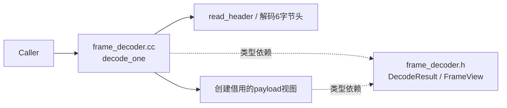
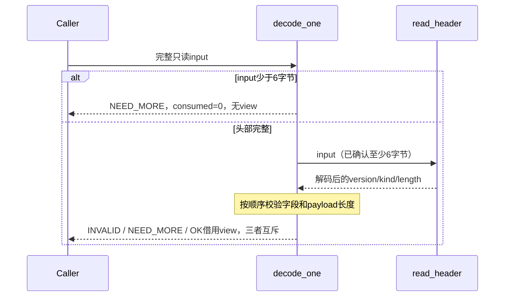
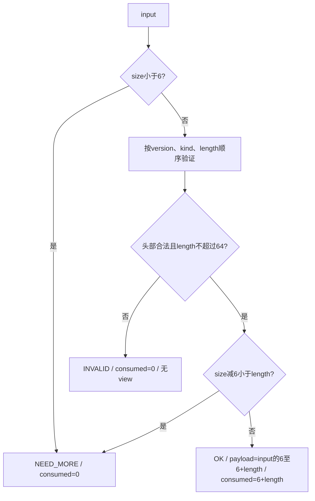

<!-- STD_DOCUMENT_COVER_BEGIN -->
# {{document_title}}

| 文档字段 | 值 |
|---|---|
| Document ID | `{{document_id}}` |
| Document Version | `{{document_version}}` |
| Status | `{{document_status}}` |
| Project | `{{project}}` |
| Document Owner | {{document_owner}} |
| Last Modified Date | `{{last_modified_at}}` |
| Template ID | `{{template_id}}` |
| Template Version | `{{template_version}}` |
<!-- STD_DOCUMENT_COVER_END -->

## 1. 实现目标与输入基线

<a id="isd-scope"></a>

<details>
<summary>编写要求与完成条件</summary>

先用一段文字说明功能、场景、代表输入输出及本次范围。默认一个模块一份ISD，覆盖多个源文件；模块设计已达到本模板深度时直接兼作，不重复建文。ISD不新增模块层级或编号。遵循 `docs/isd-standard.md` 和 `docs/ai-guides/implementation-design.md`。

独立稿为design.implementation、level=module、domain=software；parent_document_id沿模块直属父对象设计，同模块设计用下表单独引用。项目采用的版本固定，不自动追随上游。帮助块和虚构教学例子不能替代项目正文。

逐项按ISD规范的承接矩阵确定分工：模块设计不能把关键数据、签名、算法、过程、失败语义和验证规格推迟到ISD。本层细化私有表示、函数步骤和装配；已有完整定义用固定来源引用并保留必要语义，不重复维护。每行写清本层必须展开什么、哪些决定不可改变、允许的实现自由度及原V/Case入口。

完成条件：读者明确做什么、输入来自哪里、原决定是什么、本次实现范围和非目标。
</details>

| 模块ID/名称 | 直属父对象/父设计 | 模块设计Document ID/版本/路径/摘要 | 需求与Constraint ID | 实现范围/非目标 |
|---|---|---|---|---|
| <!-- TODO --> | | | | |

<a id="isd-handoff"></a>

| 上游信息项/规则ID | 固定来源/版本/锚点/摘要 | ISD细化内容/章节 | 唯一权威位置 | 实现自由度 | 原V/Case及本地验证位置 |
|---|---|---|---|---|---|

## 2. 当前实现与目标差异

<details><summary>编写要求与完成条件</summary>

读取实际代码与构建基线，列保留、新增、修改、删除的具体位置和原因。框架集成逐项写hook所在函数、触发条件、原路径如何保留及回退是否已获上级允许；禁止只写“接入框架”。未存在的路径标Planned。完成条件是每项差异能回到模块决定，已有用户改动得到保留。
</details>

| 基线commit/版本 | 文件/symbol | Current行为 | Target改动与理由 | 原规则/成员ID | 实现状态 |
|---|---|---|---|---|---|

## 3. 文件、内部组件与调用关系

<a id="isd-structure"></a>

<details><summary>编写要求与完成条件</summary>

先画内部文件/组件调用与类型依赖，再解释分工。一个类不必独占文件，一个文件不必独立成ISD。列头文件可见性、构建目标、生成源与输出；拆分稿由唯一入口汇总，不重复维护共享类型。完成条件是能定位入口、helper、共享类型和实际装配位置。
</details>

<!-- STD_TEMPLATE_EXAMPLE_BEGIN -->
虚构EX-ISD/v1，FrameDecoder（M201），Target / NOT_IMPLEMENTED / NOT_RUN。同步解析一个帧，不创建线程。



实线为调用/处理，虚线为类型依赖；read_header是私有helper，仍在同一模块。真实项目替换文件及关系，不复制此解析协议。
<!-- STD_TEMPLATE_EXAMPLE_END -->

| 文件/内部组件 | 职责及调用者 | 类型/函数 | public/private/generated | 构建目标/依赖 |
|---|---|---|---|---|

## 4. 内部数据与所有权

<a id="isd-data"></a>

<details><summary>编写要求与完成条件</summary>

给私有结构逐字段类型、宽度/单位、初值、范围、不变量及owner。区分逻辑宽度、ABI布局与运行时sizeof。公共类型引用interfaces源ID/selector/version/hash，不复制形成第二份权威。画输入、工作区、输出的创建/借用/释放和失败路径；持久状态另给事件、Guard、动作和退出。完成条件是成功及失败都无无主对象。
</details>

<!-- STD_TEMPLATE_EXAMPLE_BEGIN -->
EX-ISD/v1的输入是只读字节span；FrameView为 `{kind:u8, payload:borrowed byte span}`。DecodeResult为互斥分支：OK(view,consumed:size_t)、NEED_MORE(consumed=0)、INVALID(reason,consumed=0)。无堆分配。


<!-- STD_TEMPLATE_EXAMPLE_END -->

| 私有类型/字段 | 类型/字节或单位 | 初值/约束 | 创建/修改者 | 借用期限/释放者 | 公共类型来源 |
|---|---|---|---|---|---|

## 5. 函数与接口实现规格

<a id="isd-functions"></a>

<details><summary>编写要求与完成条件</summary>

逐关键函数给签名、完整参数、返回、错误优先级、前置条件、上下文、副作用、幂等和ownership。简单无状态函数可分组。有副作用或共享状态的函数须单独说明。接口输入与输出逐项引用权威成员；内部helper明确拿到原始请求还是已校验值。不能以“见代码”省略当前尚未确定的设计。
</details>

<!-- STD_TEMPLATE_EXAMPLE_BEGIN -->
教学签名 `DecodeResult decode_one(std::span<const std::uint8_t> input) noexcept`，位于 `ex_isd` 命名空间；非空span要求有效存储，空span允许。数据竞争和悬空地址是调用者违约，不伪装成帧格式错误。借用输出不跨输入寿命。


<!-- STD_TEMPLATE_EXAMPLE_END -->

| 函数/文件 | 原成员ID或私有 | 签名与caller | 校验/返回/错误 | 副作用/上下文 | 输入输出寿命 |
|---|---|---|---|---|---|

## 6. 关键流程与算法

<a id="isd-algorithms"></a>

<details><summary>编写要求与完成条件</summary>

每个重要过程有流程图或时序图，并说明入口、数据形态、分支事实来源、结果可见点和异常出口。关键算法给伪代码、具体输入和中间值；不要逐行重述全部代码。异步过程分别设计正常、取消、迟到、超时和未知访问，不从教学同步例推导无需清理。

每个重要算法必须有算法图、连续正文及具体输入推演，必要时配伪代码；主流程图只有展开该算法的实际条件、推进和退出才可兼作。核对整数提升、溢出、边界、未对齐访问和语言/库默认行为，不用抽象的“读取整数”掩盖实现风险。简单逻辑不强造算法。
</details>

<!-- STD_TEMPLATE_EXAMPLE_BEGIN -->
EX-ISD/v1规则：头为version:u8、kind:u8、length:u32大端，共6字节；仅version=1、kind=1，payload最多64字节，零长允许。错误优先级为version、kind、length；完整头非法立即INVALID，不等待payload。只解析首帧，余字节交caller。



```text
if input.size < 6: return NEED_MORE(0)
read version, kind, length_be
if version != 1: return INVALID(VERSION, 0)
if kind != 1: return INVALID(KIND, 0)
if length_be > 64: return INVALID(LENGTH, 0)
if input.size - 6 < length_be: return NEED_MORE(0)
return OK(borrow(input[6 : 6+length_be]), 6+length_be)
```

输入 `01 01 00 00 00 02 41 42` 得length=2、借用payload=`41 42`、consumed=8。只收到前7字节得NEED_MORE；长度字段为65时仅头部就INVALID。先限制长度再加6，不把未知u32直接加到小类型。
<!-- STD_TEMPLATE_EXAMPLE_END -->

| 过程/规则ID | 触发与执行者 | 入口函数及数据 | 判断事实来源 | 成功可见点 | 失败与清理 |
|---|---|---|---|---|---|

## 7. 并发、失败与生命周期

<a id="isd-lifecycle"></a>

<details><summary>编写要求与完成条件</summary>

列线程/回调、锁粒度及顺序、锁内禁止调用、原子/可见性、依赖和外部访问寿命。区分状态查询、幂等重放、执行者接管、新业务重试；取消请求/超时不等于实际停止。启动部分失败、半组提交、迟到结果、断连及关闭各给谁清理、凭什么事实及有限等待出口。同步无状态模块说明为何无相关机制，不空造状态机。

拥有持久状态时，继承上游事务、恢复和升级政策，落实事务边界及开始/提交/回滚函数、原子覆盖的数据及事务外副作用；区分持久提交点、对外响应点和响应丢失后的结果核对。指出崩溃后由谁调用恢复入口、读取哪个版本/记录、怎样判断已提交或未完成，以及重复恢复的安全条件。已有数据升级写源/目标数据版本、转换函数及步骤、校验与切换点、中断后继续或回退的条件和失败出口；不擅自新增迁移机制或允许旧程序读取新格式。重要恢复/转换过程按§6配图和推演，无持久状态时说明不适用及实际宿主边界。

教学FrameDecoder只使用栈变量，并发调用不共享可变状态；同一输入可并发只读，caller不得同时改写。无取消接口、外部I/O或持久状态。

承接模块安全/权限和可观测性要求，不只设计功能错误：按适用性写可信身份/授权检查函数、被检查字段、副作用前的拒绝点、权限依赖失败出口；敏感数据禁止记录范围、脱敏位置；原日志/指标/trace的触发、关联ID、单位/窗口/重置及上报函数。已有诊断命令写实际入口和权限，不另造机制。不拥有这些能力时指出返回给宿主的结构化信息、宿主接收点及其责任；“宿主负责”不能代替交接设计。
</details>

| 交错/故障 | 已产生副作用 | 检测事实 | 状态/错误 | 保留/释放责任 | 后续允许操作 |
|---|---|---|---|---|---|

<a id="isd-persistence"></a>

| 原规则/事务 | 原子范围/事务外副作用 | 提交点/响应点 | 恢复入口/判定记录 | 源/目标数据版本及转换函数 | 校验/切换/失败出口 | 验证项 |
|---|---|---|---|---|---|---|

<a id="isd-security"></a>

| 原规则 | 可信输入/敏感字段 | 检查函数/时点 | 拒绝/宿主交付出口 | 脱敏/禁止输出 | 日志/指标口径及触发 | 验证项 |
|---|---|---|---|---|---|---|

## 8. 资源、构建与宿主接入

<a id="isd-resources"></a>

<details><summary>编写要求与完成条件</summary>

写明工具链/语言、库版本、产物、编译链接条件、导出/私有范围和宿主如何初始化、注入及销毁。既有框架写实际调用点，内部模块引用原构建目标，不强建新库。峰值含输入、工作区、结果、并发副本及未知占用；上限来自原预算，超限行为确定。未测量不标Measured。

引用模块设计的环境和预算基线，逐项落到本实现：软件/库版本、硬件与虚拟化、依赖和数据规模；初始化、复位、启动、排队/运行、停止、清理的起止事件、单调计时点、分段预算及总期限。重试不重置总期限，等待或清理超限给具体出口，未确认安全不得释放。明确冷/热启动、并发启动峰值、共享额度扣减/归还及仍由宿主承担的范围，不重新制定上级政策。涉及 LLM 时关联所需能力、上下文与最大输出、请求量、并发和排队/调用预算，并定位请求构造、限额申请与超限处理函数；不适用时说明实际边界。

教学例目标为C++20的既有解析库，测试目标包含frame_decoder.cc；复杂度O(1)、payload零拷贝，无堆工作区，输入和输出视图存储归caller。示例不规定项目语言或预算。
</details>

| 目标文件/产物 | 工具链/依赖 | 初始化/退出次序 | 峰值构成/上限 | 构建或运行命令及前置条件 |
|---|---|---|---|---|

## 9. 验证规格与实现任务

<a id="isd-verification"></a>

<details><summary>编写要求与完成条件</summary>

将规则/接口→设计V→Case→Vector→独立Oracle→环境/Run对应。每个vector保留独立expected/actual和判定；case是测试主题，不把所有分支混成“通过”。给实际或Planned测试入口、输入构造、故障注入、清理及预期结果。局部PASS不代替宿主/子系统组合。任务按依赖排列，说明完成条件，不要求未实现模块先有运行PASS。

允许在依赖边界使用受控替身、故障点、可控时钟及调度来制造提交失败、进程崩溃、响应丢失等条件；从正常入口建立前置事实，再记录注入点/时刻、故障语义、观察结果和复位方法。禁止直接修改业务终态以伪造正常流程通过。构造旧版本数据可作为明确标注的恢复/升级测试fixture，但不能冒充本轮真实执行留下的记录。模型与真实进程/存储测试分别标明覆盖，不把模拟崩溃当真实持久性验证。

适用持久化时，在提交前、提交后响应前及恢复过程中演练中断，重启后检查记录与外部副作用的一致性、重复恢复和合法后续动作；升级测试覆盖旧数据、转换中断、非法版本及切换失败，按原政策验证继续/回退或阻断。每项关联§7的具体函数和提交/切换事实，不只检查重启后Ready。

验证 §8 的环境和分段/总期限：覆盖冷/热条件、并发资源峰值、超限与额度归还、停止未确认及清理失败。没有真实时钟或宿主运行证据时保持 NOT_RUN；单元模型 PASS 不替代时间、物理隔离或宿主组合验证。

逐项承接安全/维护V：从真实入口构造拒绝、权限依赖失败、敏感输入、异常上报及重复/并发计数条件，检查错误字段、不泄露和原统计口径；不适用项说明边界。宿主接收/日志/权限验证与模块局部测试分别记录，不能把返回错误码的单测当宿主诊断闭环已通过。
</details>

<!-- STD_TEMPLATE_EXAMPLE_BEGIN -->
EX-ISD/v1，以下全为预期向量，NOT_RUN；同一公开decode_one入口，无内部状态篡改。

| Case/Vector | 输入 | 独立预期 |
|---|---|---|
| C1/v1 正常 | `01 01 00 00 00 02 41 42` | OK，payload=4142，consumed=8 |
| C1/v2 零长 | `01 01 00 00 00 00` | OK，空payload，consumed=6 |
| C2/v1 短头 | 空输入 | NEED_MORE，consumed=0，无view |
| C2/v2 短体 | `01 01 00 00 00 02 41` | NEED_MORE，consumed=0，无view |
| C3/v1 长度超限 | `01 01 00 00 00 41` | INVALID LENGTH，consumed=0 |
| C3/v2 错误优先级 | `02 02 ff ff ff ff` | INVALID VERSION，consumed=0 |
| C1/v3 尾部数据 | 正常v1后追加FF | OK，consumed仍为8，FF不消费 |

另需C3/v3合法version但kind=2、C1/v4长度64且载荷完整，以及并发只读和输入不被修改的用例。测试环境为固定C++20工具链和宿主单测目标；真实项目填写实际目标与命令，不能执行文档伪代码冒充产品测试。

本案例的可编译教学实现位于已采用 STD 源的 `docs/examples/isd-frame-decoder/`：`frame_decoder.h` 定义完整类型与公开签名，`frame_decoder.cc` 实现私有 read_header 和入口，`frame_decoder_test.cc` 给独立固定向量。README 记录字段→函数→向量映射、构建命令、借用寿命及未覆盖条件。它是与文档核对的教学机器源，不是任何项目的新接口 authority；项目采用前必须映射自己的接口目录。实际运行教学测试只证明本例局部行为，不升级为产品测试 PASS。
<!-- STD_TEMPLATE_EXAMPLE_END -->

| Rule/成员 | V / Case / Vector | 输入/故障/环境 | Oracle/Expected | Actual/Evidence | Verdict | 测试入口/清理 | Run ID/Status |
|---|---|---|---|---|---|---|---|

<a id="isd-tasks"></a>

| 顺序 | 实现任务/文件/symbol | 前置项 | 不可改变的规则 | 完成检查 |
|---|---|---|---|---|

## 10. 映射、复核与未决项

<details><summary>编写要求与完成条件</summary>

复用项目模块/接口登记表：模块ID→模块设计→ISD或兼作入口→文件/symbol→验证项。公共成员固定version/revision/hash和selector；新类型引用原authority。分卷互链，已有详细模块设计兼作时在入口记录本模板信息项到章节的映射，不复制正文。

本表的计划位置明确标Planned，不写入机器目录的location/symbol：未实现时二者必须null，原成员、role/module/backend和V/Case不变、runs为空。模块设计和ISD引用同一承接行，不增加第二条实现。核实实际代码后更新原行，代码出现不等于验证通过。转换例见已采用STD源的 `docs/examples/isd-planned-mapping.md`。

按编码者、接口消费者、并发资源及测试视角复核，记录实际检查和缺口。规格未知明确阻断范围和解决动作，NOT_IMPLEMENTED/NOT_RUN不代替未决设计。同步图、状态、算法、接口和测试，作者编辑说明不进入正式设计。审批、实现和运行验证状态分开；本模板不授权提交或发布。

未决项必须能找到Owner、最晚关闭阶段/截止Gate、阻断范围、分析或决策引用、所需输入和下一步选择判据。可直接引用现有问题台账的稳定ID及对应记录，不另建一套；缺负责人或关闭时点不能只写“后续处理”，关键规格未决不判设计完成。
</details>

| 模块/原成员ID | 唯一来源/版本/selector/hash | 提供或消费/后端 | 实际位置或Planned计划位置 | 验证项 | 状态 |
|---|---|---|---|---|---|

| 问题ID/既有台账引用 | 具体缺口/反例 | Owner | 最晚关闭阶段/截止Gate | 阻断范围 | 分析/决策引用 | 所需输入/下一步选择判据 | 解决动作/完成条件 | 状态 |
|---|---|---|---|---|---|---|---|---|

<!-- STD_DOCUMENT_CONTROL_BEGIN -->
| 文档字段 | 值 |
|---|---|
| Authority | `{{authority}}` |
| Authors | {{authors}} |
| Created Date | `{{created_at}}` |
| Template Conformance | `{{template_conformance}}` |
| Tailoring Reference | {{tailoring_ref}} |
| Migration Map Reference | {{migration_map_ref}} |
| Repository | `{{source_repository}}` |
| Canonical Path | `{{source_path}}` |
| Supersedes | {{supersedes}} |
<!-- STD_DOCUMENT_CONTROL_END -->
