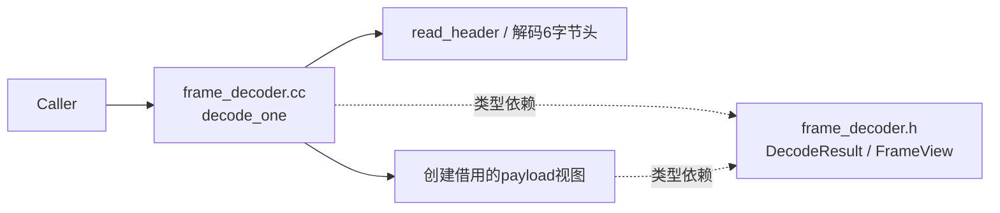
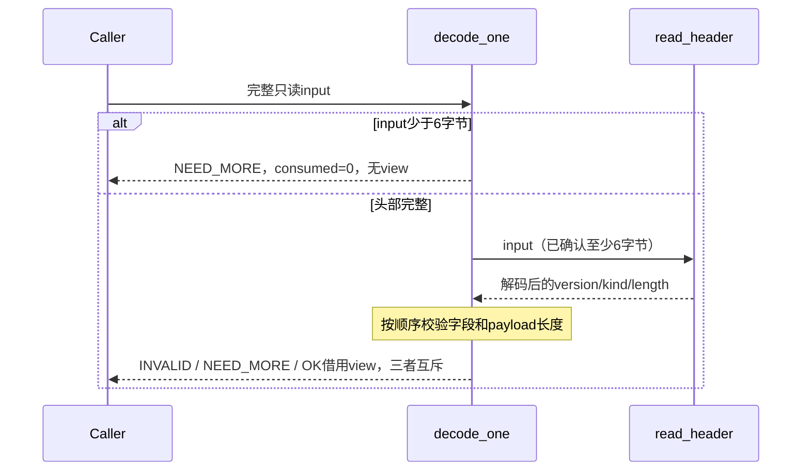
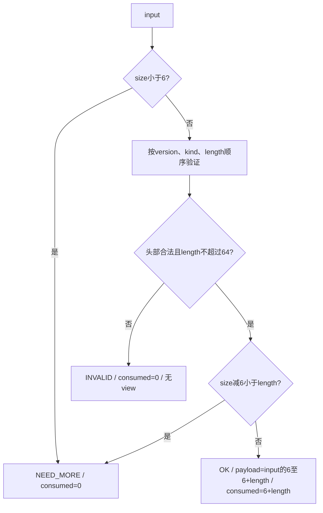
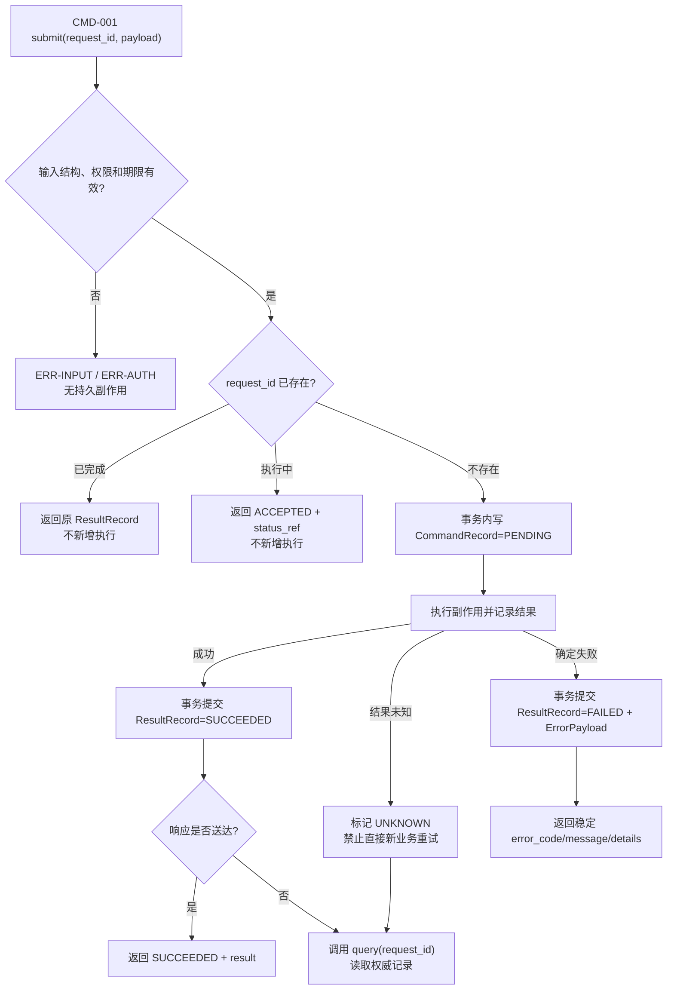

<!-- STD_DOCUMENT_COVER_BEGIN -->
# {{document_title}}

> STD 使用入口：[STD 主说明与执行流程](../../README.md)。这是工程文档标准模板；作者先读入口，再按项目已采用版本读取适用规范和专项指南。

| 文档字段 | 值 |
|---|---|
| Document ID | `{{document_id}}` |
| Document Version | `{{document_version}}` |
| Status | `{{document_status}}` |
| Project | `{{project}}` |
| Document Owner | {{document_owner}} |
| Last Modified Date | `{{last_modified_at}}` |
| Template ID | `{{template_id}}` |
| Template Version | `{{template_version}}` |
<!-- STD_DOCUMENT_COVER_END -->

## 1. 实现目标与输入基线

<a id="isd-scope"></a>

<details>
<summary>编写要求与完成条件</summary>

先用一段文字说明功能、场景、代表输入输出及本次范围。默认一个模块一份ISD，覆盖多个源文件；模块设计已达到本模板深度时直接兼作，不重复建文。ISD不新增模块层级或编号。遵循 `docs/isd-standard.md` 和 `docs/ai-guides/implementation-design.md`。独立稿默认位于 `docs/50_implementation_design/<name>.isd.md`，项目已有批准路径时沿用该路径。

独立稿为design.implementation、level=module、domain=software；parent_document_id沿模块直属父对象设计，同模块设计用下表单独引用。项目采用的版本固定，不自动追随上游。帮助块和虚构教学例子不能替代项目正文。

逐项按ISD规范的承接矩阵确定分工：模块设计不能把关键数据、签名、算法、过程、失败语义和验证规格推迟到ISD。本层细化私有表示、函数步骤和装配；已有完整定义用固定来源引用并保留必要语义，不重复维护。每行写清本层必须展开什么、哪些决定不可改变、允许的实现自由度及原V/Case入口。

完成条件：读者明确做什么、输入来自哪里、原决定是什么、本次实现范围和非目标。

全文统一采用“记录型 → 固定字段段落；矩阵型 → 表格”。一个模块、函数、数据对象、异常、验证项或未决问题是独立多字段记录，必须逐项使用本模板给出的字段段落；只有库状态分支、状态转换或短值映射等需要横向比较的内容才用表格。同类记录不得混用两种形式。
</details>

### 1.1 实现对象

<!-- 编写建议：先固定这份 ISD 究竟实现哪一个模块，再给出直属父设计与模块设计的不可变版本、路径和摘要。范围要写到可验收的行为边界，例如“实现任务受理与状态查询”，非目标要排除容易被误认为本模块负责的能力；不要只填写仓库或团队名称。 -->

- **模块 ID / 名称**

  <!-- TODO -->
- **直属父对象 / 父设计**

  <!-- TODO -->
- **模块设计 Document ID / 版本 / 路径 / 摘要**

  <!-- TODO -->
- **需求与 Constraint ID**

  <!-- TODO -->
- **实现范围 / 非目标**

  <!-- TODO -->
- **ISD 默认落位或项目批准路径**

  <!-- TODO -->

<a id="isd-handoff"></a>

### 1.2.N `<Handoff ID>` · <承接项名称>

<!-- 编写建议：每个上游决定单独成项，引用具体 Rule/Constraint/Interface/Data ID 及版本锚点，说明本 ISD 必须落实到哪个章节和哪个验证入口。明确哪些语义不准改，哪些私有类型、函数分解和实现策略可由编码者决定；若来源自身未决定关键行为，登记设计缺口，不在 ISD 中替上游拍板。例：上游规定“重复 request_id 不新增任务”，本层可选择唯一索引及事务函数，但不能把重放改成新建。 -->

- **上游信息项 / 规则 ID**

  <!-- TODO -->
- **固定来源 / 版本 / 锚点 / 摘要**

  <!-- TODO -->
- **ISD 细化内容 / 章节**

  <!-- TODO -->
- **唯一权威位置**

  <!-- TODO -->
- **实现自由度**

  <!-- TODO -->
- **原 V/Case 及本地验证位置**

  <!-- TODO -->

## 2. 既有实现差异（条件章节）

<details><summary>编写要求与完成条件</summary>

本章只在 brownfield 场景适用：存在需要修改的既有代码，并已固定 baseline commit/version。逐项列保留、新增、修改、删除的具体位置和原因；框架集成写 hook 所在函数、触发条件、原路径如何保留及回退是否已获上级允许，禁止只写“接入框架”。

greenfield 或设计先行且不存在既有实现时，不制造 Current，也不从其他项目抄实现；在正文明确 `not_applicable`、原因和已接受的 tailoring/范围决定引用，然后直接描述 Target。未存在的目标路径标 Planned。完成条件是适用性可判定；适用时每项差异能回到模块决定，已有用户改动得到保留。
</details>

### 2.1 适用性

<!-- 编写建议：先判断是否存在要修改的既有实现。brownfield 必须固定 commit/版本和实际代码范围；greenfield 写明 `not_applicable` 及已接受的范围决定，不虚构 Current。此判断控制后续差异项是否必填，不能用“暂无资料”代替适用性结论。 -->

- **适用性**

  <!-- brownfield / not_applicable -->
- **依据**

  <!-- baseline commit/version；或 greenfield/设计先行说明 -->
- **Tailoring / 范围决定引用**

  <!-- TODO -->

### 2.N `<Change ID>` · <差异名称>

<!-- 编写建议：按一处可独立实施和回退的差异成项，给出基线文件与 symbol、可观察的 Current 行为、目标行为、上游规则及保留/迁移/删除策略。特别写清既有调用路径和用户改动如何保存；“重构相关代码”不是可执行的差异描述。 -->

- **基线 commit / 版本**

  <!-- TODO -->
- **文件 / symbol**

  <!-- TODO / Planned -->
- **Current 行为**

  <!-- TODO -->
- **Target 改动与理由**

  <!-- TODO -->
- **原规则 / 成员 ID**

  <!-- TODO -->
- **实现状态**

  <!-- PLANNED / IN_PROGRESS / IMPLEMENTED；与 §5、§8–§10 一致 -->

## 3. 文件、内部组件与调用关系

<a id="isd-structure"></a>

<details><summary>编写要求与完成条件</summary>

先画内部文件/组件调用与类型依赖，再解释分工。一个类不必独占文件，一个文件不必独立成ISD。列头文件可见性、构建目标、生成源与输出；拆分稿由唯一入口汇总，不重复维护共享类型。完成条件是能定位入口、helper、共享类型和实际装配位置。
</details>

<!-- STD_TEMPLATE_EXAMPLE_BEGIN -->
虚构EX-ISD/v1，FrameDecoder（M201），Target / NOT_IMPLEMENTED / NOT_RUN。同步解析一个帧，不创建线程。



实线为调用/处理，虚线为类型依赖；read_header是私有helper，仍在同一模块。真实项目替换文件及关系，不复制此解析协议。
<!-- STD_TEMPLATE_EXAMPLE_END -->

### 3.N `<File / Internal ID>` · <文件或内部组件>

<!-- 编写建议：记录真实或 Planned 的文件、内部组件和构建产物，说明它向谁提供什么函数/类型、依赖方向和可见性。实现者应能据此创建文件、声明头文件/导出、安排初始化与销毁；不要把一个类机械等同于一个文件，也不要把内部 helper 登记成新的正式模块。 -->

- **职责及调用者**

  <!-- TODO -->
- **类型 / 函数**

  <!-- TODO -->
- **可见性**

  <!-- public / private / generated -->
- **调用与类型依赖**

  <!-- TODO -->
- **构建目标 / 生成源 / 输出**

  <!-- TODO -->
- **实现状态**

  <!-- PLANNED / IN_PROGRESS / IMPLEMENTED -->

## 4. 数据结构设计

<details><summary>数据分类与示例（模板帮助；不复制到项目正文）</summary>

<!-- 数据结构分类编写建议与教学例子；生成文档时按实际对象保留适用类别。
只保留适用类别，并在章首记录不适用类别的原因与 tailoring 依据。类别按性质划分，不按输入/输出划分；每个具体结构以真实名称作带编号的小节标题，字段、约束、唯一来源、所有权/寿命、合法与拒绝实例及验证随该结构描述，不另设数据结构清单。下列例子均为虚构，不能作为项目契约：

| 类别 | 具体示例（均为虚构） | 适用条件与关键约束 |
|---|---|---|
| 公共基础类型与枚举 | `TaskState = QUEUED \| RUNNING \| DONE`；示例值 `RUNNING` | 多处共用时采用；`RUNNING` 表示已开始执行，未知值拒绝 |
| 业务与操作数据结构 | `InspectionRequest {request_id:"r7", image_ref:"asset://image/7"}` | 存在业务载荷时采用；两字段必填，`request_id` 绑定一次业务操作 |
| 配置与规则数据结构 | `DetectionPolicy {version:3, threshold:0.75}` | 存在受控规则时采用；阈值在 0–1，新版本仅对后续任务生效 |
| 通信报文结构 | `FrameReadyEvent {frame_id:"f7", sequence:42}` | 存在消息交接时采用；`sequence` 在同一来源内递增，重复号按契约去重 |
| 设备与 FPGA 表项结构 | `RouteTableEntry {route_id:u12=7, target:u4=2}` | 实际拥有设备/RTL 表项时采用；16 位布局和写入确认均须由机器源定义 |
| 运行状态数据结构 | `TaskRuntimeState {task_id:"t7", phase:RUNNING}` | 存在跨步骤状态时采用；唯一写者确认 `QUEUED → RUNNING` 后发布 |
| 数据库表结构 | `inspection_jobs(id TEXT PRIMARY KEY, state TEXT NOT NULL, version INT NOT NULL)` | 实际拥有数据库表时采用；受理回复前提交事务，升级说明版本迁移 |
| 错误码与错误结构 | `InspectionError {code:QUEUE_FULL, request_id:"r7"}` | 存在错误载荷时采用；公共 `QUEUE_FULL` 逐码定义，拒绝本次新任务 |

结构小节以 `InspectionRequest` 等真实名称为标题：先展示类型声明，再逐字段写类型、必填/范围、跨字段规则、来源、持有者和验证。上表只是简短实例，不是字段全集或机器权威；没有设备或数据库的项目，不要为了填类别发明寄存器或表。
-->

</details>

<a id="isd-data"></a>

<details><summary>编写要求与完成条件</summary>

<!--

先列承接的公共 Data/Type/Error ID 与固定来源，以及本 ISD 新增的私有类型；后者逐字段定义语言表示、初值/范围/不变量、所有权、寿命与错误出口。公共结构只落实到代码字段与转换点，不修改上级语义。

给私有结构逐字段类型、单位、初值、范围、不变量及 owner。只有原生 ABI、持久二进制、寄存器或跨语言布局适用时才展开字节、位宽、`sizeof`、端序和对齐；Python 对象、JSON、HTTP 等纯软件逻辑结构写 `N/A + 原因 + authority`，不为满足模板虚构 ABI。公共类型引用 interfaces 源 ID/selector/version/hash，不复制形成第二份权威。画输入、工作区、输出的创建/借用/释放和失败路径；持久状态另给事件、Guard、动作和退出。完成条件是成功及失败都无无主对象。
-->
</details>

### 4.1 公共基础类型与枚举（适用时）

<details>
<summary>本节编写建议、规范与示例</summary>

**本节目的**：统一本层拥有的共享类型与枚举语义，使该类数据可由下级直接承接。

**必须写清楚**：逐值含义、合法范围、未知值处理及唯一来源；逐结构记录 Data/Type ID、固定来源、字段、所有权与寿命、合法和拒绝实例及验证。

**编写规范**：复用上级类型时仅给固定引用和本层投影，不重定义值。本类别不适用时在章首说明原因和 tailoring 依据，不保留空小节。如果字段已有机器定义，应固定版本并逐项核对；教学例子不得成为项目默认值。

**抽象示例**：任务状态 RUNNING 只表示执行已开始，不代表成功完成；示例只说明写法，不是项目的机器契约。

**完成条件**：各使用处对同一值作一致解释，且没有与其他章节重复维护同一字段定义。

</details>

<!-- 编写建议：本类仅收录本 ISD 拥有的基础类型与枚举；上级或机器源已定义的类型，写明固定 Data/Type ID、版本和语言级投影，不重定义值。每个枚举值应有含义、未知值行为和使用范围，代码位置与验证留在同一结构记录。虚构例子：`TaskState = QUEUED | RUNNING | DONE`，未知状态不能默认为 DONE。 -->

#### 4.1.N `<真实类型名>`

- **代码式声明、Data/Type ID 与唯一来源**
- **逐值/逐字段定义、范围和未知值行为**
- **代码类型/symbol、转换点与失败映射**
- **创建/修改者、所有权、寿命与敏感性**
- **合法及拒绝实例、V/Case 与证据状态**

### 4.2 业务与操作数据结构（适用时）

<details>
<summary>本节编写建议、规范与示例</summary>

**本节目的**：定义业务操作实际交换和保存的对象，使该类数据可由下级直接承接。

**必须写清楚**：逐字段类型、必填性、范围、键及跨字段条件；逐结构记录 Data/Type ID、固定来源、字段、所有权与寿命、合法和拒绝实例及验证。

**编写规范**：同一结构无论作为输入还是输出只定义一次。本类别不适用时在章首说明原因和 tailoring 依据，不保留空小节。如果字段已有机器定义，应固定版本并逐项核对；教学例子不得成为项目默认值。

**抽象示例**：InspectionRequest 用非空 request_id 关联一次检测操作；示例只说明写法，不是项目的机器契约。

**完成条件**：合法与拒绝实例均能依字段和规则判定，且没有与其他章节重复维护同一字段定义。

</details>

<!-- 编写建议：按真实业务类型逐项写完整字段，不按输入和输出重复定义同一结构。每个字段说明类型、必填/可空、范围、跨字段约束及接口中的作用；再给代码表示、所有权和合法/拒绝实例。虚构例子：`InspectionRequest` 的 `request_id` 非空且与一次受理操作绑定。 -->

<!-- STD_TEMPLATE_EXAMPLE_BEGIN -->
EX-ISD/v1 的输入是只读字节 span；FrameView 为 `{kind:u8, payload:borrowed byte span}`。DecodeResult 为互斥分支：OK(view,consumed:size_t)、NEED_MORE(consumed=0)、INVALID(reason,consumed=0)。无堆分配。


<!-- STD_TEMPLATE_EXAMPLE_END -->

#### 4.2.N `<真实结构名>`

- **代码式声明、Data/Type ID 与固定来源**
- **逐字段定义、条件有效性和跨字段不变量**
- **代码文件/symbol、编码或投影函数**
- **创建、借用、修改、释放与失败出口**
- **合法及拒绝实例、V/Case 与证据状态**

### 4.3 配置与规则数据结构（适用时）

<details>
<summary>本节编写建议、规范与示例</summary>

**本节目的**：固定决定行为的配置与规则载荷，使该类数据可由下级直接承接。

**必须写清楚**：字段、默认值来源、版本、校验和生效点；逐结构记录 Data/Type ID、固定来源、字段、所有权与寿命、合法和拒绝实例及验证。

**编写规范**：未决定的配置不得由下级自行添加 fallback。本类别不适用时在章首说明原因和 tailoring 依据，不保留空小节。如果字段已有机器定义，应固定版本并逐项核对；教学例子不得成为项目默认值。

**抽象示例**：DetectionPolicy 的新版阈值只作用于新任务；示例只说明写法，不是项目的机器契约。

**完成条件**：能判定任一操作使用哪一版规则，且没有与其他章节重复维护同一字段定义。

</details>

<!-- 编写建议：定义本模块实际读取或持有的配置类型，逐字段写范围、缺省值的批准来源、版本和校验顺序。说明加载、生效和旧配置失效的时点；不要在 ISD 自创系统未批准的 fallback。虚构例子：`DetectionPolicy{version:3, threshold:0.75}` 仅对生效点后新受理的任务适用。 -->

#### 4.3.N `<真实配置类型名>`

- **代码式声明、Data/Type ID 与配置 authority**
- **逐字段定义、默认值、跨字段校验与拒绝**
- **读取/校验/应用 symbol 与生效点**
- **快照、所有权、寿命与敏感性**
- **合法及拒绝实例、V/Case 与证据状态**

### 4.4 通信报文结构（适用时）

<details>
<summary>本节编写建议、规范与示例</summary>

**本节目的**：定义跨执行边界交换的消息载荷，使该类数据可由下级直接承接。

**必须写清楚**：字段、编码、关联身份、顺序、重复与兼容边界；逐结构记录 Data/Type ID、固定来源、字段、所有权与寿命、合法和拒绝实例及验证。

**编写规范**：投递与重试动作在接口章节定义，结构只拥有载荷语义。本类别不适用时在章首说明原因和 tailoring 依据，不保留空小节。如果字段已有机器定义，应固定版本并逐项核对；教学例子不得成为项目默认值。

**抽象示例**：FrameReadyEvent 使用 frame_id 与来源内递增的 sequence；示例只说明写法，不是项目的机器契约。

**完成条件**：两端可按同一报文解释和验证，且没有与其他章节重复维护同一字段定义。

</details>

<!-- 编写建议：仅在本模块拥有消息、事件、流或文件交换的报文时展开；逐字段写编码、长度、关联身份、顺序与兼容版本，并固定机器源。投递、重放和背压的行为放在相应接口记录，本节定义报文本身。虚构例子：`FrameReadyEvent{frame_id:"f7", sequence:42}`，同一来源的重复序号需按契约判定。 -->

#### 4.4.N `<真实报文名>`

- **完整报文声明、Data/Type ID 与机器来源**
- **逐字段类型、编码、长度及版本约束**
- **序列化/反序列化 symbol 与错误映射**
- **关联身份、缓冲区所有权与寿命**
- **合法及拒绝报文、V/Case 与证据状态**

### 4.5 设备与 FPGA 表项结构（适用时）

<details>
<summary>本节编写建议、规范与示例</summary>

**本节目的**：定义实际设备或 RTL 表项的受控布局，使该类数据可由下级直接承接。

**必须写清楚**：位宽、复位值、读写权限、写入确认与生效条件；逐结构记录 Data/Type ID、固定来源、字段、所有权与寿命、合法和拒绝实例及验证。

**编写规范**：纯软件项目无此对象时按 tailoring 删除，不虚构寄存器。本类别不适用时在章首说明原因和 tailoring 依据，不保留空小节。如果字段已有机器定义，应固定版本并逐项核对；教学例子不得成为项目默认值。

**抽象示例**：RouteTableEntry 的 target 位宽以固定 register map 为准；示例只说明写法，不是项目的机器契约。

**完成条件**：表项写入与读取有唯一可核对的机器来源，且没有与其他章节重复维护同一字段定义。

</details>

<!-- 编写建议：只有本模块实际投影设备/RTL 表项时才保留此类；按唯一寄存器/表项权威说明位宽、端序、复位值、写入确认和生效条件。纯软件模块不要为了填类别虚构硬件布局。虚构例子：`RouteTableEntry` 的 16 位布局来自固定 register map，而非此处重新决定。 -->

#### 4.5.N `<真实表项名>`

- **位级/代码式声明、Data/Type ID 与固定 register/RTL 来源**
- **逐字段位宽、范围、复位值及保留位规则**
- **驱动转换 symbol、读写确认与失败映射**
- **缓存、可见时点、所有权和寿命**
- **合法及拒绝向量、V/Case 与证据状态**

### 4.6 运行状态数据结构（适用时）

<details>
<summary>本节编写建议、规范与示例</summary>

**本节目的**：定义跨步骤保留的状态及其权威，使该类数据可由下级直接承接。

**必须写清楚**：字段、唯一写者、转移前提、可见点和恢复事实；逐结构记录 Data/Type ID、固定来源、字段、所有权与寿命、合法和拒绝实例及验证。

**编写规范**：状态名称不代替进入条件，内存态与持久态分开。本类别不适用时在章首说明原因和 tailoring 依据，不保留空小节。如果字段已有机器定义，应固定版本并逐项核对；教学例子不得成为项目默认值。

**抽象示例**：TaskRuntimeState 进入 RUNNING 需有已受理执行的事实；示例只说明写法，不是项目的机器契约。

**完成条件**：正常、失败和重启路径均能定位当前有效状态，且没有与其他章节重复维护同一字段定义。

</details>

<!-- 编写建议：逐状态对象定义字段、唯一写者、允许转移和恢复所依据的事实；不要只列状态名。状态可见点、取消和迟到结果必须与 §6–§7 的过程一致。虚构例子：`TaskRuntimeState{phase:RUNNING}` 只能由确认执行开始的写者发布。 -->

#### 4.6.N `<真实状态类型名>`

- **代码式声明、Data/Type ID 与固定来源**
- **逐字段定义、状态不变量与转移条件**
- **创建/更新/读取 symbol、同步与提交点**
- **唯一写者、借用、失效及恢复入口**
- **合法及拒绝转移、V/Case 与证据状态**

### 4.7 数据库表结构（适用时）

<details>
<summary>本节编写建议、规范与示例</summary>

**本节目的**：定义本层实际拥有的持久表，使该类数据可由下级直接承接。

**必须写清楚**：列、类型、主键/索引、约束、事务边界和迁移版本；逐结构记录 Data/Type ID、固定来源、字段、所有权与寿命、合法和拒绝实例及验证。

**编写规范**：只读外部数据库时引用其唯一来源，不自创表定义。本类别不适用时在章首说明原因和 tailoring 依据，不保留空小节。如果字段已有机器定义，应固定版本并逐项核对；教学例子不得成为项目默认值。

**抽象示例**：inspection_jobs 在承诺受理前完成事务提交；示例只说明写法，不是项目的机器契约。

**完成条件**：冲突、崩溃和升级后的表状态可核查，且没有与其他章节重复维护同一字段定义。

</details>

<!-- 编写建议：仅在本模块拥有数据库表或持久记录时展开；逐列给类型、键、索引、可空性和约束，说明事务提交点、崩溃恢复、数据版本与升级转换。上游政策不在这里重新制定。虚构例子：`inspection_jobs(id PRIMARY KEY, state, version)` 必须在受理回复前完成规定的持久提交。 -->

#### 4.7.N `<真实表名>`

- **DDL/表声明、Data/Type ID 与 schema authority**
- **逐列、主外键、索引及跨列约束**
- **读写/迁移 symbol、事务边界与提交点**
- **保留、删除、版本转换及失败恢复**
- **合法及拒绝行、V/Case 与证据状态**

### 4.8 错误码与错误结构（适用时）

<details>
<summary>本节编写建议、规范与示例</summary>

**本节目的**：定义本层拥有的错误数据并承接公共码，使该类数据可由下级直接承接。

**必须写清楚**：逐码含义、载荷、触发事实、结果状态和下级用法；逐结构记录 Data/Type ID、固定来源、字段、所有权与寿命、合法和拒绝实例及验证。

**编写规范**：公共错误沿用系统唯一来源，私有异常越界前映射。本类别不适用时在章首说明原因和 tailoring 依据，不保留空小节。如果字段已有机器定义，应固定版本并逐项核对；教学例子不得成为项目默认值。

**抽象示例**：QUEUE_FULL 表示本次任务未受理，不等于执行失败；示例只说明写法，不是项目的机器契约。

**完成条件**：接口每个失败出口均指向已定义错误及验证，且没有与其他章节重复维护同一字段定义。

</details>

<!-- 编写建议：公共错误码只引用系统定义及机器来源，本层逐错误说明对应函数分支、底层事实、转换 symbol、结果已知性和资源状态；本模块私有错误可在此定义，但不得冒充公共码。虚构例子：`QUEUE_FULL` 表示本次新任务未受理，不得与执行中失败混用。 -->

#### 4.8.N `<真实错误类型或代码名>`

- **错误声明、Error/Data ID 与唯一来源**
- **逐字段和逐码含义、触发事实及优先级**
- **抛出/捕获/转换 symbol 与 public payload**
- **状态、副作用、可重试条件与敏感信息处理**
- **触发向量、V/Case 与证据状态**

## 5. 接口设计

<details><summary>接口分类与示例（模板帮助；不复制到项目正文）</summary>

<!-- 接口分类编写建议与教学例子；生成文档时按实际接口保留适用类别。
只保留真实存在的接口类别；不适用类别说明边界与 tailoring 依据。每个接口以真实函数、路由、消息或端口名为标题，下面先给完整的代码式声明，再在同一小节写输入、输出、逐条件错误、交互和验证。以下均为虚构示意：

| 可选类别 | 具体接口示例（均为虚构） | 适用条件与结果语义 |
|---|---|---|
| 软件接口 | `submit_inspection(request: InspectionRequest) -> InspectionSubmission \| InspectionError` | 实际提供函数/端点时采用；合法请求返回 `task_id=t7`，非法图像返回 `INVALID_IMAGE` |
| 消息与数据流接口 | `frame.ready(event: FrameReadyEvent) -> DeliveryAck \| DeliveryError` | 实际跨边界发消息时采用；`sequence=42` 被接收则确认 42，队列满则显式拒绝 |
| 硬件与固件接口 | `route_table_write(index:u16, entry:RouteTableEntry) -> WriteAck \| BusError` | 实际拥有寄存器/RTL 边界时采用；写入完成握手后才可读到新表项 |
| 人机与维护接口 | `inspectctl status --task t7 -> TaskStatus \| CommandError` | 实际提供 CLI 时采用；存在任务显示 `RUNNING`，未知任务返回 `TASK_NOT_FOUND` |

接口声明中的类型名必须能直接定位到前述“数据结构设计”章或固定的外部机器来源；不要只给 ID 让读者猜输入输出。软件接口的多参数写法如下，属于教学示例而非已批准契约：

```text
submit_inspection(
  request_id: string,
  image: ImageRef,
  model: ModelRef,
  options: InspectionOptions
) -> InspectionSubmission | InspectionError
```

`request_id` 用于同请求判重；`image` 提供图像位置与内容校验值；`model` 固定模型版本；`options` 决定阈值。首次受理返回 `InspectionSubmission{kind:accepted, task_id:t7}`；相同请求重放返回原任务 `kind:existing`，不新增执行；图像校验失败返回 `InspectionError{code:INVALID_IMAGE}`，不创建任务。正式成文时还须在**同一接口小节**逐参数写约束、每种错误的触发事实与下一步，并引用这些结构的唯一字段定义。
-->

</details>

<a id="isd-functions"></a>

<details><summary>编写要求与完成条件</summary>

<!--

按真实接口形态和名称逐项记录每个上级 Interface/Member ID 对应的文件、symbol、调用上下文和实现状态；逐函数完整说明输入结构及字段校验、互斥输出、每个 Error ID 的具体触发分支、载荷、状态/副作用、异常传播和验证入口。不维护所有调用方的反向索引；公共错误值及含义由系统目录和机器源唯一维护。

逐关键函数给签名、完整参数、成功返回、错误返回、前置条件、上下文、副作用、幂等和 ownership。输入必须落实到参数或成员 ID、数据结构 authority、字段约束、校验位置及校验失败结果；输出必须列出互斥结果变体、数据结构、字段不变量、后置条件和寿命。每个错误写清触发条件、错误类型/代码、稳定消息或 payload 字段、优先级以及当时的状态和副作用，不能只写“返回错误”或异常名称。每项还必须明确 `thread-safe`、`reentrant`、nested-call policy、transaction participation、blocking/timeout；未知就作为设计缺口，不能由编码者猜测。简单无状态函数可分组，有副作用或共享状态的函数须单独说明。接口输入与输出逐项引用权威成员；内部 helper 明确拿到原始请求还是已校验值。不能以“见代码”省略当前尚未确定的设计。

每个接口记录内还要说明该接口的错误传播实现：从底层异常或失败事实追到模块处理、typed/native 异常所有权、宿主/public error、日志和 retry。规则的业务语义仍由上游唯一维护；本层只落实准确抛出、捕获和映射位置。
-->
</details>

<!-- STD_TEMPLATE_EXAMPLE_BEGIN -->
教学签名 `DecodeResult decode_one(std::span<const std::uint8_t> input) noexcept`，位于 `ex_isd` 命名空间；非空span要求有效存储，空span允许。数据竞争和悬空地址是调用者违约，不伪装成帧格式错误。借用输出不跨输入寿命。


<!-- STD_TEMPLATE_EXAMPLE_END -->

### 5.1 软件接口（适用时）

<details><summary>编写建议、规范与示例</summary>

**本节目的**：把真实函数或端点的完整可调用合同固定在一处。

**必须写清楚**：名称/签名、来源、输入、输出、错误、交互及验证。

**编写规范**：逐接口成节；字段和公共错误引用唯一权威，不另建清单。输入、输出、错误、交互与验证留在同一记录，不能拆到别章。

**抽象示例**：同请求重放返回原任务状态，不表示新增执行。

**完成条件**：编码者能找到接口、构造调用并解释所有适用结果。

以真实文件、限定 symbol 和完整签名为主标题；同一函数的一切输入、输出、错误传播、并发、事务、资源寿命及测试实例写在**同一记录**。上级 Interface/Member ID 和固定机器源用于追踪，不替代代码入口。尚未实现时正文可写 Planned 位置，但机器目录的 location/symbol 必须为 null。公共字段与错误含义不在 ISD 改写；本层落实准确校验、抛出、捕获、映射与装配位置。简单纯函数可分组，有状态或有副作用的函数单独记录。

**抽象示例**：`decode_one(input)` 对少于帧头长度返回 NEED_MORE/consumed=0 且不产生借用 view；底层长度异常在此函数转成公共错误，输入存储失效后不得保留借用输出。

</details>

#### 5.1.N `<真实限定 symbol 与完整函数签名>`

<!-- 编写建议：以真实限定函数名和完整签名为标题，紧接着给代码式声明，使读者一眼看到参数名、类型及互斥返回类型。随后逐参数说明约束与来源，逐结果说明成功字段、每种错误的触发事实、优先级、已发生副作用、对象寿命和合法下一步。把校验、并发/事务、异常映射及测试实例留在同一接口记录；公共类型和错误码引用唯一来源，不在此重新定义。例：`submit(request: SubmitRequest, expected_version: uint64) -> Accepted | VersionConflict | QueueFull`，其中 VersionConflict 与 QueueFull 的触发条件、状态不变性必须分别写明。 -->

- **Interface/Member ID、用途**

  <!-- TODO -->
- **文件 / symbol / 可见性**

  <!-- 真实位置；Planned 不冒充代码 -->
- **原成员 ID 或私有来源**

  <!-- TODO -->
- **完整签名与 caller**

  <!-- 真实签名、代表调用上下文；不维护所有调用方反向列表 -->
- **固定契约与版本**

  <!-- selector/revision/hash、构建目标 -->
- **输入参数 / 数据结构 authority**

  <!-- 逐参数 ID、类型、必填、范围、单位/编码、ownership 与寿命 -->
- **输入约束 / 校验顺序 / 失败映射**

  <!-- 跨字段不变量、校验 symbol、失败对应 Error ID -->
- **成功输出 / 数据结构 / 后置条件**

  <!-- 互斥返回变体、字段不变量、状态与副作用、ownership 与寿命 -->
- **错误输出 / 触发条件 / 优先级**

  <!-- 逐 Error ID、类型/代码、稳定 message/payload、结果已知性与合法下一步 -->
- **底层异常 / 失败事实**

  <!-- 本接口内每个关键错误的原始事实 -->
- **模块是否处理及处理函数**

  <!-- propagate / translate / recover / reject，实际 symbol -->
- **Typed 异常与原生异常所有权**

  <!-- 谁抛出、谁捕获、谁映射 -->
- **宿主 / public payload 或状态码**

  <!-- 实际返回及 Error ID -->
- **日志级别 / 脱敏 / 关联字段**

  <!-- TODO -->
- **是否可重试及前提**

  <!-- query / same-request replay / takeover / new attempt -->
- **状态与副作用影响 / 验证项**

  <!-- TODO -->
- **不可改变的规则 / Constraint ID**

  <!-- 上级行为、不变量、预算和错误语义 -->
- **实现自由度**

  <!-- 私有表示、helper、库或局部优化边界 -->
- **副作用 / 执行上下文 / 幂等性**

  <!-- TODO -->
- **输入输出 ownership 与寿命**

  <!-- TODO -->
- **Thread-safe / reentrant**

  <!-- yes/no/conditional -->
- **Nested-call policy**

  <!-- allowed/forbidden；锁与回调边界 -->
- **Transaction participation**

  <!-- none/owner/joins existing/creates new -->
- **Blocking / timeout / cancellation**

  <!-- TODO -->
- **实现状态 / 验证项**

  <!-- PLANNED / IN_PROGRESS / IMPLEMENTED；VRC... -->
- **装配、合法及拒绝实例**

  <!-- 初始化位置；独立 Oracle/Expected、Actual/Evidence、Verdict、V/Case/Run -->

### 5.2 消息与数据流接口（适用时）

<details><summary>编写建议、规范与示例</summary>

**本节目的**：固定跨边界消息和连续数据的格式与交接行为。

**必须写清楚**：消息身份、格式、确认、顺序、背压、丢失及验证。

**编写规范**：以真实 topic/流名逐接口成节，字段只引用数据结构章。把确认、背压、丢失和恢复与该流的正常及异常实例写在同一记录。

**抽象示例**：队列已满时拒绝新消息并返回可判定错误，不默默丢弃。

**完成条件**：两端能用相同关联身份解释正常与异常交付。

仅对本 ISD 实现的消息、队列、流或文件交换建条目。按真实入口名和处理 symbol 在一处描述解析、输入来源、关联身份、确认、顺序、背压、重复/丢失、错误传播及释放；底层异常到公共错误的映射必须写在该接口内，而非另建横向错误矩阵。Schema/IDL 字段仍由机器源拥有。

</details>

#### `<真实消息、topic、队列或流名称>`

<!-- 编写建议：先展示消息或流的完整契约，再说明生产与消费时点、序号/关联 ID、投递确认、顺序、重复、丢失和背压语义。逐字段引用 Data ID；对队列满、超时及迟到消息分别说明是否已经产生副作用和谁负责恢复。不存在跨边界消息时给出不适用及依据，不为满足模板虚构队列。 -->

- **Interface/Member ID、处理文件/symbol 与来源**

  <!-- TODO -->
- **输入、输出和字段校验**

  <!-- Data/Type ID、编码、边界、关联身份 -->
- **交互、错误传播与寿命**

  <!-- 顺序/确认/积压、逐异常映射、释放 -->
- **实例与验证**

  <!-- 合法及拒绝向量、V/Case/Run -->

### 5.3 硬件与固件接口（适用时）

<details><summary>编写建议、规范与示例</summary>

**本节目的**：固定真实物理或逻辑硬件交接而不虚构设备。

**必须写清楚**：端点、方向、位宽/电气、时序、复位、错误及验证。

**编写规范**：机器寄存器或接口控制文件保持唯一权威；纯软件按 tailoring 省略。实际端点的电气、时序、错误与验证须集中在同一接口记录。

**抽象示例**：复位未完成时 READY 无效，接收端不得采样。

**完成条件**：两端能按同一约束连接并验证异常时的安全状态。

只在本模块直接实现设备或 FPGA/固件交接时保留。实际寄存器/端口或驱动入口各有唯一名称，字段/位域引用固定机器源；同一接口内落实读写时序、clock/reset、错误、超时、资源所有权及测试。纯软件按 tailoring 省略，不创建空寄存器章节。

</details>

#### `<真实连接、寄存器组或端口名称>`

<!-- 编写建议：先给连接、寄存器或端口的方向、宽度、时序及输入输出定义，再说明读写前提、握手、完成/错误判定和复位后状态。布局、位域与电气约束引用硬件/RTL 的唯一权威；纯软件模块不适用时写明依据，不把设备边界伪装成普通函数。 -->

- **Interface/Member ID、文件/symbol、端点与来源**

  <!-- TODO -->
- **输入输出与硬件约束**

  <!-- 方向、位宽、电气、时钟复位、时序 -->
- **错误、恢复与寿命**

  <!-- 失联/超时/非法状态、清理 -->
- **实例与验证**

  <!-- 正常/边界时序、V/Case/Run -->

### 5.4 人机与维护接口（适用时）

<details><summary>编写建议、规范与示例</summary>

**本节目的**：让用户或维护者知道在哪里对哪个对象怎样操作。

**必须写清楚**：入口、身份、目标、输入、反馈、错误、退出及验证。

**编写规范**：以实际页面操作或命令逐项成节，不凭模板新增入口。执行位置、目标选择、权限、反馈和失败出口须连续呈现，不另建命令表。

**抽象示例**：未知目标返回拒绝，不自动改选其他实例。

**完成条件**：非作者能执行代表操作、解释结果并安全退出。

只写本 ISD 实际实现的页面动作、CLI 命令或诊断入口。以真实路由、命令或控件为标题，在同一接口内给参数解析/校验 symbol、权限、目标选择、反馈/退出码、错误传播、审计、取消、装配与测试入口；不重定上级维护政策。

</details>

#### `<真实页面操作、命令或诊断入口>`

<!-- 编写建议：先给可直接调用的页面动作或命令语法，再逐参数说明默认值、范围、权限和执行位置；逐结果说明用户可见反馈、错误码、超时和中止后的系统状态。维护命令还要说明作用对象、只读/有副作用边界、审计与脱敏。没有人机入口的内部模块写不适用依据。 -->

- **Interface/Member ID、文件/symbol 与来源**

  <!-- TODO -->
- **执行位置、目标、输入与权限**

  <!-- 参数/控件、校验位置 -->
- **输出、错误与交互**

  <!-- 反馈/退出码、日志/脱敏、取消/恢复 -->
- **实例与验证**

  <!-- 合法及拒绝调用、V/Case/Run -->

## 6. 关键流程与算法

<a id="isd-algorithms"></a>

<details><summary>编写要求与完成条件</summary>

每个重要过程有流程图或时序图，并说明入口、数据形态、分支事实来源、结果可见点和异常出口。关键算法给伪代码、具体输入和中间值；不要逐行重述全部代码。异步过程分别设计正常、取消、迟到、超时和未知访问，不从教学同步例推导无需清理。

每个重要算法必须有算法图、连续正文及具体输入推演，必要时配伪代码；主流程图只有展开该算法的实际条件、推进和退出才可兼作。核对整数提升、溢出、边界、未对齐访问和语言/库默认行为，不用抽象的“读取整数”掩盖实现风险。简单逻辑不强造算法。
</details>

<!-- STD_TEMPLATE_EXAMPLE_BEGIN -->
EX-ISD/v1规则：头为version:u8、kind:u8、length:u32大端，共6字节；仅version=1、kind=1，payload最多64字节，零长允许。错误优先级为version、kind、length；完整头非法立即INVALID，不等待payload。只解析首帧，余字节交caller。



```text
if input.size < 6: return NEED_MORE(0)
read version, kind, length_be
if version != 1: return INVALID(VERSION, 0)
if kind != 1: return INVALID(KIND, 0)
if length_be > 64: return INVALID(LENGTH, 0)
if input.size - 6 < length_be: return NEED_MORE(0)
return OK(borrow(input[6 : 6+length_be]), 6+length_be)
```

输入 `01 01 00 00 00 02 41 42` 得length=2、借用payload=`41 42`、consumed=8。只收到前7字节得NEED_MORE；长度字段为65时仅头部就INVALID。先限制长度再加6，不把未知u32直接加到小类型。

下面是另一类可复用的有状态过程图例。它不是项目接口定义，只示范一张图如何同时表达入口、校验、幂等重放、持久提交点、响应丢失和错误出口；项目须替换成自己的 Process、Function、Data 和 Error ID。



配套正文至少说明：`request_id` 的格式和唯一性、`payload` 的字段及限制、`ResultRecord`/`ErrorPayload` 的 authority，`ERR-INPUT` 与 `ERR-AUTH` 的判定顺序，事务提交前后分别能返回什么，`UNKNOWN` 如何收敛，以及 query/replay/takeover/new attempt 哪些会新增执行。图中的每个节点和出口都应能回到 §5 的 Function/Error ID、§4 的 Data ID 与 §9 的 Vector。
<!-- STD_TEMPLATE_EXAMPLE_END -->

### 6.N `<Process / Rule ID>` · <过程或算法名称>

<!-- 编写建议：一个重要过程或算法单独成节，给出可定位的流程图及正文，按真实调用顺序写触发、参与函数、状态/数据变化、分支条件和退出。用一组代表输入走完整正常路径，再用边界输入推演至少一个失败出口；图中的 ID、函数和返回结果必须与 §5 及验证项相同，不得只写“调用模块完成处理”。 -->

- **触发与执行者**

  <!-- TODO -->
- **入口函数及数据**

  <!-- TODO -->
- **步骤 / 算法 / 复杂度**

  <!-- TODO；必要时引用图和伪代码 -->
- **判断事实来源**

  <!-- 调用 / 事件 / 字段 / 时钟 -->
- **成功可见点**

  <!-- TODO -->
- **失败、取消与清理**

  <!-- TODO -->
- **代表输入与中间值**

  <!-- TODO -->
- **规则 / 接口 / 验证引用**

  <!-- TODO -->

## 7. 并发、失败、持久化与安全生命周期

<a id="isd-lifecycle"></a>

<details><summary>编写要求与完成条件</summary>

列线程/回调、锁粒度及顺序、锁内禁止调用、原子/可见性、依赖和外部访问寿命。区分状态查询、幂等重放、执行者接管、新业务重试；取消请求/超时不等于实际停止。启动部分失败、半组提交、迟到结果、断连及关闭各给谁清理、凭什么事实及有限等待出口。同步无状态模块说明为何无相关机制，不空造状态机。

拥有持久状态时，继承上游事务、恢复和升级政策，落实事务边界及开始/提交/回滚函数、原子覆盖的数据及事务外副作用；区分持久提交点、对外响应点和响应丢失后的结果核对。指出崩溃后由谁调用恢复入口、读取哪个版本/记录、怎样判断已提交或未完成，以及重复恢复的安全条件。

schema 演进与拒绝语义为持久化模块必填。先写策略决定，明确首版或当前版本不接受的迁移模式，例如无增量升级、无 downgrade、无自动修复；再逐项给原规则、升级/降级策略、接受/拒绝条件、源/目标版本与转换函数、拒绝后的处理。必须覆盖空库、版本匹配、版本不匹配、无版本表旧库、部分初始化和完整性失败的状态分支，说明事实来源、启动结果及是否允许重跑。重要恢复/转换过程按 §6 配图和推演。无持久状态时说明不适用及实际宿主边界，不生成数据库策略。

教学FrameDecoder只使用栈变量，并发调用不共享可变状态；同一输入可并发只读，caller不得同时改写。无取消接口、外部I/O或持久状态。

承接模块安全/权限和可观测性要求，不只设计功能错误：按适用性写可信身份/授权检查函数、被检查字段、副作用前的拒绝点、权限依赖失败出口；敏感数据禁止记录范围、脱敏位置；原日志/指标/trace 的触发、关联 ID、单位/窗口/重置及上报函数。已有诊断命令写实际入口和权限，不另造机制。不拥有这些能力时指出返回给宿主的结构化信息、宿主接收点及其责任；“宿主负责”不能代替交接设计。

使用本地持久化时，安全记录必须可执行：明确文件和目录权限、创建时 umask、symlink/hardlink 处理、备份与恢复介质、敏感数据静态保护、删除/擦除、磁盘耗尽及只读文件系统。每项写检查对象、时点、判定事实、拒绝或降级出口和验证项，不能只写“权限安全”。
</details>

### 7.1 并发、交错与失败收口

<!-- 编写建议：先确定哪些入口可能同时运行、共享什么状态、谁持有锁/事务或 lease，再列会改变结果的代表性交错。分别推演取消、超时、进程退出与迟到完成，说明已知/未知结果、可重试类别、清理责任和最终可观察状态。单线程模块也应说明重入或宿主并发是否可能；不能用“线程安全”四字代替顺序约束。 -->

#### 7.1.N `<Concurrency / Failure ID>` · <交错或故障名称>

<!-- 编写建议：用具体时序描述两个操作或一个故障怎样交叠，标明故障注入点、此前已经成立的事实、预期状态、资源释放和独立验证入口。对于同请求状态查询/重放，区分它们与会重新执行副作用的接管/新尝试；只有后者需要相应隔离和去重前提。 -->

- **参与线程 / 回调 / 事务**

  <!-- TODO -->
- **已产生或可能产生的副作用**

  <!-- TODO -->
- **检测事实 / 期限**

  <!-- TODO -->
- **状态 / 错误 / 结果已知性**

  <!-- TODO -->
- **保留 / 释放责任**

  <!-- TODO -->
- **允许的 query / replay / takeover / retry**

  <!-- TODO -->
- **验证项**

  <!-- TODO -->

<a id="isd-persistence"></a>

### 7.2 持久化、恢复与 schema 演进

<!-- 编写建议：本节仅在模块拥有持久状态时展开，先固定上游政策和唯一 schema authority，再落到事务函数、提交点、崩溃恢复入口及版本转换。要分别考虑空库、旧版库、已迁移库、部分迁移和不可读库；不拥有持久状态时说明状态由谁保存及本模块交付何种信息，不虚构数据库。 -->

#### 7.2.1.N `<Persistence ID>` · <事务或持久化操作>

<!-- 编写建议：逐操作写开始条件、读取与写入对象、原子边界、对外承诺的提交点，以及提交前后崩溃的不同恢复结果。列出真实函数、数据版本、锁/隔离级别和磁盘耗尽、只读文件系统等失败出口；用故障注入验证不会出现“已回复受理但记录不存在”的半成品。 -->

- **原规则 / 事务**

  <!-- TODO -->
- **原子范围 / 事务外副作用**

  <!-- TODO -->
- **开始 / 提交 / 回滚函数**

  <!-- TODO -->
- **持久提交点 / 对外响应点**

  <!-- TODO -->
- **响应丢失后的权威核对**

  <!-- TODO -->
- **恢复入口 / 判定记录 / 重复恢复条件**

  <!-- TODO -->
- **验证项**

  <!-- TODO -->

#### 7.2.2 Schema 演进策略决定

<!-- 编写建议：先引用上游允许的升级/降级政策，再在这里确定实现所支持和明确拒绝的源版本、目标版本及迁移方式。说明转换前备份/快照、何时切换权威版本、失败后保留何种可恢复状态；不把“自动迁移”写成没有版本边界的承诺。 -->

- **Schema authority / 当前版本事实来源**

  <!-- TODO -->
- **允许的升级模式**

  <!-- TODO -->
- **明确不接受的迁移模式**

  <!-- 例如：无增量升级 / 无 downgrade / 无自动修复；按项目实际写 -->
- **兼容边界**

  <!-- 新程序读旧库、旧程序读新库、跨版本跳跃 -->
- **失败后的系统状态与责任方**

  <!-- TODO -->

#### 7.2.2.N `<Schema Rule ID>` · <演进或拒绝规则>

<!-- 编写建议：一条源版本到目标版本的规则单独成项，给出接受/拒绝条件、真实转换函数、转换后不变量以及拒绝后的只读、退出或人工处理路径。即使选择“不支持降级”，也要定义稳定错误和不会损坏原数据的验证方法。 -->

- **原规则**

  <!-- TODO -->
- **升级 / 降级策略**

  <!-- TODO -->
- **接受 / 拒绝条件**

  <!-- TODO -->
- **源 / 目标版本与转换函数**

  <!-- TODO -->
- **拒绝后如何处理**

  <!-- 拒绝启动 / 只读 / 人工恢复；不得静默修复 -->
- **验证项**

  <!-- TODO -->

#### 7.2.3 库状态分支矩阵

<!-- 编写建议：仅把需要横向比较的库状态放在矩阵里，例如不存在、当前版、可迁移旧版、迁移中断和未知新版。每一行必须有可检查的判定事实、启动行为、是否允许重试及防止重复迁移的条件；矩阵之外用正文解释判定和恢复函数，不能只列“正常/异常”。 -->

| 库状态 | 判定事实 | 启动结果 | 是否允许重跑及条件 |
|---|---|---|---|
| 空库 | <!-- TODO --> | <!-- TODO --> | <!-- TODO --> |
| 版本匹配 | <!-- TODO --> | <!-- TODO --> | <!-- TODO --> |
| 版本不匹配 | <!-- TODO --> | <!-- TODO --> | <!-- TODO --> |
| 无版本表旧库 | <!-- TODO --> | <!-- TODO --> | <!-- TODO --> |
| 部分初始化 | <!-- TODO --> | <!-- TODO --> | <!-- TODO --> |
| 完整性失败 | <!-- TODO --> | <!-- TODO --> | <!-- TODO --> |

<a id="isd-security"></a>

### 7.3 安全、权限与可观测性

<!-- 编写建议：把上级安全与维护约束落实到实际入口、检查函数、拒绝出口和日志/指标采集点。写清可信输入、敏感字段、脱敏规则、关联 ID、事件口径及谁能执行诊断；若宿主统一负责鉴权或日志，本模块仍需说明传给宿主的上下文和失败信息。 -->

#### 7.3.1.N `<Security / Observability ID>` · <规则名称>

<!-- 编写建议：每项授权、脱敏、审计或指标规则对应一处具体代码落点和一个可触发的验证用例。说明在何时检查、失败如何拒绝、哪些字段不得进入日志，以及指标计数在受理、执行还是提交点发生；不要只写“遵循安全规范”。 -->

- **原规则**

  <!-- TODO -->
- **可信输入 / 敏感字段 / 检查对象**

  <!-- TODO -->
- **检查函数 / 时点**

  <!-- TODO -->
- **拒绝 / 宿主交付出口**

  <!-- TODO -->
- **脱敏 / 禁止输出**

  <!-- TODO -->
- **日志 / 指标 / trace 口径及触发**

  <!-- TODO -->
- **验证项**

  <!-- TODO -->

#### 7.3.2.N `<Local Storage Security ID>` · <本地持久化安全项>

<!-- 编写建议：实际使用本地文件/数据库时，逐路径定义 owner、创建权限/umask、符号链接与硬链接处理、敏感内容保护、备份和删除责任。推演只读文件系统、权限不足、磁盘耗尽与崩溃后的结果；不适用时说明持久化由哪个边界负责。 -->

- **适用对象 / 路径 / Owner**

  <!-- 文件、目录、备份或介质 -->
- **文件与目录权限 / umask**

  <!-- TODO -->
- **Symlink / hardlink / 路径替换策略**

  <!-- TODO -->
- **备份 / 恢复 / 敏感数据静态保护**

  <!-- TODO -->
- **删除 / 擦除 / 保留期限**

  <!-- TODO -->
- **磁盘耗尽 / 只读文件系统行为**

  <!-- TODO -->
- **检查时点 / 判定 / 拒绝或降级出口**

  <!-- TODO -->
- **验证项**

  <!-- TODO -->

## 8. 资源、构建与宿主接入

<a id="isd-resources"></a>

<details><summary>编写要求与完成条件</summary>

写明配置、工具链/语言、库版本、产物、编译链接条件、导出/私有范围和宿主如何初始化、注入及销毁。适用配置必须落实 key、来源与优先级、类型/默认值/范围、读取和校验 symbol、生效点与 reload 原子性、非法值出口及敏感值处理；不能让编码者自行发明配置语义。没有本地配置时写明由哪个上级或宿主 authority 提供固定值。既有框架写实际调用点，内部模块引用原构建目标，不强建新库。峰值含输入、工作区、结果、并发副本及未知占用；上限来自原预算，超限行为确定。未测量不标Measured。

引用模块设计的环境和预算基线，逐项落到本实现：软件/库版本、硬件与虚拟化、依赖和数据规模；初始化、复位、启动、排队/运行、停止、清理的起止事件、单调计时点、分段预算及总期限。重试不重置总期限，等待或清理超限给具体出口，未确认安全不得释放。明确冷/热启动、并发启动峰值、共享额度扣减/归还及仍由宿主承担的范围，不重新制定上级政策。涉及 LLM 时关联所需能力、上下文与最大输出、请求量、并发和排队/调用预算，并定位请求构造、限额申请与超限处理函数；不适用时说明实际边界。

教学例目标为C++20的既有解析库，测试目标包含frame_decoder.cc；复杂度O(1)、payload零拷贝，无堆工作区，输入和输出视图存储归caller。示例不规定项目语言或预算。
</details>

### 8.1 配置实现（条件项）

<!-- 编写建议：只有本模块实际读取或应用配置时填写。先固定配置 schema 与来源，再写读取函数、校验顺序、默认值是否被批准、生效点、热更新/重启要求及无效配置的拒绝行为；不得在 ISD 自创与系统政策冲突的 fallback。例：新版阈值在下一任务受理时生效，在途任务保留受理时快照。 -->

- **适用性 / 固定 authority**

  <!-- applicable；或 N/A + 上级/宿主固定值来源 -->
- **配置 key / 来源 / 优先级**

  <!-- file/env/CLI/API；同一 key 的覆盖顺序 -->
- **类型 / 单位 / 默认值 / 范围 / 字段约束**

  <!-- TODO -->
- **读取 / 解析 / 校验 symbol**

  <!-- TODO -->
- **生效点 / reload / 原子性 / 在途操作**

  <!-- 启动时或运行时；失败是否保持旧配置 -->
- **缺失 / 非法 / 部分更新的错误出口**

  <!-- Error ID、状态与副作用 -->
- **敏感值存储 / 日志脱敏**

  <!-- N/A 或实际处理 -->
- **验证项**

  <!-- VRC... -->

### 8.2.N `<Resource / Build ID>` · <资源或装配项>

<!-- 编写建议：对线程、内存、文件句柄、连接池、构建目标或宿主 hook 各建可实施记录。给出上游预算、实际分配公式/峰值、超限与降级出口、初始化和销毁顺序，并列出构建/链接命令或目标；编码者应能据此把实现装入宿主测试，而不是猜测运行环境。 -->

- **目标文件 / 产物 / 构建目标**

  <!-- TODO -->
- **工具链 / 语言 / 依赖版本**

  <!-- TODO -->
- **宿主接入 / 初始化 / 退出次序**

  <!-- TODO -->
- **环境 / 数据规模 / 冷热条件**

  <!-- TODO -->
- **峰值构成 / 上限 / 共享额度**

  <!-- TODO -->
- **分段预算 / 总期限 / 计时点**

  <!-- TODO -->
- **超限、部分启动与清理出口**

  <!-- TODO -->
- **构建或运行命令及前置条件**

  <!-- TODO -->

## 9. 验证规格与实现任务

<a id="isd-verification"></a>

<details><summary>编写要求与完成条件</summary>

将规则/接口→设计V→Case→Vector→独立Oracle→环境/Run对应。每个 vector 保留独立 expected/actual 和判定；Oracle 必须来自本层可观察输出、状态或独立参考，若依赖被测私有中间状态或调用同一被测函数反算，则属于耦合断言，不能关闭验证项。case是测试主题，不把所有分支混成“通过”。给实际或 Planned 测试入口、输入构造、故障注入、清理及预期结果。局部 PASS 不代替宿主/子系统组合。任务按依赖排列，说明完成条件，不要求未实现模块先有运行 PASS。

允许在依赖边界使用受控替身、故障点、可控时钟及调度来制造提交失败、进程崩溃、响应丢失等条件；从正常入口建立前置事实，再记录注入点/时刻、故障语义、观察结果和复位方法。禁止直接修改业务终态以伪造正常流程通过。构造旧版本数据可作为明确标注的恢复/升级测试fixture，但不能冒充本轮真实执行留下的记录。模型与真实进程/存储测试分别标明覆盖，不把模拟崩溃当真实持久性验证。

适用持久化时，在提交前、提交后响应前及恢复过程中演练中断，重启后检查记录与外部副作用的一致性、重复恢复和合法后续动作；升级测试覆盖旧数据、转换中断、非法版本及切换失败，按原政策验证继续/回退或阻断。每项关联§7的具体函数和提交/切换事实，不只检查重启后Ready。

验证 §8 的环境和分段/总期限：覆盖冷/热条件、并发资源峰值、超限与额度归还、停止未确认及清理失败。没有真实时钟或宿主运行证据时保持 NOT_RUN；单元模型 PASS 不替代时间、物理隔离或宿主组合验证。

逐项承接安全/维护V：从真实入口构造拒绝、权限依赖失败、敏感输入、异常上报及重复/并发计数条件，检查错误字段、不泄露和原统计口径；不适用项说明边界。宿主接收/日志/权限验证与模块局部测试分别记录，不能把返回错误码的单测当宿主诊断闭环已通过。
</details>

<!-- STD_TEMPLATE_EXAMPLE_BEGIN -->
EX-ISD/v1，以下全为预期向量，NOT_RUN；同一公开decode_one入口，无内部状态篡改。

| Case/Vector | 输入 | 独立预期 |
|---|---|---|
| C1/v1 正常 | `01 01 00 00 00 02 41 42` | OK，payload=4142，consumed=8 |
| C1/v2 零长 | `01 01 00 00 00 00` | OK，空payload，consumed=6 |
| C2/v1 短头 | 空输入 | NEED_MORE，consumed=0，无view |
| C2/v2 短体 | `01 01 00 00 00 02 41` | NEED_MORE，consumed=0，无view |
| C3/v1 长度超限 | `01 01 00 00 00 41` | INVALID LENGTH，consumed=0 |
| C3/v2 错误优先级 | `02 02 ff ff ff ff` | INVALID VERSION，consumed=0 |
| C1/v3 尾部数据 | 正常v1后追加FF | OK，consumed仍为8，FF不消费 |

另需C3/v3合法version但kind=2、C1/v4长度64且载荷完整，以及并发只读和输入不被修改的用例。测试环境为固定C++20工具链和宿主单测目标；真实项目填写实际目标与命令，不能执行文档伪代码冒充产品测试。

本案例的可编译教学实现位于已采用 STD 源的 `docs/examples/isd-frame-decoder/`：`frame_decoder.h` 定义完整类型与公开签名，`frame_decoder.cc` 实现私有 read_header 和入口，`frame_decoder_test.cc` 给独立固定向量。README 记录字段→函数→向量映射、构建命令、借用寿命及未覆盖条件。它是与文档核对的教学机器源，不是任何项目的新接口 authority；项目采用前必须映射自己的接口目录。实际运行教学测试只证明本例局部行为，不升级为产品测试 PASS。
<!-- STD_TEMPLATE_EXAMPLE_END -->

### 9.1.N `VRC-<MODULE>-<nnn>` · <验证要求名称>

<!-- 编写建议：每项规则或重要边界给出可执行输入、Expected、独立 Oracle、Actual/Evidence、Verdict 与 Run 状态；设计完成不等于已经运行。故障可从依赖边界注入，或用可控时钟/调度制造，不可直接把业务终态改成目标值。例：模拟持久提交失败后，公开查询仍返回“未受理”，且无孤儿任务。 -->

- **Rule / 成员**

  <!-- TODO -->
- **V / Case / Vector**

  <!-- TODO -->
- **输入 / 故障 / 环境**

  <!-- TODO -->
- **独立 Oracle / Expected**

  <!-- 本层可观察事实或独立参考；不得由同一被测实现反算 -->
- **Actual / Evidence**

  <!-- NOT_RUN 或真实结果/证据 -->
- **Verdict**

  <!-- PASS / FAIL / NOT_RUN / BLOCKED -->
- **测试入口 / 清理**

  <!-- TODO -->
- **Run ID / Status**

  <!-- NOT_RUN 或真实 Run ID/状态 -->

<a id="isd-tasks"></a>

### 9.2.N `<Task ID>` · <实现任务名称>

<!-- 编写建议：按可交付顺序拆到文件/symbol 和检查入口，列出依赖、前置决定、要实现的规则以及完成判据。接口语义或 schema 未定不能伪装成编码任务；将其作为上游阻断项。任务状态与 §10 的实现状态一致，避免“文件已创建”被写成行为已验证。 -->

- **顺序 / 前置项**

  <!-- TODO -->
- **文件 / symbol / 构建目标**

  <!-- TODO -->
- **不可改变的规则**

  <!-- TODO -->
- **实施动作**

  <!-- TODO -->
- **完成检查**

  <!-- TODO -->
- **实现状态**

  <!-- PLANNED / IN_PROGRESS / IMPLEMENTED -->
- **验证状态 / Run**

  <!-- NOT_RUN / PASS / FAIL / BLOCKED + Run ID -->

## 10. 映射、复核与未决项

<details><summary>编写要求与完成条件</summary>

复用项目模块/接口登记表：模块ID→模块设计→ISD或兼作入口→文件/symbol→验证项。公共成员固定version/revision/hash和selector；新类型引用原authority。分卷互链，已有详细模块设计兼作时在入口记录本模板信息项到章节的映射，不复制正文。

本表的计划位置明确标Planned，不写入机器目录的location/symbol：未实现时二者必须null，原成员、role/module/backend和V/Case不变、runs为空。模块设计和ISD引用同一承接行，不增加第二条实现。核实实际代码后更新原行，代码出现不等于验证通过。转换例见已采用STD源的 `docs/examples/isd-planned-mapping.md`。

按编码者、接口消费者、并发资源及测试视角复核，记录实际检查和缺口。规格未知明确阻断范围和解决动作，NOT_IMPLEMENTED/NOT_RUN不代替未决设计。同步图、状态、算法、接口和测试，作者编辑说明不进入正式设计。审批、实现和运行验证状态分开；本模板不授权提交或发布。

未决项必须能找到Owner、最晚关闭阶段/截止Gate、阻断范围、分析或决策引用、所需输入和下一步选择判据。可直接引用现有问题台账的稳定ID及对应记录，不另建一套；缺负责人或关闭时点不能只写“后续处理”，关键规格未决不判设计完成。

同一对象在 §2 Current/Target（适用时）、§3/§5 实现映射、§9 任务与验证、§10 汇总中的状态必须可解释一致。实现状态统一为 `PLANNED / IN_PROGRESS / IMPLEMENTED`，验证状态统一为 `NOT_RUN / PASS / FAIL / BLOCKED`；两类状态不能合并为一个“完成”字段。已有代码不自动证明本 ISD 的目标实现完成，测试 PASS 也不能反推设计已批准。逐项区分继承的上游状态与本层依据实现事实派生的状态；发现差异时记录基线、原因、责任方和收敛动作。

编码就绪判定不是“章节已填写”。开始实现前，关键函数的输入/输出/错误、数据不变量、重要流程及异常出口、并发/事务/清理、配置、构建与宿主接入必须已确定，或明确标为阻断编码的未决项；不得让编码人员在实现时自行决定跨模块行为、公共错误、配置语义或安全政策。非阻断的私有命名、局部数据结构和 helper 拆分可保留为已声明的实现自由度。
</details>

### 10.1.N `<Mapping ID>` · <模块或成员映射>

<!-- 编写建议：把上游模块设计的对象、Interface/Data/Rule ID 映射到本层唯一的文件、类型或 symbol，并固定来源版本与实现状态。区分继承的行为决定和 ISD 新增的私有表示；一个公共成员不能在两处被声称为字段 authority。Planned 位置是计划，不应填入机器目录的已实现 location。 -->

- **模块 / 原成员 ID**

  <!-- TODO -->
- **唯一来源 / 版本 / selector / hash**

  <!-- TODO -->
- **提供或消费 / backend**

  <!-- TODO -->
- **实际位置或 Planned 计划位置**

  <!-- TODO -->
- **验证项**

  <!-- TODO -->
- **实现状态**

  <!-- PLANNED / IN_PROGRESS / IMPLEMENTED -->
- **验证状态 / Run**

  <!-- NOT_RUN / PASS / FAIL / BLOCKED + Run ID -->

### 10.2 状态一致性复核

<!-- 编写建议：对照上游设计、ISD、代码和验证证据逐对象核查，分别判断“上游约束是否被承接”“本层是否派生了未批准的新规则”。统一使用本模板的状态枚举，不把已设计、已编码和已验证合并为一个“完成”；发现不一致时给出具体修复动作与 Owner。 -->

<a id="isd-status"></a>

#### 10.2.N `<Status Check ID>` · <对象或规则>

<!-- 编写建议：逐对象引用固定来源、预期实现状态、实际代码位置和验证记录，指出 Current 与 Target 的差异。若一个函数存在但错误分支未实现，应写部分实现；若测试未执行，应保持 NOT_RUN，不能因单元测试通过就提升上游系统目标。 -->

- **上游承接状态 / 固定来源**

  <!-- 上游设计或契约声明了什么；版本/锚点 -->
- **本层派生状态 / 事实依据**

  <!-- 本 ISD 根据文件、symbol、构建或 Run 得出什么 -->
- **§2 Current / Target**

  <!-- applicable 时填写；否则 N/A + 决定引用 -->
- **§3 / §5 文件与函数状态**

  <!-- TODO -->
- **§9 任务 / Actual / Verdict / Run**

  <!-- TODO -->
- **§10 汇总状态**

  <!-- TODO -->
- **差异解释 / Owner / 收敛动作**

  <!-- none 或 TODO -->

### 10.3.N `<Issue / Risk ID>` · <未决问题>

<!-- 编写建议：记录阻止编码或验收的具体反例、影响范围、责任方、最晚关闭 Gate、所需分析/决策输入及既有问题台账引用。关键机制尚未决定时，先做“输入与约束→可行选项→正常/失败推演→推荐方案”预设计，不能只把问题登记为 TBD 后继续宣称设计完成。 -->

- **既有台账引用 / 具体缺口 / 反例**

  <!-- TODO -->
- **风险等级 / 判定依据**

  <!-- Critical / High / Medium / Low；影响与概率依据 -->
- **Owner**

  <!-- TODO -->
- **最晚关闭阶段 / 截止 Gate**

  <!-- TODO -->
- **阻断范围**

  <!-- TODO -->
- **分析 / 决策引用**

  <!-- TODO -->
- **所需输入 / 下一步选择判据**

  <!-- TODO -->
- **解决动作 / 完成条件**

  <!-- TODO -->
- **状态**

  <!-- Open / Blocked / Closed... -->

### 10.4 Metadata 与 coverage 交付检查

<!-- 编写建议：交付前逐项核对 metadata 的模块关联、父层级、独立/兼作模式、coverage 映射和每个未覆盖项的 reason/decision_ref。把“已写章节”“已有代码”“有测试证据”分别登记；让下一个 Agent 不开全文也能判断这份 ISD 对应哪个模块、覆盖了哪些规则、还欠什么。 -->

独立 ISD 的 metadata 必须显式包含：

- `design_object_id`
- `implementation_view_of_document_id`
- `volume_of_document_id`（非分卷为 `null`）
- 对应模块设计中的 `implementation_specification.mode/document_id/coverage_mapping/reason/decision_ref`

`coverage_mapping` 必须恰好覆盖以下十项，每项指向本 ISD 或直属分卷的实际锚点：

`scope`、`structure`、`data`、`functions`、`algorithms`、`lifecycle`、`resources`、`security`、`persistence`、`verification`。

条件不适用只允许按 ISD 规范填写 `not_applicable + reason + accepted decision_ref`；不能因章节留空而推断不适用。交付前运行 `validate-design <完整设计目录> --check-isd-delivery --json`，结构 PASS 不代替语义和证据评审。

<!-- STD_DOCUMENT_CONTROL_BEGIN -->
| 文档字段 | 值 |
|---|---|
| Authority | `{{authority}}` |
| Authors | {{authors}} |
| Created Date | `{{created_at}}` |
| Template Conformance | `{{template_conformance}}` |
| Tailoring Reference | {{tailoring_ref}} |
| Migration Map Reference | {{migration_map_ref}} |
| Repository | `{{source_repository}}` |
| Canonical Path | `{{source_path}}` |
| Supersedes | {{supersedes}} |
<!-- STD_DOCUMENT_CONTROL_END -->
