<!-- STD_DOCUMENT_COVER_BEGIN -->
# {{document_title}}

> STD 使用入口：[STD 主说明与执行流程](../../README.md)。这是工程文档标准模板；作者先读入口，再按项目已采用版本读取适用规范和专项指南。

| 文档字段 | 值 |
|---|---|
| Document ID | `{{document_id}}` |
| Document Version | `{{document_version}}` |
| Status | `{{document_status}}` |
| Project | `{{project}}` |
| Document Owner | {{document_owner}} |
| Last Modified Date | `{{last_modified_at}}` |
| Template ID | `{{template_id}}` |
| Template Version | `{{template_version}}` |
<!-- STD_DOCUMENT_COVER_END -->

## 1. 文档说明

<details>
<summary>本节编写建议、规范与示例</summary>

编写方法见所采用 STD 的 `docs/ai-authoring-guide.md` 与 `docs/ai-guides/software-system.md`；
共同规范见 `docs/design-writing-guide.md`、`docs/interface-data-mapping-standard.md` 和 `docs/software-object-identifiers.md`。

正文与编写过程隔离：将用户的编辑指令用于修改，不写入正式设计正文。绘图要求、生成过程、修改经过和模板执行说明放入已有编写/评审记录；图注只说明实际对象、关系、符号与边界。逐段检查是在讲系统还是作者如何写作，尤其复查图注、章节开头和新增段落。明确的编辑/生成残留必须修正后才能通过质量评审；“本图”不是禁词，必要读图说明不能误删。本帮助块供作者执行，不应转写成产品设计。

**本节目的**：明确本文承担完整软件系统的设计，不把软件子系统或模块说明冒充软件整体方案。

**必须写清楚**：本软件系统的名称、对象 ID、读者、责任范围和非目标；说明采用“纯软件项目顶层”还是“总体系统下的软件领域设计”。记录实际版本、配置与交付边界。

**编写规范**：本模板为《软件系统设计说明书》，Template ID 为 design.software-system。纯软件项目可直接以本文作顶层设计，不强制另建重复的总体系统文档；领域设计则引用父文档并承接分配。正文回答为什么做、做什么、如何工作及怎样验证，控制信息留文末。保持现有目录，在各节内解决设计问题；职责表只汇总结论，不能代替方案。逐段检查它确定了什么，或为哪项决定提供了必要事实、原理和依据；已有决定核查后承接，不强求新增。填入原则句、重复约束或登记待办而未说明实际行为，不算该节设计完成。

**抽象示例**：虚构文档转换服务独立交付时，本文负责客户场景到软件验收；若嵌入设备产品，本文只承担已分配的转换与管理职责，不重新决定设备总体指标。

**完成条件**：只看本章能确定设计对象、两种位置中的哪一种和责任边界；没有因为更换模板而扩大项目范围。

</details>

<!-- 在此写入本节设计正文；图表汇总结论，不替代方案、依据及边界说明。 -->

### 1.1 设计位置与上级承接

<details>
<summary>本节编写建议、规范与示例</summary>

**本节目的**：防止顶层项目被要求虚构父设计，也防止领域软件越过总体约束。

**必须写清楚**：顶层模式说明需求和外部条件来源，parent_document_id 可为空；领域模式说明父对象、父 Document ID、版本/commit/hash、Constraint ID、预算和不可改变的行为。两者均使用 design_level=system、软件 domain。

**编写规范**：父对象 ID 与父文档 ID 分开，不能把 S/M 编号填入 parent_document_id。父输入不完整记具体缺口，先对不依赖它的部分设计，不伪造上级批准。子系统用 design.subsystem、模块用 design.definition；当前不递归软件子系统。

**抽象示例**：顶层转换服务没有总体系统父稿，其输入来自已采用需求；设备中的转换软件引用设备总体设计分配的资源上限，而不能自行提高上限。

**完成条件**：每项继承保证有本地承接；模式、父链与实际项目角色一致，不要求顶层项目多写一份空父文档。

</details>

| 设计位置 / 本对象 ID | 父对象 / 父 Document ID或无父理由 | 固定输入 / Constraint ID | 承担范围 / 不承担范围 |
|---|---|---|---|


## 2. 产品应用与设计目标

<details>
<summary>本节编写建议、规范与示例</summary>

**本节目的**：先解释用户要完成的业务，再解释软件实现；不是以运维操作代替产品用途。

**必须写清楚**：客户环境、实际使用者、核心任务、现有问题及影响、应用边界和成功条件。不同客户条件如何影响功能、容量、隔离和维护必须说明。

**编写规范**：从一项真实任务写连续说明，连接用户输入、主要处理和结果价值。不先列服务名、框架或文件目录。固定场景项目说明限制即可，不为模板虚构客户类型或 SaaS 多租户。

**抽象示例**：虚构用户需要把受控格式的文档转换成可分发结果，痛点是失败后无法判断是否完成；运维修改规则是辅助场景，不能代替转换业务。

**完成条件**：新读者能回答谁在何时使用、解决何种问题及得到什么结果，业务目标不依赖后文名词才能理解。

</details>

<!-- 在此写入本节设计正文；图表汇总结论，不替代方案、依据及边界说明。 -->

### 2.1 场景、用户入口与外部环境

<details>
<summary>本节编写建议、规范与示例</summary>

**本节目的**：让软件在客户实际环境中的位置直观可见。

**必须写清楚**：用户、客户端、外部系统、输入来源与结果去向；Web/桌面/CLI/API 的实际入口，在线或离线条件、网络与平台限制。明确本项目负责与外部负责的边界。

**编写规范**：用逻辑应用场景图表达用户到软件再到外部对象的关系，不要求写实渲染。每条关系说明传递的业务对象；普通操作系统和外部云平台只列依赖及限制，不设计其内部。桌面、库或单进程工具不必虚构服务拓扑。

**抽象示例**：虚构转换应用由用户提交文件，软件输出转换结果与失败原因；文件存储由客户平台提供，应用承担访问与失败处理，但不拥有该平台内部存储设计。

**完成条件**：每个主要输入输出有来源、去向和责任方，图文不把外部依赖误标为已实现的内部能力。

</details>

<!-- STD_TEMPLATE_EXAMPLE_BEGIN -->
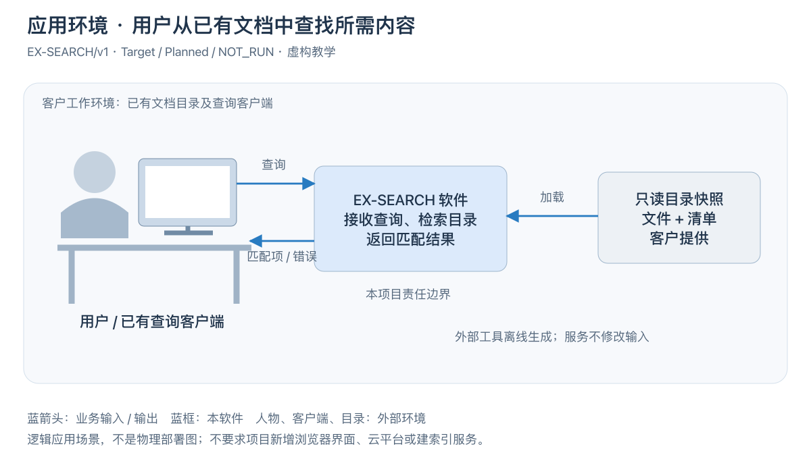

[可编辑 SVG](../diagrams/software-application-context.svg)。

图 SW-E1 · EX-SEARCH/v1，Target / Planned / NOT_RUN。用户希望从已有文档中查找相关条目，向客户端输入查询条件，软件读取已校验的目录快照并返回匹配项或错误。客户端和离线快照生成器由客户提供，本软件负责查询处理，不负责制作文档或提供新的 UI。

图展示用户、软件和外部数据之间的逻辑交接，不表示必须分成三台机器。它沿用总体模板“场景图→图注→业务说明”的写法；不要把内部模块分层叠到这里。SW-E1–6 与文末 EX-SEARCH 样稿是同一案例；§3.1/§5 的 EX-SOFTWARE-LAYERS 是另一套层级教学，不能拼成一份项目架构。
<!-- STD_TEMPLATE_EXAMPLE_END -->

<!-- 在此写入本节设计正文；图表汇总结论，不替代方案、依据及边界说明。 -->

### 2.2 目标、范围与可观察成功条件

<details>
<summary>本节编写建议、规范与示例</summary>

**本节目的**：把产品期望转换成能够指导架构取舍的目标。

**必须写清楚**：核心能力、支持和不支持的范围、负载条件、性能/可靠性/安全目标、资源限制与验收判据。每项目标关联需求和适用版本，不只写形容词。

**编写规范**：区分目标、设计预算、已实现能力和测量结果；数值带单位、作用域、配置和来源。没有证据不得把目标写成保证；容量、时延等目标在 §11 推导，在 §12 设计验证。

**抽象示例**：要求在固定输入大小与并发条件下完成转换，可作为待验证目标；“响应很快”不能指导选型，也不能从单个小文件成功推导最大负载满足要求。

**完成条件**：每个关键目标都有边界和判据，剩余缺口可指出所缺输入而不是只写待定。

</details>

| Target / Requirement ID | 场景及适用条件 | 目标 / 单位与边界 | 判定与证据状态 | 非目标 / 未决项 |
|---|---|---|---|---|


## 3. 系统概览

<details>
<summary>本节编写建议、规范与示例</summary>

**本节目的**：在约一到两屏的连续说明中交代整体工作原理，软件系统不成为下级文档索引。

**必须写清楚**：核心输入、主要处理与输出；主要软件子系统如何分工、重要业务路径、部署位置、本版本完成程度，以及最重要的设计取舍和边界。

**编写规范**：简短承接 §2 的业务场景，随后在 §3.1 先放软件系统架构图，在 §3.2 逐组件解释组成与职责，再说明方案取舍、约束、机制映射和功能。后续只展开直属对象的概要原理、运行载体及重要过程；不复制同一幅全系统架构图或协议细则。没有读下级设计的人也应理解主要原理。

**抽象示例**：虚构应用先检查输入与权限，在受控资源内执行转换，核对输出后才公布结果；不能把“已受理”显示成“转换成功”。此原理不要求一定采用队列或分布式存储。

**完成条件**：读者能复述完整工作原理及为何采用该方案，模块清单和链接不能替代这些解释。

</details>

<!-- 在此写入本节设计正文；图表汇总结论，不替代方案、依据及边界说明。 -->

### 3.1 软件系统架构

<details>
<summary>本节编写建议、规范与示例</summary>

**本节目的**：先用总图展示软件整体的静态层次和主要组成，让读者在功能及下级概要之前建立全局认识。

**必须写清楚**：软件层次、直属软件子系统和按需直属模块、职责/非职责、状态与资源归属、公共依赖和下级设计入口；解释为何这样划分。

**编写规范**：组成图主要表达层次和包含关系，模块无图标、无连线，层名放左侧且模块颜色与层底色区分。图放在本节正文开头，随后用短段解释整体关系；各组成职责紧接在 §3.2 展开，不能只把总图藏在后续详细设计。调用与数据流另画。软件子系统只下接模块，不递归；公共库不因画成一层就自动成为子系统。

先从实际设计/对象登记识别软件组成，再按统一职责依据分层，例如 UI、业务、驱动和按需系统层。
不能用“直属模块、内部子系统、既有公共支撑”等对象类型或历史属性充当架构上下层。
框内用项目正式英文组件名：有 WebUI 就写 WebUI，有 CLI 才另画 CLI，不用“操作界面”等中文职责代替具体对象。
中文职责、政策和实现说明在图后展开；名称可附对象 ID，不把斜杠串联的能力名词当成一个组件。
层不等同进程或正式子系统，不能为了套四层图而新增项目组件。具体步骤及反例见软件系统 AI 指南 §4。

**抽象示例**：虚构软件系统 SW-P 可包含处理子系统 SUB-C 和直属配置模块 MOD-D；是否独立进程是运行设计决定，不由静态框的数量推导。

**完成条件**：所有核心功能都有责任对象，关键边界无空白和重叠；图后逐个解释组成，不能仅列文档链接。

</details>

<!-- STD_TEMPLATE_EXAMPLE_BEGIN -->
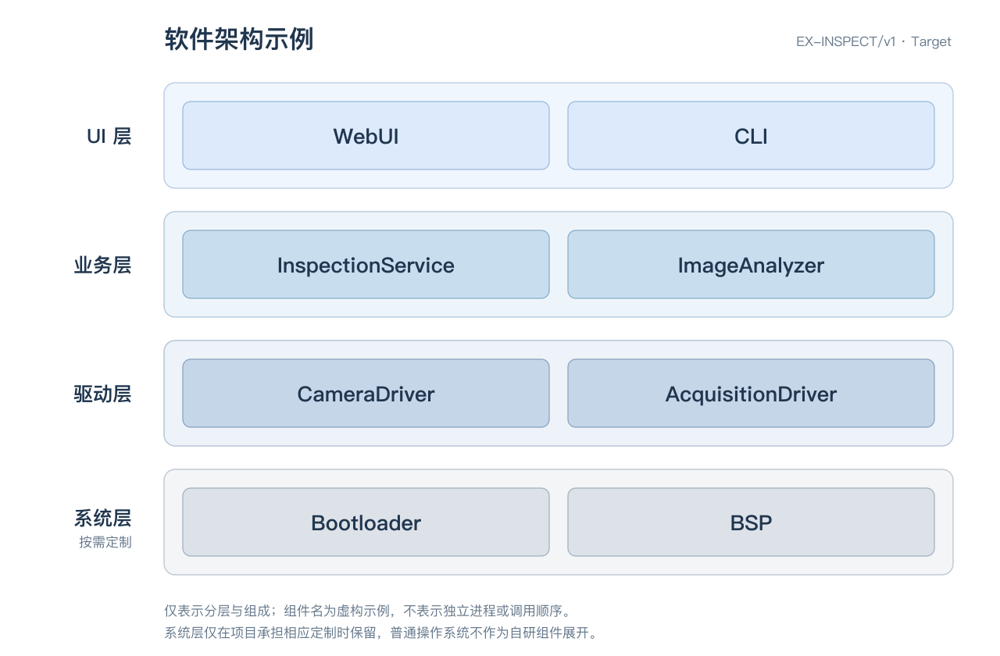

[可编辑 SVG](../diagrams/software-system-layered-example.svg)。EX-INSPECT/v1 · Target / Planned / NOT_RUN。
WebUI、CLI 是交互入口；InspectionService 组织检测处理，ImageAnalyzer 执行图像分析；
CameraDriver 与 AcquisitionDriver 分别承担相机控制和采集设备访问。Bootloader、BSP 仅表示实际定制时的系统组成。
图表达组成，不规定运行进程和调用顺序；组件职责、接口边界和状态归属须在 §3.2 逐个落实，没有对应能力不保留示例层。

下面另附父子对象关系教学图，不是上图的下级设计，也不是完整软件架构范例：

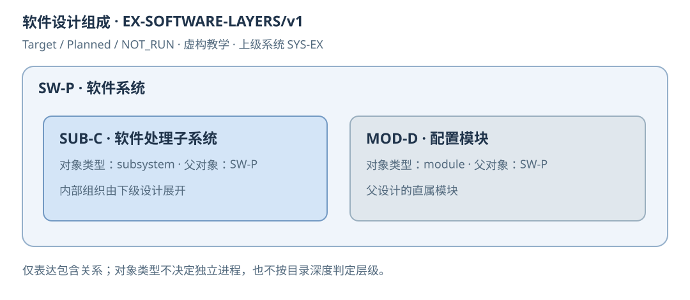

EX-SOFTWARE-LAYERS/v1 · Target / Planned / NOT_RUN。SW-P 是软件系统，SUB-C 是处理子系统，
MOD-D 是直属配置模块。SUB-C 完成主要处理，MOD-D 管理配置交接；SW-P 规定双方共同保证。
这张图只说明包含关系，不规定运行进程。教学 ID 不是项目 S/M 编号，采用时替换图文及属性。
<!-- STD_TEMPLATE_EXAMPLE_END -->

### 3.2 组成与职责

<details>
<summary>本节编写建议、规范与示例</summary>

**本节目的**：紧接架构图逐一解释各部分负责和不负责什么，使图、下级文档、接口和测试能够定位到同一个软件对象。

**必须写清楚**：以 §3.1 系统架构图为依据，先说明各层的作用、边界及其组成，再逐个说明层内子系统/模块的对象 ID、名称、类型、直属父对象、职责/非职责、拥有的状态/资源、提供和消费接口、Document ID、文件名与状态。每个对象的正文说明应交代输入、主要处理和输出，使读者知道它具体做什么，而不只是知道谁负责它。

**编写规范**：本节按架构图的组织和顺序展开，可以采用“层 → 子系统/模块”的子标题结构；每层先写共同作用与边界，再按图中正式名称和编号逐个描述对象，不另造一套按部门、目录或对象类型排序的清单。层只是逻辑分组，不因此取得子系统编号或成为模块的直属父对象；无分层架构按图中分区组织，不强造层次。遵循软件设计对象编码规范：S01 等子系统，M201 属于 S02，M001 为软件系统直属模块；不得创建 S00。Document ID 不等于对象 ID。表格用于汇总而非替代逐对象正文；对象登记在此唯一维护，§4 引用对象 ID 展开工作原理，不重复维护登记。调整图形或名称不重新编号；已采用旧编号的项目只按获准范围迁移。

**抽象示例**：若架构图的 UI 层包含软件系统直属模块 WebUI（M001）和 CLI（M002），本节先说明 UI 层承担用户交互、不裁定业务规则；再分别说明 WebUI 接收浏览器操作、转换为业务请求并呈现结果，CLI 解析命令行输入、调用相同业务接口并输出结果与退出码。二者的父对象仍是软件系统，不是“UI 层”。随后按图继续描述业务层及其子系统/模块。编号和组件仅为示例，实际采用项目登记。

**完成条件**：§3.1 图中的每个本层设计对象均能在本节找到同名、同编号且有实际内容的说明，本节也不出现图中未交代的主要组成；层的作用与对象的具体工作可区分。对象唯一、父关系与两类下级模板一致，计划路径不伪装成已经存在的设计；只有职责表而无逐层、逐对象说明不能判为完成。

</details>

| 对象 ID / 类型 / 父对象 | 职责 / 非职责 | 状态与资源 | 提供/消费接口 | Document ID / 文件名 / 状态 |
|---|---|---|---|---|


### 3.3 总体方案、选择依据与替代方案

<details>
<summary>本节编写建议、规范与示例</summary>

**本节目的**：让架构选择能够被复核，而不是只公布选型结果。

**必须写清楚**：关键问题、输入约束、可行方案、正常及失败推演、推荐方案、成本和限制；说明选择影响哪些能力和部署条件。

**编写规范**：说不清机制时先做章节预设计：输入与约束 → 选项 → 正常/失败推演 → 推荐及代价 → 未决项，再写回选定方案。复杂分析可引用 evaluation.technical-analysis；关键机制未定不能判为设计完成，未实现与未实测则分别保留。

**抽象示例**：单进程减少部署和交接成本，但转换阻塞可能拖慢控制请求；若选择隔离执行，需要说明通信、停止确认和资源代价。不能只写“采用微服务，便于扩展”。

**完成条件**：主要选择有依据、被否决方案有具体原因，待分析的问题有下一步可区分选项的检查。

</details>

<!-- 在此写入本节设计正文；图表汇总结论，不替代方案、依据及边界说明。 -->

### 3.4 约束分配与下游保证

<details>
<summary>本节编写建议、规范与示例</summary>

**本节目的**：将系统方案交给各子系统后，组合结果仍满足整体约束。

**必须写清楚**：Constraint ID、条件、承接对象、分配预算或行为保证、不可改变的决定、下级自由度、验证和变更影响。共享池、在途开销与预留也要有归属。

**编写规范**：系统决定共同政策，下级设计内部组织；预算推导在 §11 唯一维护，本表引用分配，不复制另一套数值。跨层约束显式说明必要性；局部 PASS 不代表组合满足系统目标。

**抽象示例**：转换子系统可以选择内部算法，但不能改变结果发布判据；内存预算必须包含输入、输出和中间数据，不能只按最终文件大小分配。

**完成条件**：下游不必重新决定系统政策，每项分配有承接位置和组合检查责任。

</details>

| Constraint ID / 条件 | 承接对象 ID | 预算或行为保证 / 推导引用 | 自由度 / 不可改变 | 下级设计入口 | 局部与组合验证 / 影响 |
|---|---|---|---|---|---|


### 3.5 机制清单与文档映射

<details>
<summary>本节编写建议、规范与示例</summary>

**本节目的**：先建立软件共同机制的完整导航，再按依赖逐份设计，不强求一次写完所有机制。

**必须写清楚**：Mechanism ID、上级 Mechanism ID、目的、参与对象、对应 Process/Step/Constraint、前置依赖、唯一文档 ID、计划文件名与状态。机制父子关系与执行依赖分开。

**编写规范**：没有文件时写 Planned 和计划路径，不作可点击已存在来源，不标已批准。系统保留端到端原理、关键阶段和代表失败，design.system-mechanism 维护详细协议与状态。复用总体机制时记录本软件参与义务，不另外定义一套公共行为。

**抽象示例**：转换任务的执行与停止可属于一个交付机制，观察查询可独立存在；机制父项表示归属，不意味着必须等待父机制运行。计划文件名只是后续写作入口。

**完成条件**：全部适用共同能力有唯一承载位置，未成文与未决内容不冒充可执行契约。

</details>

| Mechanism ID / 用途 | 上级 Mechanism ID | 参与对象 / Process或Constraint | 前置依赖 | Document ID / 计划文件名 | Planned或实际基线 / 未决项 |
|---|---|---|---|---|---|


### 3.6 功能设计

<details>
<summary>本节编写建议、规范与示例</summary>

**本节目的**：完整说明要实现的能力和可观察行为，避免作者从模块名倒推需求。

**必须写清楚**：功能总表、角色、用户任务、输入输出、权限、成功/失败结果及边界；图形界面、CLI、API、库调用按实际产品选择，标记功能与验证状态。具体操作入口及交互契约在 §8.4 唯一维护。

**编写规范**：先按用户任务分功能，再映射实现。功能表只是索引，复杂能力按 §3.6.1 扩展子节。§3.6.2 只说明用户任务和可观察的功能结果；页面结构、命令语法、参数、反馈及退出码在 §8.4 定义，不在本章维护第二份接口。不把维护入口当产品主链。

**抽象示例**：转换与查询结果是两个不同能力，提交返回任务标识不等于结果已经存在；是否允许取消由实际产品范围决定，不能为了示例新增。

**完成条件**：每项正式能力有主路径和必要拒绝结果，用户任务能追到 §8.4 的实际入口、承接对象与验证判据。

</details>

| Capability ID / 名称 | 用户场景 / 入口 | 输入及前提 | 输出 / 失败行为 | 对象及过程引用 | 实现状态 / 验证项 |
|---|---|---|---|---|---|


#### 3.6.1 关键功能概要（按能力展开）

<details>
<summary>本节编写建议、规范与示例</summary>

**本节目的**：把核心功能的处理原理和规则说到可以指导设计的程度。

**必须写清楚**：何时使用、输入合法性、主要步骤、处理对象的变化、结果可见点、异常和不支持条件；关联所属子系统和系统重要过程。

**编写规范**：按项目真实能力复制本节并同步编号。不在这里抄全部 Schema 字段，完整规格映射到 §8；过程涉及共同状态时回写 §6/§7，不允许两个子系统分别猜完成含义。

**抽象示例**：转换功能在发布前检查格式和输出完整性；输入非法时明确返回拒绝而不是创建半完成任务。算法细节交下级，但谁判定可发布须在本层确定。

**完成条件**：读者知道何时调用、怎样处理及何时算完成，不依赖函数名猜行为。

</details>

<!-- 在此写入本节设计正文；图表汇总结论，不替代方案、依据及边界说明。 -->

#### 3.6.2 用户任务与功能结果

<details>
<summary>本节编写建议、规范与示例</summary>

**本节目的**：从用户任务说明功能为何存在、何时使用以及完成后得到什么结果，不在这里定义页面或命令接口。

**必须写清楚**：每项重要用户任务的触发场景、角色、前提、期望结果、结果已知性、失败或不支持条件；指出承接该任务的 §8.4 页面或命令，以及相关的 §6 过程和 §12 验证项。

**编写规范**：按任务而非控件或命令名组织，说明受理、处理中、生效或完成分别意味着什么，并引用权威事实来源。实际导航、布局、可编辑字段、CLI 执行位置、参数、输出和错误反馈均交 §8.4 唯一说明；本节只给入口引用，不复制接口合同。功能结果不能以按钮状态或命令退出码代替服务端事实。

**抽象示例**：用户提交检测任务，系统受理后返回任务身份，检测完成后才提供结果；请求响应丢失时结果未知，用户应通过原请求身份核对，而非立即创建另一任务。该任务在本节说明功能语义，具体 WebUI 页面和 CLI 命令在 §8.4 分别定义。

**完成条件**：读者知道每项用户任务的完成事实和失败边界，能追到唯一的操作入口；本节没有重复维护页面动作或命令参数。

</details>

<!-- 在此按用户任务写功能目的、完成事实和失败边界，并引用 §8.4 的实际操作入口；不重复页面或命令合同。 -->

## 4. 子系统与直属模块概要设计

<details>
<summary>本节编写建议、规范与示例</summary>

**本节目的**：在 §3 已明确的架构和职责基础上，展开各直属对象承担功能的概要原理，而非再次介绍全系统组成。

**必须写清楚**：各关键子系统或直属模块的输入输出、主要处理、协作、失败传播、继承约束和下级自由度；关联 §3.2 对象 ID 与 §3.4 分配。

**编写规范**：沿 §3.2 已登记对象逐个展开，按需要复制 §4.1 并同步编号，不重画全系统架构图、不复制对象总表。说明实现共同保证所需的原理，但将子系统内部模块、线程与算法细节留给下级；如需局部图，明确本节对象边界，运行部署引用 §5。

**抽象示例**：处理子系统如何检查输入、产生候选结果并交给发布方，应在本章说清；它属于哪个系统、负责什么则引用 §3，内部解析模块的算法由下级设计维护。

**完成条件**：每个关键对象的概要能承接其职责和系统约束，读者无需在本章重新拼出全系统架构，未定机制不能推给下级猜测。

</details>

<!-- 按已登记对象展开概要；对象总表唯一维护在 §3.2，本章不重复全系统架构图。 -->

### 4.1 直属对象概要设计（按子系统或直属模块展开）

<details>
<summary>本节编写建议、规范与示例</summary>

**本节目的**：交代主要组成如何承担系统功能，同时给下级保留内部设计空间。

**必须写清楚**：输入输出、概要原理、合作对象、公共状态和失败传播、预算及依赖；子系统说明整体行为，直属模块说明系统所需的模块概要。

**编写规范**：为每个关键直属对象写连续处理说明，而非只有职责表。按“问题 → 选定方案 → 具体输入推演 → 失败推演 → 下游承接”展开：先明确必须解决的问题和既有约束，选择实际机制并解释依据及代价，再带入输入说明接收、判断、处理、交付与确认；改变一个关键条件检验失败出口，发现断点就回写方案。职责表最后汇总设计结论，不以“负责某事”代替如何完成。父设计确定跨对象共同语义，不规定子系统内部全部线程、算法和私有字段。必要跨层约束标明来源与原因，下级文件未写不等于共同机制可以待下级自定。

**抽象示例**：处理子系统接收已校验输入，在分配额度内转换并返回候选结果；是否对外发布由系统既定规则决定。该子系统如何拆内部解析模块，由其概要设计展开。

**完成条件**：开发者知道每个对象接收什么、做什么、交给谁，无法解释的协作已经回到预设计，而非推给下游猜。采用无口头补充复演：读者仅凭正文、图与固定契约即可推出代表输入的行为，所选方案、失败出口与下游自由度明确；代表案例不替代完整覆盖。

</details>

<!-- 在此写入本节设计正文；图表汇总结论，不替代方案、依据及边界说明。 -->

## 5. 运行组织与部署设计

<details>
<summary>本节编写建议、规范与示例</summary>

**本节目的**：把逻辑软件变成实际可启动、可部署、可隔离和可维护的运行系统。

**必须写清楚**：对象到进程、线程、任务、实例、节点和平台的映射，资源、通信、生命周期、运行身份及故障域。单机和分布式按实际选择，不预设容器或云平台。

**编写规范**：静态分解与运行分解分开，一个子系统不必一个进程。节点只是承载位置，不能代替运行时负责准入、确认和清理的执行者。普通操作系统只说明版本、能力与依赖，只有自研/裁剪/改造才展开其内部。

**抽象示例**：转换可以与界面同进程，也可隔离到工作进程；选择隔离时需承担进程退出、通信超时及残留输出的处理成本，不只画两个框。

**完成条件**：主要对象都有可执行的运行位置和通信方案，部署假设能支撑性能与故障推演。

</details>

<!-- STD_TEMPLATE_EXAMPLE_BEGIN -->
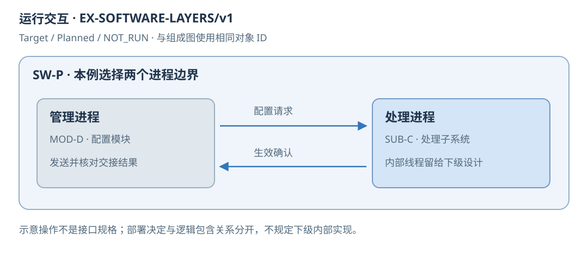

EX-SOFTWARE-LAYERS/v1 · Target / Planned / NOT_RUN。示例选择管理与处理两个进程，
MOD-D 下发配置、SUB-C 返回生效确认。箭头表示交互，不是机器接口规格；
两个进程是本例选择，不是所有软件系统的强制架构。SUB-C 的内部线程由其设计展开。
<!-- STD_TEMPLATE_EXAMPLE_END -->

### 5.1 执行上下文、调度与并发

<details>
<summary>本节编写建议、规范与示例</summary>

**本节目的**：避免阻塞业务让查询、停止和维护也无法执行。

**必须写清楚**：进程/线程/事件循环/任务的归属、创建销毁规则、并发限制、调度依据、等待关系、共享写入者和取消优先级；不拥有线程的库说明调用者约束。

**编写规范**：沿一条代表请求标明在哪个上下文执行、在哪里让出或阻塞。对每个等待给出合法出口；限制同时运行量与排队量并解释资源依据。禁止只写“异步”而不定义失败归属及回调寿命。

**抽象示例**：转换耗时操作不能阻塞处理停止请求的唯一线程；如果依赖方不能中断，明确等待上限、隔离方式及无法安全释放的条件，不编造可取消能力。

**完成条件**：执行图没有停止与清理相互等待的闭环，并发边界可用于用例和资源核算。

</details>

<!-- 在此写入本节设计正文；图表汇总结论，不替代方案、依据及边界说明。 -->

### 5.2 通信与跨实例协作

<details>
<summary>本节编写建议、规范与示例</summary>

**本节目的**：确定跨边界交接的语义，不把通信技术名当成协议。

**必须写清楚**：同步/异步方式、目标定位、消息关联、顺序、确认含义、超时、取消、重复与迟到响应；若有多实例，说明状态路由和故障接管范围。

**编写规范**：先定义交接的前提和结果，再选进程内调用、IPC、网络或已有消息系统。跨实例写入必须说明唯一权威及旧执行者失效条件；不默认投递一次等于副作用执行一次。详细请求响应在 §8 唯一维护。

**抽象示例**：请求发送成功仅证明传输，不证明转换完成；返回丢失时按原任务身份查询权威状态，不能在旧执行者可能继续运行时无条件重发写操作。

**完成条件**：每次交接有唯一目标、关联键和确认含义，结果未知与已失败不混用。

</details>

<!-- 在此写入本节设计正文；图表汇总结论，不替代方案、依据及边界说明。 -->

### 5.3 部署拓扑、资源与故障域

<details>
<summary>本节编写建议、规范与示例</summary>

**本节目的**：使实际运行条件与设计推导一致。

**必须写清楚**：支持的单机/集群或嵌入环境、实例数、CPU/内存/存储、端口/网络、运行账号、外部依赖、持久卷及共享故障域；开发、测试、生产差异分别记录。

**编写规范**：给逻辑对象到运行载体的映射和完整一套代表配置。共享主机、存储和身份可能扩大故障域，副本数量不能直接证明高可用。容器不是必需；复用现有部署入口，尚无实现时明确计划路径。

**抽象示例**：两个进程共用一块磁盘时，磁盘耗尽会同时影响两者；即使各有进程监控，也不能声称已经消除单点故障。

**完成条件**：任一关键对象能定位到资源、权限和故障边界，启动与测试环境可以根据这些输入准备。

</details>

| Topology ID / 配置 | 对象→进程/实例/节点 | 资源 / 负载依据 | 网络 / 账号 / 外部依赖 | 持久化 / 共享故障域 | 部署状态与验证 |
|---|---|---|---|---|---|


## 6. 重要过程

<details>
<summary>本节编写建议、规范与示例</summary>

**本节目的**：以实际操作走通软件系统，而不是把流程交给读者从章节中拼接。

**必须写清楚**：过程总表、模式、触发、目标、运行时统筹者、参与方、关键阶段、状态变化、结果可见和失败出口。启动、首次配置、业务处理、停止必须解释实际边界。

**编写规范**：下列过程可按实际能力扩展子节。每个重要流程必须有流程图或时序图、正文说明和异常分支，并完成图文核对；过程总表逐项关联图号/图内路径，架构图、文字箭头链和 Stage DAG 不能替代。每个关键判断追查事实由谁、从何来源、在何时产生；工程 Owner 不是运行统筹者。用相同 Process/Step/Constraint ID 引用机制细则，正文仍保留端到端原理和代表失败。先写选定方案怎样工作，再解释约束；只有“应当恢复”“禁止盲目重试”等原则而没有实际判据和出口，仍是设计缺口。

**抽象示例**：从提交转换到输出可取得，应经过受理、执行、结果核对和发布；这些是本例说明阶段的方法，不要求项目新增四个服务或四种持久状态。

**完成条件**：主要过程有合法入口、完成点与失败出口，设计未定、未实现、未验证分别可见。

</details>

| Process ID / 模式 | 触发 / 目标 | 统筹者 / 参与方 | 前提事实来源 | 阶段 / 结果可见点 | 失败及清理 / 机制引用 | 图号 / 图内路径 / 正文位置 |
|---|---|---|---|---|---|---|


### 6.1 启动与就绪过程

<details>
<summary>本节编写建议、规范与示例</summary>

**本节目的**：定义软件何时真正可服务，而非仅描述进程被拉起。

**必须写清楚**：冷启动/重启入口、依赖顺序、配置取得、自检和资源初始化、状态恢复、对外准入时点；部分启动失败的退出、重试或降级。

**编写规范**：区分进程存活、依赖可达、自检通过与业务就绪。自检细节在 §10.3，启动在这里说明如何使用结果。禁止在未恢复权威状态前接收写请求；无持久状态时也要解释首次配置及资源准备。

**抽象示例**：转换进程先加载已验证规则，再确认工作目录可用，之后开放受理；外部存储不可达时是否允许只读查询由产品边界决定，不默认为全功能就绪。

<!-- STD_TEMPLATE_EXAMPLE_BEGIN -->
完整的正文、图与异常推演方法见[虚构软件启动与恢复样稿](../../docs/examples/software-startup-design-example.md)；只学习展开方法，不照搬它的对象、路径或恢复政策。此教学链接在生成项目文档时移除，避免把 STD 仓库相对路径带入项目。
<!-- STD_TEMPLATE_EXAMPLE_END -->

**完成条件**：可以按步骤准备并判断系统就绪，失败不会遗留已开放但不可履约的入口。

</details>

<!-- STD_TEMPLATE_EXAMPLE_BEGIN -->
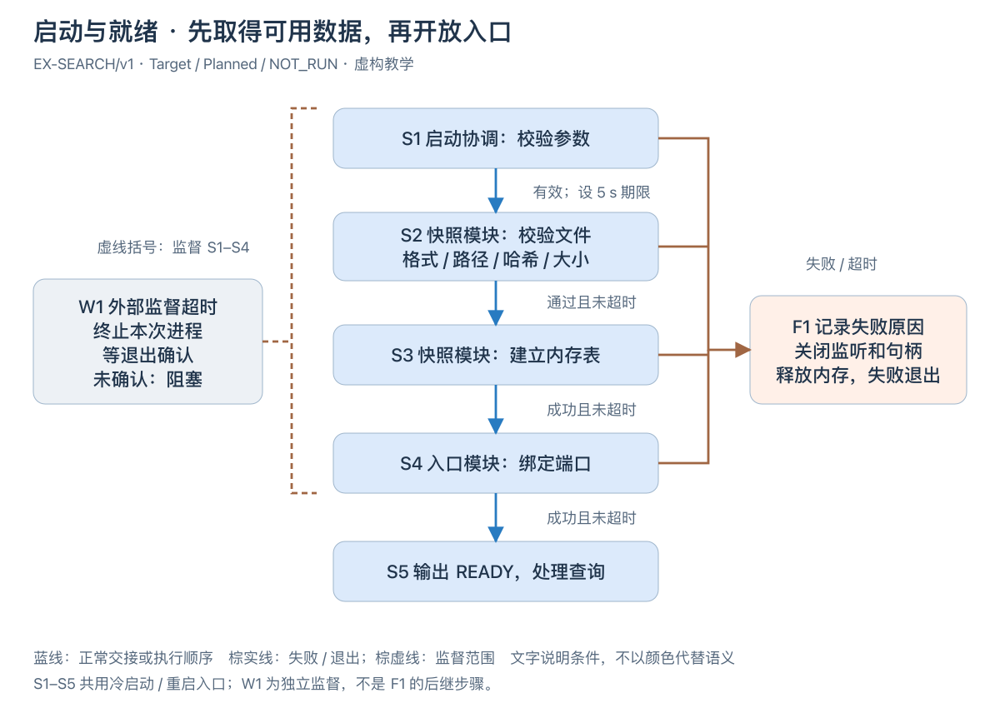

[可编辑 SVG](../diagrams/software-startup-flow.svg)。

图 SW-E2 · EX-SEARCH/v1，Target / Planned / NOT_RUN。启动协调模块先校验参数，快照模块检查数据并建立内存表，入口模块最后绑定端口；只有这些步骤成功且没有超过启动期限才发出 READY。失败路径 F1 关闭本次已取得的监听与句柄并释放内存，不能留下一个数据未就绪的业务入口。

5 s 应用预算与 10 s 外部监督上限均为教学目标。W1 可在 S1–S4 阻塞时终止进程，不依赖 F1 已执行；必须取得退出确认才认为资源已回收。冷启动与重启都走这张图，不跳过检查。图文完整判据见文末样稿。
<!-- STD_TEMPLATE_EXAMPLE_END -->

<!-- 在此写入本节设计正文；图表汇总结论，不替代方案、依据及边界说明。 -->

### 6.2 一次业务处理的完整过程

<details>
<summary>本节编写建议、规范与示例</summary>

**本节目的**：把核心业务从用户意图走到可确认结果。

**必须写清楚**：代表输入及前提、逐阶段执行方、读写对象、授权/准入、资源取得、结果发布、回复和清理；异步处理说明受理回执与终态查询。

**编写规范**：正常路径至少带一个具体输入推演，之后检查拒绝、执行失败、响应丢失及中途退出。结果已知性、访问安全、操作终态、资源释放、重新准入分别判断，不用一个 failed 字段掩盖不同义务。只读业务可简化，但需处理迟到响应和临时资源。

**抽象示例**：转换结果已生成而回复丢失时，任务可能成功但调用方未知；查询通过稳定身份取得结果，不能直接再次转换并覆盖原结果。

**完成条件**：一项业务的成功、结果未知和失败均有可解释的出口，清理不是含糊的 finally 标签。

</details>

<!-- STD_TEMPLATE_EXAMPLE_BEGIN -->
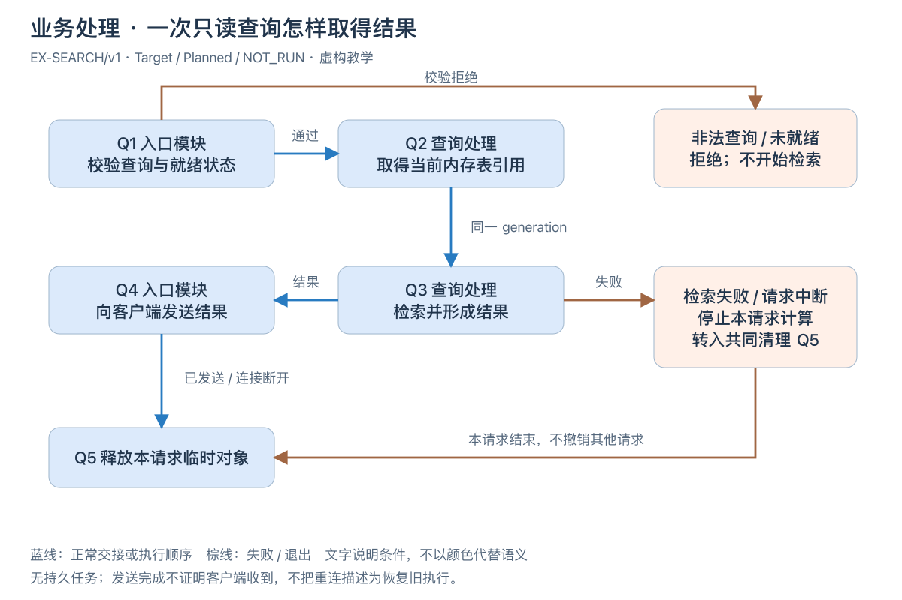

[可编辑 SVG](../diagrams/software-query-flow.svg)。

图 SW-E3 · EX-SEARCH/v1，Target / Planned / NOT_RUN。例如用户查询“安装失败”，入口校验查询内容后取得启动时建立的同一代内存表，查询处理创建本请求的匹配结果并交给入口返回；一次查询期间不切换快照。非法输入被拒绝，不启动检索。

发送结束不证明客户端已收到；连接中断或计算失败只结束本请求并释放临时对象，不删除共享检索表或其他请求。取消在计算批次边界检查，停止过程负责处理不能及时退出的计算。这个只读例子没有持久任务，不能用来推导写入任务可以自动重放；有副作用时应另按实际契约设计结果未知、停止和释放。
<!-- STD_TEMPLATE_EXAMPLE_END -->

<!-- 在此写入本节设计正文；图表汇总结论，不替代方案、依据及边界说明。 -->

### 6.3 配置生效与模式切换过程

<details>
<summary>本节编写建议、规范与示例</summary>

**本节目的**：明确配置从被接收到真正被业务使用的时间与范围。

**必须写清楚**：提交、校验、候选、分发、安装、激活、确认和旧版本回收的实际阶段；在途任务绑定、部分目标失败和模式切换前提。

**编写规范**：配置规则在 §9 唯一维护，本节串联过程。单进程原子替换不能证明多实例同时切换；要求同代运行时说明如何停流或隔离。没有在线修改能力就写重启生效，不为模板新增发布平台。

**抽象示例**：转换任务入口绑定规则版本，已开始的任务继续旧版；新任务使用新版，旧版在内存引用和持久恢复义务都满足后才可删除。

**完成条件**：提交成功、生效成功与验证成功明确分开，混合版本和部分失败不产生隐含行为。

</details>

<!-- STD_TEMPLATE_EXAMPLE_BEGIN -->
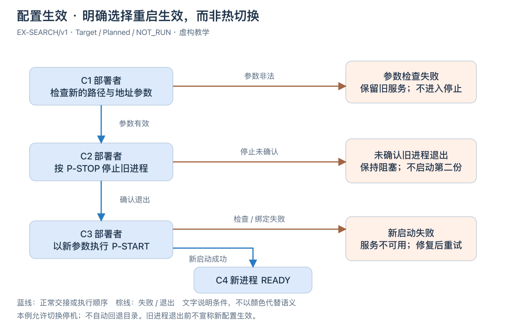

[可编辑 SVG](../diagrams/software-configuration-flow.svg)。

图 SW-E4 · EX-SEARCH/v1，Target / Planned / NOT_RUN。本例明确选择重启生效：部署者先检查新参数，再关闭旧服务并确认退出，之后以新参数完整执行 P-START。旧服务在停止前仍使用旧快照；新进程 READY 才证明新配置可服务，没有“参数已提交就已生效”的捷径。

新参数无效时保留旧服务，不进入停止。旧进程退出无法确认时阻塞；旧进程已退出而新启动失败时保持服务不可用，修复后再启动，不自动回退目录。这里用允许切换停机换取简单的一致性边界；不要求需要连续服务的项目采用同一方案。
<!-- STD_TEMPLATE_EXAMPLE_END -->

<!-- 在此写入本节设计正文；图表汇总结论，不替代方案、依据及边界说明。 -->

### 6.4 停止、取消、重启与异常恢复

<details>
<summary>本节编写建议、规范与示例</summary>

**本节目的**：防止停止请求看似成功，旧执行仍在修改状态。

**必须写清楚**：关闭准入、在途处理、停止确认、结果取证、写入隔离、资源释放、恢复与重新准入的依赖；过载、失联、崩溃及重启分别推演。

**编写规范**：失联先视为结果未知，按实际契约区分四类恢复动作：状态查询只读取原操作；同请求重放核对同一身份及完整参数，由权威幂等记录返回原状态/结果，不新增执行；执行者接管转移执行权，必须确认旧执行者停止或被可靠隔离；新业务重试根据原结果及业务政策重新准入，可能重复副作用的重新执行须满足相应隔离和幂等/去重条件。查询及不新增执行的幂等重放不要求先停止原执行者，不能换 key 绕过未知结果。明确去重范围、记录有效期、参数冲突和记录过期的处理，并将同一语义交给下级设计。每个等待有期限、事实来源和合法出口。取证无法恢复但已安全停止时，明确如何封结未知结果、保留证据并安全释放，不能永远等待凭据。

**抽象示例**：转换工作进程被确认终止且写权限撤销后，可按契约封结无法取得的结果并清理临时空间；这不意味着转换成功，也不自动允许重复有副作用的业务。

**完成条件**：停止与撤销无互相等待，释放有安全依据；重启后不复活旧权威或误报成功。

</details>

<!-- STD_TEMPLATE_EXAMPLE_BEGIN -->
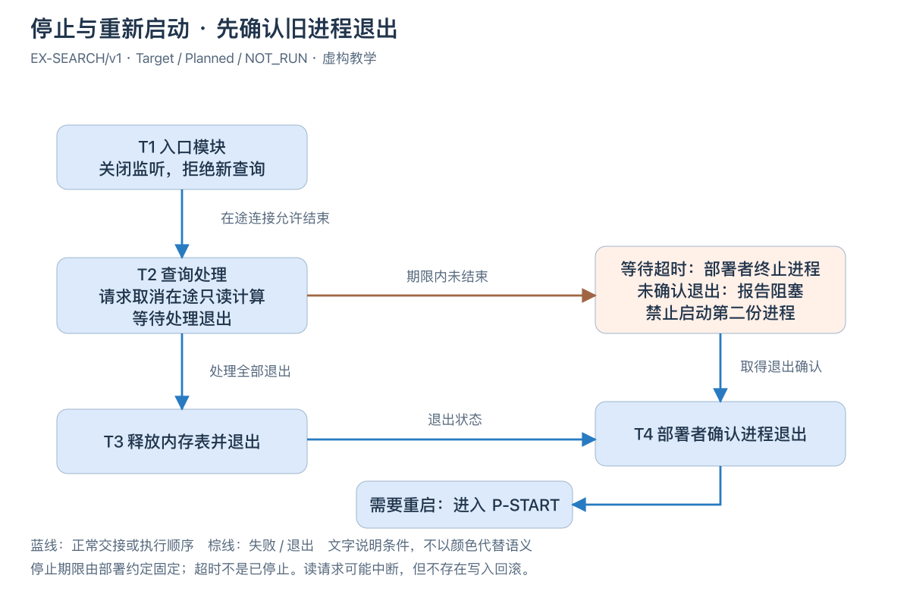

[可编辑 SVG](../diagrams/software-stop-flow.svg)。

图 SW-E5 · EX-SEARCH/v1，Target / Planned / NOT_RUN。入口先关闭监听，再通知已有查询取消计算；查询在批次边界响应取消，退出后归还各自临时对象。全部查询退出后才释放共享内存表，避免请求仍在访问已释放数据。部署者取得进程退出状态后，才能按 P-START 重启。

本例给正常停止分配 5 s 教学目标，仍未退出则由部署者终止进程并等待确认；未确认就报告阻塞，不把“已发终止请求”当成“已停止”。此图只覆盖只读计算，不含写权限撤销或持久义务对账。进程崩溃后同样必须确认退出，重启重新建表，不续接旧查询。
<!-- STD_TEMPLATE_EXAMPLE_END -->

<!-- 在此写入本节设计正文；图表汇总结论，不替代方案、依据及边界说明。 -->

## 7. 数据结构设计

<details>
<summary>本节编写建议、规范与示例</summary>


<!-- 数据结构分类编写建议与教学例子；生成文档时按实际对象保留适用类别。
只保留适用类别，并在章首记录不适用类别的原因与 tailoring 依据。类别按性质划分，不按输入/输出划分；每个具体结构以真实名称作带编号的小节标题，字段、约束、唯一来源、所有权/寿命、合法与拒绝实例及验证随该结构描述，不另设数据结构清单。下列例子均为虚构，不能作为项目契约：

| 类别 | 具体示例（均为虚构） | 适用条件与关键约束 |
|---|---|---|
| 公共基础类型与枚举 | `InspectionState = ACCEPTED \| RUNNING \| SUCCEEDED \| FAILED`；示例值 `RUNNING` | 多处共用时采用；`RUNNING` 表示已开始执行，未知值拒绝 |
| 业务与操作数据结构 | `InspectionRequest {request_id:"req-7", image_uri:"asset://image/7", policy_version:3}` | 存在业务载荷时采用；三字段必填，`request_id` 绑定一次业务操作 |
| 配置与规则数据结构 | `config/inspection-policy.yaml {schema_version:1, policy_version:3, enabled:true, score_threshold:0.75}` | 存在受控规则时采用；阈值在 0–1，新版本仅对后续任务生效 |
| 通信报文结构 | `FrameReadyEvent {source_id:2, frame_id:7, sequence:42, image_ref_id:9}` | 存在消息交接时采用；`sequence` 在同一来源内递增，重复号按契约去重 |
| 设备与 FPGA 表项结构 | `RouteTableEntry {route_id:u12=7, target:u4=2}` | 实际拥有设备/RTL 表项时采用；16 位布局和写入确认均须由机器源定义 |
| 运行状态数据结构 | `InspectionRuntimeState {task_id:"t-7", generation:2, state:RUNNING, result_uri:null}` | 存在跨步骤状态时采用；唯一写者确认 `ACCEPTED → RUNNING` 后发布 |
| 数据库表结构 | `inspection_jobs(task_id PRIMARY KEY, generation, state, result_uri)` | 实际拥有数据库表时采用；受理回复前提交事务，升级说明版本迁移 |
| 错误码与错误结构 | `InspectionError {code:QUEUE_FULL, request_id:"req-7", task_id:null}` | 存在错误载荷时采用；公共 `QUEUE_FULL` 逐码定义，拒绝本次新任务 |

结构小节以 `InspectionRequest` 等真实名称为标题：先展示类型声明，再逐字段写类型、必填/范围、跨字段规则、来源、持有者和验证。上表只是简短实例，不是字段全集或机器权威；没有设备或数据库的项目，不要为了填类别发明寄存器或表。


**以下为本层原有编写要求。**

**本节目的**：解释数据怎样流动、变化、被共享和保留，为实现与容量提供共同依据。

**必须写清楚**：主要业务对象、内部元数据、权威状态、持久化、缓存、输入输出格式和数据生命周期；说明创建、读取、更新、删除及恢复责任。

**公共错误码**：§7.8 逐码列出本软件系统拥有或从总体系统继承的对外错误、语义、来源和模块承接；私有异常只在越过系统边界时映射。

**编写规范**：不用数据库表清单替代数据设计。数据结构需解释为何这样组织和怎样支撑访问；完整字段映射到 §8 机器定义，摘要不成为第二份 authority。没有数据库也要描述内存、文件、队列和在途对象。

**抽象示例**：转换使用输入引用、规则版本和输出引用，业务状态与界面观测副本分开；界面缓存清空不代表任务被取消。

**完成条件**：每个关键对象从来源到最终释放可追踪，数据组织能支持实际功能与故障恢复。

-->
</details>

<!-- 在此写入本节设计正文；图表汇总结论，不替代方案、依据及边界说明。 -->

### 7.1 公共基础类型与枚举（适用时）

<details>
<summary>本节编写建议、规范与示例</summary>

**本节目的**：统一本层拥有的共享类型与枚举语义，使该类数据可由下级直接承接。

**必须写清楚**：逐值含义、合法范围、未知值处理及唯一来源；逐结构记录 Data/Type ID、固定来源、字段、所有权与寿命、合法和拒绝实例及验证。

**编写规范**：复用上级类型时仅给固定引用和本层投影，不重定义值。本类别不适用时在章首说明原因和 tailoring 依据，不保留空小节。如果字段已有机器定义，应固定版本并逐项核对；教学例子不得成为项目默认值。

**抽象示例**：任务状态 RUNNING 只表示执行已开始，不代表成功完成；示例只说明写法，不是项目的机器契约。

**完成条件**：各使用处对同一值作一致解释，且没有与其他章节重复维护同一字段定义。

</details>

<!-- 编写建议：只收录本层拥有或必须呈现的公共基础类型与枚举；已由上级或机器源定义的值只引用固定来源。逐值写含义、范围、未知值处理和适用边界。虚构例子：InspectionState 的 RUNNING 只表示检测已开始执行，不等于完成。 -->

#### 7.1.N `<真实结构名>`

- **完整定义、Data/Type/Error ID 与唯一来源**
- **逐字段/逐值类型、范围、含义与跨字段约束**
- **生产/修改、所有权、可见点、寿命及失败出口**
- **合法与拒绝实例、V/Case 与证据状态**

<!-- STD_TEMPLATE_EXAMPLE_BEGIN -->
**7.1.1 `InspectionState`（公共状态枚举，虚构）**

```text
enum InspectionState { ACCEPTED, RUNNING, SUCCEEDED, FAILED }
```

- **Data/Type ID、含义与来源**：

  `DATA-EX-STATE`；一次检测任务的权威业务状态。示例机器源为 `Proposed: InspectionState`；正式设计须给出实际 Schema/IDL 路径、版本和核对结果，或记录形成契约的 Owner 与 Gate。

- **逐值定义**：

  `ACCEPTED`＝已受理但尚未执行；`RUNNING`＝已开始执行但无最终结果；`SUCCEEDED`＝结果已发布；`FAILED`＝执行终止且未发布成功结果。未知值拒绝，不映射为 `FAILED`。

- **约束与生命周期**：

  状态键为 `task_id`；只有任务状态的权威持有者可改变值，发布后读者才可观察。`RUNNING → SUCCEEDED` 必须已有可定位的结果；终态不得再回到 `RUNNING`。任务保留期限由系统级策略决定，此例不虚构期限。

- **合法/拒绝实例**：

  已发布结果 `result_id=res-7` 后置 `SUCCEEDED` 合法；只有执行开始记录、没有结果时置 `SUCCEEDED` 必须拒绝。

- **验证**：

  设计向量 `V-EX-STATE-01` 检查终态前提和未知值拒绝；本例 `NOT_RUN`，不表示验证通过。

<!-- STD_TEMPLATE_EXAMPLE_END -->

### 7.2 业务与操作数据结构（适用时）

<details>
<summary>本节编写建议、规范与示例</summary>

**本节目的**：定义业务操作实际交换和保存的对象，使该类数据可由下级直接承接。

**必须写清楚**：逐字段类型、必填性、范围、键及跨字段条件；逐结构记录 Data/Type ID、固定来源、字段、所有权与寿命、合法和拒绝实例及验证。

**编写规范**：同一结构无论作为输入还是输出只定义一次。本类别不适用时在章首说明原因和 tailoring 依据，不保留空小节。如果字段已有机器定义，应固定版本并逐项核对；教学例子不得成为项目默认值。

**抽象示例**：InspectionRequest 用非空 request_id 关联一次检测操作；示例只说明写法，不是项目的机器契约。

**完成条件**：合法与拒绝实例均能依字段和规则判定，且没有与其他章节重复维护同一字段定义。

</details>

<!-- 编写建议：按真实业务对象逐字段说明类型、必填/可空、范围和跨字段不变量；同一结构在多个接口使用时只定义一次。虚构例子：InspectionRequest 的 request_id 非空且标识一次业务操作。 -->

#### 7.2.N `<真实结构名>`

- **完整定义、Data/Type/Error ID 与唯一来源**
- **逐字段/逐值类型、范围、含义与跨字段约束**
- **生产/修改、所有权、可见点、寿命及失败出口**
- **合法与拒绝实例、V/Case 与证据状态**

<!-- STD_TEMPLATE_EXAMPLE_BEGIN -->
**7.2.1 `InspectionRequest`（业务对象，虚构）**

```text
InspectionRequest {
  request_id: string,
  image_uri: string,
  policy_version: uint32
}
```

- **Data/Type ID、用途与来源**：

  `DATA-EX-REQUEST`；代表一次待受理的检测请求，示例机器源为 `Proposed: InspectionRequest`。正式项目需绑定实际类型定义和固定版本。

- **`request_id`**：

  必填、非空字符串，作为同一业务请求的稳定身份；实际编码及长度上限由 Schema 确定。

- **`image_uri`**：

  必填、非空字符串，指向待检图像而非图像字节副本；URI 方案和访问权限由图像存储契约确定。

- **`policy_version`**：

  必填、正整数，指定本次请求采用的已发布规则版本。

- **跨字段与寿命**：

  同一 `request_id` 重放时，`image_uri` 与 `policy_version` 必须保持一致；冲突值不得创建第二任务。受理方创建任务记录后保留请求身份；原图的所有权与释放期限另由图像存储契约决定。

- **合法/拒绝实例**：

  `{request_id:"req-7", image_uri:"asset://image/7", policy_version:3}` 在引用和版本均存在时合法；同一 `request_id` 携带另一个图像 URI 应拒绝并返回已定义的冲突错误。

- **验证**：

  `V-EX-REQUEST-01` 覆盖合法构造、缺字段和同 ID 冲突；本例 `NOT_RUN`。

<!-- STD_TEMPLATE_EXAMPLE_END -->

<!-- STD_TEMPLATE_EXAMPLE_BEGIN -->
**7.2.2 `InspectionSubmission`（受理结果，虚构）**

```text
InspectionSubmission {
  request_id: string,
  task_id: string,
  disposition: ACCEPTED | EXISTING
}
```

- **Data/Type ID、用途与来源**：

  `DATA-EX-SUBMISSION`；表示请求已受理或同请求重放找到了原任务，不表示检测已经完成。示例机器源为 `Proposed: InspectionSubmission`。

- **`request_id`**：

  必填，等于输入 `InspectionRequest.request_id`；用于把响应绑定到原请求。

- **`task_id`**：

  必填、非空；`ACCEPTED` 指向本次新建任务，`EXISTING` 指向相同请求身份下已存在的原任务。

- **`disposition`**：

  必填；`ACCEPTED` 表示首次受理，`EXISTING` 表示同一请求内容重放且未新增执行；未知值拒绝。

- **约束与生命周期**：

  受理责任单元在任务身份持久确定后构造结果；响应丢失时仍可凭原 `request_id` 查询。任务何时完成由 §7.1 的 `InspectionState` 表达，不能从 `InspectionSubmission` 推断成功检测。

- **合法/拒绝实例**：

  `{request_id:"req-7", task_id:"t-7", disposition:ACCEPTED}` 在确实新建 `t-7` 后合法；没有持久任务身份却返回 `ACCEPTED` 必须拒绝。

- **验证**：

  `V-EX-SUBMISSION-01` 检查首次受理、同请求重放、响应丢失后查询和无重复任务；本例 `NOT_RUN`。

<!-- STD_TEMPLATE_EXAMPLE_END -->

### 7.3 配置与规则数据结构（适用时）

<details>
<summary>本节编写建议、规范与示例</summary>

**本节目的**：固定决定行为的配置与规则载荷，使该类数据可由下级直接承接。

**必须写清楚**：字段、默认值来源、版本、校验和生效点；逐结构记录 Data/Type ID、固定来源、字段、所有权与寿命、合法和拒绝实例及验证。

**编写规范**：未决定的配置不得由下级自行添加 fallback。本类别不适用时在章首说明原因和 tailoring 依据，不保留空小节。如果字段已有机器定义，应固定版本并逐项核对；教学例子不得成为项目默认值。

**抽象示例**：DetectionPolicy 的新版阈值只作用于新任务；示例只说明写法，不是项目的机器契约。

**完成条件**：能判定任一操作使用哪一版规则，且没有与其他章节重复维护同一字段定义。

</details>

<!-- 编写建议：给出受控配置的字段、默认值来源、版本、校验和生效点；配置未定义时不能由下级自创 fallback。虚构例子：DetectionPolicy 的 threshold 只对新受理任务生效。 -->

#### 7.3.N `<真实结构名>`

- **完整定义、Data/Type/Error ID 与唯一来源**
- **逐字段/逐值类型、范围、含义与跨字段约束**
- **生产/修改、所有权、可见点、寿命及失败出口**
- **合法与拒绝实例、V/Case 与证据状态**

<!-- STD_TEMPLATE_EXAMPLE_BEGIN -->
**7.3.1 `config/inspection-policy.yaml`（配置文件，虚构）**

```yaml
schema_version: 1
policy_version: 3
enabled: true
score_threshold: 0.75
```

- **Data/Type ID、用途与来源**：

  `DATA-EX-POLICY-FILE`；这是一份决定检测任务是否准入及其判定阈值的 YAML 文件，不是单独的内存对象。示例路径和内容均为虚构；真实项目须指定受控文件路径、唯一配置 Schema、版本及部署责任方。

- **`schema_version`**：

  必填整数，本例只接受 `1`；用于选择文件格式，未知版本拒绝加载。

- **`policy_version`**：

  必填正整数，标识本次加载的规则版本；发布后不复用。

- **`enabled`**：

  必填布尔值；`false` 表示不受理新的检测任务，不改变既有任务的终态。

- **`score_threshold`**：

  必填数值，闭区间 `[0, 1]`，单位为无量纲得分；`enabled=false` 时仍须通过格式校验，避免下次启用时读取无效值。

- **文件级约束与生效**：

  本例由进程在启动时读取并整份校验；缺字段、重复键、未知键、类型错误或越界值均使启动失败，不静默使用默认值。启动成功后进程固定一份已校验快照；编辑磁盘文件不会热更新，只有按启动过程重启并确认新版本后才生效。运行中任务的恢复规则由系统恢复设计决定。

- **合法/拒绝实例**：

  上面的完整文件在受控路径且通过 Schema 校验时合法；将 `score_threshold` 改为 `1.2` 或增加未知键 `fallback_mode` 时必须拒绝整份文件，不能部分采用。

- **验证**：

  `V-EX-POLICY-FILE-01` 覆盖完整加载、缺字段/未知键/越界拒绝、修改文件但未重启时版本不变；本例 `NOT_RUN`。

<!-- STD_TEMPLATE_EXAMPLE_END -->

### 7.4 通信报文结构（适用时）

<details>
<summary>本节编写建议、规范与示例</summary>

**本节目的**：定义跨执行边界交换的消息载荷，使该类数据可由下级直接承接。

**必须写清楚**：字段、编码、关联身份、顺序、重复与兼容边界；逐结构记录 Data/Type ID、固定来源、字段、所有权与寿命、合法和拒绝实例及验证。

**编写规范**：投递与重试动作在接口章节定义，结构只拥有载荷语义。本类别不适用时在章首说明原因和 tailoring 依据，不保留空小节。如果字段已有机器定义，应固定版本并逐项核对；教学例子不得成为项目默认值。

**抽象示例**：FrameReadyEvent 使用 frame_id 与来源内递增的 sequence；示例只说明写法，不是项目的机器契约。

**完成条件**：两端可按同一报文解释和验证，且没有与其他章节重复维护同一字段定义。

</details>

<!-- 编写建议：定义真实消息、事件、流或文件载荷的字段、编码、关联身份、顺序与兼容边界；投递/重试行为由对应接口定义。虚构例子：FrameReadyEvent 带 frame_id 与来源内递增的 sequence。 -->

#### 7.4.N `<真实结构名>`

- **完整定义、Data/Type/Error ID 与唯一来源**
- **逐字段/逐值类型、范围、含义与跨字段约束**
- **生产/修改、所有权、可见点、寿命及失败出口**
- **合法与拒绝实例、V/Case 与证据状态**

<!-- STD_TEMPLATE_EXAMPLE_BEGIN -->
**7.4.1 `FrameReadyEvent`（通信报文，虚构）**

| 报文内 bit 位置 | 0–15 | 16–23 | 24–31 | 32–63 | 64–127 | 128–191 | 192–255 |
|---|---|---|---|---|---|---|---|
| 字段 | `magic` | `version` | `flags` | `source_id` | `frame_id` | `sequence` | `image_ref_id` |
| 类型 | `u16` | `u8` | `u8` | `u32` | `u64` | `u64` | `u64` |

图 EX-DATA-4 · `FrameReadyEvent` 的线传布局；表格从左到右为报文顺序，编号为从报文起始位置计算的 bit offset。图仅展示虚构教学格式，不是项目的机器权威。该固定报文共 256 bit／32 byte，多字节整数字段按网络字节序（大端）编码；没有隐含填充或可变长尾部。

- **Data/Type ID、用途与来源**：

  `DATA-EX-FRAME-EVENT`；通知采集图像已可读取。示例机器源为 `Proposed: FrameReadyEvent`；正式项目须固定消息 Schema、版本和实际传输绑定，不从图推导 topic 或部署事实。

- **`magic`（bit 0–15）**：

  必填 `u16`，固定值 `0xA55A`；不匹配则按格式错误拒绝，不继续解析其他字段。

- **`version`（bit 16–23）**：

  必填 `u8`，本教学格式仅接受 `1`；未知版本拒绝，不猜测字段兼容。

- **`flags`（bit 24–31）**：

  必填 `u8`，本版必须为 `0`；非零保留位拒绝。

- **`source_id`（bit 32–63）**：

  必填 `u32`，非零，标识采集来源。

- **`frame_id`（bit 64–127）**：

  必填 `u64`，非零，标识该来源的一帧。

- **`sequence`（bit 128–191）**：

  必填 `u64`，非零，在同一来源内递增；不得据此跨来源排序，耗尽前须停止该来源的新报文而非回绕复用。

- **`image_ref_id`（bit 192–255）**：

  必填 `u64`，非零，引用该来源已发布且可读取的图像；引用的解析与授权由图像存储契约确定，报文本身不携带图像字节。

- **约束与寿命**：

  `(source_id, sequence)` 是去重键；同键不同 `frame_id` 或 `image_ref_id` 为冲突。报文只在图像可读取后发布；事件被消费不等于图像资源可删除。传输确认、重试和背压属于对应接口，不在此重复定义。

- **合法/拒绝实例**：

  `magic=0xA55A, version=1, flags=0, source_id=2, frame_id=7, sequence=42, image_ref_id=9` 按图编码为 32 byte 且引用已发布图像时合法；将 `flags` 改为 `1` 或同键改用另一个 `image_ref_id` 应拒绝，不覆盖原记录。

- **验证**：

  `V-EX-FRAME-01` 覆盖逐字段编码/解码、长度与端序、版本/保留位拒绝、重复与冲突报文；本例 `NOT_RUN`。

<!-- STD_TEMPLATE_EXAMPLE_END -->

### 7.5 设备与 FPGA 表项结构（适用时）

<details>
<summary>本节编写建议、规范与示例</summary>

**本节目的**：定义实际设备或 RTL 表项的受控布局，使该类数据可由下级直接承接。

**必须写清楚**：位宽、复位值、读写权限、写入确认与生效条件；逐结构记录 Data/Type ID、固定来源、字段、所有权与寿命、合法和拒绝实例及验证。

**编写规范**：纯软件项目无此对象时按 tailoring 删除，不虚构寄存器。本类别不适用时在章首说明原因和 tailoring 依据，不保留空小节。如果字段已有机器定义，应固定版本并逐项核对；教学例子不得成为项目默认值。

**抽象示例**：RouteTableEntry 的 target 位宽以固定 register map 为准；示例只说明写法，不是项目的机器契约。

**完成条件**：表项写入与读取有唯一可核对的机器来源，且没有与其他章节重复维护同一字段定义。

</details>

<!-- 编写建议：只有真实拥有设备或 RTL 表项时才保留；按固定机器源描述位宽、复位值、读写约束与生效条件。纯软件范围不得为填模板虚构寄存器。虚构例子：RouteTableEntry 的布局来自 register map。 -->

#### 7.5.N `<真实结构名>`

- **完整定义、Data/Type/Error ID 与唯一来源**
- **逐字段/逐值类型、范围、含义与跨字段约束**
- **生产/修改、所有权、可见点、寿命及失败出口**
- **合法与拒绝实例、V/Case 与证据状态**

<!-- STD_TEMPLATE_EXAMPLE_BEGIN -->
**7.5.1 `CaptureStatusRegister`（设备寄存器，虚构）**

假设设备暴露一个 `CAPTURE_MMIO` 控制地址空间。下表偏移均相对该地址空间基址；基址由实际平台分配，不在本例编造物理地址。所有寄存器均按 32-bit 对齐、小端字节序访问；不支持非对齐或非 32-bit 访问。未列出的偏移为保留区，访问返回总线拒绝，不得作为兼容扩展的隐式空间。

| 偏移 | 寄存器名称 | 宽度/访问 | 复位或初值 | 用途与访问副作用摘要 |
|---|---|---|---|---|
| `0x00` | `CAP_ID` | 32-bit / RO | `0x43415031` | 设备身份常量 `CAP1`；读取无副作用，不表示设备已就绪。 |
| `0x04` | `CAP_VERSION` | 32-bit / RO | `0x00010000` | 高 16 位主版本、低 16 位次版本；软件先核对兼容范围。 |
| `0x10` | `CAP_CONTROL` | 32-bit / RW | `0x00000000` | 受控启停入口；写入可能触发动作，不能按普通内存变量处理。 |
| `0x20` | `CAP_STATUS` | 32-bit / RO | `0x00000000` | 本例下方完整展开的状态寄存器；原子读取，无读清副作用。 |
| `0x24` | `CAP_FRAME_COUNT` | 32-bit / RO | `0x00000000` | 已完成帧数；达到最大值后饱和，设备复位时清零。 |
| `0x28` | `CAP_DROPPED_COUNT` | 32-bit / RO | `0x00000000` | 因输入溢出而丢弃的帧数；达到最大值后饱和，设备复位时清零。 |
| `0x2C` | `CAP_IRQ_STATUS` | 32-bit / RW1C | `0x00000000` | 中断状态；读取得到当前锁存位，写 `1` 清对应位，写 `0` 不改变该位。 |

此表只示范**寄存器列表**的覆盖方式，不是其余六个寄存器的完整字段定义。真实设计应为 `CAP_CONTROL`、`CAP_IRQ_STATUS` 等每个实际使用的寄存器另设同名小节，固定具体位域、合法写序列、清除时机、并发及异常行为；若下级 register map/RTL 是机器权威，本表须从同一固定基线生成或逐项核对。

| 寄存器逻辑位 | 31–3 | 2 | 1 | 0 |
|---|---|---|---|---|
| 字段 | `reserved` | `overflow` | `busy` | `ready` |

图 EX-DATA-5A · 表格从左到右是寄存器高位到低位，表头直接给出逻辑位编号；位域布局不表示总线的字节传输顺序。本例假设设备寄存器空间偏移 `0x20`、32-bit 对齐访问、小端字节序；均为虚构教学条件。

- **Data/Type ID、用途与来源**：

  `DATA-EX-CAPTURE-STATUS`；供控制单元读取采集状态。示例机器源为 `Proposed: CaptureStatusRegister`；正式设计须用固定版本 register map/RTL 逐位核对。

- **`reserved`（bit 31–3）**：

  只读，复位和正常读取均为零；读到非零视为格式/版本不匹配，不按已知字段解释。

- **`overflow`（bit 2）**：

  只读、复位值 `0`；发生输入溢出后锁存为 `1`，本教学例子中只在设备复位时清零。

- **`busy`（bit 1）**：

  只读、复位值 `0`；采集操作正在进行时为 `1`。

- **`ready`（bit 0）**：

  只读、复位值 `0`；初始化完成且可接收新操作时为 `1`。`ready` 与 `busy` 不得同时为 `1`。

- **访问与生命周期**：

  一次 32-bit 读取返回同一时刻的原子快照；写此只读地址返回总线拒绝，不改变状态。复位全零不等于已经就绪；何时从复位进入 `ready=1` 由设备启动过程定义。

- **合法/拒绝实例**：

  读取 `0x00000001` 表示就绪且不忙；`0x00000003` 同时声明就绪与忙，违反不变量，控制单元须报告设备状态异常，不能凭其中一个位继续执行。

- **验证**：

  `V-EX-REGISTER-01` 覆盖复位值、位域、只读拒写、原子读取和互斥状态；本例 `NOT_RUN`，不代表 RTL 仿真或上板结果。

<!-- STD_TEMPLATE_EXAMPLE_END -->

<!-- STD_TEMPLATE_EXAMPLE_BEGIN -->
**7.5.2 `RouteTableEntry`（FPGA 数据表项，虚构）**

| 表项逻辑位 | 15–12 | 11–0 |
|---|---|---|
| 字段 | `target` | `route_id` |

图 EX-DATA-5B · 表格从左到右是表项高位到低位，表头直接给出逻辑位编号。本例假设 `route_table[0..63]` 共 64 项，基址偏移 `0x100`，每项占 2 byte、步长 2 byte；第 `i` 项位于 `0x100 + 2i`。16-bit 表项按小端字节序读写，图不是字节传输时序。

- **Data/Type ID、用途与来源**：

  `DATA-EX-ROUTE`；表项给 FPGA 路由查找提供目标。示例布局为 `Proposed`；真实设计须以固定版本 RTL/register map 为机器权威，逐位核对容量、地址和生效规则。

- **`target`（bit 15–12）**：

  无符号 4 位，范围 0–15，选择输出目标。

- **`route_id`（bit 11–0）**：

  无符号 12 位，运行有效值 1–4095；`0` 表示空项，不参加有效路由查找。

- **索引、约束与生命周期**：

  表索引为 0–63，索引与 `route_id` 是不同概念；复位后 64 项全零。只有获授权的控制单元可在停止路由查找后以 16-bit 原子写入表项，硬件写入确认后，重新启动的查找才采用新值；在途查找不得混用旧新值。停止/确认/重启的调用条件由表项写入接口定义，本节只固定数据布局和生效边界。

- **合法/拒绝实例**：

  索引 `5` 写入 `target=2, route_id=7`，逻辑值为 `0x2007`、小端字节为 `07 20`，重启查找后有效；`target=2, route_id=0` 不可作为有效路由，读取时应按空项处理，不能把它当作已配置目标。

- **验证**：

  `V-EX-ROUTE-01` 覆盖地址步长、大小端编码、复位空项、无效值和写入后生效边界；本例 `NOT_RUN`，不代表 FPGA 仿真或上板结果。

<!-- STD_TEMPLATE_EXAMPLE_END -->

### 7.6 运行状态数据结构（适用时）

<details>
<summary>本节编写建议、规范与示例</summary>

**本节目的**：定义跨步骤保留的状态及其权威，使该类数据可由下级直接承接。

**必须写清楚**：字段、唯一写者、转移前提、可见点和恢复事实；逐结构记录 Data/Type ID、固定来源、字段、所有权与寿命、合法和拒绝实例及验证。

**编写规范**：状态名称不代替进入条件，内存态与持久态分开。本类别不适用时在章首说明原因和 tailoring 依据，不保留空小节。如果字段已有机器定义，应固定版本并逐项核对；教学例子不得成为项目默认值。

**抽象示例**：TaskRuntimeState 进入 RUNNING 需有已受理执行的事实；示例只说明写法，不是项目的机器契约。

**完成条件**：正常、失败和重启路径均能定位当前有效状态，且没有与其他章节重复维护同一字段定义。

</details>

<!-- 编写建议：定义状态字段、唯一写者、允许转移、可见点和恢复事实；状态不能只列名称而不写进入条件。虚构例子：TaskRuntimeState 从 QUEUED 到 RUNNING 须有受理执行的事实。 -->

#### 7.6.N `<真实结构名>`

- **完整定义、Data/Type/Error ID 与唯一来源**
- **逐字段/逐值类型、范围、含义与跨字段约束**
- **生产/修改、所有权、可见点、寿命及失败出口**
- **合法与拒绝实例、V/Case 与证据状态**

<!-- STD_TEMPLATE_EXAMPLE_BEGIN -->
**7.6.1 `InspectionRuntimeState`（运行状态，虚构）**

```text
InspectionRuntimeState {
  task_id: string,
  generation: uint32,
  state: InspectionState,
  result_uri: string?
}
```

- **Data/Type ID、用途与来源**：

  `DATA-EX-RUNTIME`；表示一项任务当前权威状态。示例机器源为 `Proposed: InspectionRuntimeState`；`InspectionState` 指向 §7.1 的同名教学类型，真实项目须改用自己的唯一来源。

- **`task_id`**：

  必填、非空字符串，作为任务状态键。

- **`generation`**：

  必填、正整数，标识该任务状态的更新代次。

- **`state`**：

  必填，取 §7.1 `InspectionState` 的已定义值。

- **`result_uri`**：

  可空字符串，仅在 `SUCCEEDED` 时必填，其他状态必须为空；URI 方案由结果存储契约确定。

- **约束与生命周期**：

  任务状态持有者是唯一写者，更新以 `(task_id, generation)` 防止旧完成覆盖新状态。状态读者可见点是权威更新提交后；进程内副本可失效，但不得将其直接当作持久事实。保留与恢复规则由系统策略明确。

- **合法/拒绝实例**：

  `{task_id:"t-7", generation:2, state:SUCCEEDED, result_uri:"result://7"}` 在结果已发布时合法；`state:SUCCEEDED, result_uri:null` 必须拒绝。

- **验证**：

  `V-EX-RUNTIME-01` 覆盖终态不变量和旧代次更新拒绝；本例 `NOT_RUN`。

<!-- STD_TEMPLATE_EXAMPLE_END -->

### 7.7 数据库表结构（适用时）

<details>
<summary>本节编写建议、规范与示例</summary>

**本节目的**：定义本层实际拥有的持久表，使该类数据可由下级直接承接。

**必须写清楚**：列、类型、主键/索引、约束、事务边界和迁移版本；逐结构记录 Data/Type ID、固定来源、字段、所有权与寿命、合法和拒绝实例及验证。

**编写规范**：只读外部数据库时引用其唯一来源，不自创表定义。本类别不适用时在章首说明原因和 tailoring 依据，不保留空小节。如果字段已有机器定义，应固定版本并逐项核对；教学例子不得成为项目默认值。

**抽象示例**：inspection_jobs 在承诺受理前完成事务提交；示例只说明写法，不是项目的机器契约。

**完成条件**：冲突、崩溃和升级后的表状态可核查，且没有与其他章节重复维护同一字段定义。

</details>

<!-- 编写建议：仅对实际拥有的持久表逐列写类型、键、索引、约束、事务边界和迁移规则。虚构例子：inspection_jobs 在受理回复前完成约定的持久提交。 -->

#### 7.7.N `<真实结构名>`

- **完整定义、Data/Type/Error ID 与唯一来源**
- **逐字段/逐值类型、范围、含义与跨字段约束**
- **生产/修改、所有权、可见点、寿命及失败出口**
- **合法与拒绝实例、V/Case 与证据状态**

<!-- STD_TEMPLATE_EXAMPLE_BEGIN -->
**7.7.1 `inspection_jobs`（数据库表，虚构）**

```sql
CREATE TABLE inspection_jobs (
  task_id TEXT PRIMARY KEY,
  generation INTEGER NOT NULL CHECK (generation >= 1),
  state TEXT NOT NULL,
  result_uri TEXT NULL,
  CHECK ((state = 'SUCCEEDED' AND result_uri IS NOT NULL)
      OR (state <> 'SUCCEEDED' AND result_uri IS NULL))
);
```

- **Data/Type ID、用途与来源**：

  `DATA-EX-JOBS-TABLE`；保存任务的可恢复事实，示例 DDL 状态为 `Proposed`。真实系统须以受控迁移文件/Schema 的固定版本为机器权威，并说明数据库产品与约束支持情况。

- **`task_id`**：

  非空主键，对应任务身份。

- **`generation`**：

  正整数，用于防止旧更新覆盖。

- **`state`**：

  非空，采用 §7.1 枚举的持久编码；实际编码映射须固定。

- **`result_uri`**：

  可空，仅在成功终态非空。此例没有声称存在查询索引，真实查询路径应决定索引。

- **事务与生命周期**：

  唯一写入责任单元在承诺“任务已受理”前提交首条记录；状态与结果引用在同一事务中更新。崩溃后以已提交行恢复，不以页面缓存推断提交。保留期限、删除权限和数据迁移版本必须由项目确定。

- **合法/拒绝实例**：

  `('t-7', 2, 'SUCCEEDED', 'result://7')` 在结果已发布时合法；`('t-8', 1, 'SUCCEEDED', NULL)` 违反约束，应拒绝且不得提交部分终态。

- **验证**：

  `V-EX-JOBS-01` 覆盖约束拒绝、提交失败与崩溃恢复；本例 `NOT_RUN`。

<!-- STD_TEMPLATE_EXAMPLE_END -->

### 7.8 错误码与错误结构（适用时）

<details>
<summary>本节编写建议、规范与示例</summary>

**本节目的**：定义本层拥有的错误数据并承接公共码，使该类数据可由下级直接承接。

**必须写清楚**：逐码含义、载荷、触发事实、结果状态和下级用法；逐结构记录 Data/Type ID、固定来源、字段、所有权与寿命、合法和拒绝实例及验证。

**编写规范**：公共错误沿用系统唯一来源，私有异常越界前映射。本类别不适用时在章首说明原因和 tailoring 依据，不保留空小节。如果字段已有机器定义，应固定版本并逐项核对；教学例子不得成为项目默认值。

**抽象示例**：QUEUE_FULL 表示本次任务未受理，不等于执行失败；示例只说明写法，不是项目的机器契约。

**完成条件**：接口每个失败出口均指向已定义错误及验证，且没有与其他章节重复维护同一字段定义。

</details>

<!-- 编写建议：公共错误码继承系统逐码定义，本层写产生、透传或转换责任；私有错误不可冒充公共码。虚构例子：QUEUE_FULL 表示本次任务未受理，与执行失败不同。 -->

#### 7.8.N `<真实结构名>`

- **完整定义、Data/Type/Error ID 与唯一来源**
- **逐字段/逐值类型、范围、含义与跨字段约束**
- **生产/修改、所有权、可见点、寿命及失败出口**
- **合法与拒绝实例、V/Case 与证据状态**


<!-- STD_PUBLIC_ERROR_CATALOG_BEGIN -->
**<Error ID> · <代码值或机器来源>**
- **定义与适用范围**

  <唯一含义及排除范围>
- **触发条件与判定者**

  <事实来源和责任单元>
- **结果与副作用**

  <操作终态或结果未知及已发生的副作用>
- **错误载荷**

  <类型 ID、必填字段、关联身份和敏感信息边界>
- **调用方动作**

  <修正、查询、等待、安全重试、停止或人工处理及前提>
- **模块承接**

  <产生、透传、转换、消费的单元及目标码>
- **唯一来源与兼容**

  <机器源版本/revision/hash/selector；没有时 Proposed 与关闭 Gate>
- **验证**

  <触发向量、契约 Case 和系统组合验收>
<!-- STD_PUBLIC_ERROR_CATALOG_END -->

| Error ID | 接口成员 ID | 机制/子系统/模块及使用方式 | 设计 V / Case |
|---|---|---|---|

<!-- STD_TEMPLATE_EXAMPLE_BEGIN -->
**7.8.1 `InspectionErrorCode`（公共错误码枚举，虚构）**

```text
enum InspectionErrorCode { INVALID_REQUEST, REQUEST_CONFLICT, PERMISSION_DENIED, QUEUE_FULL }
```

- **Data/Type/Error ID、来源**：

  枚举 `DATA-EX-ERROR-CODE`；各值分别为 `ERR-EX-INVALID-REQUEST`、`ERR-EX-REQUEST-CONFLICT`、`ERR-EX-PERMISSION-DENIED`、`ERR-EX-QUEUE-FULL`。示例机器源为 `Proposed: InspectionErrorCode`。正式项目须固定实际 Error enum/Schema 的代码值、版本和核对结果，不把教学名称当作已分配码。

- **`INVALID_REQUEST`**：

  必填字段缺失、值不合法或引用不可读取；校验在创建任务前结束，调用方修正输入，不得原样重试。

- **`REQUEST_CONFLICT`**：

  已有相同 `request_id`，但图像或规则版本不同；不创建第二任务，调用方核对原请求身份，不得换 ID 绕过冲突。

- **`PERMISSION_DENIED`**：

  当前身份无权提交该请求；在创建任务前拒绝，调用方取得授权后才可重新提交。

- **`QUEUE_FULL` 的含义与边界**：

  受理队列达到确定上限，本次请求未受理且未创建任务；不表示已受理任务执行失败，也不表示结果未知。其他未知码不得擅自映射为 `QUEUE_FULL`。

- **触发、结果与副作用**：

  权限与输入校验先于冲突和容量判定；受理责任单元在入队前依据权威队列容量事实判定 `QUEUE_FULL`。以上错误均不得创建新任务或占用其执行资源；仅 `QUEUE_FULL` 可在接口规定的期限内按同一请求身份重试，不能把重试理解为已有任务恢复。

- **下级承接与载荷**：

  受理模块产生这些码，边界适配模块可透传，界面按错误码提示修正、授权、核对原请求或稍后重试；错误响应使用下方同节定义的 `InspectionError`，其中 `task_id` 必须为空。

- **合法/拒绝实例与验证**：

  队列满且无新任务时返回 `QUEUE_FULL` 合法；任务已创建却返回此码必须拒绝。`V-EX-QUEUE-01` 核对触发事实、错误码和无副作用，本例 `NOT_RUN`。

<!-- STD_TEMPLATE_EXAMPLE_END -->

<!-- STD_TEMPLATE_EXAMPLE_BEGIN -->
**7.8.2 `InspectionError`（错误载荷结构，虚构）**

```text
InspectionError {
  code: InspectionErrorCode,
  request_id: string?,
  task_id: string?
}
```

- **Data/Type ID、用途与来源**：

  `DATA-EX-ERROR`；表示一次请求的错误响应。示例机器源为 `Proposed: InspectionError`；正式设计须固定错误载荷 Schema 及其版本。

- **`code`**：

  必填，取本节 `InspectionErrorCode` 的已定义值；本结构不重新分配错误码。

- **`request_id`**：

  字段必填、值可空；输入有合法 `request_id` 时原样返回，输入缺失或 ID 自身无效导致 `INVALID_REQUEST` 时为 `null`。其他三个错误码必须携带非空原请求 ID。

- **`task_id`**：

  可空字符串；上述四种错误都表示本次未创建任务，因此必须为空。响应丢失造成的结果未知不是本错误载荷，须用原 `request_id` 查询权威结果。

- **约束与生命周期**：

  错误响应由边界适配单元构造，并随本次请求返回；日志可保留关联身份，但敏感信息不得未经授权复制到载荷。实际编码与长度由 Schema 固定。

- **合法/拒绝实例**：

  `{code:QUEUE_FULL, request_id:"req-7", task_id:null}` 在确实未受理时合法；本次任务已创建却返回任何上述错误码都属语义错误，必须阻断。

- **验证**：

  `V-EX-ERROR-01` 检查字段条件、关联身份和敏感信息边界；本例 `NOT_RUN`。

<!-- STD_TEMPLATE_EXAMPLE_END -->

### 7.9 业务数据流与形态变换

<details>
<summary>本节编写建议、规范与示例</summary>

**本节目的**：避免只画调用箭头，不说明箭头传递了什么。

**必须写清楚**：各阶段的数据身份、格式、尺寸、所有者、转换/过滤/复制、发布可见点和失败残留；敏感数据经过哪里也要可追踪。

**编写规范**：在流程图阶段标识输入输出对象，说明引用共享还是复制，转换是否丢信息。使用真实接口成员 ID 对应机器源，不把逻辑数据流当成节点部署图。格式不兼容必须有明确转换或拒绝。

**抽象示例**：输入文件经解析变为中间表示，再编码输出；中间表示可能大于原文件，容量不能只按输入字节推导，失败时应回收未发布输出。

**完成条件**：每次形态变换有处理责任和格式来源，副本/峰值与 §11 预算一致。

</details>

<!-- STD_TEMPLATE_EXAMPLE_BEGIN -->
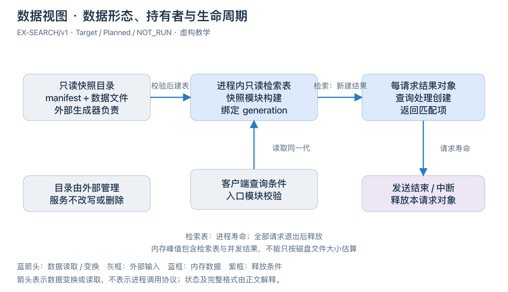

[可编辑 SVG](../diagrams/software-data-flow.svg)。

图 SW-E6 · EX-SEARCH/v1，Target / Planned / NOT_RUN。磁盘目录由外部生成器维护，服务只读。快照模块校验后构造只读检索表；每次查询读取同一 generation 的表，新建自己的结果对象。这是从文件到内存组织再到请求结果的变换，不是三个独立服务的调用图。

目录、共享表、请求结果分别属于外部管理、进程寿命和请求寿命。停止必须等请求退出才释放共享表；单个请求中断只释放自己的对象。内存预算应考虑建表峰值与并发结果，不能拿 32 MiB 文件上限直接当作进程内存上限。
<!-- STD_TEMPLATE_EXAMPLE_END -->

<!-- 在此写入本节设计正文；图表汇总结论，不替代方案、依据及边界说明。 -->

### 7.10 一致性与持久化策略

<details>
<summary>本节编写建议、规范与示例</summary>

**本节目的**：决定何种记录是事实、何时算提交，以及崩溃后恢复什么。

**必须写清楚**：状态对象的键、唯一写入者、读者、事务或提交边界、内存与持久记录关系、并发更新与冲突；丢失窗口、重放或恢复判据。

**编写规范**：区分 authoritative 与 observation、volatile 与 durable。成功回复必须满足所承诺的持久化条件，不用缓存命中证明提交。跨对象事务不成立时明确部分失败、补偿前提或限制，不默认分布式一致性。

**抽象示例**：任务终态先按所承诺的可靠性写入权威记录，再向调用方确认；若存储失败，不能只更新页面状态并宣告成功。

**完成条件**：状态变化有唯一判定位置，并发和重启都能解释，不把已发出操作等同于状态已经改变。

</details>

<!-- 在此写入本节设计正文；图表汇总结论，不替代方案、依据及边界说明。 -->

### 7.11 缓存、保留、清理与数据迁移

<details>
<summary>本节编写建议、规范与示例</summary>

**本节目的**：防止正常业务结束后仍有无界资源或不可恢复的数据变更。

**必须写清楚**：缓存键及版本、失效/逐出条件、持久数据保留、删除权限、临时产物寿命、清理失败处置；存在存储版本变化时说明迁移和回退能力。

**编写规范**：内存引用归零不等于持久备份可删；共享数据按真实所有权计数。明确期限事实和后台清理能否重做，禁止把清理过早作为未来分支的完成依赖。不可逆迁移必须单列回滚限制与恢复验证。

**抽象示例**：旧规则仍被未完成任务引用时不可因发布新版而删除；任务结束也要考虑审计与重启恢复的保留条件，不能无限保留所有副本。

**完成条件**：每类数据有可执行的保留和删除规则，异常清理不会误删其他任务或用户数据。

</details>

<!-- 在此写入本节设计正文；图表汇总结论，不替代方案、依据及边界说明。 -->


## 8. 接口设计

<details>
<summary>本节编写建议、规范与示例</summary>

<!-- 接口分类编写建议与教学例子；生成文档时按实际接口保留适用类别。
只保留真实存在的接口类别；不适用类别说明边界与 tailoring 依据。每个接口以真实函数、路由、消息或端口名为标题，下面先给完整的代码式声明，再在同一小节写输入、输出、逐条件错误、交互和验证。以下均为虚构示意：

| 可选类别 | 具体接口示例（均为虚构） | 适用条件与结果语义 |
|---|---|---|
| 软件接口 | `submit_inspection(request: InspectionRequest) -> InspectionSubmission \| InspectionError` | 实际提供函数/端点时采用；合法请求返回 `task_id=t-7`，非法请求返回 `INVALID_REQUEST` |
| 消息与数据流接口 | `frame.ready(event: FrameReadyEvent) -> DeliveryAck \| DeliveryError` | 实际跨边界发消息时采用；`sequence=42` 被接收则确认 42，队列满则显式拒绝 |
| 硬件与固件接口 | `route_table_write(index:u16, entry:RouteTableEntry) -> WriteAck \| BusError` | 实际拥有寄存器/RTL 边界时采用；写入完成握手后才可读到新表项 |
| 人机与维护接口 | `inspectctl status --task t7 -> TaskStatus \| CommandError` | 实际提供 CLI 时采用；存在任务显示 `RUNNING`，未知任务返回 `TASK_NOT_FOUND` |

接口声明中的类型名必须能直接定位到本模板的数据结构设计章或固定外部机器来源；不要只给 ID 让读者猜输入输出。完整的 `submit_inspection` 虚构示例放在软件接口节；请求、成功输出和错误载荷分别在数据结构设计章按归属定义或固定引用，不在接口章维护第二份字段表。


**以下为本层原有编写要求。**

**本节目的**：让人和 Agent 能获取完整可调用契约，而不是只有接口名和链接。

**必须写清楚**：实际软件、消息流、硬件/固件及人机维护接口的适用类别；逐接口写完提供责任、操作语义、数据类型、请求响应或事件、错误、交互与兼容，并关联目录、机器定义、实现及验证。

**编写规范**：遵循接口与数据规格映射规范：正文成员 ID ↔ interfaces 目录 ↔ 唯一机器定义 → 下游实现与验证。复用既有 OpenAPI/Schema/IDL/header 等权威，读取实际源签名；规格未定义记设计缺口，规格完整但代码缺失才写 NOT_IMPLEMENTED。

**抽象示例**：接口目录声明 prepare 的 request/response 后必须分别指到正确类型；角色互换或漏 response 不能因为 JSON 格式有效就通过。

**完成条件**：每个适用操作和类型都有完整来源，双方不需要猜参数、对象或下一步；目录检查不等于运行验证。

-->
</details>

<!-- 按适用类别逐接口成节；以真实名称作标题，ID 只作追踪，同一接口的输入、输出、错误、交互和验证留在一处。 -->

### 8.1 软件接口（适用时）

<details><summary>编写建议、规范与示例</summary>

**本节目的**：把真实函数或端点的完整可调用合同固定在一处。

**必须写清楚**：名称/签名、来源、输入、输出、错误、交互及验证。

**编写规范**：逐接口成节；字段和公共错误引用唯一权威，不另建清单。输入、输出、错误、交互与验证留在同一记录，不能拆到别章；按真实名称和固定版本核对。

**抽象示例**：同请求重放返回原任务状态，不表示新增执行。

**完成条件**：编码者能找到接口、构造调用并解释所有适用结果。

以真实限定函数名、HTTP/RPC 路由为标题，逐接口写完整合同。系统公共协议由本层或唯一委托的机制/契约定义；直属模块间接口按责任分配，模块私有 helper 不上推。已有 OpenAPI/IDL/header 保持机器权威，正文给固定基线阅读视图或精确引用。规格未定是设计缺口，规格已定但代码缺失才是未实现。无响应不等于未执行；同请求查询/重放与新业务重试的安全条件必须区分。

**抽象示例**：`POST /inspections` 返回 accepted 和 operation_id，只证明受理；同 ID 不同 payload 返回冲突错误且不新增任务。独立结果查询才能证明 completed。

</details>

#### `<真实限定函数名、签名或 HTTP/RPC 路由>`

<!-- 编写建议：以真实函数名或路由为主索引，先展示完整声明，再把各输入参数所用 Data ID、约束和失败结果逐项写出；成功及错误输出写具体类型、触发事实、状态/副作用与合法下一步。系统层定义跨责任边界的稳定语义，模块内部 helper 留给下级。 -->

<!-- 先在此放代码式完整声明：函数/端点名称(参数名: 数据结构名, ...) -> 成功数据结构名 | 错误数据结构名；使用项目实际语法、参数名和数据结构名。 -->

- **Interface/Member ID、用途、提供责任与唯一来源**

  <!-- 机器源 selector/version/revision/hash；本层拥有/继承/分配 -->
- **输入与前提**

  <!-- 参数/请求 Data/Type ID、必填/范围/跨字段、权限与校验顺序 -->
- **成功输出与保证**

  <!-- 响应/事件 Data/Type ID、accepted/effective/completed 等适用边界 -->
- **错误与合法下一步**

  <!-- 逐条件 Error ID、载荷、结果已知性、副作用与查询/等待/安全重试 -->
- **交互与生命周期**

  <!-- 调用位置、同步/异步、期限、取消、重复、并发、资源释放、版本 -->
- **实现与验证**

  <!-- 真实文件/symbol 或 Planned；完整合法与拒绝实例、V/Case/Run -->

<!-- STD_TEMPLATE_EXAMPLE_BEGIN -->
**8.1.1 `submit_inspection`（虚构异步受理接口）**

本例复用同一套虚构输入、结果和错误语义；上级或机器源已拥有的公共字段只固定引用，本层不重新分配。

```text
submit_inspection(
  request: InspectionRequest
) -> InspectionSubmission | InspectionError
```

- **Interface/Member ID、用途、提供责任与唯一来源**:
`IF-EX-SUBMIT-INSPECTION`；受理一项图像检测请求，由 `InspectionAdmission` 提供。接口和三个类型均为教学用 `Proposed` 契约；输入与成功输出字段见 §7.2 的 `InspectionRequest`（`DATA-EX-REQUEST`）、`InspectionSubmission`（`DATA-EX-SUBMISSION`），错误码和载荷见 §7.8 的 `InspectionErrorCode`、`InspectionError`（`DATA-EX-ERROR-CODE`、`DATA-EX-ERROR`）。正式项目须换成固定的机器源、版本和成员 selector。

- **输入与前提**
	* `request`：必填,类型 `InspectionRequest`。其中 `request_id` 必须是本次业务请求的稳定身份；`image_uri` 必须指向调用身份有权读取的有效图像；`policy_version` 必须指向已发布规则。先检查身份权限，再检查请求字段、图像引用和规则版本；之后以 `request_id` 原子核对已受理记录：内容相同走重放，内容不同拒绝；只有新请求才检查队列容量并创建任务。字段的类型和跨字段约束只在 §7.2 定义，此处写该接口如何使用它们。

- **成功输出与保证**：
首次受理返回 `InspectionSubmission{request_id:"req-7", task_id:"t-7", disposition:ACCEPTED}`；任务身份和请求关联已持久确定，但检测未必开始。同一 `request_id`、相同图像和规则版本的重放返回原 `task_id` 与 `disposition:EXISTING`，不新增执行；即使原任务仍在运行，也不要求先停止原执行者。

- **错误与合法下一步**：
输入字段或引用无效时返回 `InspectionError{code:INVALID_REQUEST, request_id:<原值或 null>, task_id:null}`，调用方修正请求；同一 ID 携带不同内容时返回 `REQUEST_CONFLICT`，调用方核对原请求，不换 ID 绕过；未获授权时返回 `PERMISSION_DENIED`，须先取得授权；新请求遇队列满返回 `QUEUE_FULL`，本次未受理，可稍后以同一请求身份再试。四种错误均不创建本次任务，码值含义和载荷约束由 §7.8 唯一维护。

- **交互与生命周期**：
这是异步任务的同步受理调用；成功响应不表示检测完成。受理记录对重放可见后才能返回 `ACCEPTED`。调用超时或连接中断且无有效响应时，结果是**未知**，不是 `INVALID_REQUEST` 或 `QUEUE_FULL`；只有权威 `request_id` 判重仍可用时，才允许原请求原样重放并读取原结果，不可换 ID 发起新执行。取消本次网络等待不取消已受理任务。并发同 ID 调用只能产生一个任务；请求身份保留期和兼容版本须由实际系统合同固定，本教学例子不臆造数值。

- **实现分配与验证**：
`InspectionAdmission` 负责权限/输入校验、原子判重、容量判断和任务创建；状态持有者负责后续完成状态。`V-EX-SUBMIT-01` 用合法首次请求、同 ID 同内容重放、同 ID 异内容、无权限、无效图像、队列满和响应丢失向量检查返回类型、错误码与任务数量；教学例子未执行测试，不代表真实系统通过。

本例仅示范接口记录应达到的粒度；不能把 `Proposed` 类型、示意成员名或未运行的验证项复制为项目已批准契约。
<!-- STD_TEMPLATE_EXAMPLE_END -->

### 8.2 消息与数据流接口（适用时）

<details><summary>编写建议、规范与示例</summary>

**本节目的**：固定跨边界消息和连续数据的格式与交接行为。

**必须写清楚**：消息身份、格式、确认、顺序、背压、丢失及验证。

**编写规范**：以真实 topic/流名逐接口成节，字段只引用数据结构章。把确认、背压、丢失和恢复与该流的正常及异常实例写在同一记录。

**抽象示例**：队列已满时拒绝新消息并返回可判定错误，不默默丢弃。

**完成条件**：两端能用相同关联身份解释正常与异常交付。

按实际消息、topic、队列、流或文件交换名称逐项写完；同一接口内定义格式来源、生产/接收责任、关联身份、顺序、确认、背压、丢失/重复/迟到、停启和错误。字段全集引用 §7 与唯一机器源，不复制第二套。用同一身份演练正常和边界输入。

</details>

#### `<真实消息、topic、队列或流名称>`

<!-- 编写建议：同一小节集中描述消息类型、字段来源、发送与接收条件、关联 ID、确认、顺序、重复、丢失和背压。写清异步结果何时才算已知，以及取消或迟到消息的处理，避免只写“发布事件”。 -->

<!-- 先在此放代码式完整声明：消息/流名(输入数据结构名) -> 确认或输出数据结构名 | 错误数据结构名；使用项目实际语法、参数名和数据结构名。 -->

- **Interface/Member ID、用途、提供责任与来源**

  <!-- TODO -->
- **输入输出与关联身份**

  <!-- Data/Type ID、编码、边界、确认或结果 -->
- **交互、错误与生命周期**

  <!-- 顺序、流控、超时、重复、取消、停启、释放 -->
- **实现与验证**

  <!-- 位置/状态、合法及拒绝实例、V/Case/Run -->

### 8.3 硬件与固件接口（适用时）

<details><summary>编写建议、规范与示例</summary>

**本节目的**：固定真实物理或逻辑硬件交接而不虚构设备。

**必须写清楚**：端点、方向、位宽/电气、时序、复位、错误及验证。

**编写规范**：机器寄存器或接口控制文件保持唯一权威；纯软件按 tailoring 省略。实际端点的电气、时序、错误与验证须集中在同一接口记录。

**抽象示例**：复位未完成时 READY 无效，接收端不得采样。

**完成条件**：两端能按同一约束连接并验证异常时的安全状态。

仅当软件系统确实承担设备/FPGA/固件边界时保留；纯软件系统按 tailoring 省略，不虚构 PCIe、DMA 或寄存器。每条连接在一处写端点、方向、标准版本/项目选项、位宽/电气、时钟复位、时序/握手、错误与恢复；寄存器表或接口控制文件保持唯一 authority。驱动函数作为独立的软件接口在 §8.1 定义，并以 ID 关联，不复制连接合同。

</details>

#### `<真实连接、总线、寄存器组或端口名称>`

<!-- 编写建议：仅在软件实际跨设备/固件边界时使用；给出方向、完整输入输出、握手/超时、错误映射及依赖的设备状态。位域和时序的唯一权威引用硬件/固件资料，软件系统设计写清适配责任和失败时的系统行为。 -->

<!-- 先在此放代码式完整声明：端口/连接名、方向、信号或寄存器类型/位宽、状态或错误输出；使用项目实际语法、参数名和数据结构名。 -->

- **Interface/Member ID、用途、端点与来源**

  <!-- TODO -->
- **输入输出与物理约束**

  <!-- Data/Type ID、方向、管脚/位宽/电气、时序 -->
- **交互、错误与恢复**

  <!-- 时钟复位、握手、超时、安全状态、释放 -->
- **实例与验证**

  <!-- 正常/边界时序、V/Case/Run -->

### 8.4 人机与维护接口（适用时）

<details><summary>编写建议、规范与示例</summary>

**本节目的**：在一处定义用户或维护者的实际操作接口，包括页面结构与交互、CLI 命令、反馈及安全退出；§3.6 只说明任务和功能结果。

**必须写清楚**：实际 CLI、WebUI 及维护入口的适用性；入口位置、身份、目标、输入、反馈、错误、退出及验证。WebUI 还须交付导航、共享框架、主要页面布局及重要任务流程图。

**编写规范**：按 §8.4.1 CLI、§8.4.2 WebUI 展开实际入口；没有其中一种时说明裁剪依据，不凭模板新增入口。实际页面操作或命令逐项成节，执行位置、目标选择、权限、反馈和失败出口须连续呈现。底层软件 API 和数据结构分别引用 §8.1、§7，不重定义字段或业务成功条件；CLI 与 WebUI 执行同一操作时引用同一业务契约。维护通道不能绕过共同授权和状态检查。

**抽象示例**：未知目标返回拒绝，不自动改选其他实例。

**完成条件**：非作者能找到实际页面或命令、执行代表操作、解释正常及错误结果并安全退出；§3.6 不存在另一份操作合同。

UI 页面/命令、CLI、管理页面及诊断入口均按真实名称逐项写完。写清用户任务、执行主机或页面、被控目标、身份权限、输入/默认/互斥、成功反馈、错误/退出码、超时/取消、审计、运行影响与恢复。指标口径在 §10 唯一维护。按实际需要核对状态、配置、统计、日志、自检、跟踪、受控测试及恢复入口；一种入口可承担多项任务，不为满足清单增加命令或页面。

**抽象示例**：诊断导出只作用于选定实例，返回文件身份和脱敏状态；未知实例明确拒绝，不改选其他目标。受控故障注入需可确认命中、撤销和恢复，不因设置开关就默认全部请求受影响。

</details>

<!-- 按实际入口填写下列适用分节；不适用时保留裁剪理由，不复制示例作为项目契约。 -->

#### 8.4.1 CLI（适用时）

<details>
<summary>本节编写建议、规范与示例</summary>

**本节目的**：定义实际可执行的命令及其目标、结果和安全边界，不能只列命令名。

**必须写清楚**：CLI 运行主机、工作目录或连接上下文、执行身份和目标；按真实命令给完整语法、逐参数约束、权限、底层 API 成员、输出与退出码、结果未知、超时/取消、运行影响、审计和验证。

**编写规范**：先按用户任务分组，再以真实命令名为记录标题；每条命令的语法、输入、成功、错误和退出在一处定义。只读命令连接失败不能输出正常空值；修改命令不能默认广播，须固定目标、授权、确认和生效或回滚边界。底层字段与错误码引用 §7、§8.1 的唯一来源，不复制第二份业务合同。没有 CLI 时记录 N/A、理由和 tailoring 决定。

**抽象示例**：`inspectctl task status --task t-7` 只读单个任务；任务不存在与连接失败分别给可判定错误，不能自动切换目标或返回空状态。

**完成条件**：非作者可以在指定环境构造命令，辨别命令成功与业务完成，并在拒绝、超时或结果未知后采取合法下一步。

</details>

**<真实命令名与完整语法>**

```text
<真实命令> <参数名: 数据结构名> -> <成功输出类型> | <错误输出类型>
```

- **Interface/Member ID、用途、提供责任与唯一来源**：<成员 ID、命令用途、底层 API 成员与固定基线>。
- **执行位置、目标、身份与前提**：<主机/目录/连接上下文、目标选择、权限与状态>。
- **输入与执行**：<逐参数类型、默认/互斥、校验顺序、确认与实际调用过程>。
- **输出、错误与退出**：<成功事实、可读输出、错误消息/退出码、结果未知、超时/取消与撤销>。
- **运行影响、审计与验证**：<影响范围、审计事件、正常及拒绝实例、V/Case/Run>。

<!-- STD_TEMPLATE_EXAMPLE_BEGIN -->
**8.4.1.1 `inspectctl task status`（只读命令，虚构）**

```text
inspectctl task status --task <Task ID> [--output text|json] [--timeout <秒>]
```

- **Interface/Member ID、用途、提供责任与唯一来源**：

  `CLI-TASK-STATUS`；读取单个任务的权威状态。CLI 由虚构的 `TaskCli` 提供，调用虚构的 §8.1 `QueryTask`。`TaskStatus` 与 `SystemError` 也是教学占位名，并非本模板 §7 已定义的类型；正式项目须先在自己的 §7.6、§7.8 固定这些类型及错误码的唯一来源，再在命令记录中引用，不能凭本例补出影子字段合同。

- **执行位置、目标、身份与前提**：

  操作者在已配置服务端地址的维护终端执行；`--task` 必填且只选一个任务，不允许空值代表“全部”。使用当前登录身份，需具有该任务的读取权限；连接失败不自动切换环境。

- **输入与执行**：

  - `--task`：必填任务 ID，只选一个任务；不得为空或表示“全部”。
  - `--output`：可选，`text` 或 `json`，默认 `text`。
  - `--timeout`：可选，范围 `1–30` 秒，默认 `5` 秒。

  先校验本地参数，再以相同任务 ID 调用 `QueryTask`；命令只读，不创建、取消或重试任务。

- **输出、错误与退出**：

  成功时输出任务 ID、状态和权威更新时间，退出码 `0`。任务不存在显示 `TASK_NOT_FOUND`，退出码 `4`；无权读取显示 `PERMISSION_DENIED`，退出码 `5`；连接失败或超时分别显示 `UNAVAILABLE` / `DEADLINE_EXCEEDED`，退出码 `6` / `7`，不得输出看似正常的空状态。中断查询只停止本次等待，不改变任务状态；可用同一 ID 再次查询。

- **运行影响、审计与验证**：

  无业务写入；按 §10 记录查询审计，不记录敏感任务内容。`V-CLI-STATUS-01` 检查成功、任务不存在、无权限、连接失败和超时，确认失败时没有正常状态输出。

```text
$ inspectctl task status --task t-7
Task: t-7  Status: RUNNING  Updated: 2026-09-01T10:00:00Z
$ echo $?
0

$ inspectctl task status --task missing
TASK_NOT_FOUND: task missing does not exist
$ echo $?
4
```

项目成文时应替换命令、成员 ID、类型和错误映射，并核对 §8.1 的真实 `QueryTask` 与 §7 的实际类型/错误；示例输出是预期设计，不是已运行的测试证据。
<!-- STD_TEMPLATE_EXAMPLE_END -->

#### 8.4.2 WebUI（适用时）

<details>
<summary>本节编写建议、规范与示例</summary>

**本节目的**：决定用户从哪里进入 WebUI、看到什么、怎样完成主要任务，以及界面怎样准确呈现业务事实；页面名称清单或几张效果图不能代替交互设计。

**必须写清楚**：页面导航图和稳定 Page ID、角色/任务/入口/返回；共享框架布局图和每个主要页面的布局图/线框图及逐区域行为；每个重要 UI 任务的流程图或时序图、正文与异常分支；主要动作的数据 Owner、接口成员、授权、状态反馈和验证。区分 Loading、合法 Empty、Error、Partial、Stale、无权限、冲突和结果未知，并说明跨页、跨作用域及晚到响应的处理。

**编写规范**：在本节唯一维护页面结构、主要操作与反馈；每个实际页面按 Page ID 展开，图后说明内容、操作、状态和错误。列表覆盖筛选/排序/大数据量，表单覆盖校验/确认/失败后的输入保留；重要任务说明受理与完成的区别。完整数据字段和底层 API 分别引用 §7、§8.1，不在 UI 中定义影子合同；颜色、字体和像素级控件实现留给下级。每图标注 Page ID、角色/场景和 Current/Target，保留可编辑源。没有自有 WebUI 时记录 N/A、理由和 tailoring 决定，不虚构页面。

**抽象示例**：TaskList 展示任务及更新时间，进入 TaskDetail 后返回时保留筛选；TaskCreate 校验后提交，响应丢失显示结果未知并查询原请求，而不是换 ID 新建任务。切换工作空间后旧查询响应不能覆盖新页面。

**完成条件**：新读者能结合图和正文完成主要用户任务；按钮、权限、状态、数据来源及底层合同一致，重要任务的失败和恢复出口可验证。

</details>

<!-- STD_TEMPLATE_EXAMPLE_BEGIN -->
**LLMTier WebUI 导航、框架和主要视图示例**

以下三张图收录在本模板的图例资源中，仅示范页面关系、共享布局和逐页信息分区；图中的产品名称、页面、功能与状态不是新项目的默认设计或运行证据。项目成文时应换成本项目的 Page ID、任务及实际状态。


图 EX-UI-NAV · 导航图显示主要页面的入口及抽屉归属；[可编辑 SVG 源](../diagrams/llmtier-webui-nav.svg)。


图 EX-UI-FRAME · 框架图说明导航、页头、当前页面与反馈区的层次，不是像素级视觉规范；[可编辑 SVG 源](../diagrams/llmtier-webui-frame.svg)。

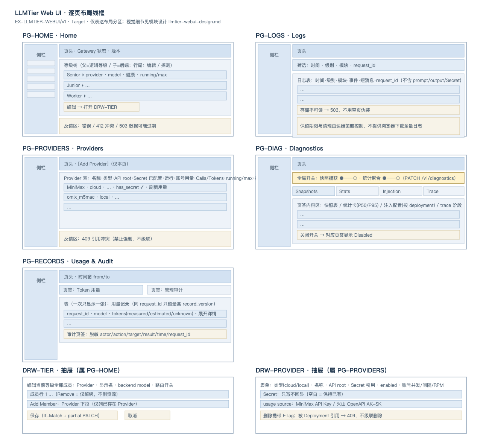

图 EX-UI-PAGES · 主要视图按 Page ID 展开内容分区；正式设计仍须逐区域说明信息、操作、状态与错误；[可编辑 SVG 源](../diagrams/llmtier-webui-page-layouts.svg)。
<!-- STD_TEMPLATE_EXAMPLE_END -->

| Page ID / 页面名称 | 用户任务/角色 | 入口/返回/上下文保留 | 布局图/可编辑源 | 负责软件对象 | 状态/验证项 |
|---|---|---|---|---|---|

| 页面/区域/动作 | 信息与权威 Owner | 查询/命令成员及固定来源 | 权限/前置条件 | 用户操作与生效/失败反馈 | 验证项 |
|---|---|---|---|---|---|

| 交互过程/图引用 | 正常路径与完成事实 | 异常/冲突/未知结果 | 输入保留与恢复出口 | 跨页/跨作用域状态处理 |
|---|---|---|---|---|

<!-- 编写建议：先给导航图和共享框架图，再逐 Page ID 展开主要页面布局与区域行为；每个重要任务配图、正常/异常正文及接口映射。 -->

#### 8.4.N `<真实页面操作或维护、诊断入口>`

<!-- 编写建议：用页面操作名、CLI 命令或诊断入口作标题，先给可调用形式，再逐参数写对象、权限、默认值、范围、反馈和错误。维护入口还要说明执行位置、控制范围、日志/审计与退出条件；不要用“提供管理界面”代替接口定义。 -->

<!-- 先在此放代码式完整声明：页面操作/CLI 命令及参数名: 数据结构名 -> 反馈数据结构名 | 错误数据结构名；使用项目实际语法、参数名和数据结构名。 -->

- **Interface/Member ID、用途、提供责任与来源**

  <!-- TODO -->
- **执行位置、目标、输入与前提**

  <!-- 页面/主机、身份、参数/控件、默认与范围 -->
- **输出、错误与交互**

  <!-- 反馈/退出码、超时/取消、作用范围、审计、恢复 -->
- **实例与验证**

  <!-- 正常及拒绝调用、V/Case/Run -->

## 9. 配置与环境管理设计

<details>
<summary>本节编写建议、规范与示例</summary>

**本节目的**：完整定义软件行为如何被配置，而非只列文件或环境变量。

**必须写清楚**：配置来源、优先级、Schema、默认值、作用域、修改权限、验证、生效方式、版本兼容、秘密处理与回退。区分产品配置、运行配置及用户业务数据。

**编写规范**：逐项说明唯一来源与覆盖顺序，不能新增并行配置路径绕过现有规则。字段在 §8 保持权威，变更过程在 §6.3，本文确定选择和生效政策；无在线修改就说明部署或重启生效。

**抽象示例**：命令行覆盖文件只在产品明确允许的选项上成立；秘密不写进普通配置导出，当前生效值不从磁盘最近修改时间猜测。

**完成条件**：操作者和实现方对同一组输入能得到同一生效配置，缺失、冲突和非法值不会静默变成另一行为。

</details>

<!-- 在此写入本节设计正文；图表汇总结论，不替代方案、依据及边界说明。 -->

### 9.1 配置来源、校验与生效范围

<details>
<summary>本节编写建议、规范与示例</summary>

**本节目的**：消除默认值、覆盖和部分发布造成的不确定行为。

**必须写清楚**：文件/参数/环境/服务等已授权来源、优先级、必填与默认规则、跨字段约束、目标实例、候选/安装/激活版本、重启需求和旧任务处理。

**编写规范**：每个关键配置定义校验者、校验时机、生效点、观测确认与失败行为。多来源要有唯一合并结果，不默默忽略未知字段；只适用于一个实例的选项不能被解释成全局原子切换。

**抽象示例**：调整并发上限时说明已运行任务是否保留、超额新请求怎样处理，以及哪个指标证明新值被使用；保存文件成功不能替代生效确认。

**完成条件**：可从配置输入推导真实运行行为，部分失败与版本不兼容有可执行处置。

</details>

| Config/Member ID | 来源 / 优先级 / 权限 | 校验 / 默认 / 冲突 | 作用域 / 生效点 | 在途任务 / 回退 / 确认 |
|---|---|---|---|---|


## 10. 可靠性、维护与升级

<details>
<summary>本节编写建议、规范与示例</summary>

**本节目的**：确定运行中怎样识别问题、定位责任、恢复服务并保留用户数据。

**必须写清楚**：故障模型、可用性与数据保证、日志统计、诊断自检、升级回滚和维护窗口；软件故障与外部依赖失败分别说明。

**编写规范**：本章维护运行保证和判定语义，§8.4 维护访问接口，§6 维护端到端过程，§12 使用这些能力验证。不能用监控系统名称代替故障处理设计，也不能用自动重启掩盖数据丢失。

**抽象示例**：进程监控能发现退出，却不能发现转换规则错误；需要设计业务结果判据和关联记录，重启后还要判断在途任务结果。

**完成条件**：每类关键故障能被发现、定位到责任边界并安全处置，恢复声称有明确条件。

</details>

<!-- 在此写入本节设计正文；图表汇总结论，不替代方案、依据及边界说明。 -->

### 10.1 故障模型与恢复保证

<details>
<summary>本节编写建议、规范与示例</summary>

**本节目的**：把异常处置建立在真实故障假设和安全前提上。

**必须写清楚**：过载、超时、失联、进程退出、存储不可用、错误配置等适用故障；影响范围、检测依据、拒绝/降级/停止/恢复策略及丢失窗口。

**编写规范**：区分 fail-stop 与仍可能执行的失联情况；重试需要旧执行安全和副作用条件，不能把超时当失败终态。副本、高可用或熔断不是必填机制，若采用必须解释能覆盖和不能覆盖的故障。

**抽象示例**：存储不可用时可以拒绝需要持久确认的写业务，而保留允许的只读入口；这项降级须符合产品范围，不允许返回虚假写成功。

**完成条件**：故障假设与运行拓扑一致，每个恢复入口不会同时保留两个有效写入者。

</details>

<!-- 在此写入本节设计正文；图表汇总结论，不替代方案、依据及边界说明。 -->

### 10.2 统计、日志与故障定位

<details>
<summary>本节编写建议、规范与示例</summary>

**本节目的**：让维护人员能从现象追到请求、对象和阶段，而非只能看到错误数量。

**必须写清楚**：指标 ID、单位、分母、窗口、实例/任务/版本关联、计数与重置条件；日志事件、级别、上下文、留存、脱敏及采样；故障定位的观察与判断顺序。

**编写规范**：累计、区间、瞬时和分位数口径分开，聚合去重且保持故障域和代次；错误日志关联原始操作和最终清理结果。说明缺日志或采样意味着什么，不把无记录当作无故障；证据查询不得泄漏秘密。

**抽象示例**：超时统计需区分排队、执行、回复阶段；重启后的计数不能直接与旧代累计相加。用同一任务标识关联用户超时与后台最终结果。

**完成条件**：从一个代表故障能选对指标和日志并定位阶段，统计口径能用于告警与测试且前后一致。

</details>

| 指标/事件 ID | 单位 / 窗口 / 分母 | 对象与版本关联 | 生成 / 聚合 / 重置 | 查询 / 留存 / 脱敏 | 故障判断与验证 |
|---|---|---|---|---|---|


### 10.3 自检与诊断设计

<details>
<summary>本节编写建议、规范与示例</summary>

**本节目的**：定义检查什么、经过哪些真实路径，以及怎样退出恢复。

**必须写清楚**：检查项目与覆盖目标、前提和依赖顺序、真实或替代路径、非破坏/破坏性范围、超时、结果汇总、跳过条件、残留与恢复。

**编写规范**：从故障模型反推自检项目，不仅列“数据库、网络、磁盘”。检查链应明确输入施加点、观测点及是否覆盖真实业务依赖。保留首个失败，区分 PASS/FAIL/NOT_RUN/不适用；可达性自检不能证明业务正确。

**抽象示例**：写读探针只能在独立测试命名空间执行，校验回读后清理；没有权限执行时记录未执行，不凭服务端口可达宣告持久化链路通过。

**完成条件**：每个自检有可复现的判断依据和退出清理，失败与无权限不会混成通过。

</details>

<!-- 在此写入本节设计正文；图表汇总结论，不替代方案、依据及边界说明。 -->

### 10.4 升级与回滚

<details>
<summary>本节编写建议、规范与示例</summary>

**本节目的**：保证软件、配置和数据版本能够以设计允许的组合切换。

**必须写清楚**：版本矩阵、包/配置/数据迁移顺序、停止或并存条件、在途任务、切换点、健康确认、回退触发及不可逆限制。

**编写规范**：区分 installed、active、verified。回滚代码不代表能回滚已迁移数据，必须设计备份/恢复或明确禁止降级的条件。复用发布和操作文档的步骤权威，本章保留系统决策、保证和恢复边界。

**抽象示例**：新版本写入旧版无法读取的数据后，不允许只替换可执行文件恢复服务；若需数据恢复，应定义业务停顿和丢失窗口并验证。

**完成条件**：允许与拒绝的版本组合清楚，失败后不会用不兼容程序继续写用户数据。

</details>

<!-- 在此写入本节设计正文；图表汇总结论，不替代方案、依据及边界说明。 -->

## 11. 性能、容量、扩展与兼容性

<details>
<summary>本节编写建议、规范与示例</summary>

**本节目的**：从负载推导架构和预算，不用漂亮数字掩盖作用域或资源峰值。

**必须写清楚**：负载分布、并发/排队、延迟路径、吞吐瓶颈、CPU/内存/存储/网络、恢复和管理开销、余量，以及支持的扩展与版本组合。

**编写规范**：每项数字注明单位、配置、作用域和 Modeled/Simulated/Measured；MiB/GiB 与供应方十进制单位不可混算。区分逻辑共享和实际副本，设计上限与实测能力分开；推导落到 §3.4 的分配。

**抽象示例**：输入和输出同时驻留时，峰值不等于二者较大值；并发转换还需要中间表示、控制记录和恢复预留。线程翻倍不能直接推出吞吐翻倍。

**完成条件**：资源预算闭合，瓶颈与超限行为可解释，声明的支持范围有条件和证据等级。

</details>

<!-- 在此写入本节设计正文；图表汇总结论，不替代方案、依据及边界说明。 -->

### 11.1 预算、瓶颈与扩展边界

<details>
<summary>本节编写建议、规范与示例</summary>

**本节目的**：验证各子系统组合后不会超额或破坏状态归属。

**必须写清楚**：代表负载与最坏合理场景、关键路径、各对象预算、共享池及峰值重叠、排队/背压/拒绝策略；扩容单元、上限、路由、状态和故障域变化。列出客户端、服务/库、接口、配置及数据格式的允许和禁止版本组合，以及平台相关限制。

**编写规范**：串行时延与并行关键路径按真实关系计算，不能把平均延迟相加当尾延迟保证。扩容只设计产品允许的方式；单机工具可明确不支持横向扩展，不为完整性新增分布式架构。兼容矩阵区分设计允许、已实现与已验证；未知组合明确拒绝或按已定规则降级，不写笼统的“向后兼容”。升级与数据迁移过程引用 §10.4 和 §7.7，不在矩阵中另定义一套切换机制。

**抽象示例**：转换工作端从一个扩为两个时，说明输入与结果状态如何路由、共享存储是否成为瓶颈，以及部分工作端失效时哪些任务结果未知。

**完成条件**：达到容量边界前后都有明确行为，局部性能和端到端性能验证分开。

</details>

| 资源/指标 / Constraint ID | 负载及作用域 | 公式 / 副本与峰值 / 余量 | 对象分配 / 瓶颈 | 超限 / 扩展边界 | 证据等级 / 验证 |
|---|---|---|---|---|---|

| 客户端/服务/库及平台组合 | 接口/配置/数据版本 | 允许条件 / 不支持或降级行为 | 设计/实现/验证状态 | 升级与恢复限制 / Case及证据 |
|---|---|---|---|---|


## 12. 可测试性与验收设计

<details>
<summary>本节编写建议、规范与示例</summary>

**本节目的**：在系统阶段确定可验证能力和执行条件，使重要保证能被实际检查。

**必须写清楚**：主要测试方法、输入构造、独立 Oracle、覆盖对象、受控故障、环境部署复位、并发隔离、自动化、证据与验收关系。未实现、未执行和不适用分别记录。

**编写规范**：验证项不是用例、环境或执行记录本身，按要求→设计验证项→Case→环境→Run 关联。测试设计使用 §8.4 的控制入口和 §10 的观测，不另造测试协议；所有适用能力及全部必需消费者进入分母。

**抽象示例**：转换结果可用独立解析器及语义样本判定，不能拿被测转换器自己的返回成功当 Oracle。只测一个小文件也不能关闭异常、兼容和容量要求。

**完成条件**：每个关键保证有可行测试方法和环境条件，局部通过不能代替系统组合验收。

</details>

<!-- 在此写入本节设计正文；图表汇总结论，不替代方案、依据及边界说明。 -->

### 12.1 主要测试方法与结果判定

<details>
<summary>本节编写建议、规范与示例</summary>

**本节目的**：确定如何构造输入并客观判定结果，而不仅罗列单元、集成、系统测试。

**必须写清楚**：代表/边界/非法输入、随机或固定数据、参考模型、断言、容差、非确定结果的统计条件；功能、性能、安全和恢复分别有判据。

**编写规范**：Oracle 独立于被测实现，记录数据与规则版本。涉及 LLM 时说明如何构造 prompt、控制模型/参数/上下文，并检查返回结构、语义、工具调用和不允许的副作用；重复次数与容差有依据，不强求文本逐字相同。

**抽象示例**：对模型生成的结构化回答，先验证 Schema，再用独立任务判据检查语义；格式合法不能代表任务正确，人工评估也要有固定准则。

**完成条件**：给定一个用例能回答输入从哪来、预期由谁决定、如何判失败及结果如何复现。

</details>

<!-- 在此写入本节设计正文；图表汇总结论，不替代方案、依据及边界说明。 -->

### 12.2 受控故障与异常收口验证

<details>
<summary>本节编写建议、规范与示例</summary>

**本节目的**：验证失败中的安全和清理，不仅验证能触发一个错误。

**必须写清楚**：故障点、适用请求/实例/版本、命中确认、持续范围、自动失效或撤销、恢复确认；测试停止后残留如何检测。

**编写规范**：区分真实路径、替代依赖、注入与环回，替代依赖的接口边界在 §8.4 定义。每次演练分别检查结果已知性、访问安全、操作终态、资源释放、重新准入。有副作用且涉及取证与收口的机制演练“证据无法恢复但已安全停止”；只读机制检查中断、迟到响应与临时资源。

**抽象示例**：注入回复丢失后检查后台是否继续写、是否可查询原任务、停止和清理是否有合法出口；不通过直接修改内部状态让测试假装完成取证。

**完成条件**：注入实际命中可确认，撤销成功可证明，异常验证不要求项目新增不存在的业务机制。

</details>

<!-- 在此写入本节设计正文；图表汇总结论，不替代方案、依据及边界说明。 -->

### 12.3 测试环境快速部署与复位

<details>
<summary>本节编写建议、规范与示例</summary>

**本节目的**：让测试可重复建立已知初始状态，而不是依赖某台手工配置的机器。

**必须写清楚**：可执行部署入口或明确计划位置、依赖版本、样本数据、配置、账号、就绪检查；首次部署、日常重建、软复位与完整复位的差别及耗时依据。

**编写规范**：优先复用已有构建和部署方式，复位明确清哪些对象、保留哪些用户数据和证据。镜像启动成功不是业务就绪；依赖不可用要失败或标 NOT_RUN，不悄悄切到另一 backend。

**抽象示例**：每次转换测试使用独立临时输入和输出目录，复位先确认工作端停止，再清该任务资源；不能删除整项目目录来获得干净环境。

**完成条件**：新执行者可按记录建立可测状态，复位不会覆盖用户数据且前后状态可检查。

</details>

<!-- 在此写入本节设计正文；图表汇总结论，不替代方案、依据及边界说明。 -->

### 12.4 并发测试与环境隔离

<details>
<summary>本节编写建议、规范与示例</summary>

**本节目的**：使并行测试不互相污染，也不掩盖真实共享资源问题。

**必须写清楚**：任务/租户/命名空间/端口/目录/数据库等实际隔离键，资源额度、共享依赖、锁与需要串行的操作；故障注入和复位的影响域。

**编写规范**：以实际运行边界设计隔离，不假设不同用例名意味着存储已隔离。无法隔离的全局配置、设备或复位域安排串行并说明调度约束；不为测试虚构生产多租户架构。

**抽象示例**：两个转换用例的输出目录不同，但若共用可变规则文件仍可能互相干扰；可使用固定快照或串行该变更测试，记录采用哪种办法。

**完成条件**：每个测试能定位自己的资源，取消、注入与清理不命中另一个正在运行的用例。

</details>

<!-- 在此写入本节设计正文；图表汇总结论，不替代方案、依据及边界说明。 -->

### 12.5 自动化、复现与验证覆盖

<details>
<summary>本节编写建议、规范与示例</summary>

**本节目的**：把验证设计转成可自动执行并能回溯证据的任务。

**必须写清楚**：准备→就绪→执行→判定→保存→清理的自动化入口、超时与退出码、用例/数据/版本、日志与产物位置、重跑关联和覆盖分母。

**编写规范**：保存首个失败与清理失败，不以重跑通过覆盖首次失败。区分设计验证项、可执行用例、环境要求、实际 Run 和接受结论；NOT_IMPLEMENTED、NOT_RUN、BLOCKED 与不适用分别解释。双方局部通过后仍核对端到端语义。

**抽象示例**：接口生产者和消费者各自通过契约测试后，再以固定版本运行一次真实交接；只用模拟消费者时记录覆盖边界，不能关闭全部消费者义务。

**完成条件**：每项适用目标能追到证据或具体缺口，自动化失败退出不会报告整体通过。

</details>

| Target/Constraint / 被测对象 | 设计验证项及方法 | 全部必需参与方 / Case | 环境 / 初始状态 / 隔离 | Run / 结果 / 原始证据 | 未覆盖与组合验收 |
|---|---|---|---|---|---|


## 13. 信息安全架构

<details>
<summary>本节编写建议、规范与示例</summary>

**本节目的**：将安全要求落实为软件边界和执行机制，不只引用安全管理计划。

**必须写清楚**：资产、入口、信任边界、身份认证授权、敏感数据与凭据、管理调试面、依赖与更新信任、威胁及验证责任。

**编写规范**：按实际资产与入口筛查，离线或单用户不等于无风险；没有登录也要处理文件、插件、命令及权限边界。威胁关联具体处理点和拒绝行为，不能只写采用加密或最小权限。

**抽象示例**：不可信文档解析可能消耗资源或触发危险内容；系统须选择隔离与资源限制，并解释返回结果不能暴露其他用户文件。

**完成条件**：主要威胁有责任对象和缓解/验证位置，安全筛查未做不能标不适用。

</details>

<!-- 在此写入本节设计正文；图表汇总结论，不替代方案、依据及边界说明。 -->

### 13.1 身份、权限、数据与供应链边界

<details>
<summary>本节编写建议、规范与示例</summary>

**本节目的**：追踪一次操作从用户身份到实际访问的安全决策。

**必须写清楚**：主体和目标、身份传播、授权点、执行点、凭据取得/更新/撤销、加密与脱敏、调试限制、依赖/构建产物/插件来源和升级验证。

**编写规范**：授权与使用目标必须一致，路径、重定向或异步执行不能绕过检查。日志不含秘密，诊断导出也受权限控制；更新真实性与兼容性分别验证，签名通过不代表业务适配正确。

**抽象示例**：允许读取一个输入文件不等于允许访问该目录全部文件；转换工作端收到的访问能力要限定目标与寿命，停止后旧能力不能继续写。

**完成条件**：每条高风险路径的检查、执行与撤销可定位，安全用例有明确非法输入和预期拒绝。

</details>

<!-- 在此写入本节设计正文；图表汇总结论，不替代方案、依据及边界说明。 -->

## 14. 开发、构建与交付设计

<details>
<summary>本节编写建议、规范与示例</summary>

**本节目的**：把软件方案落实到可重复构建和可识别的交付物，不把工具清单当开发设计。

**必须写清楚**：语言/运行时和关键依赖的选择依据、代码与对象映射、构建工具/版本、生成代码来源、包/镜像/库等交付物、安装启动入口及兼容。

**编写规范**：复用项目现有仓库和构建方式；计划路径写 Planned，缺实现写 NOT_IMPLEMENTED，不猜真实 symbol。生成契约产物必须可从唯一源再生，手工修改生成文件不是独立 authority；不要求普通系统设计内核或引入容器。

**抽象示例**：转换核心库和命令行入口可同仓库构建，分别给出交付物及其依赖版本；设计声明可离线安装时，构建与安装不能隐含公网下载。

**完成条件**：开发者知道在哪里实现、如何构建、交付什么和怎样验证安装，软件版本与数据/接口组合一致。

</details>

<!-- 在此写入本节设计正文；图表汇总结论，不替代方案、依据及边界说明。 -->

### 14.1 构建复现、依赖与发布物

<details>
<summary>本节编写建议、规范与示例</summary>

**本节目的**：使一次交付能追溯源码、工具链和输入，而不是只保存可执行文件。

**必须写清楚**：源码基线、锁定依赖、构建参数、生成步骤、制品身份/hash、配置样板、安装升级入口和验证记录；第三方许可及来源风险按实际义务处理。

**编写规范**：区分构建可重复、内容可追溯与已验证发布。构建和测试命令写明 cwd、输入和退出判据，秘密不进入制品。发布操作按项目已有 Gate 执行，本模板不授权部署、外部发布或运行激活。

**抽象示例**：同一版本的库和 CLI 必须指向相同接口基线；本地构建成功不能代替目标平台的安装与启动验证。

**完成条件**：交付物能追到固定输入，离线/跨平台等声明具有检查方法，没有凭构建成功声称已发布。

</details>

<!-- 在此写入本节设计正文；图表汇总结论，不替代方案、依据及边界说明。 -->

## 15. 实现计划与集成顺序

<details>
<summary>本节编写建议、规范与示例</summary>

**本节目的**：把系统设计形成可分工的实现任务，避免下游互相等待未定义的协议。

**必须写清楚**：按能力的实现阶段、依赖、共享契约冻结点、可并行范围、集成顺序、验证入口/出口、Owner 与剩余风险。

**编写规范**：接口语义、错误行为和测试向量评审后，两端可并行实现；分别通过契约测试后集成，端到端验证后关闭系统目标。不要求生产者和消费者尚未开发前就通过真实实现测试。计划不代替产品设计决定。

**抽象示例**：先确定配置交接语义与测试向量，再分别实现配置模块和处理子系统；联调需验证版本确认及超时，不只检查双方各自的单元测试。

**完成条件**：每阶段有可执行输入和产物，依赖不循环，未决项仅阻塞真正受影响的任务。

</details>

| 阶段 / 能力 | 输入与前置依赖 | 任务 / 承接对象 / Owner | 交付物 | 局部及集成出口 | 未决项 / 影响 |
|---|---|---|---|---|---|


## 16. 设计决策、风险与下游承接

<details>
<summary>本节编写建议、规范与示例</summary>

**本节目的**：汇总设计未闭合部分与正式交接关系，不把待定登记当完成。

**必须写清楚**：已选方案及依据、被否决选项、风险与假设、尚缺的事实/决定、关闭条件及责任；下游设计固定输入和验证义务。

**编写规范**：正文各节的决定唯一维护，本章引用稳定 ID 和影响。逐节问：实际决定什么、依据是什么、下游必须遵守什么、还能自行决定什么、怎样检查承接。回答来自正文方案，不重复五句口号；格式工具 PASS 不证明设计质量。

**抽象示例**：若停止安全依赖外部执行器的确认能力，而能力尚未确定，应列明需取得的接口证据和影响；不能仅把该行标为 PENDING 然后批准完整恢复方案。

**完成条件**：未决项有具体下一步，已完成与未实现/未验证区分，风险没有藏在参考链接里。

</details>

<!-- 在此写入本节设计正文；图表汇总结论，不替代方案、依据及边界说明。 -->

### 16.1 下级设计与组合验收任务

<details>
<summary>本节编写建议、规范与示例</summary>

**本节目的**：明确软件子系统和直属模块接到的不是一张名字表，而是可设计的输入。

**必须写清楚**：对象及父身份、Document ID/计划文件名、输入版本/hash、Constraint/接口成员 ID、预算、自由度、局部验证及系统组合验收接收方。

**编写规范**：子系统按 design.subsystem 完成内部概要再分软件模块；直属模块按 design.definition，当前不递归子系统。以 §3.4、§3.2 和 §12.5 的唯一记录建立关联，不重复分配或创造平行 authority。

**抽象示例**：处理子系统接收发布前检查的保证及全部消费者清单，内部解析算法可自行选择；它的用例通过后仍须由软件系统验证与配置入口和结果展示的组合。

**完成条件**：所有直属对象都能开工或明确指出缺输入；下级局部通过不会自动关闭软件系统目标。

</details>

| 对象 ID / 父对象 | Document ID / 模板 / 文件名 / 状态 | 固定输入 / Constraint / 接口 | 自由度 / 不可改变 | 局部用例 / 组合义务 / 接收方 | 缺口与反馈 |
|---|---|---|---|---|---|


## 附录 A. 设计输入、适用性与派生关系

<details>
<summary>本节编写建议、规范与示例</summary>

**本节目的**：固定本稿依赖的事实和裁剪范围，保证正文既通用又不空泛。

**必须写清楚**：需求、父设计、外部契约、已有实现和环境证据的固定基线；顶层/领域模式、条件章节及理由；视图与实现/验证状态规则。

**编写规范**：每图注明 Current/Target/Transitional、适用配置和图例，未来对象与当前对象样式区分；能力注明 Planned/Implemented 及独立验证状态。条件信息是否适用由责任事实决定，删合信息项按 tailoring_ref 和已批准决定记录，不以缺资料当 N/A。普通软件无硬件自研责任，不保留板卡/FPGA/制造空章节。

**抽象示例**：CLI 工具不适用图形页面，但 §3.6.2 仍说明用户任务、§8.4.1 定义命令与反馈；没有持久化时 §7.6 仍说明内存状态，不因无数据库删掉恢复边界。

**完成条件**：所有条件项都有事实依据，遗漏与不适用可区分；项目不主动跟随 STD 或模板升级。

</details>

<!-- STD_TEMPLATE_EXAMPLE_BEGIN -->
派生来源：本模板从总体系统设计 `design.system` 8.3.0 的通用设计方法派生，
输入提交 `dead7e7f64f97e87f096dadc2a790414185adb47`。独立模板 `design.software-system` 初版 0.1.0，0.2.0 补充逐重要流程图文核对与完整样稿，0.3.0 在原章节内补齐六类图文示例，当前 0.3.1 明确正文与编写过程隔离，
不修改或替代原总体模板。项目实例只固定自己采用的 Template ID、Template Version 和模板哈希；
STD 版本只在项目采用记录维护。下表说明方法继承，不是要求项目再维护另一份总体系统稿。

| 总体模板信息来源 | 本模板承载 | 调整理由 |
|---|---|---|
| §1–4 概览、产品、组成和功能 | §1–4（功能在 §3.6） | 先说明产品，再形成软件总体、功能与直属组成 |
| §7 软件实现、§3.3 物理逻辑映射 | §3.1–3.2、§4–5、§9、§14 | 软件成为主体，架构前置，概要、运行、配置与构建分开 |
| §5 重要过程 | §6 | 保留启动、业务、配置、停止与异常闭环 |
| §9–10 数据与接口 | §7–8 | 数据/接口 authority 与精确机器映射保留 |
| §11–14 维护、性能、测试、安全 | §10–13 | 保留可执行设计方法和条件判断 |
| §16–17 实现、决定与下游承接 | §15–16 | 分配到软件子系统及直属模块 |
| §6、§8、§15 硬件/专用处理/物理工程 | §2.1、§5.3、§8.1 的外部依赖 | 不设计板卡和 FPGA 内部，只说明真实依赖及失效边界 |

<!-- STD_TEMPLATE_EXAMPLE_END -->

| 条件信息 | 判断依据 | 不适用时仍需说明 |
|---|---|---|
| 图形页面 | 是否拥有 Web/桌面等图形入口 | CLI/API/库的实际使用流程 |
| 多实例及扩展 | 产品是否承诺多实例运行或扩容 | 单实例并发、资源上限及不支持条件 |
| 持久化及迁移 | 是否拥有持久状态或数据版本变化 | 内存/临时文件与重启丢失边界 |
| 在线配置/升级 | 是否承诺在线切换 | 重启/离线步骤、停止保证及兼容 |
| 取证封结 | 有副作用、取证和资源收口义务 | 只读的中断、迟到响应和临时资源 |
| 安全控制 | 按全部资产及入口逐项筛查 | 无某项控制的理由，不豁免安全筛查 |

| 输入 Document/来源 | 版本/commit/hash | 适用条款 / 决定状态 | 实际内容与缺口 |
|---|---|---|---|

| 信息项 | keep/simplify/omit / 理由 | 替代位置 | Tailoring Document/Decision / 批准状态 |
|---|---|---|---|


## 附录 B. 文档控制、修订与交付检查

<details>
<summary>本节编写建议、规范与示例</summary>

**本节目的**：把文档身份、来源和复审记录放在文末，保持短封面与可追溯性。

**必须写清楚**：作者、authority、创建时间、采用模板信息、来源路径和修订影响；正文封面、metadata 和接口目录文档身份一致。

**编写规范**：单份文档只追踪所采用模板版本和哈希，用户未要求时不检查升级。Git commit 是外部不可变证据，不伪造包含本文自身的哈希；文档 Approved 不推导实现完成或 Runtime Activation。保密项目参考不进入通用示例。

**抽象示例**：调整并发预算应列受影响 Constraint、子系统和用例，不把全篇版本号变化当作所有能力已重新验证。

**完成条件**：正文折叠帮助后仍能独立阅读，来源与状态一致；关键未决项没有被格式 PASS 遮盖。

</details>

<!-- STD_DOCUMENT_CONTROL_BEGIN -->
| 文档字段 | 值 |
|---|---|
| Authority | `{{authority}}` |
| Authors | {{authors}} |
| Created Date | `{{created_at}}` |
| Template Conformance | `{{template_conformance}}` |
| Tailoring Reference | {{tailoring_ref}} |
| Migration Map Reference | {{migration_map_ref}} |
| Repository | `{{source_repository}}` |
| Canonical Path | `{{source_path}}` |
| Supersedes | {{supersedes}} |

> Reviewer、Approver、Approval Date 和 Release Tag 在进入相应状态时填写，不伪造审批。
<!-- STD_DOCUMENT_CONTROL_END -->

| 文档版本 / 日期 | 变更和设计影响 | 作者 / 评审记录 |
|---|---|---|

- [ ] 开篇可独立解释产品、输入输出、工作原理与边界。
- [ ] 已逐段检查正文性质；图注、章节开头和新增段落无编辑指令或生成过程残留，必要图例与视图边界保留，结构 PASS 未替代内容评审。
- [ ] 每个直属对象有实际职责、概要原理、共同约束和下级自由度。
- [ ] 设计问题已有选定方案、依据和正常/失败推演；职责表只是结论汇总，无口头补充复演的断点已回写或明确保留为设计缺口。
- [ ] 静态组成、运行载体、过程与数据流没有混成一幅无语义的框图。
- [ ] 正常及代表失败可逐步推演，所有关键条件有事实来源和合法出口。
- [ ] 公共接口可调用且映射完整，文档、目录与机器定义身份一致。
- [ ] 日志、统计、自检、维护命令定义到作用域、判定和退出。
- [ ] 预算、状态、安全、配置及兼容跨章节一致。
- [ ] 测试方法、部署复位、并发隔离、自动化和全部参与方覆盖已设计。
- [ ] 所有适用节均能回答决定、依据、承接约束、自由度及检查方法；未闭合项明确保留。

<!-- STD_TEMPLATE_EXAMPLE_BEGIN -->

---

**完整写法示例｜只读检索服务的启动与恢复（含流程图）**

以下是可直接阅读的正文样稿，不是另一份填写清单。全部对象与参数均为虚构：EX-SEARCH/v1，
Target / Planned / NOT_RUN。这里只展开一个重要过程，未声称是一份完整系统设计。
完整判据及下游检查见[配套样稿](../../docs/examples/software-startup-design-example.md)；
本段是同一方案的节选，项目不能照搬其单进程、快照格式或恢复政策。

**用途与方案**

用户通过 API 查询离线生成的目录快照，一次查询的结果必须来自同一份完整快照。本版本在启动
时加载数据，不在线建索引，也不热切换。软件采用一个进程，由启动协调模块组织快照模块和入口
模块：先检查数据并建立只读内存表，再绑定业务端口。这样，客户端一旦能够提交查询，使用的数据
就已经确定；代价是加载期间不能通过业务 API 查询启动进度，部署工具需读取进程输出。

部署者指定 snapshot_dir 和 listen_address。快照目录在整个进程寿命内保持只读、不原地修改；
清单记录格式版本、generation、文件路径和 SHA-256。快照模块从实际读取的字节计算哈希，并
检查格式、路径边界和大小限制；只有全部成功才返回内存表及 generation，不能用“目录存在”
代替“数据可查询”。这些是本例选定的输入交付方式，实际项目应引用自己的唯一格式契约。

**过程图**

图 E-1：P-START 的冷启动与重启共用路径，EX-SEARCH/v1，Target / Planned / NOT_RUN。
矩形是执行方及动作，菱形是判断，箭头表示执行顺序而非物理连接；“否”分支表示失败出口。
F1 是同一清理动作，不是新增服务。外部超时监督 W1 可中断启动阶段，并非主路径的后继步骤。

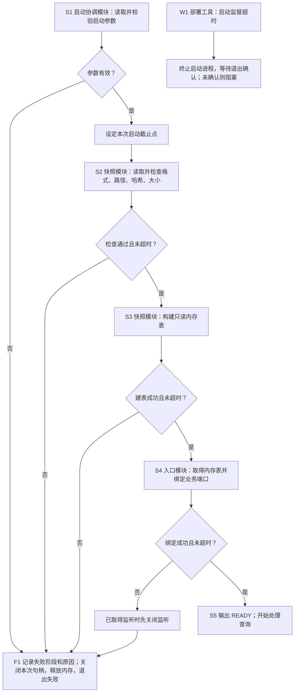

**正常路径及就绪判据**

S1 校验输入后设定单调时钟截止点，本例分配 5 s 启动预算。S2 按有界块读取，S3 按批次建表，
每次返回后检查剩余预算；文件总量上限为 32 MiB。这两个数字是教学设计目标，不是实测结论。
S3 返回成功后，S4 才能绑定指定端口；绑定成功且尚未超时，S5 才输出 READY(generation,
listen_address) 并接收业务请求。就绪依赖“完整数据检查通过”和“业务入口已取得”两项事实，
不是只看进程存在或日志出现“初始化完成”。

例如指定 g7 快照、两个文件共 8 MiB，全部检查通过且端口空闲，执行沿 S1–S5 完成。随后查询
只使用这张 g7 内存表，不再从磁盘混读另一代数据。快照内存结构可由下游选择，但不能改变
先校验后开放的顺序，也不能在相同进程里偷偷改用另一个目录。

**失败与恢复**

若第二个文件哈希不符，S2 直接进入 F1，不绑定端口；若端口被占用，S4 进入 F1，不自动换端口。
F1 记录失败阶段及原因，清理本次取得的句柄和内存后非零退出，不删除快照或其他进程资源。
操作者修复输入或端口冲突后，重新从 S1 发起，而不是从失败步骤继续一张可能不完整的内存表。

应用内期限检查不能保证中断一个阻塞的系统调用。因此部署工具独立等待最多 10 s：限时内收到
本次进程的 READY 就结束启动监督，否则触发 W1，终止进程并等待退出确认。没有退出确认就保持
阻塞，不启动第二份进程；期限后才到达的 READY 不撤销终止。这是明确的监督与退出行为，不以
“超时后安全处理”略过执行责任。5 s/10 s 的目标仍需在实际介质和部署环境验证。

若进程在 S3 崩溃，尚无业务准入；确认旧进程退出后，重新启动要完整校验并建表。前次请求没有
持久任务可恢复，断开的调用由客户端决定是否重新发起。本例没有数据写入副作用，因此不涉及写入
回滚；有副作用的系统必须另行设计在途结果、旧写入权和重复执行条件，不能套用这个结论。

**如何检查这节是否写清楚**

| 代表输入 / 故障 | 图中路径 | 可检查的设计结果 |
|---|---|---|
| g7 合法且端口空闲 | S1→S2→S3→S4→S5 | 绑定前不接受业务，绑定成功后报告同一 g7 |
| 数据哈希不符 | S1→S2→F1 | 不开放端口，不改输入，输出原因并退出 |
| 端口已占用 | S1→S2→S3→S4→F1 | 不换端口，不报告 READY，释放已建内存表 |
| 启动阻塞超过外部上限 | W1→终止→退出确认 | 有确认才判清理完成，无确认则阻塞 |
| 建表时崩溃，确认退出后重启 | 新一次 S1–S5 | 重新校验和建表，不沿用前次不完整状态 |

以上仅为设计推演，实际测试尚未执行。后续组合测试检查监听端口、进程输出、退出状态及输入文件
不变，并记录环境和 Run；不能只搜一行“成功”。好的正文让读者沿这些输入独立推出行为，
而不是要求读者自行补齐“加载配置→恢复状态→开放服务”之间省略的设计。

<!-- STD_TEMPLATE_EXAMPLE_END -->
