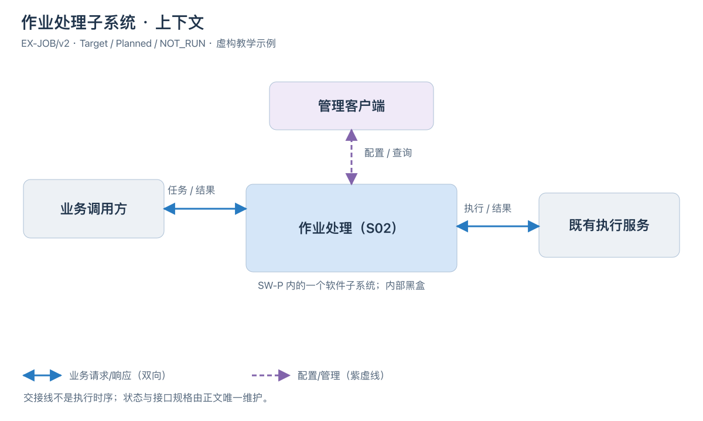
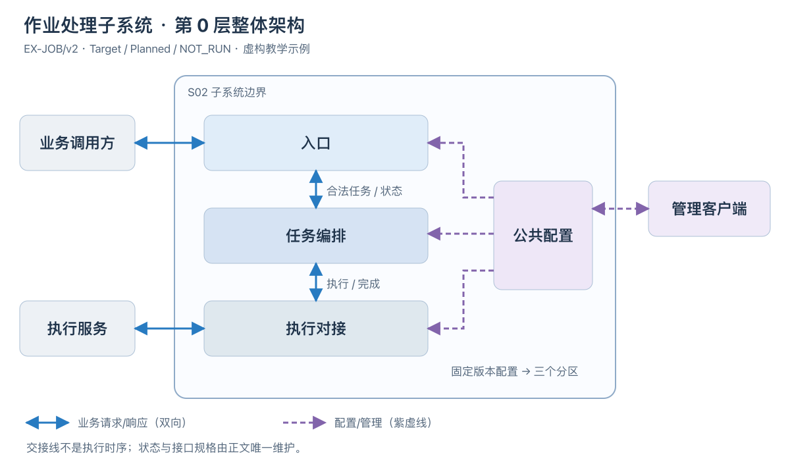
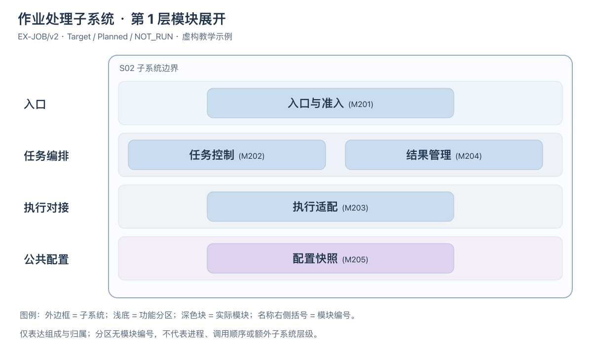

<!-- STD_DOCUMENT_COVER_BEGIN -->
# {{document_title}}

> STD 使用入口：[STD 主说明与执行流程](../../README.md)。这是工程文档标准模板；作者先读入口，再按项目已采用版本读取适用规范和专项指南。

| 文档字段 | 值 |
|---|---|
| Document ID | `{{document_id}}` |
| Document Version | `{{document_version}}` |
| Status | `{{document_status}}` |
| Project | `{{project}}` |
| Document Owner | {{document_owner}} |
| Last Modified Date | `{{last_modified_at}}` |
| Template ID | `{{template_id}}` |
| Template Version | `{{template_version}}` |
<!-- STD_DOCUMENT_COVER_END -->

> 本模板用于软件子系统概要设计：先说明整体方案，再逐层展开功能、软件架构和运行设计。
> 模块细节使用 `design.definition`，板卡/FPGA 使用领域专项；公共协作协议由机制或接口文档唯一维护。
> 按附录 A 确定适用范围；先写连续正文，再用图表汇总，不以文件清单代替设计。
> 编写方法见所采用 STD 的 `docs/ai-authoring-guide.md` 和 `docs/ai-guides/unit-design.md`。

> 软件子系统重点设计模块组织、进程/线程、通信、配置及业务处理；不是函数、类或源文件的详细设计。
> 上接软件系统设计，下接软件模块设计；当前不采用递归软件子系统，也不代替软件系统整体概要。
> 板卡与 FPGA 是外部领域依赖，内部设计由专项维护。通用标题可按实际业务扩展子节。
> 第 0/1 层表示观察粒度，不是一级/二级子系统；对象身份和直属父设计规则见 §1.7。

## 1. 概述与设计输入

<details>
<summary>本节编写建议、规范与示例</summary>

**本节目的**：让只读开篇的人理解本子系统为什么存在，以及它在系统业务中的位置。

**必须写清楚**：谁在什么业务场景使用、输入来自哪里、经过什么主要处理、结果交给谁；说明本版本实现范围、相邻子系统和明确不负责的事情。

**编写规范**：用约一页自包含叙述走通代表任务，解释划分这一边界的理由与代价。系统背景只保留必要条件，不能抄系统概览或列几个模块链接。说明适用版本、配置、部署拓扑，分开 Current/Target 与实现、验证状态。

**抽象示例**：虚构作业处理子系统接收已授权的计算任务，在给定资源额度内执行并返回结果；客户认证和结果展示属于相邻子系统。采用统一准入是为了控制峰值资源，代价是容量不足时必须显式拒绝。

**完成条件**：新读者能复述何时使用、做什么、输出什么及不保证什么；未实现的设计不会被当成现状。

</details>

<!-- 写入本子系统的连续说明，必要时补一张用途/环境图；不要照抄虚构任务系统。 -->

### 1.1 背景、设计目的与范围

<details>
<summary>本节编写建议、规范与示例</summary>

**本节目的**：说明为何需要本子系统及其价值，不把上级背景全文搬入。

**必须写清楚**：使用者和业务任务、现有痛点及影响、本地目标、非目标和边界选择依据。

**编写规范**：从一个真实使用场景解释本子系统负责的输入处理输出。背景只保留影响本地方案的事实，内部架构留 §2，不把全部模块塞进概述；未经批准的新能力标为建议而非需求。

**抽象示例**：作业处理负责资源额度内的执行，不负责客户认证；集中控制可降低多入口争抢，但引入明确过载拒绝。

**完成条件**：能解释为什么存在及负责到哪里，读者不必从模块名倒推用途。

</details>

<!-- 在此写设计正文，图表不替代技术原理及边界。 -->

### 1.2 应用环境、外部关系与输入输出

<details>
<summary>本节编写建议、规范与示例</summary>

**本节目的**：划清待设计软件和运行平台，避免把一般操作系统当自研功能。

**必须写清楚**：用户/相邻软件、受控设备或外部服务、输入输出和部署约束；标出软件边界、访问方向以及控制和业务路径。

**编写规范**：画上下文图并解释边界，图中环境不是内部模块。通用 OS/运行库只记录依赖和所需能力，只有实际定制的启动、BSP 或 OS 才展开设计。设备接口在此是外部连接，不能和软件模块混为一层。

**抽象示例**：虚构处理软件运行在既有主机上，调用已定义的执行服务；操作人员通过管理客户端配置，客户端不被默认为软件内部线程。

**完成条件**：每个外部对象与主要输入输出清楚，未把物理部署误当功能分层。

</details>

<!-- 按实际对象写入设计正文，图表只作汇总。 -->

<!-- STD_TEMPLATE_EXAMPLE_BEGIN -->


图 C1｜EX-JOB/v2 · Target / Planned / NOT_RUN。S02 是 SW-P 内的软件子系统；本图将其作为黑盒，不展开内部模块。业务调用方提交任务并取得结果，管理客户端提供配置或查询，既有执行服务返回执行结果。蓝实线为业务交接，紫虚线为管理交接，双向箭头表示请求及响应，不代表共享状态。示例交接名称仅用于解释，实际接口须在 §6 绑定唯一规格。 [可编辑 SVG](../diagrams/subsystem-context.svg)。
<!-- STD_TEMPLATE_EXAMPLE_END -->

### 1.3 上位设计基线、分配功能与约束

<details>
<summary>本节编写建议、规范与示例</summary>

**本节目的**：把系统分工转成子系统可执行的设计输入，而非重新决定系统级政策。

**必须写清楚**：上级 Document ID、版本和不可变 commit/hash、Constraint/Capability ID、决定状态、适用条件、预算及行为保证；逐项关联本地功能、不能改变的部分、自由度和验收责任。

**编写规范**：先检查输入是否足够。未决的公共语义返回上级，不用本地假设替代批准；允许做有标记的预设计，但关键保证未定不能判为设计完成。功能覆盖全部正式入口及必要的拒绝结果，不把“有模块”算作能力实现。共享预算在 §13 统一分配。

**抽象示例**：上级分配 64 MiB 私有内存上限并要求过载不侵占其他子系统；本地可以选择数据结构，但不能把拒绝改成无限排队。延迟条件若未给负载范围，先补输入而非自行声称满足。

**完成条件**：每个上级分配项都有本地落实和验证位置；每个本地功能有来源或明确的新增设计决定。

</details>

| 上级基线 / Constraint ID / 决定状态 | 条件及预算/行为保证 | 本地 Capability ID / 功能 | 需求 ID / 要求 | 不可改变 / 自由度 | 落实章节 / 验证责任 | 差距与反馈 |
|---|---|---|---|---|---|---|
| <!-- TODO --> | | | | | | |

| Capability ID | 场景 / 入口 | 输入、主要行为与输出 | 异常/拒绝结果 | Planned/Implemented | 验证判据与实际状态 |
|---|---|---|---|---|---|

### 1.4 本版本适用条件与实现、验证状态

<details>
<summary>本节编写建议、规范与示例</summary>

**本节目的**：让读者区分当前事实、目标设计和验证证据。

**必须写清楚**：设计版本、部署配置、支持范围；Current/Target/Transitional 视图，能力实现状态及验证记录或缺口。

**编写规范**：版本和条件必须能关联上位输入和真实证据。Planned、Implemented 与验证状态分别记录，不以文档 Approved 推导实现完成；没有证据写 NOT_RUN，未知条件记具体缺口，不当成不适用。

**抽象示例**：目标支持取消但当前没有执行端确认时，不能把安全停止画成已验证；列出缺失确认及其影响。

**完成条件**：所有图与数字能定位到相同适用基线，历史测量不证明目标版本行为。

</details>

<!-- 在此写设计正文，图表不替代技术原理及边界。 -->

### 1.5 主要功能设计（按能力展开）

<details>
<summary>本节编写建议、规范与示例</summary>

**本节目的**：把功能名称展开成用户或上级软件能理解的行为，为总体方案提供完整输入。

**必须写清楚**：每项主要功能何时使用、由什么入口触发、输入条件、主要处理、输出和失败结果；存在页面或命令时说明操作任务与反馈，不只列 UI 名称。

**编写规范**：按业务能力建立子节，不按函数名拆需求。这里定义做什么及关键行为，§2 解释整体实现方案，§3 分配模块；局部处理规则在对应正文唯一维护。注明不支持场景和版本范围，不以“提供管理功能”替代实际功能设计。

**抽象示例**：查询任务状态需要能区分未受理、处理中、已完成和结果不可取得等契约允许的结果；哪些查询可以重做、任务结束后保留多久，须依据已有要求决定，不能由页面设计随意补上。

**完成条件**：每项核心功能有可观察结果和边界，读者知道要实现什么，不必从接口名字倒推功能。

</details>

<!-- 按实际主要能力扩展子节；表格作为目录，正文说明功能。 -->

### 1.6 与系统设计的对应关系

<details>
<summary>本节编写建议、规范与示例</summary>

**本节目的**：将系统已经作出的决定落实到本范围，防止预算一致而身份、模式或执行顺序发生漂移。

**必须写清楚**：系统文档固定基线，组件/功能 ID、Mode ID、Process/Step ID、Topology/实例及 Constraint ID；说明系统决定、本地细化和下级自由度的边界。

**编写规范**：沿上级已分配范围逐项检查，使用原 ID 加本地对应关系，不另起同义身份。不要求照搬章号或全系统目录；未适用项说明理由。发现上级拓扑或步骤无法落实时反馈原决定方，不自行替换。系统图与本文模块/运行图保持不同粒度，引用相同外部边界。

**抽象示例**：系统规定先确认配置有效再开放入口，本地可决定内部函数组织，不能改成先接任务再异步加载配置；新增内部步骤须标明是细化，不改变上级外部可见顺序。

**完成条件**：每项分配都有本地设计与验收位置，新增决定可识别，系统变更能定位到受影响的模块、接口及测试。

</details>

| 系统基线 / 组件、功能、Mode、Process/Step、Topology或Constraint ID | 系统已定内容 | 本地细化 / 对应 ID及章节 | 下级自由度 | 组合验证 / 差异反馈 |
|---|---|---|---|---|

### 1.7 对象身份、直属父设计与责任边界

<details>
<summary>本节编写建议、规范与示例</summary>

**本节目的**：明确本文设计哪个对象、直属父对象是谁以及哪些内部设计留给下级。

**必须写清楚**：本对象 ID、类型、父对象 ID、父设计 Document ID 与基线；metadata 的 parent_document_id、软件系统分配的职责及本层可决定的范围。

**编写规范**：软件子系统使用 design_level=subsystem，parent_document_id 指向软件系统设计；软件系统与总体系统均属 system 粒度，但正文必须区分角色。软件子系统下级为软件模块，当前不采用递归子系统；不按目录推导层级。正文对象与父文档组成表人工核对，结构检查不证明软件领域归属。必要跨层约束标明来源、目标对象、理由及自由度，不把观察图当成内部实现承诺。

**抽象示例**：虚构总体系统 SYS-EX 下的软件系统 SW-P 包含处理子系统 SUB-C 和直属配置模块 MOD-D；SUB-C 用软件子系统模板确定内部模块与运行组织，SW-P 只规定其调用边界和共同保证，不指定内部线程数。

**完成条件**：对象、文档、类型与父链能对应，未成文父设计记缺口；同一对象在组成、运行和验证视图中身份不变。

</details>

| 本对象 ID / 类型 | 本 Document ID | 父对象 ID / 父设计 Document ID与基线 | parent_document_id核对 / 父设计角色 | 本层决定 / 下层自由度 / 跨层约束 |
|---|---|---|---|---|

## 2. 总体架构设计（第 0 层）

<details>
<summary>本节编写建议、规范与示例</summary>

**本节目的**：在拆模块之前解释子系统整体如何工作，让读者先看懂方案而不是先看目录。

**必须写清楚**：先放整体架构图，表达子系统边界、主要层或分区、外部依赖、输入输出、主要交接方向及横向公共能力的服务范围；再解释子系统在上级环境中的位置、主要输入输出、处理原理、功能分区、业务面与控制/管理面的关系、依赖的软硬件平台及主要方案取舍。

**编写规范**：第 0 层是观察粒度，不要求新增一层软件。图按层或主要部分表达，不能铺开全部模块或以黑盒上下文图替代；标明是调用层次还是功能分区，不从图推导进程部署。没有严格分层时采用分区，不为示例新增层；分组不自动取得模块编号。把子系统作为整体讲透一条业务路径：输入怎样变成输出、配置怎样影响处理、为什么该方案满足约束。采用系统已定政策，不重选全产品架构；概要设计需要确定本范围的方案，不能以“遵循上级”代替。

**抽象示例**：虚构作业处理软件从业务入口接受合法任务，按当前有效配置选择既定执行能力，将执行结果转成调用者可理解的状态；管理入口改变后续准入条件，不直接修改已经执行的任务。选择集中准入而非后端各自接受，是为统一控制软件范围内的负载。

**完成条件**：不看模块章节也能解释处理原理、外部边界、配置作用和关键代价；不是把 §1 的用途再写一次。

</details>

<!-- STD_TEMPLATE_EXAMPLE_BEGIN -->


图 A1｜EX-JOB/v2 · Target / Planned / NOT_RUN。与 C1 相同的 S02 采用功能分区：入口负责准入，任务编排负责生命周期及结果可见，执行对接连接外部服务，公共配置供三个分区读取固定版本。蓝实线为业务交接，紫虚线为配置管理；箭头不是完整时序。分区标识仅为图文定位，不是实现模块或新对象层级。 [可编辑 SVG](../diagrams/subsystem-overall-architecture.svg)。
<!-- STD_TEMPLATE_EXAMPLE_END -->


### 2.1 整体处理方案与功能分配

<details>
<summary>本节编写建议、规范与示例</summary>

**本节目的**：确定软件自身的工作原理和主要设计选择。

**必须写清楚**：主要工作模式、输入到输出的变换、业务处理与控制的关系、功能如何分区，以及方案选择对容量、可靠性和复杂度的影响。

**编写规范**：先用正文或处理框图说明原理，再把 §1.3 功能分配到主要部分。模式不同要解释路径和约束差异；没有多个模式则不编造。详细算法留后续模块设计，但会改变跨模块结果的算法/政策必须现在决定。

**抽象示例**：接收后先统一校验与容量准入，再交执行端，完成后统一转换结果。若允许异步返回，概要设计必须决定完成查询与结果寿命，不能等各模块自行选择。

**完成条件**：所有核心功能能找到方案中的位置，方案中的每个主要部分有必要性与设计依据。

</details>

<!-- 按实际对象写入设计正文，图表只作汇总。 -->

## 3. 分层与模块设计（第 1 层）

<details>
<summary>本节编写建议、规范与示例</summary>

**本节目的**：解释内部由哪些主要部分组成、为什么这样分工，以及组合起来如何实现能力。

**必须写清楚**：层次与包含关系、各模块职责及非职责、部署/执行单元映射、状态和资源所有者、模块之间的协作边界；逐个说明图中的组件做什么。

**编写规范**：按 §2 相同的层或分区顺序逐层展开 §3.1，每层包含组成图、模块表和连续处理说明；全局模块索引不能替代逐层设计。组成图只突出层次和归属，左侧层名、无图标模块、不用连接线冒充流程。完整流程放 §7；§2 架构图可使用有语义的关系线，不将组成图无连线规则推广到所有图。逻辑模块不等于独立进程，必须说明共享或独立运行边界。可以预先定义下游文件名，但 Planned 文件不是已经存在的权威文档；模块父子关系与前置依赖分开。

**抽象示例**：入口与准入检查任务，任务控制统筹执行，执行适配对接既有计算接口，结果管理提供状态与结果。四个逻辑模块可同进程，不因画了四个框就引入四个服务；切分原因是把资源准入与具体执行后端隔开。

**完成条件**：功能能够定位到责任模块，没有两个模块同时拥有同一决定；下游知道自身边界及输入，而不是只得到文件名。

</details>

<!-- STD_TEMPLATE_EXAMPLE_BEGIN -->


图 M1｜EX-JOB/v2 · Target / Planned / NOT_RUN。沿 A1 的入口、任务编排、执行对接、公共配置四个分区展开：准入 M201、任务控制 M202、结果管理 M204、执行适配 M203、配置快照 M205 均直属 S02。分区只分组，不能填入 parent_document_id；编号遵循 S02 的 M2xx 段。图只表达组成，具体交接引用 §6，流程在 §7；没有隐含新增进程或项目功能。 [可编辑 SVG](../diagrams/subsystem-module-breakdown.svg)。
<!-- STD_TEMPLATE_EXAMPLE_END -->

| 层/分区 | 对象 ID / 类型 / 父对象 ID | 职责 / 非职责 | 部署单元 / 实现位置或 NOT_IMPLEMENTED | 拥有的状态/资源 | 下级设计入口（Document ID / 模板类型 / 计划文件名 / 状态） | 前置依赖 |
|---|---|---|---|---|---|---|
| <!-- TODO --> | | | | | | |

### 3.1 单层或分区设计（按第 2 章顺序展开）

<details>
<summary>本节编写建议、规范与示例</summary>

**本节目的**：把第 0 层架构中的每一部分落实到模块组织与共同保证。

**必须写清楚**：本层职责和非职责、输入输出、功能/需求分配；局部模块组成图与模块表、正式名称/编号/父对象/实现位置、状态资源所有者、层内协作、跨层接口和下级设计入口。

**编写规范**：按 §2 的层或分区逐节展开，采用同一名称和范围；无严格分层时用分区标题。图只展开本分区，不靠全局模块表代替各层说明；模块仍直属软件子系统，分组不产生新父对象。跨层公共保证在 §2 确定，本节引用 §6 唯一接口并明确允许模块自行选择的内容。

**抽象示例**：任务编排分区包含 M202 任务控制和 M204 结果管理；前者拥有任务生命周期，后者保存输出并报告可取得性，两者不各自决定一套任务终态。

**完成条件**：每层能沿输入解释模块怎样协作并交给下一部分，所有正式模块都有归属，公共状态无双重所有者。

</details>

<!-- 在此写设计正文，图表不替代技术原理及边界。 -->

<!-- STD_TEMPLATE_EXAMPLE_BEGIN -->
**逐分区说明示例（对应 M1，非项目事实）**

入口分区的入口与准入（M201）检查请求及配额，受理时绑定配置版本，再交任务控制；不自行判断执行成功。
任务编排分区由任务控制（M202）持有生命周期，结果管理（M204）持有结果内容及可取得性；
任务控制只有收到符合共同判据的完成信息才更新任务终态。结果库可读不等于执行已完成。
执行对接分区的执行适配（M203）把请求交给 C1 的既有执行服务，返回结果或结果未知；不能把超时当安全停止。
公共配置分区的配置快照（M205）校验管理输入并发布不可变版本，其他分区只消费版本化快照；
在途任务继续绑定原版本，配置变更的完整生效过程在 §8 唯一维护。这是教学选择，不强迫项目采用快照模块。

| 分区 | 正式模块 / 父对象 | 本地拥有 | 接口及下游承接 |
|---|---|---|---|
| 入口 | 入口与准入 M201 / S02 | 准入期间的资源预留 | 受理及拒绝语义在 §6；详细设计计划入口 M201-design.md，Planned |
| 任务编排 | 任务控制 M202 / S02 | 任务生命周期及预留释放责任 | 状态/执行交接在 §6；M202-design.md，Planned |
| 任务编排 | 结果管理 M204 / S02 | 结果内容及保留期限 | 发布/查询语义在 §6；M204-design.md，Planned |
| 执行对接 | 执行适配 M203 / S02 | 外部调用关联及未确认操作 | 外部协议映射在 §6；M203-design.md，Planned |
| 公共配置 | 配置快照 M205 / S02 | 配置版本及发布 | 配置操作在 §6；M205-design.md，Planned |

预留交接须由 M201/M202 共同确认，失败释放责任不可悬空；此处只解释架构责任，§6/§7 仍需定义可调用协议及完整失败路径。
上述计划文件不是已存在来源，未列具体接口 ID 不代表规格已完成；正式设计应按唯一接口目录绑定成员。
<!-- STD_TEMPLATE_EXAMPLE_END -->

### 3.2 模块处理概要（在各层内按模块展开）

<details>
<summary>本节编写建议、规范与示例</summary>

**本节目的**：在软件整体方案下逐个说明主要模块如何承担功能，而不是只填写职责表。

**必须写清楚**：每个直属软件模块的用途、承担功能、输入输出、概要原理、与其他直属对象协作、状态/资源边界及约束；说明不负责的行为。

**编写规范**：在所属层的正文中按直属软件模块复制本节，标明 module 及父对象，说明接收什么、怎样处理、交给谁及为什么。本文确定模块概要、共同状态及协作规则；模块详细设计深化内部算法与实现。必要跨层约束显式说明来源、目标对象、理由和保留的自由度。这个粒度不展开函数逐行逻辑、私有字段或所有源文件；不能只列对象名、Owner 和计划文档。

**抽象示例**：入口与准入统一校验请求及可用额度，只有成功预留所需资源后才交任务控制；任务控制决定后续状态，准入不直接判断执行结果。尚未选定的预留/释放协作规则须先解决，不能推给两个模块各自设计。

**完成条件**：读者能解释直属对象的主要工作及协作，组合没有行为空白，也没有越权冻结下级内部实现；不以“实现业务逻辑”作为处理说明。

</details>

<!-- 按实际分区及模块扩展子节，标明软件模块及父对象；调整编号并同步引用，不强制保留示例名称。 -->

## 4. 运行设计

<details>
<summary>本节编写建议、规范与示例</summary>

**本节目的**：说明静态模块在运行时如何组织、调度和协作。

**必须写清楚**：直属对象到运行边界/实例的映射，本层负责的进程/线程/任务组织，通信方式与同步异步边界、并发和阻塞、运行模式、生命周期及故障隔离。

**编写规范**：逻辑分层不等于进程划分；本文确定直属对象的运行边界及跨边界交互，本软件子系统确定内部运行组织，模块详细设计细化不改变共同保证的实现。若父级必须约束进程/隔离域，按 §1.7 标记跨层约束。单进程也解释本层执行上下文、并发及等待；通用软件不设计无关内核，RTL 时钟和电气细节由专项承接。

**抽象示例**：准入和状态管理可在同一事件循环，阻塞执行由既有执行端承担；等待执行响应时不能堵住取消和查询。选择理由是减少共享写入，但长耗时动作必须移出该循环。

**完成条件**：开发者知道软件怎样运行和通信，而不只是知道有哪些模块。

</details>

<!-- 按实际对象写入设计正文，图表只作汇总。 -->

### 4.1 运行单元、调度与通信

<details>
<summary>本节编写建议、规范与示例</summary>

**本节目的**：把模块映射为能够实际运行的组织方案。

**必须写清楚**：进程/线程/任务数量或创建规则、模块归属、实例身份、共享数据、通信载体、消息方向、队列/阻塞和并发限制。

**编写规范**：给运行部署图或通信图，箭头标数据/操作和同步性质；数量须有负载依据，不默认每模块一个进程。并发资源上限引用 §13，公共接口引用 §6，不复制第二份定义。

**抽象示例**：一个控制进程维护状态，调用既有工作端；如果改成多个工作端，说明如何选端及谁拥有任务，不能只将框复制多份。

**完成条件**：每条跨运行单元交互有通信方案，等待不阻塞必须响应的控制操作，共享写入有明确统筹。

</details>

| 运行单元 / 创建规则 | 承载模块 | 调度/并发 | 通信与同步方式 | 共享数据/故障边界 |
|---|---|---|---|---|

### 4.2 启动、运行与退出

<details>
<summary>本节编写建议、规范与示例</summary>

**本节目的**：确定生命周期的顺序、就绪条件和异常退出责任。

**必须写清楚**：依赖初始化、配置装载、通信建立、就绪发布、正常停止、重启与在途处理；说明失败后能否重试及退出顺序。

**编写规范**：在业务入口打开之前定义可核对的就绪事实；退出要能停止接受新工作并按既有语义收口。静态嵌入式组件可以由父单元调用初始化，不强建独立启动服务。

**抽象示例**：建立执行连接、核对配置并完成必要检查后开放准入；退出先关入口，再处理在途并释放本单元资源。依赖不就绪不得发布虚假的 Ready。

**完成条件**：从启动到服务再到退出的全过程有明确责任和可观测结果；反向依赖不会造成互相等待。

</details>

<!-- 按实际对象写入设计正文，图表只作汇总。 -->

## 5. 数据结构设计

<details>
<summary>本节编写建议、规范与示例</summary>


<!-- 数据结构分类编写建议与教学例子；生成文档时按实际对象保留适用类别。
只保留适用类别，并在章首记录不适用类别的原因与 tailoring 依据。类别按性质划分，不按输入/输出划分；每个具体结构以真实名称作带编号的小节标题，字段、约束、唯一来源、所有权/寿命、合法与拒绝实例及验证随该结构描述，不另设数据结构清单。下列例子均为虚构，不能作为项目契约：

| 类别 | 具体示例（均为虚构） | 适用条件与关键约束 |
|---|---|---|
| 公共基础类型与枚举 | `InspectionState = ACCEPTED \| RUNNING \| SUCCEEDED \| FAILED`；示例值 `RUNNING` | 多处共用时采用；`RUNNING` 表示已开始执行，未知值拒绝 |
| 业务与操作数据结构 | `InspectionRequest {request_id:"req-7", image_uri:"asset://image/7", policy_version:3}` | 存在业务载荷时采用；三字段必填，`request_id` 绑定一次业务操作 |
| 配置与规则数据结构 | `config/inspection-policy.yaml {schema_version:1, policy_version:3, enabled:true, score_threshold:0.75}` | 存在受控规则时采用；阈值在 0–1，新版本仅对后续任务生效 |
| 通信报文结构 | `FrameReadyEvent {source_id:2, frame_id:7, sequence:42, image_ref_id:9}` | 存在消息交接时采用；`sequence` 在同一来源内递增，重复号按契约去重 |
| 设备与 FPGA 表项结构 | `RouteTableEntry {route_id:u12=7, target:u4=2}` | 实际拥有设备/RTL 表项时采用；16 位布局和写入确认均须由机器源定义 |
| 运行状态数据结构 | `InspectionRuntimeState {task_id:"t-7", generation:2, state:RUNNING, result_uri:null}` | 存在跨步骤状态时采用；唯一写者确认 `ACCEPTED → RUNNING` 后发布 |
| 数据库表结构 | `inspection_jobs(task_id PRIMARY KEY, generation, state, result_uri)` | 实际拥有数据库表时采用；受理回复前提交事务，升级说明版本迁移 |
| 错误码与错误结构 | `InspectionError {code:QUEUE_FULL, request_id:"req-7", task_id:null}` | 存在错误载荷时采用；公共 `QUEUE_FULL` 逐码定义，拒绝本次新任务 |

结构小节以 `InspectionRequest` 等真实名称为标题：先展示类型声明，再逐字段写类型、必填/范围、跨字段规则、来源、持有者和验证。上表只是简短实例，不是字段全集或机器权威；没有设备或数据库的项目，不要为了填类别发明寄存器或表。


**以下为本层原有编写要求。**

**数据与错误承接**：先列本子系统拥有、继承和交给直属模块的 Data/Type ID、唯一来源、读写者与状态权威；本层新增对象逐字段说明类型、范围/单位、可空性、条件有效性、寿命与实例。引用上级公共错误码，不重定义代码值；无新增对象列正式裁剪依据。

**本节目的**：定义任务及数据在内部怎样变化、由谁决定其状态、何时可以访问和释放。

**必须写清楚**：对象身份与版本、生产/消费方、唯一写入者、合法状态转换、Guard 的事实来源、易失和持久状态、可见性、寿命及回收条件。

**编写规范**：无数据库不代表无状态，在途请求、缓冲区、取消和复位都要分析。区分结果已知性、执行是否停止、访问是否安全、终态和资源释放；关键条件必须说明通过什么接口/事件/证据产生，不能靠测试直接改内部状态才收口。机器字段引用唯一来源，正文解释其语义。

**抽象示例**：等待超时只表示未拿到结果，不证明执行已停止；执行适配给出可核对的停止证据后，任务控制才允许释放相关资源。若既有协议不能提供证据，保留阻塞与升级路径，不臆造安全回收。

**完成条件**：每个对象有完整生命周期，等待有合法出口，失败与取消不会留下无主资源或允许迟到写入已释放对象。

-->
</details>

### 5.1 公共基础类型与枚举（适用时）

<details>
<summary>本节编写建议、规范与示例</summary>

**本节目的**：统一本层拥有的共享类型与枚举语义，使该类数据可由下级直接承接。

**必须写清楚**：逐值含义、合法范围、未知值处理及唯一来源；逐结构记录 Data/Type ID、固定来源、字段、所有权与寿命、合法和拒绝实例及验证。

**编写规范**：复用上级类型时仅给固定引用和本层投影，不重定义值。本类别不适用时在章首说明原因和 tailoring 依据，不保留空小节。如果字段已有机器定义，应固定版本并逐项核对；教学例子不得成为项目默认值。

**抽象示例**：任务状态 RUNNING 只表示执行已开始，不代表成功完成；示例只说明写法，不是项目的机器契约。

**完成条件**：各使用处对同一值作一致解释，且没有与其他章节重复维护同一字段定义。

</details>

<!-- 编写建议：只收录本层拥有或必须呈现的公共基础类型与枚举；已由上级或机器源定义的值只引用固定来源。逐值写含义、范围、未知值处理和适用边界。虚构例子：InspectionState 的 RUNNING 只表示检测已开始执行，不等于完成。 -->

#### 5.1.N `<真实结构名>`

- **完整定义、Data/Type/Error ID 与唯一来源**
- **逐字段/逐值类型、范围、含义与跨字段约束**
- **生产/修改、所有权、可见点、寿命及失败出口**
- **合法与拒绝实例、V/Case 与证据状态**

<!-- STD_TEMPLATE_EXAMPLE_BEGIN -->
**5.1.1 `InspectionState`（公共状态枚举，虚构）**

```text
enum InspectionState { ACCEPTED, RUNNING, SUCCEEDED, FAILED }
```

- **Data/Type ID、含义与来源**：

  `DATA-EX-STATE`；一次检测任务的权威业务状态。示例机器源为 `Proposed: InspectionState`；正式设计须给出实际 Schema/IDL 路径、版本和核对结果，或记录形成契约的 Owner 与 Gate。

- **逐值定义**：

  `ACCEPTED`＝已受理但尚未执行；`RUNNING`＝已开始执行但无最终结果；`SUCCEEDED`＝结果已发布；`FAILED`＝执行终止且未发布成功结果。未知值拒绝，不映射为 `FAILED`。

- **约束与生命周期**：

  状态键为 `task_id`；只有任务状态的权威持有者可改变值，发布后读者才可观察。`RUNNING → SUCCEEDED` 必须已有可定位的结果；终态不得再回到 `RUNNING`。任务保留期限由系统级策略决定，此例不虚构期限。

- **合法/拒绝实例**：

  已发布结果 `result_id=res-7` 后置 `SUCCEEDED` 合法；只有执行开始记录、没有结果时置 `SUCCEEDED` 必须拒绝。

- **验证**：

  设计向量 `V-EX-STATE-01` 检查终态前提和未知值拒绝；本例 `NOT_RUN`，不表示验证通过。

<!-- STD_TEMPLATE_EXAMPLE_END -->

### 5.2 业务与操作数据结构（适用时）

<details>
<summary>本节编写建议、规范与示例</summary>

**本节目的**：定义业务操作实际交换和保存的对象，使该类数据可由下级直接承接。

**必须写清楚**：逐字段类型、必填性、范围、键及跨字段条件；逐结构记录 Data/Type ID、固定来源、字段、所有权与寿命、合法和拒绝实例及验证。

**编写规范**：同一结构无论作为输入还是输出只定义一次。本类别不适用时在章首说明原因和 tailoring 依据，不保留空小节。如果字段已有机器定义，应固定版本并逐项核对；教学例子不得成为项目默认值。

**抽象示例**：InspectionRequest 用非空 request_id 关联一次检测操作；示例只说明写法，不是项目的机器契约。

**完成条件**：合法与拒绝实例均能依字段和规则判定，且没有与其他章节重复维护同一字段定义。

</details>

<!-- 编写建议：按真实业务对象逐字段说明类型、必填/可空、范围和跨字段不变量；同一结构在多个接口使用时只定义一次。虚构例子：InspectionRequest 的 request_id 非空且标识一次业务操作。 -->

#### 5.2.N `<真实结构名>`

- **完整定义、Data/Type/Error ID 与唯一来源**
- **逐字段/逐值类型、范围、含义与跨字段约束**
- **生产/修改、所有权、可见点、寿命及失败出口**
- **合法与拒绝实例、V/Case 与证据状态**

<!-- STD_TEMPLATE_EXAMPLE_BEGIN -->
**5.2.1 `InspectionRequest`（业务对象，虚构）**

```text
InspectionRequest {
  request_id: string,
  image_uri: string,
  policy_version: uint32
}
```

- **Data/Type ID、用途与来源**：

  `DATA-EX-REQUEST`；代表一次待受理的检测请求，示例机器源为 `Proposed: InspectionRequest`。正式项目需绑定实际类型定义和固定版本。

- **`request_id`**：

  必填、非空字符串，作为同一业务请求的稳定身份；实际编码及长度上限由 Schema 确定。

- **`image_uri`**：

  必填、非空字符串，指向待检图像而非图像字节副本；URI 方案和访问权限由图像存储契约确定。

- **`policy_version`**：

  必填、正整数，指定本次请求采用的已发布规则版本。

- **跨字段与寿命**：

  同一 `request_id` 重放时，`image_uri` 与 `policy_version` 必须保持一致；冲突值不得创建第二任务。受理方创建任务记录后保留请求身份；原图的所有权与释放期限另由图像存储契约决定。

- **合法/拒绝实例**：

  `{request_id:"req-7", image_uri:"asset://image/7", policy_version:3}` 在引用和版本均存在时合法；同一 `request_id` 携带另一个图像 URI 应拒绝并返回已定义的冲突错误。

- **验证**：

  `V-EX-REQUEST-01` 覆盖合法构造、缺字段和同 ID 冲突；本例 `NOT_RUN`。

<!-- STD_TEMPLATE_EXAMPLE_END -->

<!-- STD_TEMPLATE_EXAMPLE_BEGIN -->
**5.2.2 `InspectionSubmission`（受理结果，虚构）**

```text
InspectionSubmission {
  request_id: string,
  task_id: string,
  disposition: ACCEPTED | EXISTING
}
```

- **Data/Type ID、用途与来源**：

  `DATA-EX-SUBMISSION`；表示请求已受理或同请求重放找到了原任务，不表示检测已经完成。示例机器源为 `Proposed: InspectionSubmission`。

- **`request_id`**：

  必填，等于输入 `InspectionRequest.request_id`；用于把响应绑定到原请求。

- **`task_id`**：

  必填、非空；`ACCEPTED` 指向本次新建任务，`EXISTING` 指向相同请求身份下已存在的原任务。

- **`disposition`**：

  必填；`ACCEPTED` 表示首次受理，`EXISTING` 表示同一请求内容重放且未新增执行；未知值拒绝。

- **约束与生命周期**：

  受理责任单元在任务身份持久确定后构造结果；响应丢失时仍可凭原 `request_id` 查询。任务何时完成由 §5.1 的 `InspectionState` 表达，不能从 `InspectionSubmission` 推断成功检测。

- **合法/拒绝实例**：

  `{request_id:"req-7", task_id:"t-7", disposition:ACCEPTED}` 在确实新建 `t-7` 后合法；没有持久任务身份却返回 `ACCEPTED` 必须拒绝。

- **验证**：

  `V-EX-SUBMISSION-01` 检查首次受理、同请求重放、响应丢失后查询和无重复任务；本例 `NOT_RUN`。

<!-- STD_TEMPLATE_EXAMPLE_END -->

### 5.3 配置与规则数据结构（适用时）

<details>
<summary>本节编写建议、规范与示例</summary>

**本节目的**：固定决定行为的配置与规则载荷，使该类数据可由下级直接承接。

**必须写清楚**：字段、默认值来源、版本、校验和生效点；逐结构记录 Data/Type ID、固定来源、字段、所有权与寿命、合法和拒绝实例及验证。

**编写规范**：未决定的配置不得由下级自行添加 fallback。本类别不适用时在章首说明原因和 tailoring 依据，不保留空小节。如果字段已有机器定义，应固定版本并逐项核对；教学例子不得成为项目默认值。

**抽象示例**：DetectionPolicy 的新版阈值只作用于新任务；示例只说明写法，不是项目的机器契约。

**完成条件**：能判定任一操作使用哪一版规则，且没有与其他章节重复维护同一字段定义。

</details>

<!-- 编写建议：给出受控配置的字段、默认值来源、版本、校验和生效点；配置未定义时不能由下级自创 fallback。虚构例子：DetectionPolicy 的 threshold 只对新受理任务生效。 -->

#### 5.3.N `<真实结构名>`

- **完整定义、Data/Type/Error ID 与唯一来源**
- **逐字段/逐值类型、范围、含义与跨字段约束**
- **生产/修改、所有权、可见点、寿命及失败出口**
- **合法与拒绝实例、V/Case 与证据状态**

<!-- STD_TEMPLATE_EXAMPLE_BEGIN -->
**5.3.1 `config/inspection-policy.yaml`（配置文件，虚构）**

```yaml
schema_version: 1
policy_version: 3
enabled: true
score_threshold: 0.75
```

- **Data/Type ID、用途与来源**：

  `DATA-EX-POLICY-FILE`；这是一份决定检测任务是否准入及其判定阈值的 YAML 文件，不是单独的内存对象。示例路径和内容均为虚构；真实项目须指定受控文件路径、唯一配置 Schema、版本及部署责任方。

- **`schema_version`**：

  必填整数，本例只接受 `1`；用于选择文件格式，未知版本拒绝加载。

- **`policy_version`**：

  必填正整数，标识本次加载的规则版本；发布后不复用。

- **`enabled`**：

  必填布尔值；`false` 表示不受理新的检测任务，不改变既有任务的终态。

- **`score_threshold`**：

  必填数值，闭区间 `[0, 1]`，单位为无量纲得分；`enabled=false` 时仍须通过格式校验，避免下次启用时读取无效值。

- **文件级约束与生效**：

  本例由进程在启动时读取并整份校验；缺字段、重复键、未知键、类型错误或越界值均使启动失败，不静默使用默认值。启动成功后进程固定一份已校验快照；编辑磁盘文件不会热更新，只有按启动过程重启并确认新版本后才生效。运行中任务的恢复规则由系统恢复设计决定。

- **合法/拒绝实例**：

  上面的完整文件在受控路径且通过 Schema 校验时合法；将 `score_threshold` 改为 `1.2` 或增加未知键 `fallback_mode` 时必须拒绝整份文件，不能部分采用。

- **验证**：

  `V-EX-POLICY-FILE-01` 覆盖完整加载、缺字段/未知键/越界拒绝、修改文件但未重启时版本不变；本例 `NOT_RUN`。

<!-- STD_TEMPLATE_EXAMPLE_END -->

### 5.4 通信报文结构（适用时）

<details>
<summary>本节编写建议、规范与示例</summary>

**本节目的**：定义跨执行边界交换的消息载荷，使该类数据可由下级直接承接。

**必须写清楚**：字段、编码、关联身份、顺序、重复与兼容边界；逐结构记录 Data/Type ID、固定来源、字段、所有权与寿命、合法和拒绝实例及验证。

**编写规范**：投递与重试动作在接口章节定义，结构只拥有载荷语义。本类别不适用时在章首说明原因和 tailoring 依据，不保留空小节。如果字段已有机器定义，应固定版本并逐项核对；教学例子不得成为项目默认值。

**抽象示例**：FrameReadyEvent 使用 frame_id 与来源内递增的 sequence；示例只说明写法，不是项目的机器契约。

**完成条件**：两端可按同一报文解释和验证，且没有与其他章节重复维护同一字段定义。

</details>

<!-- 编写建议：定义真实消息、事件、流或文件载荷的字段、编码、关联身份、顺序与兼容边界；投递/重试行为由对应接口定义。虚构例子：FrameReadyEvent 带 frame_id 与来源内递增的 sequence。 -->

#### 5.4.N `<真实结构名>`

- **完整定义、Data/Type/Error ID 与唯一来源**
- **逐字段/逐值类型、范围、含义与跨字段约束**
- **生产/修改、所有权、可见点、寿命及失败出口**
- **合法与拒绝实例、V/Case 与证据状态**

<!-- STD_TEMPLATE_EXAMPLE_BEGIN -->
**5.4.1 `FrameReadyEvent`（通信报文，虚构）**

| 报文内 bit 位置 | 0–15 | 16–23 | 24–31 | 32–63 | 64–127 | 128–191 | 192–255 |
|---|---|---|---|---|---|---|---|
| 字段 | `magic` | `version` | `flags` | `source_id` | `frame_id` | `sequence` | `image_ref_id` |
| 类型 | `u16` | `u8` | `u8` | `u32` | `u64` | `u64` | `u64` |

图 EX-DATA-4 · `FrameReadyEvent` 的线传布局；表格从左到右为报文顺序，编号为从报文起始位置计算的 bit offset。图仅展示虚构教学格式，不是项目的机器权威。该固定报文共 256 bit／32 byte，多字节整数字段按网络字节序（大端）编码；没有隐含填充或可变长尾部。

- **Data/Type ID、用途与来源**：

  `DATA-EX-FRAME-EVENT`；通知采集图像已可读取。示例机器源为 `Proposed: FrameReadyEvent`；正式项目须固定消息 Schema、版本和实际传输绑定，不从图推导 topic 或部署事实。

- **`magic`（bit 0–15）**：

  必填 `u16`，固定值 `0xA55A`；不匹配则按格式错误拒绝，不继续解析其他字段。

- **`version`（bit 16–23）**：

  必填 `u8`，本教学格式仅接受 `1`；未知版本拒绝，不猜测字段兼容。

- **`flags`（bit 24–31）**：

  必填 `u8`，本版必须为 `0`；非零保留位拒绝。

- **`source_id`（bit 32–63）**：

  必填 `u32`，非零，标识采集来源。

- **`frame_id`（bit 64–127）**：

  必填 `u64`，非零，标识该来源的一帧。

- **`sequence`（bit 128–191）**：

  必填 `u64`，非零，在同一来源内递增；不得据此跨来源排序，耗尽前须停止该来源的新报文而非回绕复用。

- **`image_ref_id`（bit 192–255）**：

  必填 `u64`，非零，引用该来源已发布且可读取的图像；引用的解析与授权由图像存储契约确定，报文本身不携带图像字节。

- **约束与寿命**：

  `(source_id, sequence)` 是去重键；同键不同 `frame_id` 或 `image_ref_id` 为冲突。报文只在图像可读取后发布；事件被消费不等于图像资源可删除。传输确认、重试和背压属于对应接口，不在此重复定义。

- **合法/拒绝实例**：

  `magic=0xA55A, version=1, flags=0, source_id=2, frame_id=7, sequence=42, image_ref_id=9` 按图编码为 32 byte 且引用已发布图像时合法；将 `flags` 改为 `1` 或同键改用另一个 `image_ref_id` 应拒绝，不覆盖原记录。

- **验证**：

  `V-EX-FRAME-01` 覆盖逐字段编码/解码、长度与端序、版本/保留位拒绝、重复与冲突报文；本例 `NOT_RUN`。

<!-- STD_TEMPLATE_EXAMPLE_END -->

### 5.5 设备与 FPGA 表项结构（适用时）

<details>
<summary>本节编写建议、规范与示例</summary>

**本节目的**：定义实际设备或 RTL 表项的受控布局，使该类数据可由下级直接承接。

**必须写清楚**：位宽、复位值、读写权限、写入确认与生效条件；逐结构记录 Data/Type ID、固定来源、字段、所有权与寿命、合法和拒绝实例及验证。

**编写规范**：纯软件项目无此对象时按 tailoring 删除，不虚构寄存器。本类别不适用时在章首说明原因和 tailoring 依据，不保留空小节。如果字段已有机器定义，应固定版本并逐项核对；教学例子不得成为项目默认值。

**抽象示例**：RouteTableEntry 的 target 位宽以固定 register map 为准；示例只说明写法，不是项目的机器契约。

**完成条件**：表项写入与读取有唯一可核对的机器来源，且没有与其他章节重复维护同一字段定义。

</details>

<!-- 编写建议：只有真实拥有设备或 RTL 表项时才保留；按固定机器源描述位宽、复位值、读写约束与生效条件。纯软件范围不得为填模板虚构寄存器。虚构例子：RouteTableEntry 的布局来自 register map。 -->

#### 5.5.N `<真实结构名>`

- **完整定义、Data/Type/Error ID 与唯一来源**
- **逐字段/逐值类型、范围、含义与跨字段约束**
- **生产/修改、所有权、可见点、寿命及失败出口**
- **合法与拒绝实例、V/Case 与证据状态**

<!-- STD_TEMPLATE_EXAMPLE_BEGIN -->
**5.5.1 `CaptureStatusRegister`（设备寄存器，虚构）**

假设设备暴露一个 `CAPTURE_MMIO` 控制地址空间。下表偏移均相对该地址空间基址；基址由实际平台分配，不在本例编造物理地址。所有寄存器均按 32-bit 对齐、小端字节序访问；不支持非对齐或非 32-bit 访问。未列出的偏移为保留区，访问返回总线拒绝，不得作为兼容扩展的隐式空间。

| 偏移 | 寄存器名称 | 宽度/访问 | 复位或初值 | 用途与访问副作用摘要 |
|---|---|---|---|---|
| `0x00` | `CAP_ID` | 32-bit / RO | `0x43415031` | 设备身份常量 `CAP1`；读取无副作用，不表示设备已就绪。 |
| `0x04` | `CAP_VERSION` | 32-bit / RO | `0x00010000` | 高 16 位主版本、低 16 位次版本；软件先核对兼容范围。 |
| `0x10` | `CAP_CONTROL` | 32-bit / RW | `0x00000000` | 受控启停入口；写入可能触发动作，不能按普通内存变量处理。 |
| `0x20` | `CAP_STATUS` | 32-bit / RO | `0x00000000` | 本例下方完整展开的状态寄存器；原子读取，无读清副作用。 |
| `0x24` | `CAP_FRAME_COUNT` | 32-bit / RO | `0x00000000` | 已完成帧数；达到最大值后饱和，设备复位时清零。 |
| `0x28` | `CAP_DROPPED_COUNT` | 32-bit / RO | `0x00000000` | 因输入溢出而丢弃的帧数；达到最大值后饱和，设备复位时清零。 |
| `0x2C` | `CAP_IRQ_STATUS` | 32-bit / RW1C | `0x00000000` | 中断状态；读取得到当前锁存位，写 `1` 清对应位，写 `0` 不改变该位。 |

此表只示范**寄存器列表**的覆盖方式，不是其余六个寄存器的完整字段定义。真实设计应为 `CAP_CONTROL`、`CAP_IRQ_STATUS` 等每个实际使用的寄存器另设同名小节，固定具体位域、合法写序列、清除时机、并发及异常行为；若下级 register map/RTL 是机器权威，本表须从同一固定基线生成或逐项核对。

| 寄存器逻辑位 | 31–3 | 2 | 1 | 0 |
|---|---|---|---|---|
| 字段 | `reserved` | `overflow` | `busy` | `ready` |

图 EX-DATA-5A · 表格从左到右是寄存器高位到低位，表头直接给出逻辑位编号；位域布局不表示总线的字节传输顺序。本例假设设备寄存器空间偏移 `0x20`、32-bit 对齐访问、小端字节序；均为虚构教学条件。

- **Data/Type ID、用途与来源**：

  `DATA-EX-CAPTURE-STATUS`；供控制单元读取采集状态。示例机器源为 `Proposed: CaptureStatusRegister`；正式设计须用固定版本 register map/RTL 逐位核对。

- **`reserved`（bit 31–3）**：

  只读，复位和正常读取均为零；读到非零视为格式/版本不匹配，不按已知字段解释。

- **`overflow`（bit 2）**：

  只读、复位值 `0`；发生输入溢出后锁存为 `1`，本教学例子中只在设备复位时清零。

- **`busy`（bit 1）**：

  只读、复位值 `0`；采集操作正在进行时为 `1`。

- **`ready`（bit 0）**：

  只读、复位值 `0`；初始化完成且可接收新操作时为 `1`。`ready` 与 `busy` 不得同时为 `1`。

- **访问与生命周期**：

  一次 32-bit 读取返回同一时刻的原子快照；写此只读地址返回总线拒绝，不改变状态。复位全零不等于已经就绪；何时从复位进入 `ready=1` 由设备启动过程定义。

- **合法/拒绝实例**：

  读取 `0x00000001` 表示就绪且不忙；`0x00000003` 同时声明就绪与忙，违反不变量，控制单元须报告设备状态异常，不能凭其中一个位继续执行。

- **验证**：

  `V-EX-REGISTER-01` 覆盖复位值、位域、只读拒写、原子读取和互斥状态；本例 `NOT_RUN`，不代表 RTL 仿真或上板结果。

<!-- STD_TEMPLATE_EXAMPLE_END -->

<!-- STD_TEMPLATE_EXAMPLE_BEGIN -->
**5.5.2 `RouteTableEntry`（FPGA 数据表项，虚构）**

| 表项逻辑位 | 15–12 | 11–0 |
|---|---|---|
| 字段 | `target` | `route_id` |

图 EX-DATA-5B · 表格从左到右是表项高位到低位，表头直接给出逻辑位编号。本例假设 `route_table[0..63]` 共 64 项，基址偏移 `0x100`，每项占 2 byte、步长 2 byte；第 `i` 项位于 `0x100 + 2i`。16-bit 表项按小端字节序读写，图不是字节传输时序。

- **Data/Type ID、用途与来源**：

  `DATA-EX-ROUTE`；表项给 FPGA 路由查找提供目标。示例布局为 `Proposed`；真实设计须以固定版本 RTL/register map 为机器权威，逐位核对容量、地址和生效规则。

- **`target`（bit 15–12）**：

  无符号 4 位，范围 0–15，选择输出目标。

- **`route_id`（bit 11–0）**：

  无符号 12 位，运行有效值 1–4095；`0` 表示空项，不参加有效路由查找。

- **索引、约束与生命周期**：

  表索引为 0–63，索引与 `route_id` 是不同概念；复位后 64 项全零。只有获授权的控制单元可在停止路由查找后以 16-bit 原子写入表项，硬件写入确认后，重新启动的查找才采用新值；在途查找不得混用旧新值。停止/确认/重启的调用条件由表项写入接口定义，本节只固定数据布局和生效边界。

- **合法/拒绝实例**：

  索引 `5` 写入 `target=2, route_id=7`，逻辑值为 `0x2007`、小端字节为 `07 20`，重启查找后有效；`target=2, route_id=0` 不可作为有效路由，读取时应按空项处理，不能把它当作已配置目标。

- **验证**：

  `V-EX-ROUTE-01` 覆盖地址步长、大小端编码、复位空项、无效值和写入后生效边界；本例 `NOT_RUN`，不代表 FPGA 仿真或上板结果。

<!-- STD_TEMPLATE_EXAMPLE_END -->

### 5.6 运行状态数据结构（适用时）

<details>
<summary>本节编写建议、规范与示例</summary>

**本节目的**：定义跨步骤保留的状态及其权威，使该类数据可由下级直接承接。

**必须写清楚**：字段、唯一写者、转移前提、可见点和恢复事实；逐结构记录 Data/Type ID、固定来源、字段、所有权与寿命、合法和拒绝实例及验证。

**编写规范**：状态名称不代替进入条件，内存态与持久态分开。本类别不适用时在章首说明原因和 tailoring 依据，不保留空小节。如果字段已有机器定义，应固定版本并逐项核对；教学例子不得成为项目默认值。

**抽象示例**：TaskRuntimeState 进入 RUNNING 需有已受理执行的事实；示例只说明写法，不是项目的机器契约。

**完成条件**：正常、失败和重启路径均能定位当前有效状态，且没有与其他章节重复维护同一字段定义。

</details>

<!-- 编写建议：定义状态字段、唯一写者、允许转移、可见点和恢复事实；状态不能只列名称而不写进入条件。虚构例子：TaskRuntimeState 从 QUEUED 到 RUNNING 须有受理执行的事实。 -->

#### 5.6.N `<真实结构名>`

- **完整定义、Data/Type/Error ID 与唯一来源**
- **逐字段/逐值类型、范围、含义与跨字段约束**
- **生产/修改、所有权、可见点、寿命及失败出口**
- **合法与拒绝实例、V/Case 与证据状态**

<!-- STD_TEMPLATE_EXAMPLE_BEGIN -->
**5.6.1 `InspectionRuntimeState`（运行状态，虚构）**

```text
InspectionRuntimeState {
  task_id: string,
  generation: uint32,
  state: InspectionState,
  result_uri: string?
}
```

- **Data/Type ID、用途与来源**：

  `DATA-EX-RUNTIME`；表示一项任务当前权威状态。示例机器源为 `Proposed: InspectionRuntimeState`；`InspectionState` 指向 §5.1 的同名教学类型，真实项目须改用自己的唯一来源。

- **`task_id`**：

  必填、非空字符串，作为任务状态键。

- **`generation`**：

  必填、正整数，标识该任务状态的更新代次。

- **`state`**：

  必填，取 §5.1 `InspectionState` 的已定义值。

- **`result_uri`**：

  可空字符串，仅在 `SUCCEEDED` 时必填，其他状态必须为空；URI 方案由结果存储契约确定。

- **约束与生命周期**：

  任务状态持有者是唯一写者，更新以 `(task_id, generation)` 防止旧完成覆盖新状态。状态读者可见点是权威更新提交后；进程内副本可失效，但不得将其直接当作持久事实。保留与恢复规则由系统策略明确。

- **合法/拒绝实例**：

  `{task_id:"t-7", generation:2, state:SUCCEEDED, result_uri:"result://7"}` 在结果已发布时合法；`state:SUCCEEDED, result_uri:null` 必须拒绝。

- **验证**：

  `V-EX-RUNTIME-01` 覆盖终态不变量和旧代次更新拒绝；本例 `NOT_RUN`。

<!-- STD_TEMPLATE_EXAMPLE_END -->

### 5.7 数据库表结构（适用时）

<details>
<summary>本节编写建议、规范与示例</summary>

**本节目的**：定义本层实际拥有的持久表，使该类数据可由下级直接承接。

**必须写清楚**：列、类型、主键/索引、约束、事务边界和迁移版本；逐结构记录 Data/Type ID、固定来源、字段、所有权与寿命、合法和拒绝实例及验证。

**编写规范**：只读外部数据库时引用其唯一来源，不自创表定义。本类别不适用时在章首说明原因和 tailoring 依据，不保留空小节。如果字段已有机器定义，应固定版本并逐项核对；教学例子不得成为项目默认值。

**抽象示例**：inspection_jobs 在承诺受理前完成事务提交；示例只说明写法，不是项目的机器契约。

**完成条件**：冲突、崩溃和升级后的表状态可核查，且没有与其他章节重复维护同一字段定义。

</details>

<!-- 编写建议：仅对实际拥有的持久表逐列写类型、键、索引、约束、事务边界和迁移规则。虚构例子：inspection_jobs 在受理回复前完成约定的持久提交。 -->

#### 5.7.N `<真实结构名>`

- **完整定义、Data/Type/Error ID 与唯一来源**
- **逐字段/逐值类型、范围、含义与跨字段约束**
- **生产/修改、所有权、可见点、寿命及失败出口**
- **合法与拒绝实例、V/Case 与证据状态**

<!-- STD_TEMPLATE_EXAMPLE_BEGIN -->
**5.7.1 `inspection_jobs`（数据库表，虚构）**

```sql
CREATE TABLE inspection_jobs (
  task_id TEXT PRIMARY KEY,
  generation INTEGER NOT NULL CHECK (generation >= 1),
  state TEXT NOT NULL,
  result_uri TEXT NULL,
  CHECK ((state = 'SUCCEEDED' AND result_uri IS NOT NULL)
      OR (state <> 'SUCCEEDED' AND result_uri IS NULL))
);
```

- **Data/Type ID、用途与来源**：

  `DATA-EX-JOBS-TABLE`；保存任务的可恢复事实，示例 DDL 状态为 `Proposed`。真实系统须以受控迁移文件/Schema 的固定版本为机器权威，并说明数据库产品与约束支持情况。

- **`task_id`**：

  非空主键，对应任务身份。

- **`generation`**：

  正整数，用于防止旧更新覆盖。

- **`state`**：

  非空，采用 §5.1 枚举的持久编码；实际编码映射须固定。

- **`result_uri`**：

  可空，仅在成功终态非空。此例没有声称存在查询索引，真实查询路径应决定索引。

- **事务与生命周期**：

  唯一写入责任单元在承诺“任务已受理”前提交首条记录；状态与结果引用在同一事务中更新。崩溃后以已提交行恢复，不以页面缓存推断提交。保留期限、删除权限和数据迁移版本必须由项目确定。

- **合法/拒绝实例**：

  `('t-7', 2, 'SUCCEEDED', 'result://7')` 在结果已发布时合法；`('t-8', 1, 'SUCCEEDED', NULL)` 违反约束，应拒绝且不得提交部分终态。

- **验证**：

  `V-EX-JOBS-01` 覆盖约束拒绝、提交失败与崩溃恢复；本例 `NOT_RUN`。

<!-- STD_TEMPLATE_EXAMPLE_END -->

### 5.8 错误码与错误结构（适用时）

<details>
<summary>本节编写建议、规范与示例</summary>

**本节目的**：定义本层拥有的错误数据并承接公共码，使该类数据可由下级直接承接。

**必须写清楚**：逐码含义、载荷、触发事实、结果状态和下级用法；逐结构记录 Data/Type ID、固定来源、字段、所有权与寿命、合法和拒绝实例及验证。

**编写规范**：公共错误沿用系统唯一来源，私有异常越界前映射。本类别不适用时在章首说明原因和 tailoring 依据，不保留空小节。如果字段已有机器定义，应固定版本并逐项核对；教学例子不得成为项目默认值。

**抽象示例**：QUEUE_FULL 表示本次任务未受理，不等于执行失败；示例只说明写法，不是项目的机器契约。

**完成条件**：接口每个失败出口均指向已定义错误及验证，且没有与其他章节重复维护同一字段定义。

</details>

<!-- 编写建议：公共错误码继承系统逐码定义，本层写产生、透传或转换责任；私有错误不可冒充公共码。虚构例子：QUEUE_FULL 表示本次任务未受理，与执行失败不同。 -->

#### 5.8.N `<真实结构名>`

- **完整定义、Data/Type/Error ID 与唯一来源**
- **逐字段/逐值类型、范围、含义与跨字段约束**
- **生产/修改、所有权、可见点、寿命及失败出口**
- **合法与拒绝实例、V/Case 与证据状态**

<!-- STD_TEMPLATE_EXAMPLE_BEGIN -->
**5.8.1 `InspectionErrorCode`（公共错误码枚举，虚构）**

```text
enum InspectionErrorCode { INVALID_REQUEST, REQUEST_CONFLICT, PERMISSION_DENIED, QUEUE_FULL }
```

- **Data/Type/Error ID、来源**：

  枚举 `DATA-EX-ERROR-CODE`；各值分别为 `ERR-EX-INVALID-REQUEST`、`ERR-EX-REQUEST-CONFLICT`、`ERR-EX-PERMISSION-DENIED`、`ERR-EX-QUEUE-FULL`。示例机器源为 `Proposed: InspectionErrorCode`。正式项目须固定实际 Error enum/Schema 的代码值、版本和核对结果，不把教学名称当作已分配码。

- **`INVALID_REQUEST`**：

  必填字段缺失、值不合法或引用不可读取；校验在创建任务前结束，调用方修正输入，不得原样重试。

- **`REQUEST_CONFLICT`**：

  已有相同 `request_id`，但图像或规则版本不同；不创建第二任务，调用方核对原请求身份，不得换 ID 绕过冲突。

- **`PERMISSION_DENIED`**：

  当前身份无权提交该请求；在创建任务前拒绝，调用方取得授权后才可重新提交。

- **`QUEUE_FULL` 的含义与边界**：

  受理队列达到确定上限，本次请求未受理且未创建任务；不表示已受理任务执行失败，也不表示结果未知。其他未知码不得擅自映射为 `QUEUE_FULL`。

- **触发、结果与副作用**：

  权限与输入校验先于冲突和容量判定；受理责任单元在入队前依据权威队列容量事实判定 `QUEUE_FULL`。以上错误均不得创建新任务或占用其执行资源；仅 `QUEUE_FULL` 可在接口规定的期限内按同一请求身份重试，不能把重试理解为已有任务恢复。

- **下级承接与载荷**：

  受理模块产生这些码，边界适配模块可透传，界面按错误码提示修正、授权、核对原请求或稍后重试；错误响应使用下方同节定义的 `InspectionError`，其中 `task_id` 必须为空。

- **合法/拒绝实例与验证**：

  队列满且无新任务时返回 `QUEUE_FULL` 合法；任务已创建却返回此码必须拒绝。`V-EX-QUEUE-01` 核对触发事实、错误码和无副作用，本例 `NOT_RUN`。

<!-- STD_TEMPLATE_EXAMPLE_END -->

<!-- STD_TEMPLATE_EXAMPLE_BEGIN -->
**5.8.2 `InspectionError`（错误载荷结构，虚构）**

```text
InspectionError {
  code: InspectionErrorCode,
  request_id: string?,
  task_id: string?
}
```

- **Data/Type ID、用途与来源**：

  `DATA-EX-ERROR`；表示一次请求的错误响应。示例机器源为 `Proposed: InspectionError`；正式设计须固定错误载荷 Schema 及其版本。

- **`code`**：

  必填，取本节 `InspectionErrorCode` 的已定义值；本结构不重新分配错误码。

- **`request_id`**：

  字段必填、值可空；输入有合法 `request_id` 时原样返回，输入缺失或 ID 自身无效导致 `INVALID_REQUEST` 时为 `null`。其他三个错误码必须携带非空原请求 ID。

- **`task_id`**：

  可空字符串；上述四种错误都表示本次未创建任务，因此必须为空。响应丢失造成的结果未知不是本错误载荷，须用原 `request_id` 查询权威结果。

- **约束与生命周期**：

  错误响应由边界适配单元构造，并随本次请求返回；日志可保留关联身份，但敏感信息不得未经授权复制到载荷。实际编码与长度由 Schema 固定。

- **合法/拒绝实例**：

  `{code:QUEUE_FULL, request_id:"req-7", task_id:null}` 在确实未受理时合法；本次任务已创建却返回任何上述错误码都属语义错误，必须阻断。

- **验证**：

  `V-EX-ERROR-01` 检查字段条件、关联身份和敏感信息边界；本例 `NOT_RUN`。

<!-- STD_TEMPLATE_EXAMPLE_END -->

### 5.9 核心数据模型与组织

<details>
<summary>本节编写建议、规范与示例</summary>

**本节目的**：明确子系统需要哪些数据、相互怎样关联以及为什么采用这种组织方式。

**必须写清楚**：业务对象关系、逻辑键/关联、必要共享字段、适用的表/索引/缓存/文件及其选择依据、读写责任、一致性和容量条件。

**编写规范**：只展开实际需要的存储形态，不为模板新增数据库或缓存。共享模型在概要阶段确定，私有字段和具体容器实现留模块详细设计。已有机器定义展示必要解释性摘要并标注来源，不能只放链接，也不维护第二份字段规范。

**抽象示例**：虚构任务对象关联输入引用与结果引用；若查询按任务身份进行，说明查找组织、唯一性和结果保留边界。不能只写“采用哈希表提高性能”，也不能因此假设一定需要持久库。

**完成条件**：读者能解释主要对象的关系、查找和更新方式，设计不只剩状态名称及释放条件。

</details>

| 数据对象 / 固定类型来源 | 关联与逻辑键 | 组织选择及依据 | 读写/一致性 | 容量与保留约束 |
|---|---|---|---|---|

### 5.10 数据形态与阶段变换

<details>
<summary>本节编写建议、规范与示例</summary>

**本节目的**：使主流程中同一份数据的变化可以被理解和核对。

**必须写清楚**：与 §7 对应的 Data/Stage ID，处理前后形态、生产者和消费者、保留/增加/修改/删除的内容，拆分合并、共享引用及实际复制的区别。

**编写规范**：提供代表对象的前后示意与必要取值，说明变换依据和下游用途；格式摘要绑定唯一机器来源。旁路元数据须说明与业务数据的关联范围，不能把阶段箭头默认解释为内存拷贝。没有某种变换则明确不变及交接条件。

**抽象示例**：虚构输入字符串经校验形成任务参数，执行后形成状态与结果引用；校验诊断不必进入正式业务结果。说明哪些值原样保留，哪些按规则转换，不反复写“数据加元数据”。

**完成条件**：主流程、数据阶段与资源预算一致；并发分支可关联、合并条件明确，没有无法解释的数据损失或复制。

</details>

| Data/Stage ID / Process对应 | 前后形态及类型来源 | 变换规则 / 原因 | 生产者→消费者 | 共享、复制或拆合 / 生命周期 |
|---|---|---|---|---|

## 6. 接口设计

<details>
<summary>本节编写建议、规范与示例</summary>

<!-- 接口分类编写建议与教学例子；生成文档时按实际接口保留适用类别。
只保留真实存在的接口类别；不适用类别说明边界与 tailoring 依据。每个接口以真实函数、路由、消息或端口名为标题，下面先给完整的代码式声明，再在同一小节写输入、输出、逐条件错误、交互和验证。以下均为虚构示意：

| 可选类别 | 具体接口示例（均为虚构） | 适用条件与结果语义 |
|---|---|---|
| 软件接口 | `submit_inspection(request: InspectionRequest) -> InspectionSubmission \| InspectionError` | 实际提供函数/端点时采用；合法请求返回 `task_id=t-7`，非法请求返回 `INVALID_REQUEST` |
| 消息与数据流接口 | `frame.ready(event: FrameReadyEvent) -> DeliveryAck \| DeliveryError` | 实际跨边界发消息时采用；`sequence=42` 被接收则确认 42，队列满则显式拒绝 |
| 硬件与固件接口 | `route_table_write(index:u16, entry:RouteTableEntry) -> WriteAck \| BusError` | 实际拥有寄存器/RTL 边界时采用；写入完成握手后才可读到新表项 |
| 人机与维护接口 | `inspectctl status --task t7 -> TaskStatus \| CommandError` | 实际提供 CLI 时采用；存在任务显示 `RUNNING`，未知任务返回 `TASK_NOT_FOUND` |

接口声明中的类型名必须能直接定位到本模板的数据结构设计章或固定外部机器来源；不要只给 ID 让读者猜输入输出。完整的 `submit_inspection` 虚构示例放在软件接口节；请求、成功输出和错误载荷分别在数据结构设计章按归属定义或固定引用，不在接口章维护第二份字段表。


**以下为本层原有编写要求。**

**接口与错误承接**：按实际形态逐接口成节，记录本层提供、继承和分配给直属模块的 Interface/Member ID 及固定机器来源；同一接口内描述输入、输出、错误 ID、方向、前提、权限、版本与验证。按“系统公共 / 本层直属 / 下级私有”判定权威范围；系统公共码按上级定义产生、透传或映射，私有接口不冒充公共接口。

**本节目的**：使模块双方能够从设计定位到真实可调用的接口和数据类型，而不是自行猜参数。

**必须写清楚**：各实际接口的成员 ID、请求/响应或信号方向、固定源签名、跨字段条件、错误行为、调用上下文、适用 backend、提供责任以及实现与验证位置。

**编写规范**：遵循 `docs/interface-data-mapping-standard.md`，引用 source version/revision/hash 和 selector；目录是导航，不成为第二份类型定义。提供一组具体请求、响应及拒绝实例并逐步模拟双方。规格或机器定义缺失是设计/规格缺口，不能用 NOT_IMPLEMENTED 代替；规格完整但代码未实现才记 NOT_IMPLEMENTED。两者分别记录，不能造形式完整的映射。标准接口注明标准版本与项目绑定，硬件/ABI/RTL 的原生检查不由 JSON 目录替代。

**抽象示例**：submit 的 response 映射必须指向响应类型而不是同名请求类型；取消参数必须足以定位原任务及适用实例。Host/驱动/FPGA 的布局与停止边界可参考 STD 的虚构 EX-XFER 教学案例，但不照搬为项目协议。

**完成条件**：输入实例能让接收方唯一确定对象和下一步，request/response 角色与完整性核对通过；全部必需消费者来自独立设计范围，不从已完成映射反推分母。

-->
</details>

### 6.1 软件接口（适用时）

<details><summary>编写建议、规范与示例</summary>

**本节目的**：把真实函数或端点的完整可调用合同固定在一处。

**必须写清楚**：名称/签名、来源、输入、输出、错误、交互及验证。

**编写规范**：逐接口成节；字段和公共错误引用唯一权威，不另建清单。输入、输出、错误、交互与验证留在同一记录，不能拆到别章。

**抽象示例**：同请求重放返回原任务状态，不表示新增执行。

**完成条件**：编码者能找到接口、构造调用并解释所有适用结果。

本层只定义子系统拥有的对外和直属对象间接口；上级公共接口引用固定契约，下级私有 helper 留给模块。每个真实接口在一个小节写完输入、输出、错误、交互、实例和验证。标题使用真实限定函数名、完整签名或 HTTP/RPC 路由；同名接口标明所属模块与版本。尚未实现的 symbol 标 Planned，机器目录 location/symbol 保持 null。共享字段引用数据结构章和固定机器源，不另造字段表。纯函数不套异步任务协议；有副作用的接口必须说明结果已知性、重放与安全接管区别。

</details>

#### `<真实函数名、完整签名或 HTTP/RPC 路由>`

<!-- 编写建议：先完整写出函数或路由定义，再逐个输入参数说明类型来源、约束和校验失败；逐种返回说明成功/错误结构、触发条件、状态变化及下一步。仅定义本子系统边界拥有的接口，引用系统公共契约而不重复维护字段。 -->

<!-- 先在此放代码式完整声明：函数/端点名称(参数名: 数据结构名, ...) -> 成功数据结构名 | 错误数据结构名；使用项目实际语法、参数名和数据结构名。 -->

- **Interface/Member ID、用途、提供责任与来源**

  <!-- 继承/本层拥有/私有；固定版本、selector/hash -->
- **输入与前提**

  <!-- 参数/请求 Data/Type ID、校验顺序、身份权限、ownership -->
- **成功输出与保证**

  <!-- 返回/响应 Data/Type ID、状态、副作用与寿命 -->
- **错误与合法下一步**

  <!-- 逐条件 Error ID、载荷、结果已知性、查询/重放/停止 -->
- **交互与生命周期**

  <!-- 上下文、同步/异步、并发、超时/取消、版本、释放 -->
- **实现与验证**

  <!-- 真实文件/symbol 或 Planned、合法与拒绝实例、V/Case/Run -->

<!-- STD_TEMPLATE_EXAMPLE_BEGIN -->
**6.1.1 `submit_inspection`（虚构异步受理接口）**

本例复用同一套虚构输入、结果和错误语义；上级或机器源已拥有的公共字段只固定引用，本层不重新分配。

```text
submit_inspection(
  request: InspectionRequest
) -> InspectionSubmission | InspectionError
```

- **Interface/Member ID、用途、提供责任与唯一来源**:
`IF-EX-SUBMIT-INSPECTION`；受理一项图像检测请求，由 `InspectionAdmission` 提供。接口和三个类型均为教学用 `Proposed` 契约；输入与成功输出字段见 §5.2 的 `InspectionRequest`（`DATA-EX-REQUEST`）、`InspectionSubmission`（`DATA-EX-SUBMISSION`），错误码和载荷见 §5.8 的 `InspectionErrorCode`、`InspectionError`（`DATA-EX-ERROR-CODE`、`DATA-EX-ERROR`）。正式项目须换成固定的机器源、版本和成员 selector。

- **输入与前提**
	* `request`：必填,类型 `InspectionRequest`。其中 `request_id` 必须是本次业务请求的稳定身份；`image_uri` 必须指向调用身份有权读取的有效图像；`policy_version` 必须指向已发布规则。先检查身份权限，再检查请求字段、图像引用和规则版本；之后以 `request_id` 原子核对已受理记录：内容相同走重放，内容不同拒绝；只有新请求才检查队列容量并创建任务。字段的类型和跨字段约束只在 §5.2 定义，此处写该接口如何使用它们。

- **成功输出与保证**：
首次受理返回 `InspectionSubmission{request_id:"req-7", task_id:"t-7", disposition:ACCEPTED}`；任务身份和请求关联已持久确定，但检测未必开始。同一 `request_id`、相同图像和规则版本的重放返回原 `task_id` 与 `disposition:EXISTING`，不新增执行；即使原任务仍在运行，也不要求先停止原执行者。

- **错误与合法下一步**：
输入字段或引用无效时返回 `InspectionError{code:INVALID_REQUEST, request_id:<原值或 null>, task_id:null}`，调用方修正请求；同一 ID 携带不同内容时返回 `REQUEST_CONFLICT`，调用方核对原请求，不换 ID 绕过；未获授权时返回 `PERMISSION_DENIED`，须先取得授权；新请求遇队列满返回 `QUEUE_FULL`，本次未受理，可稍后以同一请求身份再试。四种错误均不创建本次任务，码值含义和载荷约束由 §5.8 唯一维护。

- **交互与生命周期**：
这是异步任务的同步受理调用；成功响应不表示检测完成。受理记录对重放可见后才能返回 `ACCEPTED`。调用超时或连接中断且无有效响应时，结果是**未知**，不是 `INVALID_REQUEST` 或 `QUEUE_FULL`；只有权威 `request_id` 判重仍可用时，才允许原请求原样重放并读取原结果，不可换 ID 发起新执行。取消本次网络等待不取消已受理任务。并发同 ID 调用只能产生一个任务；请求身份保留期和兼容版本须由实际系统合同固定，本教学例子不臆造数值。

- **实现分配与验证**：
`InspectionAdmission` 负责权限/输入校验、原子判重、容量判断和任务创建；状态持有者负责后续完成状态。`V-EX-SUBMIT-01` 用合法首次请求、同 ID 同内容重放、同 ID 异内容、无权限、无效图像、队列满和响应丢失向量检查返回类型、错误码与任务数量；教学例子未执行测试，不代表真实系统通过。

本例仅示范接口记录应达到的粒度；不能把 `Proposed` 类型、示意成员名或未运行的验证项复制为项目已批准契约。
<!-- STD_TEMPLATE_EXAMPLE_END -->

### 6.2 消息与数据流接口（适用时）

<details><summary>编写建议、规范与示例</summary>

**本节目的**：固定跨边界消息和连续数据的格式与交接行为。

**必须写清楚**：消息身份、格式、确认、顺序、背压、丢失及验证。

**编写规范**：以真实 topic/流名逐接口成节，字段只引用数据结构章。把确认、背压、丢失和恢复与该流的正常及异常实例写在同一记录。

**抽象示例**：队列已满时拒绝新消息并返回可判定错误，不默默丢弃。

**完成条件**：两端能用相同关联身份解释正常与异常交付。

按真实 topic、消息、队列、流或文件交换名称逐项成节。同节描述生产/接收责任、Data/Type ID、编码、边界与顺序、确认、积压/背压、重复/丢失/迟到、停启和错误；不得把消息字段或异常语义留到另一章。用同一关联身份完成正常及失败实例。

</details>

#### `<真实消息、topic、队列或流名称>`

<!-- 编写建议：按真实消息名定义载荷类型、关联 ID、发送/接收条件、顺序、重放、确认和拥塞行为。说明本子系统对丢失、迟到或重复消息负什么责任；内部消息不应冒充系统级公共接口。 -->

<!-- 先在此放代码式完整声明：消息/流名(输入数据结构名) -> 确认或输出数据结构名 | 错误数据结构名；使用项目实际语法、参数名和数据结构名。 -->

- **Interface/Member ID、用途、责任与唯一来源**

  <!-- TODO -->
- **输入、输出及关联身份**

  <!-- Data/Type ID、编码、消息边界、确认 -->
- **交互、错误及生命周期**

  <!-- 顺序、流控、超时、重复、取消、释放 -->
- **实现与验证**

  <!-- 位置/状态、正常及异常实例、V/Case/Run -->

### 6.3 硬件与固件接口（适用时）

<details><summary>编写建议、规范与示例</summary>

**本节目的**：固定真实物理或逻辑硬件交接而不虚构设备。

**必须写清楚**：端点、方向、位宽/电气、时序、复位、错误及验证。

**编写规范**：机器寄存器或接口控制文件保持唯一权威；纯软件按 tailoring 省略。实际端点的电气、时序、错误与验证须集中在同一接口记录。

**抽象示例**：复位未完成时 READY 无效，接收端不得采样。

**完成条件**：两端能按同一约束连接并验证异常时的安全状态。

仅在本子系统或模块实际拥有硬件/FPGA/固件边界时使用；纯软件按 tailoring 省略，不虚构寄存器。每条连接在一处定义端点、方向、连接器/管脚、标准版本与项目选项、位宽/电气、时钟复位、握手、错误和验证。既有 register map 或接口控制文件保持唯一机器权威。

</details>

#### `<真实连接、总线、寄存器组或端口名称>`

<!-- 编写建议：只在子系统实际接触设备或固件边界时使用，给出方向、输入输出、握手、超时及错误恢复要求。低层位域引用唯一硬件/RTL 权威，本节说明子系统的适配与资源所有权。 -->

<!-- 先在此放代码式完整声明：端口/连接名、方向、信号或寄存器类型/位宽、状态或错误输出；使用项目实际语法、参数名和数据结构名。 -->

- **Interface/Member ID、用途、端点与来源**

  <!-- TODO -->
- **输入输出与物理约束**

  <!-- Data/Type ID、方向、管脚、位宽、电气、时序 -->
- **交互、错误与恢复**

  <!-- 时钟复位、握手、超时、异常、释放 -->
- **实例与验证**

  <!-- 正常/边界时序、V/Case/Run -->

### 6.4 人机与维护接口（适用时）

<details><summary>编写建议、规范与示例</summary>

**本节目的**：让用户或维护者知道在哪里对哪个对象怎样操作。

**必须写清楚**：入口、身份、目标、输入、反馈、错误、退出及验证。

**编写规范**：以实际页面操作或命令逐项成节，不凭模板新增入口。执行位置、目标选择、权限、反馈和失败出口须连续呈现，不另建命令表。

**抽象示例**：未知目标返回拒绝，不自动改选其他实例。

**完成条件**：非作者能执行代表操作、解释结果并安全退出。

按实际 UI 操作、CLI 命令、诊断入口逐项完整描述，不为满足模板新增命令。写清在哪里执行、控制哪个对象、权限及前置、输入/默认、反馈/退出码、运行影响、审计和恢复；统计口径引用唯一来源。

</details>

#### `<真实页面操作、命令或诊断入口>`

<!-- 编写建议：以实际页面动作、命令或探针为索引，先给完整入口形式，再说明输入、授权、可见输出、错误与副作用。写清入口作用于本子系统的哪个对象、在哪里执行、如何审计和停止；无此入口时给出不适用依据。 -->

<!-- 先在此放代码式完整声明：页面操作/CLI 命令及参数名: 数据结构名 -> 反馈数据结构名 | 错误数据结构名；使用项目实际语法、参数名和数据结构名。 -->

- **Interface/Member ID、用途、提供责任与来源**

  <!-- TODO -->
- **执行位置、目标与输入**

  <!-- 环境、身份、参数或控件、前置 -->
- **输出、错误与交互**

  <!-- 反馈、超时/取消、作用范围、审计、退出 -->
- **实例与验证**

  <!-- 正常及拒绝调用、V/Case/Run -->

## 7. 关键业务流程与机制协作

<details>
<summary>本节编写建议、规范与示例</summary>

**本节目的**：把静态模块分解串成可以逐步执行、推演和验收的过程。

**必须写清楚**：业务主路径及其取消/恢复分支，关联 §4 生命周期与 §8 配置生效过程；每步执行者、输入对象、接口、状态变化、完成证据、失败出口和后续依赖。描述数据在哪里产生、处理、传递及对外可见。

**编写规范**：按实际复杂度扩展“7.1 业务处理”“7.2 异常业务”等子节，不机械增加不存在的能力；每个新增子节仍写目的、机制、边界、取舍和验证。每个重要流程必须有流程图或时序图、正文说明和异常分支，并完成图文核对；时序图画等待及失败分支，不能用组成图代替。此要求也适用于 §4 生命周期及 §8 配置中的重要流程，按 Process ID 关联图内路径，不重复维护同一流程。公共机制步骤只作本地落实视图，不复制权威状态表。写清在途任务遇到配置变更或停止时的顺序。

**抽象示例**：先建立执行连接并确认配置就绪，再打开准入；业务路径沿准入、执行、结果可见展开。停止时先关闭准入，再按已有契约处理在途任务与资源；不让“等待全部结束”和“撤销在途”互相等待。

**完成条件**：代表输入及适用的取消、迟到、并发配置变更都能走通；每个等待有超时或其他明确出口，无法安全继续时保持有依据的阻塞而非伪造完成。

</details>

| Process/Step ID | 执行模块 / 接口 | 前提与输入 | 动作 / 状态或数据变化 | 完成事实及来源 | 失败出口 / 下一步 |
|---|---|---|---|---|---|

| Mechanism ID / 上级 Mechanism ID | 固定文档基线 / 计划路径与状态 | 本地角色 / Step/Rule ID | 对端与 backend | 前置依赖 |
|---|---|---|---|---|

<!-- 上级机制表示包含关系，前置依赖表示顺序条件；计划文件不是已成立的协议来源。 -->

### 7.1 跨模块业务过程（按场景展开）

<details>
<summary>本节编写建议、规范与示例</summary>

**本节目的**：将功能概要、模块架构和运行设计连成实际业务。

**必须写清楚**：每个主要场景的输入条件、参与模块/运行单元、处理顺序、数据变化、结果可见点及异常分支；所参与公共机制的角色和固定 Rule/Step ID。

**编写规范**：按实际业务命名子节，不强制使用“作业”。共用规则唯一维护，完整流程保留足够原理；模块职责图不是流程图。与 §4 生命周期、§8 配置过程交叉时引用共同步骤，避免维护两套状态。

**抽象示例**：一次请求经过准入、执行、结果转换与返回；超时后可查询的结果状态和取消对在途的影响必须与既有接口一致，不能让各模块分别猜测。

**完成条件**：代表业务能按图和正文逐步推演，同时覆盖关键失败；接口实例、状态及控制过程无冲突。

</details>

<!-- 按实际对象写入设计正文，图表只作汇总。 -->

## 8. 配置管理设计

<details>
<summary>本节编写建议、规范与示例</summary>

**本节目的**：定义配置如何从管理入口成为真正影响业务的有效状态。

**必须写清楚**：配置来源和 authority、作用域、校验与关联约束、下发与确认、有效版本、持久化适用性、失败回退和在途行为。

**编写规范**：不能只写配置字段表；说明接收、校验、应用和生效的区别，在哪个时间点可以读回确认。应用不原子时明确部分成功及恢复，公共语义先依据已选契约。没有运行配置则说明固定参数的装载与更换边界。

**抽象示例**：新额度只对后续准入生效，已有任务继续按原保证完成；管理端读到版本不一定证明所有执行端都已生效，必须使用契约指定的确认事实。

**完成条件**：配置能走通下发到生效的全过程，失败/并发更新有确定行为，不制造未定义的双版本运行。

</details>

| 配置范围 / 来源 | 校验及关联约束 | 接收→应用→生效 / 确认事实 | 在途影响 | 失败与回退 |
|---|---|---|---|---|

## 9. 异常处理、可靠性与安全设计

<details>
<summary>本节编写建议、规范与示例</summary>

**本节目的**：定义故障和越权如何被限制在边界内，保证恢复不会造成重复副作用或扩大影响。

**必须写清楚**：权限/信任边界、敏感数据、单模块失效和依赖失联、过载、部分完成、恢复范围与重新准入；适用的硬件复位、时钟或电源域故障交给领域设计承接。

**编写规范**：复用安全计划与公共机制，确定本地执行点及责任，沿用上级的四类恢复动作：状态查询读取原操作；同请求重放核对同一身份及完整参数，由权威幂等记录返回原状态/结果，不新增执行；执行者接管必须确认旧执行者停止或被可靠隔离后转移执行权；新业务重试按原结果及业务政策重新准入，可能重复副作用的重新执行须核对相应隔离和幂等/去重条件。查询及不新增执行的幂等重放不要求先停止原执行者；结果未知不授权换 key 重新执行。具体落实去重范围、记录有效期、参数冲突与过期处理，不在本层放宽公共契约；无法证明重执行安全时阻塞该动作或转人工，不一并禁止合法查询/重放。故障注入不是生产恢复策略，不能把“报警”当隔离完成。

**抽象示例**：执行连接断开时关闭受影响实例的准入并保留未知状态；只有权威状态或安全隔离证据足够才收口，不对所有实例无差别复位。

**完成条件**：每类适用故障有检测来源、影响范围、恢复条件及安全出口，重新准入不会绕过原约束。

</details>

| 故障/威胁 | 检测事实及来源 | 影响 / 隔离范围 | 停止与恢复责任 | 重新准入条件 | 注入验证 / 残余风险 |
|---|---|---|---|---|---|

### 9.1 信息安全责任与执行点

<details>
<summary>本节编写建议、规范与示例</summary>

**本节目的**：把系统安全要求落实成子系统的技术检查，而不是只引用安全计划。

**必须写清楚**：适用的资产/信任边界、认证来源、身份传播、授权校验点与执行点、凭据及敏感数据寿命、管理/调试权限、启动和更新产物的信任检查。

**编写规范**：沿系统安全分配的入口逐个写本地检查及失败行为，不能用内网可达代替授权。系统已有身份和信任政策不重选；由上级执行的检查要明确其保证和本地验证前提。认证依赖失效、身份撤销和更新校验失败按唯一契约处理。凭据不得进入示例或日志；适用性不由是否联网决定。

**抽象示例**：管理请求携带已验证身份，但本地仍按分配职责检查目标范围；签名或授权检查失败不能降级为无检查继续执行。若校验由可信上级完成，应说明如何确保输入只来自该边界。

**完成条件**：每个敏感操作有固定来源、责任点和失败结果，权限/更新/日志要求一致，并关联安全验证及残余风险。

</details>

| 系统安全要求 / 入口ID | 资产、身份与信任边界 | 上级保证 / 本地检查与执行点 | 失效/拒绝行为 | 验证与残余风险 |
|---|---|---|---|---|

## 10. 可调试性设计

<details>
<summary>本节编写建议、规范与示例</summary>

**本节目的**：在概要阶段确定发现和定位问题所需的软件能力及安全边界。

**必须写清楚**：调试信息分类、模块/功能级开关、加载更新、输出方式和关联标识，以及查询、受控替代/注入/环回的适用入口；说明在哪台设备、通过什么通道执行。

**编写规范**：定义调试能力，不在此复制所有命令参数。明确生产与测试权限、开销、敏感信息、对业务影响、退出和复位。不存在的调试后门不为满足模板而新增；共享接口指向 §6 的唯一来源。

**抽象示例**：调试开关可限定模块与任务关联信息，避免全局详细输出淹没业务；开启有期限或明确关闭方法，远程客户端和目标执行端不得混写。

**完成条件**：出现问题时知道从哪里控制什么、观测什么、怎样关闭；不以“增加日志”代替调试方案。

</details>

<!-- 按实际对象写入设计正文，图表只作汇总。 -->

### 10.1 调试入口、控制范围与退出恢复

<details>
<summary>本节编写建议、规范与示例</summary>

**本节目的**：确定实际可使用的调试通道及其不会越界的控制规则。

**必须写清楚**：客户端所在位置、目标实例、通道与授权、接口 ID、开关/控制粒度、生效确认、业务影响及中止/退出条件。

**编写规范**：按适用性核对状态查询、分级输出、受控替代/注入/环回；不存在的能力不新增。控制成功必须有可核对事实，断连不自动表示调试已关闭；说明恢复责任和可用出口。具体参数引用 §6，生产/测试边界遵循 §9.1，不另造协议。

**抽象示例**：远程开启一个实例的详细输出，不影响其他实例；关闭后读回确认有效状态。若客户端消失，按既定超时或显式回收规则恢复，不猜测控制已失效。

**完成条件**：操作者知道在哪里控制什么、怎样确认和恢复；调试范围不扩大成全系统复位。

</details>

| 调试能力 / IF ID | 客户端、目标与通道 | 权限 / 范围 | 生效事实 / 业务影响 | 退出与恢复责任 |
|---|---|---|---|---|

## 11. 可维护性与升级设计

<details>
<summary>本节编写建议、规范与示例</summary>

**本节目的**：让运行人员能够判断状态、定位故障并安全恢复或升级。

**必须写清楚**：统计口径、日志分类/级别/关联及容量策略、健康状态/指示、自检与诊断、维护入口、版本兼容、升级和回滚边界。

**编写规范**：统计、自检、诊断属于维护设计；调试细节引用 §10，命令契约引用 §6。给出上报/清零、保留/丢弃和敏感信息要求，避免无限日志。升级需确定在途状态、用户数据和配置兼容，详细操作步骤留运维文档。

**抽象示例**：业务拒绝计数区分校验失败与容量不足，累计值说明复位口径；升级失败不能通过删除用户数据获得表面成功。纯内部组件由父系统升级时，说明其兼容要求而非另造升级器。

**完成条件**：维护方案能回答状态如何判断、问题如何定位、恢复如何验证；没有把日志文件存在当作可维护性完成。

</details>

<!-- 按实际对象写入设计正文，图表只作汇总。 -->

### 11.1 统计与日志

<details>
<summary>本节编写建议、规范与示例</summary>

**本节目的**：使系统侧能够一致解释子系统产生的运行信息。

**必须写清楚**：继承的指标/事件 ID、生产点、单位和范围、累计/窗口口径、复位/溢出、关联身份及时间基准、保留/丢失检测和脱敏。

**编写规范**：先引用系统已有指标与日志契约，再说明本地采集点和必要扩展；不重新定义同名信号。区分受理与完成计数、迟到事件窗口及重启代次。开销纳入 §13，字段来源放 §6；统计清零不等于清除业务状态。

**抽象示例**：完成计数在权威完成记录成立时增加，不在接收时增加；重启后读取方可辨认计数代次，不能跨代次相减算吞吐。日志被限流时记录丢失情况。

**完成条件**：同一指标跨组件含义一致，定位任务和统计变化有依据，不能靠日志文件存在宣称可维护。

</details>

| 系统指标/事件 ID | 本地生产点 / 使用目的 | 单位、范围、窗口 | 复位/溢出/关联 | 保留、丢失与权限 |
|---|---|---|---|---|

### 11.2 自检与诊断

<details>
<summary>本节编写建议、规范与示例</summary>

**本节目的**：把检查能力设计成能安全执行、解释结果并退出的过程。

**必须写清楚**：检查项目、触发/授权、前置依赖与顺序、输入/判据、覆盖路径、正常和失败定位粒度、业务影响、超时/中止及退出恢复。

**编写规范**：继承系统自检编排和检查 ID，本地展开负责的步骤；生产自检不等于测试套件全跑。依赖失败时区分 FAIL、未执行及不适用，不能把跳过算通过。仅链路内部检查不能证明外部业务正确，结果格式引用公共契约。

**抽象示例**：本地连接自检只证明所覆盖路径，外部执行服务不可用时相关业务诊断保持未完成；先恢复被调试设置改变的状态，再宣布诊断退出。

**完成条件**：从调用到结果和恢复均能推演，失败定位与未覆盖范围明确，不因局部自检通过宣布系统健康。

</details>

| 检查ID / 系统编排步骤 | 触发与依赖 | 方法与判据 | 覆盖/定位边界 | 业务影响 / 退出恢复 |
|---|---|---|---|---|

### 11.3 升级与回滚

<details>
<summary>本节编写建议、规范与示例</summary>

**本节目的**：在既定系统升级政策内确定本地切换和恢复的可行性。

**必须写清楚**：采用的升级范围、兼容组合、在途处理、配置/数据格式变化、切换确认、失败保留状态、可回滚条件与不可回滚边界。

**编写规范**：兼容组合唯一引用 §13.1 及系统来源，此处设计切换过程。不得假设回退二进制就能回退数据；只由父系统统一升级时写本地参与条件，不另建升级器。保留用户数据，更新信任检查按 §9.1 执行。

**抽象示例**：新版本改了存储格式，须明确旧版能否读取及何时不可回退；若不能，按既定恢复方案处理，而不是删除数据重装。

**完成条件**：升级成功和回滚成功分别有判据，兼容、配置、在途和用户数据保护不矛盾。

</details>

<!-- 说明升级/回滚阶段及每个确认条件；操作脚本留交付文档。 -->

## 12. 可部署性、可测试性与验证设计

<details>
<summary>本节编写建议、规范与示例</summary>

**本节目的**：确定如何独立判断结果正确，并让验证环境可以反复、并行、自动运行。

**必须写清楚**：主要测试方法、输入构造和独立 Oracle，部署与复位、替代依赖及局限、并发测试隔离、故障控制、失败复现和自动化产物；区分模块测试、子系统组合测试与系统验证。

**编写规范**：例如模型相关子系统可构造 prompt 并按固定判据检查返回，不把“有响应”当正确；普通子系统用适合对象的方法。环境标注配置/种子/数据/资源命名与清理边界，不复位别人的运行实例。设计 V、可执行 Case、环境要求、Run/证据分别记录；未实现、未运行、失败、不适用均保留分母和依据。

**抽象示例**：两个隔离测试实例同时运行准入/执行/取消，核对资源统计不串实例，并保存输入与事件轨迹。使用替代执行器通过只证明本地逻辑，不关闭真实设备及系统端到端目标。

**完成条件**：所有能力、约束、接口和适用失败路径可追踪到验证任务；结构 PASS 或模块单测不冒充组合通过。

</details>

| 被测对象 ID / 类型 / 父对象 ID | Capability/Constraint/Rule/Member ID | 设计 V / 方法与独立 Oracle | Case / 实现状态 | 环境与并发隔离 / 复位 | Run / 证据 / 实际结果 | 验证层级 / 向父级交接责任 |
|---|---|---|---|---|---|---|

### 12.1 部署、交付检查与环境复位

<details>
<summary>本节编写建议、规范与示例</summary>

**本节目的**：确保软件能从交付物进入可运行、可重复验证的环境。

**必须写清楚**：包/镜像与依赖、首次安装和日常重建、配置初值、启动检查、复位范围、失败保留证据；产品带硬件时说明工厂装载/自检需要的软件能力。

**编写规范**：纯软件不套用板卡制造工艺，但不能省略交付安装检查。定义快速部署/复位的入口与时间目标及依据，保护用户数据和别的测试实例；详细脚本或工装实现交相应文档。

**抽象示例**：测试使用独立配置、端口和数据目录，复位只清理自身临时资源；工厂环境若要烧录后自检，应先在软件设计定义可调用入口与结果判据，不能等产线自行补协议。

**完成条件**：可以从固定交付基线达到已知初态，失败不会靠人工猜环境；未测试的部署耗时仍标目标。

</details>

<!-- 按实际对象写入设计正文，图表只作汇总。 -->

### 12.2 测试方法与结果判定

<details>
<summary>本节编写建议、规范与示例</summary>

**本节目的**：定义怎样从输入获得足够独立的正确性判断。

**必须写清楚**：主要能力和失败场景的输入构造、边界条件、独立 Oracle、通过标准、真实与替代依赖的验证边界。

**编写规范**：继承系统设计 V 和判据，分解成本地与组合 Case，不修改预期结果来通过。模型软件可用固定 prompt、结构规则与业务判据，不能仅以响应存在或与自身输出比对作为正确。判定依赖人工时标明责任和记录。

**抽象示例**：替代执行端可验证本地结果处理，但真实端的性能与时序仍需独立运行；没有环境的用例保持 NOT_RUN，而不从覆盖分母移除。

**完成条件**：每项保证有可执行或明确待实现的验证方法，局部通过不关闭系统目标。

</details>

<!-- 具体 Case/环境/Run 共用本章验证表，不另建一份竞争覆盖清单。 -->

### 12.3 并发隔离与测试控制

<details>
<summary>本节编写建议、规范与示例</summary>

**本节目的**：保证并行验证不会互相污染，也不会误操作其他业务或测试实例。

**必须写清楚**：实例身份、端口/数据/资源隔离、共享额度、控制点及权限、生效确认、故障注入的作用域、超时清理和恢复检查。

**编写规范**：优先复用系统测试控制契约；说明哪些资源独占、哪些共享，无法隔离的项目明确串行而非宣称并发安全。注入接口和调试能力引用 §6/§10，控制开始与撤销都要确认，环境清理不能越过本次资源边界。

**抽象示例**：两个运行使用不同命名空间，但若共用同一设备复位域，不能同时做破坏性复位；应限制该用例并发范围并保留原因。

**完成条件**：正常、失败及清理都能保持隔离，未恢复状态能够阻止下一次不安全运行。

</details>

<!-- 给并发可用范围、共享约束与清理确认，不要求新增隔离平台。 -->

### 12.4 自动化执行与复现

<details>
<summary>本节编写建议、规范与示例</summary>

**本节目的**：让同一验证任务能够重复执行并保留真实证据。

**必须写清楚**：准备、就绪、执行、判定、保存结果及清理的自动入口/依赖，固定源码/配置/数据/种子，超时退出和失败复现方式。

**编写规范**：原始结果和判定分开保存；Run 绑定 Case/环境/设计 V 和系统目标，区分环境失败、断言失败及未执行。重跑建立新记录，不覆盖首次失败；清理失败也是运行结果。脚本尚未实现明确标注，不因写出步骤就称自动化完成。

**抽象示例**：固定输入重放一次取消故障，保留事件轨迹和配置版本；新运行成功不擦除第一次无法恢复环境的证据。

**完成条件**：从记录能够恢复输入条件并解释结果，自动化范围与未执行项明确。

</details>

<!-- 描述已有或计划的执行入口及产物，引用本章 Case/Run 追踪关系。 -->

### 12.5 验证层级与父级验收承接

<details>
<summary>本节编写建议、规范与示例</summary>

**本节目的**：区分软件子系统局部验证、软件系统组合验证与总体系统验证。

**必须写清楚**：被测对象 ID、类型和父对象、固定基线、局部保证、参与组合、上级目标及负责接收证据的父设计；Case/环境/Run 与此范围绑定。

**编写规范**：子系统局部验证证明本对象保证，父级组合验证证明其直属组成协作，系统验证证明产品端到端目标。一个对象可同时有内部组合和向父级交接任务，名称中写“集成”不能代替范围。父级引用下级证据并补本层交互验证，不能将子级 PASS 直接改名为父级 PASS。

**抽象示例**：SUB-C 自身校验配置的用例仅证明软件子系统局部行为；MOD-D→SUB-C 的下发与确认由 SW-P 软件系统组合验证；外部管理到业务结果由 SYS-EX 验证。三者可以关联同一要求，但被测对象和运行证据不能混写。

**完成条件**：每项验证能回答测谁、测哪些边界、交给谁，层级提升有新增组合证据而不是仅汇总绿色状态。

</details>

| 被测对象 / 类型 / 父对象 | 验证层级 / 参与对象 | 固定基线与要求 | Case/环境/Run / 结果 | 向父级交接的保证 / 尚需验证 |
|---|---|---|---|---|

## 13. 性能与资源设计

<details>
<summary>本节编写建议、规范与示例</summary>

**本节目的**：证明各模块的资源分配和竞争策略组合后仍可能满足上级要求。

**必须写清楚**：负载模型、峰值并发、资源单位/作用域、缓冲和元数据开销、共享额度、预留、竞争与背压规则；时延和吞吐的推导条件及瓶颈。

**编写规范**：预算含额外副本、在途、恢复和管理开销；共享池不重复相加，也不把峰值负载当平均负载。串行时延相加、并行路径按实际关键路径推导。数字注明 Modeled/Simulated/Measured、配置、证据与余量；没有测量不能声称达到性能。

**抽象示例**：虚构 64 MiB 上限可先分配任务驻留 40、结果 12、管理 4、预留 8 MiB，合计 64 MiB；这只是预算，不是最大任务数或实测承诺，仍须以任务尺寸及同时驻留对象推导并发。

**完成条件**：模块预算与总额度闭合，溢出有明确行为；本地性能和系统组合性能的责任分开。

</details>

| 资源 / 上级 Constraint ID | 单位 / 配置与负载 | 模块分配 / 共享关系 / 开销与余量 | 峰值推导与超限行为 | 证据等级 / 验证责任 |
|---|---|---|---|---|

### 13.1 扩展与兼容性

<details>
<summary>本节编写建议、规范与示例</summary>

**本节目的**：承接系统允许的扩容和版本组合，避免只有单实例预算而没有组合边界。

**必须写清楚**：固定系统基线/兼容矩阵，扩容单元与上限、调度或分配规则、状态归属和故障域变化；软件/接口/配置/固件等实际相关版本组合及拒绝或降级行为。

**编写规范**：只设计上级允许的扩展，不为固定单实例产品新增分布式方案。系统兼容矩阵保持唯一，本地记录对应行及进一步限制；更宽支持范围须回报批准。区分拟议、已实现和已验证组合，升级切换过程引用 §11.3，不能仅写“向后兼容”。

**抽象示例**：从一个实例扩为两个时说明共享额度和状态如何归属；旧管理端不能表达的新选项必须明确拒绝或按已定策略降级，不能默默忽略。固定单实例则记录上限和不支持扩容的条件。

**完成条件**：有效/无效组合、扩容前后资源与故障边界、验证责任明确；本地成功不扩大全系统支持范围。

</details>

| 系统组合/约束 ID | 本地版本与配置组合 | 扩展范围 / 状态及故障域 | 支持状态 / 不兼容行为 | 验证与限制 |
|---|---|---|---|---|

## 14. 实现与下游详细设计

<details>
<summary>本节编写建议、规范与示例</summary>

**本节目的**：将前文设计结果正式交给直属软件模块，而不是让下游重新决定共同政策。

**必须写清楚**：各直属对象的类型、父对象、设计输入及固定基线、Constraint ID、预算/行为保证、自由度、下级设计入口及状态、验证边界、实施依赖、Owner 和变更反馈；软件模块使用 design.definition 深化实现，不新增下级软件子系统。

**编写规范**：引用 §1.3/§2/§13 唯一约束，不另复制一套数值。接口语义、错误行为和测试向量评审后可并行实现，各端契约测试通过再进入集成，组合验证后才关闭整体目标。关键机制未定必须预设计并回写；未实现/未实测可以如实保留。改规则后回查接口、状态、图、资源和用例，记录残留旧语义。

**抽象示例**：执行适配可以自行选择内部函数划分，不能修改完成可见性条件；其本地用例通过后仍由子系统负责人核对真实执行端、取消和资源回收的组合行为。

**完成条件**：逐节能回答实际决定、依据、下游必须遵守什么、可自行设计什么、如何检查承接。下游不必重决公共政策，各单元组合后仍满足总体约束；文档完成不推导运行启用。

</details>

| 对象 ID / 类型 / 父对象 ID / 下级设计入口与状态 | 输入基线 / 约束引用 | 自由度 / 不可改变 | 实现与集成依赖 | 被测对象 / 验证层级 / 父级验收责任 | 未决项 / 关闭条件 |
|---|---|---|---|---|---|

## A. 输入与适用性

<details>
<summary>本节编写建议、规范与示例</summary>

**本节目的**：让章节选择由实际对象决定，不把困难或缺资料当成不适用。

**必须写清楚**：系统/父单元、机制和机器契约的采用基线，软件范围及外部硬件/固件依赖，以及条件内容的裁剪依据。

**编写规范**：§1–9、§12–14 的核心信息对所有子系统适用；§10–11 的可观测和故障定位仍必需，具体 CLI、持久配置、自检、独立升级按实际能力选择。没有独立启动则说明上级生命周期与本地就绪，不新增启动服务。纯软件不展开 PCB/时钟域，外部硬件/固件依赖明确专项承接。删除信息项须引用 tailoring decision 及理由，资料缺失记未决而非 N/A。

**抽象示例**：无独立升级单元时引用整系统升级中的版本兼容和停止保证，不编造子系统在线升级接口。

**完成条件**：每个不适用项有可核对原因和裁剪依据，仍保留关键保证；所有适用子节都有段落式指导要求对应的实质正文。

</details>

| 来源 Document ID / 路径 / 固定版本及 hash | 条款 / 适用范围 | 决定状态与差距 |
|---|---|---|

| 信息项 | 适用性 / 理由 | Tailoring Document / Decision ID | 保留的保证 |
|---|---|---|---|

<!-- STD_TEMPLATE_EXAMPLE_BEGIN -->
版本迁移说明：design.subsystem 0.5.0 → 0.6.0（待发布），仅在项目明确采用后原位迁移。

| 0.5.0 位置 | 0.6.0 位置 | 保留与调整 |
|---|---|---|
| §1 概述 | §1、§1.1、§1.4 | 背景与状态明确分开 |
| §2、§2.1–2.3 | §1.3、§1.5–1.7 | 功能、需求、Constraint、基线及父链保留 |
| §3.1 上下文 | §1.2 | 环境仍为黑盒视图 |
| §3、§3.2 总体方案 | §2、§2.1 | 增补第 0 层整体架构及解释 |
| §4、§4.1 模块组成 | §3、§3.1–3.2 | 先逐层、再逐模块展开 |
| §5–15 | §4–14（各子节顺移一章） | 运行至实现的全部义务保留 |
| 附录 A/B | 附录 A/B | 控制信息保留 |

迁移同时核对旧锚点及外部引用，不改接口/对象 ID、父链、采用来源历史和验证状态。
<!-- STD_TEMPLATE_EXAMPLE_END -->

## B. 文档控制与修订记录

<details>
<summary>本节编写建议、规范与示例</summary>

**本节目的**：保留来源、责任和修订记录，不让封面淹没正文。

**必须写清楚**：作者、authority、创建时间、来源、裁剪及实际变更；封面、控制字段与 metadata 一致。

**编写规范**：单份文档固定所采用模板 ID、版本及侧车哈希，不主动追随其他 STD 变更。不伪造审批或包含自身的 commit，提交证据从外部记录。

**抽象示例**：调整模块预算记录对应 Constraint ID 与受影响的下级文档；尚未验证的组合保持 NOT_RUN。

**完成条件**：身份唯一、修订影响可追溯，文档状态与实现/验证状态分开。

</details>

<!-- STD_DOCUMENT_CONTROL_BEGIN -->
| 文档字段 | 值 |
|---|---|
| Authority | `{{authority}}` |
| Authors | {{authors}} |
| Created Date | `{{created_at}}` |
| Template Conformance | `{{template_conformance}}` |
| Tailoring Reference | {{tailoring_ref}} |
| Migration Map Reference | {{migration_map_ref}} |
| Repository | `{{source_repository}}` |
| Canonical Path | `{{source_path}}` |
| Supersedes | {{supersedes}} |

> Reviewer、Approver、Approval Date 和 Release Tag 在进入相应状态时填写。Git commit/tag 是
> 外部不可变证据；不要在文档内容中伪造包含自身的 commit hash。
<!-- STD_DOCUMENT_CONTROL_END -->

| 文档版本 | 日期 | 修改与影响范围 | 作者 / 评审记录 |
|---|---|---|---|
