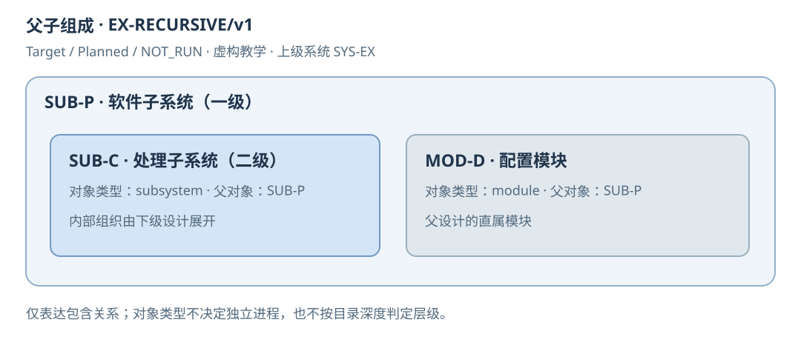
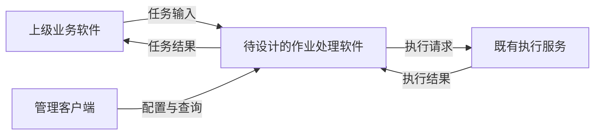
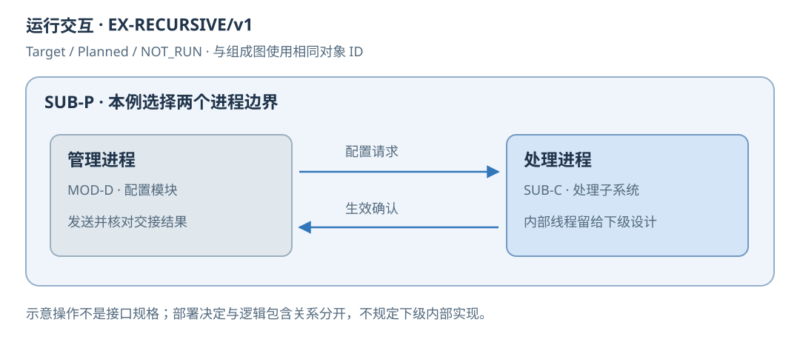

<!-- STD_DOCUMENT_COVER_BEGIN -->
# {{document_title}}

| 文档字段 | 值 |
|---|---|
| Document ID | `{{document_id}}` |
| Document Version | `{{document_version}}` |
| Status | `{{document_status}}` |
| Project | `{{project}}` |
| Document Owner | {{document_owner}} |
| Last Modified Date | `{{last_modified_at}}` |
| Template ID | `{{template_id}}` |
| Template Version | `{{template_version}}` |
<!-- STD_DOCUMENT_COVER_END -->

> 本模板用于子系统概要设计：先说明整体方案，再逐层展开功能、软件/逻辑架构和运行设计。
> 模块细节使用 `design.definition`，板卡/FPGA 使用领域专项；公共协作协议由机制或接口文档唯一维护。
> 按附录 A 确定适用范围；先写连续正文，再用图表汇总，不以文件清单代替设计。
> 编写方法见所采用 STD 的 `docs/ai-authoring-guide.md` 和 `docs/ai-guides/unit-design.md`。

> 软件子系统重点设计模块组织、进程/线程、通信、配置及业务处理；不是函数、类或源文件的详细设计。
> 软硬件组合按真实范围说明分工，板卡和 FPGA 内部实现仍交专项。通用标题可按实际业务扩展子节。
> 子系统可以包含下级子系统及直属模块；本文只展开直属组成。第 0/1 层表示观察粒度，
> 不表示一级/二级子系统。递归父链与文档身份规则见 §2.3；不能把下级子系统自动降格为模块。

## 1. 概述

本节编写建议、规范与示例

**本节目的**：让只读开篇的人理解本子系统为什么存在，以及它在系统业务中的位置。

**必须写清楚**：谁在什么业务场景使用、输入来自哪里、经过什么主要处理、结果交给谁；说明本版本实现范围、相邻子系统和明确不负责的事情。

**编写规范**：用约一页自包含叙述走通代表任务，解释划分这一边界的理由与代价。系统背景只保留必要条件，不能抄系统概览或列几个模块链接。说明适用版本、配置、部署拓扑，分开 Current/Target 与实现、验证状态。

**抽象示例**：虚构作业处理子系统接收已授权的计算任务，在给定资源额度内执行并返回结果；客户认证和结果展示属于相邻子系统。采用统一准入是为了控制峰值资源，代价是容量不足时必须显式拒绝。

**完成条件**：新读者能复述何时使用、做什么、输出什么及不保证什么；未实现的设计不会被当成现状。

<!-- 写入本子系统的连续说明，必要时补一张用途/环境图；不要照抄虚构任务系统。 -->

## 2. 功能需求与设计约束

本节编写建议、规范与示例

**本节目的**：把系统分工转成子系统可执行的设计输入，而非重新决定系统级政策。

**必须写清楚**：上级 Document ID、版本和不可变 commit/hash、Constraint/Capability ID、决定状态、适用条件、预算及行为保证；逐项关联本地功能、不能改变的部分、自由度和验收责任。

**编写规范**：先检查输入是否足够。未决的公共语义返回上级，不用本地假设替代批准；允许做有标记的预设计，但关键保证未定不能判为设计完成。功能覆盖全部正式入口及必要的拒绝结果，不把“有模块”算作能力实现。共享预算在 §14 统一分配。

**抽象示例**：上级分配 64 MiB 私有内存上限并要求过载不侵占其他子系统；本地可以选择数据结构，但不能把拒绝改成无限排队。延迟条件若未给负载范围，先补输入而非自行声称满足。

**完成条件**：每个上级分配项都有本地落实和验证位置；每个本地功能有来源或明确的新增设计决定。

| 上级基线 / Constraint ID / 决定状态 | 条件及预算/行为保证 | 本地 Capability ID | 不可改变 / 自由度 | 落实章节 / 验证责任 | 差距与反馈 |
|---|---|---|---|---|---|
| <!-- TODO --> | | | | | |

| Capability ID | 场景 / 入口 | 输入、主要行为与输出 | 异常/拒绝结果 | Planned/Implemented | 验证判据与实际状态 |
|---|---|---|---|---|---|

### 2.1 主要功能设计（按能力展开）

本节编写建议、规范与示例

**本节目的**：把功能名称展开成用户或上级软件能理解的行为，为总体方案提供完整输入。

**必须写清楚**：每项主要功能何时使用、由什么入口触发、输入条件、主要处理、输出和失败结果；存在页面或命令时说明操作任务与反馈，不只列 UI 名称。

**编写规范**：按业务能力建立子节，不按函数名拆需求。这里定义做什么及关键行为，§3 解释整体实现方案，§4 分配模块；局部处理规则在对应正文唯一维护。注明不支持场景和版本范围，不以“提供管理功能”替代实际功能设计。

**抽象示例**：查询任务状态需要能区分未受理、处理中、已完成和结果不可取得等契约允许的结果；哪些查询可以重做、任务结束后保留多久，须依据已有要求决定，不能由页面设计随意补上。

**完成条件**：每项核心功能有可观察结果和边界，读者知道要实现什么，不必从接口名字倒推功能。

<!-- 按实际主要能力扩展子节；表格作为目录，正文说明功能。 -->

### 2.2 与系统设计的对应关系

本节编写建议、规范与示例

**本节目的**：将系统已经作出的决定落实到本范围，防止预算一致而身份、模式或执行顺序发生漂移。

**必须写清楚**：系统文档固定基线，组件/功能 ID、Mode ID、Process/Step ID、Topology/实例及 Constraint ID；说明系统决定、本地细化和下级自由度的边界。

**编写规范**：沿上级已分配范围逐项检查，使用原 ID 加本地对应关系，不另起同义身份。不要求照搬章号或全系统目录；未适用项说明理由。发现上级拓扑或步骤无法落实时反馈原决定方，不自行替换。系统图与本文模块/运行图保持不同粒度，引用相同外部边界。

**抽象示例**：系统规定先确认配置有效再开放入口，本地可决定内部函数组织，不能改成先接任务再异步加载配置；新增内部步骤须标明是细化，不改变上级外部可见顺序。

**完成条件**：每项分配都有本地设计与验收位置，新增决定可识别，系统变更能定位到受影响的模块、接口及测试。

| 系统基线 / 组件、功能、Mode、Process/Step、Topology或Constraint ID | 系统已定内容 | 本地细化 / 对应 ID及章节 | 下级自由度 | 组合验证 / 差异反馈 |
|---|---|---|---|---|

### 2.3 对象身份、递归父链与展开深度

本节编写建议、规范与示例

**本节目的**：明确本文设计哪个对象、直属父对象是谁以及哪些内部设计留给下级。

**必须写清楚**：本对象 ID、类型、父对象 ID、父设计 Document ID 与基线；metadata 的 parent_document_id、从系统根计算的子系统深度及本层可决定的范围。

**编写规范**：所有深度的子系统使用 design_level=subsystem，父链复用 parent_document_id；文档类型不等于对象身份，路径深度不等于分解深度。系统根的直属子系统为一级，子系统每向下一层加一级；父引用缺失、跨项目或成环时不能宣称层级成立。直属对象可同时有 subsystem 和 module。正文对象与父文档组成表人工核对，结构检查不证明业务归属。必要跨层约束标明来源、目标对象、理由及自由度，不把观察图当成内部实现承诺。

**抽象示例**：虚构 SYS-EX 的一级软件子系统 SUB-P 包含二级处理子系统 SUB-C 和直属配置模块 MOD-D；SUB-C 仍采用 design.subsystem，由自己的设计确定内部组织。SUB-P 只规定其调用边界和完成保证，不指定其内部线程数。

**完成条件**：对象、文档、类型与父链能对应，未成文父设计记缺口；同一对象在组成、运行和验证视图中身份不变。

| 本对象 ID / 类型 | 本 Document ID | 父对象 ID / 父设计 Document ID与基线 | parent_document_id核对 / 推导深度 | 本层决定 / 下层自由度 / 跨层约束 |
|---|---|---|---|---|

<!-- STD_TEMPLATE_EXAMPLE_BEGIN -->

图 R1｜虚构 EX-RECURSIVE/v1，Target / Planned / NOT_RUN。SUB-P 是 SYS-EX 的一级子系统，
内部 SUB-C 是二级子系统，MOD-D 是直属模块；其对象 ID、类型和父对象同时列在图中。
DOC-P.parent_document_id=DOC-SYS；DOC-C.parent_document_id=DOC-P；DOC-D.parent_document_id=DOC-P。
DOC-SYS 的 design_level=system，DOC-P 与 DOC-C 均为 subsystem，DOC-D 为 module。
这些名称仅为教学，不生成项目文档或提前批准内部方案。
<!-- STD_TEMPLATE_EXAMPLE_END -->

## 3. 总体方案（第 0 层设计）

本节编写建议、规范与示例

**本节目的**：在拆模块之前解释子系统整体如何工作，让读者先看懂方案而不是先看目录。

**必须写清楚**：子系统在上级环境中的位置、主要输入输出、处理原理、功能分区、业务面与控制/管理面的关系、依赖的软硬件平台及主要方案取舍。

**编写规范**：第 0 层是观察粒度，不要求新增一层软件。把子系统作为整体讲透一条业务路径：输入怎样变成输出、配置怎样影响处理、为什么该方案满足约束。采用系统已定政策，不重选全产品架构；概要设计需要确定本范围的方案，不能以“遵循上级”代替。

**抽象示例**：虚构作业处理软件从业务入口接受合法任务，按当前有效配置选择既定执行能力，将执行结果转成调用者可理解的状态；管理入口改变后续准入条件，不直接修改已经执行的任务。选择集中准入而非后端各自接受，是为统一控制软件范围内的负载。

**完成条件**：不看模块章节也能解释处理原理、外部边界、配置作用和关键代价；不是把 §1 的用途再写一次。

<!-- 按实际对象写入设计正文，图表只作汇总。 -->

### 3.1 软件与环境的整体关系

本节编写建议、规范与示例

**本节目的**：划清待设计软件和运行平台，避免把一般操作系统当自研功能。

**必须写清楚**：用户/相邻软件、受控设备或外部服务、输入输出和部署约束；标出软件边界、访问方向以及控制和业务路径。

**编写规范**：画上下文图并解释边界，图中环境不是内部模块。通用 OS/运行库只记录依赖和所需能力，只有实际定制的启动、BSP 或 OS 才展开设计。设备接口在此是外部连接，不能和软件模块混为一层。

**抽象示例**：虚构处理软件运行在既有主机上，调用已定义的执行服务；操作人员通过管理客户端配置，客户端不被默认为软件内部线程。

**完成条件**：每个外部对象与主要输入输出清楚，未把物理部署误当功能分层。

<!-- 按实际对象写入设计正文，图表只作汇总。 -->

<!-- STD_TEMPLATE_EXAMPLE_BEGIN -->
**上下文图例｜虚构 EX-JOB/v1，Target / Planned / NOT_RUN**

只有中央软件属于本次设计范围；其他对象是既有外部环境。配置通道改变允许的处理条件，
业务通道传递任务及结果，二者不是两份独立任务状态。此图表达边界，§4 才展开内部组成；
具体协议由项目固定来源定义，图中文字不是可调用接口或实际部署证据。
<!-- STD_TEMPLATE_EXAMPLE_END -->

### 3.2 整体处理方案与功能分配

本节编写建议、规范与示例

**本节目的**：确定软件自身的工作原理和主要设计选择。

**必须写清楚**：主要工作模式、输入到输出的变换、业务处理与控制的关系、功能如何分区，以及方案选择对容量、可靠性和复杂度的影响。

**编写规范**：先用正文或处理框图说明原理，再把 §2 功能分配到主要部分。模式不同要解释路径和约束差异；没有多个模式则不编造。详细算法留后续模块设计，但会改变跨模块结果的算法/政策必须现在决定。

**抽象示例**：接收后先统一校验与容量准入，再交执行端，完成后统一转换结果。若允许异步返回，概要设计必须决定完成查询与结果寿命，不能等各模块自行选择。

**完成条件**：所有核心功能能找到方案中的位置，方案中的每个主要部分有必要性与设计依据。

<!-- 按实际对象写入设计正文，图表只作汇总。 -->

## 4. 软件架构与模块分解（第 1 层设计）

本节编写建议、规范与示例

**本节目的**：解释内部由哪些主要部分组成、为什么这样分工，以及组合起来如何实现能力。

**必须写清楚**：层次与包含关系、各模块职责及非职责、部署/执行单元映射、状态和资源所有者、模块之间的协作边界；逐个说明图中的组件做什么。

**编写规范**：组成图只突出层次和归属，左侧层名、无图标模块、不用连接线冒充流程。交互放 §8。逻辑模块不等于独立进程，必须说明共享或独立运行边界。可以预先定义下游文件名，但 Planned 文件不是已经存在的权威文档；模块父子关系与前置依赖分开。

**抽象示例**：入口与准入检查任务，任务控制统筹执行，执行适配对接既有计算接口，结果管理提供状态与结果。四个逻辑模块可同进程，不因画了四个框就引入四个服务；切分原因是把资源准入与具体执行后端隔开。

**完成条件**：功能能够定位到责任模块，没有两个模块同时拥有同一决定；下游知道自身边界及输入，而不是只得到文件名。

<!-- STD_TEMPLATE_EXAMPLE_BEGIN -->

图 S1｜EX-JOB/v1，Target / Planned / NOT_RUN。仅表示内部组成，不表示调用顺序或独立部署。
准入决定能否接受任务；任务控制拥有任务生命周期；执行适配负责调用既有执行接口；结果管理保存可查询结果。
这是一种教学分解，不要求项目新增调度、缓存或结果库。[可编辑 SVG](../diagrams/subsystem-layered-architecture.svg)。
<!-- STD_TEMPLATE_EXAMPLE_END -->

| 对象 ID / 类型 / 父对象 ID | 职责 / 非职责 | 部署单元 / 实现位置或 NOT_IMPLEMENTED | 拥有的状态/资源 | 下级设计入口（Document ID / 模板类型 / 计划文件名 / 状态） | 前置依赖 |
|---|---|---|---|---|---|
| <!-- TODO --> | | | | | |

### 4.1 直属组成概要设计（按子系统或模块展开）

本节编写建议、规范与示例

**本节目的**：在软件整体方案下逐个说明主要模块如何承担功能，而不是只填写职责表。

**必须写清楚**：每个直属子系统或模块的用途、承担功能、输入输出、概要原理、与其他直属对象协作、状态/资源边界及约束；说明不负责的行为。

**编写规范**：按直属对象复制本节，标明 subsystem 或 module，说明接收什么、怎样处理、交给谁及为什么。对子系统解释其整体原理、边界和保证，不在父稿决定其内部线程、模块或算法；直属模块可写本层所需的模块概要。必要跨层约束显式说明来源、目标对象、理由和保留的自由度。这个粒度不展开函数逐行逻辑、私有字段或所有源文件；不能只列对象名、Owner 和计划文档。

**抽象示例**：入口与准入统一校验请求及可用额度，只有成功预留所需资源后才交任务控制；任务控制决定后续状态，准入不直接判断执行结果。尚未选定的预留/释放协作规则须先解决，不能推给两个模块各自设计。

**完成条件**：读者能解释直属对象的主要工作及协作，组合没有行为空白，也没有越权冻结下级内部实现；不以“实现业务逻辑”作为处理说明。

<!-- 按直属对象建立 4.1、4.2 等子节，标明子系统/模块；调整编号并同步引用，不强制保留示例名称。 -->

## 5. 运行设计

本节编写建议、规范与示例

**本节目的**：说明静态模块在运行时如何组织、调度和协作。

**必须写清楚**：直属对象到运行边界/实例的映射，本层负责的进程/线程/任务组织，通信方式与同步异步边界、并发和阻塞、运行模式、生命周期及故障隔离。

**编写规范**：逻辑分层不等于进程划分；本文确定直属对象的运行边界及跨边界交互，下级子系统内部线程由下级决定。若父级必须约束进程/隔离域，按 §2.3 标记跨层约束。单进程也解释本层执行上下文、并发及等待；通用软件不设计无关内核，RTL 时钟和电气细节由专项承接。

**抽象示例**：准入和状态管理可在同一事件循环，阻塞执行由既有执行端承担；等待执行响应时不能堵住取消和查询。选择理由是减少共享写入，但长耗时动作必须移出该循环。

**完成条件**：开发者知道软件怎样运行和通信，而不只是知道有哪些模块。

<!-- 按实际对象写入设计正文，图表只作汇总。 -->

### 5.1 运行单元、调度与通信

本节编写建议、规范与示例

**本节目的**：把模块映射为能够实际运行的组织方案。

**必须写清楚**：进程/线程/任务数量或创建规则、模块归属、实例身份、共享数据、通信载体、消息方向、队列/阻塞和并发限制。

**编写规范**：给运行部署图或通信图，箭头标数据/操作和同步性质；数量须有负载依据，不默认每模块一个进程。并发资源上限引用 §14，公共接口引用 §7，不复制第二份定义。

**抽象示例**：一个控制进程维护状态，调用既有工作端；如果改成多个工作端，说明如何选端及谁拥有任务，不能只将框复制多份。

**完成条件**：每条跨运行单元交互有通信方案，等待不阻塞必须响应的控制操作，共享写入有明确统筹。

| 运行单元 / 创建规则 | 承载模块 | 调度/并发 | 通信与同步方式 | 共享数据/故障边界 |
|---|---|---|---|---|

<!-- STD_TEMPLATE_EXAMPLE_BEGIN -->

图 R2｜与 R1 相同 EX-RECURSIVE/v1，Target / Planned / NOT_RUN。本例假设父级已选择两个进程边界，
MOD-D 在管理进程，SUB-C 整体在处理进程，配置请求和生效确认跨边界；没有展开 SUB-C 内部线程。
这是有标记的运行边界决定，不从“子系统”类型推导独立进程；其他部署方案仍按实际输入设计。
箭头是示意操作，不是新增的项目接口规格或运行证据。
<!-- STD_TEMPLATE_EXAMPLE_END -->

### 5.2 启动、运行与退出

本节编写建议、规范与示例

**本节目的**：确定生命周期的顺序、就绪条件和异常退出责任。

**必须写清楚**：依赖初始化、配置装载、通信建立、就绪发布、正常停止、重启与在途处理；说明失败后能否重试及退出顺序。

**编写规范**：在业务入口打开之前定义可核对的就绪事实；退出要能停止接受新工作并按既有语义收口。静态嵌入式组件可以由父单元调用初始化，不强建独立启动服务。

**抽象示例**：建立执行连接、核对配置并完成必要检查后开放准入；退出先关入口，再处理在途并释放本单元资源。依赖不就绪不得发布虚假的 Ready。

**完成条件**：从启动到服务再到退出的全过程有明确责任和可观测结果；反向依赖不会造成互相等待。

<!-- 按实际对象写入设计正文，图表只作汇总。 -->

## 6. 数据与状态设计

本节编写建议、规范与示例

**本节目的**：定义任务及数据在内部怎样变化、由谁决定其状态、何时可以访问和释放。

**必须写清楚**：对象身份与版本、生产/消费方、唯一写入者、合法状态转换、Guard 的事实来源、易失和持久状态、可见性、寿命及回收条件。

**编写规范**：无数据库不代表无状态，在途请求、缓冲区、取消和复位都要分析。区分结果已知性、执行是否停止、访问是否安全、终态和资源释放；关键条件必须说明通过什么接口/事件/证据产生，不能靠测试直接改内部状态才收口。机器字段引用唯一来源，正文解释其语义。

**抽象示例**：等待超时只表示未拿到结果，不证明执行已停止；执行适配给出可核对的停止证据后，任务控制才允许释放相关资源。若既有协议不能提供证据，保留阻塞与升级路径，不臆造安全回收。

**完成条件**：每个对象有完整生命周期，等待有合法出口，失败与取消不会留下无主资源或允许迟到写入已释放对象。

| 对象 ID / 类型来源 | 唯一 authority / 所有者 | 创建与可见条件 | 事件 / Guard来源 / 转换 | 释放条件与责任 | 异常 / 迟到处理 |
|---|---|---|---|---|---|

### 6.1 核心数据模型与组织

本节编写建议、规范与示例

**本节目的**：明确子系统需要哪些数据、相互怎样关联以及为什么采用这种组织方式。

**必须写清楚**：业务对象关系、逻辑键/关联、必要共享字段、适用的表/索引/缓存/文件及其选择依据、读写责任、一致性和容量条件。

**编写规范**：只展开实际需要的存储形态，不为模板新增数据库或缓存。共享模型在概要阶段确定，私有字段和具体容器实现留模块详细设计。已有机器定义展示必要解释性摘要并标注来源，不能只放链接，也不维护第二份字段规范。

**抽象示例**：虚构任务对象关联输入引用与结果引用；若查询按任务身份进行，说明查找组织、唯一性和结果保留边界。不能只写“采用哈希表提高性能”，也不能因此假设一定需要持久库。

**完成条件**：读者能解释主要对象的关系、查找和更新方式，设计不只剩状态名称及释放条件。

| 数据对象 / 固定类型来源 | 关联与逻辑键 | 组织选择及依据 | 读写/一致性 | 容量与保留约束 |
|---|---|---|---|---|

### 6.2 数据形态与阶段变换

本节编写建议、规范与示例

**本节目的**：使主流程中同一份数据的变化可以被理解和核对。

**必须写清楚**：与 §8 对应的 Data/Stage ID，处理前后形态、生产者和消费者、保留/增加/修改/删除的内容，拆分合并、共享引用及实际复制的区别。

**编写规范**：提供代表对象的前后示意与必要取值，说明变换依据和下游用途；格式摘要绑定唯一机器来源。旁路元数据须说明与业务数据的关联范围，不能把阶段箭头默认解释为内存拷贝。没有某种变换则明确不变及交接条件。

**抽象示例**：虚构输入字符串经校验形成任务参数，执行后形成状态与结果引用；校验诊断不必进入正式业务结果。说明哪些值原样保留，哪些按规则转换，不反复写“数据加元数据”。

**完成条件**：主流程、数据阶段与资源预算一致；并发分支可关联、合并条件明确，没有无法解释的数据损失或复制。

| Data/Stage ID / Process对应 | 前后形态及类型来源 | 变换规则 / 原因 | 生产者→消费者 | 共享、复制或拆合 / 生命周期 |
|---|---|---|---|---|

## 7. 接口设计与 interfaces 映射

本节编写建议、规范与示例

**本节目的**：使模块双方能够从设计定位到真实可调用的接口和数据类型，而不是自行猜参数。

**必须写清楚**：公共和内部接口的成员 ID、请求/响应或信号方向、固定源签名、跨字段条件、错误行为、调用上下文、全部 backend、提供/消费模块以及实现与验证位置。

**编写规范**：遵循 `docs/interface-data-mapping-standard.md`，引用 source version/revision/hash 和 selector；目录是导航，不成为第二份类型定义。提供一组具体请求、响应及拒绝实例并逐步模拟双方。规格或机器定义缺失是设计/规格缺口，不能用 NOT_IMPLEMENTED 代替；规格完整但代码未实现才记 NOT_IMPLEMENTED。两者分别记录，不能造形式完整的映射。标准接口注明标准版本与项目绑定，硬件/ABI/RTL 的原生检查不由 JSON 目录替代。

**抽象示例**：submit 的 response 映射必须指向响应类型而不是同名请求类型；取消参数必须足以定位原任务及适用实例。Host/驱动/FPGA 的布局与停止边界可参考 STD 的虚构 EX-XFER 教学案例，但不照搬为项目协议。

**完成条件**：输入实例能让接收方唯一确定对象和下一步，request/response 角色与完整性核对通过；全部必需消费者来自独立设计范围，不从已完成映射反推分母。

| Interface/Member ID / 角色 | 唯一源路径 / selector / version/revision/hash | 提供/消费模块与 backend | 条件 / 错误规则 | 实现文件/symbol或 NOT_IMPLEMENTED | 设计验证项 / Case / 环境 / Run |
|---|---|---|---|---|---|

### 7.1 接口权威范围与规格状态

本节编写建议、规范与示例

**本节目的**：让不同层级各自维护应负责的接口，既不上推所有细节，也不让两端独立定义共同协议。

**必须写清楚**：系统公共接口、本层直属对象间接口、下级私有接口的所属对象、唯一设计/机器来源、影响范围及变更责任；规格完整性和代码实现状态分别记录。

**编写规范**：系统公共接口继承原权威。本层新增直属对象间协议由本层负责，必要时委托唯一机制/接口文档，再分配双方实现；不要求全部上推系统。下级私有接口在下级维护，父设计只约束外部保证。任一接口变更影响父级公共保证时上报影响，不因原本称私有就免除核对。规格尚未定义记录具体缺口；规格完整/代码未实现才用 NOT_IMPLEMENTED，已有代码也不能补造缺失规格。

**抽象示例**：SUB-P 定义 MOD-D 与 SUB-C 之间的配置交接，双方引用同一来源；SUB-C 的内部工作队列由其下级设计决定，SYS-EX 的公共管理语义则继续在系统契约维护。

**完成条件**：每个接口的唯一维护位置和变更边界清楚，规格缺口与实现缺口不能互相掩盖。

| IF/Member ID | 系统公共 / 本层直属 / 下级私有 | 所属对象 / 唯一维护位置 | 提供与消费对象 | 规格状态及缺口 | 实现状态 | 变更影响范围 |
|---|---|---|---|---|---|---|

## 8. 关键业务流程与机制协作

本节编写建议、规范与示例

**本节目的**：把静态模块分解串成可以逐步执行、推演和验收的过程。

**必须写清楚**：业务主路径及其取消/恢复分支，关联 §5 生命周期与 §9 配置生效过程；每步执行者、输入对象、接口、状态变化、完成证据、失败出口和后续依赖。描述数据在哪里产生、处理、传递及对外可见。

**编写规范**：按实际复杂度扩展“8.1 业务处理”“8.2 异常业务”等子节，不机械增加不存在的能力；每个新增子节仍写目的、机制、边界、取舍和验证。时序图画等待及失败分支，不能用组成图代替。公共机制步骤只作本地落实视图，不复制权威状态表。写清在途任务遇到配置变更或停止时的顺序。

**抽象示例**：先建立执行连接并确认配置就绪，再打开准入；业务路径沿准入、执行、结果可见展开。停止时先关闭准入，再按已有契约处理在途任务与资源；不让“等待全部结束”和“撤销在途”互相等待。

**完成条件**：代表输入及适用的取消、迟到、并发配置变更都能走通；每个等待有超时或其他明确出口，无法安全继续时保持有依据的阻塞而非伪造完成。

| Process/Step ID | 执行模块 / 接口 | 前提与输入 | 动作 / 状态或数据变化 | 完成事实及来源 | 失败出口 / 下一步 |
|---|---|---|---|---|---|

| Mechanism ID / 上级 Mechanism ID | 固定文档基线 / 计划路径与状态 | 本地角色 / Step/Rule ID | 对端与 backend | 前置依赖 |
|---|---|---|---|---|

<!-- 上级机制表示包含关系，前置依赖表示顺序条件；计划文件不是已成立的协议来源。 -->

### 8.1 跨模块业务过程（按场景展开）

本节编写建议、规范与示例

**本节目的**：将功能概要、模块架构和运行设计连成实际业务。

**必须写清楚**：每个主要场景的输入条件、参与模块/运行单元、处理顺序、数据变化、结果可见点及异常分支；所参与公共机制的角色和固定 Rule/Step ID。

**编写规范**：按实际业务命名子节，不强制使用“作业”。共用规则唯一维护，完整流程保留足够原理；模块职责图不是流程图。与 §5 生命周期、§9 配置过程交叉时引用共同步骤，避免维护两套状态。

**抽象示例**：一次请求经过准入、执行、结果转换与返回；超时后可查询的结果状态和取消对在途的影响必须与既有接口一致，不能让各模块分别猜测。

**完成条件**：代表业务能按图和正文逐步推演，同时覆盖关键失败；接口实例、状态及控制过程无冲突。

<!-- 按实际对象写入设计正文，图表只作汇总。 -->

## 9. 配置管理设计

本节编写建议、规范与示例

**本节目的**：定义配置如何从管理入口成为真正影响业务的有效状态。

**必须写清楚**：配置来源和 authority、作用域、校验与关联约束、下发与确认、有效版本、持久化适用性、失败回退和在途行为。

**编写规范**：不能只写配置字段表；说明接收、校验、应用和生效的区别，在哪个时间点可以读回确认。应用不原子时明确部分成功及恢复，公共语义先依据已选契约。没有运行配置则说明固定参数的装载与更换边界。

**抽象示例**：新额度只对后续准入生效，已有任务继续按原保证完成；管理端读到版本不一定证明所有执行端都已生效，必须使用契约指定的确认事实。

**完成条件**：配置能走通下发到生效的全过程，失败/并发更新有确定行为，不制造未定义的双版本运行。

| 配置范围 / 来源 | 校验及关联约束 | 接收→应用→生效 / 确认事实 | 在途影响 | 失败与回退 |
|---|---|---|---|---|

## 10. 异常处理、可靠性与安全设计

本节编写建议、规范与示例

**本节目的**：定义故障和越权如何被限制在边界内，保证恢复不会造成重复副作用或扩大影响。

**必须写清楚**：权限/信任边界、敏感数据、单模块失效和依赖失联、过载、部分完成、恢复范围与重新准入；适用的硬件复位、时钟或电源域故障交给领域设计承接。

**编写规范**：复用安全计划与公共机制，确定本地执行点及责任。结果未知不等于可以重试；先确认旧执行者停止或隔离，满足幂等/去重条件才重试，否则阻塞或转人工。故障注入不是生产恢复策略，不能把“报警”当隔离完成。

**抽象示例**：执行连接断开时关闭受影响实例的准入并保留未知状态；只有权威状态或安全隔离证据足够才收口，不对所有实例无差别复位。

**完成条件**：每类适用故障有检测来源、影响范围、恢复条件及安全出口，重新准入不会绕过原约束。

| 故障/威胁 | 检测事实及来源 | 影响 / 隔离范围 | 停止与恢复责任 | 重新准入条件 | 注入验证 / 残余风险 |
|---|---|---|---|---|---|

### 10.1 信息安全责任与执行点

本节编写建议、规范与示例

**本节目的**：把系统安全要求落实成子系统的技术检查，而不是只引用安全计划。

**必须写清楚**：适用的资产/信任边界、认证来源、身份传播、授权校验点与执行点、凭据及敏感数据寿命、管理/调试权限、启动和更新产物的信任检查。

**编写规范**：沿系统安全分配的入口逐个写本地检查及失败行为，不能用内网可达代替授权。系统已有身份和信任政策不重选；由上级执行的检查要明确其保证和本地验证前提。认证依赖失效、身份撤销和更新校验失败按唯一契约处理。凭据不得进入示例或日志；适用性不由是否联网决定。

**抽象示例**：管理请求携带已验证身份，但本地仍按分配职责检查目标范围；签名或授权检查失败不能降级为无检查继续执行。若校验由可信上级完成，应说明如何确保输入只来自该边界。

**完成条件**：每个敏感操作有固定来源、责任点和失败结果，权限/更新/日志要求一致，并关联安全验证及残余风险。

| 系统安全要求 / 入口ID | 资产、身份与信任边界 | 上级保证 / 本地检查与执行点 | 失效/拒绝行为 | 验证与残余风险 |
|---|---|---|---|---|

## 11. 可调试性设计

本节编写建议、规范与示例

**本节目的**：在概要阶段确定发现和定位问题所需的软件能力及安全边界。

**必须写清楚**：调试信息分类、模块/功能级开关、加载更新、输出方式和关联标识，以及查询、受控替代/注入/环回的适用入口；说明在哪台设备、通过什么通道执行。

**编写规范**：定义调试能力，不在此复制所有命令参数。明确生产与测试权限、开销、敏感信息、对业务影响、退出和复位。不存在的调试后门不为满足模板而新增；共享接口指向 §7 的唯一来源。

**抽象示例**：调试开关可限定模块与任务关联信息，避免全局详细输出淹没业务；开启有期限或明确关闭方法，远程客户端和目标执行端不得混写。

**完成条件**：出现问题时知道从哪里控制什么、观测什么、怎样关闭；不以“增加日志”代替调试方案。

<!-- 按实际对象写入设计正文，图表只作汇总。 -->

### 11.1 调试入口、控制范围与退出恢复

本节编写建议、规范与示例

**本节目的**：确定实际可使用的调试通道及其不会越界的控制规则。

**必须写清楚**：客户端所在位置、目标实例、通道与授权、接口 ID、开关/控制粒度、生效确认、业务影响及中止/退出条件。

**编写规范**：按适用性核对状态查询、分级输出、受控替代/注入/环回；不存在的能力不新增。控制成功必须有可核对事实，断连不自动表示调试已关闭；说明恢复责任和可用出口。具体参数引用 §7，生产/测试边界遵循 §10.1，不另造协议。

**抽象示例**：远程开启一个实例的详细输出，不影响其他实例；关闭后读回确认有效状态。若客户端消失，按既定超时或显式回收规则恢复，不猜测控制已失效。

**完成条件**：操作者知道在哪里控制什么、怎样确认和恢复；调试范围不扩大成全系统复位。

| 调试能力 / IF ID | 客户端、目标与通道 | 权限 / 范围 | 生效事实 / 业务影响 | 退出与恢复责任 |
|---|---|---|---|---|

## 12. 可维护性与升级设计

本节编写建议、规范与示例

**本节目的**：让运行人员能够判断状态、定位故障并安全恢复或升级。

**必须写清楚**：统计口径、日志分类/级别/关联及容量策略、健康状态/指示、自检与诊断、维护入口、版本兼容、升级和回滚边界。

**编写规范**：统计、自检、诊断属于维护设计；调试细节引用 §11，命令契约引用 §7。给出上报/清零、保留/丢弃和敏感信息要求，避免无限日志。升级需确定在途状态、用户数据和配置兼容，详细操作步骤留运维文档。

**抽象示例**：业务拒绝计数区分校验失败与容量不足，累计值说明复位口径；升级失败不能通过删除用户数据获得表面成功。纯内部组件由父系统升级时，说明其兼容要求而非另造升级器。

**完成条件**：维护方案能回答状态如何判断、问题如何定位、恢复如何验证；没有把日志文件存在当作可维护性完成。

<!-- 按实际对象写入设计正文，图表只作汇总。 -->

### 12.1 统计与日志

本节编写建议、规范与示例

**本节目的**：使系统侧能够一致解释子系统产生的运行信息。

**必须写清楚**：继承的指标/事件 ID、生产点、单位和范围、累计/窗口口径、复位/溢出、关联身份及时间基准、保留/丢失检测和脱敏。

**编写规范**：先引用系统已有指标与日志契约，再说明本地采集点和必要扩展；不重新定义同名信号。区分受理与完成计数、迟到事件窗口及重启代次。开销纳入 §14，字段来源放 §7；统计清零不等于清除业务状态。

**抽象示例**：完成计数在权威完成记录成立时增加，不在接收时增加；重启后读取方可辨认计数代次，不能跨代次相减算吞吐。日志被限流时记录丢失情况。

**完成条件**：同一指标跨组件含义一致，定位任务和统计变化有依据，不能靠日志文件存在宣称可维护。

| 系统指标/事件 ID | 本地生产点 / 使用目的 | 单位、范围、窗口 | 复位/溢出/关联 | 保留、丢失与权限 |
|---|---|---|---|---|

### 12.2 自检与诊断

本节编写建议、规范与示例

**本节目的**：把检查能力设计成能安全执行、解释结果并退出的过程。

**必须写清楚**：检查项目、触发/授权、前置依赖与顺序、输入/判据、覆盖路径、正常和失败定位粒度、业务影响、超时/中止及退出恢复。

**编写规范**：继承系统自检编排和检查 ID，本地展开负责的步骤；生产自检不等于测试套件全跑。依赖失败时区分 FAIL、未执行及不适用，不能把跳过算通过。仅链路内部检查不能证明外部业务正确，结果格式引用公共契约。

**抽象示例**：本地连接自检只证明所覆盖路径，外部执行服务不可用时相关业务诊断保持未完成；先恢复被调试设置改变的状态，再宣布诊断退出。

**完成条件**：从调用到结果和恢复均能推演，失败定位与未覆盖范围明确，不因局部自检通过宣布系统健康。

| 检查ID / 系统编排步骤 | 触发与依赖 | 方法与判据 | 覆盖/定位边界 | 业务影响 / 退出恢复 |
|---|---|---|---|---|

### 12.3 升级与回滚

本节编写建议、规范与示例

**本节目的**：在既定系统升级政策内确定本地切换和恢复的可行性。

**必须写清楚**：采用的升级范围、兼容组合、在途处理、配置/数据格式变化、切换确认、失败保留状态、可回滚条件与不可回滚边界。

**编写规范**：兼容组合唯一引用 §14.1 及系统来源，此处设计切换过程。不得假设回退二进制就能回退数据；只由父系统统一升级时写本地参与条件，不另建升级器。保留用户数据，更新信任检查按 §10.1 执行。

**抽象示例**：新版本改了存储格式，须明确旧版能否读取及何时不可回退；若不能，按既定恢复方案处理，而不是删除数据重装。

**完成条件**：升级成功和回滚成功分别有判据，兼容、配置、在途和用户数据保护不矛盾。

<!-- 说明升级/回滚阶段及每个确认条件；操作脚本留交付文档。 -->

## 13. 可部署性、可测试性与验证设计

本节编写建议、规范与示例

**本节目的**：确定如何独立判断结果正确，并让验证环境可以反复、并行、自动运行。

**必须写清楚**：主要测试方法、输入构造和独立 Oracle，部署与复位、替代依赖及局限、并发测试隔离、故障控制、失败复现和自动化产物；区分模块测试、子系统组合测试与系统验证。

**编写规范**：例如模型相关子系统可构造 prompt 并按固定判据检查返回，不把“有响应”当正确；普通子系统用适合对象的方法。环境标注配置/种子/数据/资源命名与清理边界，不复位别人的运行实例。设计 V、可执行 Case、环境要求、Run/证据分别记录；未实现、未运行、失败、不适用均保留分母和依据。

**抽象示例**：两个隔离测试实例同时运行准入/执行/取消，核对资源统计不串实例，并保存输入与事件轨迹。使用替代执行器通过只证明本地逻辑，不关闭真实设备及系统端到端目标。

**完成条件**：所有能力、约束、接口和适用失败路径可追踪到验证任务；结构 PASS 或模块单测不冒充组合通过。

| 被测对象 ID / 类型 / 父对象 ID | Capability/Constraint/Rule/Member ID | 设计 V / 方法与独立 Oracle | Case / 实现状态 | 环境与并发隔离 / 复位 | Run / 证据 / 实际结果 | 验证层级 / 向父级交接责任 |
|---|---|---|---|---|---|---|

### 13.1 部署、交付检查与环境复位

本节编写建议、规范与示例

**本节目的**：确保软件能从交付物进入可运行、可重复验证的环境。

**必须写清楚**：包/镜像与依赖、首次安装和日常重建、配置初值、启动检查、复位范围、失败保留证据；产品带硬件时说明工厂装载/自检需要的软件能力。

**编写规范**：纯软件不套用板卡制造工艺，但不能省略交付安装检查。定义快速部署/复位的入口与时间目标及依据，保护用户数据和别的测试实例；详细脚本或工装实现交相应文档。

**抽象示例**：测试使用独立配置、端口和数据目录，复位只清理自身临时资源；工厂环境若要烧录后自检，应先在软件设计定义可调用入口与结果判据，不能等产线自行补协议。

**完成条件**：可以从固定交付基线达到已知初态，失败不会靠人工猜环境；未测试的部署耗时仍标目标。

<!-- 按实际对象写入设计正文，图表只作汇总。 -->

### 13.2 测试方法与结果判定

本节编写建议、规范与示例

**本节目的**：定义怎样从输入获得足够独立的正确性判断。

**必须写清楚**：主要能力和失败场景的输入构造、边界条件、独立 Oracle、通过标准、真实与替代依赖的验证边界。

**编写规范**：继承系统设计 V 和判据，分解成本地与组合 Case，不修改预期结果来通过。模型软件可用固定 prompt、结构规则与业务判据，不能仅以响应存在或与自身输出比对作为正确。判定依赖人工时标明责任和记录。

**抽象示例**：替代执行端可验证本地结果处理，但真实端的性能与时序仍需独立运行；没有环境的用例保持 NOT_RUN，而不从覆盖分母移除。

**完成条件**：每项保证有可执行或明确待实现的验证方法，局部通过不关闭系统目标。

<!-- 具体 Case/环境/Run 共用本章验证表，不另建一份竞争覆盖清单。 -->

### 13.3 并发隔离与测试控制

本节编写建议、规范与示例

**本节目的**：保证并行验证不会互相污染，也不会误操作其他业务或测试实例。

**必须写清楚**：实例身份、端口/数据/资源隔离、共享额度、控制点及权限、生效确认、故障注入的作用域、超时清理和恢复检查。

**编写规范**：优先复用系统测试控制契约；说明哪些资源独占、哪些共享，无法隔离的项目明确串行而非宣称并发安全。注入接口和调试能力引用 §7/§11，控制开始与撤销都要确认，环境清理不能越过本次资源边界。

**抽象示例**：两个运行使用不同命名空间，但若共用同一设备复位域，不能同时做破坏性复位；应限制该用例并发范围并保留原因。

**完成条件**：正常、失败及清理都能保持隔离，未恢复状态能够阻止下一次不安全运行。

<!-- 给并发可用范围、共享约束与清理确认，不要求新增隔离平台。 -->

### 13.4 自动化执行与复现

本节编写建议、规范与示例

**本节目的**：让同一验证任务能够重复执行并保留真实证据。

**必须写清楚**：准备、就绪、执行、判定、保存结果及清理的自动入口/依赖，固定源码/配置/数据/种子，超时退出和失败复现方式。

**编写规范**：原始结果和判定分开保存；Run 绑定 Case/环境/设计 V 和系统目标，区分环境失败、断言失败及未执行。重跑建立新记录，不覆盖首次失败；清理失败也是运行结果。脚本尚未实现明确标注，不因写出步骤就称自动化完成。

**抽象示例**：固定输入重放一次取消故障，保留事件轨迹和配置版本；新运行成功不擦除第一次无法恢复环境的证据。

**完成条件**：从记录能够恢复输入条件并解释结果，自动化范围与未执行项明确。

<!-- 描述已有或计划的执行入口及产物，引用本章 Case/Run 追踪关系。 -->

### 13.5 验证层级与父级验收承接

本节编写建议、规范与示例

**本节目的**：防止不同深度的“子系统测试”混为同一验证范围。

**必须写清楚**：被测对象 ID、类型和父对象、固定基线、局部保证、参与组合、上级目标及负责接收证据的父设计；Case/环境/Run 与此范围绑定。

**编写规范**：子系统局部验证证明本对象保证，父级组合验证证明其直属组成协作，系统验证证明产品端到端目标。一个对象可同时有内部组合和向父级交接任务，名称中写“集成”不能代替范围。父级引用下级证据并补本层交互验证，不能将子级 PASS 直接改名为父级 PASS。

**抽象示例**：SUB-C 自身校验配置的用例仅证明二级子系统局部行为；MOD-D→SUB-C 的下发与确认由 SUB-P 组合验证；外部管理到业务结果由 SYS-EX 验证。三者可以关联同一要求，但被测对象和运行证据不能混写。

**完成条件**：每项验证能回答测谁、测哪些边界、交给谁，层级提升有新增组合证据而不是仅汇总绿色状态。

| 被测对象 / 类型 / 父对象 | 验证层级 / 参与对象 | 固定基线与要求 | Case/环境/Run / 结果 | 向父级交接的保证 / 尚需验证 |
|---|---|---|---|---|

## 14. 性能与资源设计

本节编写建议、规范与示例

**本节目的**：证明各模块的资源分配和竞争策略组合后仍可能满足上级要求。

**必须写清楚**：负载模型、峰值并发、资源单位/作用域、缓冲和元数据开销、共享额度、预留、竞争与背压规则；时延和吞吐的推导条件及瓶颈。

**编写规范**：预算含额外副本、在途、恢复和管理开销；共享池不重复相加，也不把峰值负载当平均负载。串行时延相加、并行路径按实际关键路径推导。数字注明 Modeled/Simulated/Measured、配置、证据与余量；没有测量不能声称达到性能。

**抽象示例**：虚构 64 MiB 上限可先分配任务驻留 40、结果 12、管理 4、预留 8 MiB，合计 64 MiB；这只是预算，不是最大任务数或实测承诺，仍须以任务尺寸及同时驻留对象推导并发。

**完成条件**：模块预算与总额度闭合，溢出有明确行为；本地性能和系统组合性能的责任分开。

| 资源 / 上级 Constraint ID | 单位 / 配置与负载 | 模块分配 / 共享关系 / 开销与余量 | 峰值推导与超限行为 | 证据等级 / 验证责任 |
|---|---|---|---|---|

### 14.1 扩展与兼容性

本节编写建议、规范与示例

**本节目的**：承接系统允许的扩容和版本组合，避免只有单实例预算而没有组合边界。

**必须写清楚**：固定系统基线/兼容矩阵，扩容单元与上限、调度或分配规则、状态归属和故障域变化；软件/接口/配置/固件等实际相关版本组合及拒绝或降级行为。

**编写规范**：只设计上级允许的扩展，不为固定单实例产品新增分布式方案。系统兼容矩阵保持唯一，本地记录对应行及进一步限制；更宽支持范围须回报批准。区分拟议、已实现和已验证组合，升级切换过程引用 §12.3，不能仅写“向后兼容”。

**抽象示例**：从一个实例扩为两个时说明共享额度和状态如何归属；旧管理端不能表达的新选项必须明确拒绝或按已定策略降级，不能默默忽略。固定单实例则记录上限和不支持扩容的条件。

**完成条件**：有效/无效组合、扩容前后资源与故障边界、验证责任明确；本地成功不扩大全系统支持范围。

| 系统组合/约束 ID | 本地版本与配置组合 | 扩展范围 / 状态及故障域 | 支持状态 / 不兼容行为 | 验证与限制 |
|---|---|---|---|---|

## 15. 实现与下游详细设计

本节编写建议、规范与示例

**本节目的**：将前文设计结果正式交给直属子系统或模块，而不是让下游重新决定共同政策。

**必须写清楚**：各直属对象的类型、父对象、设计输入及固定基线、Constraint ID、预算/行为保证、自由度、下级设计入口及状态、验证边界、实施依赖、Owner 和变更反馈；下级子系统继续用子系统模板，不按深度改成模块模板。

**编写规范**：引用 §2/§3/§14 唯一约束，不另复制一套数值。接口语义、错误行为和测试向量评审后可并行实现，各端契约测试通过再进入集成，组合验证后才关闭整体目标。关键机制未定必须预设计并回写；未实现/未实测可以如实保留。改规则后回查接口、状态、图、资源和用例，记录残留旧语义。

**抽象示例**：执行适配可以自行选择内部函数划分，不能修改完成可见性条件；其本地用例通过后仍由子系统负责人核对真实执行端、取消和资源回收的组合行为。

**完成条件**：逐节能回答实际决定、依据、下游必须遵守什么、可自行设计什么、如何检查承接。下游不必重决公共政策，各单元组合后仍满足总体约束；文档完成不推导运行启用。

| 对象 ID / 类型 / 父对象 ID / 下级设计入口与状态 | 输入基线 / 约束引用 | 自由度 / 不可改变 | 实现与集成依赖 | 被测对象 / 验证层级 / 父级验收责任 | 未决项 / 关闭条件 |
|---|---|---|---|---|---|

## A. 输入与适用性

本节编写建议、规范与示例

**本节目的**：让章节选择由实际对象决定，不把困难或缺资料当成不适用。

**必须写清楚**：系统/父单元、机制和机器契约的采用基线，软件/软硬件组合等实际范围，以及条件内容的裁剪依据。

**编写规范**：§1–10、§13–15 的核心信息对所有子系统适用；§11–12 的可观测和故障定位仍必需，具体 CLI、持久配置、自检、独立升级按实际能力选择。没有独立启动则说明上级生命周期与本地就绪，不新增启动服务。纯软件不展开 PCB/时钟域，跨软硬件则明确专项承接。删除信息项须引用 tailoring decision 及理由，资料缺失记未决而非 N/A。

**抽象示例**：无独立升级单元时引用整系统升级中的版本兼容和停止保证，不编造子系统在线升级接口。

**完成条件**：每个不适用项有可核对原因和裁剪依据，仍保留关键保证；所有适用子节都有段落式指导要求对应的实质正文。

| 来源 Document ID / 路径 / 固定版本及 hash | 条款 / 适用范围 | 决定状态与差距 |
|---|---|---|

| 信息项 | 适用性 / 理由 | Tailoring Document / Decision ID | 保留的保证 |
|---|---|---|---|

## B. 文档控制与修订记录

本节编写建议、规范与示例

**本节目的**：保留来源、责任和修订记录，不让封面淹没正文。

**必须写清楚**：作者、authority、创建时间、来源、裁剪及实际变更；封面、控制字段与 metadata 一致。

**编写规范**：单份文档固定所采用模板 ID、版本及侧车哈希，不主动追随其他 STD 变更。不伪造审批或包含自身的 commit，提交证据从外部记录。

**抽象示例**：调整模块预算记录对应 Constraint ID 与受影响的下级文档；尚未验证的组合保持 NOT_RUN。

**完成条件**：身份唯一、修订影响可追溯，文档状态与实现/验证状态分开。

<!-- STD_DOCUMENT_CONTROL_BEGIN -->
| 文档字段 | 值 |
|---|---|
| Authority | `{{authority}}` |
| Authors | {{authors}} |
| Created Date | `{{created_at}}` |
| Template Conformance | `{{template_conformance}}` |
| Tailoring Reference | {{tailoring_ref}} |
| Migration Map Reference | {{migration_map_ref}} |
| Repository | `{{source_repository}}` |
| Canonical Path | `{{source_path}}` |
| Supersedes | {{supersedes}} |

> Reviewer、Approver、Approval Date 和 Release Tag 在进入相应状态时填写。Git commit/tag 是
> 外部不可变证据；不要在文档内容中伪造包含自身的 commit hash。
<!-- STD_DOCUMENT_CONTROL_END -->

| 文档版本 | 日期 | 修改与影响范围 | 作者 / 评审记录 |
|---|---|---|---|
