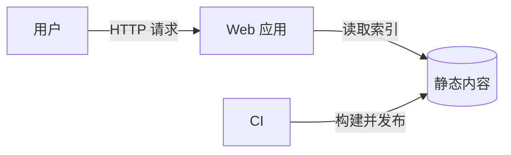
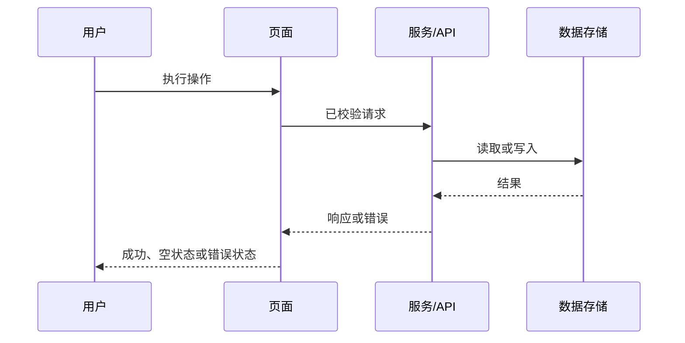

<!-- STD_DOCUMENT_COVER_BEGIN -->
# {{document_title}}

| 文档字段 | 值 |
|---|---|
| Document ID | `{{document_id}}` |
| Document Version | `{{document_version}}` |
| Status | `{{document_status}}` |
| Project | `{{project}}` |
| Authority | `{{authority}}` |
| Document Owner | {{document_owner}} |
| Authors | {{authors}} |
| Created Date | `{{created_at}}` |
| Last Modified Date | `{{last_modified_at}}` |
| Template ID | `{{template_id}}` |
| Template Version | `{{template_version}}` |
| Template Conformance | `{{template_conformance}}` |
| Tailoring Reference | {{tailoring_ref}} |
| Migration Map Reference | {{migration_map_ref}} |
| Repository | `{{source_repository}}` |
| Canonical Path | `{{source_path}}` |
| Supersedes | {{supersedes}} |

> Reviewer、Approver、Approval Date 和 Release Tag 在进入相应状态时填写。Git commit/tag 是
> 外部不可变证据；不要在文档内容中伪造包含自身的 commit hash。
<!-- STD_DOCUMENT_COVER_END -->

<!--
编写建议：先写问题、功能和数据流，再写组件。正文应让工程师能够据此实现，而不是只做架构
归档。所有示例必须替换为项目真实内容；不适用章节写 N/A 并说明原因。
编写规范见 docs/design-writing-guide.md。
-->

## 1. 一页摘要：解决什么问题

用一页以内说明用户、现状问题、期望结果和方案。不要先介绍技术栈。

| 项目 | 内容 |
|---|---|
| 目标用户/系统 | <!-- 示例：项目管理员和只读访客 --> |
| 当前问题 | <!-- 示例：文档分散，无法按项目和类型浏览 --> |
| 解决方案 | <!-- 示例：构建只读静态知识库并由 CI 发布 --> |
| 成功结果 | <!-- 示例：用户可在两次点击内打开任一当前文档 --> |
| 不解决 | <!-- 示例：全文语义问答和在线编辑 --> |

## 2. 背景、现状与约束

说明当前流程、已存在系统、为什么现在需要改变，以及预算、法规、平台、兼容性等硬约束。
把事实和假设分开。

## 3. Scope 与 Non-goals

| 范围内 | 范围外 | 原因/Owner |
|---|---|---|
| <!-- TODO --> | <!-- TODO --> | <!-- TODO --> |

## 4. 用户、场景与功能清单

每个功能必须有稳定 ID、触发者、可观察结果和验收条件。

| Function ID | 用户/调用方 | 场景 | 输入 | 系统行为 | 输出 | 验收条件 |
|---|---|---|---|---|---|---|
| F-001 | 访客 | 浏览项目文档 | 项目 ID | 加载索引并过滤可见文档 | 文档列表 | 列表只包含该项目可见文档 |

## 5. 页面、路由与交互

有 UI 时必须列出页面；无 UI 时写 `N/A — 本系统无用户界面`。

| Page ID | 页面/路由 | 使用者 | 显示内容 | 主要操作 | Loading/Empty/Error | 跳转 |
|---|---|---|---|---|---|---|
| UI-001 | `/projects/:id` | 访客 | 项目摘要和文档列表 | 筛选、打开文档 | skeleton、空列表、错误提示 | `UI-002` |

## 6. 系统边界与外部依赖

列出系统、用户和外部依赖。箭头必须标明传递的数据或命令。

| 外部依赖 | 用途 | 输入/输出 | 失败影响 | Owner |
|---|---|---|---|---|
| <!-- TODO --> | | | | |

## 7. 架构、组件与职责

| Component ID | 组件 | 职责 | 不负责 | Provided interface | 依赖 | 实现位置 |
|---|---|---|---|---|---|---|
| C-001 | Index Builder | 扫描文档并生成索引 | 页面渲染 | `index.json` | Markdown parser | `src/build-index.ts` |

说明为何这样分解，以及关键替代方案为什么没有采用。详细取舍引用 ADR。

## 8. 数据模型、存储与生命周期

| Entity | 关键字段 | Producer | Reader | Storage | 生命周期/删除 |
|---|---|---|---|---|---|
| DocumentIndex | id、title、path、status | Index Builder | Web 应用 | `dist/index.json` | 每次构建替换 |

字段级定义应引用 Schema；此处解释业务含义、ownership 和关系。

## 9. 端到端数据流

至少描述一条主流程。每一步写清输入、处理、输出和状态变化。

| Step | 输入 | 处理组件 | 状态/数据变化 | 输出 | 失败结果 |
|---|---|---|---|---|---|
| 1 | <!-- TODO --> | | | | |

## 10. 接口、事件与契约

| Interface | 调用方 → 提供方 | 请求/事件 | 响应 | 错误 | Authority |
|---|---|---|---|---|---|
| `GET /api/documents` | UI → API | query filter | DocumentSummary[] | 400/403/500 | `openapi.yaml` |

不复制字段级机器契约；引用 OpenAPI、Schema、IDL、ABI 或寄存器定义。

## 11. 状态、业务规则与关键算法

需要生命周期时给出状态转换表；无状态系统说明 `N/A`。

| From | Trigger | Guard | To | Side effect | 非法请求结果 |
|---|---|---|---|---|---|
| Draft | approve | review passed | Approved | publish index | 409 Conflict |

复杂算法应给出输入、输出、不变量、伪代码和复杂度，不只写函数名。

## 12. 失败、恢复、安全与可观测性

| 情况 | 检测方式 | 用户/调用方看到什么 | 系统处理 | 重试/恢复 | 监控信号 |
|---|---|---|---|---|---|
| 存储超时 | deadline exceeded | 明确超时错误 | 不提交部分状态 | 同一幂等键重试 | latency/error metric |

同时说明身份、授权、敏感数据、审计、并发、幂等和 fail-closed 边界。

## 13. 部署、容量与运行约束

描述进程/服务/设备落点、环境差异、配置来源、资源预算、性能目标和测量口径。
估算、模拟和实测必须明确区分。

## 14. 实现计划与代码变更

这是实现人员的入口，必须使用真实路径。

| 顺序 | 变更 | 新增/修改路径 | 关键接口或函数 | 依赖 | 完成条件 |
|---:|---|---|---|---|---|
| 1 | 建立索引生成器 | `src/build-index.ts` | `buildIndex()` | Schema | fixture 测试通过 |
| 2 | 实现项目页 | `src/pages/project.tsx` | `ProjectPage` | F-001、C-001 | 三种页面状态通过 |

说明迁移、兼容、灰度、回滚和不可逆步骤；不需要时写明原因。

## 15. 验证与验收

| Function/Requirement | 测试层级 | 场景 | Oracle | Evidence | 状态 |
|---|---|---|---|---|---|
| F-001 | UI test | 有数据/空数据/失败 | 页面状态与契约一致 | <!-- TODO --> | Planned |

## 16. 风险、未决问题与决定

| ID | 问题/风险 | 对实现的影响 | Owner | 截止 Gate | 状态/ADR |
|---|---|---|---|---|---|
| <!-- TODO --> | | | | | |

## 17. 术语与引用

只收录本文需要的术语、上位需求、契约、ADR 和外部参考。
