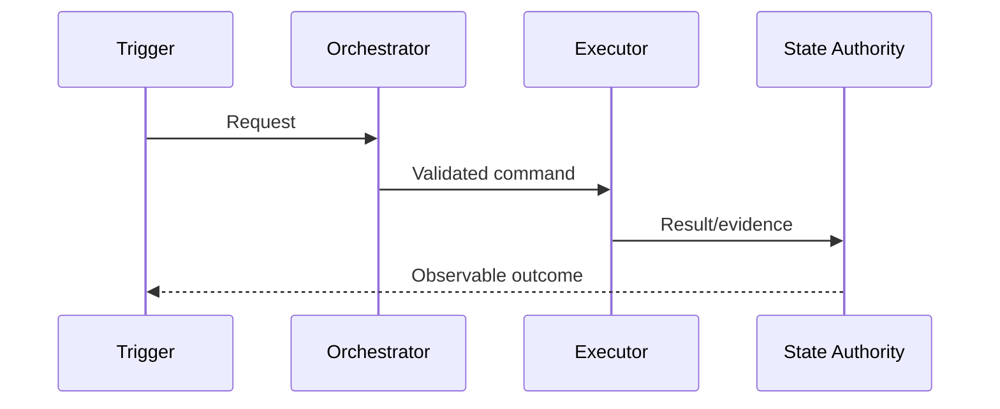

<!-- STD_DOCUMENT_COVER_BEGIN -->
# {{document_title}}

| 文档字段 | 值 |
|---|---|
| Document ID | `{{document_id}}` |
| Document Version | `{{document_version}}` |
| Status | `{{document_status}}` |
| Project | `{{project}}` |
| Authority | `{{authority}}` |
| Document Owner | {{document_owner}} |
| Authors | {{authors}} |
| Created Date | `{{created_at}}` |
| Last Modified Date | `{{last_modified_at}}` |
| Template ID | `{{template_id}}` |
| Template Version | `{{template_version}}` |
| Template Conformance | `{{template_conformance}}` |
| Tailoring Reference | {{tailoring_ref}} |
| Migration Map Reference | {{migration_map_ref}} |
| Repository | `{{source_repository}}` |
| Canonical Path | `{{source_path}}` |
| Supersedes | {{supersedes}} |

> Reviewer、Approver、Approval Date 和 Release Tag 在进入相应状态时填写。Git commit/tag 是
> 外部不可变证据；不要在文档内容中伪造包含自身的 commit hash。
<!-- STD_DOCUMENT_COVER_END -->

> 本模板用于一个跨越两个或更多子系统的系统级机制。每个机制单独成文；系统设计只保留
> 机制目录和引用，子系统设计保留本子系统的实现责任。
>
> 来源说明：本模板由 STD 项目综合编写，不是任何单一标准模板的复制或翻译。概念覆盖参考
> ISO/IEC/IEEE 42010、arc42、NASA Systems Engineering 和 ECSS DRD；具体结构根据 Slinky
> 与 HIFM 的跨子系统机制实践设计。受限标准正文未复制到本模板。

## 1. 文档目的与机制摘要

用简短文字回答：

- 机制解决什么系统级问题；
- 为什么必须跨子系统协作；
- 机制对外呈现什么可观察行为；
- 本文冻结哪些决定，不冻结哪些实现细节。

## 2. Scope、Non-goals 与适用条件

### 2.1 Scope

列出触发入口、覆盖的生命周期阶段、运行模式、产品 profile 和部署拓扑。

### 2.2 Non-goals

明确不由本机制解决的问题，以及不得借本机制扩张的职责。

### 2.3 Preconditions 与 Activation Gate

定义启用机制必须满足的能力、配置、兼容性、资源和验证条件。

## 3. Authority、参与方与责任边界

| Participant/Subsystem | 负责 | 不负责 | Owned state/data | Provided interface | Consumed interface |
|---|---|---|---|---|---|
| <!-- TODO --> | | | | | |

约束：

- 每项状态、数据、配置和决定只能有一个 authority；
- 本文协调参与方，不接管各子系统内部实现 authority；
- 跨项目参与方必须保留各自项目 authority 和正式协作记录。

## 4. Current Baseline、Approved Delta 与演进状态

### 4.1 Current Implementation Baseline

只描述当前实际存在且有代码、RTL、配置或运行证据支持的行为。

### 4.2 Approved Delta

只描述已经批准、允许进入实现的变化。

### 4.3 Planned / Open

尚未批准或尚缺证据的内容必须保持 Planned、Partial、Unknown 或 Open Gate。

## 5. Context 与端到端边界

给出参与者、外部系统、信任边界、数据边界、控制边界和故障域。至少提供一张 context 图。

## 6. 机制不变量与系统级约束

列出任何实现都必须保持的规则，例如：

- 单一 owner 和单一写入 authority；
- 顺序、守恒、exactly-once/at-least-once 或幂等约束；
- 不允许静默 fallback、越权读取或跨项目数据混合；
- 单位、拓扑、精度、兼容性或安全约束。

| Invariant ID | Statement | Owner | Enforcement | Violation result |
|---|---|---|---|---|
| <!-- TODO --> | | | | |

## 7. 参与组件与协作拓扑

描述机制涉及的系统、子系统、模块、硬件设备和外部依赖，以及它们之间的调用/连接方向。

## 8. 输入、输出与公共对象

| Object/Artifact | Producer | Consumer | Schema/ABI | Lifecycle | Persistence | Authority |
|---|---|---|---|---|---|---|
| <!-- TODO --> | | | | | | |

精确引用 API、Schema、Event、IDL、ABI、CSR、register map 或物理接口文件，不复制形成第二份
字段级 authority。

## 9. 状态模型与生命周期

### 9.1 State Machine

列出合法状态、终态、转换触发者、guard、side effect 和非法转换处理。

| From | Event/Command | Guard | To | Side effect | Evidence |
|---|---|---|---|---|---|
| <!-- TODO --> | | | | | |

### 9.2 Ownership、Persistence 与 Consistency

明确 canonical state、cache、projection、journal、snapshot 和 derived view 的区别。

## 10. 正常端到端运行流程

至少给出一条带编号的主流程和一张 sequence 图：

每一步说明输入、输出、状态变化、接口、timeout 和证据。

## 11. 分支、并发、排序与资源仲裁

覆盖：

- business branch 和 feature/profile 选择；
- 并发 writer、锁、lease、generation/epoch 和去重；
- ordering、barrier、fence、backpressure、queue 和 capacity；
- 哪些步骤允许并行，哪些必须串行；
- 公平性、优先级、配额和资源耗尽行为。

## 12. 失败模型、部分失败与恢复

| Failure ID | Failure point | Detection | System effect | Retry/Recovery | Data treatment | Terminal state |
|---|---|---|---|---|---|---|
| <!-- TODO --> | | | | | | |

必须描述 timeout、取消、重复请求、执行方失联、状态写入失败、部分成功、重启、replay、rollback
和人工介入。明确哪些操作幂等，幂等 key/epoch 的 authority 在哪里。

## 13. 配置、模式、兼容性与回退

| Config/Mode | Owner | Allowed values | Default | Scope | Change effect | Validation |
|---|---|---|---|---|---|---|
| <!-- TODO --> | | | | | | |

明确版本协商、兼容矩阵、feature gate、启用/停用步骤和回滚。任何 fallback 都必须显式批准、
可观察且可测试；禁止把失败静默解释为成功或切换到另一机制。

## 14. 安全、隐私、Secret 与隔离

描述身份传播、认证授权、最小权限、信任边界、跨项目隔离、敏感数据、审计、prompt/untrusted
content、硬件访问控制和 fail-closed 行为。

## 15. 可观测性、审计与运行证据

| Signal/Artifact | Writer | Consumer | Identity fields | Retention | Alert/Gate use |
|---|---|---|---|---|---|
| <!-- TODO --> | | | | | |

日志、metric、trace、journal、snapshot 和报告必须能关联同一次端到端执行。

## 16. 性能、容量、资源与技术预算

记录吞吐、延迟、并发、容量、带宽、内存、存储、FPGA 资源、功耗等适用预算。每个数值必须
带单位、统计口径、拓扑 scope、工作负载、假设和证据等级：modeled / simulated / estimated /
measured。

## 17. Deployment、故障域与环境差异

描述机制在本地、测试、生产或不同板卡/平台 profile 中的部署映射，以及网络、进程、设备、
电源和升级故障域。

## 18. Verification、Test 与 Traceability

| Requirement/Invariant | Scenario | Test level | Oracle | Evidence | Status |
|---|---|---|---|---|---|
| <!-- TODO --> | | | | | |

至少覆盖正常、边界、负向、并发、恢复、安全、性能和兼容性。`failed/blocked/invalid/not-run`
不得标成 covered/pass。

## 19. Rollout、Migration、Rollback 与 Decommission

定义数据/协议迁移、灰度或阶段启用、旧机制退出、回滚条件、不可逆步骤和完成证据。若不允许
新旧机制并存，必须明确唯一切换点。

## 20. 风险、Open Questions 与外部依赖

| ID | Type | Description | Owner | Needed evidence/decision | Blocking gate |
|---|---|---|---|---|---|
| <!-- TODO --> | | | | | |

## 21. Review Checklist 与批准记录

- [ ] 机制确实跨越多个子系统，且没有形成第二个子系统 authority
- [ ] Current Baseline、Approved Delta 和 Planned 内容已分开
- [ ] 参与方责任、公共对象和接口 authority 唯一
- [ ] 主流程、分支、并发、失败和恢复均已覆盖
- [ ] 配置、兼容性和 fallback 行为明确且可测试
- [ ] 安全、隔离、资源预算和部署故障域已评审
- [ ] Requirement→Mechanism→Subsystem→Interface→Test→Evidence 可追踪
- [ ] Rollout、rollback、旧机制退出和未决 Gate 明确

记录 reviewers、review commit、决定、条件和生效范围。
