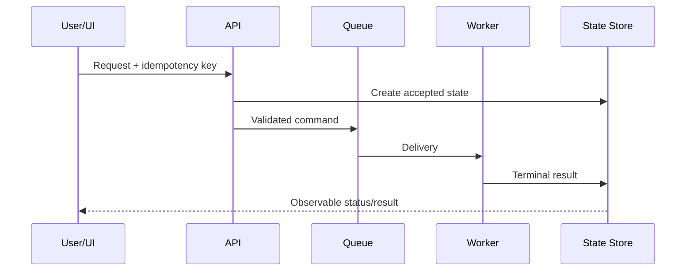

<!-- STD_DOCUMENT_COVER_BEGIN -->
# {{document_title}}

| 文档字段 | 值 |
|---|---|
| Document ID | `{{document_id}}` |
| Document Version | `{{document_version}}` |
| Status | `{{document_status}}` |
| Project | `{{project}}` |
| Authority | `{{authority}}` |
| Document Owner | {{document_owner}} |
| Authors | {{authors}} |
| Created Date | `{{created_at}}` |
| Last Modified Date | `{{last_modified_at}}` |
| Template ID | `{{template_id}}` |
| Template Version | `{{template_version}}` |
| Template Conformance | `{{template_conformance}}` |
| Tailoring Reference | {{tailoring_ref}} |
| Migration Map Reference | {{migration_map_ref}} |
| Repository | `{{source_repository}}` |
| Canonical Path | `{{source_path}}` |
| Supersedes | {{supersedes}} |

> Reviewer、Approver、Approval Date 和 Release Tag 在进入相应状态时填写。Git commit/tag 是
> 外部不可变证据；不要在文档内容中伪造包含自身的 commit hash。
<!-- STD_DOCUMENT_COVER_END -->
<!--
编写建议：本模板只用于跨越两个或更多组件/子系统、具有独立流程或恢复语义的机制。重点是把参与方、
消息、状态变化和失败传播串成一条可实现链路。单一模块内部逻辑使用 design.definition。
编写规范见 docs/design-writing-guide.md；所有示例必须替换。
-->

## 1. 机制摘要：解决什么问题

系统设计仍保留端到端原理、关键阶段、系统级约束和代表失败；本文唯一维护该机制的详细
状态转换、参与方协议和恢复规则，字段级定义仍引用机器契约。固定上级系统基线及对应
Process/Step/Constraint ID，说明本文范围；细节变化时核对系统摘要，不能维护两套不同流程。

| 项目 | 内容 |
|---|---|
| 触发者 | <!-- TODO --> |
| 当前问题 | <!-- TODO --> |
| 可观察结果 | <!-- TODO --> |
| 为什么需要多个参与方 | <!-- TODO --> |
| Non-goals | <!-- TODO --> |

## 2. 使用场景与功能

| Scenario ID | 触发条件 | 参与方 | 预期结果 | 验收条件 |
|---|---|---|---|---|
| SC-001 | 用户提交任务 | UI、API、Worker、Store | 任务终态可查询 | 重复提交不产生第二个任务 |

## 3. 参与方、责任和 authority

| Participant | 负责 | 不负责 | Owned data/state | Provided/Consumed interface | 实现位置 |
|---|---|---|---|---|---|
| API | 鉴权和创建命令 | 执行任务 | request record | HTTP / queue | `src/api/` |

### 3.1 系统约束与参与方承接

本节编写建议、规范与示例

**本节目的**：把系统分配给本机制的政策和预算落实到参与方，使跨单元协作满足同一组约束。

**必须写清楚**：上级基线、Constraint ID、决定状态和条件，参与方必须提供的保证、允许的
实现自由度、组合规则、各方落实位置、验证及变更影响。

**编写规范**：固定系统分配和所引用的契约版本，以来源文档与约束 ID 联合定位；细分项关联
父约束，拟议输入仍标为拟议。机制 Owner 只在系统授权范围内细化，不能自行改变超限行为、
重试政策或总预算。已有系统分配直接引用；需要细分时说明参与方及公共开销，避免一份资源
被重复承诺。把生产方保证与消费方前提接起来，检查
正常及失败路径；各方独立通过并不证明协作闭合。下级 `design.definition` 用同一约束 ID
说明实现与验证，冲突返回原决定责任方，不由某一参与方单方修改；系统摘要同步反映已采用
的变化，但不复制本文的完整状态机或协议。

**抽象示例**：虚构系统要求校验失败时当前目录不变。机制据此规定校验方只交付整批通过的
候选，写入方拒绝失败或检查不完整的结果；双方可选择内部算法，但不能改为跳过错误行后发布。
验证先构造上游校验失败，检查输出及编排不调用写入入口；再直接向写入接口注入未通过的
候选，检查其拒绝且旧快照未变。两类检查分别验证正常交接和边界防护，不能相互代替。
此例仅示范约束怎样跨参与方落实，不代表已有契约、实现或测试结果。

**完成条件**：系统约束可追到参与方责任、详细流程与组合验证，自由度和反馈边界明确；
未验证或不满足的项保持可见，不因接口表已填或单方 PASS 而判整体闭合。

| Constraint ID / 上级基线与决定状态 | 适用条件 | 系统保证/分配 | 参与方承接与自由度 | 流程/协议/下级落实位置 | 组合验证与证据状态 | 差距/变更影响/裁决责任 |
|---|---|---|---|---|---|---|

## 4. 输入、输出与共享对象

| Object | Producer | Consumer | Contract | Identity/key | 生命周期 | Authority |
|---|---|---|---|---|---|---|
| TaskCommand | API | Worker | `schemas/task.json` | task_id | accepted→terminal | API |

## 5. 正常端到端流程

| Step | Sender → Receiver | 输入 | 校验/处理 | 状态变化 | 输出/timeout |
|---:|---|---|---|---|---|
| 1 | UI → API | request | auth + schema | none | accepted/error |

## 6. 分支和替代流程

| Branch ID | 条件 | 与主流程不同之处 | 最终结果 | 是否允许 fallback |
|---|---|---|---|---|
| BR-001 | queue unavailable | 不创建可执行任务 | explicit unavailable | No |

## 7. 状态机与不变量

| From | Event | Guard | To | Writer | Side effect | 非法转换结果 |
|---|---|---|---|---|---|---|
| accepted | worker-start | generation matches | running | Worker | start timestamp | reject |

| Invariant ID | 必须始终成立的规则 | Enforcement | 违反后的结果 |
|---|---|---|---|
| INV-001 | 一个 idempotency key 只对应一个 payload digest | API + Store | conflict |

## 8. 失败传播、重试与恢复

| Failure ID | 失败点 | 谁检测 | 向上游返回/传播 | 重试规则 | 数据处理 | 最终状态 |
|---|---|---|---|---|---|---|
| FAIL-001 | Worker 失联 | lease monitor | status remains queryable | 新 lease/同 generation | 保留日志 | failed/unknown |

必须覆盖 timeout、取消、重复投递、部分成功、重启和 UnknownOutcome。

## 9. 并发、排序与容量

明确 writer、锁/lease、generation、queue、ordering、backpressure、公平性和资源耗尽行为。

## 10. 安全、权限与信任边界

描述每一跳的身份、鉴权、授权、敏感数据、跨租户/跨项目隔离和 fail-closed 行为。

## 11. 可观测性与证据

| Signal | Writer | Correlation fields | Consumer | Retention | Alert/Debug use |
|---|---|---|---|---|---|
| task transition | State Store | task_id、generation | Operator | 30 days | stuck task |

## 12. 配置、兼容与部署

列出配置 Owner、默认值、作用域、版本兼容、部署位置和故障域。任何 fallback 必须显式、
可观察、可测试。

## 13. 各参与方实现清单

| 顺序 | Participant | 变更 | 文件/模块 | Contract | 完成条件 |
|---:|---|---|---|---|---|
| 1 | API | 接收幂等键 | `src/api/tasks.ts` | Task API | contract tests pass |
| 2 | Worker | 执行和终态写入 | `src/worker/run.ts` | TaskCommand | recovery tests pass |

## 14. 验证、上线与回滚

将 §3.1 的 Constraint ID 与场景、不变量一并映射，既验证各方承接，也验证组合后的正常和
失败行为。固定相同输入及配置；局部 PASS 不关闭协作验证，未运行的检查保留 NOT_RUN，
发现差距回传原约束责任方，不能只调整测试预期使其通过。

| Scenario/Invariant/Constraint | 测试 | Oracle | Evidence | 状态 |
|---|---|---|---|---|
| SC-001 / INV-001 | duplicate submission | single task | <!-- TODO --> | Planned |

写明启用条件、灰度、兼容窗口、回滚点和旧机制退出方式。

## 15. 风险、未决问题与决定

若关键协作机制或验证判据未定，先列必须解决的问题，按输入与约束、选项、正常/失败推演、
推荐方案及代价、未决项形成预设计；复杂分析复用 `evaluation.technical-analysis`。选择后
回写状态/流程及 §3.1，并核对系统摘要与各方承接。关键机制未定不能判设计完成；不相关工作
可继续，未实现/未实测另行标注。逐节检查实际决定、依据、下游约束、自由度及承接检查位置，
不把登记未决项或复制统一口号当作设计结果。

| ID | 问题 | 影响 | Owner | 截止 Gate | 状态/ADR |
|---|---|---|---|---|---|
| <!-- TODO --> | | | | | |
