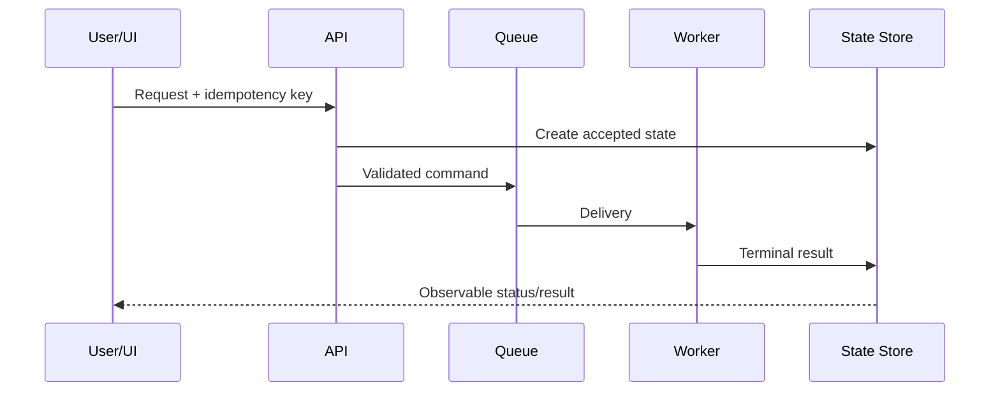

<!-- STD_DOCUMENT_COVER_BEGIN -->
# {{document_title}}

| 文档字段 | 值 |
|---|---|
| Document ID | `{{document_id}}` |
| Document Version | `{{document_version}}` |
| Status | `{{document_status}}` |
| Project | `{{project}}` |
| Authority | `{{authority}}` |
| Document Owner | {{document_owner}} |
| Authors | {{authors}} |
| Created Date | `{{created_at}}` |
| Last Modified Date | `{{last_modified_at}}` |
| Template ID | `{{template_id}}` |
| Template Version | `{{template_version}}` |
| Template Conformance | `{{template_conformance}}` |
| Tailoring Reference | {{tailoring_ref}} |
| Migration Map Reference | {{migration_map_ref}} |
| Repository | `{{source_repository}}` |
| Canonical Path | `{{source_path}}` |
| Supersedes | {{supersedes}} |

> Reviewer、Approver、Approval Date 和 Release Tag 在进入相应状态时填写。Git commit/tag 是
> 外部不可变证据；不要在文档内容中伪造包含自身的 commit hash。
<!-- STD_DOCUMENT_COVER_END -->
<!--
编写建议：本模板只用于跨越两个或更多组件/子系统、具有独立流程或恢复语义的机制。重点是把参与方、
消息、状态变化和失败传播串成一条可实现链路。单一模块内部逻辑使用 design.definition。
编写规范见 docs/design-writing-guide.md；所有示例必须替换。
-->

## 1. 机制摘要：解决什么问题

| 项目 | 内容 |
|---|---|
| 触发者 | <!-- TODO --> |
| 当前问题 | <!-- TODO --> |
| 可观察结果 | <!-- TODO --> |
| 为什么需要多个参与方 | <!-- TODO --> |
| Non-goals | <!-- TODO --> |

## 2. 使用场景与功能

| Scenario ID | 触发条件 | 参与方 | 预期结果 | 验收条件 |
|---|---|---|---|---|
| SC-001 | 用户提交任务 | UI、API、Worker、Store | 任务终态可查询 | 重复提交不产生第二个任务 |

## 3. 参与方、责任和 authority

| Participant | 负责 | 不负责 | Owned data/state | Provided/Consumed interface | 实现位置 |
|---|---|---|---|---|---|
| API | 鉴权和创建命令 | 执行任务 | request record | HTTP / queue | `src/api/` |

## 4. 输入、输出与共享对象

| Object | Producer | Consumer | Contract | Identity/key | 生命周期 | Authority |
|---|---|---|---|---|---|---|
| TaskCommand | API | Worker | `schemas/task.json` | task_id | accepted→terminal | API |

## 5. 正常端到端流程

| Step | Sender → Receiver | 输入 | 校验/处理 | 状态变化 | 输出/timeout |
|---:|---|---|---|---|---|
| 1 | UI → API | request | auth + schema | none | accepted/error |

## 6. 分支和替代流程

| Branch ID | 条件 | 与主流程不同之处 | 最终结果 | 是否允许 fallback |
|---|---|---|---|---|
| BR-001 | queue unavailable | 不创建可执行任务 | explicit unavailable | No |

## 7. 状态机与不变量

| From | Event | Guard | To | Writer | Side effect | 非法转换结果 |
|---|---|---|---|---|---|---|
| accepted | worker-start | generation matches | running | Worker | start timestamp | reject |

| Invariant ID | 必须始终成立的规则 | Enforcement | 违反后的结果 |
|---|---|---|---|
| INV-001 | 一个 idempotency key 只对应一个 payload digest | API + Store | conflict |

## 8. 失败传播、重试与恢复

| Failure ID | 失败点 | 谁检测 | 向上游返回/传播 | 重试规则 | 数据处理 | 最终状态 |
|---|---|---|---|---|---|---|
| FAIL-001 | Worker 失联 | lease monitor | status remains queryable | 新 lease/同 generation | 保留日志 | failed/unknown |

必须覆盖 timeout、取消、重复投递、部分成功、重启和 UnknownOutcome。

## 9. 并发、排序与容量

明确 writer、锁/lease、generation、queue、ordering、backpressure、公平性和资源耗尽行为。

## 10. 安全、权限与信任边界

描述每一跳的身份、鉴权、授权、敏感数据、跨租户/跨项目隔离和 fail-closed 行为。

## 11. 可观测性与证据

| Signal | Writer | Correlation fields | Consumer | Retention | Alert/Debug use |
|---|---|---|---|---|---|
| task transition | State Store | task_id、generation | Operator | 30 days | stuck task |

## 12. 配置、兼容与部署

列出配置 Owner、默认值、作用域、版本兼容、部署位置和故障域。任何 fallback 必须显式、
可观察、可测试。

## 13. 各参与方实现清单

| 顺序 | Participant | 变更 | 文件/模块 | Contract | 完成条件 |
|---:|---|---|---|---|---|
| 1 | API | 接收幂等键 | `src/api/tasks.ts` | Task API | contract tests pass |
| 2 | Worker | 执行和终态写入 | `src/worker/run.ts` | TaskCommand | recovery tests pass |

## 14. 验证、上线与回滚

| Scenario/Invariant | 测试 | Oracle | Evidence | 状态 |
|---|---|---|---|---|
| SC-001 / INV-001 | duplicate submission | single task | <!-- TODO --> | Planned |

写明启用条件、灰度、兼容窗口、回滚点和旧机制退出方式。

## 15. 风险、未决问题与决定

| ID | 问题 | 影响 | Owner | 截止 Gate | 状态/ADR |
|---|---|---|---|---|---|
| <!-- TODO --> | | | | | |
