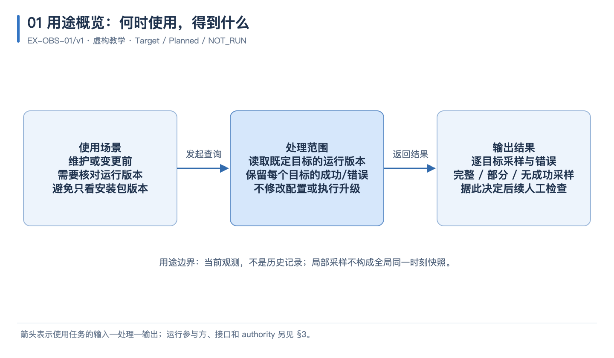
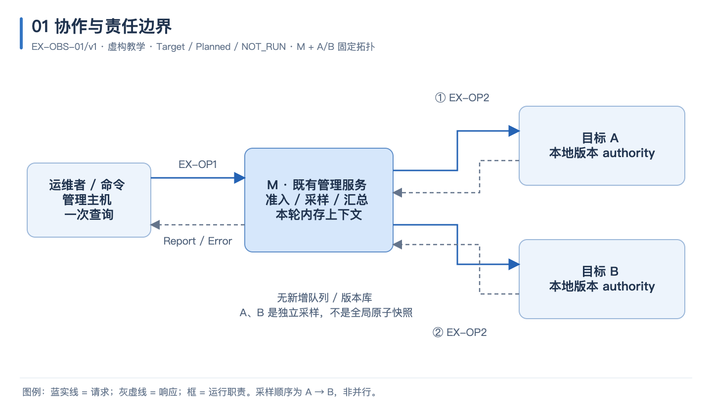
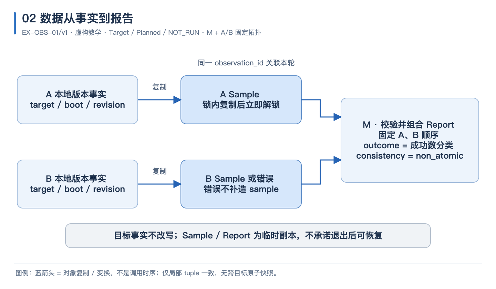
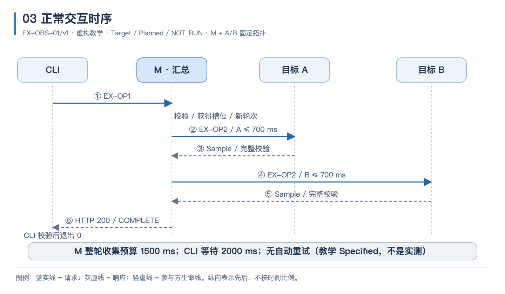
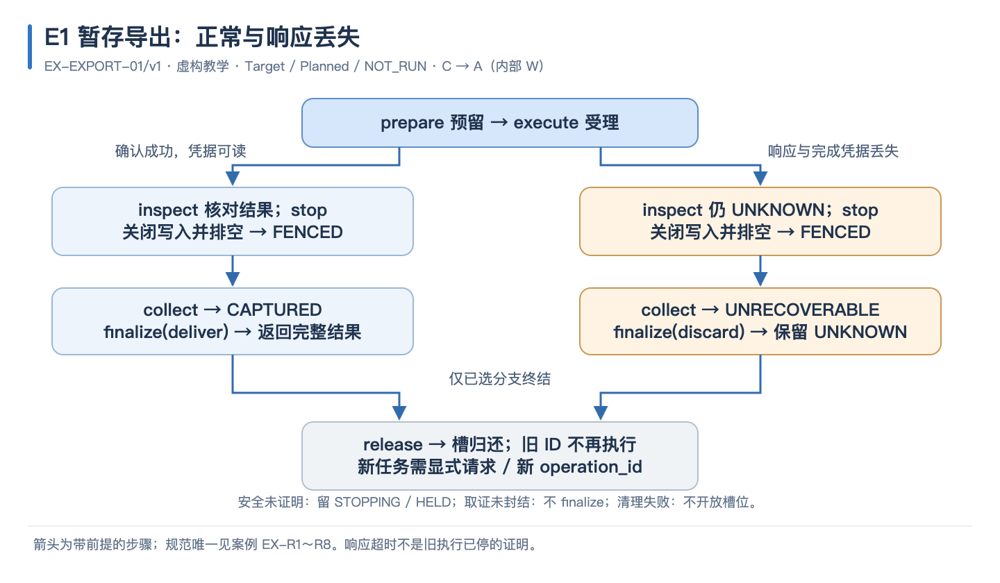
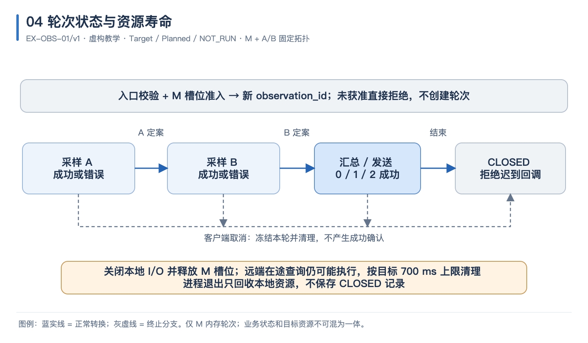
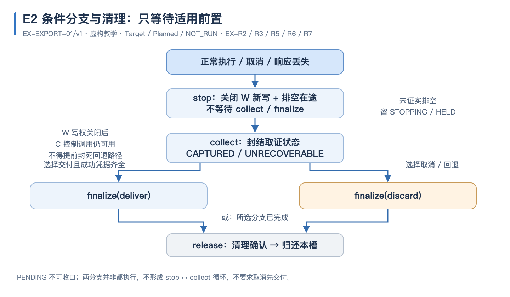
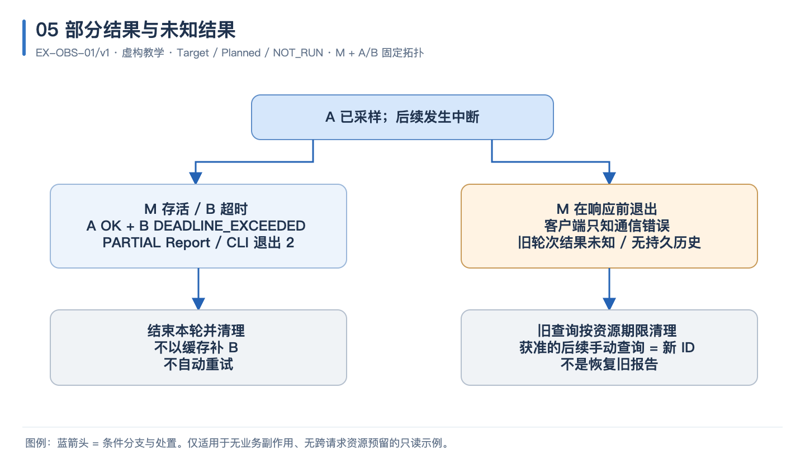
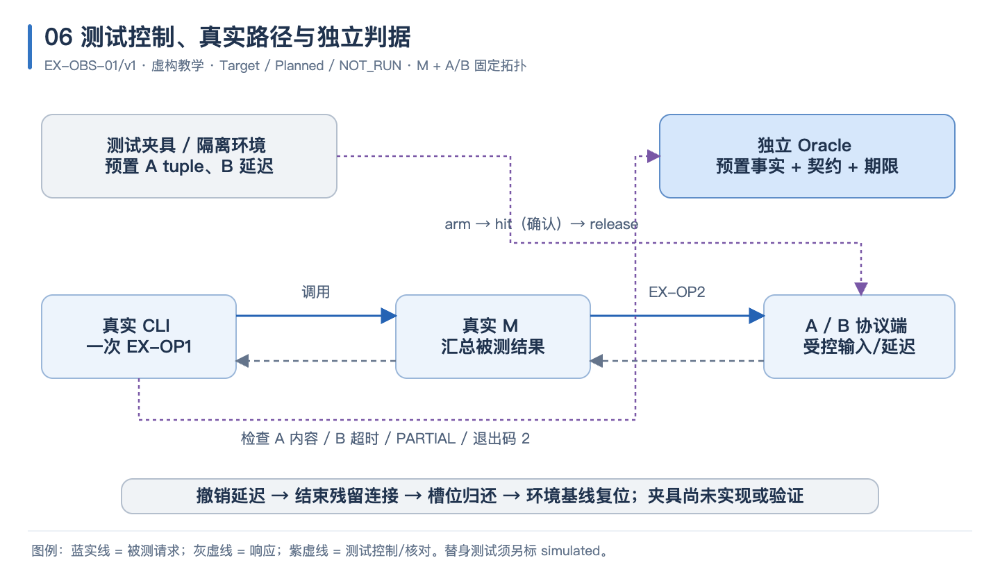

<!-- STD_DOCUMENT_COVER_BEGIN -->
# {{document_title}}

| 文档字段 | 值 |
|---|---|
| Document ID | `{{document_id}}` |
| Document Version | `{{document_version}}` |
| Status | `{{document_status}}` |
| Project | `{{project}}` |
| Document Owner | {{document_owner}} |
| Last Modified Date | `{{last_modified_at}}` |
| Template ID | `{{template_id}}` |
| Template Version | `{{template_version}}` |
<!-- STD_DOCUMENT_COVER_END -->

> 本模板用于跨两个或更多责任单元、具有独立协作或恢复语义的机制；同一工程 Owner 也可能负责
> 多个运行参与方。单一单元内部设计按领域使用通用单元或硬件/FPGA 专项模板，不为凑目录另建机制。
> 先核查附录 A 的输入与适用性，再成文；折叠帮助后正文必须能独立解释机制。
> 编写方法见已采用 STD 的 `docs/ai-authoring-guide.md` 与 `docs/ai-guides/system-mechanism.md`，
> 共同规范见 `docs/design-writing-guide.md` 与 `docs/interface-data-mapping-standard.md`。本文所有带“虚构/教学”标记的图文不是项目事实。

<!-- STD_TEMPLATE_EXAMPLE_BEGIN -->
**教学入口选择｜Target / Planned / NOT_RUN**：以下是方法导航，不是第二份协议。
只读协作见本模板 EX-OBS 图文，有副作用的收口见
[EX-EXPORT](../../docs/examples/mechanism-side-effect-example.md)；软硬件交接见
[Host—驱动—FPGA 案例](../../docs/examples/host-fpga-transfer-example.md)。后者演示原生布局、
完成可见性和停止/排空，不是芯片内部架构或已实现的板卡协议。选择与本机制相符的路径，
不要求每份文档实现全部案例。批量写作方法见已采用指南 §10。
<!-- STD_TEMPLATE_EXAMPLE_END -->

## 1. 机制摘要：解决什么问题

<details>
<summary>本节编写建议、规范与示例</summary>

**本节目的**：让新读者先理解这项协作为什么存在、带来什么结果，再进入协议与状态细节。

**必须写清楚**：受益者及其实际任务、原有问题、机制所在系统与边界、核心输入—处理—输出、参与方分工、本版本范围和最重要的取舍。

**编写规范**：用约一页自包含正文讲一个代表输入怎样经过参与方产生结果，说明为什么不能由一个单元独立完成；不以模块清单、Gate 或链接代替原理。系统设计仍保留端到端原理、关键阶段、系统级约束和代表失败；本文唯一维护详细状态转换、参与方协议与恢复规则。关联同一 Process/Step/Constraint ID，变更时核对系统摘要，不维护两套流程。

**抽象示例**：虚构版本查询让运维者一次看到 A、B 的运行版本；M 负责采样汇总而不替目标决定版本。选择非原子观测是为了避免全局暂停，代价是结果不能证明两个目标在同一瞬间一致。

**完成条件**：只读开篇就能说清什么时候用、解决什么问题、得到什么结果及不承诺什么，再进入分工与协议；正文不是文档索引，当前能力与目标能力可分辨。

</details>

<!-- 用连续段落说明何时使用、处理什么及得到什么；用途概览图放本节，参与方职责图放 §3。 -->


<!-- STD_TEMPLATE_EXAMPLE_BEGIN -->
**用途图例｜虚构 EX-OBS-01/v1，Target / Planned / NOT_RUN**



图 U1：维护或变更前核对运行版本，读取既定目标并返回逐目标结果。这个图先回答何时用、处理什么、
得到什么；参与方与 authority 见 §3，不在开篇用职责拓扑替代用途。[可编辑 SVG](../diagrams/mechanism/usage-overview.svg)。

使用者不是为了“调用 M”而查询，而是要辨认目标当前运行版本与无法采样的对象，为下一步维护判断提供输入。
处理范围仅限只读采样，输出明确区分完整、部分、无成功采样及入口拒绝，不升级配置、不保存历史。
本图不证明所有目标同一时刻一致，也不证明未响应目标已失效。详细公共契约仍唯一见
[EX-OBS-01/v1](../../docs/ai-system-design-authoring-guide.md#88-完整小例两个单元的只读版本核对)；
本图是解释视图，不是第二份协议，不是实现或测试证据。
<!-- STD_TEMPLATE_EXAMPLE_END -->

## 2. 使用场景与功能

<details>
<summary>本节编写建议、规范与示例</summary>

**本节目的**：把机制用途分解成全部可验收能力，避免一个成功例子掩盖其他入口和运行模式。

**必须写清楚**：实际业务场景、触发角色/系统、部署条件、能力边界、正常与异常结果、验收判据，以及每项能力的实现状态和验证结果。

**编写规范**：先说明支持哪项产品任务，维护机制则说明它服务的业务保障目标；维护操作不能代替整个产品的客户场景。按能力而非文件或参与方列项，覆盖适用的查询、控制、配置、退出和恢复入口；按附录 A 说明不适用项。不能由图中出现模块推断该能力已实现。

**抽象示例**：同一版本查询包含完整返回、单目标错误、全部目标错误和入口拒绝四类可观察结果；HTTP 请求结束并不意味着全部目标健康。它不提供历史查询或版本升级能力。

**完成条件**：每个正式入口均能关联场景、公共操作、全部提供/消费方及验证；独立列明 Planned 与 NOT_RUN。

</details>

<!-- 先解释场景及能力差异，再汇总。 -->
| Capability / Scenario ID | 业务任务与触发/条件 | 输入与可观察结果 | 提供方/全部消费者 | 实现状态 | 验证结果/判据 |
|---|---|---|---|---|---|

## 3. 参与方、责任和 authority

<details>
<summary>本节编写建议、规范与示例</summary>

**本节目的**：确定每个决定、事实和接口由谁负责，避免多方分别定义相互冲突的行为。

**必须写清楚**：运行参与方、职责与非职责、权威数据/状态、提供和消费的接口、工程 Owner、实际部署和实现位置，以及依赖的其他机制。

**编写规范**：工程 Owner 不是运行实体；组件在同一进程也不意味着所有状态同属一个 authority。读取引用的实际定义并绑定版本/对象，只有计划路径或口头确认不算共同输入。复用已有编排，不为模板新增服务、Queue、Worker、lease 或 generation；跨机制依赖说明调用方向、循环等待和故障传播。

**抽象示例**：M 决定本轮汇总结果，A 决定 A 的版本；M 不得用缓存或 B 的版本替代 A 的错误。A 与 B 可以由同一开发团队维护，但仍是两个独立采样目标。

**完成条件**：能为每项权威事实和跨边界决定找到唯一责任与实际承接位置；所有消费者的前提已核对。

</details>

<!-- STD_TEMPLATE_EXAMPLE_BEGIN -->
**图文样板｜虚构 EX-OBS-01/v1，Target / Planned / NOT_RUN**



图 1：谁发起、谁汇总、谁拥有事实。蓝色实线表示请求方向，灰色虚线表示响应方向。 [可编辑 SVG](../diagrams/mechanism/collaboration.svg)。

运维者通过既有管理主机上的命令调用 M；M 按固定清单先查询 A、再查询 B，并返回每个目标的结果。A、B 各自拥有本地版本事实，M 只拥有本轮临时采样上下文，不建立新的版本数据库。两条目标路径不代表并行采样；具体先后见图 3。选择顺序采样降低编排复杂度，但承担较长的最坏响应时间。

六图使用同一只读教学机制；完整字段、操作、错误和命令唯一见
[AI 指南的 EX-OBS-01/v1 定义](../../docs/ai-system-design-authoring-guide.md#88-完整小例两个单元的只读版本核对)。
图是解释视图，不是第二份协议，也不表示已有实现或测试结果。生成项目实例时移除这些教学块，
按真实设计绘制项目图；保留样式不能保留虚构事实。
<!-- STD_TEMPLATE_EXAMPLE_END -->

<!-- 先以正文说明本节的实际方案、依据和边界，再汇总下表；不能只填表。 -->

| Participant / 工程 Owner | 负责/不负责 | Owned data/state | Provided/Consumed interface | 部署/实现位置 | 依赖机制与基线 |
|---|---|---|---|---|---|

### 3.1 系统约束与参与方承接

<details>
<summary>本节编写建议、规范与示例</summary>

**本节目的**：把系统分配给本机制的政策和预算落实到参与方，使跨单元协作满足同一组约束。

**必须写清楚**：上级基线、Constraint ID、决定状态和条件，参与方必须提供的保证、允许的
实现自由度、组合规则、各方落实位置、验证及变更影响；本 Mechanism ID、上级 Mechanism ID 和系统总表位置，前置依赖另列。

**编写规范**：固定系统分配和所引用的契约版本，以来源文档与约束 ID 联合定位；细分项关联
父约束，拟议输入仍标为拟议。机制 Owner 只在系统授权范围内细化，不能自行改变超限行为、
重试政策或总预算。已有系统分配直接引用；需要细分时说明参与方及公共开销，避免一份资源
被重复承诺。把生产方保证与消费方前提接起来，检查
正常及失败路径；各方独立通过并不证明协作闭合。下级通用单元或硬件/FPGA 专项设计用同一约束 ID
说明实现与验证，冲突返回原决定责任方，不由某一参与方单方修改；系统摘要同步反映已采用
的变化，但不复制本文的完整状态机或协议。

**抽象示例**：虚构系统要求校验失败时当前目录不变。机制据此规定校验方只交付整批通过的
候选，写入方拒绝失败或检查不完整的结果；双方可选择内部算法，但不能改为跳过错误行后发布。
验证先构造上游校验失败，检查输出及编排不调用写入入口；再直接向写入接口注入未通过的
候选，检查其拒绝且旧快照未变。两类检查分别验证正常交接和边界防护，不能相互代替。
此例仅示范约束怎样跨参与方落实，不代表已有契约、实现或测试结果。

**完成条件**：系统约束可追到参与方责任、详细流程与组合验证，自由度和反馈边界明确；
未验证或不满足的项保持可见，不因接口表已填或单方 PASS 而判整体闭合。

</details>

<!-- 先以正文说明本节的实际方案、依据和边界，再汇总下表；不能只填表。 -->

先核对系统模板第 3.4 节登记的本 Mechanism ID 与上级 Mechanism ID（顶层 none），说明父机制分配的范围和组合保证。前置依赖是另一关系，不把“依赖某机制”误写为“属于某机制”；多处使用引用同一身份，禁止自指、循环或悬空上级。

| Constraint ID / 上级基线与决定状态 | 适用条件 | 系统保证/分配 | 参与方承接与自由度 | 流程/协议/下级落实位置 | 组合验证与证据状态 | 差距/变更影响/裁决责任 |
|---|---|---|---|---|---|---|

### 3.2 运行时统筹与确认责任

<details>
<summary>本节编写建议、规范与示例</summary>

**本节目的**：把机制 Owner 的工程责任与运行时实际协调、记录和汇总的责任区分开。

**必须写清楚**：操作入口、运行时统筹者、权威状态及保存位置、目标/操作身份、各方确认和
总体成功判据，以及部分完成、超时和统筹者退出后的核对、资源清理及业务恢复条件。

**编写规范**：从系统能力清单逐项核查，沿实际调用链指定运行组件，不用“Owner 协调”代替。
可复用现有本地编排或公共协议，不为满足模板新增控制服务。逐阶段区分受理、生效、完成和
清理确认；若状态仅在内存中，明确退出后丢失什么及不能承诺什么。先设计共同流程和契约，再
分配内部实现，写清不支持的恢复与重试边界。详细失败遵守 §9，系统摘要同步关键规则。

**抽象示例**：虚构版本查询由现有管理服务逐目标采样和汇总，目标各自是版本 authority。
部分目标未返回就保留 Partial；管理服务退出后重新查询只产生新观测，不声称恢复旧快照。

**完成条件**：能指出每个运行决定、确认及状态由谁产生，失联或退出后仍可判定合法下一步；
下游不需各自新建一套共同状态机，文档责任不被误写成运行实体。

</details>

<!-- 先以正文说明本节的实际方案、依据和边界，再汇总下表；不能只填表。 -->

| 能力/Process ID | 运行时统筹/权威状态 | 参与方动作及确认 | 总体成功/部分结果 | 中断核对与清理/重新开放 | 关联公共契约 |
|---|---|---|---|---|---|

### 3.3 拓扑、目标身份与共享故障域

<details>
<summary>本节编写建议、规范与示例</summary>

**本节目的**：让操作实际作用于正确对象，并明确哪些边界能够隔离、哪些会共同失败。

**必须写清楚**：逻辑目标到进程/节点/设备的映射、可信身份、访问路径、重启或配置代次、共享资源及故障/复位域。

**编写规范**：按实际部署说明一对多、多对一和映射变化时的核对点；地址不等于身份，重新连接不证明还是原对象。硬件机制按需展开板卡/端口/链路和复位范围，纯软件不填虚构 PCIe 或设备字段。图中省略的中间件也须核查超时、缓存、重试和授权行为；共享电源、进程、连接池等不能在隔离结论中被遗漏。

**抽象示例**：A、B 使用固定 target_id 与已校验的 mTLS peer 映射；boot_id 区分启动实例。管理进程退出会丢失本轮结果，但不改变目标版本。

**完成条件**：沿每条访问路径能定位授权对象、映射更新和共享失效影响；不能把逻辑隔离写成物理独立。

</details>

<!-- 解释映射依据和变化过程；用拓扑图或短表呈现，不只列地址。 -->
| 逻辑目标/身份 | 部署及访问路径 | 映射 authority/更新条件 | 共享故障/复位域 | 旧目标/旧代次处理 |
|---|---|---|---|---|

## 4. 数据结构设计

<details>
<summary>本节编写建议、规范与示例</summary>

**本节目的**：把跨参与方交换的对象设计完整，让生产者与消费者能够独立实现同一语义。

**必须写清楚**：全部公共字段的类型、编码、长度/范围、单位、可选性、版本、身份/关联规则，生产/变换/消费/存储位置与生命周期。

**编写规范**：公共字段与操作在唯一契约完整定义；已有机器源精确引用固定版本的实际对象/操作，并读取核对其内容，不另抄一份规范。无机器源时可以在受控设计先完整定义 Proposed 契约，再核对编码。系统接口章是入口，不等于定义已经存在。分别检查全部提供方和消费者；私有内部布局由下级决定，但不能把共同字段改称内部细节。

**抽象示例**：Sample 是目标在本地锁内复制的一组版本字段；Report 汇总两个目标的采样或错误。两个局部一致 Sample 组合后仍不是同一时刻的全局快照。

**完成条件**：读者能依据正式契约构造合法/非法输入，理解每次变换及丢失边界；对象名和计划路径不算闭合。

</details>

<!-- 沿主路径说明对象如何变化，再维护唯一来源索引。 -->
| 类型成员 ID / Object / Contract baseline | Producer → Consumers | 完整定义定位 | identity / 版本 | 复制/变换/保存与释放 | Authority |
|---|---|---|---|---|---|

<!-- STD_TEMPLATE_EXAMPLE_BEGIN -->
**图文样板｜虚构 EX-OBS-01/v1，Target / Planned / NOT_RUN**



图 2：事实、采样副本和汇总对象的区别。箭头表示数据复制或变换，不表示执行时序。 [可编辑 SVG](../diagrams/mechanism/objects.svg)。

目标短时持锁复制本地 tuple，随即解锁；M 收到并完整校验响应后才接纳 Sample。M 以 A、B 固定顺序组合结果；错误项不补造 sample。Report 明确标记 non_atomic，不能据此推导跨目标一致性或持久历史。图只展开 A 成功的代表分支，A 错误时同样保留其 ERROR 位置，不因缺失 Sample 删目标。图中的临时对象不是新增持久存储；退出或关闭轮次后按正文的资源规则释放。

六图使用同一只读教学机制；完整字段、操作、错误和命令唯一见
[AI 指南的 EX-OBS-01/v1 定义](../../docs/ai-system-design-authoring-guide.md#88-完整小例两个单元的只读版本核对)。
图是解释视图，不是第二份协议，也不表示已有实现或测试结果。生成项目实例时移除这些教学块，
按真实设计绘制项目图；保留样式不能保留虚构事实。
<!-- STD_TEMPLATE_EXAMPLE_END -->


### 4.1 类型目录与完整字段

<details>
<summary>本节编写建议、规范与示例</summary>

**本节目的**：让读者和 Agent 能定位、构造同一个完整对象。

**必须写清楚**：类型 ID、生产/消费、来源基线、全部字段及嵌套引用，不仅是关键字段。

**编写规范**：按 docs/interface-data-mapping-standard.md 复用接口族/成员 ID。逐字段写类型、位宽、单位、长度/计数、范围/枚举、必填/默认/null、条件有效性、引用及跨字段约束。共享类型引用原定义；正文保留机器源生成或逐项核对的完整阅读视图，不能只列路径或独立维护冲突定义。

**抽象示例**：虚构 Request.operation_id 引用公共 Id；改变 request_id 不等于新建逻辑任务，字段准确 ID 见配套映射目录。

**完成条件**：可从类型 ID 找齐字段、构造边界输入，再回流程解释用途。

</details>

类型阅读基线（catalog、源版本/revision/hash、正文锚点）：

| 类型成员 ID / 名称 | 用途与生产/消费 | 机器源与 selector | 身份/所有权/可见性/寿命 |
|---|---|---|---|

逐类型重复完整字段表，不只填一次作为全部对象：

| 类型 ID.字段 / 原字段号 | 类型/位宽/引用 | 单位/大小/计数/范围 | 必填/默认/null | 条件有效/跨字段约束 | 含义 |
|---|---|---|---|---|---|

### 4.2 编码、布局与共享类型映射

<details>
<summary>本节编写建议、规范与示例</summary>

**本节目的**：分清逻辑对象、序列化与真实二进制布局。

**必须写清楚**：适用编码、长度边界、共享类型来源与真实 ABI 条件。

**编写规范**：先判断是否实际存在二进制 ABI，普通 JSON 不虚构 wire offset 或 Host sizeof。可变数组给计数来源、上限和溢出动作；实际 wire 才补端序、对齐、padding/reserved、校验和兼容。投影/转换给原类型 ID、字段映射及损失/补足，不能同名另定义公共结构。

**抽象示例**：虚构 payload 最多 4096 UTF-8 bytes；字符数不能代替编码后的字节数检查。

**完成条件**：每次编码/转换可判定合法与失败，不适用布局有具体理由。

</details>

| 类型 ID / 编码源基线 | 逻辑宽度/序列化长度 | 实际 ABI 定位或不适用理由 | 原类型 → 投影/转换/损失 | 验证项 |
|---|---|---|---|---|

### 4.3 一致性、可见性与数据寿命

<details>
<summary>本节编写建议、规范与示例</summary>

**本节目的**：明确数据何时可见、对谁一致、在什么故障范围内可恢复。

**必须写清楚**：局部与组合一致性、可见/提交/持久边界、复制和缓存政策、生命周期、清理责任，以及真实故障下会丢失什么。

**编写规范**：“已写入”“已返回”不等于 durable；说明保证对应进程退出、节点断电还是外部存储故障。只读或纯内存机制明确不承诺持久性；不为填表引入日志库。对共享缓冲区、描述符、DMA 等按实际说明所有权转移、在途使用、完成确认和安全复用。

**抽象示例**：只读查询里目标 tuple 是局部一致副本，Report 仅驻留 M 内存；M 退出无法找回旧 Report。重新采样获得新 observation_id，不能重命名为旧轮次恢复。

**完成条件**：从生产到释放的每次所有权/可见性变化均能推演，故障保证有精确范围且没有默认持久承诺。

</details>

<!-- 说明一致性边界和为何选择该方案，引用对象/操作 ID，不复制字段表。 -->

## 5. 接口设计

<details>
<summary>本节编写建议、规范与示例</summary>

**本节目的**：定义一次操作到底请求什么、何时算完成，以及错误后调用方可做什么。

**必须写清楚**：每个 API/消息/硬件命令的调用前提、完整参数与结果、错误码、截止时间、幂等/重复/取消语义及确认的证明范围。

**编写规范**：区分 accepted、effective、completed、durable、released，不能用一个成功码混指多种保证。逐错误说明是否发生副作用、结果是否已知及后续合法动作；鉴权、格式、容量检查的顺序也影响行为。配置、调试和查询命令都属于公共入口；协议参数可引用唯一来源，不能只给 happy-path JSON。用一套具体值贯穿全部调用，核对跨字段条件、实例关联、错误返回和下一步；接收方无法确定对象或合法动作时须回到共同设计补齐。

**抽象示例**：EX-OP1 的 HTTP 200 只表示本轮采样汇总结束；Report 的 COMPLETE、PARTIAL、FAILED 分别表示两个、一个、零个目标成功。入口拒绝不产生 Report，也不采样。

**完成条件**：提供/消费双方对每个成功和错误结果有同一解释，未知结果不被改写成确定失败。

</details>

<!-- 先以正文说明本节的实际方案、依据和边界，再汇总下表；不能只填表。 -->

| Operation / 固定契约 | 前提与校验顺序 | 完整输入/输出定位 | 确认保证/不保证 | 错误、副作用与结果已知性 | 重复/取消/期限 |
|---|---|---|---|---|---|


### 5.1 逐操作签名、错误与调用演练

<details>
<summary>本节编写建议、规范与示例</summary>

**本节目的**：让双方按同一 ID 和具体输入完成交接。

**必须写清楚**：每个操作的请求/响应/事件/错误、权限、校验顺序及合法下一步。

**编写规范**：按实际 API/CLI/信号适用条件展开，不为填表创建新入口。类型使用 §4 成员 ID，签名与完整阅读视图绑定版本/hash；CLI 补参数、默认、互斥、输出/退出码和执行位置，硬件补标准号/版本/项目绑定及适用电气/时序。沿具体请求演练定位、校验、动作、确认与失败，不把 accepted 当完成，不只保留成功样本。

**抽象示例**：虚构 IF-EXPORT#OP01 prepare 的 args 为 PrepareArgs；原 ID 改 payload 得 ERR06/CONFLICT，核查原记录而不覆盖。

**完成条件**：双方不需口头补字段或猜错误处理；下游实现前 Proposed 契约已落盘。

</details>

按每个成员重复以下单元，先用正文说明用途、选择和行为，再汇总：

| 接口族#成员 ID / 名称 / 基线 | 提供方/调用方 / 同步异步 | request/response/event 类型 ID | 源 selector / 正文锚点 |
|---|---|---|---|

| 授权/前置与校验顺序 | 参数/返回完整视图 | 接受/完成/生效/释放 | 超时/取消/重复/幂等 | 错误 ID / 含义 / 合法下一步 |
|---|---|---|---|---|

完整正常请求/响应、跨字段失败实例及双方逐步调用：

<!-- STD_TEMPLATE_EXAMPLE_BEGIN -->
**接口实例｜虚构 EX-EXPORT-01/v1，Target / Planned / NOT_RUN**

[完整有副作用案例 EX-EXPORT-01/v1](../../docs/examples/mechanism-side-effect-example.md) §4 唯一定义传输、身份、完整字段、七项操作、跨字段约束与错误。
下面是同一次 prepare 的完整请求和响应样本，不是第二份协议；字段类型、参数冻结、调用权限及下一步
必须回查该定义，不能只凭一个 happy-path JSON 宣称接口可调用。

```json
{"protocol":"EX-EXPORT-01/v1","request_id":"q1","agent_instance":"agent-a1","operation_id":"op-001","op":"prepare","args":{"slot_id":"slot-1","payload":"demo"}}
{"protocol":"EX-EXPORT-01/v1","request_id":"q1","agent_instance":"agent-a1","operation_id":"op-001","ok":true,"state":{"phase":"PREPARED","result":"NOT_STARTED","access":"OPEN","evidence":"PENDING","disposition":null,"resource":"HELD","admission":"BLOCKED"},"output":null}
```

接收方按 agent_instance、调用 UID 和 operation_id 定位实例，再按冻结的 slot/payload 判断重复或冲突。
PREPARED 只证明私有槽已预留，尚未执行，也未安全释放；合法下一步可 execute 或直接 stop 取消。
同 op-001 改 payload 返回 CONFLICT，错误响应不带成功 state/output。完整错误对和双方逐步调用见
[案例的正常调用及跨字段错误实例](../../docs/examples/mechanism-side-effect-example.md#43-正常调用实例)。
新增调用者不能靠换 request_id 绕过防重放；请求/响应关联错位时不得消费另一实例结果。
<!-- STD_TEMPLATE_EXAMPLE_END -->

## 6. 正常端到端流程

<details>
<summary>本节编写建议、规范与示例</summary>

**本节目的**：用可执行的顺序把参与方、公共协议、状态与外部结果连起来。

**必须写清楚**：触发/前置条件、每步执行方、输入校验、同步/并行关系、等待和期限、状态变化、确认依据以及最终清理。

**编写规范**：先用连续正文解释主流程原理和取舍，再以编号时序图与步骤对照。连线必须说明请求、响应或事件，图中简写精确关联操作；不从先后顺序推导原子性。发送、接收与完成不是同一步，通知也不是测试控制已命中。每个阶段写出失败出口，细节引用 §9，不维护第二份恢复流程。

**抽象示例**：M 依次执行 A、B 查询，每次最多 700 ms，整轮收集预算 1500 ms；只有在期限内完整校验的结果才能入报表。采用顺序查询不意味着两端并发，也不意味着同步快照；这些数值仅是教学契约 Specified 值，非实测。

**完成条件**：给定一份输入，读者能沿所有步骤确定调用、等待、对象变化及终止条件，没有用“处理后完成”跳过核心机制。

</details>

<!-- STD_TEMPLATE_EXAMPLE_BEGIN -->
**图文样板｜虚构 EX-OBS-01/v1，Target / Planned / NOT_RUN**



图 3：EX-OP1 与两次 EX-OP2 的顺序关系。虚线为响应；纵向位置表示先后，不按时间比例绘制。 [可编辑 SVG](../diagrams/mechanism/sequence.svg)。

命令端等待一次 EX-OP1；M 在通过入口检查后才取得轮次槽位并分配 observation_id，然后先 A 后 B。每个目标响应均完成校验后才进入汇总；完整成功时返回 COMPLETE。命令退出码由 Report outcome 决定，不能只看 HTTP 200。进入错误分支时仍保留已确认的采样，详见图 5。

六图使用同一只读教学机制；完整字段、操作、错误和命令唯一见
[AI 指南的 EX-OBS-01/v1 定义](../../docs/ai-system-design-authoring-guide.md#88-完整小例两个单元的只读版本核对)。
图是解释视图，不是第二份协议，也不表示已有实现或测试结果。生成项目实例时移除这些教学块，
按真实设计绘制项目图；保留样式不能保留虚构事实。
<!-- STD_TEMPLATE_EXAMPLE_END -->

| Process / Step | 执行方 → 接收方 | 前置/输入 | 判断与动作 | 状态/对象变化 | 确认、期限、失败出口 |
|---|---|---|---|---|---|


<!-- STD_TEMPLATE_EXAMPLE_BEGIN -->
**端到端完整例｜虚构 EX-EXPORT-01/v1，Target / Planned / NOT_RUN**



图 E1：[可编辑 SVG](../diagrams/mechanism/effect-flow.svg)。规范唯一见[完整有副作用案例 EX-EXPORT-01/v1](../../docs/examples/mechanism-side-effect-example.md) §3–6，
本图不是第二份协议。正常路径经过准备、执行、停止、保全、交付和释放；响应丢失分支先核对原操作，
安全停止后允许取证封结为不可恢复，选择丢弃再释放，不重执行原请求。

图中 stop 关闭 W 的新写准入并排空，不等待取证；超时只能返回 STOPPING，不能画成已安全停止。
collect 尚为 PENDING 时不能进入收口；release 清理失败时仍保留槽位。主路径、取消与回退的前置范围
通过 EX-R3/EX-R6 关联，失败详情引用案例 §6，不再复制另一份终结政策。
<!-- STD_TEMPLATE_EXAMPLE_END -->

### 6.1 生命周期过程与交叠操作

<details>
<summary>本节编写建议、规范与示例</summary>

**本节目的**：保证主流程可启动、可退出，且遇到配置变更或停机时仍有确定行为。

**必须写清楚**：本机制适用的初始化/就绪、配置生效、业务处理、停止/重启、模式切换和恢复过程；每项的准入点、在途状态及并发裁决。

**编写规范**：用过程清单关联唯一详细流程；系统正文保留端到端原理，不重复详细状态机。逐项推演启动未就绪时调用、更新与业务交叠、停止时迟到结果等情况。没有热更新就说明需重启及停机边界，不能写“默认自动生效”；没有独立服务就从已有调用方生命周期承接。

**抽象示例**：查询端点启动完成身份与配置校验后才开放；配置不支持热切换。关闭一轮时撤销 M 的等待，迟到回调不能进入新的 observation_id；目标自己的在途只读查询按限时规则结束。

**完成条件**：每个适用过程及代表交叠有先后裁决、确认和退出条件，不依赖作者没写出的后台行为。

</details>

<!-- 先以正文说明本节的实际方案、依据和边界，再汇总下表；不能只填表。 -->

| Process ID | 触发/执行方 | 开放或生效点 | 在途对象处理 | 与其他操作交叠规则 | 唯一流程/验证 |
|---|---|---|---|---|---|

## 7. 分支和替代流程

<details>
<summary>本节编写建议、规范与示例</summary>

**本节目的**：把边界输入和不同模式展开成可判断的结果，不让 fallback 成为未声明的第二套机制。

**必须写清楚**：分支触发、与主链差异、继续/终止条件、已完成动作、可观察结果、是否允许替代路径及其授权。

**编写规范**：至少覆盖本机制适用的入口拒绝、无结果、部分完成、容量不足、取消及依赖失效；不用固定异常清单强加不存在的队列。替代目标、缓存、降级、自动重试均需明确范围和原有批准依据，不可因方便补入。若确有队列投递，区分登记和投递确认：不能断言任务不存在。

**抽象示例**：A 返回有效 Sample、B 超时时结果为 PARTIAL；A 的结果保留，B 不以旧缓存替代。M 入口已满则直接 BUSY，不排队；没有自动重试或重定向。

**完成条件**：每个场景分支均关联结果和后续合法动作，不把未受理、结果未知和已失败混合。

</details>

<!-- 先以正文说明本节的实际方案、依据和边界，再汇总下表；不能只填表。 -->

| Branch ID / 场景 | 条件 | 已确认动作与主链差异 | 外部结果/继续条件 | 替代路径及授权 | 验证 |
|---|---|---|---|---|---|

## 8. 状态机与不变量

<details>
<summary>本节编写建议、规范与示例</summary>

**本节目的**：把流程约束落实成可检查的状态转换与资源使用规则。

**必须写清楚**：业务状态、执行上下文、资源状态分别由谁维护，事件、Guard、原子边界、非法转换、迟到事件及必须恒成立的不变量。

**编写规范**：不要把业务完成、消息确认和资源已释放合并成一个 done。状态转换 Guard 应可执行核验；逐个追查条件事实的生产者、触发事件、权威记录、观测方法和失效边界，不以“已确认”自证成立。测试从输入/事件驱动判定，不能直接给目标状态赋值替代关键条件。涉及取证时区分来源确认为空与来源无法读取。有副作用时检查执行/写入授权有效，不以调度标签代替接收端防护。给每个不变量指定 enforcement 和反例测试；不是所有机制都需要持久状态机或 lease。

**抽象示例**：查询轮次在 M 内存中经历采样 A、采样 B、汇总和关闭；关闭后迟到响应不能被接纳。进程退出仅回收资源，不持久保存 CLOSED 记录；轮次释放不证明远端旧查询已结束，目标仍遵守本地 700 ms 上限。

**完成条件**：正常、异常和非法事件均能定位转换或拒绝；状态表与时序图、资源寿命相容。

</details>

<!-- STD_TEMPLATE_EXAMPLE_BEGIN -->
**图文样板｜虚构 EX-OBS-01/v1，Target / Planned / NOT_RUN**



图 4：M 存活时的内存轮次状态。实线是正常转换，虚线是客户端取消后的终止，不是返回成功；进程退出时上下文消失，不保留 CLOSED 记录。 [可编辑 SVG](../diagrams/mechanism/state-lifecycle.svg)。

只有入口检查通过且获得 M 槽位才开始本轮。A 或 B 的成功/错误都可结束该阶段；整轮预算耗尽时未完成目标记超时，未发出的查询不再发出，直接进入结果汇总。汇总时根据成功数生成 outcome，而不是重新采样。正常发送结束或终止时关闭本地 I/O、释放 M 槽位；目标占用独立受其 700 ms 限制，不能由本地 CLOSED 推导目标已停。

六图使用同一只读教学机制；完整字段、操作、错误和命令唯一见
[AI 指南的 EX-OBS-01/v1 定义](../../docs/ai-system-design-authoring-guide.md#88-完整小例两个单元的只读版本核对)。
图是解释视图，不是第二份协议，也不表示已有实现或测试结果。生成项目实例时移除这些教学块，
按真实设计绘制项目图；保留样式不能保留虚构事实。
<!-- STD_TEMPLATE_EXAMPLE_END -->

| From | Event | Guard / 原子边界 | To | Writer | Side effect / 资源变化 | 非法/迟到转换结果 |
|---|---|---|---|---|---|---|

| Invariant ID | 必须始终成立的规则 | Enforcement | 反例/违反后的结果 |
|---|---|---|---|


<!-- STD_TEMPLATE_EXAMPLE_BEGIN -->
**条件依赖例｜虚构 EX-EXPORT-01/v1，Target / Planned / NOT_RUN**



图 E2：[可编辑 SVG](../diagrams/mechanism/cleanup-dependencies.svg)。[完整有副作用案例 EX-EXPORT-01/v1](../../docs/examples/mechanism-side-effect-example.md) EX-R3/EX-R6
是唯一规则，本图不是第二份协议。stop 不依赖 collect/finalize；collect 依赖访问安全；release 只等待
已经选择的分支完成，不等待另一个不适用分支。关闭 Worker 写入入口，不应同时撤销调用者的取证/丢弃权限。

| 分支 | 有效终结依赖 | 应主动排除的错误 |
|---|---|---|
| 正常交付 | FENCED → 取证封结 → deliver → release | 仅有 SUCCEEDED 就提前释放 |
| 取消/回退 | FENCED → 取证封结 → discard → release | 还等待从未选择的 deliver 成功 |
| 安全未确认 | STOPPING 保留槽位，继续核对或转人工 | stop 等取证、取证又等 stop |
| 证据不可恢复但安全已确认 | UNKNOWN + FENCED → discard → release | 把旧结果 UNKNOWN 当作永远不能安全释放 |

每个等待都标事件生产者、期限和合法出口；“或分支完成”不能写成全局 AND。资源与终态的关系按
实际机制定义，不能把本例私有暂存的可丢弃性推广到外部业务副作用。
<!-- STD_TEMPLATE_EXAMPLE_END -->

### 8.1 资源预留、交付、释放与复位

<details>
<summary>本节编写建议、规范与示例</summary>

**本节目的**：让资源可用性与状态变化一致，防止部分失败后泄漏、重复分配或过早复用。

**必须写清楚**：各资源的申请、预留、激活、使用、归还/隔离时点，联合资源失败补偿，确认责任、共享预算和复位作用范围。

**编写规范**：只展开本机制实际资源，引用现有资源管理 authority。多资源分配明确顺序、失败回退和已激活部分；释放必须证明无人仍能访问，涉及硬件在途操作时不能用软件标志替代排空确认。只读临时查询也有连接/槽位期限，但不因此建立跨请求租约或持久任务。

**抽象示例**：M 每次获准轮次使用一个槽位，目标各有独立查询上限；客户端断开只触发 M 本地清理，目标在途查询自行限时退出。资源上限各按自己的计量域核算。

**完成条件**：逐个失败点检查资源守恒、清理责任和复用前提；未确认释放的项保持隔离或阻塞而非标空闲。

</details>

<!-- 先以正文说明本节的实际方案、依据和边界，再汇总下表；不能只填表。 -->

| Resource / budget ID | 计量域与所有者 | 预留→激活→交付 | 完成/释放确认 | 部分失败/复位/安全复用 | 校核 |
|---|---|---|---|---|---|

## 9. 失败传播、重试与恢复

<details>
<summary>本节编写建议、规范与示例</summary>

**本节目的**：在失联、部分成功或结果未知时维持单一有效执行与可追踪结果，不把探活失败
误当作执行失败，也不因重试制造重复副作用。

**必须写清楚**：谁确认权威任务状态，旧执行者可能仍执行什么、其执行/写入权限如何失效，
迟到写入和已发生副作用如何核对，重试的幂等/去重条件、阻塞或转人工出口及证据。

**编写规范**：失联先标记结果未知并核对权威状态；若结果已确认，按契约返回或恢复该结果，
不重新执行。对有副作用的重新执行或在途资源复用，只有确认旧执行者停止或已被隔离，且满足幂等/去重条件时才允许重试。说明隔离
由哪个资源或副作用接收方强制执行、如何拒绝旧写入；仅更新调度记录或等待 lease 到期不等于
旧 Worker 已停止或所有旧权限已失效。核对外部副作用；无法确认时保持阻塞或转人工，不盲目
重派。任务身份与执行代次、lease、generation 等规则由唯一契约明确，不从本模板推导固定
的“同代次”或“换代次”策略，也不新增项目尚未批准的重试机制。真正无业务副作用、无跨请求
资源预留的只读查询可用新观测上下文重新采样，核对目标身份并限定旧查询清理期限；新采样
不代表原操作恢复，不证明旧执行已停止，与系统模板的“参与方确认与异常收敛”指导保持一致。

**抽象示例**：Worker 的完成响应丢失，监控先记录 UnknownOutcome。若权威记录已有结果，
返回原结果；否则按契约确认旧执行者已停止或隔离，并核对副作用去重证据，才进入获准的重试
路径。若无法阻止旧 Worker 继续写入，或副作用无法判明，原操作重执行保持阻塞并移交指定责任方。
阻塞重执行不等于阻塞所有处置：若访问安全可独立证明，实际契约可以允许封结 UNKNOWN、丢弃私有产物及释放资源，不能为释放而伪造旧结果。
测试应覆盖旧 Worker 恢复、迟到结果和新旧执行交叠，检查旧写入被拒绝且副作用不重复。

**完成条件**：能够从失败点推演到结果确认、安全收口、获准重试或阻塞处置；分别判断结果已知性、访问安全、操作终态、资源释放和重新准入。安全收口不一定恢复旧结果，结果未知也不自动允许重试；每个结论有独立依据和验证，不以“重新发 lease”代替安全前提。

</details>

<!-- 先以正文说明本节的实际方案、依据和边界，再汇总下表；不能只填表。 -->

| Failure ID / 检测方 | 失败点与传播 | 结果已知性 | 访问安全/证据 | 操作终态 | 资源释放 | 重新准入/重试条件 |
|---|---|---|---|---|---|---|
| FAIL-001 / 契约指定监控方 | Worker 失联，向上游报告结果未知 | 已有结果则不重试，返回原结果；否则 UNKNOWN | 独立确认停止或隔离；拒绝旧写入 | 按契约确认结果或封结未知；不得伪造成功 | 无安全证明则保持隔离 | 旧操作重执行须停止或隔离且幂等/去重成立；条件不足 unknown/blocked |

按实际入口覆盖 timeout、取消、重复调用/投递、部分成功、重启和 UnknownOutcome；
不存在的消息投递等行为按附录 A 记录不适用。上表 FAIL-001 是有副作用机制的条件式教学反例，
不是下列只读示例的 Worker 或新增任务协议。正式文档须替换为真实失败项。

<!-- STD_TEMPLATE_EXAMPLE_BEGIN -->
**图文样板｜虚构 EX-OBS-01/v1，Target / Planned / NOT_RUN**



图 5：两类失败不能合并。左路 M 仍可汇总；右路 M 退出，旧轮次不可恢复。 [可编辑 SVG](../diagrams/mechanism/failure-recovery.svg)。

A 已成功但 B 超时时，只要 M 仍存活并完成响应，就返回 A OK / B DEADLINE_EXCEEDED 的 PARTIAL Report，命令退出 2。M 若在响应前退出，客户端不能断言目标失败，旧 Report 也没有持久副本可供读取；命令记录通信错误。以后获准的新手动查询使用新的 observation_id，既不重放原请求，也不证明旧目标已停；此结论只适用于本例无业务副作用且资源限时清理的查询。

六图使用同一只读教学机制；完整字段、操作、错误和命令唯一见
[AI 指南的 EX-OBS-01/v1 定义](../../docs/ai-system-design-authoring-guide.md#88-完整小例两个单元的只读版本核对)。
图是解释视图，不是第二份协议，也不表示已有实现或测试结果。生成项目实例时移除这些教学块，
按真实设计绘制项目图；保留样式不能保留虚构事实。
<!-- STD_TEMPLATE_EXAMPLE_END -->


<!-- STD_TEMPLATE_EXAMPLE_BEGIN -->
**五轴异常核对例｜虚构 EX-EXPORT-01/v1，Target / Planned / NOT_RUN**

[完整有副作用案例 EX-EXPORT-01/v1](../../docs/examples/mechanism-side-effect-example.md) §6 展开“完成响应与凭据丢失，但写入已安全停止”。这不是第二份协议，
也不是把 UNKNOWN 改写成成功；以下五项必须分别给结论和依据：

| 轴 | 示例结论 | 依据或仍未关闭的部分 |
|---|---|---|
| 结果已知性 | UNKNOWN | 完成凭据不可恢复，不能确认旧业务结果 |
| 访问安全 | FENCED | authority 关闭新写且确认在途为零，不是客户端超时 |
| 操作终态 | FINALIZED(discard) | 已安全、取证封结，明确放弃交付 |
| 资源释放 | RELEASED | 私有文件清理确认、槽归还，防重放记录保留 |
| 重新准入 | ELIGIBLE | 本操作不再阻塞资源；显式新任务/新 ID 仍检查此刻容量，不自动重放旧操作 |

如果无法证明门禁或排空，访问安全仍未知、资源保持隔离，结果已知性则保留已有证据的结论；如果仅证据不可恢复而安全可独立证明，
按实际契约允许封结与清理，不等待不可能恢复的证据。EX-R5 的来源封口和转换表说明这些事实如何产生：
本例成功读取封口快照后确认无有效凭据才到 UNRECOVERABLE；无法读取仍为 PENDING，不以超时替代判定。
对涉及副作用、取证和资源收口的机制，将 EX-V3/EX-T3 作为反例测试入口，不能只测恢复成功；只读机制按附录 A 裁剪。
<!-- STD_TEMPLATE_EXAMPLE_END -->

## 10. 并发、排序与容量

<details>
<summary>本节编写建议、规范与示例</summary>

**本节目的**：从实际负载和共享资源推出可承诺的并发、时延及过载行为。

**必须写清楚**：并发计量范围、顺序/公平性、背压、截止时间分配、各方及共同开销、饱和与恢复行为、预算来源与证据等级。

**编写规范**：先给负载模型和推导再给参数；区分每目标、每进程、每节点和系统总量，联合申请不能重复承诺同一预算。确认锁粒度、阻塞是否持锁、重试放大及超时后在途资源；不用“支持高并发”代替上限。需要锁、队列、租约等时说明已有机制，不能以模板清单为新配置授权。

**抽象示例**：EX-OBS 的 M 每进程最多 4 轮，无排队；每轮两个顺序查询各最多 700 ms，整轮收集预算 1500 ms，命令等待 2000 ms。目标每进程最多 4 个查询是独立准入限制，不等于 M 永远不会遇到 BUSY；数字是教学 Specified 上限，尚未实测。

**完成条件**：可复算预算、解释超限和期限传播，并区分设计目标与已验证支持值。

</details>

<!-- 先以正文说明本节的实际方案、依据和边界，再汇总下表；不能只填表。 -->

| 负载/作用域 | 约束来源 | 各方及共享开销推导 | 分配/上限 | 超限与恢复 | 证据等级/验证 |
|---|---|---|---|---|---|

## 11. 安全、权限与信任边界

<details>
<summary>本节编写建议、规范与示例</summary>

**本节目的**：在每个实际入口绑定可信身份与授权对象，而不只罗列身份字段。

**必须写清楚**：资产、调用者和目标身份、身份传播/校验、授权策略与执行位置、撤权、敏感数据、管理和调试边界及审计。

**编写规范**：说明凭据从哪里受控加载、哪一跳校验谁、目标映射如何防止误用，且不能暴露真实密钥。身份 tuple 不是授权本身，内网不等于可信。写操作、故障注入、复位等逐项定义权限与撤销；硬件/管理旁路也需审查。只读接口也可能泄露信息或耗尽资源，应定义准入、限额和失败拒绝行为。

**抽象示例**：M 校验 version-reader 权限后才采样；A/B 的可信 peer 与固定 target_id 一起核对。报告身份不符时返回 IDENTITY_MISMATCH，不将该数据归到预期目标。

**完成条件**：能沿每条访问路径指出实际强制点、拒绝结果及越权测试；没有只靠可伪造参数或网络位置的保证。

</details>

<!-- 先以正文说明本节的实际方案、依据和边界，再汇总下表；不能只填表。 -->

| 入口/资产 | 身份来源与传播 | 授权对象/强制点 | 撤销/过期行为 | 拒绝与审计 | 验证 |
|---|---|---|---|---|---|

## 12. 可观测性与证据

<details>
<summary>本节编写建议、规范与示例</summary>

**本节目的**：设计能够定位协作失败的维护能力，区分事实观测、诊断和运行控制。

**必须写清楚**：按能力需要的指标、日志、状态查询、自检、调试入口与证据关联，使用者如何据此区分失败原因及决定下一步。

**编写规范**：从故障推导维护需求，不堆通用“加日志/监控”。写清每种信号的生产方、采集路径、缺失时含义、敏感范围、容量和保留依据，不照抄 30 天等常数。记录不等于实时状态，局部统计不证明端到端完整；命令和自检见子节，测试章引用这些能力而不重复定义。

**抽象示例**：版本查询提供当前两个采样结果及明确错误；它不是历史审计系统，也不保证同时点状态。若项目需要历史记录，应由实际日志/审计 authority 定义，不能从这张查询图推导已有存储。

**完成条件**：给出一个实际故障时，维护者能找到正确入口与相关证据，并知道哪些结论仍不能得出。

</details>

<!-- 先用代表故障说明如何定位，再列观测能力与已有维护机制的关系。 -->

### 12.1 统计、日志、时间与关联

<details>
<summary>本节编写建议、规范与示例</summary>

**本节目的**：让多参与方证据能够比较，避免不同窗口、代次和单位拼成错误结论。

**必须写清楚**：事件/计数定义、触发与去重、单位、时间源/采样窗口、重启或清零语义、关联身份、聚合规则、截断和丢失提示。

**编写规范**：区分累计值、区间增量和当前值；明确 reset 是否影响业务及多方快照是否一致。跨时钟比较需要误差和同步假设，不能从日志时间戳推导全局顺序。每条关键事实绑定目标/操作/启动身份，字段完整定义或引用唯一 schema；可观测性采集本身的开销也计入预算。

**抽象示例**：observed_after_ms 是 M 本轮单调时钟相对值，只表示收到并校验采样的时间，不是目标的采集 UTC 时刻。Report 的 non_atomic 不因两项时间接近而改变。

**完成条件**：两份证据是否可聚合、是否可比较及缺失/截断影响都能判定；每项数字有口径和范围。

</details>

<!-- 先以正文说明本节的实际方案、依据和边界，再汇总下表；不能只填表。 -->

| Signal / schema | 生产/采集路径 | 口径、单位、窗口、时间源 | 关联身份/代次 | 清零/丢失/聚合规则 | 保留与开销 |
|---|---|---|---|---|---|

### 12.2 维护命令、自检与调试路径

<details>
<summary>本节编写建议、规范与示例</summary>

**本节目的**：在机制设计阶段确定如何查询、定位、干预和退出，不把关键维护入口推给临时脚本。

**必须写清楚**：需要哪些命令/自检项，在哪里以什么权限执行、控制哪个对象，完整参数/输出/错误、作用范围、命中确认、退出和恢复条件。

**编写规范**：按真实需求覆盖身份/版本、状态/配置、统计/日志、自检/探针、受控调试和恢复等类别；缺项记录理由，不强制提供危险控制。命令完整语法与退出码属于公共契约，不能只写“提供 CLI”。自检说明项目、依赖、测试路径、通过标准和无法覆盖的范围；替代依赖、旁路或环回若适用，明确物理/逻辑施加点、回读点、占用与退出条件，软件 echo 不能证明真实链路或 DMA。

**抽象示例**：EX-OBS 只提供管理主机上的 sys-inspect revisions，无目标参数；标准输出为 Report，退出 0/2/3 区分结果，错误走标准错误和退出 4，非法命令退出 64。该示例不提供 clear、flush 或 reset；这些动作不能因名称相近被互换。

**完成条件**：操作者无须猜执行环境或补参数就能调用；诊断结果说明验证了哪条路径，受控干预有安全退出。

</details>

<!-- 先以正文说明本节的实际方案、依据和边界，再汇总下表；不能只填表。 -->

| Command / Diagnostic ID | 执行位置、入口、目标、权限 | 全部语法/结果契约定位 | 施加/回读点及覆盖 | 依赖/占用/恢复退出 | 验证 |
|---|---|---|---|---|---|

## 13. 配置、兼容与部署

<details>
<summary>本节编写建议、规范与示例</summary>

**本节目的**：让参与方运行在已明确的组合下，并把配置或版本切换设计到真正生效及恢复。

**必须写清楚**：配置 authority、允许组合、加载/校验/分发/激活顺序、生效点、旧请求处理、部署故障域、升级中断与回滚条件。

**编写规范**：给公共配置完整定义或固定契约，包括默认值、范围、单位、来源优先级、权限和无效处理；没有多来源时不新增路径。区分 installed、loaded、active、verified，版本一致不证明功能已验证。跨方更新说明兼容窗口与每个检查点中断结果；回滚须检查数据/协议兼容和副作用，不笼统称原子或自动。

**抽象示例**：查询机制绑定 EX-OBS-01/v1，拒绝不支持版本而不自动降级；配置仅在启动校验后有效，不提供热更新。后来配置变更需新的部署输入，不能假设在途轮次读取新值。

**完成条件**：能从候选配置推演到各方生效、失败退出与允许回滚的位置；组合状态与验证状态分开。

</details>

<!-- 先以正文说明本节的实际方案、依据和边界，再汇总下表；不能只填表。 -->

| 配置/组合 baseline | 来源/完整定义 | 校验与生效确认 | 在途/跨版本规则 | 中断检查点/回滚前提 | 验证 |
|---|---|---|---|---|---|

## 14. 各参与方实现清单

<details>
<summary>本节编写建议、规范与示例</summary>

**本节目的**：把共同设计转成各方可独立实现、最终可组合验收的工作包。

**必须写清楚**：全部提供方和消费者、固定输入及 Constraint ID、共同字段/行为、内部自由度、实现位置、依赖和本地/组合验证责任。

**编写规范**：按可验收能力而非文件拆任务，关联 §3.1。先区分共同方案未定、已有局部定义待整合、旧契约冲突和设计完整待实现；前三类先做预设计/核对/修订，不一律让下游细化。接口语义、错误行为和测试向量评审后可并行实现；各方契约测试通过后进入集成，端到端验证后才关闭组合目标，不要求实现前先通过真实实现测试。

**抽象示例**：EX-OP2 的 A/B 生产保证与 M 消费校验共用同一版本契约，单元测试分别覆盖本地原子复制与响应拒绝，组合测试再检查真实链路和期限传播；三个局部 PASS 不能自动关闭组合任务。

**完成条件**：下游知道必须遵守什么及可决定什么，共同方案已定或影响明确，未实现与 NOT_RUN 没被误称设计缺口。

</details>

<!-- 先以正文说明本节的实际方案、依据和边界，再汇总下表；不能只填表。 -->

| Capability / Constraint / baseline | 提供方与全部消费者 | 固定共同输入/自由度 | 下级落实/实现位置 | 依赖与启动条件 | 本地验证 / 组合验证及责任 |
|---|---|---|---|---|---|

接口承接按同一成员 ID 填写，不重新编号；实现未完成要保留在覆盖分母中：

| 接口成员 ID / 消费版本/revision/hash | 提供/消费 / 模块 / backend | 实际文件与 symbol 或 NOT_IMPLEMENTED | 上级 Constraint / 设计 V | Case / 环境 / Run / 状态 |
|---|---|---|---|---|

## 15. 验证、上线与回滚

<details>
<summary>本节编写建议、规范与示例</summary>

**本节目的**：给正常、边界和失败行为建立独立正确性判据，并限定发布结论。

**必须写清楚**：§3.1 的 Constraint ID、场景和不变量怎样测试，哪些是本地或组合验证、实际输入与 Oracle、证据状态及上线/退出条件。

**编写规范**：覆盖全部适用能力；局部 PASS 不关闭组合目标，固定相同输入/拓扑/配置，区分真实路径、模拟替身与未运行范围。只读教学示例不是执行证据；结构测试通过也不是内容质量通过。测试从外部结果和权威事实独立判断，不用被测代码同一分支自产答案；发布与运行激活按项目现有权限单独决定。

**抽象示例**：查询组合测试可预置 A/B 的不同版本并让 B 延迟，Oracle 是预置事实、独立截止时间观测及 EX-OBS 契约，不是把 M 输出复制成预期。对于有副作用的 FAIL-001，还需旧 Worker 恢复、迟到结果与交叠时副作用不重复；无法确认则阻塞或转人工。

**完成条件**：每项约束都有可执行验证或明确阻塞，能区分已设计/已实现/已验证及上线授权，不以用例数量代替覆盖。

</details>

<!-- 先以正文说明本节的实际方案、依据和边界，再汇总下表；不能只填表。 -->

| 设计验证项 / Scenario/Invariant/Constraint | 可执行 Case / 独立 Oracle | 环境需求及 real/simulated 范围 | 用例实现状态 | Run/执行结果与证据 | 不适用依据/未覆盖范围 |
|---|---|---|---|---|---|

每项设计验证项同时绑定接口/类型成员 ID 与固定源基线；Case、环境和 Run 分开，局部 backend 通过不关闭组合目标。

<!-- 按真实能力填写；未运行写 NOT_RUN，不把教学例子当已验证用例。 -->

<!-- STD_TEMPLATE_EXAMPLE_BEGIN -->
**图文样板｜虚构 EX-OBS-01/v1，Target / Planned / NOT_RUN**



图 6：用受控输入驱动被测真实链路，独立核对输出，并检查清理。紫色虚线仅表示测试控制关系。 [可编辑 SVG](../diagrams/mechanism/test-path.svg)。

测试先固定目标 tuple 与可信身份并 arm B 的受控延迟；从真实 CLI→M→目标协议路径调用后，确认指定请求已 hit，才把超时结果计作该故障的覆盖。独立 Oracle 比较预置 A 事实、B 超时错误、PARTIAL outcome 和退出码 2。延迟夹具是测试环境能力，不是该生产协议新提供的命令；具体实现及可用性须验证。测试结束撤销延迟、终止残留连接并确认槽位归还。测试逻辑采用模拟目标时只能证明模拟范围，不能改称真实设备或生产验证。

六图使用同一只读教学机制；完整字段、操作、错误和命令唯一见
[AI 指南的 EX-OBS-01/v1 定义](../../docs/ai-system-design-authoring-guide.md#88-完整小例两个单元的只读版本核对)。
图是解释视图，不是第二份协议，也不表示已有实现或测试结果。生成项目实例时移除这些教学块，
按真实设计绘制项目图；保留样式不能保留虚构事实。
<!-- STD_TEMPLATE_EXAMPLE_END -->


<!-- STD_TEMPLATE_EXAMPLE_BEGIN -->
**验证汇聚例｜虚构 EX-EXPORT-01/v1，Target / Planned / NOT_RUN**

[完整有副作用案例 EX-EXPORT-01/v1](../../docs/examples/mechanism-side-effect-example.md) §7 是本例验证项汇聚入口，不是第二份协议。设计项、用例、环境和记录分别关联：

| 设计项/规则 | 用例承接 | 环境要求 | 实现与执行记录 |
|---|---|---|---|
| EX-V3 / R4、R5、R7：未知结果可安全收口 | EX-T3：丢响应/凭据→独立停止证明→discard/release；旧 ID 不重执行 | EX-ENV-M 逻辑模型；EX-ENV-P 真实写入门禁/IPC | 模型代码可执行，结果以实际命令输出为准；真实实现未完成/NOT_RUN |
| EX-V4 / R3、R6：分支无循环等待 | EX-T4：取消不等 deliver，PENDING 不提前清理 | EX-ENV-M；真实并发需额外环境 | 模型验证不能关闭真实并发保证 |
| EX-V6 / R2、R8：实际越权与旧实例隔离 | EX-T6：旧写/错误 UID/重启拒绝 | EX-ENV-P，尚未提供 | 用例未实现，执行 NOT_RUN；需要执行但环境不可用时 BLOCKED |

正式文档逐项汇聚设计要求→Case→环境→Run/证据；分记未实现、未执行、失败和有依据的不适用。
局部通过不能关闭系统要求，模型 PASS 不关闭真实强制点。改变规则后核对这些关联和反例，不只重算覆盖率。
<!-- STD_TEMPLATE_EXAMPLE_END -->

### 15.1 输入构造、故障控制与独立判据

<details>
<summary>本节编写建议、规范与示例</summary>

**本节目的**：使测试能到达目标条件并正确解释结果，而不是只有测试分类名。

**必须写清楚**：主要测试方法、合法/非法输入、边界组合、故障施加/回读点、arm→hit→release 控制、独立判据及复现证据。

**编写规范**：按机制选方法，例如提示词输入和 LLM 返回结果需分别构造输入族与可解释判据，记录非确定性和允许差异，不能只看是否有输出。故障通知不代表注入已命中；记录控制权限、目标、命中确认、超时撤销和复位。替代依赖与环回能力引用 §12.2，标清 real/simulated 边界，独立 Oracle 不复用被测错误算法。

**抽象示例**：延迟 B 前先 arm，只有 B 的指定 observation_id 命中夹具后才记 hit；release 后验证恢复。不能只看到“已发送注入请求”就判故障路径覆盖。

**完成条件**：每个测试有可构造的输入、可证实的命中和独立可判结果；无法控制或观察的点明确为设计/验证缺口。

</details>

<!-- 先以正文说明本节的实际方案、依据和边界，再汇总下表；不能只填表。 -->

| Test ID / 约束 | 输入与预置事实 | arm / hit / release及位置 | real / simulated路径 | 独立Oracle/容差 | 复现证据 |
|---|---|---|---|---|---|

### 15.2 环境部署、复位、并发隔离与自动化

<details>
<summary>本节编写建议、规范与示例</summary>

**本节目的**：让验证可快速重复、可并行执行，且一轮失败不污染下一轮。

**必须写清楚**：最小依赖、固定版本/配置/数据、部署与就绪检查、干净复位、每轮隔离身份/端口/文件/资源、自动化入口与结束判据。

**编写规范**：将环境搭建、执行、证据采集和清理串成可重放步骤；记录所有实际命令与退出码，不编造运行。隔离测试为不同任务分配独立范围，竞争测试则刻意共享同一预算，两者分别验证。共享物理设备不能假装完全隔离；定义串行化边界、失败残留检测、强制清理权限及复位后基线检查。

**抽象示例**：两组查询套件使用不同端口、证书映射和 M 实例，避免错误消费另一组响应；容量测试则共享一个 M，刻意超过四轮上限，检查 BUSY 及释放后恢复。这两项不是同一种并行测试。

**完成条件**：另一位执行者能从固定输入部署、复位、重跑并定位失败；并发任务的资源边界和有意竞争范围明确。

</details>

<!-- 描述部署→就绪→预置→执行→取证→清理→复位校核；详细脚本只引用实际位置。 -->

### 15.3 组合验收、启用与旧机制退出

<details>
<summary>本节编写建议、规范与示例</summary>

**本节目的**：把设计承接、测试结果与实际启用分开，避免未闭合范围被上线动作掩盖。

**必须写清楚**：每项组合约束的实际结果、未运行/阻塞范围、启用条件与授权、兼容观察窗口、暂停/回滚检查点及旧机制退出依据。

批量成文时按父子及共享契约关系回查受影响的其他机制：固定同一场景/输入，比较各方保证与
前提、预算分配及等待/释放条件。逐成员 backend 的分母来自独立范围输入；一份文档或一个
backend 通过不能代表本批闭合，未实现者不删除。复用系统清单和已有记录，不另造评审台账。

**编写规范**：只使用项目已批准流程，不引入新的发布平台。先核查双方实现和组合证据，再决定是否满足启用条件；回滚引用 §13 唯一流程并检查真实兼容性。存在旧/新 authority 冲突时先裁决实际范围，不以改名、加目录或复制文档关闭冲突。

**抽象示例**：查询新协议完成各方契约验证后仍需真实部署组合检查；NOT_RUN 不能因为文档评审通过变成 PASS。无运行发布请求的设计交付只记录后续条件，不激活服务。

**完成条件**：验收范围、剩余风险、实际授权及退出策略一致，历史/目标/当前 authority 没有重叠或被静默改写。

</details>

<!-- 先以正文说明本节的实际方案、依据和边界，再汇总下表；不能只填表。 -->

| 组合目标 | 证据/结果及未覆盖范围 | 启用条件/授权 | 观察及暂停判据 | 回滚/旧机制退出引用 |
|---|---|---|---|---|

## 16. 风险、未决问题与决定

<details>
<summary>本节编写建议、规范与示例</summary>

**本节目的**：把缺口转成能够推进的设计任务，并对正式决定做回写和承接检查。

**必须写清楚**：未决项类别、受影响能力/依赖、Owner、所需输入、下一步分析或实验、选择判据、关闭条件和决定状态。

**编写规范**：说不清关键机制或验证判据时先做预设计：输入与约束→可行选项→正常/失败推演→推荐方案及代价→未决项；复杂分析复用 evaluation.technical-analysis。已有局部定义先读实际技术条款，旧契约冲突明确待改范围，选择后回写流程/协议和 §3.1，再核对系统摘要。关键机制未定不能判设计完成，未实现/未实测分开；不相关工作可继续。不靠新增 TODO 章节或五句口号交差。

**抽象示例**：若 A 的既有返回允许旧缓存而 M 依赖新鲜采样，先固定两份来源，比较禁缓存与改变承诺的选项，形成选择及代价；未裁决前阻塞该能力集成，不阻塞无关只读日志工作。

**完成条件**：每个未决项有可执行下一步和受影响边界；已决定事项在真实正文及承接任务中落地，而非只更新风险表。

</details>

<!-- 先以正文说明本节的实际方案、依据和边界，再汇总下表；不能只填表。 -->

| ID / 类别 | 输入事实与缺口 | 影响/受阻能力 | 下一步、输入与选择判据 | Owner/关闭条件 | 决定状态/回写位置 |
|---|---|---|---|---|---|

## A. 输入基线、适用性与图文规则

<details>
<summary>本节编写建议、规范与示例</summary>

**本节目的**：在成文前确定采用范围和证据状态，文末保存详细控制记录而不拉长封面。

**必须写清楚**：已采用模板、系统/机制/契约基线、现有实现与历史冲突、条件适用矩阵、裁剪依据，以及图文一致性的检查规则。

**编写规范**：基线使用 Document ID、版本、commit/hash 与具体对象定位；不主动追踪模板更新。核心内容需有实质答案，条件不成立则写 N/A、理由、tailoring decision 和批准记录，不自由删关键问题。简单只读机制可以说明无持久任务而不造状态服务；模块内部细节由下级负责但公共语义不能裁掉。下表是信息项条件，不强迫每项单建子章或六张图。

**抽象示例**：只读查询仍须设计目标身份、权限、内存寿命和并发上限；无业务写入时可说明写入 fencing 不适用，但不能省略断开后的资源清理。

**完成条件**：适用条件和来源已在写作前核对，每处裁剪可追踪；项目真实事实与教学样板分开。

</details>

<!-- 先以正文说明本节的实际方案、依据和边界，再汇总下表；不能只填表。 -->

| 信息项 / 对应章节 | 适用条件与处理 |
|---|---|
| 用途、能力、参与方/约束、数据、接口、流程、失败、安全、维护、验证、承接 / 1–7、9、11–12、14–16 | 所有机制均回答；无独立入口也说明由谁调用，不以表格空白代替 |
| 状态与资源 / 8、10 | 所有机制说明实际状态和临时资源；持久状态机、队列、租约、联合预留按实际存在条件展开 |
| 配置/组合 / 13 | 所有机制固定适用组合；热更新、灰度、迁移按支持条件展开，不支持也说明变更方式 |
| 设备拓扑、硬件在途、保护/复位、物理环回 / 3.3、8.1、9、12.2 | 涉及设备或共享故障域时展开；保护事件需明确如何改变软件准入/资源开放；纯软件记录不适用依据 |
| 写入一致性、持久性、幂等/隔离 / 4.3、8–9 | 涉及共享写入、持久副作用或在途复用时展开；真正只读也须限定新观测、迟到结果及清理 |
| 证据不可恢复但已安全停止的演练 / 9、15 | 同时涉及业务副作用、取证封结和资源收口时执行；真正只读且无这些状态时，检查调用中断、迟到响应和临时资源释放，不新增写入隔离或取证服务 |
| 命令、自检、替代依赖与测试控制 / 12.2、15 | 根据维护与验证需要设计能力及安全边界；已有能力复用，缺失明确缺口，不假定已实现 |

**统一状态规则**：每图在图内或紧邻图注标 `Current / Target / Transitional`、适用基线/
配置/拓扑和责任；未来部分使用不同边框及文字，不只靠颜色。每项能力分记
`Planned / Partial / Implemented` 与验证 `NOT_RUN / BLOCKED / FAIL / PARTIAL / Verified`。
数字注明单位、计量域、条件及 `Specified / Target / Modeled / Simulated / Measured`；
文档 Approved、结构 PASS 或图画完都不推导实现/验证完成。

**图文规则**：一图一个主要问题；组成图表达边界与职责，交互图才用有语义的方向线。
状态图标事件/Guard；时序图标请求/响应和等待；数据图标对象变化，不混充执行顺序。
测试控制线与业务线必须可区分；图注解释未画范围和关键限制。图后正文沿代表输入说明
原因、动作、结果和取舍；字段/状态等细节引用唯一契约，不再抄一份。用途图放 §1，参与方职责图放 §3。教学图的可编辑源与
导出规则见已采用 STD 的 `templates/diagrams/mechanism/README.md`，按实际问题选择，
不设置六图齐全的数量 Gate。

**复审顺序**：先折叠帮助和移除教学块，检查正文能否讲清机制；再沿正常、部分失败、
退出/迟到、并发及变更逐例推演；最后检查每个适用节实际决定、依据、下游约束、自由度和
承接验证。结构/链接/渲染回归只是工具检查，作者自审不是独立评审；如需独立阅读验证，
由另一位读者用固定输入重述原理和边界，记录实际结果，不能自行宣布已通过。


**修改后的一致性回查**：给每条核心规则一个稳定 ID 和唯一维护位置，接口、状态、流程、资源及验证项引用它。
例如 EX-R6 的分支依赖只在教学案例规则登记维护，其他位置保存实例或引用；修改后仍须逐项检查
完整请求/响应、Guard、流程图、清理条件、Case 和系统摘要，记录“已同步/无影响及理由/仍有旧语义”。
字符串替换和链接存在不能证明一致，按适用性重走正常和中断/取消路径。
同时涉及业务副作用、取证封结和资源收口时，再演练证据不可恢复但已安全停止；
真正只读且没有这些状态时，核对调用中断、迟到响应和临时资源释放，不为满足示例新增机制。

| 来源类型 | Document ID / 版本 / commit或hash | 具体条款/对象 | 适用范围/决定状态 | 差异及处理 |
|---|---|---|---|---|
| <!-- TODO --> | | | | |

| 裁剪信息项 | 条件/理由 | Tailoring Document ID / Decision ID | 批准记录 | 仍须满足的核心保证 |
|---|---|---|---|---|

## B. 文档控制与修订记录

<details>
<summary>本节编写建议、规范与示例</summary>

**本节目的**：保存来源和责任信息，使正文保持紧凑而仍可追踪。

**必须写清楚**：文档 authority、作者、创建日期、符合性/裁剪/迁移来源、仓库和路径，以及实际修改和审批记录。

**编写规范**：保留封面与本节字段一致性；单文档只追踪所采用 Template ID、Template Version 及侧车中的模板哈希，不因 STD 其他内容变更主动升级。Git commit/tag 作为外部不可变证据，不伪造包含自身内容的提交。未审批不填写虚构审批人或完成时间。

**抽象示例**：一次兼容性修订记录影响的操作与输入基线；尚未验证的组合保持 NOT_RUN，不因修改版本号升级为 Verified。

**完成条件**：短封面、控制字段与 metadata 一致，历史事实没有被回填成新批准。

</details>

<!-- STD_DOCUMENT_CONTROL_BEGIN -->
| 文档字段 | 值 |
|---|---|
| Authority | `{{authority}}` |
| Authors | {{authors}} |
| Created Date | `{{created_at}}` |
| Template Conformance | `{{template_conformance}}` |
| Tailoring Reference | {{tailoring_ref}} |
| Migration Map Reference | {{migration_map_ref}} |
| Repository | `{{source_repository}}` |
| Canonical Path | `{{source_path}}` |
| Supersedes | {{supersedes}} |

> Reviewer、Approver、Approval Date 和 Release Tag 在进入相应状态时填写。Git commit/tag 是
> 外部不可变证据；不要在文档内容中伪造包含自身的 commit hash。
<!-- STD_DOCUMENT_CONTROL_END -->

| 文档版本 | 日期 | 修改范围及依据 | 作者/评审记录 |
|---|---|---|---|
