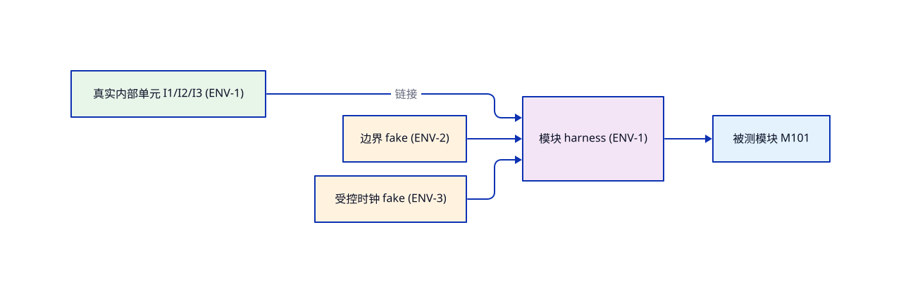

<!-- STD_DOCUMENT_COVER_BEGIN -->
# {{document_title}}

> STD 使用入口：[STD 主说明与执行流程](../../README.md)。这是工程文档标准模板；作者先读入口，再按项目已采用版本读取适用规范和专项指南。

| 文档字段 | 值 |
|---|---|
| Document ID | `{{document_id}}` |
| Document Version | `{{document_version}}` |
| Status | `{{document_status}}` |
| Project | `{{project}}` |
| Authority | `{{authority}}` |
| Document Owner | {{document_owner}} |
| Authors | {{authors}} |
| Created Date | `{{created_at}}` |
| Last Modified Date | `{{last_modified_at}}` |
| Template ID | `{{template_id}}` |
| Template Version | `{{template_version}}` |
| Template Conformance | `{{template_conformance}}` |
| Tailoring Reference | {{tailoring_ref}} |
| Migration Map Reference | {{migration_map_ref}} |
| Repository | `{{source_repository}}` |
| Canonical Path | `{{source_path}}` |
| Supersedes | {{supersedes}} |

> Reviewer、Approver、Approval Date 和 Release Tag 在进入相应状态时填写。Git commit/tag 是
> 外部不可变证据；不要在文档内容中伪造包含自身的 commit hash。
<!-- STD_DOCUMENT_COVER_END -->

<em>**编写建议**：本模板是模块测试方案，与 design.definition（模块设计阶段）一一对应。方案只登记测试分类与 Case 清单（每 Case 一行责任摘要），不写 Case 细节；逐 Case 展开一 Case 一文档（tests.module-case）。</em>

> **格式说明**：蓝色斜体为编写建议（指导如何填写，生成实例后保留）；灰色文字为虚构教学示例（以 `STD_TEMPLATE_EXAMPLE` 标记包裹，`new-design` 生成实例时自动剥离，不得当作项目事实或运行证据）；`<!-- TODO -->` 为待填槽位。颜色在 GitHub 等严格渲染器中降级为斜体/普通字，语义不变。

> 本方案绑定单一软件模块
> 本文档对设计验证项（VRC/V-xxx）的引用规则：只引用 ID 与状态，不复制定义/判据/Owner；判据与契约权威归 design 与 tests.asset-design，本文档若细化执行断言需在变更时回溯设计修订并记录。
：模块对象 ID 经 `--design-object-id` 写入 metadata；模块设计 ID/版本在 §1 固定。

### 模板定位：方案、用例与计划的边界

<em>**编写建议**：本方案对应模块设计阶段。分母来源是模块设计的对外接口（§9）、内部流程（§6/§7）、规则与状态转换，以及组装后才成立的保证；单元层归 tests.unit-test-scheme，子系统层归 tests.subsystem-test-scheme。</em>

- **权威分工**：模块层测试的 Case 清单（ID、分类、优先级、责任摘要、设计状态）以本方案为唯一登记处；单 Case 展开归 `tests.module-case`（一 Case 一文档）；活动组织归 `tests.module-test-plan`。
- **只有摘要**：本方案每条 Case 只写责任摘要（要测什么），不写输入构造、Oracle 或步骤。
- **下层 PASS 不关闭本层**；本层 PASS 不关闭上层组合目标。

### 状态语义：用例状态

<em>**编写建议**：本方案只持有 用例状态（Designed / Gap / Tailored-N/A）；实现状态（Planned/Implemented）在对应 case-design 文档，执行状态与 Verdict 只在 Run 报告。混层即违例。</em>

| 状态 | 取值 | 唯一权威记录处 | 禁止 |
|---|---|---|---|
| 用例状态 | `Designed` / `Gap`（具名缺口）/ `Tailored-N/A` | 本方案 §3 清单 | 未设计写成已设计；N/A 无设计事实依据 |

<em>**完成条件**：任一 Case 在本方案中只报设计状态；实现与执行状态可沿 Case ID 追到 case-design 文档与 Run 报告。</em>

## 1. 目标、范围与被测对象

<em>**本节目的**：固定整模块组装层的对象与边界。</em>
<em>**必须写清楚**：被测模块与设计基线；真实内部单元；边界外依赖替身；不证明的互操作与系统保证。</em>
<em>**抽象示例**：虚构 EX-MODULE 方案覆盖 select_ids 对外行为与校验先于筛选。</em>
<em>**完成条件**：读者能说清模块层测什么、不下放单元层什么。</em>

- 被测对象、设计基线与父对象：<!-- TODO --><!-- STD_TEMPLATE_EXAMPLE_BEGIN -->EX-MODULE/v1 的 M101 DirectorySelector，父对象 DIR<!-- STD_TEMPLATE_EXAMPLE_END -->
- 本阶段测试边界（真实组成 / 边界替身）：<!-- TODO --><!-- STD_TEMPLATE_EXAMPLE_BEGIN -->I1/I2/I3 全部真实；边界外无依赖<!-- STD_TEMPLATE_EXAMPLE_END -->
- 不证明的组合保证及承接入口：<!-- TODO --><!-- STD_TEMPLATE_EXAMPLE_BEGIN -->宿主并发准入、真实存储互操作；承接＝子系统/系统方案<!-- STD_TEMPLATE_EXAMPLE_END -->

## 1.5 测试方法与测试设计技术

<em>**本节目相**：固定模块层"怎么测"的方法论——单元层测试设计技术比较单一（mock 为主），上游测试常**多方法共存**，需逐一描述与边界。</em>
<em>**必须写清楚**：测试设计技术（按 Case 家族用哪些——等价类划分/边界值/状态转换/决策表/错误猜测/属性测试/变异测试等，写明对哪些 family 用哪种及不用哪种）；入场标准（设计文档到位、方案清单冻结、Case 实现就绪、替身 Verified、环境齐）；离场标准（分母每条来源有 Case 或缺口、Verdict 齐全、缺口有主、设计变更触发重跑）；自动化策略（哪些进 CI、单 Case 选择入口、断点/重跑规则、flaky 不掩盖根因）。</em>
<em>**抽象示例**：见下方灰字——模块层方法（含注入/边界/调用序等具体细节）。</em>
<em>**完成条件**：每个 §3 Case 行能指出所用方法与环境类型；入场/离场可判定；环境类型与 asset-design 契约对应；无未声明的环境依赖。</em>

| Case 家族 | 测试设计技术 | 环境类型引用 | 自动化与判定规则 |
|---|---|---|---|
| <!-- TODO：如 normal/boundary/negative/concurrency/recovery --> | <!-- TODO --> | <!-- 类型名（详见 §1.7） --> | <!-- TODO --> |

<!-- STD_TEMPLATE_EXAMPLE_BEGIN -->
**示例（虚构；模块层测试方法——含注入/边界/调用序等具体细节）**：

| Case 家族 | 测试设计技术 | 环境类型引用 | 自动化与判定 |
|---|---|---|---|
| normal | 组装后真实调用 + 等价类划分 | 真实内部单元 + 边界 fake | CI 跑全集；Case 失败不阻断后续 |
| | · 注入：合法目录名/类别组合（多类、多记录） | | · 断言返回值与目录 ID 一致 |
| boundary | 边界值（容量上限、输入长度） | 边界 fake 配置注入 | 单 Case --filter；超界→reject |
| | · 注入：合法目录+4096 条（=上限）/4097 条（>上限）；单条 payload 上限 | | · 拒绝路径须显式返回 error，不允许静默截断 |
| negative | 错误猜测 + 选定故障注入（边界依赖） | 注入 fake（计数=命中） | 注入计数=0 标 INVALID；不掩盖 |
| | · 注入：边界 fake 一次性返回错误/超时/拒绝；故障绑定具体产品步骤（I2→I3 之间） | | · 故障前/后副作用由公开入口观察，不可直改内部 |
| concurrency | 线程对偶 + 借用/生命（单元层已覆盖） | 受控时钟 fake | 单元层已验证，本层不重复 |
| | · 注入：两线程调用 select_ids，前置 fake 模拟准入抢占 | | · 验证拒绝路径不返回 Ok，不复用已释放槽位 |
<!-- STD_TEMPLATE_EXAMPLE_END -->

### 测试设计技术选型表（按 Case 家族）
<em>**本节目的**：固定本层"怎么测"——按 Case 家族显式选用的设计技术与反模式；技术选择归本表不在灰例中重复。</em>

| Case 家族 | 选用的设计技术 | 选用理由 | 不选用的反模式 |
|---|---|---|---|
| <!-- normal --> | <!-- 等价类划分 + 边界值抽样 --> | <!-- 覆盖合法输入空间，验证主路径 --> | <!-- 不用全部输入矩阵（规模爆炸） --> |
| <!-- boundary --> | <!-- 边界值（上下限/零/1/刚好满） --> | <!-- 边界是缺陷高发区，验证边界 + 边界附近 1 步 --> | <!-- 不用随机/模糊测试（不可复现） --> |
| <!-- negative --> | <!-- 错误猜测 + 反例驱动 --> | <!-- 异常路径以"设计已识别的反例"为准 --> | <!-- 不用模糊异常注入（无 oracle / 无归因） --> |
| <!-- concurrency --> | <!-- 线程对偶 / 顺序交错 --> | <!-- 状态机驱动，固定种子控制时序 --> | <!-- 不用随机并发（不可复现 + flaky） --> |
| <!-- recovery --> | <!-- kill/异常路径 + RAII 恢复 --> | <!-- 资源归还与回滚基线需在失败路径覆盖 --> | <!-- 不用"重试"模拟恢复（掩盖根因） --> |
| <!-- performance --> | <!-- 单 Case 基线采样 + 多次回归比对 --> | <!-- 上游已验证语义，非性能预算基线 --> | <!-- 不用负载/容量测试（本层不负责系统预算） --> |
| <!-- security --> | <!-- 鉴权/注入/脱敏冒烟 + 资产级契约 --> | <!-- 上游/集成层已覆盖，本层仅冒烟 --> | <!-- 不用模糊安全测试（不可复现 + 上游责任） --> |

## 1.6 替身使用策略与边界

<em>**本节目相**：固定模块层替身的使用，让 §3 清单的替身选择可解释可复核。</em>
<em>**必须写清楚**：替身决策准则（按所有权/可控性/真实性分类——内部真实/边界 fake/真协议测试实例/容器等）；替身形态（mock/fake/stub/spy 的取舍与代价）；替身保真度——契约与自检归 `tests.asset-design`（一资产一文档），方案与 Case 只引用其 ID 不复制行为；交互断言 vs 返回值断言（优先返回值，必要时断言关键调用序，但不耦合内部实现）；反模式（不 mock 你不拥有的接口、不 mock 值对象/纯数据、不为凑覆盖率而 mock、不过度断言内部细节）；与 §1 边界、§3 Case 清单、`tests.module-case` §2 替身选择一致。</em>
<em>**抽象示例**：见下方灰字——模块层替身矩阵。</em>
<em>**完成条件**：每个 §3 Case 行能指出替身类型与契约文档 ID；替身矩阵与 asset-design 一一对应；反模式逐项被排除并有理由。</em>

| 协作者类型 | 替身形态 | 替身契约文档（tests.asset-design） | 决策理由 |
|---|---|---|---|
| <!-- TODO --> | <!-- mock/fake/stub/spy --> | <!-- TODO：asset 文档 ID --> | <!-- TODO --> |

<!-- STD_TEMPLATE_EXAMPLE_BEGIN -->
**示例（虚构；模块层替身矩阵）**：

| 协作者 | 形态 | 替身契约 | 理由 |
|---|---|---|---|
| 真实内部单元（I1/I2/I3） | 边界 fake（跨子系统接口） | 受控时钟 fake |
| · 契约与自检归 tests.asset-design | | · 不 mock 你不拥有的对象 |
<!-- STD_TEMPLATE_EXAMPLE_END -->

## 1.7 测试环境类型（方案定义）

<em>**本节目相**：固定本层"在哪类环境上跑"——列出环境**类型**（抽象类别）及其行为/真伪与契约文档（tests.asset-design 或产品规范）；同一类型可多套实例（多 docker 用于并行），具体**实例编号与分配**由 `tests.module-test-plan` §4 编排，Case 在 §2 通过「环境类型 + ENV 实例编号」引用，不在本文档重复描述环境本身。</em>
<em>**抽象示例**：见下方灰字——模块层测试环境类型（含契约与用法具体细节）+ 环境拓扑（ENV 类型 → ENV 实例 → 被测对象）。</em>
<em>**完成条件**：每个 §3 Case 行能指出所用环境类型；类型与 asset-design 契约对应；无未声明的环境依赖。</em>

| 环境类型 | 行为/真伪 | 契约文档 | 在本层用例中的角色 |
|---|---|---|---|
| <!-- TODO --> | <!-- TODO --> | <!-- TODO --> | <!-- TODO --> |

<!-- STD_TEMPLATE_EXAMPLE_BEGIN -->
**示例（虚构；模块层测试环境类型——含契约与用法具体细节）**：

**拓扑**（ENV 类型 → ENV 实例 → 被测对象）：
| 环境类型 | 行为/真伪 | 契约文档 | 在本层用例中的角色 |
|---|---|---|---|
| 真实内部单元（I1/I2/I3） | 真实 | — | 组装后真实调用用例 |
| · 契约：源码即真实单元 | | · 用法：模块 harness 链接全部内部单元为真实 || 边界 fake（跨子系统接口） | 只代返回值/超时 | FAKE-REG | 跨边界用例 |
| · 契约：FAKE-REG 替代跨子系统边界，配置可控 | | · 用法：测试前配置失败/超时；不持 Care 调用外的副作用 || 受控时钟 fake | 单调推进 | HARNESS-EXM-CLOCK | 时间/并发用例 |
| · 契约：advance(ms) 单调 | | || 冻结向量集 | 真实但固定 | EX-MODULE 冻结集 | 输入/边界用例 |
| · 契约：固定输入集 | | · 用法：边界测试从冻结集读取 |

**总体说明**：C++20 模块 harness 直接链接全部内部单元（I1/I2/I3 全真实）；边界 fake 引用 tests.asset-design（FAKE-REG 等）；CI 入口 runner --filter；并行隔离按模块实例+端口+临时目录；缺编译器记 Blocked，不静默换工具链。
<!-- STD_TEMPLATE_EXAMPLE_END -->

## 2. 测试分类体系

<em>**本节目的**：固定本阶段的测试分类体系与适用裁剪。</em>
<em>**必须写清楚**：采用 STD 统一家族词表（normal/boundary/negative/concurrency/recovery/security/performance/endurance），逐类声明本阶段适用性与裁剪依据；不适用不等于没写 Case，须在 §4 给事实。</em>
<em>**抽象示例**：见下方灰字分类示例。</em>
<em>**完成条件**：分类体系可裁剪可追溯，每个适用分类在 §3 清单中至少有 Case 或缺口。</em>

| 分类（STD 家族词表） | 本阶段适用性 | 裁剪依据 |
|---|---|---|
| <!-- normal / boundary / negative / concurrency / recovery / security / performance / endurance --> | | |

<!-- STD_TEMPLATE_EXAMPLE_BEGIN -->
**示例（虚构；分类适用性）**：
| normal / boundary / negative / concurrency | 适用 | — |
| recovery | Tailored-N/A | 同步只读、无跨调用状态（模块设计 §10） |
<!-- STD_TEMPLATE_EXAMPLE_END -->

## 3. 覆盖分母与 Case 清单

<em>**本节目的**：把 design.definition 的适用来源 ID 转成 Case 清单——测试分母的唯一登记。</em>
<em>**必须写清楚**：一个来源 ID 至少一条记录（可多 Case 分担，分别写责任摘要）；以设计文档（design §12/§14）的验证项 VRC 清单为分母逐项对账：每个 VRC 至少一个 Case——验证项是设计声明的必测点，本清单只引用其 ID 不复制定义、不做附录；Case ID 稳定且唯一（MT-<对象>-<NNN>）；责任摘要只写“要测什么、边界在哪”，不写输入与 Oracle；设计状态按状态语义；未实现与 NOT_RUN 不删；不适用转 §4。</em>

> 来源 ID 与设计验证项（VRC）的边界：本表登记 ID+责任摘要；判据/Oracle/Owner/契约权威归 design 与 tests.asset-design，不在此行复写；变更设计时同步 VRC 同步本清单。
<em>**抽象示例**：见下表灰字。</em>
<em>**完成条件**：每个适用来源 ID 有 Case 或缺口；每个 Case ID 可追到（或计划有）case-design 文档。</em>

| 来源 ID / 固定版本 | 设计验证项 ID | Case ID | 分类 | 优先级 | 责任摘要（要测什么） | 设计状态 | 上级组合验证入口 |
|---|---|---|---|---|---|---|
| <!-- TODO --> | <!-- TODO --> | | | <!-- TODO --> | <!-- TODO --> | |

<!-- STD_TEMPLATE_EXAMPLE_BEGIN -->
**示例（虚构；一来源至少一条）**：
| 来源 ID / 固定版本 | 设计验证项 ID | Case ID | 分类 | 优先级 | 责任摘要（要测什么） | 设计状态 | 上级组合验证入口 |
|---|---|---|---|---|---|---|
| EX-CON-1 / EX-MODULE v1 | VRC-M101-001 | MT-EXM-001 | normal | P1 | 合法输入返回确定顺序 IDs 且输入不变 | Designed | 宿主并发准入（NOT_RUN） |
| 校验先于筛选（§7） | VRC-M101-002 | MT-EXM-002 | negative | P0 | 非匹配类别中的重复 ID 仍整批拒绝 | Designed | — |
| EX-CON-2 / 同基线 | VRC-M101-003 | MT-EXM-003 | boundary | P1 | 4096 恰好通过、4097 拒绝 | Designed | — |
<!-- STD_TEMPLATE_EXAMPLE_END -->

## 4. 不适用与缺口裁决

<em>**本节目的**：区分“不适用”与“尚未设计”。</em>
<em>**必须写清楚**：Tailored-N/A 必须引用设计章节事实；Gap 须有 Owner 与恢复条件；两者都不从分母静默消失。</em>
<em>**抽象示例**：见灰字。</em>
<em>**完成条件**：每条裁决有事实或 Owner；无“顺手 N/A”。</em>

| 来源 ID / 事实依据 | 裁决（Tailored-N/A 或 Gap） | Owner / 恢复条件 |
|---|---|---|
| <!-- TODO --> | | |

<!-- STD_TEMPLATE_EXAMPLE_BEGIN -->
**示例（虚构；不适用与缺口裁决）**：

| 宿主并发准入 / 父设计入口未定义 | Gap（G-EX-1） | 父设计 / 子系统测试评审 |
<!-- STD_TEMPLATE_EXAMPLE_END -->

## 5. 文档联动与清单变更规则

<em>**本节目的**：固定方案—用例—计划的联动规则，防三处漂移。</em>
<em>**必须写清楚**：新 Case 先入本清单再建 case-design 文档（文档 ID＝Case ID）；清单变更须同步计划构成表；写明方案冻结/版本规则。</em>
<em>**抽象示例**：见灰字。</em>
<em>**完成条件**：清单与 case-design 文档一一对应；计划只引用不复制。</em>

- 方案冻结与变更规则：<!-- TODO --><!-- STD_TEMPLATE_EXAMPLE_BEGIN -->清单随模块设计基线冻结；变更同步模块计划构成表<!-- STD_TEMPLATE_EXAMPLE_END -->
- 与 case-design / 计划的同步规则：<!-- TODO --><!-- STD_TEMPLATE_EXAMPLE_BEGIN -->Case 文档 ID＝Case ID；tests.module-test-plan 引用本方案版本<!-- STD_TEMPLATE_EXAMPLE_END -->

<!-- STD_TEMPLATE_EXAMPLE_BEGIN -->
新增 MT-EXM-005 先入清单再建 Case 文档；模块计划构成表引用本方案 v1.0。
<!-- STD_TEMPLATE_EXAMPLE_END -->

<!-- 交付自查：每个适用来源 ID 是否都有 Case 或具名缺口；清单里的每个 Case ID 是否都有（或计划有）对应 case-design 文档；方案里是否混入了输入构造或 Oracle 细节？ -->

## 附录 A. 本层设计验证项 VRC 汇集（对照用）

<em>**本节目的**：把设计文档声明的本层验证项 VRC 汇集于此，供逐项对照 §3 清单的覆盖。</em>
<em>**必须写清楚**：VRC 清单以设计文档（design §12/§14）为唯一权威，本附录只登记 ID 与要验证什么，不复制判据/Oracle 定义；设计变更时本附录同步；每个 VRC 必须在 §3 清单有至少一个 Case，否则登记缺口。</em>
<em>**抽象示例**：见下方灰字。</em>
<em>**完成条件**：本附录 VRC 集合与设计文档一致；每个 VRC 在 §3 清单有 Case 或缺口。</em>

| 设计验证项 ID | 要验证什么（名称/责任） | 设计来源 | §3 Case 覆盖 |
|---|---|---|---|
| <!-- TODO --> | | | |

<!-- STD_TEMPLATE_EXAMPLE_BEGIN -->
**示例（虚构）**：

| 设计验证项 ID | 要验证什么 | 设计来源 | §3 Case 覆盖 |
|---|---|---|---|
| VRC-M101-001 | 输入不可变、整批返回 | 模块设计 §14.2 | MT-EXM-001 |
| VRC-M101-002 | 校验先于筛选 | 同 §14.2 | MT-EXM-002 |
| VRC-M101-003 | 容量上限 4096 | 同 §14.2 | MT-EXM-003 |
<!-- STD_TEMPLATE_EXAMPLE_END -->
